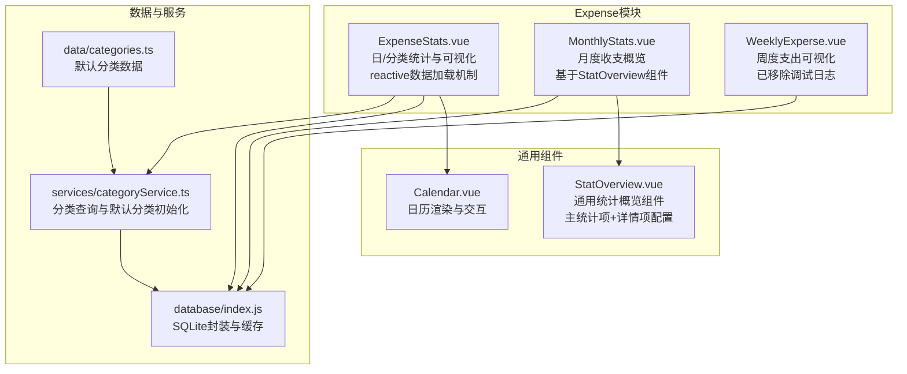
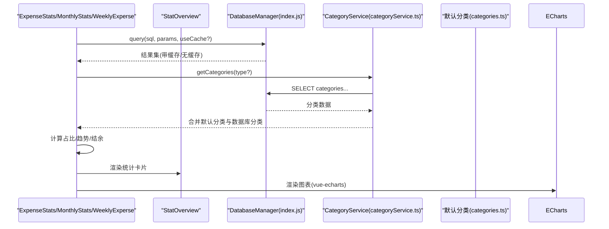
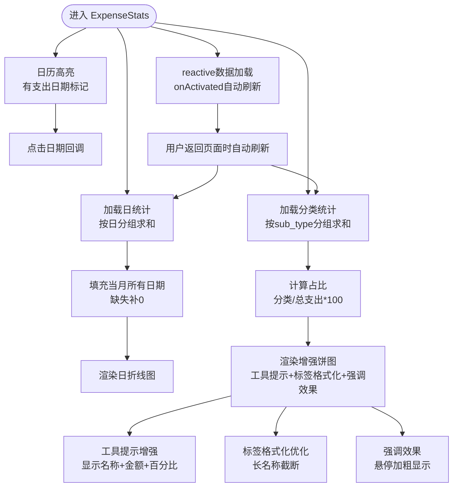
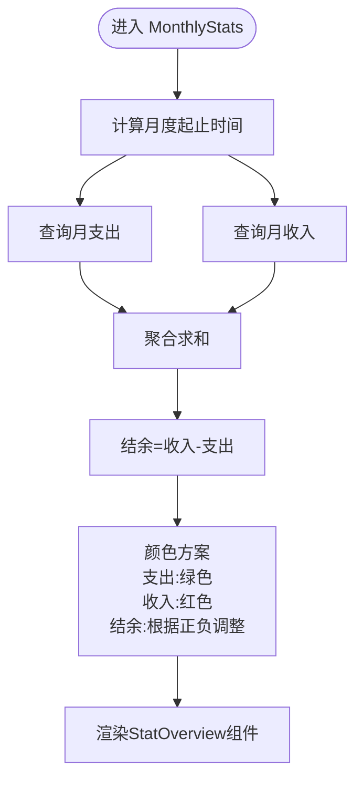
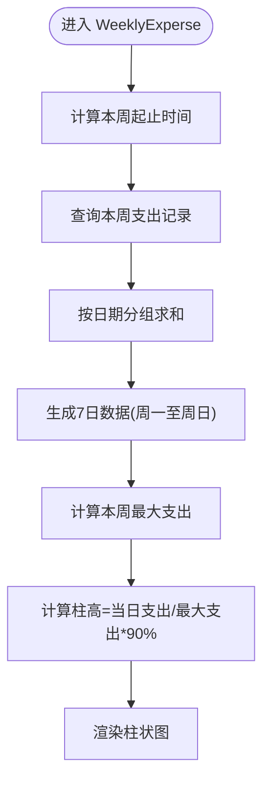
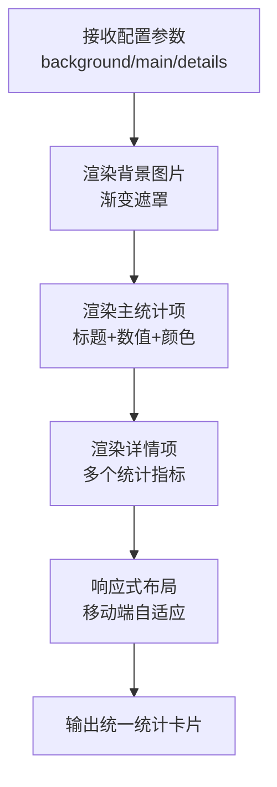
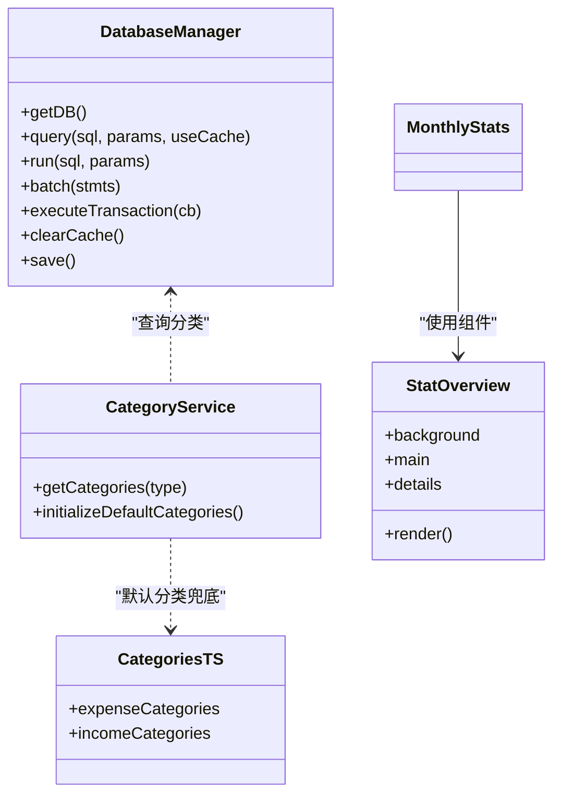
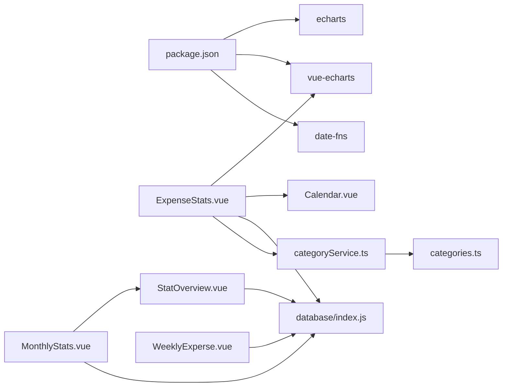

# 支出统计分析

<cite>
**本文引用的文件**
- [ExpenseStats.vue](file://src/components/mobile/expense/ExpenseStats.vue)
- [MonthlyStats.vue](file://src/components/mobile/expense/MonthlyStats.vue)
- [WeeklyExperse.vue](file://src/components/mobile/expense/WeeklyExperse.vue)
- [StatOverview.vue](file://src/components/common/StatOverview.vue)
- [Calendar.vue](file://src/components/common/calendar/Calendar.vue)
- [index.js](file://src/database/index.js)
- [categoryService.ts](file://src/services/categoryService.ts)
- [categories.ts](file://src/data/categories.ts)
- [package.json](file://package.json)
</cite>

## 更新摘要
**变更内容**
- WeeklyExperse组件已移除11个console.log调试语句，消除浏览器控制台冗余信息，提升代码清洁度和性能
- MonthlyStats 组件已完全重构为使用 StatOverview 通用组件，提供统一的统计卡片展示
- 新增 StatOverview 通用组件，支持灵活的主统计项和详情项配置
- 更新颜色方案：月度统计采用绿色配色方案表示支出，自动根据余额状态调整颜色
- 保持 ExpenseStats 组件的原有功能不变
- 增强组件间的复用性和一致性

## 目录
1. [简介](#简介)
2. [项目结构](#项目结构)
3. [核心组件](#核心组件)
4. [架构总览](#架构总览)
5. [详细组件分析](#详细组件分析)
6. [依赖关系分析](#依赖关系分析)
7. [性能与缓存策略](#性能与缓存策略)
8. [故障排查指南](#故障排查指南)
9. [结论](#结论)
10. [附录](#附录)

## 简介
本文件面向开发者与业务分析师，系统性梳理"支出统计分析"功能的实现与扩展方法。重点覆盖以下四个组件：
- ExpenseStats：按日/分类的支出统计与可视化，支持月度筛选与ECharts集成，具备 reactive 数据加载机制。
- MonthlyStats：月度收支概览，现基于 StatOverview 通用组件实现，提供统一的统计卡片展示，采用绿色配色方案表示支出，自动根据余额状态调整颜色。
- WeeklyExperse：周度支出可视化，按自然周统计并生成柱状图，已移除调试日志输出，提升代码清洁度。
- StatOverview：新增的通用统计概览组件，支持灵活的主统计项和详情项配置，提供一致的视觉风格。

文档同时说明统计数据来源（SQLite数据库）、实时计算与缓存策略，并给出ECharts集成与配置要点，帮助快速理解与扩展分析维度。

## 项目结构
支出统计分析功能位于移动端expense模块，配合通用统计概览组件与数据库层、分类服务共同构成完整统计链路。

**图表来源**
- [ExpenseStats.vue:1-887](file://src/components/mobile/expense/ExpenseStats.vue#L1-L887)
- [MonthlyStats.vue:1-191](file://src/components/mobile/expense/MonthlyStats.vue#L1-L191)
- [WeeklyExperse.vue:1-235](file://src/components/mobile/expense/WeeklyExperse.vue#L1-L235)
- [StatOverview.vue:1-119](file://src/components/common/StatOverview.vue#L1-L119)
- [Calendar.vue:1-477](file://src/components/common/Calendar.vue#L1-L477)
- [index.js:1-933](file://src/database/index.js#L1-L933)
- [categoryService.ts:1-260](file://src/services/categoryService.ts#L1-L260)
- [categories.ts:1-45](file://src/data/categories.ts#L1-L45)

## 核心组件
- ExpenseStats：提供"日统计报表（折线）+分类报表（饼图）+日历视图"的综合统计界面，支持按年/月切换并刷新，具备 reactive 数据加载机制。
- MonthlyStats：现基于 StatOverview 通用组件实现月度收支概览，展示"月支出、月收入、结余"三大指标，采用绿色配色方案表示支出，自动根据余额状态调整颜色方案。
- WeeklyExperse：按自然周统计每日支出，生成柱状图，便于观察本周消费趋势，已移除调试日志输出。
- StatOverview：新增的通用统计概览组件，支持灵活的主统计项和详情项配置，提供统一的视觉风格和响应式布局。

**章节来源**
- [ExpenseStats.vue:55-71](file://src/components/mobile/expense/ExpenseStats.vue#L55-L71)
- [MonthlyStats.vue:1-29](file://src/components/mobile/expense/MonthlyStats.vue#L1-L29)
- [WeeklyExperse.vue:1-18](file://src/components/mobile/expense/WeeklyExperse.vue#L1-L18)
- [StatOverview.vue:1-35](file://src/components/common/StatOverview.vue#L1-L35)

## 架构总览
统计分析的数据流自下而上：数据库层负责数据持久化与查询；服务层提供分类与默认分类能力；组件层负责UI与图表渲染。

**图表来源**
- [ExpenseStats.vue:125-255](file://src/components/mobile/expense/ExpenseStats.vue#L125-L255)
- [MonthlyStats.vue:40-88](file://src/components/mobile/expense/MonthlyStats.vue#L40-L88)
- [WeeklyExperse.vue:77-154](file://src/components/mobile/expense/WeeklyExperse.vue#L77-L154)
- [StatOverview.vue:25-35](file://src/components/common/StatOverview.vue#L25-L35)
- [index.js:199-264](file://src/database/index.js#L199-L264)
- [categoryService.ts:14-69](file://src/services/categoryService.ts#L14-L69)
- [categories.ts:9-45](file://src/data/categories.ts#L9-L45)

## 详细组件分析

### ExpenseStats 组件（日/分类统计与可视化）
- 功能职责
  - 月度筛选：通过年/月选择器切换统计周期。
  - 日统计：按日聚合支出，生成折线图，标注当月每日支出。
  - 分类统计：按sub_type分组统计支出，生成饼图，包含占比计算。
  - 日历联动：日历高亮显示有支出的日期，点击回调预留扩展。
  - reactive数据加载：使用Vue 3的响应式系统，支持onActivated生命周期钩子自动刷新。
- 数据来源与算法
  - 日统计：按created_at日期分组求和，填充当月所有日期，缺失日期补0。
  - 分类统计：按sub_type分组求和，计算占比 = 分类支出/总支出×100。
  - 占比为空时：若当月无支出，饼图按默认分类均分展示，保证可视化可用性。
  - 数据刷新机制：onActivated钩子确保用户返回页面时自动重新加载数据。
- 增强的ECharts集成
  - 注册渲染器与图表组件，使用vue-echarts绑定option。
  - 折线图：smooth曲线、面积填充、圆点标记。
  - 饼图重新设计：工具提示增强、标签格式化优化、强调效果等视觉改进。
- 依赖与交互
  - 依赖数据库查询transactions表，按type='账户支出'过滤。
  - 依赖分类服务获取分类名称映射，提升可读性。
  - 依赖通用日历组件Calendar进行日期高亮与点击事件。

**图表来源**
- [ExpenseStats.vue:125-255](file://src/components/mobile/expense/ExpenseStats.vue#L125-L255)
- [ExpenseStats.vue:259-341](file://src/components/mobile/expense/ExpenseStats.vue#L259-L341)
- [ExpenseStats.vue:431-436](file://src/components/mobile/expense/ExpenseStats.vue#L431-L436)
- [Calendar.vue:1-477](file://src/components/common/Calendar.vue#L1-L477)

**章节来源**
- [ExpenseStats.vue:74-87](file://src/components/mobile/expense/ExpenseStats.vue#L74-L87)
- [ExpenseStats.vue:125-255](file://src/components/mobile/expense/ExpenseStats.vue#L125-L255)
- [ExpenseStats.vue:259-341](file://src/components/mobile/expense/ExpenseStats.vue#L259-L341)
- [ExpenseStats.vue:428-432](file://src/components/mobile/expense/ExpenseStats.vue#L428-L432)
- [ExpenseStats.vue:431-436](file://src/components/mobile/expense/ExpenseStats.vue#L431-L436)

### MonthlyStats 组件（月度收支概览）
**更新** MonthlyStats 组件已完全重构为使用 StatOverview 通用组件，提供统一的统计卡片展示。

- 功能职责
  - 基于 StatOverview 组件展示"月支出、月收入、结余"三大指标。
  - 采用绿色配色方案表示支出，自动根据余额状态调整颜色方案。
  - 使用背景图片增强视觉效果。
- 计算逻辑
  - 月支出 = SUM(transactions.amount) WHERE type='账户支出' 且 日期在当月范围内
  - 月收入 = SUM(transactions.amount) WHERE type='账户收入' 且 日期在当月范围内
  - 结余 = 月收入 - 月支出
  - 颜色方案：支出使用绿色(#67c23a)，收入使用红色(#f56c6c)，结余为负数时使用绿色，正数时使用红色。
- 错误处理
  - 查询异常时使用默认值0，保证UI稳定。

**图表来源**
- [MonthlyStats.vue:32-37](file://src/components/mobile/expense/MonthlyStats.vue#L32-L37)
- [MonthlyStats.vue:40-88](file://src/components/mobile/expense/MonthlyStats.vue#L40-L88)
- [MonthlyStats.vue:27-29](file://src/components/mobile/expense/MonthlyStats.vue#L27-L29)

**章节来源**
- [MonthlyStats.vue:1-191](file://src/components/mobile/expense/MonthlyStats.vue#L1-L191)

### WeeklyExperse 组件（周度支出可视化）
**更新** WeeklyExperse 组件已移除11个console.log调试语句，消除浏览器控制台冗余信息，提升代码清洁度和性能。

- 功能职责
  - 计算本周自然周（周一至周日）的每日支出，生成柱状图。
  - 按最大支出动态计算柱高，统一视觉比例。
  - 已移除调试日志输出，提升代码清洁度。
- 计算逻辑
  - 本周起止时间：以当前时间为基准，推导周一与周日。
  - 按created_at日期分组，缺失日期补0。
  - 柱高 = 归一化(当日支出/本周最大支出) × 90%。
- 可视化
  - 每日标签（周一至周日），柱状图高度随数值变化。
- 性能优化
  - 移除console.log调试语句，减少浏览器控制台输出，提升运行性能。
  - 保持原有的错误处理机制，确保数据加载失败时的降级表现。

**图表来源**
- [WeeklyExperse.vue:58-74](file://src/components/mobile/expense/WeeklyExperse.vue#L58-L74)
- [WeeklyExperse.vue:77-154](file://src/components/mobile/expense/WeeklyExperse.vue#L77-L154)

**章节来源**
- [WeeklyExperse.vue:1-235](file://src/components/mobile/expense/WeeklyExperse.vue#L1-L235)

### StatOverview 组件（新增通用统计概览）
**新增** StatOverview 是一个全新的通用统计概览组件，提供统一的统计卡片展示功能。

- 功能职责
  - 支持灵活的主统计项和详情项配置。
  - 提供统一的视觉风格和响应式布局。
  - 支持背景图片和渐变遮罩效果。
- 配置接口
  - background: 背景图片路径
  - main: 主统计项数组，每个项包含title、value、color属性
  - details: 详情项数组，每个项包含title、value、color属性
- 视觉设计
  - 背景图片使用渐变遮罩，确保文字可读性。
  - 主统计项使用较大字体，详情项使用较小字体。
  - 支持自定义颜色方案。
- 响应式设计
  - 支持不同屏幕尺寸的自适应布局。
  - 移动端优化的字体大小和间距。

**图表来源**
- [StatOverview.vue:25-35](file://src/components/common/StatOverview.vue#L25-L35)
- [StatOverview.vue:1-119](file://src/components/common/StatOverview.vue#L1-L119)

**章节来源**
- [StatOverview.vue:1-119](file://src/components/common/StatOverview.vue#L1-L119)

### 数据来源与更新机制
- 数据库层（DatabaseManager）
  - 单例连接，支持Capacitor SQLite（原生）与sql.js（Web）。
  - 查询缓存：Map缓存键为"SQL+参数序列化"，命中则直接返回。
  - 批处理与事务：批量执行与事务提交，减少IO与提升一致性。
  - Web端持久化：延迟保存到localStorage，降低频繁写入成本。
- 分类服务（CategoryService）
  - 优先从数据库categories表获取，合并默认分类（去重），按类型过滤。
  - 初始化默认分类：若数据库为空则插入默认支出/收入分类。
- 默认分类（categories.ts）
  - 提供默认支出与收入分类清单，用于兜底与初始化。

**图表来源**
- [index.js:21-32](file://src/database/index.js#L21-L32)
- [index.js:199-264](file://src/database/index.js#L199-L264)
- [categoryService.ts:14-69](file://src/services/categoryService.ts#L14-L69)
- [categories.ts:9-45](file://src/data/categories.ts#L9-L45)
- [StatOverview.vue:25-35](file://src/components/common/StatOverview.vue#L25-L35)

**章节来源**
- [index.js:1-933](file://src/database/index.js#L1-L933)
- [categoryService.ts:1-260](file://src/services/categoryService.ts#L1-L260)
- [categories.ts:1-45](file://src/data/categories.ts#L1-L45)

## 依赖关系分析
- ECharts与vue-echarts
  - ExpenseStats通过vue-echarts渲染折线图与饼图，注册渲染器与图表组件。
  - 依赖包：echarts、vue-echarts。
- 日期工具
  - WeeklyExperse使用date-fns计算本周起止时间。
- 日历组件
  - ExpenseStats的日历高亮与点击事件由通用Calendar组件提供。
- 数据库与分类
  - ExpenseStats、MonthlyStats、WeeklyExperse均依赖数据库查询transactions表，依赖分类服务获取分类名称映射。
- StatOverview组件
  - MonthlyStats通过StatOverview组件实现统一的统计卡片展示。

**图表来源**
- [package.json:19-36](file://package.json#L19-L36)
- [ExpenseStats.vue:74-87](file://src/components/mobile/expense/ExpenseStats.vue#L74-L87)
- [MonthlyStats.vue:13](file://src/components/mobile/expense/MonthlyStats.vue#L13)
- [WeeklyExperse.vue:22-23](file://src/components/mobile/expense/WeeklyExperse.vue#L22-L23)
- [Calendar.vue:1-477](file://src/components/common/Calendar.vue#L1-L477)
- [index.js:1-933](file://src/database/index.js#L1-L933)
- [categoryService.ts:1-260](file://src/services/categoryService.ts#L1-L260)
- [categories.ts:1-45](file://src/data/categories.ts#L1-L45)
- [StatOverview.vue:25-35](file://src/components/common/StatOverview.vue#L25-L35)

**章节来源**
- [package.json:1-74](file://package.json#L1-L74)

## 性能与缓存策略
- 查询缓存
  - DatabaseManager对query结果进行Map缓存，键为"SQL+参数序列化"，命中直接返回，显著降低重复查询成本。
- 连接与事务
  - 单例连接避免频繁打开关闭；事务与批处理减少IO次数，提升批量写入效率。
- Web端持久化
  - 使用debouncedSave延迟保存数据库到localStorage，节流写入频率。
- 图表渲染
  - ExpenseStats使用vue-echarts，按需刷新option，避免全量重建DOM。
- **reactive数据加载**
  - ExpenseStats使用Vue 3的onActivated生命周期钩子，在组件激活时自动重新加载数据，提升用户体验。
- **StatOverview组件优化**
  - 通用组件设计减少重复代码，提升开发效率。
  - 统一的颜色方案和布局，降低维护成本。
  - 响应式设计确保在不同设备上的良好体验。
- **WeeklyExperse组件优化**
  - 移除11个console.log调试语句，消除浏览器控制台冗余信息，提升代码清洁度和性能。
  - 保持原有的错误处理机制，确保数据加载失败时的降级表现。

**章节来源**
- [index.js:199-264](file://src/database/index.js#L199-L264)
- [index.js:379-408](file://src/database/index.js#L379-L408)
- [ExpenseStats.vue:431-436](file://src/components/mobile/expense/ExpenseStats.vue#L431-L436)
- [StatOverview.vue:1-119](file://src/components/common/StatOverview.vue#L1-L119)
- [WeeklyExperse.vue:75-137](file://src/components/mobile/expense/WeeklyExperse.vue#L75-L137)

## 故障排查指南
- 数据库连接失败
  - 现象：查询报错或返回默认值。
  - 排查：检查db.connect()是否成功；查看DatabaseManager.getStatus()状态；确认平台（原生/Web）适配。
- 分类名称缺失
  - 现象：饼图显示sub_type而非中文名称。
  - 排查：确认CategoryService.getCategories()返回值；检查数据库categories表是否初始化。
- 图表不显示或空白
  - 现象：ECharts未渲染或Y轴异常。
  - 排查：确认ECharts注册顺序；检查dailyChartOption、categoryChartOption是否正确赋值；当月无支出时饼图按默认分类均分展示。
- 本周数据异常
  - 现象：周柱状图日期错位或高度异常。
  - 排查：确认getWeekRange()起止时间计算；检查transactions.created_at时区与格式；确保按日期字符串分组。
- **MonthlyStats组件问题**
  - 现象：统计卡片显示异常或颜色不正确。
  - 排查：确认StatOverview组件的props配置；检查颜色方案逻辑；验证数据计算是否正确。
- **StatOverview组件问题**
  - 现象：背景图片显示异常或文字不可读。
  - 排查：确认background属性路径；检查渐变遮罩效果；验证响应式布局。
- **reactive数据加载问题**
  - 现象：用户返回页面后统计数据未刷新。
  - 排查：确认onActivated钩子是否正确触发；检查loadDailyExpenses、loadCategoryExpenses、loadDailyChartData函数调用；验证Vue 3响应式系统的watchers是否正常工作。
- **WeeklyExperse组件问题**
  - 现象：组件无法正常加载数据或显示空白。
  - 排查：确认数据库连接是否正常；检查getWeekRange()函数的日期计算逻辑；验证transactions查询条件；确认错误处理机制是否正常工作。

**章节来源**
- [MonthlyStats.vue:88-94](file://src/components/mobile/expense/MonthlyStats.vue#L88-L94)
- [WeeklyExperse.vue:140-153](file://src/components/mobile/expense/WeeklyExperse.vue#L140-L153)
- [ExpenseStats.vue:285-294](file://src/components/mobile/expense/ExpenseStats.vue#L285-L294)
- [ExpenseStats.vue:431-436](file://src/components/mobile/expense/ExpenseStats.vue#L431-L436)
- [index.js:826-834](file://src/database/index.js#L826-L834)

## 结论
ExpenseStats、MonthlyStats、WeeklyExperse与StatOverview四者形成"日/周/月"多维度的支出分析闭环：ExpenseStats提供精细化的分类与趋势洞察，MonthlyStats通过StatOverview组件提供统一的月度概览，WeeklyExperse聚焦短期消费行为，StatOverview作为通用组件提升整体设计一致性。依托DatabaseManager的缓存与事务机制、CategoryService的分类合并策略，以及ECharts的高效渲染，系统在移动端具备良好的性能与可扩展性。新增的StatOverview组件显著提升了代码复用性和维护效率，开发者可在此基础上增加同比/环比、预算对比、预测模型等分析维度。WeeklyExperse组件的调试日志清理进一步提升了代码质量，减少了不必要的控制台输出。

## 附录

### 统计公式与计算逻辑速查
- 月度收支
  - 月支出 = SUM(transactions.amount) WHERE type='账户支出' 且 created_at 在当月
  - 月收入 = SUM(transactions.amount) WHERE type='账户收入' 且 created_at 在当月
  - 结余 = 月收入 - 月支出
  - 颜色方案：支出使用绿色(#67c23a)，收入使用红色(#f56c6c)，结余为负数时使用绿色，正数时使用红色。
- 周度统计
  - 本周起止时间：以当前时间为基准，推导周一与周日
  - 每日支出 = SUM(transactions.amount) 按日期分组
  - 柱高 = 归一化(当日支出/本周最大支出) × 90%
- 日/分类统计
  - 日折线：按created_at日期分组求和，填充当月所有日期
  - 分类饼图：按sub_type分组求和，占比 = 分类支出/总支出×100；无数据时默认分类均分
- StatOverview组件
  - 配置接口：background、main、details
  - 视觉设计：背景图片+渐变遮罩、主统计项大字体、详情项小字体
  - 响应式设计：移动端自适应布局
- **reactive数据加载**
  - onActivated钩子：组件激活时自动调用数据加载函数
  - 自动刷新：用户返回页面时自动重新加载统计数据
- **WeeklyExperse组件优化**
  - 已移除11个console.log调试语句，消除浏览器控制台冗余信息
  - 保持原有的错误处理机制，确保数据加载失败时的降级表现

**章节来源**
- [MonthlyStats.vue:55-94](file://src/components/mobile/expense/MonthlyStats.vue#L55-L94)
- [MonthlyStats.vue:27-29](file://src/components/mobile/expense/MonthlyStats.vue#L27-L29)
- [WeeklyExperse.vue:58-74](file://src/components/mobile/expense/WeeklyExperse.vue#L58-L74)
- [WeeklyExperse.vue:77-154](file://src/components/mobile/expense/WeeklyExperse.vue#L77-L154)
- [ExpenseStats.vue:125-255](file://src/components/mobile/expense/ExpenseStats.vue#L125-L255)
- [ExpenseStats.vue:259-341](file://src/components/mobile/expense/ExpenseStats.vue#L259-L341)
- [ExpenseStats.vue:431-436](file://src/components/mobile/expense/ExpenseStats.vue#L431-L436)
- [StatOverview.vue:25-35](file://src/components/common/StatOverview.vue#L25-L35)