# 支出记录管理

<cite>
**本文档引用的文件**
- [AddExpensePage.vue](file://src/components/mobile/expense/AddExpensePage.vue)
- [ExpenseRecords.vue](file://src/components/mobile/expense/ExpenseRecords.vue)
- [DailyExpense.vue](file://src/components/mobile/expense/DailyExpense.vue)
- [ExpensePage.vue](file://src/components/mobile/expense/ExpensePage.vue)
- [CategoryItem.vue](file://src/components/mobile/expense/CategoryItem.vue)
- [NumberKeypad.vue](file://src/components/mobile/expense/NumberKeypad.vue)
- [index.js](file://src/database/index.js)
- [categories.ts](file://src/data/categories.ts)
- [categoryService.ts](file://src/services/categoryService.ts)
- [account.ts](file://src/stores/account.ts)
- [accountService.ts](file://src/services/account/accountService.ts)
</cite>

## 更新摘要
**变更内容**
- 新增智能账户过滤功能，根据支出类别自动筛选可用账户
- 集成createDebitTransaction函数处理交易流程
- 改进错误处理机制和事务安全性
- 优化账户选择逻辑和用户体验

## 目录
1. [简介](#简介)
2. [项目结构](#项目结构)
3. [核心组件](#核心组件)
4. [架构概览](#架构概览)
5. [详细组件分析](#详细组件分析)
6. [依赖关系分析](#依赖关系分析)
7. [性能考虑](#性能考虑)
8. [故障排除指南](#故障排除指南)
9. [结论](#结论)
10. [附录](#附录)

## 简介

本项目是一个基于Vue.js和Capacitor的跨平台财务管理应用，专注于支出记录管理功能。该系统提供了完整的支出记录CRUD操作，包括记录创建、编辑、删除和查询功能，支持移动端和Web端的无缝体验。

系统采用SQLite数据库进行数据持久化，通过Capacitor SQLite实现原生数据库访问，同时支持Web环境下的sql.js兼容模式。所有数据操作都经过严格的事务处理，确保数据一致性和完整性。

**更新** 系统现已集成智能账户过滤功能，能够根据支出类别自动筛选可用账户，提供更精准的财务管理和更安全的交易处理。

## 项目结构

支出记录管理模块位于`src/components/mobile/expense/`目录下，主要包含以下核心组件：

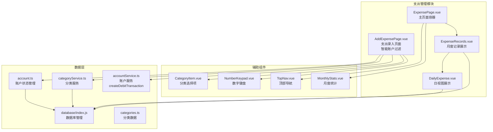

**图表来源**
- [ExpensePage.vue:1-88](file://src/components/mobile/expense/ExpensePage.vue#L1-L88)
- [ExpenseRecords.vue:1-105](file://src/components/mobile/expense/ExpenseRecords.vue#L1-L105)
- [AddExpensePage.vue:1-858](file://src/components/mobile/expense/AddExpensePage.vue#L1-L858)

**章节来源**
- [ExpensePage.vue:1-88](file://src/components/mobile/expense/ExpensePage.vue#L1-L88)
- [ExpenseRecords.vue:1-105](file://src/components/mobile/expense/ExpenseRecords.vue#L1-L105)
- [AddExpensePage.vue:1-858](file://src/components/mobile/expense/AddExpensePage.vue#L1-L858)

## 核心组件

### 数据库管理系统

系统采用单例模式的数据库管理器，支持Capacitor SQLite和sql.js两种运行环境：

- **连接管理**：智能检测运行环境，自动选择合适的数据库驱动
- **事务处理**：提供executeTransaction方法，确保多语句操作的原子性
- **性能优化**：实现查询缓存、批量操作、索引优化等特性
- **数据迁移**：自动处理数据库结构变更，保持向后兼容性

### 分类管理系统

分类系统采用动态加载和默认分类结合的策略：

- **动态分类**：从数据库获取用户自定义分类
- **默认分类**：内置22种常用支出分类，确保首次使用体验
- **分类服务**：提供完整的CRUD操作接口
- **类型过滤**：支持按支出/收入类型筛选分类

### 账户管理系统

账户状态管理通过Pinia Store实现：

- **账户查询**：实时获取账户余额和状态
- **状态同步**：自动同步数据库变更到UI
- **余额验证**：在支出时自动检查账户余额充足性
- **类型区分**：区分流动资金账户和信用卡账户的不同处理逻辑

**更新** 新增智能账户过滤功能，根据支出类别自动筛选可用账户：
- **默认过滤**：信用卡 + 流动资金账户
- **医疗类别特殊处理**：额外允许社保账户
- **实时过滤**：根据分类选择动态更新可用账户列表

### 账户出账服务

**新增** createDebitTransaction函数提供安全的账户出账处理：

- **余额检查**：自动验证账户余额或信用额度
- **类型验证**：确保账户类型支持出账操作
- **事务封装**：返回完整的SQL语句数组用于事务执行
- **错误处理**：详细的错误信息和异常处理

**章节来源**
- [index.js:21-891](file://src/database/index.js#L21-L891)
- [categoryService.ts:8-260](file://src/services/categoryService.ts#L8-L260)
- [account.ts:27-273](file://src/stores/account.ts#L27-L273)
- [accountService.ts:162-245](file://src/services/account/accountService.ts#L162-L245)

## 架构概览

系统采用分层架构设计，确保各层职责清晰分离：

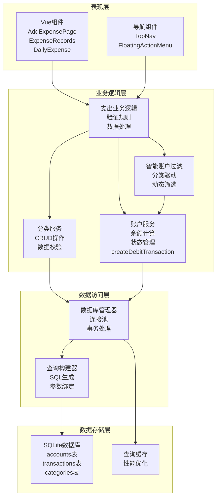

**图表来源**
- [AddExpensePage.vue:108-488](file://src/components/mobile/expense/AddExpensePage.vue#L108-L488)
- [ExpenseRecords.vue:14-98](file://src/components/mobile/expense/ExpenseRecords.vue#L14-L98)
- [DailyExpense.vue:25-107](file://src/components/mobile/expense/DailyExpense.vue#L25-L107)

## 详细组件分析

### AddExpensePage组件分析

AddExpensePage是支出记录创建的核心界面，实现了完整的表单验证和数据绑定功能。

#### 组件架构

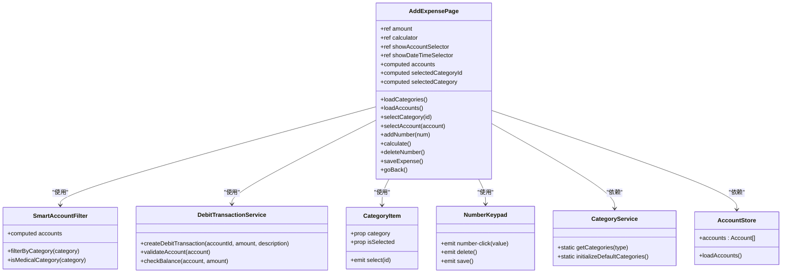

**图表来源**
- [AddExpensePage.vue:108-488](file://src/components/mobile/expense/AddExpensePage.vue#L108-L488)
- [CategoryItem.vue:8-22](file://src/components/mobile/expense/CategoryItem.vue#L8-L22)
- [NumberKeypad.vue:32-38](file://src/components/mobile/expense/NumberKeypad.vue#L32-L38)
- [categoryService.ts:14-69](file://src/services/categoryService.ts#L14-L69)
- [account.ts:38-53](file://src/stores/account.ts#L38-L53)

#### 智能账户过滤机制

**新增** 组件实现了根据支出类别智能筛选可用账户的功能：

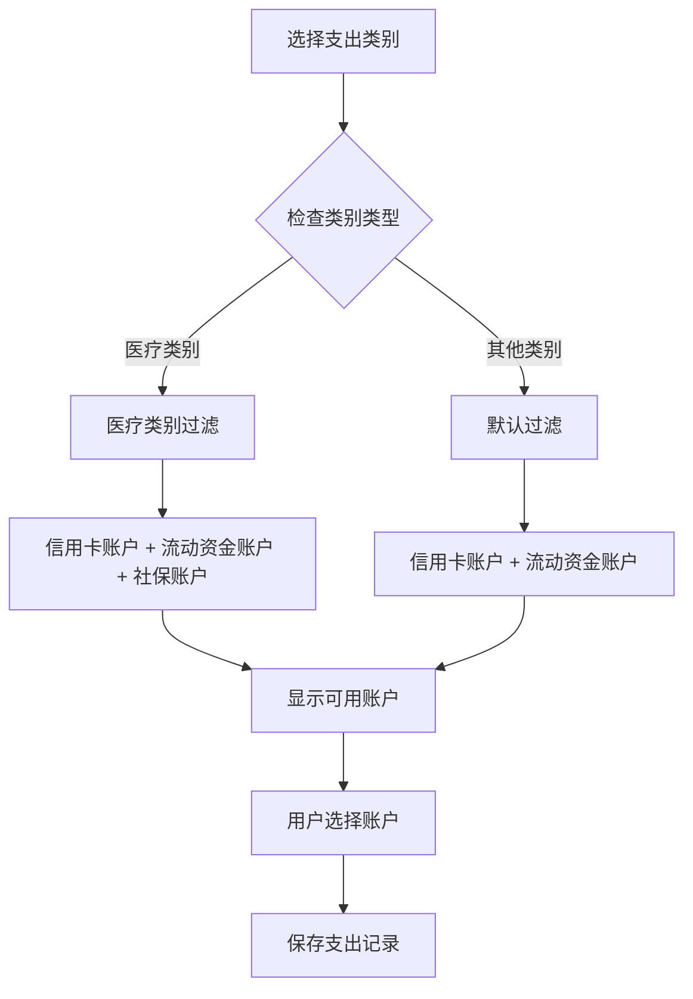

**过滤规则**：
- **默认规则**：信用卡账户 + 流动资金账户
- **医疗类别特殊规则**：额外允许社保账户
- **实时更新**：根据分类选择动态更新可用账户列表

#### 表单验证流程

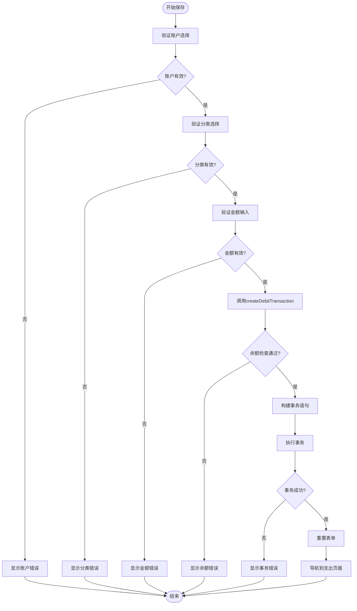

**图表来源**
- [AddExpensePage.vue:381-479](file://src/components/mobile/expense/AddExpensePage.vue#L381-L479)

#### 数据绑定机制

组件使用Vue 3的Composition API实现响应式数据绑定：

- **金额计算**：内置计算器支持基本运算（+、-、小数点）
- **账户选择**：浮动抽屉式选择器，支持账户余额显示
- **日期时间**：本地时间选择器，支持今天/昨天等人性化显示
- **分类选择**：网格布局的分类图标选择器

#### 事务处理实现

**更新** 现在使用createDebitTransaction函数处理交易流程：

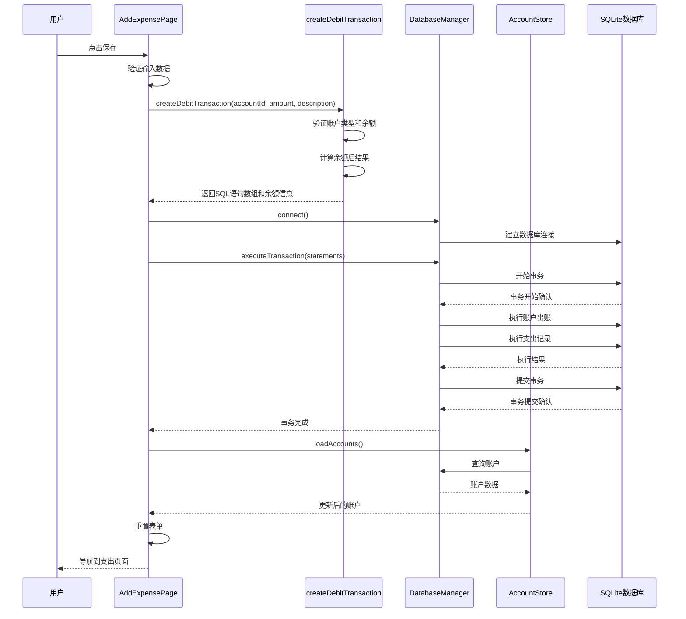

**图表来源**
- [AddExpensePage.vue:419-479](file://src/components/mobile/expense/AddExpensePage.vue#L419-L479)
- [index.js:354-374](file://src/database/index.js#L354-L374)
- [accountService.ts:162-245](file://src/services/account/accountService.ts#L162-L245)

**章节来源**
- [AddExpensePage.vue:108-488](file://src/components/mobile/expense/AddExpensePage.vue#L108-L488)
- [CategoryItem.vue:1-69](file://src/components/mobile/expense/CategoryItem.vue#L1-L69)
- [NumberKeypad.vue:1-106](file://src/components/mobile/expense/NumberKeypad.vue#L1-L106)

### ExpenseRecords组件分析

ExpenseRecords组件负责月度支出记录的展示，实现了按月筛选和日期生成功能。

#### 组件设计

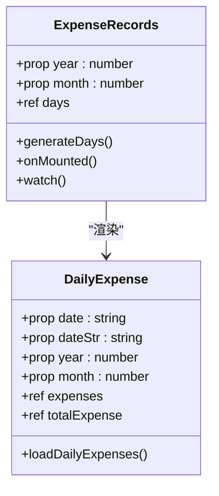

**图表来源**
- [ExpenseRecords.vue:14-98](file://src/components/mobile/expense/ExpenseRecords.vue#L14-L98)
- [DailyExpense.vue:25-107](file://src/components/mobile/expense/DailyExpense.vue#L25-L107)

#### 日期生成算法

组件实现了智能的日期生成逻辑：

- **当月天数计算**：使用JavaScript Date对象计算指定月份的天数
- **日期格式化**：支持"MM.DD"格式显示，包含"今天/昨天/前天"人性化标记
- **倒序排序**：按日期倒序排列，确保最新的记录显示在上方
- **响应式更新**：监听年月变化，自动重新生成日期列表

#### 数据展示机制

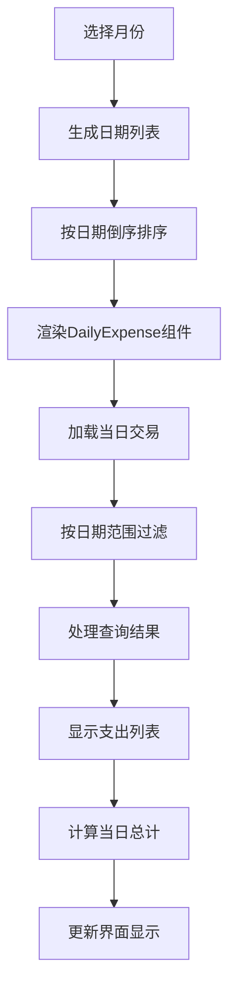

**图表来源**
- [ExpenseRecords.vue:28-85](file://src/components/mobile/expense/ExpenseRecords.vue#L28-L85)
- [DailyExpense.vue:52-96](file://src/components/mobile/expense/DailyExpense.vue#L52-L96)

**章节来源**
- [ExpenseRecords.vue:1-105](file://src/components/mobile/expense/ExpenseRecords.vue#L1-L105)
- [DailyExpense.vue:1-204](file://src/components/mobile/expense/DailyExpense.vue#L1-L204)

### DailyExpense组件分析

DailyExpense组件专门负责单日支出记录的展示，实现了完整的数据查询和展示逻辑。

#### 数据查询流程

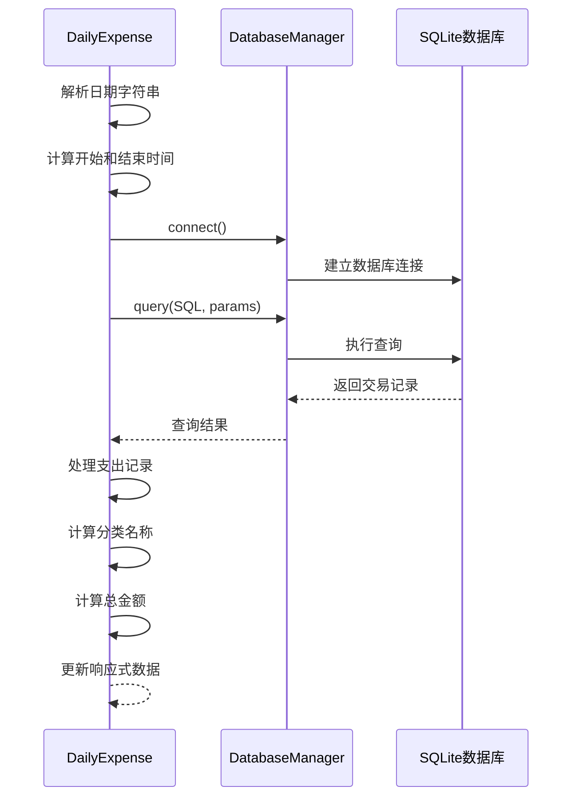

**图表来源**
- [DailyExpense.vue:52-96](file://src/components/mobile/expense/DailyExpense.vue#L52-L96)

#### 展示逻辑

组件实现了简洁而直观的展示逻辑：

- **日期头部**：显示日期和当日总支出金额
- **支出列表**：每个支出项包含分类、备注、金额和账户信息
- **样式设计**：绿色表示支出金额，灰色标注账户类型
- **空状态处理**：当没有支出记录时不显示任何内容

**章节来源**
- [DailyExpense.vue:1-204](file://src/components/mobile/expense/DailyExpense.vue#L1-L204)

## 依赖关系分析

系统各组件之间的依赖关系体现了清晰的分层架构：

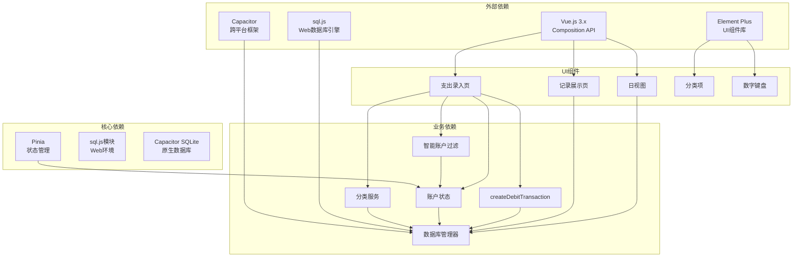

**图表来源**
- [AddExpensePage.vue:108-118](file://src/components/mobile/expense/AddExpensePage.vue#L108-L118)
- [ExpenseRecords.vue:15-16](file://src/components/mobile/expense/ExpenseRecords.vue#L15-L16)
- [DailyExpense.vue:27-28](file://src/components/mobile/expense/DailyExpense.vue#L27-L28)

**章节来源**
- [AddExpensePage.vue:108-118](file://src/components/mobile/expense/AddExpensePage.vue#L108-L118)
- [ExpenseRecords.vue:15-16](file://src/components/mobile/expense/ExpenseRecords.vue#L15-L16)
- [DailyExpense.vue:27-28](file://src/components/mobile/expense/DailyExpense.vue#L27-L28)

## 性能考虑

系统在多个层面实现了性能优化：

### 数据库性能优化

- **连接池管理**：单例模式确保数据库连接复用，避免频繁建立连接的开销
- **查询缓存**：实现LRU缓存机制，减少重复查询的数据库访问
- **批量操作**：支持批量SQL执行，减少网络往返次数
- **索引优化**：为常用查询字段建立索引，提升查询性能

### 前端性能优化

- **虚拟滚动**：对于大量记录的场景，可以考虑实现虚拟滚动
- **懒加载**：组件按需加载，减少初始包大小
- **响应式更新**：精确的响应式数据绑定，避免不必要的重渲染
- **内存管理**：及时清理定时器和事件监听器

### 移动端优化

- **原生数据库**：使用Capacitor SQLite获得接近原生的性能
- **离线支持**：完整的离线数据同步机制
- **电池优化**：智能的后台数据同步策略

### 智能账户过滤优化

**新增** 智能账户过滤功能的性能优化：
- **计算优化**：使用computed属性缓存过滤结果
- **实时更新**：仅在分类变化时重新计算可用账户
- **内存管理**：避免重复创建账户对象
- **用户体验**：快速响应用户选择

## 故障排除指南

### 常见问题及解决方案

#### 数据库连接问题

**问题症状**：应用启动时数据库连接失败

**可能原因**：
- Capacitor SQLite插件未正确安装
- Web环境缺少sql.js依赖
- 数据库文件损坏

**解决步骤**：
1. 检查Capacitor配置文件
2. 确认sql.js模块正确导入
3. 尝试清除应用数据重新初始化
4. 检查数据库文件权限

#### 事务执行失败

**问题症状**：保存支出记录时出现"已自动回滚"提示

**可能原因**：
- 账户余额不足
- 数据库约束冲突
- 网络连接中断

**解决步骤**：
1. 检查账户余额和可用额度
2. 验证输入数据的有效性
3. 查看控制台错误日志
4. 重试操作或联系技术支持

#### 智能账户过滤问题

**问题症状**：账户选择器显示不正确的账户

**可能原因**：
- 分类数据加载失败
- 账户状态异常
- 过滤逻辑错误

**解决步骤**：
1. 检查分类数据是否正确加载
2. 验证账户状态和类型
3. 确认过滤逻辑是否符合预期
4. 查看控制台日志了解具体错误

#### createDebitTransaction错误

**问题症状**：出账操作失败并显示详细错误信息

**可能原因**：
- 账户类型不支持出账
- 余额或信用额度不足
- 账户状态异常

**解决步骤**：
1. 检查账户类型是否为信用卡或流动资金账户
2. 验证账户余额或信用额度
3. 确认账户状态正常
4. 查看具体的错误消息并采取相应措施

#### 性能问题

**问题症状**：页面加载缓慢或卡顿

**优化建议**：
1. 检查网络连接质量
2. 清理浏览器缓存
3. 减少一次性加载的数据量
4. 考虑实现分页加载

**章节来源**
- [index.js:897-935](file://src/database/index.js#L897-L935)
- [AddExpensePage.vue:461-466](file://src/components/mobile/expense/AddExpensePage.vue#L461-L466)

## 结论

本支出记录管理系统展现了现代前端应用的最佳实践：

### 技术优势

- **架构清晰**：分层设计确保了代码的可维护性和可扩展性
- **数据安全**：完善的事务处理机制保证了数据的一致性和完整性
- **用户体验**：响应式的界面设计和流畅的操作体验
- **跨平台支持**：统一的代码基础支持移动端和Web端部署
- **智能过滤**：新增的智能账户过滤功能提升了系统的智能化水平

### 功能完整性

系统完整实现了支出记录管理的所有核心功能：
- 支持多种支付方式和账户类型的支出记录
- 提供灵活的分类管理和自定义功能
- 实现了完整的CRUD操作和数据验证
- 支持按日、月维度的数据查询和展示
- **新增** 智能账户过滤功能，根据类别自动筛选可用账户

### 扩展性考虑

系统为未来的功能扩展预留了良好的接口：
- 模块化的组件设计便于功能扩展
- 灵活的数据库结构支持新字段的添加
- 完善的服务层接口支持业务逻辑的增强
- **新增** createDebitTransaction函数为更多交易场景提供支持

## 附录

### 数据库表结构

系统使用以下核心表结构：

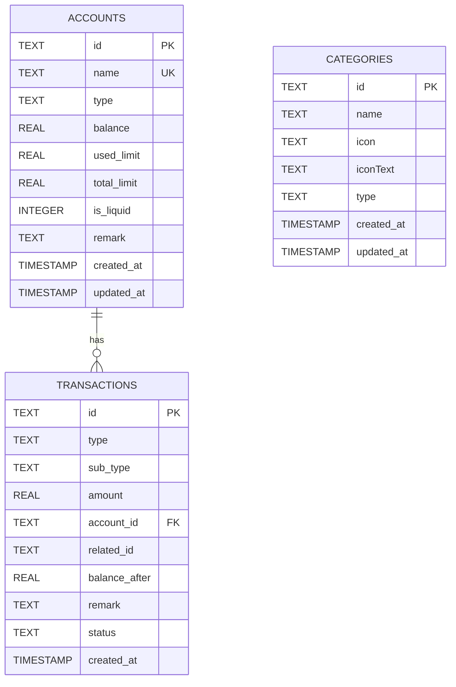

**图表来源**
- [index.js:437-467](file://src/database/index.js#L437-L467)
- [index.js:665-673](file://src/database/index.js#L665-L673)

### API参考

#### 分类服务API

| 方法 | 参数 | 返回值 | 描述 |
|------|------|--------|------|
| getCategories | type?: string | Promise<Category[]> | 获取分类列表 |
| getCategoryById | id: string | Promise<Category \| null> | 根据ID获取分类 |
| createCategory | category: Omit<Category, 'id'> | Promise<boolean> | 创建新分类 |
| updateCategory | id: string, category: Partial<Category> | Promise<boolean> | 更新分类信息 |
| deleteCategory | id: string | Promise<boolean> | 删除分类 |
| initializeDefaultCategories | - | Promise<void> | 初始化默认分类 |

#### 账户服务API

| 方法 | 参数 | 返回值 | 描述 |
|------|------|--------|------|
| getAccounts | - | Promise<Account[]> | 获取所有启用的账户 |
| getAccountById | id: string | Promise<Account \| null> | 根据ID获取账户 |
| createDebitTransaction | accountId: string, amount: number, description: string, transactionId?: string, transactionTime?: Date | Promise<{ statements: { statement: string; values: any[] }[]; balanceAfter: number; transactionId: string }> | 创建出账交易，返回SQL语句数组用于事务执行 |
| createCreditTransaction | accountId: string, amount: number, description: string, transactionId?: string, transactionTime?: Date | Promise<{ statements: { statement: string; values: any[] }[]; balanceAfter: number; transactionId: string }> | 创建入账交易，返回SQL语句数组用于事务执行 |
| transfer | input: TransferInput | Promise<void> | 账户间转账 |

#### 数据库管理API

| 方法 | 参数 | 返回值 | 描述 |
|------|------|--------|------|
| connect | - | Promise<void> | 建立数据库连接 |
| query | sql: string, params?: any[], useCache?: boolean | Promise<any[]> | 执行查询 |
| run | sql: string, params?: any[] | Promise<Object> | 执行SQL |
| batch | statements: any[] | Promise<Object[]> | 批量执行 |
| executeTransaction | statements: any[] | Promise<any> | 执行事务 |
| close | - | Promise<void> | 关闭数据库连接 |

#### 智能账户过滤规则

| 类别类型 | 过滤条件 | 允许的账户类型 |
|----------|----------|----------------|
| 默认 | 信用卡 + 流动资金账户 | 信用卡、流动资金账户 |
| 医疗 | 信用卡 + 流动资金账户 + 社保账户 | 信用卡、流动资金账户、社保账户 |
| 其他类别 | 信用卡 + 流动资金账户 | 信用卡、流动资金账户 |