# 收入管理

<cite>
**本文档引用的文件**
- [AddIncomePage.vue](file://src/components/mobile/income/AddIncomePage.vue)
- [IncomePage.vue](file://src/components/mobile/income/IncomePage.vue)
- [IncomeRecords.vue](file://src/components/mobile/income/IncomeRecords.vue)
- [IncomeStats.vue](file://src/components/mobile/income/IncomeStats.vue)
- [DailyIncome.vue](file://src/components/mobile/income/DailyIncome.vue)
- [WeeklyIncome.vue](file://src/components/mobile/income/WeeklyIncome.vue)
- [MonthlyStats.vue](file://src/components/mobile/income/MonthlyStats.vue)
- [categoryService.ts](file://src/services/categoryService.ts)
- [categories.ts](file://src/data/categories.ts)
- [accountService.ts](file://src/services/account/accountService.ts)
- [account.ts](file://src/stores/account.ts)
- [index.js](file://src/database/index.js)
- [adapter.js](file://src/database/adapter.js)
- [timezone.ts](file://src/utils/timezone.ts)
- [account.ts](file://src/types/account/account.ts)
- [package.json](file://package.json)
</cite>

## 目录
1. [简介](#简介)
2. [项目结构](#项目结构)
3. [核心组件](#核心组件)
4. [架构概览](#架构概览)
5. [详细组件分析](#详细组件分析)
6. [依赖关系分析](#依赖关系分析)
7. [性能考虑](#性能考虑)
8. [故障排除指南](#故障排除指南)
9. [结论](#结论)

## 简介

这是一个基于Vue 3和Capacitor的跨平台财务应用程序，专注于提供完整的收入管理功能。该应用支持多平台部署（Web、Android、iOS），采用SQLite数据库进行数据持久化，提供了从收入记录录入到统计分析的完整解决方案。

应用的核心特色包括：
- **多平台支持**：通过Capacitor实现Web、Android、iOS的统一代码库
- **实时数据同步**：基于SQLite的本地数据存储，支持离线使用
- **丰富的统计分析**：提供日、周、月维度的收入统计和可视化
- **灵活的分类管理**：支持自定义收入分类和标签
- **安全的事务处理**：确保财务数据的一致性和完整性

## 项目结构

该项目采用模块化的Vue 3架构设计，主要目录结构如下：

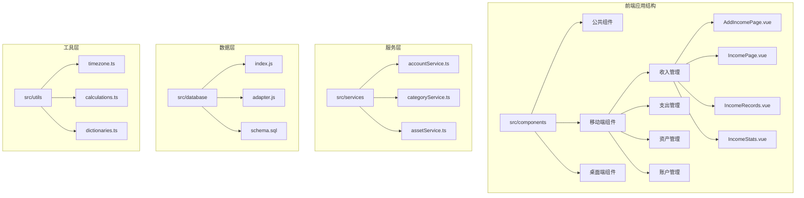
```mermaid
graph TB
subgraph "前端应用结构"
A[src/components] --> B[公共组件]
A --> C[移动端组件]
A --> D[桌面端组件]
C --> E[收入管理]
C --> F[支出管理]
C --> G[资产管理]
C --> H[账户管理]
E --> I[AddIncomePage.vue]
E --> J[IncomePage.vue]
E --> K[IncomeRecords.vue]
E --> L[IncomeStats.vue]
end
subgraph "服务层"
M[src/services] --> N[accountService.ts]
M --> O[categoryService.ts]
M --> P[assetService.ts]
end
subgraph "数据层"
Q[src/database] --> R[index.js]
Q --> S[adapter.js]
Q --> T[schema.sql]
end
subgraph "工具层"
U[src/utils] --> V[timezone.ts]
U --> W[calculations.ts]
U --> X[dictionaries.ts]
end
```

**图表来源**
- [AddIncomePage.vue:1-50](file://src/components/mobile/income/AddIncomePage.vue#L1-L50)
- [IncomePage.vue:1-30](file://src/components/mobile/income/IncomePage.vue#L1-L30)
- [categoryService.ts:1-30](file://src/services/categoryService.ts#L1-L30)

**章节来源**
- [AddIncomePage.vue:1-120](file://src/components/mobile/income/AddIncomePage.vue#L1-L120)
- [IncomePage.vue:1-76](file://src/components/mobile/income/IncomePage.vue#L1-L76)

## 核心组件

### 收入管理组件体系

应用的收入管理功能由多个相互协作的组件构成，形成了完整的收入生命周期管理体系：

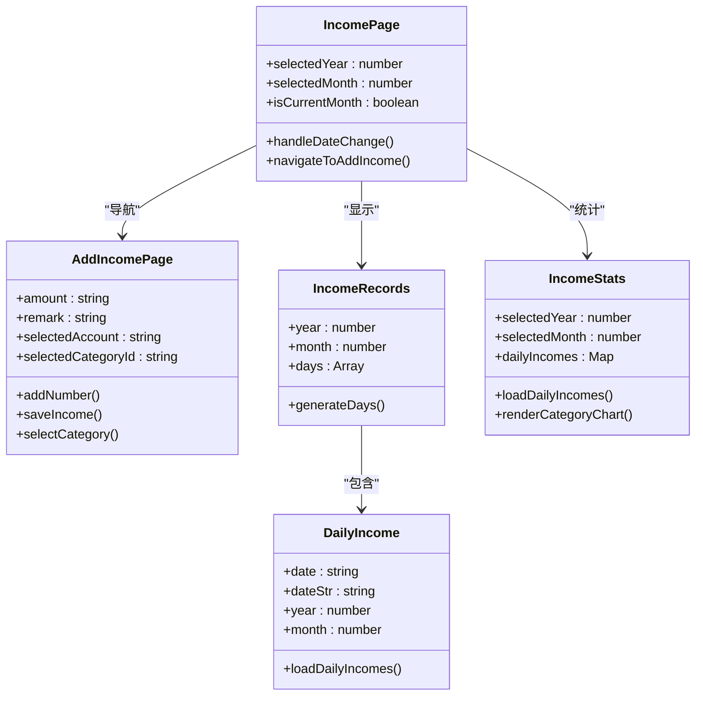
```mermaid
classDiagram
class IncomePage {
+selectedYear : number
+selectedMonth : number
+isCurrentMonth : boolean
+handleDateChange()
+navigateToAddIncome()
}
class AddIncomePage {
+amount : string
+remark : string
+selectedAccount : string
+selectedCategoryId : string
+addNumber()
+saveIncome()
+selectCategory()
}
class IncomeRecords {
+year : number
+month : number
+days : Array
+generateDays()
}
class DailyIncome {
+date : string
+dateStr : string
+year : number
+month : number
+loadDailyIncomes()
}
class IncomeStats {
+selectedYear : number
+selectedMonth : number
+dailyIncomes : Map
+loadDailyIncomes()
+renderCategoryChart()
}
IncomePage --> AddIncomePage : "导航"
IncomePage --> IncomeRecords : "显示"
IncomeRecords --> DailyIncome : "包含"
IncomePage --> IncomeStats : "统计"
```

**图表来源**
- [IncomePage.vue:20-67](file://src/components/mobile/income/IncomePage.vue#L20-L67)
- [AddIncomePage.vue:108-122](file://src/components/mobile/income/AddIncomePage.vue#L108-L122)
- [IncomeRecords.vue:14-28](file://src/components/mobile/income/IncomeRecords.vue#L14-L28)

### 数据流架构

收入管理的数据流遵循严格的单向数据流原则：

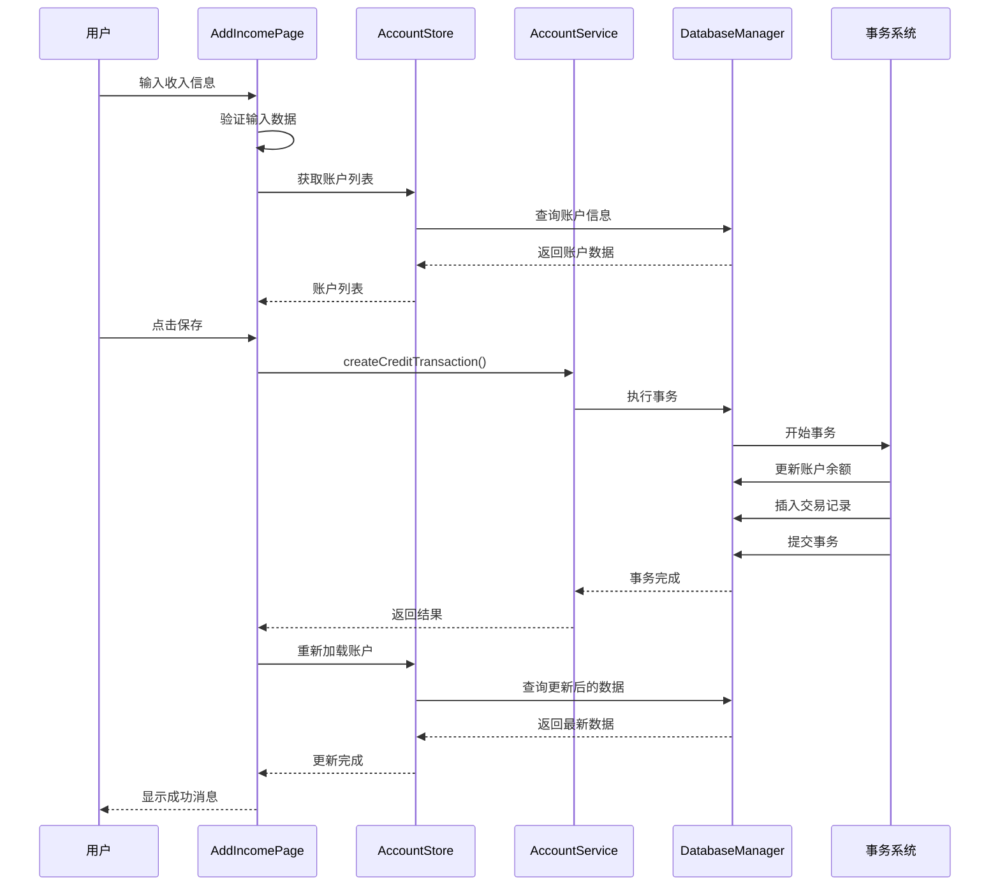
```mermaid
sequenceDiagram
participant User as 用户
participant AddIncome as AddIncomePage
participant AccountStore as AccountStore
participant AccountService as AccountService
participant Database as DatabaseManager
participant Transaction as 事务系统
User->>AddIncome : 输入收入信息
AddIncome->>AddIncome : 验证输入数据
AddIncome->>AccountStore : 获取账户列表
AccountStore->>Database : 查询账户信息
Database-->>AccountStore : 返回账户数据
AccountStore-->>AddIncome : 账户列表
User->>AddIncome : 点击保存
AddIncome->>AccountService : createCreditTransaction()
AccountService->>Database : 执行事务
Database->>Transaction : 开始事务
Transaction->>Database : 更新账户余额
Transaction->>Database : 插入交易记录
Transaction->>Database : 提交事务
Database-->>AccountService : 事务完成
AccountService-->>AddIncome : 返回结果
AddIncome->>AccountStore : 重新加载账户
AccountStore->>Database : 查询更新后的数据
Database-->>AccountStore : 返回最新数据
AccountStore-->>AddIncome : 更新完成
AddIncome-->>User : 显示成功消息
```

**图表来源**
- [AddIncomePage.vue:374-472](file://src/components/mobile/income/AddIncomePage.vue#L374-L472)
- [accountService.ts:258-327](file://src/services/account/accountService.ts#L258-L327)
- [account.ts:38-53](file://src/stores/account.ts#L38-L53)

**章节来源**
- [AddIncomePage.vue:108-472](file://src/components/mobile/income/AddIncomePage.vue#L108-L472)
- [IncomePage.vue:20-67](file://src/components/mobile/income/IncomePage.vue#L20-L67)

## 架构概览

### 技术栈架构

应用采用了现代化的全栈技术架构，确保了良好的性能和可维护性：

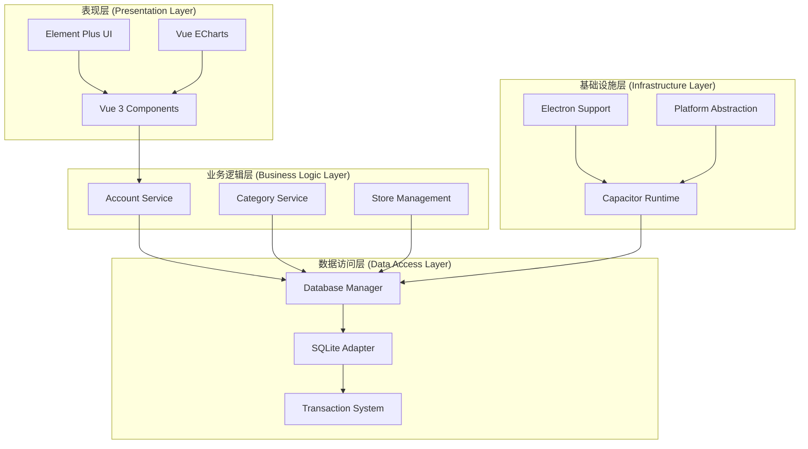
```mermaid
graph TB
subgraph "表现层 (Presentation Layer)"
A[Vue 3 Components]
B[Element Plus UI]
C[Vue ECharts]
end
subgraph "业务逻辑层 (Business Logic Layer)"
D[Account Service]
E[Category Service]
F[Store Management]
end
subgraph "数据访问层 (Data Access Layer)"
G[Database Manager]
H[SQLite Adapter]
I[Transaction System]
end
subgraph "基础设施层 (Infrastructure Layer)"
J[Capacitor Runtime]
K[Electron Support]
L[Platform Abstraction]
end
A --> D
B --> A
C --> A
D --> G
E --> G
F --> G
G --> H
H --> I
J --> G
K --> J
L --> J
```

**图表来源**
- [package.json:19-38](file://package.json#L19-L38)
- [index.js:21-32](file://src/database/index.js#L21-L32)

### 数据模型设计

应用采用规范化的数据模型设计，确保数据的一致性和完整性：

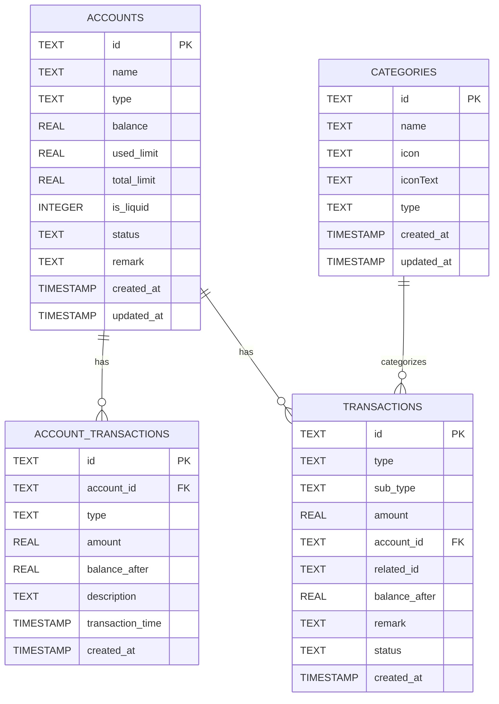
```mermaid
erDiagram
ACCOUNTS {
TEXT id PK
TEXT name
TEXT type
REAL balance
REAL used_limit
REAL total_limit
INTEGER is_liquid
TEXT status
TEXT remark
TIMESTAMP created_at
TIMESTAMP updated_at
}
TRANSACTIONS {
TEXT id PK
TEXT type
TEXT sub_type
REAL amount
TEXT account_id FK
TEXT related_id
REAL balance_after
TEXT remark
TEXT status
TIMESTAMP created_at
}
ACCOUNT_TRANSACTIONS {
TEXT id PK
TEXT account_id FK
TEXT type
REAL amount
REAL balance_after
TEXT description
TIMESTAMP transaction_time
TIMESTAMP created_at
}
CATEGORIES {
TEXT id PK
TEXT name
TEXT icon
TEXT iconText
TEXT type
TIMESTAMP created_at
TIMESTAMP updated_at
}
ACCOUNTS ||--o{ ACCOUNT_TRANSACTIONS : has
ACCOUNTS ||--o{ TRANSACTIONS : has
CATEGORIES ||--o{ TRANSACTIONS : categorizes
```

**图表来源**
- [index.js:434-484](file://src/database/index.js#L434-L484)
- [index.js:470-484](file://src/database/index.js#L470-L484)

**章节来源**
- [index.js:418-726](file://src/database/index.js#L418-L726)
- [account.ts:5-18](file://src/types/account/account.ts#L5-L18)

## 详细组件分析

### 收入录入组件 (AddIncomePage)

AddIncomePage是收入管理的核心入口组件，提供了完整的收入记录录入功能：

#### 核心功能特性

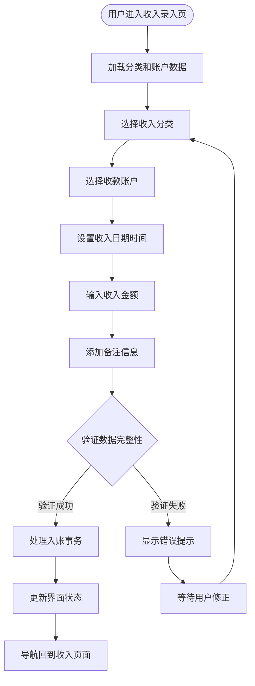
```mermaid
flowchart TD
Start([用户进入收入录入页]) --> LoadData[加载分类和账户数据]
LoadData --> SelectCategory[选择收入分类]
SelectCategory --> SelectAccount[选择收款账户]
SelectAccount --> DateTime[设置收入日期时间]
DateTime --> EnterAmount[输入收入金额]
EnterAmount --> AddNote[添加备注信息]
AddNote --> ValidateData{验证数据完整性}
ValidateData --> |验证失败| ShowError[显示错误提示]
ValidateData --> |验证成功| ProcessTransaction[处理入账事务]
ProcessTransaction --> UpdateUI[更新界面状态]
UpdateUI --> NavigateBack[导航回到收入页面]
ShowError --> WaitInput[等待用户修正]
WaitInput --> SelectCategory
```

**图表来源**
- [AddIncomePage.vue:225-237](file://src/components/mobile/income/AddIncomePage.vue#L225-L237)
- [AddIncomePage.vue:374-472](file://src/components/mobile/income/AddIncomePage.vue#L374-L472)

#### 金额计算器实现

组件内置了完整的金额计算器，支持基本的数学运算：

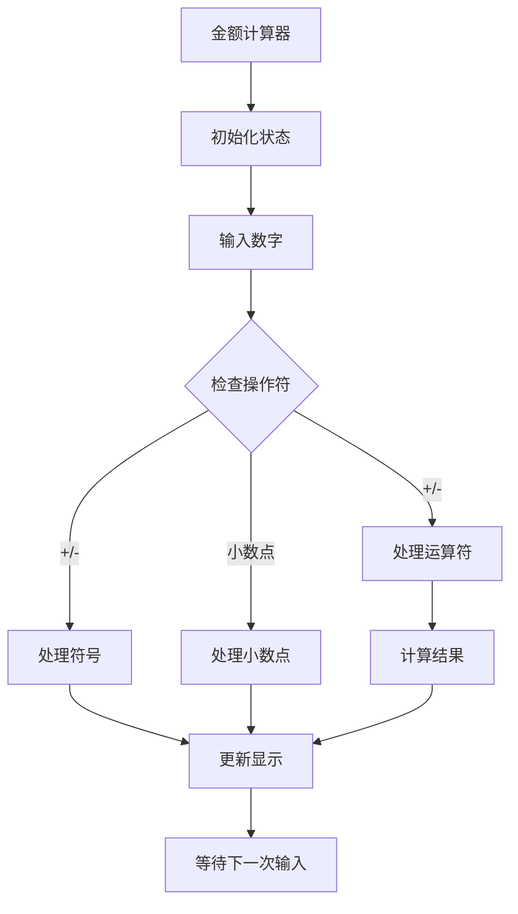
```mermaid
flowchart TD
Calculator[金额计算器] --> Init[初始化状态]
Init --> InputNumber[输入数字]
InputNumber --> CheckOperator{检查操作符}
CheckOperator --> |+/-| HandleSign[处理符号]
CheckOperator --> |+/-| HandleOperator[处理运算符]
CheckOperator --> |小数点| HandleDecimal[处理小数点]
HandleSign --> UpdateDisplay[更新显示]
HandleOperator --> CalculateResult[计算结果]
HandleDecimal --> UpdateDisplay
CalculateResult --> UpdateDisplay
UpdateDisplay --> WaitInput[等待下一次输入]
```

**图表来源**
- [AddIncomePage.vue:248-371](file://src/components/mobile/income/AddIncomePage.vue#L248-L371)

#### 账户选择逻辑

账户选择功能根据收入类型限制了可选账户：

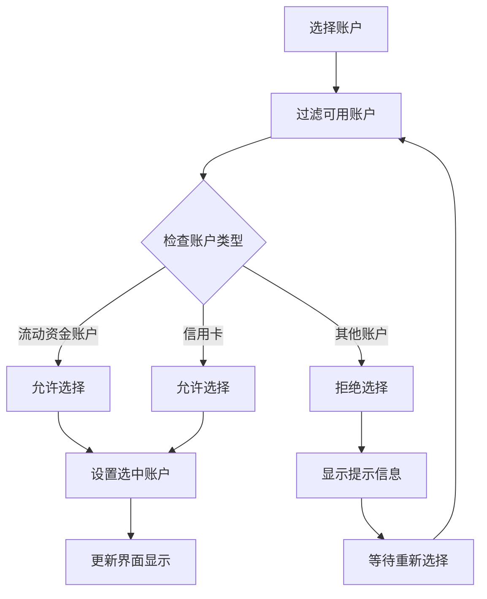
```mermaid
flowchart TD
SelectAccount[选择账户] --> FilterAccounts[过滤可用账户]
FilterAccounts --> CheckAccountType{检查账户类型}
CheckAccountType --> |流动资金账户| AllowFlowing[允许选择]
CheckAccountType --> |信用卡| AllowCredit[允许选择]
CheckAccountType --> |其他账户| DenySelection[拒绝选择]
AllowFlowing --> SetSelected[设置选中账户]
AllowCredit --> SetSelected
DenySelection --> ShowMessage[显示提示信息]
SetSelected --> UpdateUI[更新界面显示]
ShowMessage --> WaitSelection[等待重新选择]
WaitSelection --> FilterAccounts
```

**图表来源**
- [AddIncomePage.vue:149-159](file://src/components/mobile/income/AddIncomePage.vue#L149-L159)

**章节来源**
- [AddIncomePage.vue:108-472](file://src/components/mobile/income/AddIncomePage.vue#L108-L472)

### 收入统计组件 (IncomeStats)

IncomeStats提供了全面的收入统计分析功能，支持多种维度的数据展示：

#### 统计图表架构

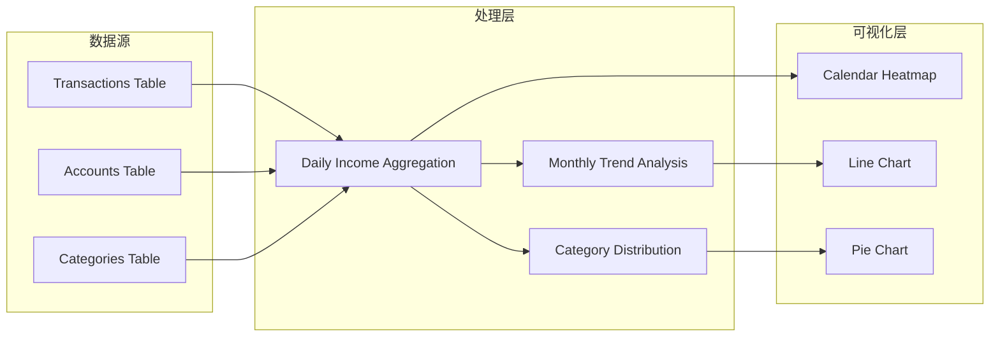
```mermaid
graph LR
subgraph "数据源"
A[Transactions Table]
B[Accounts Table]
C[Categories Table]
end
subgraph "处理层"
D[Daily Income Aggregation]
E[Category Distribution]
F[Monthly Trend Analysis]
end
subgraph "可视化层"
G[Calendar Heatmap]
H[Line Chart]
I[Pie Chart]
end
A --> D
B --> D
C --> D
D --> E
D --> F
E --> I
F --> H
D --> G
```

**图表来源**
- [IncomeStats.vue:129-161](file://src/components/mobile/income/IncomeStats.vue#L129-L161)
- [IncomeStats.vue:185-215](file://src/components/mobile/income/IncomeStats.vue#L185-L215)

#### 日历统计实现

日历组件实现了收入金额的可视化展示：

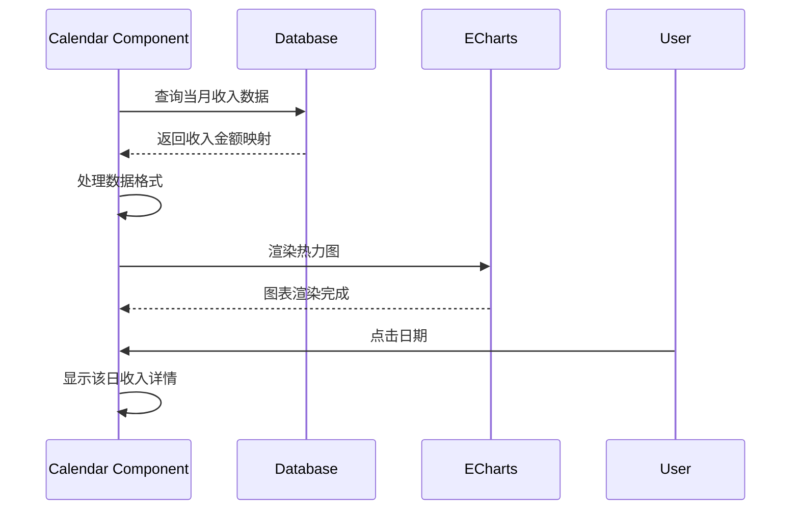
```mermaid
sequenceDiagram
participant Calendar as Calendar Component
participant Database as Database
participant ECharts as ECharts
participant User as User
Calendar->>Database : 查询当月收入数据
Database-->>Calendar : 返回收入金额映射
Calendar->>Calendar : 处理数据格式
Calendar->>ECharts : 渲染热力图
ECharts-->>Calendar : 图表渲染完成
User->>Calendar : 点击日期
Calendar->>Calendar : 显示该日收入详情
```

**图表来源**
- [IncomeStats.vue:42-72](file://src/components/mobile/income/IncomeStats.vue#L42-L72)
- [IncomeStats.vue:129-161](file://src/components/mobile/income/IncomeStats.vue#L129-L161)

**章节来源**
- [IncomeStats.vue:77-465](file://src/components/mobile/income/IncomeStats.vue#L77-L465)

### 收入记录组件 (IncomeRecords)

IncomeRecords组件负责展示按日组织的收入记录：

#### 日期生成算法

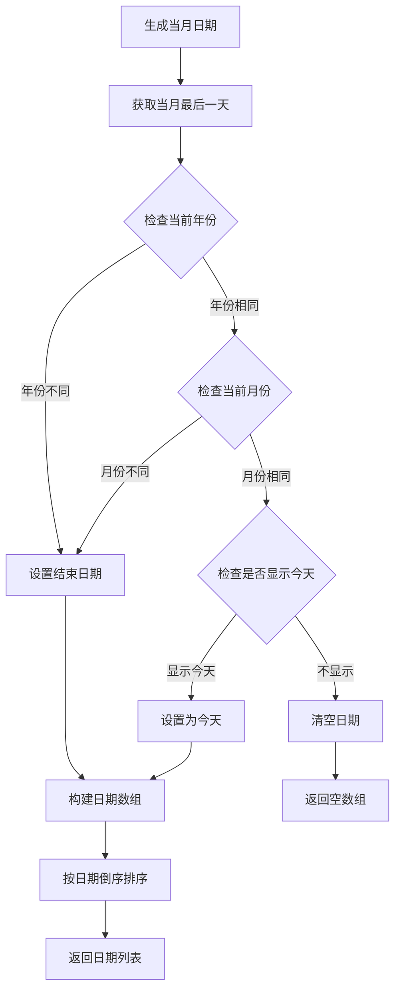
```mermaid
flowchart TD
GenerateDays[生成当月日期] --> GetLastDay[获取当月最后一天]
GetLastDay --> CheckCurrentYear{检查当前年份}
CheckCurrentYear --> |年份不同| SetEnd[设置结束日期]
CheckCurrentYear --> |年份相同| CheckCurrentMonth{检查当前月份}
CheckCurrentMonth --> |月份不同| SetEnd
CheckCurrentMonth --> |月份相同| CheckShowToday{检查是否显示今天}
CheckShowToday --> |显示今天| SetToday[设置为今天]
CheckShowToday --> |不显示| ClearDays[清空日期]
SetEnd --> BuildArray[构建日期数组]
SetToday --> BuildArray
ClearDays --> ReturnEmpty[返回空数组]
BuildArray --> SortDates[按日期倒序排序]
SortDates --> ReturnDays[返回日期列表]
```

**图表来源**
- [IncomeRecords.vue:30-96](file://src/components/mobile/income/IncomeRecords.vue#L30-L96)

#### 日收入明细展示

每日收入组件实现了详细的收入记录展示：

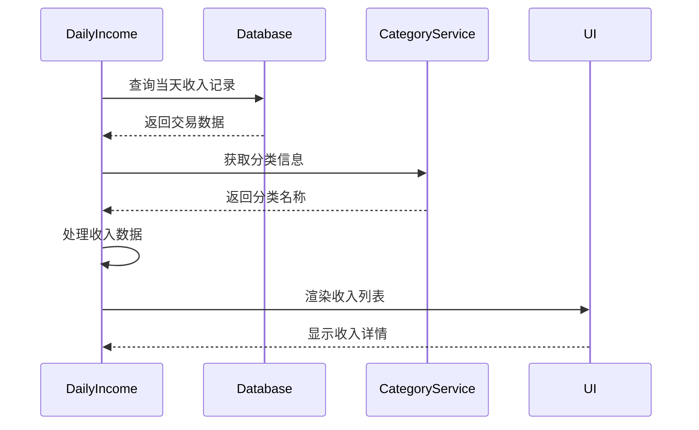
```mermaid
sequenceDiagram
participant DailyIncome as DailyIncome
participant Database as Database
participant CategoryService as CategoryService
participant UI as UI
DailyIncome->>Database : 查询当天收入记录
Database-->>DailyIncome : 返回交易数据
DailyIncome->>CategoryService : 获取分类信息
CategoryService-->>DailyIncome : 返回分类名称
DailyIncome->>DailyIncome : 处理收入数据
DailyIncome->>UI : 渲染收入列表
UI-->>DailyIncome : 显示收入详情
```

**图表来源**
- [DailyIncome.vue:54-101](file://src/components/mobile/income/DailyIncome.vue#L54-L101)

**章节来源**
- [IncomeRecords.vue:14-117](file://src/components/mobile/income/IncomeRecords.vue#L14-L117)
- [DailyIncome.vue:25-112](file://src/components/mobile/income/DailyIncome.vue#L25-L112)

### 周度统计组件 (WeeklyIncome)

WeeklyIncome组件提供了本周收入的可视化展示：

#### 本周范围计算

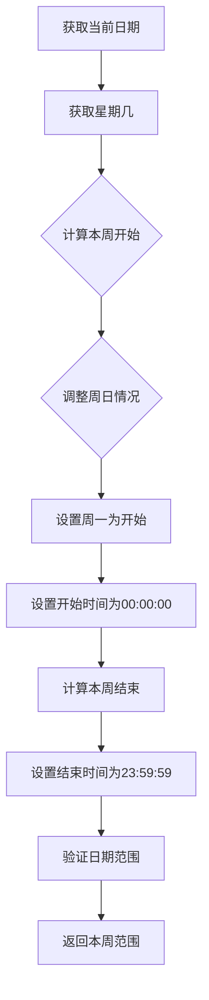
```mermaid
flowchart TD
GetCurrentDate[获取当前日期] --> GetDayOfWeek[获取星期几]
GetDayOfWeek --> CalcStart{计算本周开始}
CalcStart --> AdjustSunday{调整周日情况}
AdjustSunday --> SetMonday[设置周一为开始]
SetMonday --> SetStartTime[设置开始时间为00:00:00]
SetStartTime --> CalcEnd[计算本周结束]
CalcEnd --> SetEndTime[设置结束时间为23:59:59]
SetEndTime --> ValidateRange[验证日期范围]
ValidateRange --> ReturnRange[返回本周范围]
```

**图表来源**
- [WeeklyIncome.vue:58-77](file://src/components/mobile/income/WeeklyIncome.vue#L58-L77)

#### 收入分组统计

组件实现了按日期分组的收入统计功能：

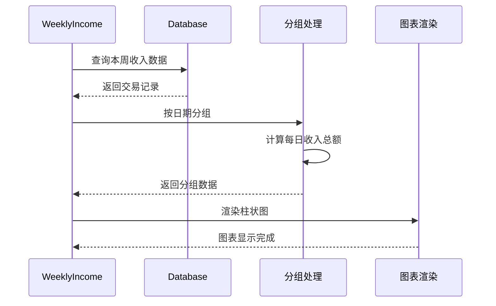
```mermaid
sequenceDiagram
participant WeeklyIncome as WeeklyIncome
participant Database as Database
participant Grouping as 分组处理
participant Chart as 图表渲染
WeeklyIncome->>Database : 查询本周收入数据
Database-->>WeeklyIncome : 返回交易记录
WeeklyIncome->>Grouping : 按日期分组
Grouping->>Grouping : 计算每日收入总额
Grouping-->>WeeklyIncome : 返回分组数据
WeeklyIncome->>Chart : 渲染柱状图
Chart-->>WeeklyIncome : 图表显示完成
```

**图表来源**
- [WeeklyIncome.vue:80-153](file://src/components/mobile/income/WeeklyIncome.vue#L80-L153)

**章节来源**
- [WeeklyIncome.vue:21-159](file://src/components/mobile/income/WeeklyIncome.vue#L21-L159)

### 月度统计组件 (MonthlyStats)

MonthlyStats组件提供了月度财务概览：

#### 月度范围计算

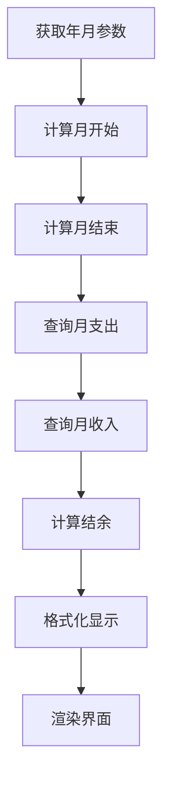
```mermaid
flowchart TD
GetYearMonth[获取年月参数] --> CalcStart[计算月开始]
CalcStart --> CalcEnd[计算月结束]
CalcEnd --> QueryExpense[查询月支出]
QueryExpense --> QueryIncome[查询月收入]
QueryIncome --> CalculateBalance[计算结余]
CalculateBalance --> FormatDisplay[格式化显示]
FormatDisplay --> RenderUI[渲染界面]
```

**图表来源**
- [MonthlyStats.vue:45-52](file://src/components/mobile/income/MonthlyStats.vue#L45-L52)

**章节来源**
- [MonthlyStats.vue:25-103](file://src/components/mobile/income/MonthlyStats.vue#L25-L103)

## 依赖关系分析

### 核心依赖关系

应用的依赖关系体现了清晰的分层架构：

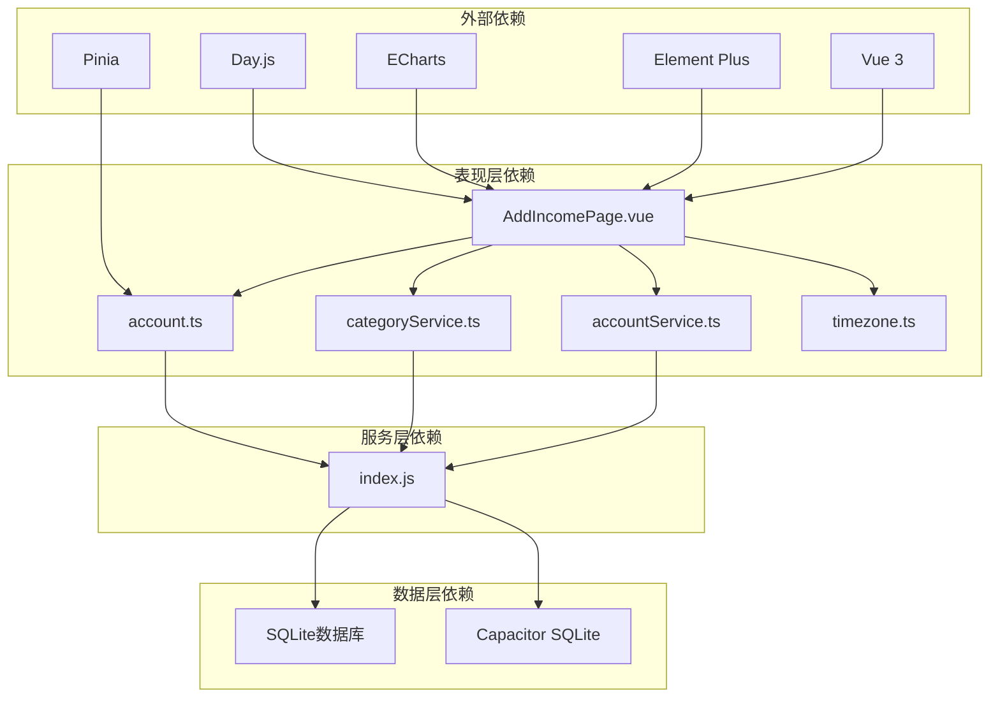
```mermaid
graph TB
subgraph "表现层依赖"
A[AddIncomePage.vue] --> B[accountService.ts]
A --> C[categoryService.ts]
A --> D[account.ts]
A --> E[timezone.ts]
end
subgraph "服务层依赖"
B --> F[index.js]
C --> F
D --> F
end
subgraph "数据层依赖"
F --> G[SQLite数据库]
F --> H[Capacitor SQLite]
end
subgraph "外部依赖"
I[Vue 3] --> A
J[Element Plus] --> A
K[ECharts] --> A
L[Day.js] --> A
M[Pinia] --> D
end
```

**图表来源**
- [AddIncomePage.vue:115-121](file://src/components/mobile/income/AddIncomePage.vue#L115-L121)
- [accountService.ts:6-8](file://src/services/account/accountService.ts#L6-L8)

### 数据库依赖层次

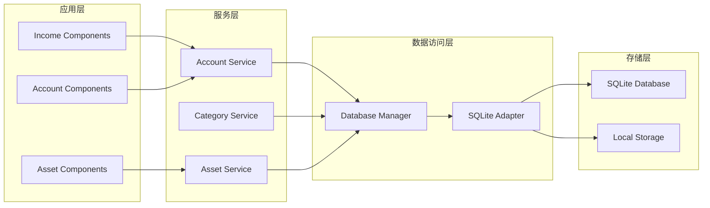
```mermaid
graph LR
subgraph "应用层"
A[Income Components]
B[Account Components]
C[Asset Components]
end
subgraph "服务层"
D[Account Service]
E[Category Service]
F[Asset Service]
end
subgraph "数据访问层"
G[Database Manager]
H[SQLite Adapter]
end
subgraph "存储层"
I[SQLite Database]
J[Local Storage]
end
A --> D
B --> D
C --> F
D --> G
E --> G
F --> G
G --> H
H --> I
H --> J
```

**图表来源**
- [index.js:21-32](file://src/database/index.js#L21-L32)
- [adapter.js:14-24](file://src/database/adapter.js#L14-L24)

**章节来源**
- [package.json:19-38](file://package.json#L19-L38)
- [index.js:1-800](file://src/database/index.js#L1-L800)

## 性能考虑

### 数据库性能优化

应用采用了多项数据库性能优化策略：

1. **连接池管理**：单例模式确保数据库连接的复用
2. **查询缓存**：LRU缓存机制减少重复查询
3. **批量操作**：支持批量SQL执行提升性能
4. **索引优化**：为常用查询字段建立索引

### 前端性能优化

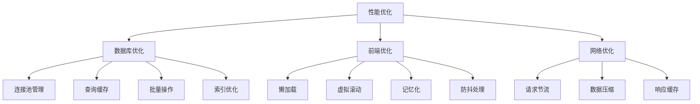
```mermaid
flowchart TD
Performance[性能优化] --> Database[数据库优化]
Performance --> Frontend[前端优化]
Performance --> Network[网络优化]
Database --> Pool[连接池管理]
Database --> Cache[查询缓存]
Database --> Batch[批量操作]
Database --> Index[索引优化]
Frontend --> LazyLoad[懒加载]
Frontend --> VirtualScroll[虚拟滚动]
Frontend --> Memoization[记忆化]
Frontend --> Debounce[防抖处理]
Network --> Throttling[请求节流]
Network --> Compression[数据压缩]
Network --> Caching[响应缓存]
```

**图表来源**
- [index.js:12-18](file://src/database/index.js#L12-L18)
- [index.js:418-726](file://src/database/index.js#L418-L726)

### 移动端优化

应用针对移动端进行了专门的性能优化：

1. **轻量级UI框架**：Element Plus提供高效的移动端组件
2. **响应式设计**：自适应不同屏幕尺寸
3. **触摸优化**：优化触摸交互体验
4. **内存管理**：合理管理组件生命周期

## 故障排除指南

### 常见问题诊断

#### 数据库连接问题

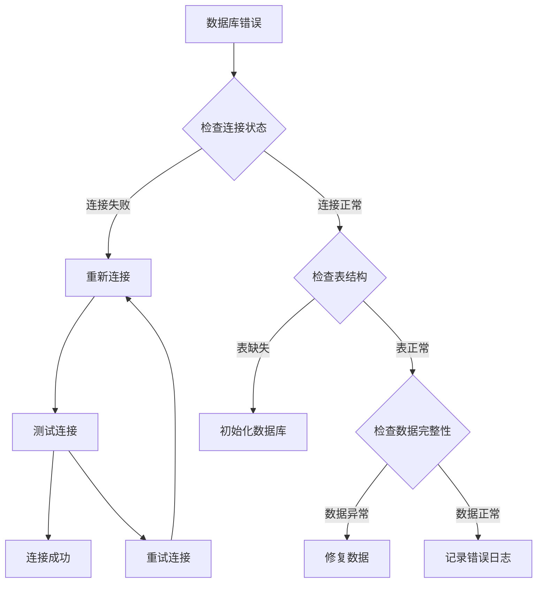
```mermaid
flowchart TD
DBError[数据库错误] --> CheckConnection{检查连接状态}
CheckConnection --> |连接失败| Reconnect[重新连接]
CheckConnection --> |连接正常| CheckSchema{检查表结构}
CheckSchema --> |表缺失| InitializeDB[初始化数据库]
CheckSchema --> |表正常| CheckData{检查数据完整性}
CheckData --> |数据异常| RepairData[修复数据]
CheckData --> |数据正常| LogError[记录错误日志]
Reconnect --> TestConnection[测试连接]
TestConnection --> Success[连接成功]
TestConnection --> Retry[重试连接]
Retry --> Reconnect
```

**图表来源**
- [index.js:56-190](file://src/database/index.js#L56-L190)

#### 事务处理问题

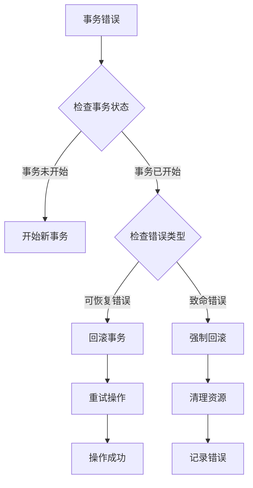
```mermaid
flowchart TD
TransactionError[事务错误] --> CheckTransaction{检查事务状态}
CheckTransaction --> |事务未开始| StartNew[开始新事务]
CheckTransaction --> |事务已开始| CheckErrorType{检查错误类型}
CheckErrorType --> |可恢复错误| Rollback[回滚事务]
CheckErrorType --> |致命错误| ForceRollback[强制回滚]
Rollback --> RetryOperation[重试操作]
ForceRollback --> Cleanup[清理资源]
RetryOperation --> Success[操作成功]
Cleanup --> LogError[记录错误]
```

**图表来源**
- [index.js:354-374](file://src/database/index.js#L354-L374)

### 调试工具和方法

应用提供了完善的调试支持：

1. **控制台日志**：详细的执行流程日志
2. **错误边界**：全局错误捕获和处理
3. **性能监控**：关键操作的性能指标
4. **数据验证**：输入数据的完整性检查

**章节来源**
- [index.js:199-264](file://src/database/index.js#L199-L264)
- [AddIncomePage.vue:454-459](file://src/components/mobile/income/AddIncomePage.vue#L454-L459)

## 结论

该收入管理系统展现了现代前端应用的最佳实践，具有以下显著优势：

### 技术优势

1. **架构清晰**：采用分层架构，职责分离明确
2. **性能优秀**：多层性能优化策略确保流畅体验
3. **扩展性强**：模块化设计便于功能扩展
4. **跨平台支持**：统一代码库支持多平台部署

### 功能完整性

1. **全流程覆盖**：从数据录入到统计分析的完整闭环
2. **用户体验优秀**：直观的界面设计和流畅的操作体验
3. **数据准确性**：严格的事务处理确保财务数据准确
4. **可视化丰富**：多维度的数据可视化展示

### 发展前景

该系统为未来的功能扩展奠定了坚实基础，可以轻松集成更多财务管理功能，如预算管理、投资分析等高级功能。其模块化的设计使得开发团队能够快速迭代和优化产品功能。

通过持续的技术改进和功能完善，该收入管理系统将成为财务管理领域的优秀解决方案。