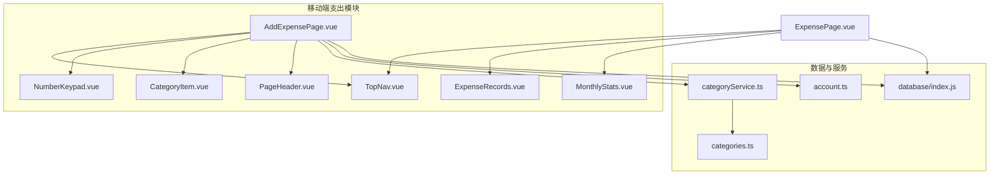
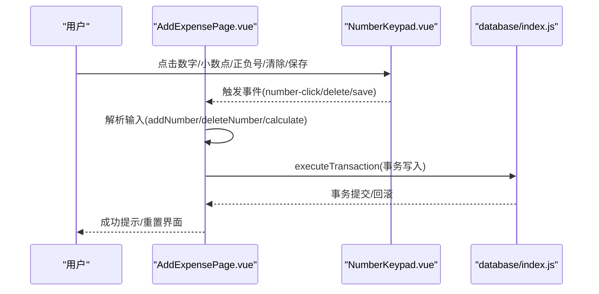
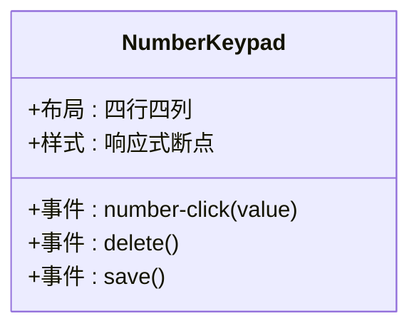
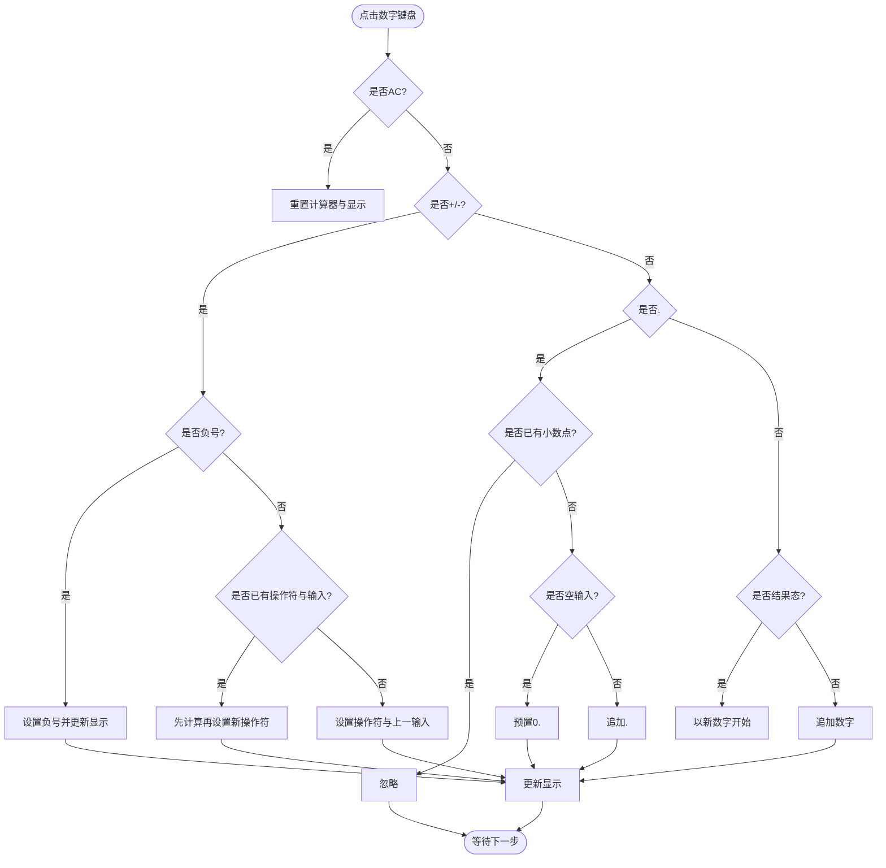
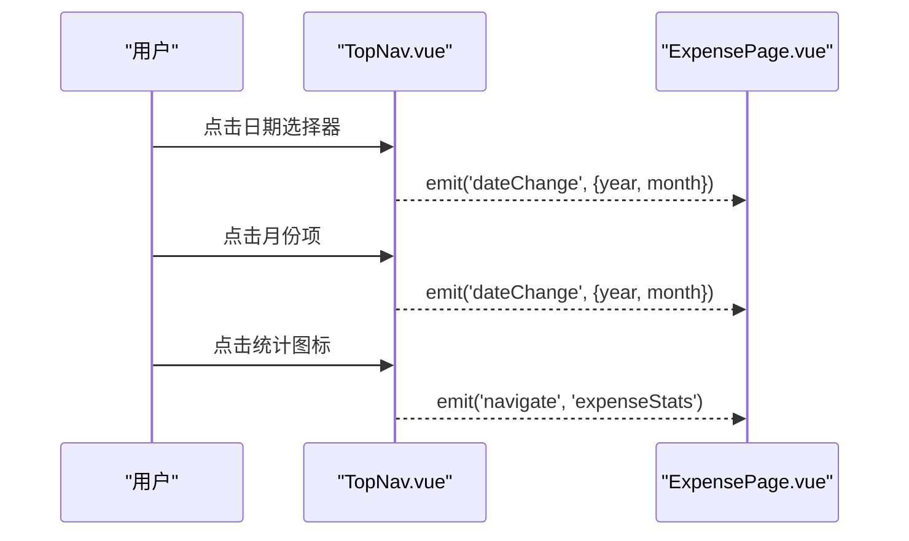
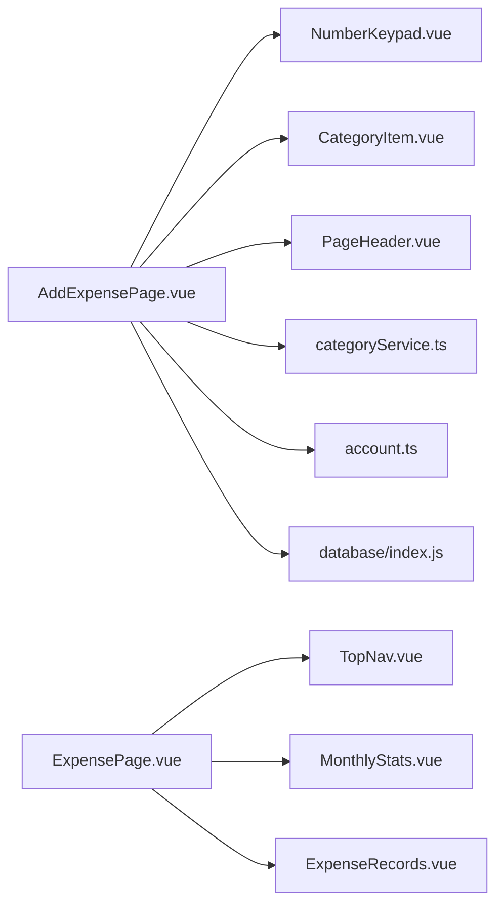

# 输入组件

<cite>
**本文引用的文件**
- [NumberKeypad.vue](file://src/components/mobile/expense/NumberKeypad.vue)
- [TopNav.vue](file://src/components/mobile/expense/TopNav.vue)
- [AddExpensePage.vue](file://src/components/mobile/expense/AddExpensePage.vue)
- [ExpensePage.vue](file://src/components/mobile/expense/ExpensePage.vue)
- [CategoryItem.vue](file://src/components/mobile/expense/CategoryItem.vue)
- [PageHeader.vue](file://src/components/common/PageHeader.vue)
- [ExpenseRecords.vue](file://src/components/mobile/expense/ExpenseRecords.vue)
- [MonthlyStats.vue](file://src/components/mobile/expense/MonthlyStats.vue)
- [categories.ts](file://src/data/categories.ts)
- [categoryService.ts](file://src/services/categoryService.ts)
- [account.ts](file://src/stores/account.ts)
- [index.js](file://src/database/index.js)
</cite>

## 目录
1. [简介](#简介)
2. [项目结构](#项目结构)
3. [核心组件](#核心组件)
4. [架构总览](#架构总览)
5. [详细组件分析](#详细组件分析)
6. [依赖关系分析](#依赖关系分析)
7. [性能考量](#性能考量)
8. [故障排查指南](#故障排查指南)
9. [结论](#结论)
10. [附录](#附录)

## 简介
本文件聚焦于支出管理模块中的两个关键输入组件：数字键盘组件 NumberKeypad 与顶部导航组件 TopNav。我们将深入解析它们在移动端的实现细节，包括数字键盘的布局与输入逻辑、小数点与正负号处理、移动端触摸与响应式适配；以及 TopNav 的日期选择、月份切换与导航控制流程。同时，文档将阐述组件间的通信机制（父子组件数据传递、事件处理、状态同步）、最佳实践（用户体验优化、输入效率、错误处理）、可定制性（样式与功能扩展），并提供复用与扩展的技术指导。

## 项目结构
支出管理相关的组件主要位于 src/components/mobile/expense 目录下，配合通用组件与数据层服务：
- 输入组件：NumberKeypad.vue、TopNav.vue
- 页面容器：AddExpensePage.vue、ExpensePage.vue
- 业务子组件：CategoryItem.vue、ExpenseRecords.vue、MonthlyStats.vue
- 通用头部：PageHeader.vue
- 数据与服务：categories.ts、categoryService.ts、account.ts
- 数据库与事务：index.js

图表来源
- [AddExpensePage.vue:1-106](file://src/components/mobile/expense/AddExpensePage.vue#L1-L106)
- [TopNav.vue:1-47](file://src/components/mobile/expense/TopNav.vue#L1-L47)
- [NumberKeypad.vue:1-30](file://src/components/mobile/expense/NumberKeypad.vue#L1-L30)
- [CategoryItem.vue:1-22](file://src/components/mobile/expense/CategoryItem.vue#L1-L22)
- [ExpenseRecords.vue:1-27](file://src/components/mobile/expense/ExpenseRecords.vue#L1-L27)
- [MonthlyStats.vue:1-33](file://src/components/mobile/expense/MonthlyStats.vue#L1-L33)
- [PageHeader.vue:1-9](file://src/components/common/PageHeader.vue#L1-L9)
- [categories.ts:1-45](file://src/data/categories.ts#L1-L45)
- [categoryService.ts:1-70](file://src/services/categoryService.ts#L1-L70)
- [account.ts:1-32](file://src/stores/account.ts#L1-L32)
- [index.js:1-32](file://src/database/index.js#L1-L32)

章节来源
- [AddExpensePage.vue:1-106](file://src/components/mobile/expense/AddExpensePage.vue#L1-L106)
- [TopNav.vue:1-47](file://src/components/mobile/expense/TopNav.vue#L1-L47)
- [NumberKeypad.vue:1-30](file://src/components/mobile/expense/NumberKeypad.vue#L1-L30)
- [ExpensePage.vue:1-21](file://src/components/mobile/expense/ExpensePage.vue#L1-L21)

## 核心组件
- NumberKeypad：移动端数字输入键盘，提供数字、小数点、正负号、清除与保存等按键事件，支持响应式布局与触摸反馈。
- TopNav：顶部导航与日期选择器，支持年份与月份选择，并向父组件发出日期变更与导航事件。

章节来源
- [NumberKeypad.vue:1-106](file://src/components/mobile/expense/NumberKeypad.vue#L1-L106)
- [TopNav.vue:1-211](file://src/components/mobile/expense/TopNav.vue#L1-L211)

## 架构总览
以下序列图展示了从页面到组件再到数据库的典型输入流程：用户在新增支出页通过数字键盘输入金额，页面组件负责解析与校验，最终通过数据库事务安全地写入流水与账户余额。

图表来源
- [AddExpensePage.vue:239-362](file://src/components/mobile/expense/AddExpensePage.vue#L239-L362)
- [NumberKeypad.vue:32-37](file://src/components/mobile/expense/NumberKeypad.vue#L32-L37)
- [index.js:354-374](file://src/database/index.js#L354-L374)

章节来源
- [AddExpensePage.vue:239-482](file://src/components/mobile/expense/AddExpensePage.vue#L239-L482)
- [index.js:354-374](file://src/database/index.js#L354-L374)

## 详细组件分析

### NumberKeypad 数字键盘组件
- 组件职责
  - 提供数字键(1-9)、0、小数点、正负号(+/-)、清除(AC)、删除(❌)与保存(保存)按键。
  - 通过事件发射器向外传递按键点击、删除与保存事件，供父组件处理。
- 布局与交互
  - 采用四行布局，最后一行包含 AC、0、.、保存四个按键，视觉上形成“数字+运算+清除+保存”的紧凑布局。
  - 按键项使用 flex 布局，统一高度与字体大小，支持 hover 效果与媒体查询适配不同屏幕尺寸。
- 移动端优化
  - 响应式断点：在 375px 与 320px 下分别调整按键高度与字体大小，保证在小屏设备上的可触达性。
  - 触摸反馈：按键设置 cursor: pointer，配合 hover 背景色变化，增强点击反馈。
- 事件定义
  - number-click：携带字符串值，支持数字、小数点、正负号与 AC。
  - delete：删除最后一个字符或操作符。
  - save：触发保存流程。

图表来源
- [NumberKeypad.vue:32-37](file://src/components/mobile/expense/NumberKeypad.vue#L32-L37)
- [NumberKeypad.vue:40-106](file://src/components/mobile/expense/NumberKeypad.vue#L40-L106)

章节来源
- [NumberKeypad.vue:1-106](file://src/components/mobile/expense/NumberKeypad.vue#L1-L106)

### AddExpensePage 新增支出页面（与数字键盘协作）
- 金额输入与解析
  - 维护一个计算器状态对象，包含 display、currentInput、previousInput、operator、isResult 等字段，用于构建表达式与实时显示。
  - addNumber 处理数字、小数点、正负号与 AC 清除逻辑；deleteNumber 支持逐位删除与撤销操作符；calculate 执行加减运算并格式化结果。
- 输入验证与保存
  - 保存前进行账户、分类、金额有效性校验；对账户类型（流动资金/信用卡）进行余额与可用额度检查；通过数据库事务批量写入流水与账户余额。
- 日期与账户选择
  - 提供日期时间选择弹窗与账户选择抽屉，支持格式化显示与选择确认。
- 与数字键盘通信
  - 通过 @number-click/@delete/@save 事件绑定，将按键动作转化为金额计算与保存流程。

图表来源
- [AddExpensePage.vue:239-336](file://src/components/mobile/expense/AddExpensePage.vue#L239-L336)

章节来源
- [AddExpensePage.vue:239-482](file://src/components/mobile/expense/AddExpensePage.vue#L239-L482)

### TopNav 顶部导航组件
- 日期选择器
  - 展示当前选中的年-月，点击展开年份列表与月份网格。
  - 年份列表支持高亮当前年份，点击切换年份；月份网格采用 3 列布局，点击切换月份并关闭日期选择器。
- 导航控制
  - 提供统计图标导航，点击触发 navigate 事件，供父组件路由跳转。
- 事件与状态
  - emit('dateChange', { year, month })：日期变更事件。
  - emit('navigate', 'expenseStats')：导航事件。
  - 内部维护 showDatePicker、selectedYear、selectedMonth 与 computed selectedDate。

图表来源
- [TopNav.vue:58-88](file://src/components/mobile/expense/TopNav.vue#L58-L88)
- [ExpensePage.vue:46-77](file://src/components/mobile/expense/ExpensePage.vue#L46-L77)

章节来源
- [TopNav.vue:1-211](file://src/components/mobile/expense/TopNav.vue#L1-L211)
- [ExpensePage.vue:1-88](file://src/components/mobile/expense/ExpensePage.vue#L1-L88)

### ExpensePage 支出主页面（TopNav 的消费者）
- 接收 TopNav 的日期变更事件，更新当前年月。
- 条件渲染：若为当前月份，则显示周统计；并展示月统计与支出记录。
- 提供浮动菜单，点击“新增支出”触发导航事件。

章节来源
- [ExpensePage.vue:1-88](file://src/components/mobile/expense/ExpensePage.vue#L1-L88)

### 与其他组件的协作
- AddExpensePage 与 CategoryItem：分类网格通过 CategoryItem 子组件展示与选择分类，支持选中态样式。
- AddExpensePage 与 PageHeader：通用头部提供返回事件，便于页面导航。
- ExpensePage 与 MonthlyStats/ExpenseRecords：TopNav 的日期选择影响月统计与记录列表的数据源。

章节来源
- [CategoryItem.vue:1-69](file://src/components/mobile/expense/CategoryItem.vue#L1-L69)
- [PageHeader.vue:1-57](file://src/components/common/PageHeader.vue#L1-L57)
- [MonthlyStats.vue:1-105](file://src/components/mobile/expense/MonthlyStats.vue#L1-L105)
- [ExpenseRecords.vue:1-105](file://src/components/mobile/expense/ExpenseRecords.vue#L1-L105)

## 依赖关系分析
- 组件间依赖
  - AddExpensePage 依赖 NumberKeypad、CategoryItem、PageHeader；与数据库服务、账户 Store、分类服务交互。
  - ExpensePage 依赖 TopNav、MonthlyStats、ExpenseRecords、FloatingActionMenu。
- 外部依赖
  - Element Plus 图标与组件用于交互元素与样式。
  - Pinia Store 提供账户状态管理。
  - 自定义数据库管理器提供跨平台 SQLite 访问与事务执行。

图表来源
- [AddExpensePage.vue:108-118](file://src/components/mobile/expense/AddExpensePage.vue#L108-L118)
- [ExpensePage.vue:23-31](file://src/components/mobile/expense/ExpensePage.vue#L23-L31)
- [TopNav.vue:49-51](file://src/components/mobile/expense/TopNav.vue#L49-L51)
- [MonthlyStats.vue:25-27](file://src/components/mobile/expense/MonthlyStats.vue#L25-L27)
- [ExpenseRecords.vue:14-16](file://src/components/mobile/expense/ExpenseRecords.vue#L14-L16)
- [categoryService.ts:1-3](file://src/services/categoryService.ts#L1-L3)
- [account.ts:1-6](file://src/stores/account.ts#L1-L6)
- [index.js:1-11](file://src/database/index.js#L1-L11)

章节来源
- [AddExpensePage.vue:108-118](file://src/components/mobile/expense/AddExpensePage.vue#L108-L118)
- [ExpensePage.vue:23-31](file://src/components/mobile/expense/ExpensePage.vue#L23-L31)

## 性能考量
- 数据库事务
  - 新增支出使用 executeTransaction 批量写入，确保原子性与一致性，避免多次往返带来的性能损耗。
- 查询缓存
  - 数据库管理器内置 Map 缓存，减少重复查询成本（可按需启用）。
- 响应式布局
  - NumberKeypad 与 MonthlyStats 在小屏设备上降低尺寸，减少重排与绘制压力。
- 事件与状态
  - AddExpensePage 的计算器状态集中管理，避免频繁 DOM 操作与复杂计算。

章节来源
- [AddExpensePage.vue:455-459](file://src/components/mobile/expense/AddExpensePage.vue#L455-L459)
- [index.js:20-32](file://src/database/index.js#L20-L32)
- [NumberKeypad.vue:82-105](file://src/components/mobile/expense/NumberKeypad.vue#L82-L105)
- [MonthlyStats.vue:187-207](file://src/components/mobile/expense/MonthlyStats.vue#L187-L207)

## 故障排查指南
- 保存失败与回滚
  - 若事务执行异常，数据库层会自动回滚，前端捕获错误并提示用户重试。
- 余额不足或额度不足
  - 对流动资金账户检查余额，对信用卡检查可用额度，不足时给出明确提示。
- 日期选择异常
  - TopNav 的日期选择器通过 v-if 控制显隐，确保点击外部区域可关闭；如出现无法关闭，检查事件冒泡与状态切换逻辑。
- 分类与账户加载
  - 分类服务初始化默认分类，若数据库无数据则回退默认集合；账户 Store 提供统一加载入口，确保数据一致性。

章节来源
- [AddExpensePage.vue:464-469](file://src/components/mobile/expense/AddExpensePage.vue#L464-L469)
- [AddExpensePage.vue:397-408](file://src/components/mobile/expense/AddExpensePage.vue#L397-L408)
- [TopNav.vue:11-45](file://src/components/mobile/expense/TopNav.vue#L11-L45)
- [categoryService.ts:199-260](file://src/services/categoryService.ts#L199-L260)
- [account.ts:34-53](file://src/stores/account.ts#L34-L53)

## 结论
NumberKeypad 与 TopNav 在移动端支出管理中承担了输入与导航的核心职责。前者通过简洁的布局与事件驱动，提供了高效的数字输入体验；后者通过直观的日期选择与导航控制，提升了页面切换与数据筛选的效率。二者与页面容器、服务与数据库协同工作，形成了稳定、可扩展的输入与导航体系。建议在后续迭代中进一步完善键盘手势支持、输入法兼容与无障碍访问，持续优化性能与用户体验。

## 附录

### 组件通信机制
- 父子组件数据传递
  - AddExpensePage 通过 props 向 CategoryItem 传递分类数据与选中状态；TopNav 通过 props 接收年月并在内部维护状态。
- 事件处理
  - NumberKeypad 通过 emit('number-click'|'delete'|'save') 与父组件通信；TopNav 通过 emit('dateChange'|'navigate') 通知 ExpensePage。
- 状态同步
  - AddExpensePage 内部维护计算器状态与显示文本；TopNav 内部维护日期选择状态；ExpensePage 通过事件接收并更新当前年月。

章节来源
- [CategoryItem.vue:8-21](file://src/components/mobile/expense/CategoryItem.vue#L8-L21)
- [NumberKeypad.vue:32-37](file://src/components/mobile/expense/NumberKeypad.vue#L32-L37)
- [TopNav.vue:58-88](file://src/components/mobile/expense/TopNav.vue#L58-L88)
- [ExpensePage.vue:46-77](file://src/components/mobile/expense/ExpensePage.vue#L46-L77)

### 最佳实践
- 用户体验
  - 数字键盘按键反馈明显，建议增加按下动画与声音反馈（可选）。
  - 日期选择器点击外部区域关闭，提升易用性。
- 输入效率
  - 支持连续加减与即时结果显示，减少用户记忆负担。
  - 小数点与负号的边界处理清晰，避免歧义。
- 错误处理
  - 保存前严格校验账户与金额；余额/额度不足时给出明确提示与上下文信息。
- 可定制性
  - 样式通过 scoped CSS 与媒体查询实现，易于主题化与品牌化。
  - 事件接口清晰，便于扩展新功能（如手势、快捷键、语音输入）。

### 可扩展性与复用
- 组件封装
  - NumberKeypad 可抽取为独立包，支持自定义按键布局与事件扩展。
  - TopNav 可抽象为通用日期选择器，支持多场景复用。
- API 设计
  - 事件命名统一、参数结构清晰，便于第三方集成。
- 性能优化
  - 数据库事务与查询缓存结合，减少 IO 次数；响应式布局适配多设备。