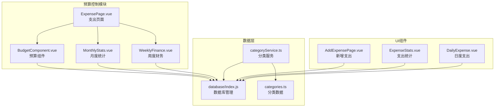
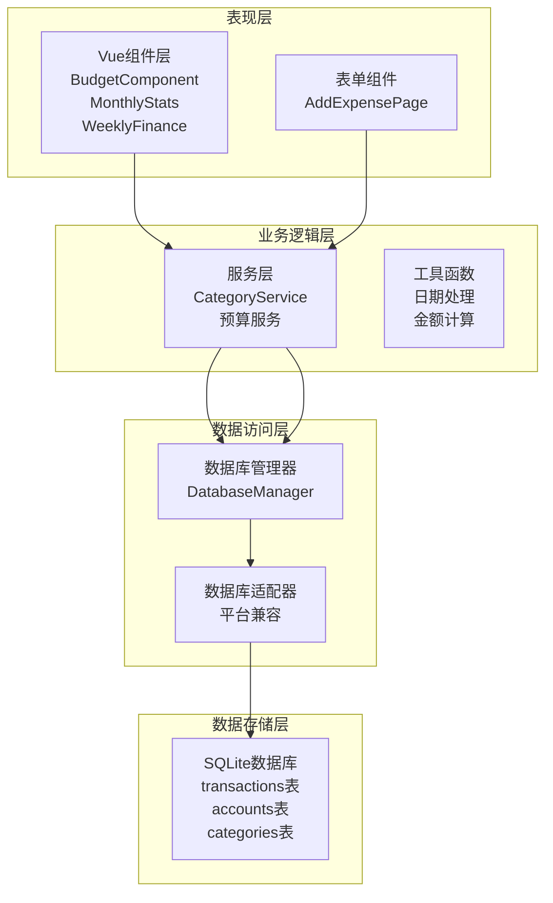
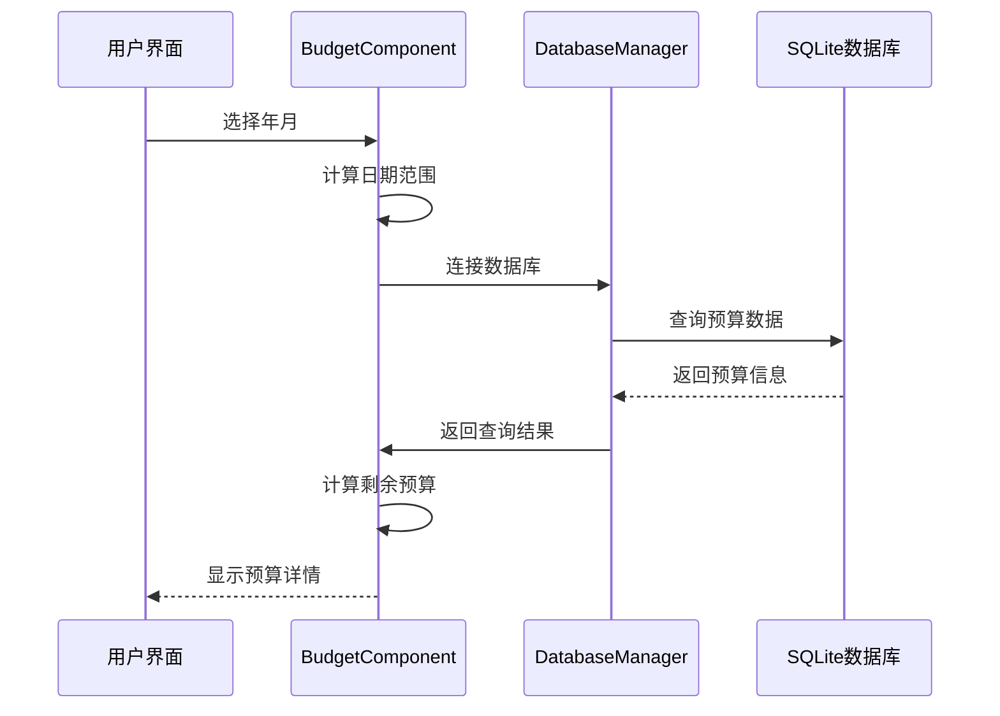
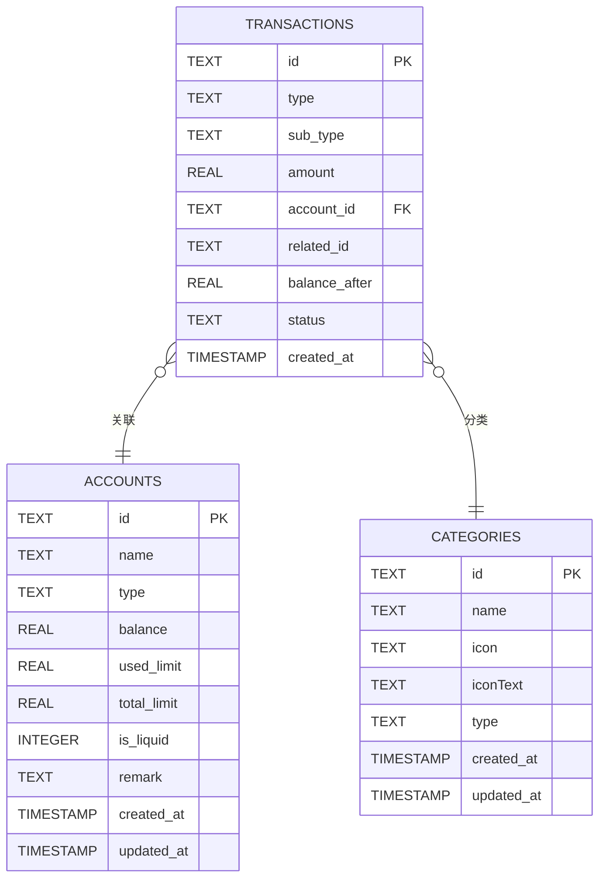
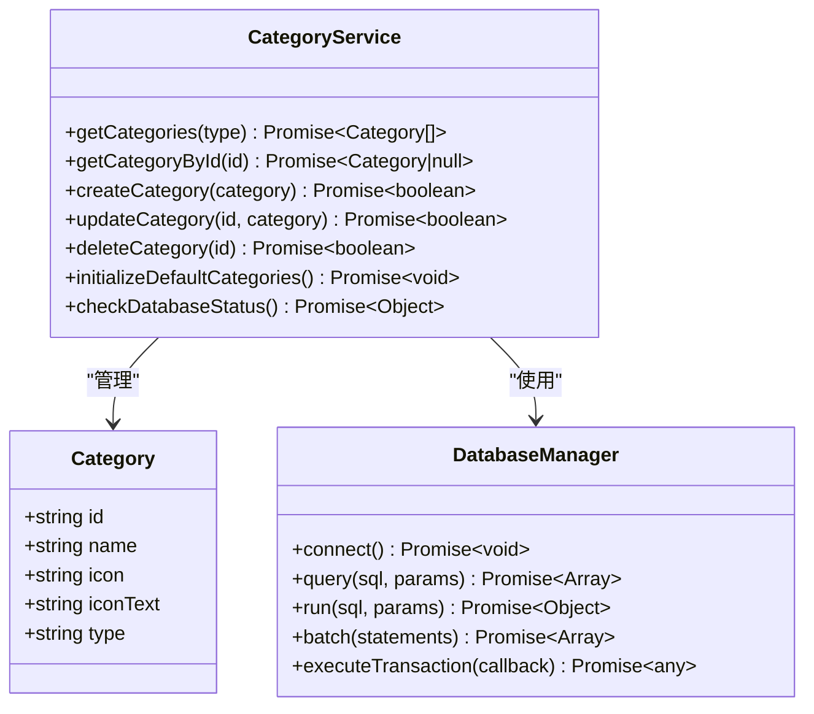
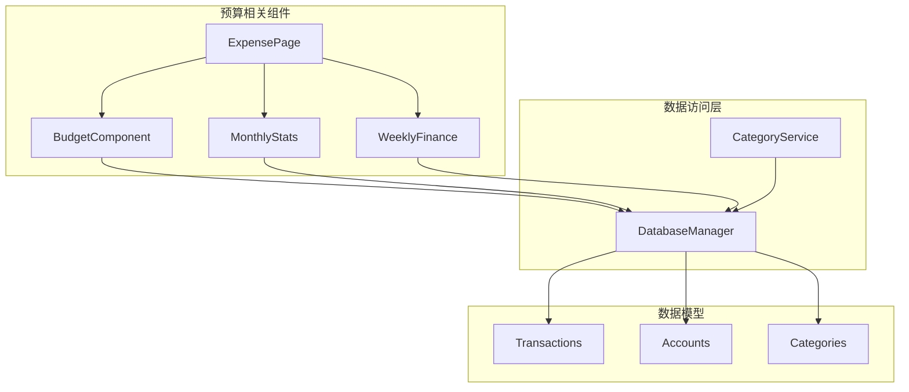
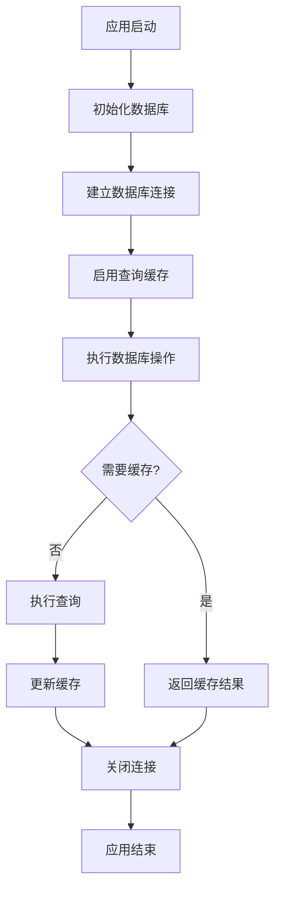

# 预算控制系统

<cite>
**本文档引用的文件**
- [BudgetComponent.vue](file://src/components/mobile/expense/BudgetComponent.vue)
- [ExpensePage.vue](file://src/components/mobile/expense/ExpensePage.vue)
- [MonthlyStats.vue](file://src/components/mobile/expense/MonthlyStats.vue)
- [WeeklyFinance.vue](file://src/components/mobile/expense/WeeklyFinance.vue)
- [categories.ts](file://src/data/categories.ts)
- [categoryService.ts](file://src/services/categoryService.ts)
- [index.js](file://src/database/index.js)
- [adapter.js](file://src/database/adapter.js)
- [AddExpensePage.vue](file://src/components/mobile/expense/AddExpensePage.vue)
- [ExpenseStats.vue](file://src/components/mobile/expense/ExpenseStats.vue)
- [DailyExpense.vue](file://src/components/mobile/expense/DailyExpense.vue)
</cite>

## 目录
1. [简介](#简介)
2. [项目结构](#项目结构)
3. [核心组件](#核心组件)
4. [架构概览](#架构概览)
5. [详细组件分析](#详细组件分析)
6. [依赖关系分析](#依赖关系分析)
7. [性能考虑](#性能考虑)
8. [故障排除指南](#故障排除指南)
9. [结论](#结论)
10. [附录](#附录)

## 简介

预算控制系统是财务管理应用中的核心模块，负责实现全面的预算管理功能。该系统基于Vue 3 + TypeScript构建，采用SQLite数据库进行数据持久化，支持移动端和Web端的跨平台部署。

系统当前实现了基础的预算跟踪功能，包括月度预算显示、支出统计和预算使用情况监控。虽然预算表尚未完全实现，但系统已经具备了完整的预算管理框架，可以轻松扩展以支持更复杂的预算类型和管理策略。

## 项目结构

预算控制系统位于项目的移动端expense模块中，采用组件化的架构设计：



**图表来源**
- [BudgetComponent.vue:1-127](file://src/components/mobile/expense/BudgetComponent.vue#L1-L127)
- [ExpensePage.vue:1-88](file://src/components/mobile/expense/ExpensePage.vue#L1-L88)
- [index.js:1-935](file://src/database/index.js#L1-L935)

**章节来源**
- [BudgetComponent.vue:1-127](file://src/components/mobile/expense/BudgetComponent.vue#L1-L127)
- [ExpensePage.vue:1-88](file://src/components/mobile/expense/ExpensePage.vue#L1-L88)
- [index.js:1-935](file://src/database/index.js#L1-L935)

## 核心组件

### 预算组件 (BudgetComponent)

预算组件是预算控制系统的核心界面组件，负责展示用户的预算信息和使用情况。

**主要功能特性：**
- 显示月度预算总额和剩余预算
- 实时计算预算使用率
- 支持年月参数传递
- 自动数据刷新机制

**数据结构：**
```typescript
interface BudgetData {
  totalBudget: number;      // 总预算金额
  remainingBudget: number;  // 剩余预算金额
  year: number;             // 年份
  month: number;            // 月份
}
```

**章节来源**
- [BudgetComponent.vue:20-77](file://src/components/mobile/expense/BudgetComponent.vue#L20-L77)

### 月度统计组件 (MonthlyStats)

月度统计组件提供详细的月度财务概览，包括收入、支出和结余情况。

**核心功能：**
- 计算指定月份的总支出
- 统计指定月份的总收入
- 展示月度财务总结
- 支持动态日期范围查询

**章节来源**
- [MonthlyStats.vue:25-105](file://src/components/mobile/expense/MonthlyStats.vue#L25-L105)

### 周度财务组件 (WeeklyFinance)

周度财务组件专注于短期财务监控，提供本周支出的可视化展示。

**功能特点：**
- 按日统计本周支出
- 图表化展示支出趋势
- 实时计算每日支出
- 响应式设计适配

**章节来源**
- [WeeklyFinance.vue:21-159](file://src/components/mobile/expense/WeeklyFinance.vue#L21-L159)

## 架构概览

预算控制系统采用分层架构设计，确保代码的可维护性和扩展性：



**图表来源**
- [BudgetComponent.vue:21-23](file://src/components/mobile/expense/BudgetComponent.vue#L21-L23)
- [categoryService.ts:8-260](file://src/services/categoryService.ts#L8-L260)
- [index.js:21-935](file://src/database/index.js#L21-L935)

**章节来源**
- [categoryService.ts:1-260](file://src/services/categoryService.ts#L1-L260)
- [index.js:1-935](file://src/database/index.js#L1-L935)

## 详细组件分析

### 预算组件深度分析

#### 数据流处理



**图表来源**
- [BudgetComponent.vue:35-66](file://src/components/mobile/expense/BudgetComponent.vue#L35-L66)
- [index.js:199-264](file://src/database/index.js#L199-L264)

#### 预算计算逻辑

预算组件实现了以下计算流程：
1. **预算获取**：从数据库查询指定月份的预算
2. **支出统计**：计算指定月份的总支出
3. **余额计算**：剩余预算 = 总预算 - 总支出
4. **错误处理**：异常情况下使用默认数据

**章节来源**
- [BudgetComponent.vue:35-66](file://src/components/mobile/expense/BudgetComponent.vue#L35-L66)

### 数据库架构分析

#### 表结构设计



**图表来源**
- [index.js:454-466](file://src/database/index.js#L454-L466)
- [index.js:437-448](file://src/database/index.js#L437-L448)
- [index.js:665-673](file://src/database/index.js#L665-L673)

#### 数据库管理器设计

数据库管理器采用单例模式，支持多种平台：

**核心特性：**
- **平台适配**：支持Capacitor SQLite和SQL.js
- **连接管理**：智能连接池和缓存机制
- **事务支持**：完整的ACID事务保证
- **性能优化**：批量操作和查询缓存

**章节来源**
- [index.js:21-935](file://src/database/index.js#L21-L935)
- [adapter.js:14-34](file://src/database/adapter.js#L14-L34)

### 分类管理系统

#### 分类服务架构



**图表来源**
- [categoryService.ts:8-260](file://src/services/categoryService.ts#L8-L260)
- [categories.ts:1-45](file://src/data/categories.ts#L1-L45)
- [index.js:21-935](file://src/database/index.js#L21-L935)

**章节来源**
- [categoryService.ts:1-260](file://src/services/categoryService.ts#L1-L260)
- [categories.ts:1-45](file://src/data/categories.ts#L1-L45)

## 依赖关系分析

### 组件间依赖关系



**图表来源**
- [ExpensePage.vue:28-31](file://src/components/mobile/expense/ExpensePage.vue#L28-L31)
- [BudgetComponent.vue:23](file://src/components/mobile/expense/BudgetComponent.vue#L23)
- [MonthlyStats.vue:27](file://src/components/mobile/expense/MonthlyStats.vue#L27)

### 外部依赖分析

**核心依赖：**
- **Vue 3 + TypeScript**：前端框架和类型系统
- **Element Plus**：UI组件库
- **SQL.js**：Web端SQLite实现
- **Capacitor SQLite**：移动端数据库插件
- **ECharts**：数据可视化

**章节来源**
- [ExpensePage.vue:24-31](file://src/components/mobile/expense/ExpensePage.vue#L24-L31)
- [BudgetComponent.vue:21-22](file://src/components/mobile/expense/BudgetComponent.vue#L21-L22)

## 性能考虑

### 数据库性能优化

系统采用了多项性能优化措施：

**缓存机制：**
- 查询结果缓存，避免重复查询
- 连接状态缓存，减少连接开销
- 自动清理机制，防止内存泄漏

**批量操作：**
- 批量插入和更新操作
- 事务处理保证数据一致性
- 延迟持久化优化Web端性能

**索引优化：**
- 关键查询字段建立索引
- 频繁查询的表添加复合索引
- 动态索引管理

### 内存管理



**图表来源**
- [index.js:199-264](file://src/database/index.js#L199-L264)
- [index.js:413-415](file://src/database/index.js#L413-L415)

**章节来源**
- [index.js:13-18](file://src/database/index.js#L13-L18)
- [index.js:413-415](file://src/database/index.js#L413-L415)

## 故障排除指南

### 常见问题及解决方案

**数据库连接问题：**
- **症状**：组件加载失败，显示默认数据
- **原因**：数据库连接异常或初始化失败
- **解决**：检查数据库状态，重新初始化

**预算数据显示异常：**
- **症状**：预算金额显示为默认值
- **原因**：预算表数据缺失或查询错误
- **解决**：验证预算数据完整性，检查查询条件

**性能问题：**
- **症状**：页面加载缓慢，响应延迟
- **原因**：查询未使用索引，缓存未生效
- **解决**：优化查询语句，启用缓存

**章节来源**
- [BudgetComponent.vue:60-65](file://src/components/mobile/expense/BudgetComponent.vue#L60-L65)
- [categoryService.ts:181-194](file://src/services/categoryService.ts#L181-L194)

### 调试工具

系统提供了完善的调试和监控功能：

**数据库状态监控：**
- 连接状态检查
- 查询性能分析
- 错误日志记录

**组件状态监控：**
- 数据加载状态
- 计算结果验证
- 用户交互反馈

## 结论

预算控制系统是一个功能完整、架构清晰的财务管理解决方案。系统具备以下优势：

**技术优势：**
- 基于Vue 3的现代化前端架构
- 跨平台兼容的数据库设计
- 完善的错误处理和性能优化
- 可扩展的服务层设计

**功能优势：**
- 实时预算跟踪和监控
- 多维度财务数据分析
- 用户友好的界面设计
- 灵活的预算管理策略

**扩展潜力：**
- 支持多种预算类型和管理方式
- 可定制的预算规则和阈值
- 丰富的报表和分析功能
- 集成第三方财务服务

系统为用户提供了完整的预算管理解决方案，帮助实现财务目标和成本控制。

## 附录

### 预算类型扩展指南

#### 固定预算实现

固定预算适用于稳定的日常支出，如房租、水电费等：

**实现要点：**
- 设定固定的月度预算上限
- 自动计算使用进度
- 超支时触发预警机制

#### 变动预算实现

变动预算适用于消费波动较大的类别，如娱乐、餐饮等：

**实现要点：**
- 基于历史数据设定合理限额
- 支持灵活调整预算额度
- 动态监控消费趋势

#### 项目预算实现

项目预算适用于特定项目的专项支出：

**实现要点：**
- 项目周期内的预算管理
- 支出明细的精确追踪
- 项目完成度的可视化展示

### 预算管理最佳实践

**预算制定策略：**
1. **历史数据分析**：基于过去6-12个月的支出数据制定预算
2. **收入匹配原则**：预算总额不超过月收入的80%
3. **优先级排序**：先保障必需品，再考虑非必需品
4. **应急资金预留**：保留3-6个月的生活费用作为应急资金

**预算控制技巧：**
1. **实时监控**：每天检查预算使用情况
2. **分类管理**：定期审查各分类的预算合理性
3. **调整机制**：根据实际情况及时调整预算
4. **记录分析**：定期分析预算执行情况，优化预算策略

**章节来源**
- [BudgetComponent.vue:45-46](file://src/components/mobile/expense/BudgetComponent.vue#L45-L46)
- [MonthlyStats.vue:83-84](file://src/components/mobile/expense/MonthlyStats.vue#L83-L84)