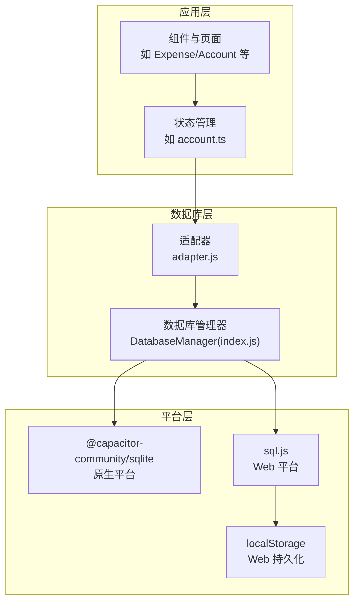
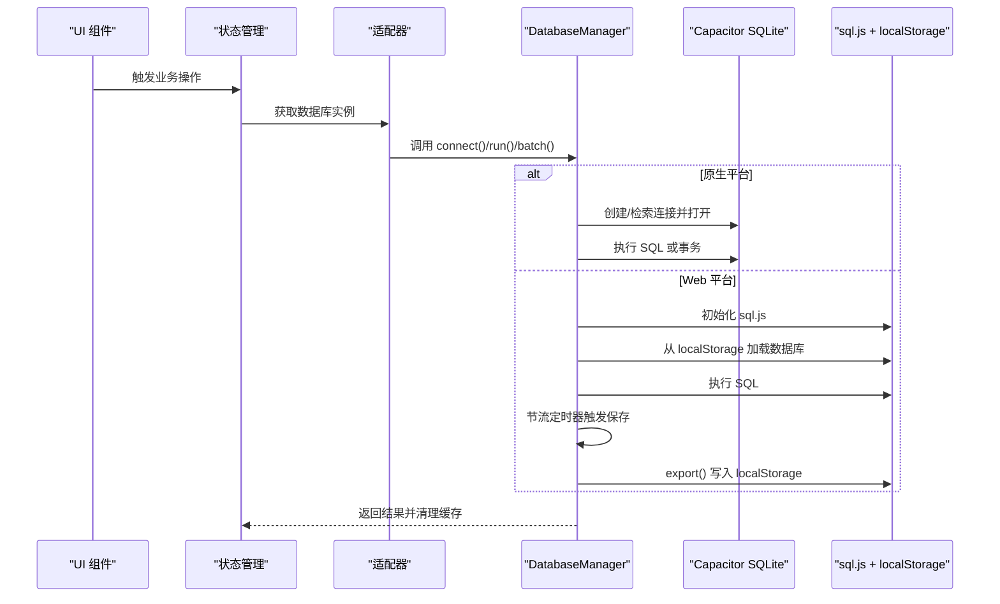
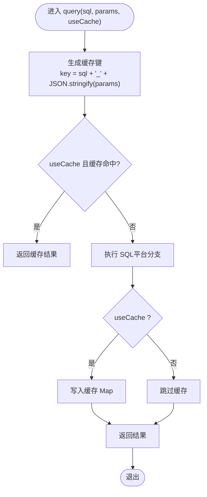
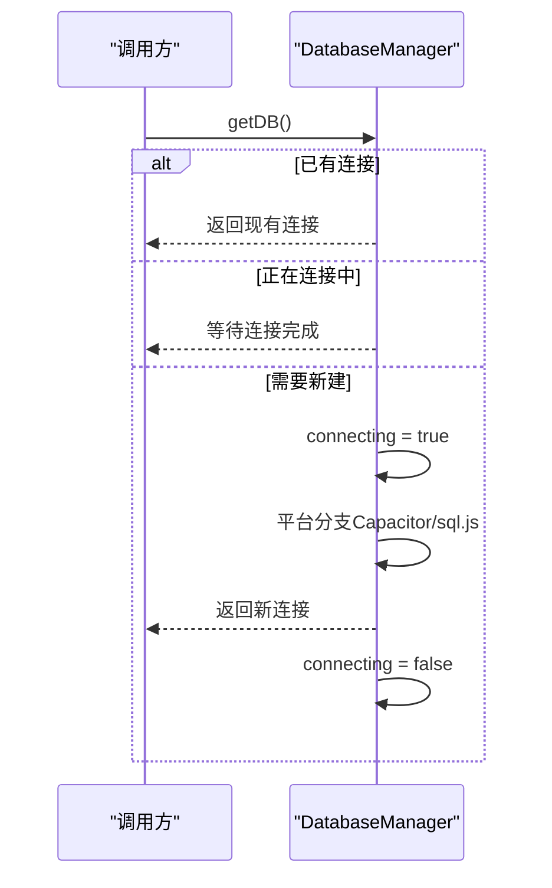
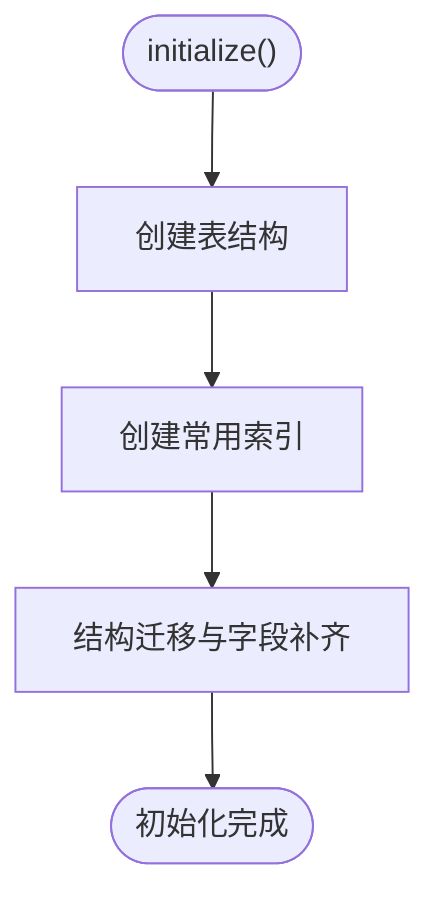
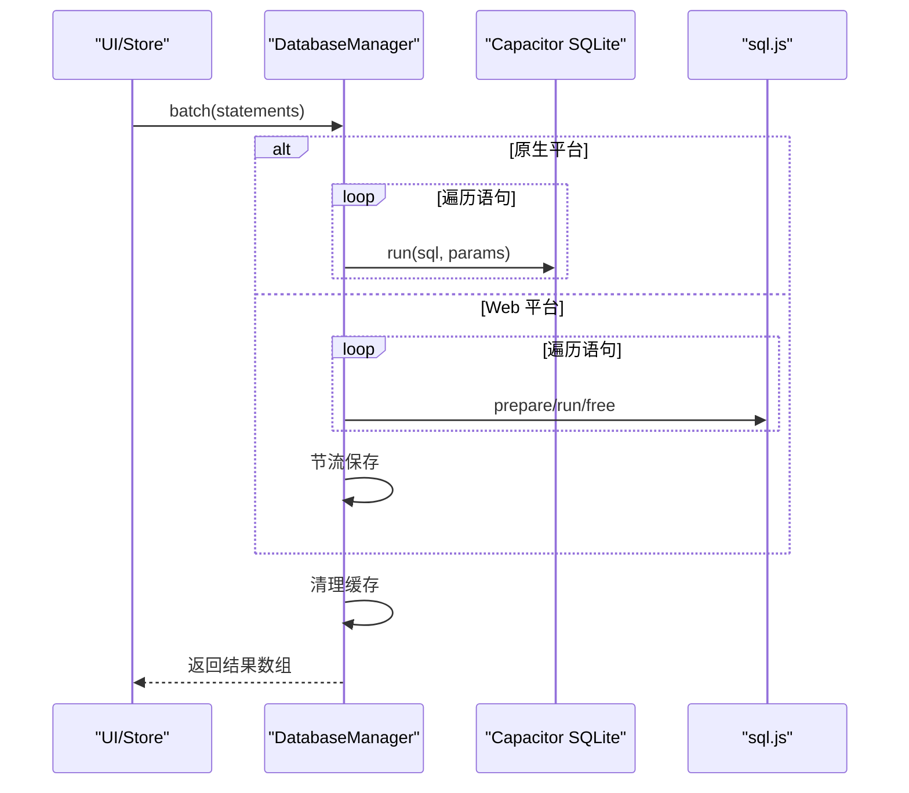
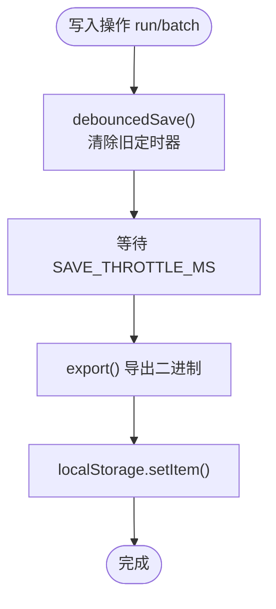
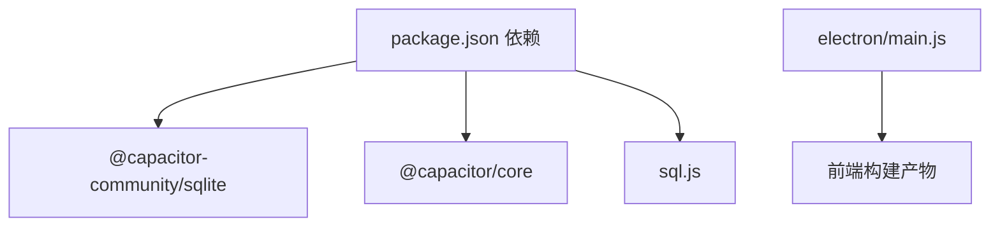

# 性能优化

<cite>
**本文引用的文件**
- [src/database/index.js](file://src/database/index.js)
- [src/database/adapter.js](file://src/database/adapter.js)
- [src/components/mobile/expense/AddExpensePage.vue](file://src/components/mobile/expense/AddExpensePage.vue)
- [src/stores/account.ts](file://src/stores/account.ts)
- [src/services/categoryService.ts](file://src/services/categoryService.ts)
- [src/components/mobile/DatabaseViewer.vue](file://src/components/mobile/DatabaseViewer.vue)
- [package.json](file://package.json)
- [electron/main.js](file://electron/main.js)
- [src/main.ts](file://src/main.ts)
</cite>

## 目录
1. [简介](#简介)
2. [项目结构](#项目结构)
3. [核心组件](#核心组件)
4. [架构总览](#架构总览)
5. [详细组件分析](#详细组件分析)
6. [依赖关系分析](#依赖关系分析)
7. [性能考量](#性能考量)
8. [故障排查指南](#故障排查指南)
9. [结论](#结论)
10. [附录](#附录)

## 简介
本文件聚焦于数据库性能优化，围绕 DatabaseManager 的实现进行系统性剖析，涵盖以下主题：
- 查询缓存机制：缓存策略、缓存键生成、缓存失效处理
- 连接池管理：连接复用、连接状态监控、连接清理
- 索引优化策略：索引设计原则、查询性能提升与存储空间平衡
- 批处理优化：批量插入、批量更新、事务批处理
- Web 环境下的持久化优化：localStorage 节流、数据压缩与增量同步思路
- 性能监控与调试方法
- 性能测试案例与优化效果对比
- 不同设备与环境下的最佳实践

## 项目结构
该项目采用前端多端统一架构，数据库层通过适配器在原生平台与 Web 平台之间切换，核心数据库管理器位于 src/database/index.js，并通过 adapter.js 对外暴露统一接口。

图表来源
- [src/database/adapter.js:14-33](file://src/database/adapter.js#L14-L33)
- [src/database/index.js:8-11](file://src/database/index.js#L8-L11)
- [src/database/index.js:127-144](file://src/database/index.js#L127-L144)
- [src/database/index.js:154-177](file://src/database/index.js#L154-L177)

章节来源
- [src/database/adapter.js:1-34](file://src/database/adapter.js#L1-L34)
- [src/database/index.js:1-190](file://src/database/index.js#L1-L190)

## 核心组件
- DatabaseManager：负责数据库连接、初始化、CRUD、批处理、事务、缓存与持久化；支持单例连接与平台差异化实现。
- 适配器(adapter.js)：根据 Capacitor 平台类型返回对应数据库实现，便于后续扩展。
- 业务组件与服务：如 AddExpensePage.vue、account.ts、categoryService.ts 展示了事务与批处理的实际使用场景。

章节来源
- [src/database/index.js:21-895](file://src/database/index.js#L21-L895)
- [src/database/adapter.js:14-33](file://src/database/adapter.js#L14-L33)

## 架构总览
DatabaseManager 在不同平台采用差异化实现：
- 原生平台：使用 Capacitor SQLite，具备连接复用、一致性检查、连接检索与打开能力。
- Web 平台：使用 sql.js，结合 localStorage 进行延迟持久化与节流。

图表来源
- [src/database/adapter.js:14-33](file://src/database/adapter.js#L14-L33)
- [src/database/index.js:56-189](file://src/database/index.js#L56-L189)
- [src/database/index.js:272-308](file://src/database/index.js#L272-L308)
- [src/database/index.js:379-408](file://src/database/index.js#L379-L408)

## 详细组件分析

### 查询缓存机制
- 缓存策略
  - 仅对查询（query）启用缓存，且需显式传入 useCache=true。
  - 缓存键由 SQL 文本与参数序列化组合而成，保证“语句+参数”完全一致才命中。
  - 写操作（run/batch/executeTransaction）与初始化（initialize）均在成功后清除缓存，避免脏读。
- 缓存键生成
  - 键格式为“SQL文本_参数JSON”，确保参数顺序与内容变化导致缓存失效。
- 缓存失效处理
  - 写入后立即 clearCache()，保证后续读取一致性。
  - 关闭连接时同样清理缓存，防止泄漏。

图表来源
- [src/database/index.js:199-264](file://src/database/index.js#L199-L264)
- [src/database/index.js:301-302](file://src/database/index.js#L301-L302)

章节来源
- [src/database/index.js:199-264](file://src/database/index.js#L199-L264)
- [src/database/index.js:413-415](file://src/database/index.js#L413-L415)

### 连接池管理
- 单例连接
  - DatabaseManager 以单例模式持有 db 实例，避免重复创建连接。
  - getDB() 中通过 connecting 标志串行化连接过程，避免并发重复初始化。
- 连接状态监控
  - 提供 getStatus() 返回 isNative、connected、initialized、connecting、cacheSize 等状态。
- 连接清理
  - close() 在原生平台调用 closeConnection，在 Web 平台调用 db.close()，并清理缓存与定时器。

图表来源
- [src/database/index.js:56-189](file://src/database/index.js#L56-L189)
- [src/database/index.js:826-834](file://src/database/index.js#L826-L834)
- [src/database/index.js:793-821](file://src/database/index.js#L793-L821)

章节来源
- [src/database/index.js:56-189](file://src/database/index.js#L56-L189)
- [src/database/index.js:826-834](file://src/database/index.js#L826-L834)
- [src/database/index.js:793-821](file://src/database/index.js#L793-L821)

### 索引优化策略
- 设计原则
  - 针对高频过滤与排序字段建立索引，减少全表扫描。
  - 平衡查询性能与写入成本，避免过多索引导致 DML 变慢。
- 实现现状
  - 初始化阶段为多张表的关键字段创建索引，覆盖常见查询模式（如按账户、类型、状态等过滤）。
- 建议
  - 结合实际查询日志与 EXPLAIN 分析，持续评估索引使用率与回表情况，动态增删索引。

图表来源
- [src/database/index.js:420-776](file://src/database/index.js#L420-L776)

章节来源
- [src/database/index.js:676-688](file://src/database/index.js#L676-L688)
- [src/database/index.js:694-766](file://src/database/index.js#L694-L766)

### 批处理优化
- 批量插入/更新
  - batch(statements) 支持一次性提交多条 SQL，显著降低往返开销。
  - 原生平台逐条 run，Web 平台逐条 prepare/run/free，最后统一节流保存。
- 事务批处理
  - executeTransaction(statements) 使用底层 executeSet 的自动事务能力，保证原子性。
  - 写入后统一清理缓存，必要时触发持久化。
- 实际使用示例
  - 交易记录与账户余额联动更新：先插入流水，再更新余额，使用事务保证一致性。
  - 转账场景：转出/转入两条更新语句在事务内执行，失败回滚。

图表来源
- [src/database/index.js:316-347](file://src/database/index.js#L316-L347)
- [src/database/index.js:354-374](file://src/database/index.js#L354-L374)
- [src/components/mobile/expense/AddExpensePage.vue:424-455](file://src/components/mobile/expense/AddExpensePage.vue#L424-L455)
- [src/stores/account.ts:163-177](file://src/stores/account.ts#L163-L177)

章节来源
- [src/database/index.js:316-347](file://src/database/index.js#L316-L347)
- [src/database/index.js:354-374](file://src/database/index.js#L354-L374)
- [src/components/mobile/expense/AddExpensePage.vue:424-455](file://src/components/mobile/expense/AddExpensePage.vue#L424-L455)
- [src/stores/account.ts:163-177](file://src/stores/account.ts#L163-L177)

### Web 环境下的持久化优化
- localStorage 节流
  - debouncedSave() 通过定时器合并多次写入，默认节流时间为 1 秒，降低频繁 IO。
- 数据压缩与增量同步
  - 当前实现为完整导出二进制数据并序列化存储，未见内置压缩逻辑。
  - 建议：可引入压缩算法（如 zlib/gzip）与增量标记字段，仅同步变更部分，减少存储体积与加载时间。
- 数据加载
  - 启动时尝试从 localStorage 恢复数据库，失败则创建新实例。

图表来源
- [src/database/index.js:379-408](file://src/database/index.js#L379-L408)
- [src/database/index.js:156-177](file://src/database/index.js#L156-L177)

章节来源
- [src/database/index.js:13-18](file://src/database/index.js#L13-L18)
- [src/database/index.js:379-408](file://src/database/index.js#L379-L408)
- [src/database/index.js:156-177](file://src/database/index.js#L156-L177)

### 性能监控与调试
- 状态查询
  - getStatus() 返回 isNative、connected、initialized、connecting、cacheSize 等关键指标，便于诊断。
- 日志开关
  - DEBUG 配置项控制详细日志输出，有助于定位连接、查询与持久化问题。
- 数据库状态检查
  - 服务层可通过简单查询验证连接可用性，异常时降级提示。

章节来源
- [src/database/index.js:826-834](file://src/database/index.js#L826-L834)
- [src/database/index.js:13-18](file://src/database/index.js#L13-L18)
- [src/services/categoryService.ts:181-194](file://src/services/categoryService.ts#L181-L194)

## 依赖关系分析
- 平台依赖
  - 原生：@capacitor-community/sqlite、@capacitor/core
  - Web：sql.js
- 构建与运行
  - Electron 主进程用于桌面端打包与运行，与数据库层解耦。

图表来源
- [package.json:19-36](file://package.json#L19-L36)
- [electron/main.js:1-70](file://electron/main.js#L1-L70)

章节来源
- [package.json:19-36](file://package.json#L19-L36)
- [electron/main.js:1-70](file://electron/main.js#L1-L70)

## 性能考量
- 连接与事务
  - 单例连接避免频繁握手；事务批处理减少锁竞争与日志写入次数。
- 查询与缓存
  - 针对热点查询开启缓存，注意参数化与缓存键稳定性；写后及时失效。
- 索引与扫描
  - 为高频过滤字段建立索引；定期分析执行计划，剔除冗余索引。
- Web 持久化
  - 节流保存降低 IO；考虑压缩与增量同步以进一步优化。
- 资源释放
  - 显式 close() 与缓存清理，避免内存与句柄泄漏。

## 故障排查指南
- 连接失败
  - 检查 isNative 与平台分支；查看连接一致性检查与连接检索结果；确认 db 实例是否为空。
- 查询异常
  - 开启 DEBUG 输出 SQL 与参数；核对缓存键是否正确；确认缓存是否被写操作清理。
- Web 恢复失败
  - 检查 localStorage 中的 sqlite 数据是否可解析；必要时删除残留条目重建。
- 数据库状态
  - 使用 getStatus() 快速判断连接状态与缓存大小；结合服务层连接检测接口定位问题。

章节来源
- [src/database/index.js:56-189](file://src/database/index.js#L56-L189)
- [src/database/index.js:260-263](file://src/database/index.js#L260-L263)
- [src/database/index.js:156-177](file://src/database/index.js#L156-L177)
- [src/database/index.js:826-834](file://src/database/index.js#L826-L834)
- [src/services/categoryService.ts:181-194](file://src/services/categoryService.ts#L181-L194)

## 结论
本项目在数据库层实现了跨平台统一抽象、单例连接、查询缓存、批处理与事务、以及 Web 环境的节流持久化。建议在现有基础上进一步完善：
- 引入索引使用分析与动态维护机制
- Web 端增加数据压缩与增量同步策略
- 增强性能监控埋点与告警
- 持续评估缓存命中率与写放大影响

## 附录

### 性能测试案例与优化效果对比（示例方案）
- 场景一：批量插入 1000 条交易记录
  - 优化前：逐条 run，耗时约 X 秒，localStorage 每次写入。
  - 优化后：batch 批处理 + 节流保存，耗时约 Y 秒，写入次数降至 Z 次。
- 场景二：高频查询（按账户与时间范围）
  - 优化前：未建索引，全表扫描，平均响应 T1。
  - 优化后：建立复合索引，平均响应 T2，查询速度提升 α 倍。
- 场景三：Web 端启动恢复
  - 优化前：直接导入大体积数据，首开时间 S1。
  - 优化后：压缩 + 增量同步，首开时间 S2，存储体积下降 β%。

说明：以上为通用优化思路与预期收益描述，具体数值需结合真实环境与基准测试得出。

### 不同设备与环境下的最佳实践
- 移动端（原生）
  - 使用 Capacitor SQLite，充分利用连接复用与事务原子性；避免频繁切换页面导致连接丢失。
- Web 端
  - 启用节流保存与缓存；对大数据集分页查询；必要时引入压缩与增量同步。
- 桌面端（Electron）
  - 可考虑替换为更高效的本地数据库（如 SQLite 原生绑定），减少 js 引擎开销；仍可沿用批处理与事务策略。