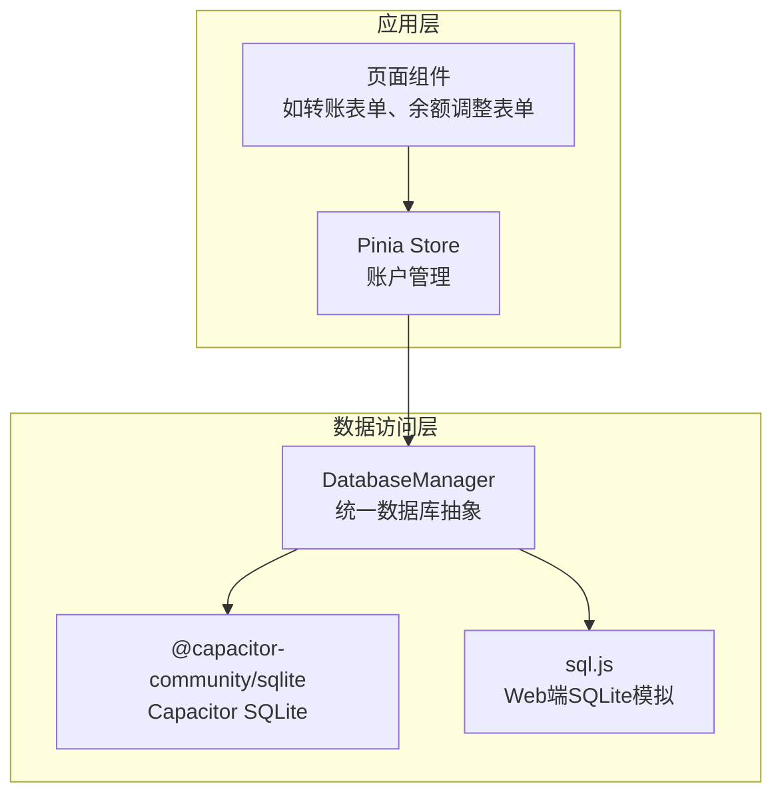
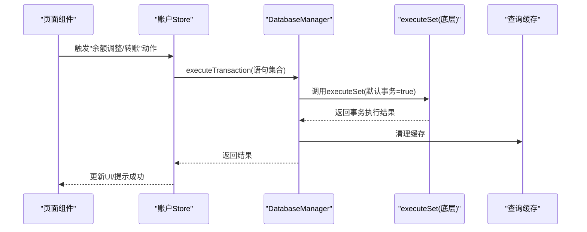
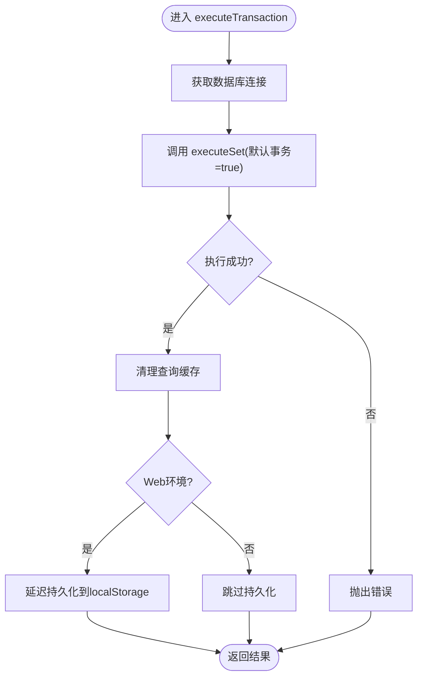
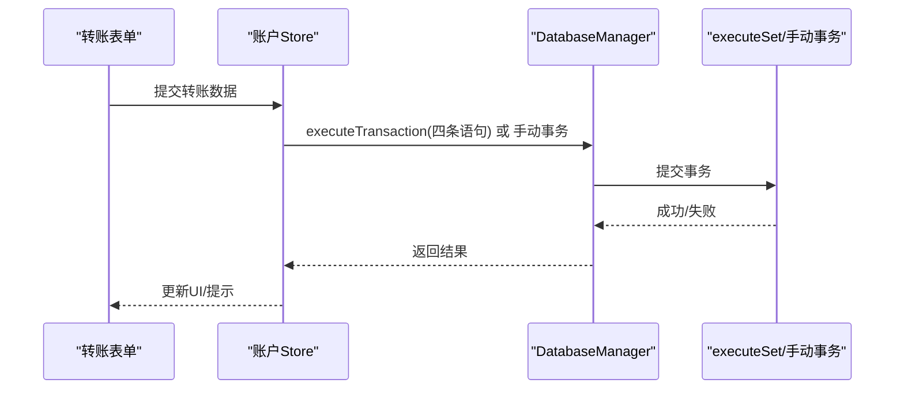
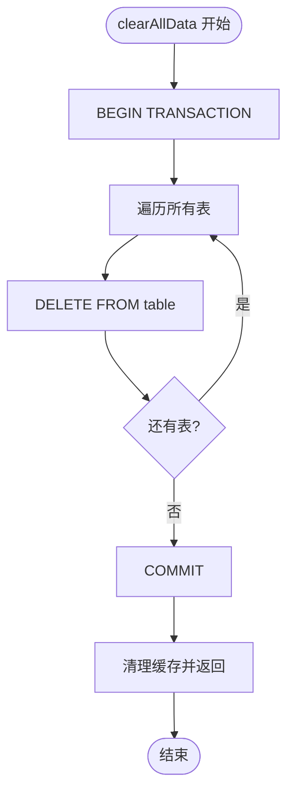
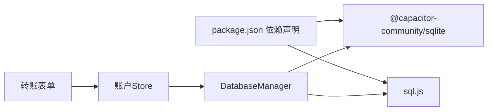

# 事务管理

<cite>
**本文引用的文件**
- [src/database/index.js](file://src/database/index.js)
- [src/stores/account.ts](file://src/stores/account.ts)
- [src/components/mobile/account/TransferForm.vue](file://src/components/mobile/account/TransferForm.vue)
- [src/components/mobile/account/BalanceAdjustForm.vue](file://src/components/mobile/account/BalanceAdjustForm.vue)
- [src/components/mobile/expense/AddExpensePage.vue](file://src/components/mobile/expense/AddExpensePage.vue)
- [package.json](file://package.json)
</cite>

## 更新摘要
**变更内容**
- 进一步优化事务处理机制，在多个关键功能中采用原子事务确保数据一致性
- 新增 clearAllData() 方法的事务优化实现
- 增强事务边界设计和错误处理机制
- 完善事务性能优化策略和并发控制

## 目录
1. [简介](#简介)
2. [项目结构](#项目结构)
3. [核心组件](#核心组件)
4. [架构总览](#架构总览)
5. [详细组件分析](#详细组件分析)
6. [依赖关系分析](#依赖关系分析)
7. [性能考量](#性能考量)
8. [故障排查指南](#故障排查指南)
9. [结论](#结论)
10. [附录](#附录)

## 简介
本文件围绕财务应用中的事务管理展开，重点解析 DatabaseManager.executeTransaction() 的实现原理与使用方式，并结合 Capacitor SQLite 与 SQL.js 的事务处理机制，系统阐述 ACID 特性在该应用中的落地方式；同时给出事务边界设计、错误处理、复杂多表操作示例、性能优化与并发控制策略、回滚与异常恢复机制，以及事务与缓存的关系与影响。

## 项目结构
本项目采用前端单页应用架构，数据库层通过统一的 DatabaseManager 抽象封装，支持 Capacitor SQLite（移动端）与 SQL.js（Web 端）。事务管理集中在数据库层，业务逻辑通过 Pinia Store 调用数据库接口，形成清晰的分层与职责分离。

**图表来源**
- [src/database/index.js:1-190](file://src/database/index.js#L1-L190)
- [package.json:19-36](file://package.json#L19-L36)

**章节来源**
- [src/database/index.js:1-190](file://src/database/index.js#L1-L190)
- [package.json:19-36](file://package.json#L19-L36)

## 核心组件
- **DatabaseManager**：负责数据库连接、初始化、CRUD、批处理、事务执行、缓存与持久化等。其中 executeTransaction() 直接委托底层 Capacitor SQLite 的 executeSet，默认开启自动事务。
- **Pinia Store（账户模块）**：封装业务操作（如余额调整、转账），在需要强一致性的场景使用 executeTransaction()，在简单操作中使用 run() 或 query()。
- **页面组件（转账表单、余额调整表单）**：作为业务入口，收集用户输入并触发 Store 的相应动作。

**章节来源**
- [src/database/index.js:354-374](file://src/database/index.js#L354-L374)
- [src/stores/account.ts:145-185](file://src/stores/account.ts#L145-L185)
- [src/components/mobile/account/TransferForm.vue:1-57](file://src/components/mobile/account/TransferForm.vue#L1-L57)
- [src/components/mobile/account/BalanceAdjustForm.vue:1-41](file://src/components/mobile/account/BalanceAdjustForm.vue#L1-L41)

## 架构总览
下图展示了事务执行的关键路径：页面组件触发 Store 动作，Store 组织 SQL 语句并通过 DatabaseManager.executeTransaction() 提交，底层由 Capacitor SQLite 的 executeSet 自动包裹为事务，成功后清理缓存并按需持久化。

**图表来源**
- [src/stores/account.ts:145-185](file://src/stores/account.ts#L145-L185)
- [src/database/index.js:354-374](file://src/database/index.js#L354-L374)

## 详细组件分析

### DatabaseManager.executeTransaction() 实现与使用
- **实现要点**
  - 通过 getDB() 获取当前数据库连接。
  - 直接调用 db.executeSet(statements)，底层 Capacitor SQLite 的 executeSet 默认以事务形式执行，保证原子性。
  - 成功后清理查询缓存，避免脏读。
  - 在 Web 环境（非原生）下，对 SQL.js 的数据库进行延迟持久化，降低频繁写入带来的性能损耗。
- **使用方式**
  - Store 中的"余额调整"动作直接传入语句数组，由 executeTransaction() 统一处理。
  - 对于简单单条语句，可使用 run()；对于批量语句，可用 batch()；对于需要强一致性的多表联动，优先使用 executeTransaction()。

**图表来源**
- [src/database/index.js:354-374](file://src/database/index.js#L354-L374)

**章节来源**
- [src/database/index.js:354-374](file://src/database/index.js#L354-L374)
- [src/stores/account.ts:145-185](file://src/stores/account.ts#L145-L185)

### 事务边界设计与最佳实践
- **边界设计**
  - 将"必须全部成功"的相关操作放在同一事务内，例如余额调整同时更新账户余额与插入流水。
  - 避免在事务中执行耗时操作（如网络请求、UI渲染），保持事务短小精悍。
- **错误处理**
  - executeTransaction() 已封装底层异常，上层捕获即可。
  - 对于复杂流程（如转账），可在业务层自行 BEGIN/COMMIT/ROLLBACK，确保异常时回滚。
- **示例：余额调整（多表/多语句）**
  - 语句集合包含：更新账户余额、插入流水记录。
  - 使用 executeTransaction() 保证两者要么同时成功，要么同时失败。

**章节来源**
- [src/stores/account.ts:145-185](file://src/stores/account.ts#L145-L185)

### 复杂多表操作示例
- **场景：转账（转出账户余额减少、转入账户余额增加、两条流水记录）**
- **两种实现**：
  - 使用 executeTransaction()：将四条语句放入数组，底层自动事务。
  - 使用手动事务：BEGIN -> 更新转出/转入余额 -> 插入两条流水 -> COMMIT；异常则 ROLLBACK。
- **页面入口**：转账表单组件，触发 Store 的 transfer() 动作。

**图表来源**
- [src/stores/account.ts:191-270](file://src/stores/account.ts#L191-L270)
- [src/components/mobile/account/TransferForm.vue:1-57](file://src/components/mobile/account/TransferForm.vue#L1-L57)

**章节来源**
- [src/stores/account.ts:191-270](file://src/stores/account.ts#L191-L270)
- [src/components/mobile/account/TransferForm.vue:1-57](file://src/components/mobile/account/TransferForm.vue#L1-L57)

### ACID 特性在本项目的实现
- **原子性（Atomicity）**
  - executeTransaction() 通过底层 executeSet 默认事务，确保多条语句要么全部成功，要么全部失败。
- **一致性（Consistency）**
  - 通过外键约束与业务校验（如余额不足检查）保障数据一致性。
- **隔离性（Isolation）**
  - 单例连接与串行化执行语句，避免并发冲突；Web 端 SQL.js 为单线程模型，天然隔离。
- **持久性（Durability）**
  - 移动端 Capacitor SQLite：直接写入设备存储，具备持久性。
  - Web 端 SQL.js：通过延迟持久化到 localStorage，降低频繁写入成本。

**章节来源**
- [src/database/index.js:354-374](file://src/database/index.js#L354-L374)
- [src/database/index.js:120-148](file://src/database/index.js#L120-L148)
- [src/database/index.js:149-178](file://src/database/index.js#L149-L178)

### Capacitor SQLite 与 SQL.js 的事务处理机制
- **Capacitor SQLite**
  - executeSet(statements) 默认开启事务，适合批量多语句原子提交。
  - 支持连接复用与打开关闭，配合单例模式避免重复连接。
- **SQL.js（Web 端）**
  - 通过 prepare/run 执行语句，无显式事务 API；但可通过手动 BEGIN/COMMIT/ROLLBACK 控制。
  - 通过延迟持久化（debouncedSave）将 export() 结果写入 localStorage，提升性能。

**章节来源**
- [src/database/index.js:354-374](file://src/database/index.js#L354-L374)
- [src/database/index.js:379-408](file://src/database/index.js#L379-L408)
- [src/database/index.js:215-252](file://src/database/index.js#L215-L252)
- [src/database/index.js:281-299](file://src/database/index.js#L281-L299)

### 事务回滚与异常恢复机制
- **executeTransaction()**：底层异常会自动回滚，上层捕获错误并提示。
- **手动事务**：在业务层捕获异常后执行 ROLLBACK，确保状态一致。
- **数据清理**：事务成功后清理查询缓存，失败时保持缓存不变，避免脏读。

**章节来源**
- [src/database/index.js:354-374](file://src/database/index.js#L354-L374)
- [src/stores/account.ts:255-265](file://src/stores/account.ts#L255-L265)
- [src/database/index.js:413-415](file://src/database/index.js#L413-L415)

### 事务与缓存的关系与影响
- **事务成功后清理缓存**，确保后续查询读取最新数据。
- **事务失败不清理缓存**，避免读取到中间态数据。
- **Web 端 SQL.js 的缓存与持久化策略相互独立**，但都服务于性能与一致性平衡。

**章节来源**
- [src/database/index.js:301-302](file://src/database/index.js#L301-L302)
- [src/database/index.js:361-362](file://src/database/index.js#L361-L362)
- [src/database/index.js:413-415](file://src/database/index.js#L413-L415)

### 性能优化的事务实现示例
**更新** 本节新增了基于实际代码的性能优化示例，展示如何在大数据量操作中使用事务提高性能。

- **clearAllData() 方法**：这是一个重要的性能优化示例，使用手动事务来清空所有数据表
  - 事务状态跟踪：使用 transactionStarted 标志确保只在事务真正开始后执行回滚
  - 批量删除：遍历所有表进行 DELETE 操作，使用 try-catch 处理可能不存在的表
  - 异常处理：提交失败时自动回滚，确保数据一致性
  - 缓存管理：删除成功后清理查询缓存

**图表来源**
- [src/database/index.js:765-820](file://src/database/index.js#L765-L820)

**章节来源**
- [src/database/index.js:765-820](file://src/database/index.js#L765-L820)

## 依赖关系分析
- DatabaseManager 依赖 Capacitor SQLite 与 SQL.js，分别用于移动端与 Web 端。
- Store 依赖 DatabaseManager 的统一接口，屏蔽平台差异。
- 页面组件仅与 Store 交互，不直接关心数据库实现细节。

**图表来源**
- [package.json:19-36](file://package.json#L19-L36)
- [src/database/index.js:1-11](file://src/database/index.js#L1-L11)
- [src/stores/account.ts:6](file://src/stores/account.ts#L6)

**章节来源**
- [package.json:19-36](file://package.json#L19-L36)
- [src/database/index.js:1-11](file://src/database/index.js#L1-L11)
- [src/stores/account.ts:6](file://src/stores/account.ts#L6)

## 性能考量
- **连接与初始化**
  - 单例模式避免重复连接；移动端检查连接一致性与存在性，减少无效创建。
- **批处理与事务**
  - executeTransaction() 与 batch() 将多语句合并，减少往返与锁竞争。
- **缓存与持久化**
  - 查询缓存减少重复查询；Web 端延迟持久化降低频繁写入开销。
- **索引优化**
  - 初始化阶段创建常用索引，加速查询与外键关联。
- **大数据量操作优化**
  - 使用事务批量处理大量数据，如 clearAllData() 方法所示
  - 通过事务减少数据库锁竞争和日志写入次数

**章节来源**
- [src/database/index.js:21-32](file://src/database/index.js#L21-L32)
- [src/database/index.js:354-374](file://src/database/index.js#L354-L374)
- [src/database/index.js:676-688](file://src/database/index.js#L676-L688)
- [src/database/index.js:379-408](file://src/database/index.js#L379-L408)
- [src/database/index.js:765-820](file://src/database/index.js#L765-L820)

## 故障排查指南
- **常见问题**
  - 事务失败：检查语句合法性与参数绑定；查看底层异常信息。
  - Web 端数据未持久：确认延迟持久化定时器是否触发；检查 localStorage 可用性。
  - 并发冲突：避免在事务中执行耗时操作；必要时拆分事务或加锁。
- **定位手段**
  - 启用调试日志（DEBUG）观察连接、执行与持久化过程。
  - 捕获并记录错误堆栈，定位具体语句与参数。

**章节来源**
- [src/database/index.js:13-18](file://src/database/index.js#L13-L18)
- [src/database/index.js:379-408](file://src/database/index.js#L379-L408)
- [src/database/index.js:371-373](file://src/database/index.js#L371-L373)

## 结论
本项目通过 DatabaseManager 将 Capacitor SQLite 与 SQL.js 的差异抽象为统一接口，executeTransaction() 以底层 executeSet 的自动事务能力为核心，确保多表联动的强一致性。结合缓存与延迟持久化策略，在移动端与 Web 端均实现了良好的性能与可靠性。建议在复杂业务中优先使用 executeTransaction()，在需要精细控制时采用手动事务，并严格遵循事务边界设计与错误处理最佳实践。通过 clearAllData() 等性能优化示例可以看出，事务不仅保证数据一致性，还能显著提升大数据量操作的性能表现。

## 附录
- **相关文件路径**
  - [src/database/index.js](file://src/database/index.js)
  - [src/stores/account.ts](file://src/stores/account.ts)
  - [src/components/mobile/account/TransferForm.vue](file://src/components/mobile/account/TransferForm.vue)
  - [src/components/mobile/account/BalanceAdjustForm.vue](file://src/components/mobile/account/BalanceAdjustForm.vue)
  - [src/components/mobile/expense/AddExpensePage.vue](file://src/components/mobile/expense/AddExpensePage.vue)
  - [package.json](file://package.json)