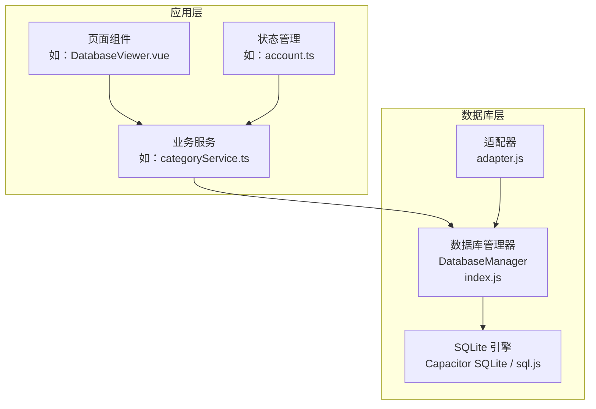
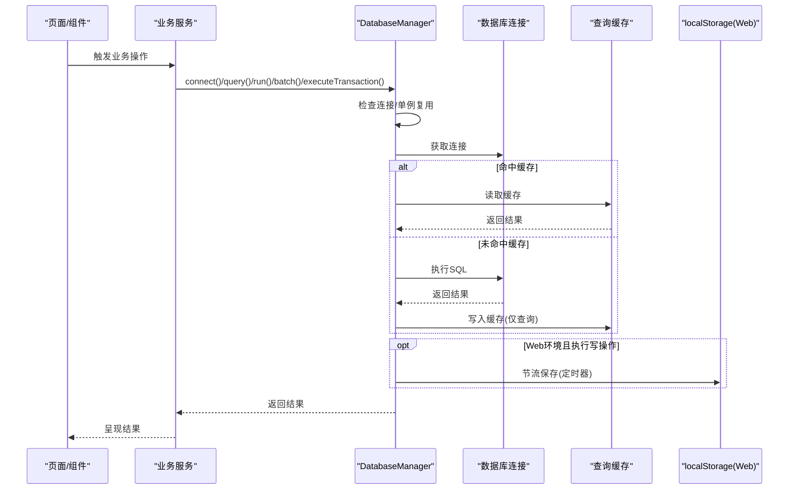
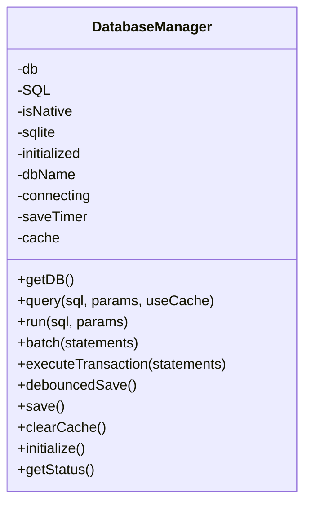
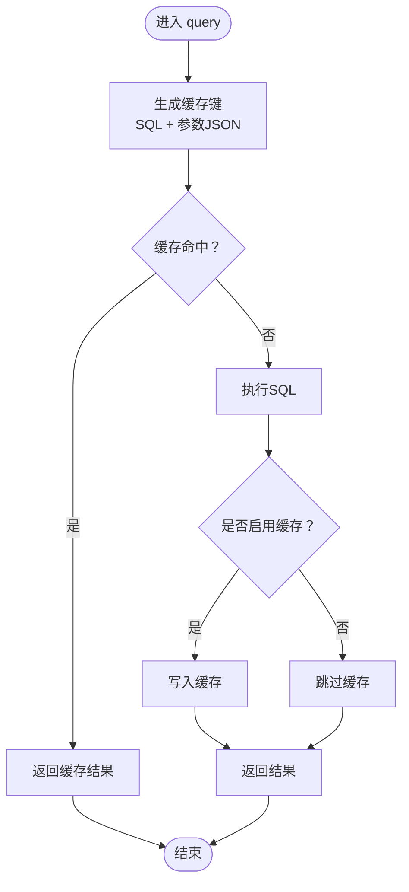
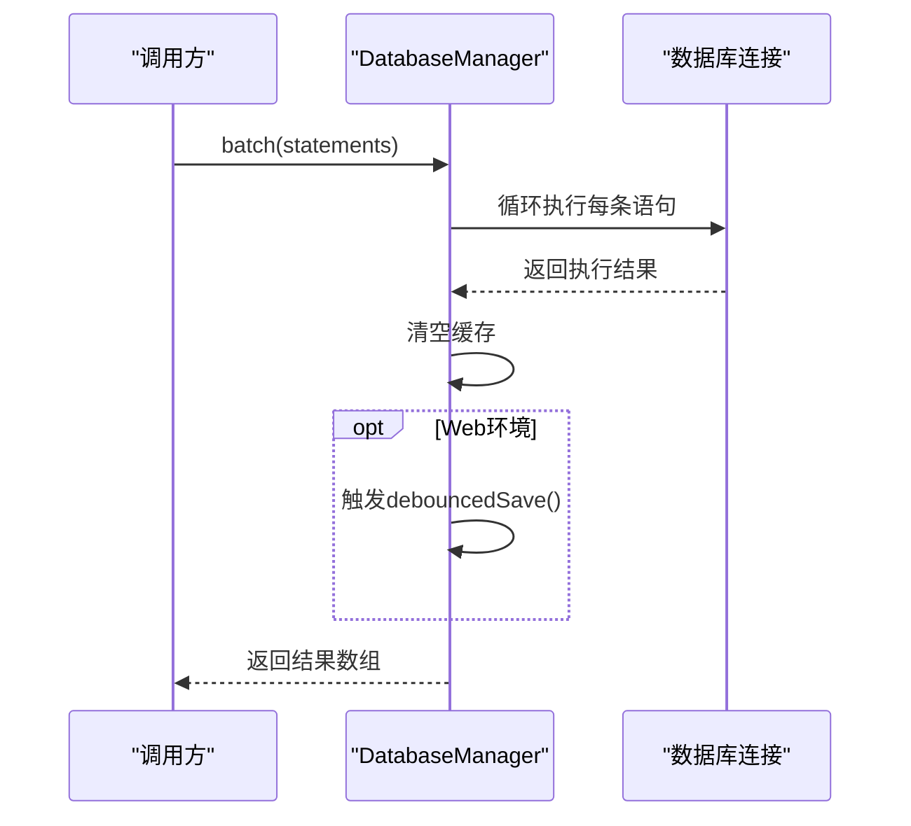
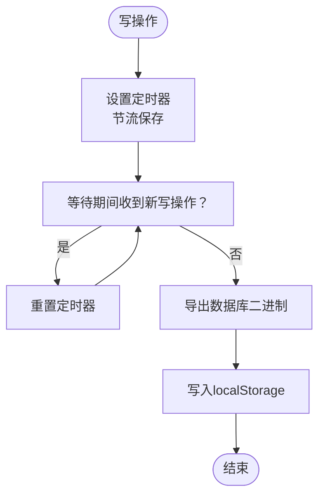
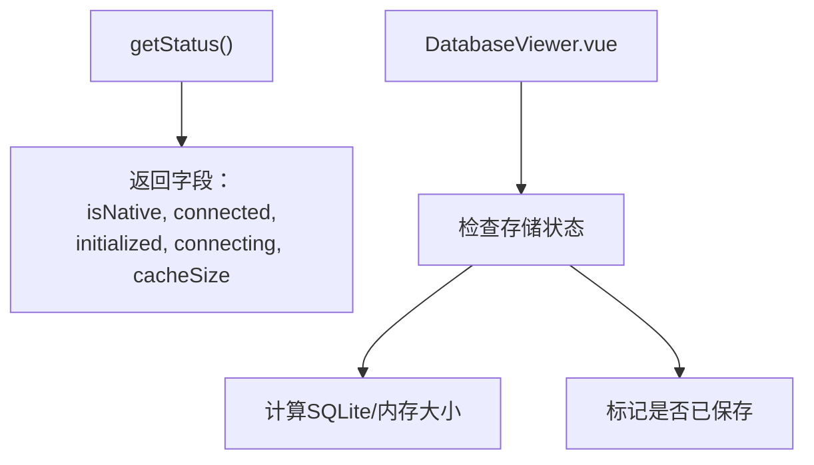
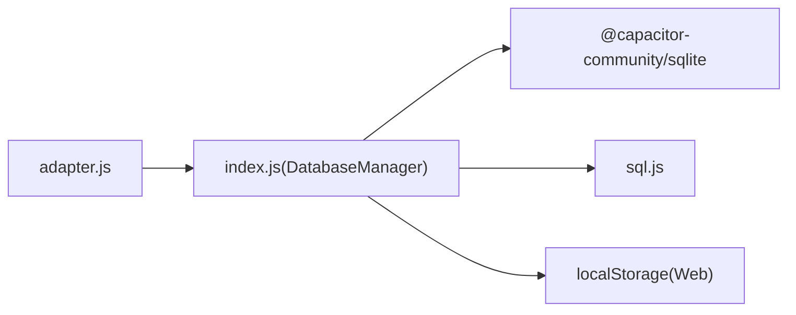

# 性能优化

<cite>
**本文引用的文件**
- [src/database/index.js](file://src/database/index.js)
- [src/database/adapter.js](file://src/database/adapter.js)
- [src/services/categoryService.ts](file://src/services/categoryService.ts)
- [src/stores/account.ts](file://src/stores/account.ts)
- [src/components/mobile/DatabaseViewer.vue](file://src/components/mobile/DatabaseViewer.vue)
</cite>

## 目录
1. [简介](#简介)
2. [项目结构](#项目结构)
3. [核心组件](#核心组件)
4. [架构总览](#架构总览)
5. [详细组件分析](#详细组件分析)
6. [依赖关系分析](#依赖关系分析)
7. [性能考量](#性能考量)
8. [故障排查指南](#故障排查指南)
9. [结论](#结论)
10. [附录](#附录)

## 简介
本文件聚焦于数据库性能优化主题，基于仓库中的数据库管理与适配层，系统梳理以下方面：
- DatabaseManager 的性能优化策略与实现机制
- 查询缓存系统的设计与失效策略
- 索引优化策略（自动索引创建与手动优化建议）
- 批量操作的性能优势与使用场景
- Web 环境的节流保存机制与 localStorage 持久化策略
- 连接池与并发控制现状
- 性能监控与调试工具的使用方法
- 性能测试与基准测试方法
- 大数据量处理与内存管理最佳实践

## 项目结构
本项目的数据库相关代码集中在 src/database 目录，采用“适配器 + 管理器”的分层设计：
- 适配器负责平台差异（原生 vs Web），统一对外接口
- 管理器封装连接、初始化、CRUD、事务、缓存、持久化等核心能力

图表来源
- [src/database/adapter.js](file://src/database/adapter.js)
- [src/database/index.js](file://src/database/index.js)

章节来源
- [src/database/adapter.js](file://src/database/adapter.js)
- [src/database/index.js](file://src/database/index.js)

## 核心组件
本节聚焦 DatabaseManager 的性能优化要点与实现细节。

- 单例连接与连接一致性检查
  - 通过内部状态避免重复连接，减少资源消耗
  - 在原生平台进行连接一致性检查，降低异常风险
- 查询缓存
  - 基于 Map 的简单缓存，键由 SQL 文本与参数序列化组成
  - 读路径命中即返回，写路径（run/batch/事务）清空缓存
- 索引优化
  - 初始化阶段批量创建常用查询字段索引
  - 针对高频过滤字段建立索引以加速查询
- 批处理与事务
  - 批处理聚合多次写操作，减少往返与锁竞争
  - 事务保证原子性，配合批处理提升吞吐
- Web 环境节流保存
  - debounce 定时器合并持久化请求，降低 localStorage 写入频率
  - 仅在非原生平台启用，原生平台由插件负责持久化
- 状态监控
  - 提供状态接口，暴露连接状态、初始化状态、缓存大小等

章节来源
- [src/database/index.js](file://src/database/index.js)

## 架构总览
下图展示数据库访问的关键流程与性能优化点：

图表来源
- [src/database/index.js](file://src/database/index.js)

## 详细组件分析

### DatabaseManager 类与性能策略
- 单例连接与连接一致性
  - 避免重复创建连接，减少资源占用
  - 原生平台检查连接一致性，降低异常概率
- 查询缓存
  - 键策略：SQL 文本 + 参数 JSON 序列化
  - 命中即返回，未命中则执行 SQL 并写入缓存
  - 写操作后清空缓存，保证一致性
- 索引优化
  - 初始化阶段批量创建常用字段索引
  - 针对 account_id、created_at、status 等高频过滤字段建立索引
- 批处理与事务
  - 批处理聚合多条写语句，减少往返与锁竞争
  - executeTransaction 使用底层事务能力，保证原子性
- Web 环境节流保存
  - debounce 定时器合并持久化请求，默认 1 秒
  - 仅在 Web 平台启用，原生平台由插件负责持久化
- 状态监控
  - getStatus 暴露 isNative、connected、initialized、connecting、cacheSize

图表来源
- [src/database/index.js](file://src/database/index.js)

章节来源
- [src/database/index.js](file://src/database/index.js)

### 查询缓存系统
- 键策略
  - 组合 SQL 文本与参数 JSON 字符串，确保参数变化导致缓存失效
- 命中与失效
  - 读路径命中直接返回；写路径（run/batch/事务）清空缓存
- 适用场景
  - 高频只读查询（如分类列表、统计汇总）
- 注意事项
  - 需要确保 SQL 文本与参数完全一致才能命中
  - 对于写操作必须清空缓存，避免脏读

图表来源
- [src/database/index.js](file://src/database/index.js)

章节来源
- [src/database/index.js](file://src/database/index.js)

### 索引优化策略
- 自动索引创建
  - 初始化阶段批量创建常用字段索引，覆盖高频过滤字段
- 手动优化建议
  - 针对实际查询模式增加复合索引
  - 定期分析查询计划，识别慢查询并针对性加索引
  - 控制索引数量，平衡写入性能与查询性能

章节来源
- [src/database/index.js](file://src/database/index.js)

### 批量操作与事务
- 批处理
  - 聚合多次写操作，减少往返与锁竞争
  - Web 环境在批处理后触发节流保存
- 事务
  - executeTransaction 使用底层事务能力，保证原子性
  - 写操作后清空缓存，避免脏读
- 使用场景
  - 大规模导入、批量修改、跨表联动更新

图表来源
- [src/database/index.js](file://src/database/index.js)

章节来源
- [src/database/index.js](file://src/database/index.js)

### Web 环境节流保存与持久化
- 节流保存
  - debounce 定时器合并多次写操作后的持久化请求
  - 默认节流时间为 1 秒，可在配置中调整
- 持久化策略
  - Web 环境导出数据库二进制并通过 JSON 序列化存储到 localStorage
  - 下次启动尝试从 localStorage 加载，失败则新建数据库
- 原生平台
  - 由 Capacitor SQLite 插件负责持久化，不使用 localStorage

图表来源
- [src/database/index.js](file://src/database/index.js)

章节来源
- [src/database/index.js](file://src/database/index.js)

### 连接池与并发控制
- 当前实现
  - 单例连接：全局仅维护一个数据库连接实例
  - 连接一致性检查：原生平台检查连接一致性
  - 并发控制：通过内部 connecting 标志避免并发连接
- 优化建议
  - 对高并发场景考虑引入连接池（需评估平台支持与复杂度）
  - 对写密集型场景减少不必要的查询缓存，优先使用事务批处理

章节来源
- [src/database/index.js](file://src/database/index.js)

### 性能监控与调试
- 状态接口
  - getStatus 暴露 isNative、connected、initialized、connecting、cacheSize
- 可视化工具
  - DatabaseViewer 提供本地存储大小与保存状态展示
- 调试开关
  - DEBUG 配置项用于输出详细日志，便于定位性能瓶颈

图表来源
- [src/database/index.js](file://src/database/index.js)
- [src/components/mobile/DatabaseViewer.vue](file://src/components/mobile/DatabaseViewer.vue)

章节来源
- [src/database/index.js](file://src/database/index.js)
- [src/components/mobile/DatabaseViewer.vue](file://src/components/mobile/DatabaseViewer.vue)

## 依赖关系分析
- 适配器
  - 通过 isNative 判断平台，统一对外接口
- 管理器
  - 依赖 Capacitor SQLite（原生）或 sql.js（Web）
  - 依赖 localStorage（Web 环境）

图表来源
- [src/database/adapter.js](file://src/database/adapter.js)
- [src/database/index.js](file://src/database/index.js)

章节来源
- [src/database/adapter.js](file://src/database/adapter.js)
- [src/database/index.js](file://src/database/index.js)

## 性能考量
- 查询缓存
  - 适合高频只读查询；写操作后务必清空缓存
  - 键策略需与 SQL 文本与参数严格匹配
- 索引
  - 初始化阶段已创建常用字段索引
  - 建议结合实际查询模式持续优化
- 批处理与事务
  - 大量写入场景优先使用批处理与事务
  - 避免小粒度频繁提交
- Web 节流保存
  - 降低 localStorage 写入频率，提升交互流畅度
  - 注意节流时间与数据安全性的权衡
- 连接与并发
  - 单例连接简化并发控制，但需避免长时间阻塞
  - 对高并发场景可考虑引入连接池

## 故障排查指南
- 数据库连接失败
  - 检查 isNative 判断与平台插件安装情况
  - 使用 getStatus() 与 DatabaseViewer 检查连接状态
- 查询结果异常
  - 确认缓存是否命中；必要时禁用 useCache 或清空缓存
  - 检查 SQL 文本与参数是否与缓存键一致
- Web 环境数据丢失
  - 检查 localStorage 是否可用与容量限制
  - 确认节流保存是否生效
- 大数据量操作卡顿
  - 使用批处理与事务
  - 评估索引数量与查询计划

章节来源
- [src/database/index.js](file://src/database/index.js)
- [src/components/mobile/DatabaseViewer.vue](file://src/components/mobile/DatabaseViewer.vue)

## 结论
本项目在数据库层面实现了多项性能优化：
- 单例连接与连接一致性检查降低资源消耗与异常风险
- 查询缓存与索引优化显著提升读性能
- 批处理与事务保障写性能与一致性
- Web 环境节流保存平衡性能与持久化需求
- 状态监控与可视化工具便于调试与运维

建议在后续迭代中进一步完善连接池、查询计划分析与基准测试体系，以支撑更大规模的数据与更高并发场景。

## 附录

### 性能测试与基准测试方法
- 基准测试
  - 构造大规模插入/更新/删除任务，测量吞吐与延迟
  - 对比开启/关闭缓存、不同索引组合下的性能差异
- 压力测试
  - 模拟高并发写入，观察连接池与事务表现
  - 监控 localStorage 写入频率与页面响应时间
- 工具建议
  - 使用浏览器性能面板与网络面板观测 Web 环境行为
  - 使用原生平台调试工具观测原生 SQLite 行为

### 大数据量处理与内存管理最佳实践
- 批处理优先
  - 将多次小写操作合并为一次批处理
- 分页查询
  - 对大结果集采用分页或游标方式处理
- 合理索引
  - 针对高频过滤字段建立索引，避免全表扫描
- 缓存策略
  - 仅对只读高频查询启用缓存，写后及时失效
- 持久化策略
  - Web 环境合理设置节流时间，避免频繁写入 localStorage
- 内存监控
  - 定期检查缓存大小与页面内存占用，防止泄漏