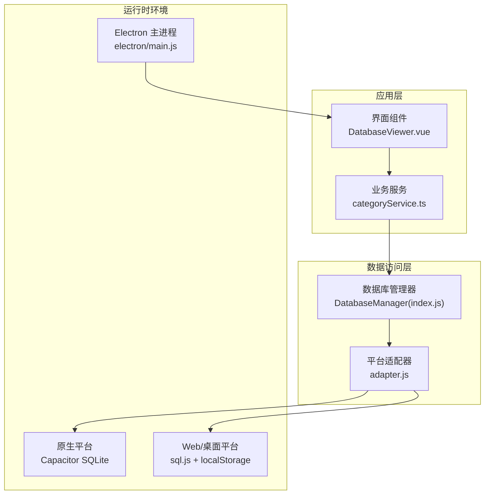
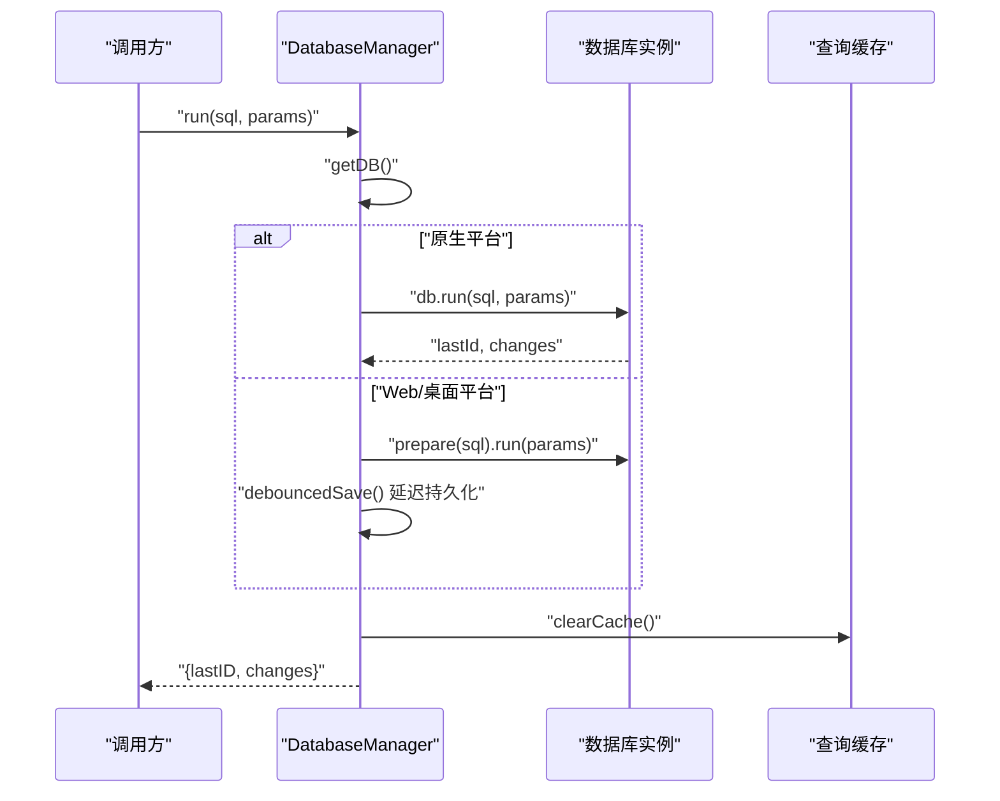
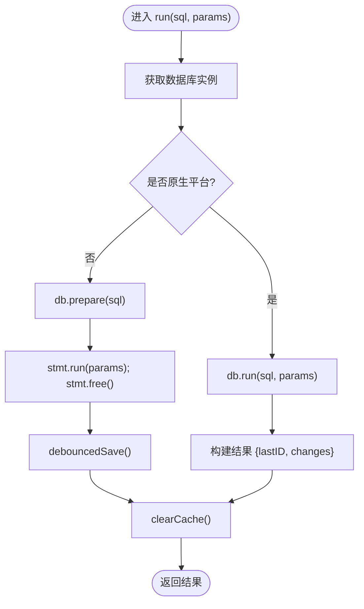
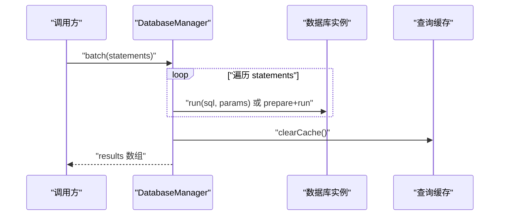
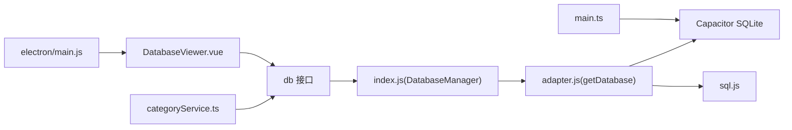

# 执行操作

<cite>
**本文引用的文件**
- [src/database/index.js](file://src/database/index.js)
- [src/database/adapter.js](file://src/database/adapter.js)
- [src/services/categoryService.ts](file://src/services/categoryService.ts)
- [src/components/mobile/DatabaseViewer.vue](file://src/components/mobile/DatabaseViewer.vue)
- [src/main.ts](file://src/main.ts)
- [electron/main.js](file://electron/main.js)
</cite>

## 目录
1. [简介](#简介)
2. [项目结构](#项目结构)
3. [核心组件](#核心组件)
4. [架构总览](#架构总览)
5. [详细组件分析](#详细组件分析)
6. [依赖关系分析](#依赖关系分析)
7. [性能考量](#性能考量)
8. [故障排查指南](#故障排查指南)
9. [结论](#结论)
10. [附录](#附录)

## 简介
本文聚焦于数据库执行操作，系统性解析 DatabaseManager 的 run() 与 batch() 方法实现原理、SQL 执行语句处理流程（INSERT/UPDATE/DELETE 等）、批量执行优化策略与性能考虑、执行结果处理（lastID 与 changes 的获取）、Web 与原生环境差异、执行示例、缓存清理机制以及错误处理与回滚策略。

## 项目结构
该金融应用采用统一的数据库抽象层，通过单例管理器封装 Capacitor SQLite（原生）与 sql.js（Web）两种后端，提供一致的查询与执行接口。核心文件如下：
- 数据库管理与执行：src/database/index.js
- 平台适配器：src/database/adapter.js
- 业务服务示例：src/services/categoryService.ts
- 数据库查看组件：src/components/mobile/DatabaseViewer.vue
- 应用入口与平台检测：src/main.ts
- Electron 主进程（用于桌面端运行）：electron/main.js

图表来源
- [src/database/index.js:21-32](file://src/database/index.js#L21-L32)
- [src/database/adapter.js:14-33](file://src/database/adapter.js#L14-L33)
- [src/services/categoryService.ts:1-260](file://src/services/categoryService.ts#L1-L260)
- [src/components/mobile/DatabaseViewer.vue:100-238](file://src/components/mobile/DatabaseViewer.vue#L100-L238)
- [src/main.ts:7-11](file://src/main.ts#L7-L11)
- [electron/main.js:19-45](file://electron/main.js#L19-L45)

章节来源
- [src/database/index.js:21-32](file://src/database/index.js#L21-L32)
- [src/database/adapter.js:14-33](file://src/database/adapter.js#L14-L33)
- [src/main.ts:7-11](file://src/main.ts#L7-L11)
- [electron/main.js:19-45](file://electron/main.js#L19-L45)

## 核心组件
- DatabaseManager：负责数据库连接、初始化、查询、执行（run/batch）、事务、缓存与持久化（Web 端）。
- 平台适配器：根据 Capacitor.isNativePlatform() 选择原生或 Web 后端。
- 业务服务与组件：通过 db.query/db.run/db.batch 统一调用数据库管理器。

章节来源
- [src/database/index.js:21-32](file://src/database/index.js#L21-L32)
- [src/database/adapter.js:14-33](file://src/database/adapter.js#L14-L33)

## 架构总览
DatabaseManager 在构造时判断运行平台，原生平台使用 Capacitor SQLite，Web/桌面平台使用 sql.js；查询与执行均通过统一接口对外暴露，内部对两种后端做差异化处理；执行后统一清理查询缓存，Web 端支持延迟持久化至 localStorage。

图表来源
- [src/database/index.js:272-309](file://src/database/index.js#L272-L309)
- [src/database/index.js:379-408](file://src/database/index.js#L379-L408)

章节来源
- [src/database/index.js:272-309](file://src/database/index.js#L272-L309)
- [src/database/index.js:379-408](file://src/database/index.js#L379-L408)

## 详细组件分析

### DatabaseManager.run() 方法
- 功能：执行单条 SQL 语句（INSERT/UPDATE/DELETE/DDL 等），返回执行结果对象。
- 参数：sql（字符串）、params（参数数组，默认空数组）。
- 返回：对象包含 lastID 与 changes 字段。
- 平台差异：
  - 原生：调用 db.run(sql, params)，从结果中提取 lastId 与 changes。
  - Web：使用 sql.js prepare/run，返回固定占位值（lastID=0, changes=1），随后触发延迟持久化。
- 结果处理：
  - 原生：使用底层返回的自增 ID 与影响行数。
  - Web：由于 sql.js 不提供 lastId/changes，统一返回占位值，持久化由 debounce 机制触发。
- 缓存清理：执行完成后清除查询缓存，避免脏读。
- 错误处理：捕获异常并抛出带明确提示的错误信息。

图表来源
- [src/database/index.js:272-309](file://src/database/index.js#L272-L309)
- [src/database/index.js:379-408](file://src/database/index.js#L379-L408)

章节来源
- [src/database/index.js:272-309](file://src/database/index.js#L272-L309)

### DatabaseManager.batch() 方法
- 功能：顺序执行一组 SQL 语句（每项为 {sql, params}），返回对应结果数组。
- 参数：statements（数组）。
- 返回：每个语句的结果对象数组（同 run() 的结构）。
- 平台差异：
  - 原生：逐条 db.run，聚合结果。
  - Web：逐条 prepare/run，聚合结果，最后触发延迟持久化。
- 缓存清理：执行完成后统一清理查询缓存。
- 错误处理：任一语句失败即抛出错误，不回滚已执行语句（需结合事务使用）。

图表来源
- [src/database/index.js:316-347](file://src/database/index.js#L316-L347)

章节来源
- [src/database/index.js:316-347](file://src/database/index.js#L316-L347)

### SQL 执行语句处理流程（INSERT/UPDATE/DELETE 等）
- INSERT：插入新记录，原生平台可通过 lastID 获取新增主键；Web 平台返回占位值，需使用应用层生成的业务 ID。
- UPDATE/DELETE：返回 changes 表示受影响行数；原生平台来自底层统计，Web 平台返回占位值。
- DDL：如建表、索引等，由 run()/batch() 执行，成功后清理缓存。

章节来源
- [src/database/index.js:272-309](file://src/database/index.js#L272-L309)
- [src/database/index.js:316-347](file://src/database/index.js#L316-L347)

### 批量执行的优化策略与性能考虑
- 单次连接复用：DatabaseManager 使用单例连接，避免频繁建立/销毁连接。
- 查询缓存：query() 支持基于 SQL+参数的缓存键，命中则直接返回，减少重复解析与执行。
- Web 端延迟持久化：debouncedSave() 将 export() 操作节流，降低频繁写入 localStorage 的开销。
- 顺序批处理：batch() 顺序执行，便于控制依赖与一致性；若需原子性，请使用 executeTransaction()。
- 索引优化：初始化阶段创建常用索引，提升查询性能。

章节来源
- [src/database/index.js:199-264](file://src/database/index.js#L199-L264)
- [src/database/index.js:379-408](file://src/database/index.js#L379-L408)
- [src/database/index.js:432-689](file://src/database/index.js#L432-L689)

### 执行结果处理（lastID 与 changes）
- 原生平台：run()/batch() 直接使用底层返回的 lastId 与 changes。
- Web 平台：run()/batch() 返回占位值（lastID=0, changes=1），实际持久化通过 debouncedSave() 完成。
- 业务建议：在 Web 端使用应用层生成的业务 ID（如 UUID），避免依赖 sql.js 的 lastId。

章节来源
- [src/database/index.js:282-296](file://src/database/index.js#L282-L296)
- [src/database/index.js:328-336](file://src/database/index.js#L328-L336)

### Web 环境与原生环境差异
- 连接方式：原生使用 Capacitor SQLite，Web 使用 sql.js；两者均通过统一接口对外暴露。
- 持久化：原生平台自动持久化；Web 平台通过 export() + localStorage 节流保存。
- 结果字段：原生返回 lastId/changes；Web 返回占位值，需自行处理 ID 与变更统计。
- 事务：原生平台支持 executeSet 自动事务；Web 平台通过应用层封装事务逻辑。

章节来源
- [src/database/index.js:81-190](file://src/database/index.js#L81-L190)
- [src/database/index.js:379-408](file://src/database/index.js#L379-L408)

### 执行示例（单条与批量）
以下示例以路径形式给出，便于定位具体实现与调用点：

- 单条执行（INSERT/UPDATE/DELETE/DDL）
  - 参考路径：[src/services/categoryService.ts:101-113](file://src/services/categoryService.ts#L101-L113)
  - 参考路径：[src/services/categoryService.ts:121-160](file://src/services/categoryService.ts#L121-L160)
  - 参考路径：[src/services/categoryService.ts:167-175](file://src/services/categoryService.ts#L167-L175)
  - 参考路径：[src/database/index.js:272-309](file://src/database/index.js#L272-L309)

- 批量执行
  - 参考路径：[src/database/index.js:316-347](file://src/database/index.js#L316-L347)
  - 参考路径：[src/services/categoryService.ts:248-253](file://src/services/categoryService.ts#L248-L253)

- 事务执行
  - 参考路径：[src/database/index.js:354-374](file://src/database/index.js#L354-L374)

- 查询验证（执行后读取）
  - 参考路径：[src/services/categoryService.ts:14-69](file://src/services/categoryService.ts#L14-L69)
  - 参考路径：[src/components/mobile/DatabaseViewer.vue:142-166](file://src/components/mobile/DatabaseViewer.vue#L142-L166)

章节来源
- [src/services/categoryService.ts:101-175](file://src/services/categoryService.ts#L101-L175)
- [src/database/index.js:272-347](file://src/database/index.js#L272-L347)
- [src/components/mobile/DatabaseViewer.vue:142-166](file://src/components/mobile/DatabaseViewer.vue#L142-L166)

### 缓存清理机制
- 触发时机：每次 run()/batch()/executeTransaction() 成功后，统一调用 clearCache() 清空查询缓存。
- 目的：防止读取到旧数据，保证写入后立即生效。
- 注意：query() 支持 useCache=true 时才会写入缓存，否则不参与缓存管理。

章节来源
- [src/database/index.js:301-302](file://src/database/index.js#L301-L302)
- [src/database/index.js:339-340](file://src/database/index.js#L339-L340)
- [src/database/index.js:361-362](file://src/database/index.js#L361-L362)
- [src/database/index.js:413-415](file://src/database/index.js#L413-L415)

### 错误处理与回滚策略
- 错误处理：run()/batch()/executeTransaction() 均捕获异常并抛出带明确提示的错误信息，便于上层统一处理。
- 回滚策略：clearAllData() 展示了手动事务控制（BEGIN/COMMIT/ROLLBACK），在发生异常时执行 ROLLBACK，确保数据一致性。
- 建议：对于多步写入，优先使用 executeTransaction()；若需细粒度控制，使用手动事务封装。

章节来源
- [src/database/index.js:305-308](file://src/database/index.js#L305-L308)
- [src/database/index.js:343-346](file://src/database/index.js#L343-L346)
- [src/database/index.js:370-373](file://src/database/index.js#L370-L373)
- [src/database/index.js:848-889](file://src/database/index.js#L848-L889)

## 依赖关系分析
- DatabaseManager 依赖 Capacitor 平台检测，动态选择后端实现。
- 平台适配器导出 getDatabase() 与 initializeDatabase()，供上层统一调用。
- 业务服务与组件通过 db.* 接口访问数据库，无需关心底层差异。
- Electron 主进程负责桌面端窗口与 IPC，与数据库层解耦。

图表来源
- [src/services/categoryService.ts:1-260](file://src/services/categoryService.ts#L1-L260)
- [src/database/index.js:897-931](file://src/database/index.js#L897-L931)
- [src/database/adapter.js:14-33](file://src/database/adapter.js#L14-L33)
- [src/components/mobile/DatabaseViewer.vue:100-238](file://src/components/mobile/DatabaseViewer.vue#L100-L238)
- [src/main.ts:7-11](file://src/main.ts#L7-L11)
- [electron/main.js:19-45](file://electron/main.js#L19-L45)

章节来源
- [src/services/categoryService.ts:1-260](file://src/services/categoryService.ts#L1-L260)
- [src/database/index.js:897-931](file://src/database/index.js#L897-L931)
- [src/database/adapter.js:14-33](file://src/database/adapter.js#L14-L33)
- [src/components/mobile/DatabaseViewer.vue:100-238](file://src/components/mobile/DatabaseViewer.vue#L100-L238)
- [src/main.ts:7-11](file://src/main.ts#L7-L11)
- [electron/main.js:19-45](file://electron/main.js#L19-L45)

## 性能考量
- 连接复用：单例连接避免重复初始化成本。
- 查询缓存：对重复查询启用缓存，显著降低解析与执行开销。
- 批量执行：减少网络/跨层调用次数，提升吞吐。
- Web 持久化节流：debouncedSave() 将 export() 操作合并，降低 localStorage 写入频率。
- 索引优化：初始化阶段创建常用索引，加速查询。

章节来源
- [src/database/index.js:13-18](file://src/database/index.js#L13-L18)
- [src/database/index.js:199-264](file://src/database/index.js#L199-L264)
- [src/database/index.js:379-408](file://src/database/index.js#L379-L408)
- [src/database/index.js:432-689](file://src/database/index.js#L432-L689)

## 故障排查指南
- 连接失败：检查 Capacitor 平台检测与后端初始化流程，确认 isNative 判断正确。
- Web 端数据未持久化：确认 debouncedSave() 是否被触发，localStorage 中是否存在 sqlite_dbName 键。
- lastID/changes 异常：原生平台应使用底层返回值；Web 平台请勿依赖 lastId/changes，使用应用层生成的业务 ID。
- 事务问题：若需要原子性，使用 executeTransaction()；若手动事务，请确保在异常时执行 ROLLBACK。
- 缓存脏读：执行写操作后会自动清理缓存；若仍出现脏读，检查是否禁用了缓存或缓存键生成逻辑。

章节来源
- [src/database/index.js:379-408](file://src/database/index.js#L379-L408)
- [src/database/index.js:354-374](file://src/database/index.js#L354-L374)
- [src/database/index.js:848-889](file://src/database/index.js#L848-L889)

## 结论
DatabaseManager 通过统一接口屏蔽原生与 Web 的差异，提供稳定的执行能力。run() 与 batch() 在不同环境下具备明确的行为边界，配合缓存清理与延迟持久化，在性能与一致性之间取得平衡。建议在复杂写入场景中优先使用事务封装，确保数据一致性；在 Web 环境下使用应用层生成的业务 ID 替代 sql.js 的占位值。

## 附录
- 平台检测入口：[src/main.ts:7-11](file://src/main.ts#L7-L11)
- Electron 主进程窗口创建：[electron/main.js:19-45](file://electron/main.js#L19-L45)
- 数据库状态查看组件：[src/components/mobile/DatabaseViewer.vue:100-238](file://src/components/mobile/DatabaseViewer.vue#L100-L238)