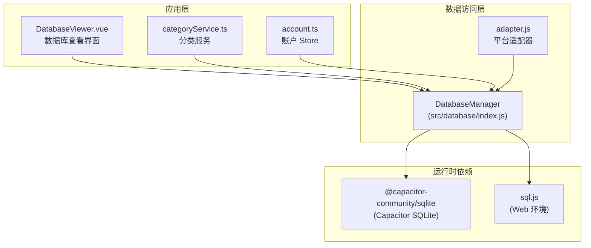
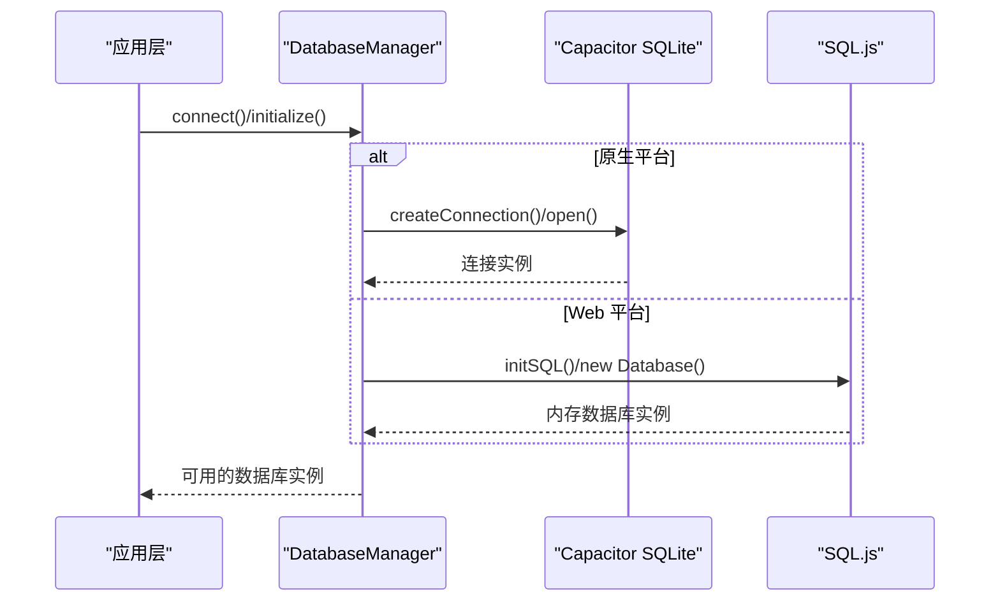
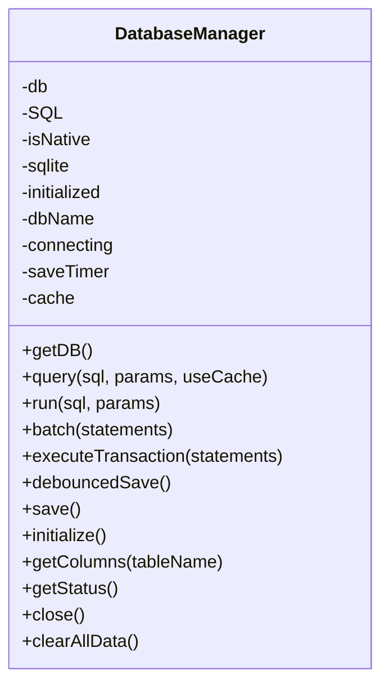
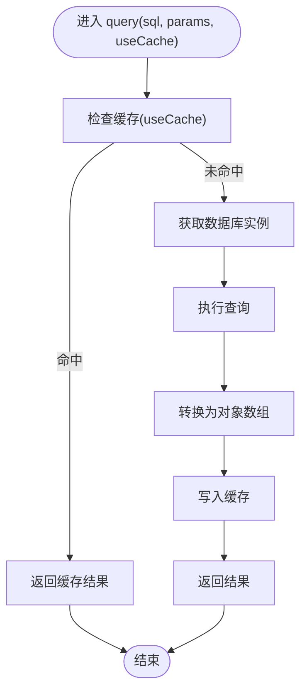
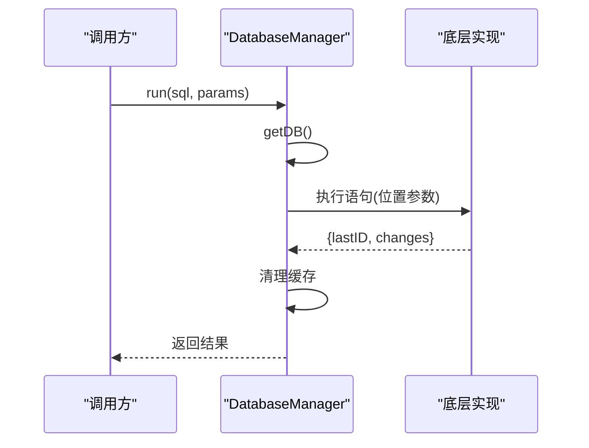
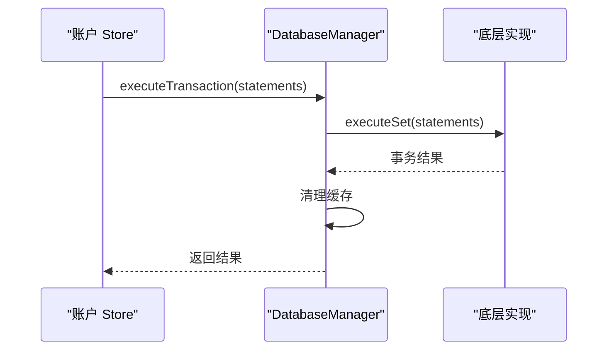
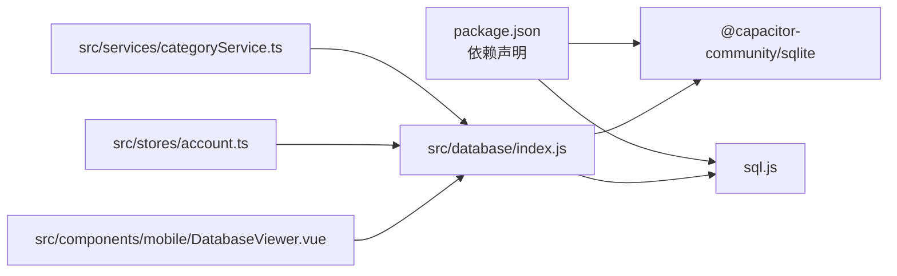

# 数据库操作

<cite>
**本文引用的文件**
- [src/database/index.js](file://src/database/index.js)
- [src/database/adapter.js](file://src/database/adapter.js)
- [src/components/mobile/DatabaseViewer.vue](file://src/components/mobile/DatabaseViewer.vue)
- [src/services/categoryService.ts](file://src/services/categoryService.ts)
- [src/stores/account.ts](file://src/stores/account.ts)
- [package.json](file://package.json)
</cite>

## 目录
1. [简介](#简介)
2. [项目结构](#项目结构)
3. [核心组件](#核心组件)
4. [架构总览](#架构总览)
5. [详细组件分析](#详细组件分析)
6. [依赖关系分析](#依赖关系分析)
7. [性能考量](#性能考量)
8. [故障排查指南](#故障排查指南)
9. [结论](#结论)
10. [附录](#附录)

## 简介
本文件面向“数据库操作”的综合文档，围绕 Finance App 的数据库管理与使用展开，重点解析 DatabaseManager 类的核心功能与实现原理，涵盖：
- CRUD 操作：query() 查询、run() 执行、batch() 批量执行
- 事务处理：executeTransaction() 方法的使用与最佳实践
- 连接管理：单例模式、连接池策略、连接状态检查
- 运行模式：Capacitor SQLite 与 SQL.js 的区别与切换机制
- 参数绑定与 SQL 注入防护
- 错误处理与异常恢复
- 性能优化建议与使用注意事项

## 项目结构
Finance App 的数据库相关代码主要集中在 src/database 目录，并通过服务层与 Store 层被业务模块调用。核心文件如下：
- src/database/index.js：DatabaseManager 类与数据库管理逻辑
- src/database/adapter.js：平台适配器（当前为占位实现）
- src/components/mobile/DatabaseViewer.vue：数据库查看界面，用于调试与验证
- src/services/categoryService.ts：分类服务，演示 CRUD 与连接状态检查
- src/stores/account.ts：账户 Store，演示事务与批量操作
- package.json：声明 Capacitor SQLite 与 SQL.js 依赖

图表来源
- [src/database/index.js](file://src/database/index.js)
- [src/database/adapter.js](file://src/database/adapter.js)
- [src/components/mobile/DatabaseViewer.vue](file://src/components/mobile/DatabaseViewer.vue)
- [src/services/categoryService.ts](file://src/services/categoryService.ts)
- [src/stores/account.ts](file://src/stores/account.ts)
- [package.json](file://package.json)

章节来源
- [src/database/index.js](file://src/database/index.js)
- [src/database/adapter.js](file://src/database/adapter.js)
- [src/components/mobile/DatabaseViewer.vue](file://src/components/mobile/DatabaseViewer.vue)
- [src/services/categoryService.ts](file://src/services/categoryService.ts)
- [src/stores/account.ts](file://src/stores/account.ts)
- [package.json](file://package.json)

## 核心组件
- DatabaseManager：统一的数据库管理器，负责连接建立、CRUD、事务、持久化与状态管理
- db 与 dbManager：对外导出的便捷接口与高级用法入口
- Platform Adapter：平台适配器（当前为占位，实际使用由 index.js 内部判断）

章节来源
- [src/database/index.js](file://src/database/index.js)
- [src/database/adapter.js](file://src/database/adapter.js)

## 架构总览
DatabaseManager 在运行时根据 Capacitor.isNativePlatform() 自动选择底层实现：
- 原生平台：使用 Capacitor SQLite（@capacitor-community/sqlite），支持原生数据库连接与事务
- Web 平台：使用 SQL.js（sql.js），以内存数据库为主，支持延迟持久化到 localStorage

图表来源
- [src/database/index.js](file://src/database/index.js)

章节来源
- [src/database/index.js](file://src/database/index.js)

## 详细组件分析

### DatabaseManager 类详解
- 单例模式：全局仅维护一个数据库实例，避免重复连接
- 连接管理：支持原生与 Web 两套路径；Web 环境支持从 localStorage 加载持久化数据
- 查询与执行：query()、run()、batch() 统一使用位置参数（数组）绑定，避免字符串拼接引发 SQL 注入
- 事务：executeTransaction() 直接委托底层 executeSet；同时提供手动事务封装示例
- 缓存：查询结果缓存（Map），命中则直接返回，降低重复查询成本
- 持久化：Web 环境采用防抖节流保存至 localStorage，减少频繁写入

图表来源
- [src/database/index.js](file://src/database/index.js)

章节来源
- [src/database/index.js](file://src/database/index.js)

#### query() 查询方法
- 功能：执行 SELECT 查询，返回对象数组
- 参数绑定：使用位置参数（数组），避免字符串拼接
- 结果转换：原生平台返回字段名与值映射；Web 平台使用 stmt.getAsObject()
- 缓存：可选缓存命中后直接返回，提升读性能

图表来源
- [src/database/index.js](file://src/database/index.js)

章节来源
- [src/database/index.js](file://src/database/index.js)

#### run() 执行方法
- 功能：执行 INSERT/UPDATE/DELETE 等非查询语句
- 参数绑定：位置参数（数组）
- 结果：返回 lastID 与 changes（原生平台）或占位值（Web 平台）
- 清理：执行后清除查询缓存
- Web 环境：执行后触发防抖保存

图表来源
- [src/database/index.js](file://src/database/index.js)

章节来源
- [src/database/index.js](file://src/database/index.js)

#### batch() 批量执行方法
- 功能：一次传入多条语句，逐条执行并收集结果
- 参数绑定：每条语句使用位置参数
- Web 环境：执行后触发防抖保存
- 清理：执行后清理缓存

章节来源
- [src/database/index.js](file://src/database/index.js)

#### executeTransaction() 事务方法
- 功能：使用底层 executeSet 执行事务，保证原子性
- 最佳实践：将多条相关语句放入同一事务，如账户余额调整与流水记录
- Web 环境：执行后触发防抖保存
- 清理：执行后清理缓存

章节来源
- [src/database/index.js](file://src/database/index.js)
- [src/stores/account.ts](file://src/stores/account.ts)

### 事务处理机制与最佳实践
- 自动事务：executeTransaction() 直接委托底层 executeSet，默认开启事务
- 手动事务：在业务层自行 BEGIN/COMMIT/ROLLBACK，适合复杂流程控制
- 示例：账户余额调整与流水记录、内部转账均使用事务保证一致性

图表来源
- [src/stores/account.ts](file://src/stores/account.ts)
- [src/database/index.js](file://src/database/index.js)

章节来源
- [src/stores/account.ts](file://src/stores/account.ts)
- [src/database/index.js](file://src/database/index.js)

### 数据库连接管理策略
- 单例模式：全局仅维护一个 db 实例，避免重复连接
- 连接状态检查：getStatus() 返回 isNative、connected、initialized、connecting、cacheSize
- 原生平台：通过 SQLiteConnection.createConnection()/retrieveConnection()/open() 管理连接
- Web 平台：通过 SQL.js 初始化内存数据库，支持从 localStorage 加载持久化数据
- 关闭连接：close() 会确保 Web 环境保存后再关闭，原生平台调用 closeConnection()

章节来源
- [src/database/index.js](file://src/database/index.js)

### Capacitor SQLite 与 SQL.js 运行模式对比
- Capacitor SQLite（原生）
  - 特点：原生数据库，支持事务、索引、外键约束
  - 适用：Android/iOS 原生应用
- SQL.js（Web）
  - 特点：纯 JS 内存数据库，需持久化到 localStorage
  - 适用：Web 浏览器、Electron（Web 渲染进程）
- 模式切换：通过 Capacitor.isNativePlatform() 自动判断，无需手动切换

章节来源
- [src/database/index.js](file://src/database/index.js)
- [package.json](file://package.json)

### 参数绑定与 SQL 注入防护
- 统一使用位置参数（数组）绑定，避免字符串拼接
- 原生平台：db.query(sql, params)/db.run(sql, params)
- Web 平台：stmt.bind(params)/stmt.run(params)
- 防护效果：参数类型与值被安全传递给底层引擎，有效防止 SQL 注入

章节来源
- [src/database/index.js](file://src/database/index.js)
- [src/services/categoryService.ts](file://src/services/categoryService.ts)
- [src/stores/account.ts](file://src/stores/account.ts)

### 错误处理与异常恢复
- 统一错误包装：捕获底层异常后抛出带明确信息的错误
- 查询缓存清理：执行成功后清理缓存，避免脏数据
- Web 环境持久化：执行后触发防抖保存，避免频繁写入
- 连接状态检查：getStatus() 提供连接与初始化状态
- 事务回滚：手动事务在异常时执行 ROLLBACK，保证一致性

章节来源
- [src/database/index.js](file://src/database/index.js)

### 使用示例（代码片段路径）
以下为常见操作的代码片段路径，便于快速定位实现细节：
- 查询分类列表：[src/services/categoryService.ts](file://src/services/categoryService.ts)
- 创建分类：[src/services/categoryService.ts](file://src/services/categoryService.ts)
- 更新分类：[src/services/categoryService.ts](file://src/services/categoryService.ts)
- 删除分类：[src/services/categoryService.ts](file://src/services/categoryService.ts)
- 检查数据库状态：[src/services/categoryService.ts](file://src/services/categoryService.ts)
- 账户余额调整（事务）：[src/stores/account.ts](file://src/stores/account.ts)
- 内部转账（手动事务）：[src/stores/account.ts](file://src/stores/account.ts)
- 数据库查看界面：[src/components/mobile/DatabaseViewer.vue](file://src/components/mobile/DatabaseViewer.vue)

章节来源
- [src/services/categoryService.ts](file://src/services/categoryService.ts)
- [src/stores/account.ts](file://src/stores/account.ts)
- [src/components/mobile/DatabaseViewer.vue](file://src/components/mobile/DatabaseViewer.vue)

## 依赖关系分析
- 运行时依赖
  - @capacitor-community/sqlite：原生 SQLite 支持
  - sql.js：Web 环境内存数据库
- 应用层依赖
  - DatabaseManager 作为统一入口，被服务层与 Store 层调用
  - DatabaseViewer.vue 用于调试与验证数据库状态

图表来源
- [package.json](file://package.json)
- [src/database/index.js](file://src/database/index.js)
- [src/services/categoryService.ts](file://src/services/categoryService.ts)
- [src/stores/account.ts](file://src/stores/account.ts)
- [src/components/mobile/DatabaseViewer.vue](file://src/components/mobile/DatabaseViewer.vue)

章节来源
- [package.json](file://package.json)
- [src/database/index.js](file://src/database/index.js)

## 性能考量
- 查询缓存：query() 支持 useCache，命中后直接返回，显著降低重复查询成本
- 防抖持久化：Web 环境通过防抖节流保存到 localStorage，减少频繁写入
- 批量执行：batch() 一次性提交多条语句，减少往返次数
- 索引优化：初始化时为高频查询字段建立索引
- 事务批处理：将相关写操作放入事务，减少锁竞争与提交次数

章节来源
- [src/database/index.js](file://src/database/index.js)

## 故障排查指南
- 连接失败
  - 检查 Capacitor 平台识别是否正确
  - 查看原生平台连接一致性检查与连接状态
- 查询异常
  - 确认 SQL 语法与参数绑定顺序一致
  - 检查缓存是否命中导致旧数据
- 执行异常
  - 确认参数为数组且顺序正确
  - 检查 Web 环境是否触发了防抖保存
- 事务异常
  - 手动事务注意在异常时执行 ROLLBACK
  - 使用 executeTransaction() 简化事务流程
- 数据持久化
  - Web 环境检查 localStorage 中是否存在 sqlite_db 名称的数据

章节来源
- [src/database/index.js](file://src/database/index.js)
- [src/services/categoryService.ts](file://src/services/categoryService.ts)
- [src/stores/account.ts](file://src/stores/account.ts)

## 结论
DatabaseManager 通过统一的接口屏蔽了 Capacitor SQLite 与 SQL.js 的差异，提供了：
- 安全的参数绑定与 SQL 注入防护
- 事务与批量执行能力
- 查询缓存与持久化优化
- 明确的状态检查与异常处理
在 Finance App 中，该设计使得业务层可以专注于领域逻辑，而不必关心底层数据库实现细节。

## 附录
- 平台适配器：当前为占位实现，实际使用由 DatabaseManager 内部判断平台
- 数据库查看界面：DatabaseViewer.vue 提供表级数据浏览与本地存储状态检查

章节来源
- [src/database/adapter.js](file://src/database/adapter.js)
- [src/components/mobile/DatabaseViewer.vue](file://src/components/mobile/DatabaseViewer.vue)