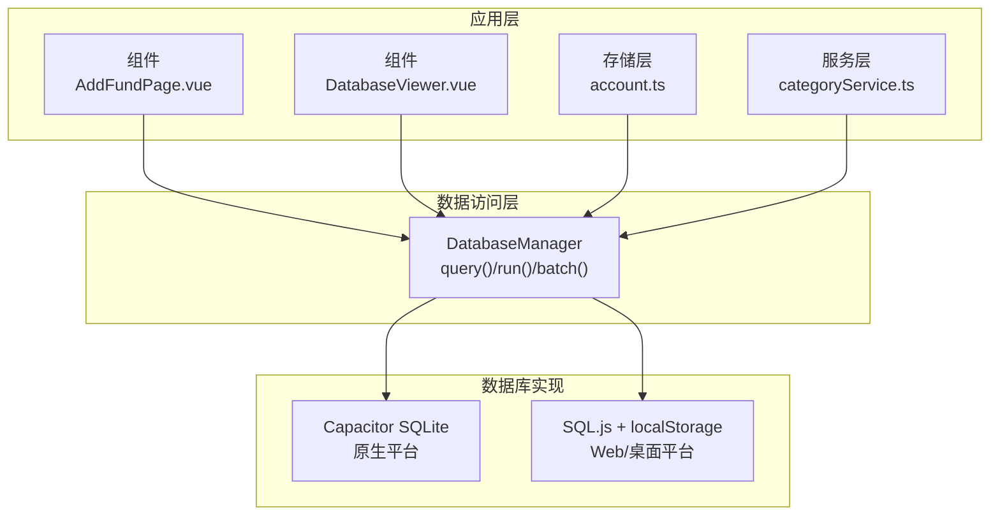
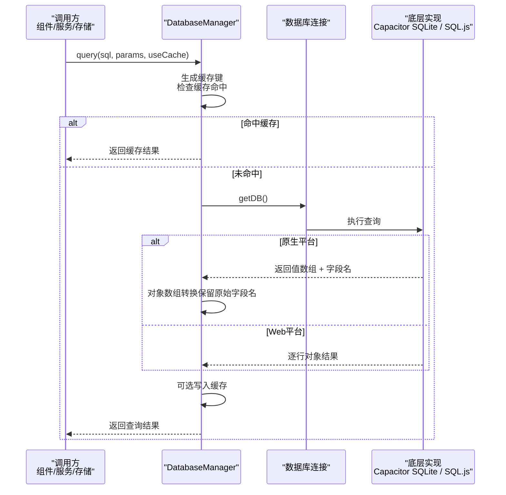
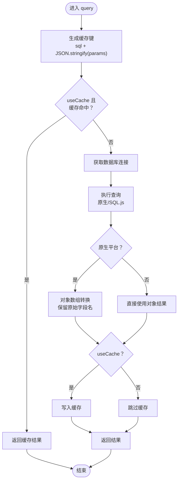
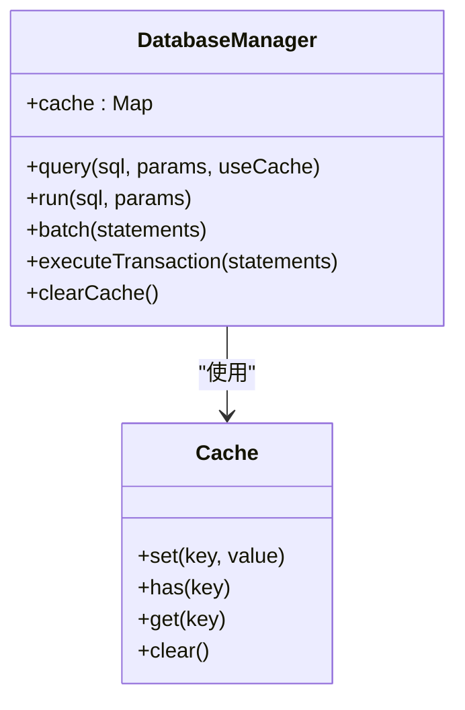
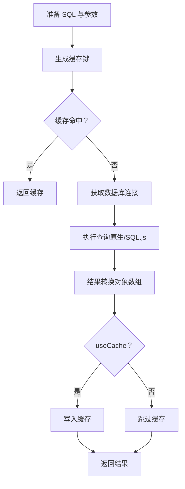

# 查询操作

<cite>
**本文引用的文件**
- [src/database/index.js](file://src/database/index.js)
- [src/services/categoryService.ts](file://src/services/categoryService.ts)
- [src/stores/account.ts](file://src/stores/account.ts)
- [src/components/mobile/asset/AddFundPage.vue](file://src/components/mobile/asset/AddFundPage.vue)
- [src/components/mobile/DatabaseViewer.vue](file://src/components/mobile/DatabaseViewer.vue)
- [package.json](file://package.json)
- [capacitor.config.json](file://capacitor.config.json)
</cite>

## 目录
1. [简介](#简介)
2. [项目结构](#项目结构)
3. [核心组件](#核心组件)
4. [架构总览](#架构总览)
5. [详细组件分析](#详细组件分析)
6. [依赖分析](#依赖分析)
7. [性能考虑](#性能考虑)
8. [故障排查指南](#故障排查指南)
9. [结论](#结论)
10. [附录](#附录)

## 简介
本章节聚焦于数据库查询操作，系统性解析 DatabaseManager.query() 方法的实现原理与使用方式，涵盖以下主题：
- SQL 查询语句的执行流程与参数绑定机制
- 位置参数的使用与 SQL 注入防护
- 查询结果处理逻辑（Capacitor SQLite 与 SQL.js 两种模式）
- 查询缓存机制（键生成、策略与失效）
- 实际查询示例与最佳实践
- 性能优化建议与常见问题排查

## 项目结构
本项目采用“单页应用 + 跨平台框架”的架构，数据库层位于 src/database/index.js，提供统一的查询与执行接口；业务层通过服务与组件调用该接口完成数据访问。

图表来源
- [src/database/index.js:192-309](file://src/database/index.js#L192-L309)
- [src/components/mobile/asset/AddFundPage.vue:80-87](file://src/components/mobile/asset/AddFundPage.vue#L80-L87)
- [src/components/mobile/DatabaseViewer.vue:147](file://src/components/mobile/DatabaseViewer.vue#L147)
- [src/stores/account.ts:44](file://src/stores/account.ts#L44)
- [src/services/categoryService.ts:26](file://src/services/categoryService.ts#L26)

章节来源
- [src/database/index.js:192-309](file://src/database/index.js#L192-L309)
- [package.json:19-36](file://package.json#L19-L36)
- [capacitor.config.json:1-23](file://capacitor.config.json#L1-L23)

## 核心组件
- DatabaseManager：封装数据库连接、查询、执行、批处理、事务、缓存与持久化等能力，支持 Capacitor SQLite（原生）与 SQL.js（Web）双模式。
- 查询入口：db.query(sql, params, useCache)，用于执行 SELECT 类型查询并可选启用缓存。
- 执行入口：db.run(sql, params)、db.batch(statements)、db.executeTransaction(statements) 用于 DML 与事务。

章节来源
- [src/database/index.js:192-309](file://src/database/index.js#L192-L309)
- [src/database/index.js:896-931](file://src/database/index.js#L896-L931)

## 架构总览
下图展示了查询路径在不同平台上的执行差异与结果转换过程：

图表来源
- [src/database/index.js:199-264](file://src/database/index.js#L199-L264)
- [src/database/index.js:214-252](file://src/database/index.js#L214-L252)

## 详细组件分析

### DatabaseManager.query() 实现原理
- 参数绑定与位置参数
  - 原生平台使用 Capacitor SQLite 的位置参数绑定，参数以数组顺序传入，避免字符串拼接引发注入风险。
  - Web 平台使用 SQL.js 的 prepare/bind/step 流程，同样基于位置参数绑定。
- 结果转换
  - 原生平台：若底层返回值已是对象数组，则直接使用；否则根据 columns 映射为对象数组，字段名为原始列名。
  - Web 平台：逐行通过 getAsObject 获取对象，字段名即为原始列名。
- 缓存策略
  - 缓存键由 SQL 文本与 JSON 序列化后的参数数组组成，保证语义一致才命中。
  - 可通过 useCache=true 启用缓存；当执行 DML 或事务后，内部会清空缓存，避免脏读。
- 错误处理
  - 统一捕获并抛出带明确错误信息的异常，便于上层处理。

图表来源
- [src/database/index.js:199-264](file://src/database/index.js#L199-L264)
- [src/database/index.js:214-252](file://src/database/index.js#L214-L252)

章节来源
- [src/database/index.js:199-264](file://src/database/index.js#L199-L264)
- [src/database/index.js:214-252](file://src/database/index.js#L214-L252)

### 参数绑定机制与 SQL 注入防护
- 位置参数绑定：所有查询参数均以数组形式传入，底层实现负责安全绑定，避免字符串拼接导致的注入。
- Web 平台：prepare/bind/step 流程严格遵循 SQL.js 的参数绑定规范。
- 原生平台：Capacitor SQLite 的 query/run 均支持位置参数绑定。
- 防护要点
  - 不拼接 SQL 字符串拼接用户输入
  - 使用占位符与参数数组
  - 对动态表名/列名需额外校验（本项目未见动态列名处理）

章节来源
- [src/database/index.js:214-252](file://src/database/index.js#L214-L252)

### 查询结果处理逻辑（Capacitor SQLite vs SQL.js）
- Capacitor SQLite
  - 若底层返回值已是对象数组，直接使用
  - 否则根据 columns 与 values 组合为对象数组，字段名为原始列名
- SQL.js
  - 逐行通过 getAsObject 获取对象，字段名为原始列名
- 两种模式均保留原始字段名，避免大小写或别名造成的不一致

章节来源
- [src/database/index.js:214-252](file://src/database/index.js#L214-L252)

### 查询缓存机制
- 键生成：sql + JSON.stringify(params)
- 命中策略：useCache=true 且键存在
- 失效策略：
  - 执行 DML（run/batch/executeTransaction）后清空缓存
  - Web 平台持久化到 localStorage 前会触发清空
- 适用场景：高频读取、稳定查询（如分类列表、账户列表）

图表来源
- [src/database/index.js:31-32](file://src/database/index.js#L31-L32)
- [src/database/index.js:199-264](file://src/database/index.js#L199-L264)
- [src/database/index.js:301-302](file://src/database/index.js#L301-L302)

章节来源
- [src/database/index.js:199-264](file://src/database/index.js#L199-L264)
- [src/database/index.js:301-302](file://src/database/index.js#L301-L302)

### 使用方式与示例
- 基础查询
  - 无参数：await db.query('SELECT * FROM accounts')
  - 位置参数：await db.query('SELECT * FROM funds WHERE code = ?', [code])
- 多表聚合查询
  - await db.query('SELECT * FROM assets')
  - await db.query('SELECT * FROM stocks')
  - await db.query('SELECT * FROM funds')
  - await db.query('SELECT * FROM accounts')
- 服务层示例
  - 分类列表：await db.query(sql, params)
  - 按ID查询：await db.query('SELECT id, name, icon, iconText, type FROM categories WHERE id = ?', [id])
  - 连接检测：await db.query('SELECT 1')
- 存储层示例
  - 账户列表：await db.query('SELECT * FROM accounts')
- 组件示例
  - 基金页面：await db.query('SELECT * FROM accounts WHERE type != ?', ['信用卡'])
  - 基金去重：await db.query('SELECT * FROM funds WHERE code = ?', [code])

章节来源
- [src/stores/account.ts:44](file://src/stores/account.ts#L44)
- [src/services/categoryService.ts:26](file://src/services/categoryService.ts#L26)
- [src/services/categoryService.ts:78](file://src/services/categoryService.ts#L78)
- [src/services/categoryService.ts:185](file://src/services/categoryService.ts#L185)
- [src/components/mobile/asset/AddFundPage.vue:82](file://src/components/mobile/asset/AddFundPage.vue#L82)
- [src/components/mobile/asset/AddFundPage.vue:130](file://src/components/mobile/asset/AddFundPage.vue#L130)
- [src/components/mobile/DatabaseViewer.vue:147](file://src/components/mobile/DatabaseViewer.vue#L147)

### SQL 执行流程（概念图）

图表来源
- [src/database/index.js:199-264](file://src/database/index.js#L199-L264)

## 依赖分析
- 平台依赖
  - 原生平台：@capacitor-community/sqlite
  - Web 平台：sql.js
- 配置
  - Capacitor 配置文件定义了应用元信息与插件设置
- 运行时行为
  - 原生平台：使用 Capacitor SQLite 的 query/run
  - Web 平台：使用 SQL.js 的 prepare/bind/step 并持久化到 localStorage

章节来源
- [package.json:19-36](file://package.json#L19-L36)
- [capacitor.config.json:1-23](file://capacitor.config.json#L1-L23)

## 性能考虑
- 缓存策略
  - 对稳定、高频读取的查询启用 useCache，减少重复解析与序列化
  - 对写入密集场景，注意缓存失效时机（DML/事务后自动清空）
- 索引优化
  - 初始化阶段已创建多处索引，有助于 WHERE、JOIN、排序等查询
- 批处理与事务
  - 大量插入/更新建议使用 batch 或 executeTransaction，降低往返与锁竞争
- Web 平台持久化
  - SQL.js 在执行后通过防抖定时器延迟持久化，避免频繁写入 localStorage

章节来源
- [src/database/index.js:676-688](file://src/database/index.js#L676-L688)
- [src/database/index.js:379-408](file://src/database/index.js#L379-L408)

## 故障排查指南
- 常见错误
  - SQL 查询失败：捕获异常并查看错误消息，定位 SQL 语法或参数绑定问题
  - 连接失败：检查 Capacitor SQLite 插件初始化与权限；Web 平台检查 SQL.js 初始化
  - 缓存脏读：执行 DML/事务后缓存被清空，确保后续查询重新拉取
- 定位步骤
  - 确认平台：isNative 判断当前运行环境
  - 参数核对：确认参数数组长度与占位符数量一致
  - 结果形态：原生平台可能返回二维数组，需检查 columns 映射
- 日志与调试
  - 可开启 DEBUG 输出观察连接、查询与缓存行为

章节来源
- [src/database/index.js:260-263](file://src/database/index.js#L260-L263)
- [src/database/index.js:826-834](file://src/database/index.js#L826-L834)

## 结论
DatabaseManager.query() 提供了跨平台、安全、可缓存的查询能力。通过位置参数绑定与严格的模式转换，确保在原生与 Web 环境下结果一致性；配合缓存与索引优化，可在多数业务场景下获得良好性能。建议在稳定查询上启用缓存，在写入密集场景关注缓存失效时机，并优先使用批处理与事务提升吞吐。

## 附录

### 查询示例清单（路径引用）
- 无参查询：[src/stores/account.ts:44](file://src/stores/account.ts#L44)
- 位置参数查询（分类按ID）：[src/services/categoryService.ts:78](file://src/services/categoryService.ts#L78)
- 连接检测查询：[src/services/categoryService.ts:185](file://src/services/categoryService.ts#L185)
- 多表聚合查询（资产/股票/基金/账户）：[src/components/mobile/asset/AssetManagement.vue:148-151](file://src/components/mobile/asset/AssetManagement.vue#L148-L151)
- Web 观察器查询：[src/components/mobile/DatabaseViewer.vue:147](file://src/components/mobile/DatabaseViewer.vue#L147)
- 基金去重查询：[src/components/mobile/asset/AddFundPage.vue:130](file://src/components/mobile/asset/AddFundPage.vue#L130)