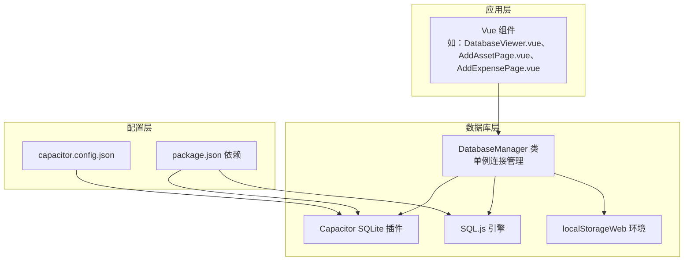
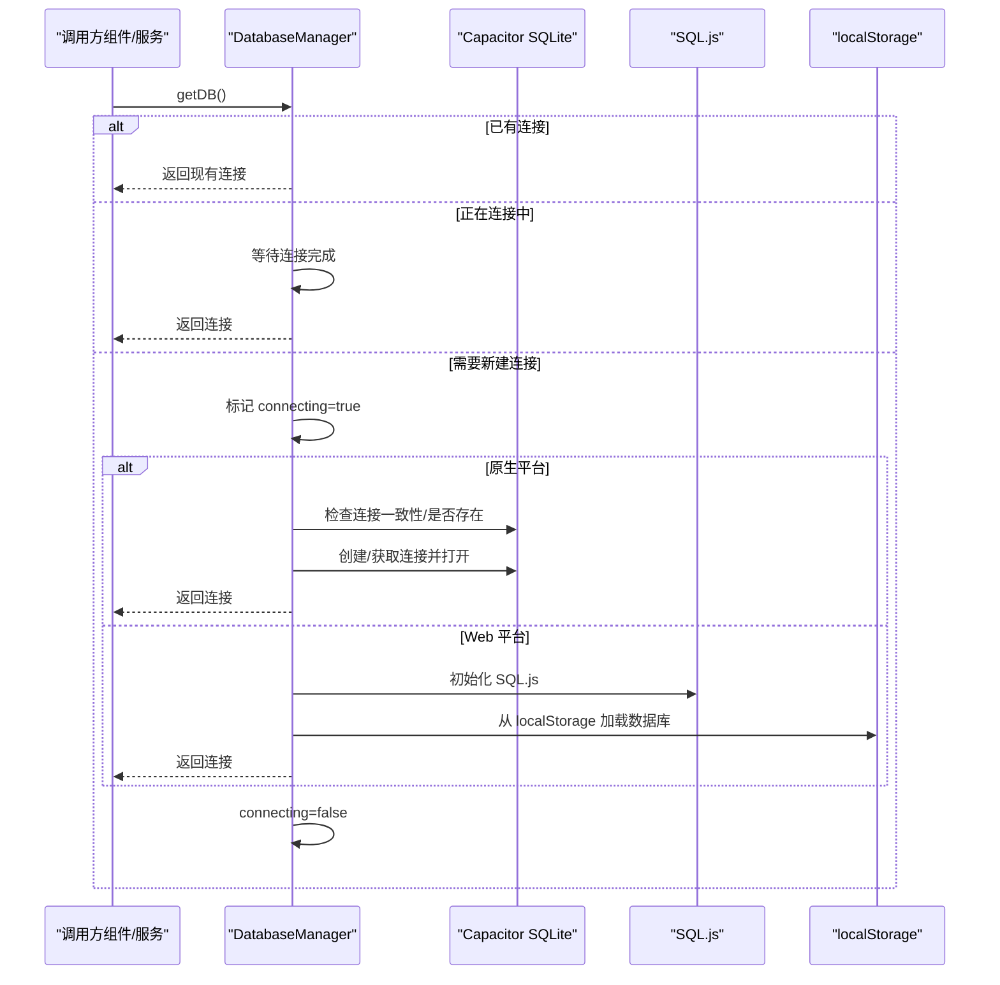
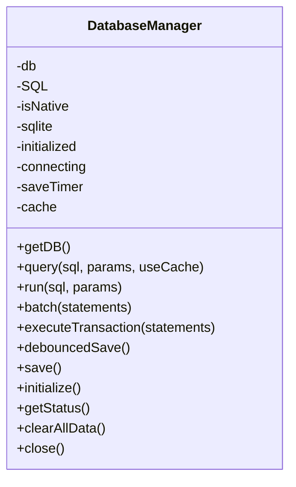
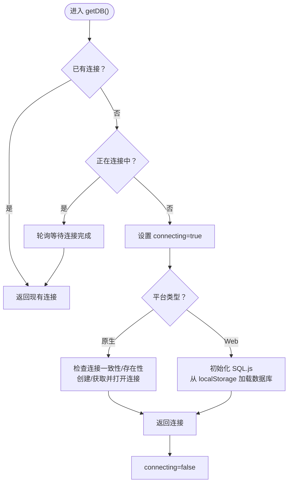
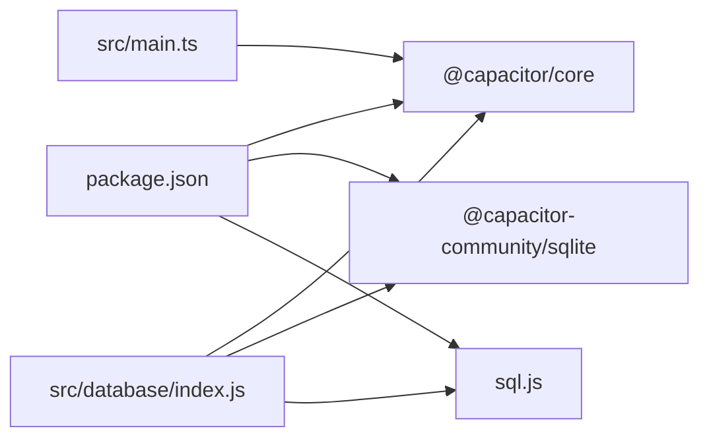

# 连接管理

<cite>
**本文引用的文件**
- [src/database/index.js](file://src/database/index.js)
- [src/database/adapter.js](file://src/database/adapter.js)
- [src/main.ts](file://src/main.ts)
- [capacitor.config.json](file://capacitor.config.json)
- [package.json](file://package.json)
- [src/components/mobile/DatabaseViewer.vue](file://src/components/mobile/DatabaseViewer.vue)
- [src/components/mobile/asset/AddAssetPage.vue](file://src/components/mobile/asset/AddAssetPage.vue)
- [src/components/mobile/expense/AddExpensePage.vue](file://src/components/mobile/expense/AddExpensePage.vue)
</cite>

## 目录
1. [简介](#简介)
2. [项目结构](#项目结构)
3. [核心组件](#核心组件)
4. [架构总览](#架构总览)
5. [详细组件分析](#详细组件分析)
6. [依赖分析](#依赖分析)
7. [性能考量](#性能考量)
8. [故障排查指南](#故障排查指南)
9. [结论](#结论)
10. [附录](#附录)

## 简介
本文件聚焦于数据库连接管理，系统性解析以下主题：
- DatabaseManager.getDB() 的实现原理与连接策略
- 单例模式、连接状态管理与连接复用
- Capacitor SQLite 与 SQL.js 两种运行模式的差异
- 连接池管理策略与连接超时处理
- 连接状态检查与连接恢复机制
- Web 环境 localStorage 持久化与原生环境直接存储
- 最佳实践与性能优化建议
- 连接错误诊断与处理方案
- 连接安全性考虑与加密机制

## 项目结构
本项目采用“按功能模块”组织方式，数据库相关逻辑集中在 src/database 目录，前端组件通过统一导出的 db 对象访问数据库能力；Capacitor 配置位于根目录，用于声明插件与平台特性。

图表来源
- [src/database/index.js:1-935](file://src/database/index.js#L1-L935)
- [capacitor.config.json:1-23](file://capacitor.config.json#L1-L23)
- [package.json:19-35](file://package.json#L19-L35)

章节来源
- [src/database/index.js:1-935](file://src/database/index.js#L1-L935)
- [capacitor.config.json:1-23](file://capacitor.config.json#L1-L23)
- [package.json:19-35](file://package.json#L19-L35)

## 核心组件
- DatabaseManager：负责数据库连接生命周期、查询执行、事务、批处理、持久化与缓存等。
- db 导出对象：对外暴露 connect/query/run/batch/executeTransaction/close/getStatus/clearAllData 等方法，内部委托给 DatabaseManager。
- adapter.js：平台适配层，根据 Capacitor.isNativePlatform() 决定使用 Capacitor SQLite 或 SQL.js。

章节来源
- [src/database/index.js:20-935](file://src/database/index.js#L20-L935)
- [src/database/adapter.js:1-34](file://src/database/adapter.js#L1-L34)

## 架构总览
下图展示 getDB() 在不同运行模式下的连接路径与持久化策略。

图表来源
- [src/database/index.js:56-190](file://src/database/index.js#L56-L190)

## 详细组件分析

### DatabaseManager 类与单例模式
- 单例：全局仅有一个 DatabaseManager 实例，避免重复连接与资源浪费。
- 关键状态字段：
  - db：当前数据库连接实例（Capacitor SQLiteDBConnection 或 SQL.js Database）
  - SQL：SQL.js 引擎实例
  - isNative：是否原生平台
  - sqlite：SQLiteConnection 实例
  - initialized/connecting/cache/saveTimer：初始化状态、连接状态、查询缓存、Web 持久化定时器
- 连接复用：若已存在连接，直接返回；若正在连接中，等待 while 循环轮询直到完成。
- 初始化标志：initialized 控制数据库表结构初始化流程，避免重复执行。

图表来源
- [src/database/index.js:20-935](file://src/database/index.js#L20-L935)

章节来源
- [src/database/index.js:20-32](file://src/database/index.js#L20-L32)
- [src/database/index.js:56-190](file://src/database/index.js#L56-L190)

### getDB() 方法实现原理与连接策略
- 连接复用与并发控制
  - 若已存在连接，直接返回。
  - 若正在连接中，通过短间隔轮询等待，避免并发创建多个连接。
- 原生平台（Capacitor SQLite）
  - 检查连接一致性与是否存在，优先复用现有连接；否则创建新连接并打开。
  - 使用位置参数传参，避免命名参数导致的兼容问题。
- Web 平台（SQL.js）
  - 初始化 SQL.js 引擎，尝试从 localStorage 加载已持久化的数据库；失败则创建新数据库。
  - 执行写操作后，通过防抖定时器延迟持久化到 localStorage，降低频繁写入带来的性能损耗。
- 连接状态管理
  - connecting 标志位确保并发安全；finally 中重置为 false。
  - close() 会关闭连接并清理缓存与定时器。

图表来源
- [src/database/index.js:56-190](file://src/database/index.js#L56-L190)

章节来源
- [src/database/index.js:56-190](file://src/database/index.js#L56-L190)

### Capacitor SQLite 与 SQL.js 运行模式差异
- 原生平台（Android/iOS）
  - 使用 @capacitor-community/sqlite 插件，支持原生数据库文件存储，无需额外持久化。
  - 连接一致性检查与连接复用由插件层保证。
- Web 平台（浏览器/Node/Electron）
  - 使用 sql.js 将数据库以内存形式运行，需通过 localStorage 持久化。
  - 持久化采用防抖策略，默认节流时间为 1 秒，避免频繁写入影响性能。

章节来源
- [src/database/index.js:81-178](file://src/database/index.js#L81-L178)
- [src/database/index.js:379-408](file://src/database/index.js#L379-L408)
- [package.json:20-31](file://package.json#L20-L31)

### 连接池管理策略与连接超时处理
- 连接池策略
  - 本实现采用“单连接”策略：全局仅维护一个数据库连接实例，避免多连接带来的复杂性与资源消耗。
  - 通过 connecting 标志位与轮询等待，确保并发安全。
- 连接超时
  - 代码未显式设置超时时间；若出现长时间阻塞，可通过外部调用侧增加超时控制（例如在业务层包装 Promise.race）。

章节来源
- [src/database/index.js:20-32](file://src/database/index.js#L20-L32)
- [src/database/index.js:56-190](file://src/database/index.js#L56-L190)

### 连接状态检查与连接恢复机制
- 状态检查
  - getStatus() 返回 isNative、connected、initialized、connecting、cacheSize 等状态信息，便于前端调试与可视化展示。
- 连接恢复
  - getDB() 自动处理连接一致性检查与复用；若连接异常，可再次调用 getDB() 触发重建流程。
  - close() 会清理缓存与定时器，便于重新初始化。

章节来源
- [src/database/index.js:826-834](file://src/database/index.js#L826-L834)
- [src/database/index.js:793-821](file://src/database/index.js#L793-L821)

### Web 环境 localStorage 持久化与原生环境直接存储
- Web 环境
  - 从 localStorage 读取名为 sqlite_{dbName} 的字符串，解析为 Uint8Array 后构造 SQL.js Database。
  - 写入操作通过 debouncedSave() 定时器延迟保存，保存时 export() 为字节数组并序列化存储。
- 原生环境
  - 由 Capacitor SQLite 插件负责底层存储，无需手动持久化；但注意插件版本与权限配置。

章节来源
- [src/database/index.js:156-177](file://src/database/index.js#L156-L177)
- [src/database/index.js:379-408](file://src/database/index.js#L379-L408)
- [src/components/mobile/DatabaseViewer.vue:175-199](file://src/components/mobile/DatabaseViewer.vue#L175-L199)

### 查询执行与事务处理
- query()
  - 支持查询缓存（Map），命中则直接返回；否则执行查询并将结果写入缓存。
  - 原生模式返回对象数组（使用原始字段名），Web 模式通过 stmt.getAsObject() 获取对象。
- run()/batch()/executeTransaction()
  - 原生模式使用位置参数传参；Web 模式使用 SQL.js 的 prepare/bind/run/free 流程。
  - executeTransaction() 直接调用 db.executeSet，利用插件的自动事务能力。
  - 执行后统一清除缓存，避免脏读。

章节来源
- [src/database/index.js:199-374](file://src/database/index.js#L199-L374)

### 数据库初始化与结构迁移
- initialize()
  - 批量执行建表语句与索引创建，提升查询性能。
  - 针对现有用户进行结构迁移（如新增字段），通过 getColumns() 检测并 ALTER TABLE。
- 清空数据
  - clearAllData() 使用事务批量删除各表数据，失败时回滚，确保一致性。

章节来源
- [src/database/index.js:420-890](file://src/database/index.js#L420-L890)

### 使用示例与集成点
- 组件中导入 db 并调用 query/run 等方法，体现统一的数据库访问入口。
- DatabaseViewer.vue 展示了数据库状态检查与本地存储大小统计。

章节来源
- [src/components/mobile/DatabaseViewer.vue:102-172](file://src/components/mobile/DatabaseViewer.vue#L102-L172)
- [src/components/mobile/asset/AddAssetPage.vue:84-135](file://src/components/mobile/asset/AddAssetPage.vue#L84-L135)
- [src/components/mobile/expense/AddExpensePage.vue:117-137](file://src/components/mobile/expense/AddExpensePage.vue#L117-L137)

## 依赖分析
- Capacitor 生态
  - @capacitor/core：平台检测与运行时能力
  - @capacitor-community/sqlite：原生 SQLite 插件
- Web 环境
  - sql.js：浏览器内嵌数据库引擎
- 应用启动
  - src/main.ts 中对 Capacitor.isNativePlatform() 的判断，用于平台感知。

图表来源
- [package.json:19-35](file://package.json#L19-L35)
- [src/main.ts:7-11](file://src/main.ts#L7-L11)
- [src/database/index.js:8-10](file://src/database/index.js#L8-L10)

章节来源
- [package.json:19-35](file://package.json#L19-L35)
- [src/main.ts:7-11](file://src/main.ts#L7-L11)
- [src/database/index.js:8-10](file://src/database/index.js#L8-L10)

## 性能考量
- 连接复用与并发控制：单连接 + connecting 标志位，避免重复创建与竞态。
- 查询缓存：Map 缓存查询结果，减少重复查询成本。
- 批处理：batch() 与 executeTransaction() 降低往返次数，提升吞吐。
- Web 持久化节流：SAVE_THROTTLE_MS 默认 1000ms，减少 localStorage 写入频率。
- 索引优化：为高频查询字段建立索引，显著提升查询性能。
- 参数绑定：统一使用位置参数，避免命名参数兼容性问题。

章节来源
- [src/database/index.js:13-18](file://src/database/index.js#L13-L18)
- [src/database/index.js:199-264](file://src/database/index.js#L199-L264)
- [src/database/index.js:316-347](file://src/database/index.js#L316-L347)
- [src/database/index.js:420-688](file://src/database/index.js#L420-L688)

## 故障排查指南
- 连接失败
  - 检查 isNative 判断与 Capacitor 插件是否正确安装与同步。
  - 查看 getDB() 中的错误日志与抛出信息。
- Web 环境数据丢失
  - 确认 localStorage 中 sqlite_{dbName} 是否存在；若损坏，初始化时会创建新数据库。
  - 检查 debouncedSave() 是否被触发，以及保存时机是否合理。
- 查询异常
  - 使用 useCache=false 跳过缓存验证问题；检查 SQL 语法与参数绑定。
  - 原生模式与 Web 模式的字段名映射差异，确保消费端兼容。
- 事务失败
  - clearAllData() 中的事务回滚逻辑可帮助定位问题；必要时分步执行以缩小范围。

章节来源
- [src/database/index.js:56-190](file://src/database/index.js#L56-L190)
- [src/database/index.js:379-408](file://src/database/index.js#L379-L408)
- [src/database/index.js:839-890](file://src/database/index.js#L839-L890)

## 结论
本实现通过单例模式与严格的连接状态管理，兼顾了原生与 Web 两端的差异化需求。Capacitor SQLite 提供稳定可靠的原生存储，SQL.js 配合 localStorage 实现 Web 端持久化。结合查询缓存、批处理与索引优化，整体具备良好的性能表现。建议在生产环境中配合超时控制、更细粒度的错误分类与监控埋点，进一步提升稳定性与可观测性。

## 附录

### 运行模式与持久化对照
- 原生平台
  - 存储介质：原生数据库文件
  - 持久化：插件自动管理
  - 适用场景：移动端、桌面端（Electron）
- Web 平台
  - 存储介质：内存数据库（sql.js）
  - 持久化：localStorage（节流保存）
  - 适用场景：浏览器、Node/Electron（非原生）

章节来源
- [src/database/index.js:81-178](file://src/database/index.js#L81-L178)
- [src/database/index.js:379-408](file://src/database/index.js#L379-L408)

### 安全性与加密机制
- 当前实现
  - 原生平台：创建连接时指定“no-encryption”，未启用加密。
  - Web 平台：localStorage 未加密存储，存在泄露风险。
- 建议
  - 原生平台：评估启用数据库加密（参考插件文档），并在应用层引入密钥管理。
  - Web 平台：考虑在持久化前进行压缩与加密（如使用 crypto-js），并限制 localStorage 使用范围与生命周期。

章节来源
- [src/database/index.js:127-134](file://src/database/index.js#L127-L134)
- [package.json:25](file://package.json#L25)