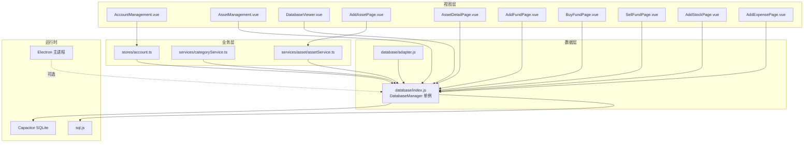
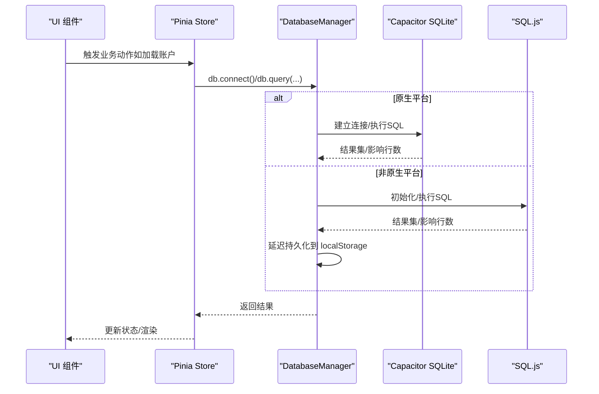
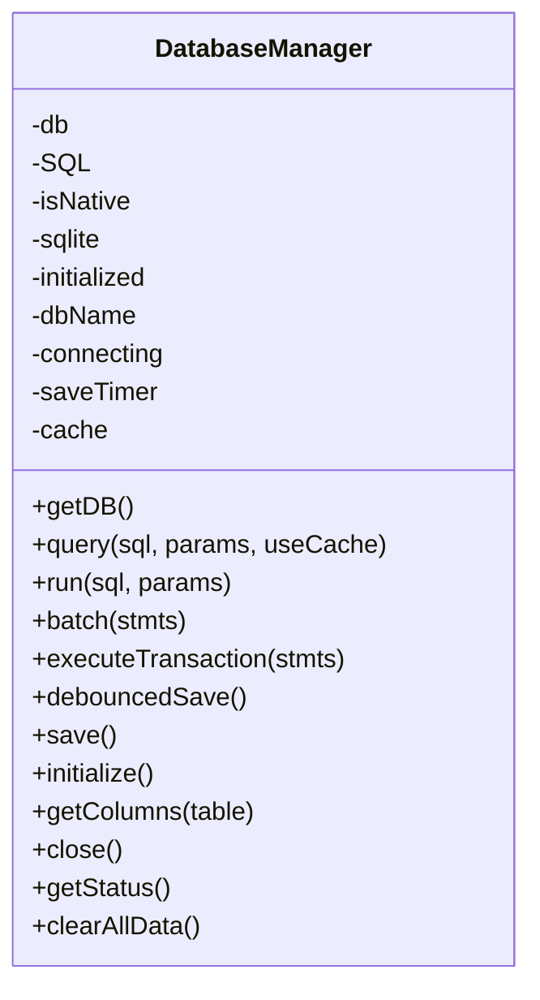
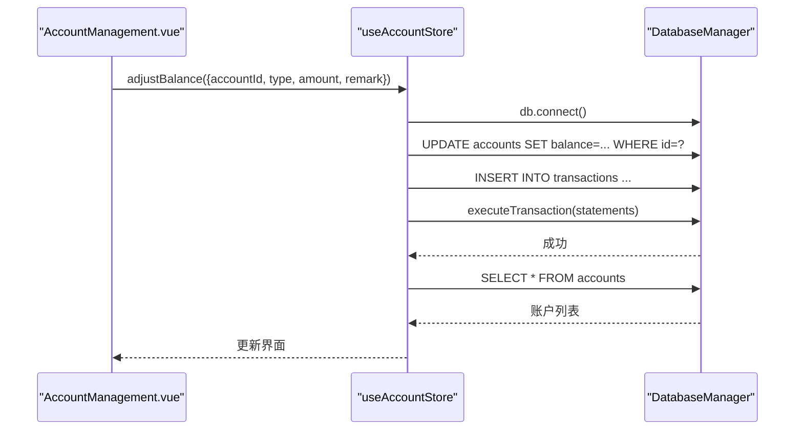
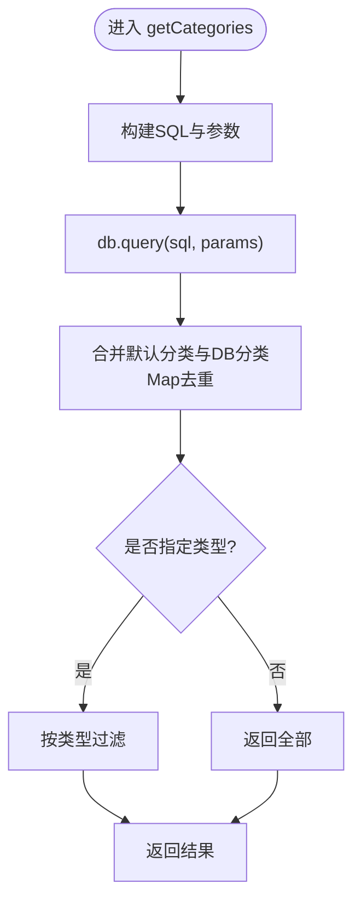
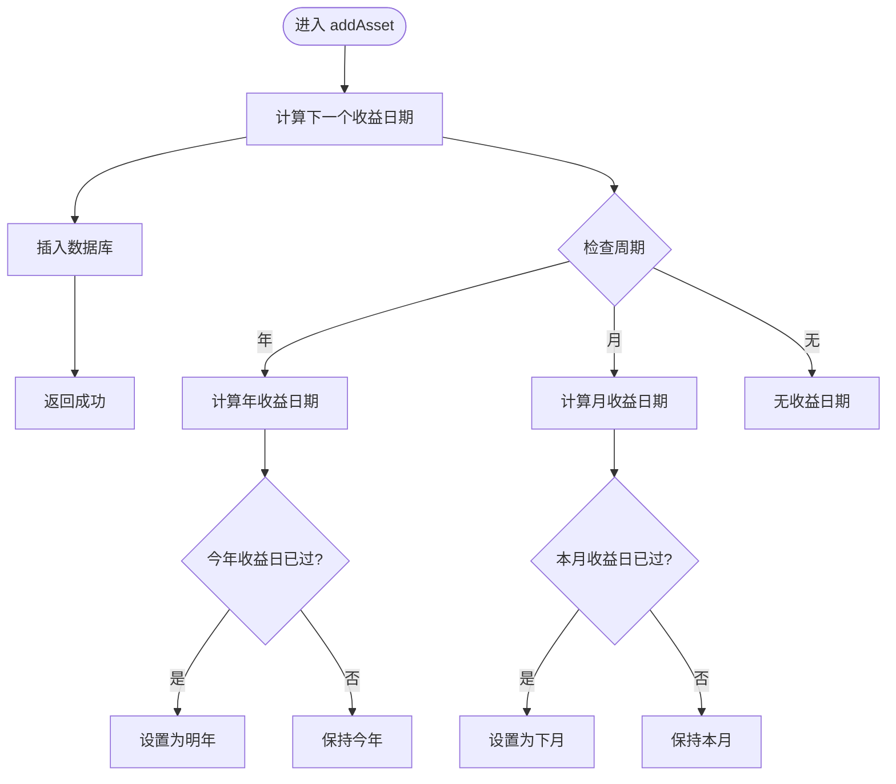
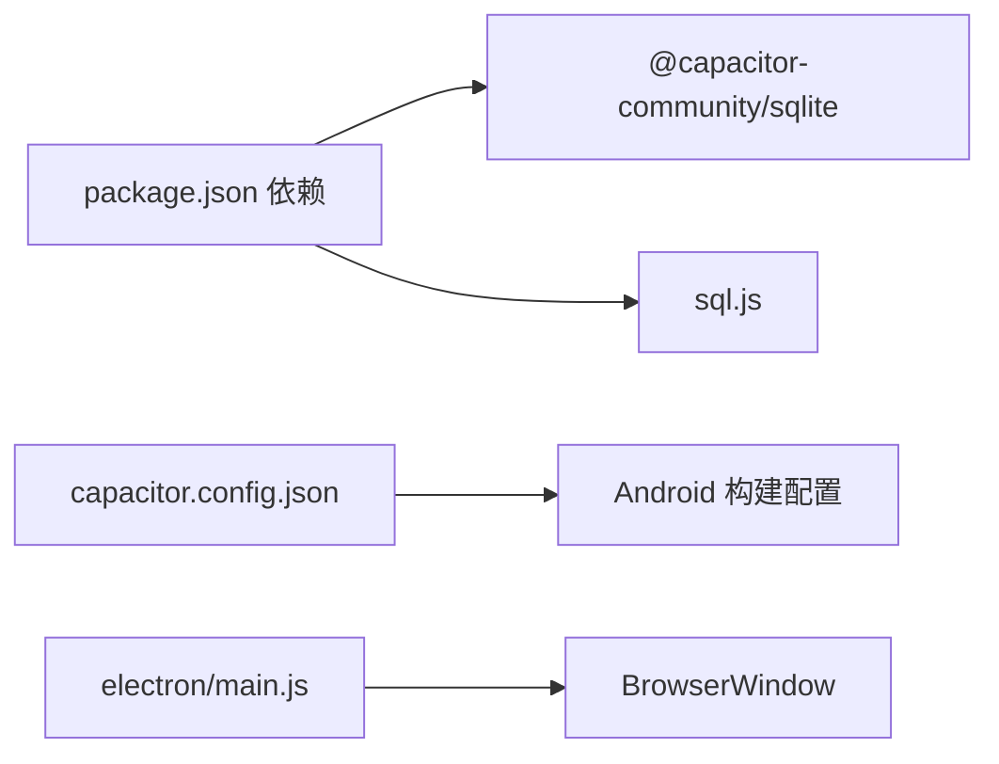

# 数据库管理

<cite>
**本文档引用的文件**
- [src/database/index.js](file://src/database/index.js)
- [src/database/adapter.js](file://src/database/adapter.js)
- [src/stores/account.ts](file://src/stores/account.ts)
- [src/services/categoryService.ts](file://src/services/categoryService.ts)
- [src/services/asset/assetService.ts](file://src/services/asset/assetService.ts)
- [src/types/asset/asset.ts](file://src/types/asset/asset.ts)
- [src/components/mobile/DatabaseViewer.vue](file://src/components/mobile/DatabaseViewer.vue)
- [src/components/mobile/account/AccountManagement.vue](file://src/components/mobile/account/AccountManagement.vue)
- [src/components/mobile/asset/AssetManagement.vue](file://src/components/mobile/asset/AssetManagement.vue)
- [src/components/mobile/asset/AddAssetPage.vue](file://src/components/mobile/asset/AddAssetPage.vue)
- [src/components/mobile/asset/AssetDetailPage.vue](file://src/components/mobile/asset/AssetDetailPage.vue)
- [src/components/mobile/asset/AddFundPage.vue](file://src/components/mobile/asset/AddFundPage.vue)
- [src/components/mobile/asset/AddStockPage.vue](file://src/components/mobile/asset/AddStockPage.vue)
- [src/components/mobile/asset/BuyFundPage.vue](file://src/components/mobile/asset/BuyFundPage.vue)
- [src/components/mobile/asset/BuyStockPage.vue](file://src/components/mobile/asset/BuyStockPage.vue)
- [src/components/mobile/asset/SellFundPage.vue](file://src/components/mobile/asset/SellFundPage.vue)
- [src/components/mobile/asset/SellStockPage.vue](file://src/components/mobile/asset/SellStockPage.vue)
- [src/components/mobile/expense/AddExpensePage.vue](file://src/components/mobile/expense/AddExpensePage.vue)
- [src/data/categories.ts](file://src/data/categories.ts)
- [src/utils/dictionaries.ts](file://src/utils/dictionaries.ts)
- [electron/main.js](file://electron/main.js)
- [capacitor.config.json](file://capacitor.config.json)
- [package.json](file://package.json)
- [update.js](file://update.js)
</cite>

## 更新摘要
**所做更改**
- 新增了assets表的income_date和next_income_date字段，支持收益日期管理
- 更新了资产服务的收益日期计算逻辑，支持年和月两种周期
- 新增了迁移脚本update.js，自动更新数据库架构和相关组件
- 更新了资产类型定义，支持新的收益日期字段
- 增强了资产管理功能，支持收益日的可视化展示
- 改进了数据库架构，从混合模式到单一模式的转变
- 更新了索引优化策略，新增资产表相关索引

## 目录
1. [简介](#简介)
2. [项目结构](#项目结构)
3. [核心组件](#核心组件)
4. [架构总览](#架构总览)
5. [详细组件分析](#详细组件分析)
6. [依赖关系分析](#依赖关系分析)
7. [性能考量](#性能考量)
8. [故障排查指南](#故障排查指南)
9. [结论](#结论)
10. [附录](#附录)

## 简介
本文件面向财务应用程序的数据库管理，系统性梳理数据库设计、架构与实现，涵盖账户、交易、资产、负债、分类等核心数据模型；阐述 Capacitor SQLite 与 SQL.js 的双模式支持策略；解析数据库适配器设计与实现细节；总结 CRUD 操作与事务处理；给出性能优化、索引设计、查询优化、迁移与版本管理、最佳实践与安全建议，并提供可复用的使用模式与扩展指导。

**更新** 本版本反映了数据库架构的重大变更，从混合模式迁移到单一模式，新增了assets表的收益日期管理功能，简化了初始化逻辑，并引入了更完善的事务处理机制。

## 项目结构
财务应用采用前端框架 + 数据层抽象的分层组织：
- 数据层：统一通过数据库管理器封装底层差异，支持 Capacitor SQLite（移动端）与 SQL.js（Web/桌面）两种后端。
- 业务层：Pinia Store 与 Service 层负责业务逻辑编排与数据访问。
- 视图层：Vue 组件负责展示与交互，内置数据库查看器便于调试与运维。

**图表来源**
- [src/components/mobile/account/AccountManagement.vue:158-340](file://src/components/mobile/account/AccountManagement.vue#L158-L340)
- [src/components/mobile/asset/AssetManagement.vue:75-143](file://src/components/mobile/asset/AssetManagement.vue#L75-L143)
- [src/components/mobile/DatabaseViewer.vue:100-237](file://src/components/mobile/DatabaseViewer.vue#L100-L237)
- [src/components/mobile/asset/AddAssetPage.vue:86-285](file://src/components/mobile/asset/AddAssetPage.vue#L86-L285)
- [src/components/mobile/asset/AssetDetailPage.vue:236-435](file://src/components/mobile/asset/AssetDetailPage.vue#L236-L435)
- [src/components/mobile/asset/AddFundPage.vue:130-322](file://src/components/mobile/asset/AddFundPage.vue#L130-L322)
- [src/components/mobile/asset/BuyFundPage.vue:140-273](file://src/components/mobile/asset/BuyFundPage.vue#L140-L273)
- [src/components/mobile/asset/SellFundPage.vue:190-306](file://src/components/mobile/asset/SellFundPage.vue#L190-L306)
- [src/components/mobile/asset/AddStockPage.vue:170-287](file://src/components/mobile/asset/AddStockPage.vue#L170-L287)
- [src/components/mobile/expense/AddExpensePage.vue:415-455](file://src/components/mobile/expense/AddExpensePage.vue#L415-L455)
- [src/stores/account.ts:27-53](file://src/stores/account.ts#L27-L53)
- [src/services/categoryService.ts:8-26](file://src/services/categoryService.ts#L8-L26)
- [src/services/asset/assetService.ts:1-165](file://src/services/asset/assetService.ts#L1-L165)
- [src/database/adapter.js:14-24](file://src/database/adapter.js#L14-L24)
- [src/database/index.js:21-32](file://src/database/index.js#L21-L32)

**章节来源**
- [src/database/index.js:1-884](file://src/database/index.js#L1-L884)
- [src/database/adapter.js:1-34](file://src/database/adapter.js#L1-L34)
- [src/stores/account.ts:1-273](file://src/stores/account.ts#L1-L273)
- [src/services/categoryService.ts:1-260](file://src/services/categoryService.ts#L1-L260)
- [src/services/asset/assetService.ts:1-165](file://src/services/asset/assetService.ts#L1-L165)
- [src/types/asset/asset.ts:1-31](file://src/types/asset/asset.ts#L1-L31)
- [src/components/mobile/DatabaseViewer.vue:1-480](file://src/components/mobile/DatabaseViewer.vue#L1-L480)
- [src/components/mobile/account/AccountManagement.vue:1-650](file://src/components/mobile/account/AccountManagement.vue#L1-L650)
- [src/components/mobile/asset/AssetManagement.vue:1-466](file://src/components/mobile/asset/AssetManagement.vue#L1-L466)
- [src/components/mobile/asset/AddAssetPage.vue:1-285](file://src/components/mobile/asset/AddAssetPage.vue#L1-L285)
- [src/components/mobile/asset/AssetDetailPage.vue:1-435](file://src/components/mobile/asset/AssetDetailPage.vue#L1-L435)
- [src/components/mobile/asset/AddFundPage.vue:1-386](file://src/components/mobile/asset/AddFundPage.vue#L1-L386)
- [src/components/mobile/asset/AddStockPage.vue:1-287](file://src/components/mobile/asset/AddStockPage.vue#L1-L287)
- [src/components/mobile/asset/BuyFundPage.vue:1-273](file://src/components/mobile/asset/BuyFundPage.vue#L1-L273)
- [src/components/mobile/asset/BuyStockPage.vue:1-273](file://src/components/mobile/asset/BuyStockPage.vue#L1-L273)
- [src/components/mobile/asset/SellFundPage.vue:1-306](file://src/components/mobile/asset/SellFundPage.vue#L1-L306)
- [src/components/mobile/asset/SellStockPage.vue:1-306](file://src/components/mobile/asset/SellStockPage.vue#L1-L306)
- [src/components/mobile/expense/AddExpensePage.vue:1-480](file://src/components/mobile/expense/AddExpensePage.vue#L1-L480)
- [src/data/categories.ts:1-45](file://src/data/categories.ts#L1-L45)
- [src/utils/dictionaries.ts:1-90](file://src/utils/dictionaries.ts#L1-L90)
- [electron/main.js:1-70](file://electron/main.js#L1-L70)
- [capacitor.config.json:1-23](file://capacitor.config.json#L1-L23)
- [package.json:1-72](file://package.json#L1-L72)
- [update.js:1-715](file://update.js#L1-L715)

## 核心组件
- 数据库管理器（DatabaseManager 单例）：负责连接建立、初始化、查询执行、批处理、事务、缓存、持久化（Web 端 localStorage）、状态查询与清理。
- 数据库适配器：根据平台（原生/非原生）选择具体实现入口，当前示例返回统一的数据库模块。
- 业务 Store 与 Service：封装 CRUD 与复杂流程（如账户余额调整、转账），统一通过数据库管理器执行 SQL。

**更新** 数据库管理器现在采用单一模式，不再支持复杂的迁移处理，简化了初始化逻辑，并新增了assets表的收益日期管理功能。

**章节来源**
- [src/database/index.js:21-32](file://src/database/index.js#L21-L32)
- [src/database/adapter.js:14-33](file://src/database/adapter.js#L14-L33)
- [src/stores/account.ts:27-100](file://src/stores/account.ts#L27-L100)
- [src/services/categoryService.ts:101-175](file://src/services/categoryService.ts#L101-L175)

## 架构总览
数据库架构采用"单一模式支持"的策略：
- 移动端（Capacitor）：使用 Capacitor SQLite，具备原生性能与稳定性，适合生产部署。
- Web/桌面（Electron/Vite）：使用 SQL.js，以内存数据库+localStorage持久化的方式满足跨平台需求。
- 抽象层：统一的数据库管理器屏蔽差异，提供 query/run/batch/executeTransaction 等一致接口。

**图表来源**
- [src/database/index.js:56-190](file://src/database/index.js#L56-L190)
- [src/database/index.js:199-309](file://src/database/index.js#L199-L309)
- [src/database/index.js:316-374](file://src/database/index.js#L316-L374)
- [src/database/index.js:379-408](file://src/database/index.js#L379-L408)
- [src/stores/account.ts:38-52](file://src/stores/account.ts#L38-L52)

## 详细组件分析

### 数据库管理器（DatabaseManager）
职责与特性：
- 单例与连接池：避免重复连接，串行化连接过程，减少竞态。
- 单一模式支持：原生平台使用 Capacitor SQLite，非原生平台使用 SQL.js。
- 查询与执行：query 支持结果缓存；run/batch/executeTransaction 提供写操作与事务能力。
- Web 持久化：SQL.js 模式下延迟持久化至 localStorage，带节流控制。
- 简化初始化：批量建表、索引，移除复杂的迁移处理。
- 状态与清理：getStatus、clearAllData（事务包裹）、close。

**更新** 初始化逻辑已简化，移除了复杂的迁移处理，专注于基础表结构的创建，并新增了assets表的收益日期字段支持。

**图表来源**
- [src/database/index.js:21-32](file://src/database/index.js#L21-L32)
- [src/database/index.js:56-190](file://src/database/index.js#L56-L190)
- [src/database/index.js:199-374](file://src/database/index.js#L199-L374)
- [src/database/index.js:379-408](file://src/database/index.js#L379-L408)
- [src/database/index.js:420-836](file://src/database/index.js#L420-L836)
- [src/database/index.js:826-890](file://src/database/index.js#L826-L890)

**章节来源**
- [src/database/index.js:21-884](file://src/database/index.js#L21-L884)

### 数据库适配器
- 作用：在不同运行环境下提供统一的数据库访问入口。
- 当前实现：根据平台返回统一数据库模块（示例中为本地模块），便于后续替换为真实原生/Node SQLite 实现。

**章节来源**
- [src/database/adapter.js:1-34](file://src/database/adapter.js#L1-L34)

### 账户管理（Store + 事务）
- 功能：加载账户、新增、更新、删除、余额调整（事务）、内部转账（事务）。
- 事务策略：余额调整与转账均使用事务保证一致性；转账示例演示了手动 BEGIN/COMMIT/ROLLBACK 的使用。

**图表来源**
- [src/stores/account.ts:145-185](file://src/stores/account.ts#L145-L185)
- [src/stores/account.ts:191-270](file://src/stores/account.ts#L191-L270)
- [src/database/index.js:354-374](file://src/database/index.js#L354-L374)

**章节来源**
- [src/stores/account.ts:34-273](file://src/stores/account.ts#L34-L273)

### 分类服务（CRUD 与默认数据）
- 功能：查询分类、按 ID 查询、创建、更新、删除、检查数据库状态、初始化默认分类。
- 设计要点：合并默认分类与数据库分类，使用 Map 去重；支持按类型过滤。

**图表来源**
- [src/services/categoryService.ts:14-69](file://src/services/categoryService.ts#L14-L69)
- [src/data/categories.ts:1-45](file://src/data/categories.ts#L1-L45)

**章节来源**
- [src/services/categoryService.ts:1-260](file://src/services/categoryService.ts#L1-L260)
- [src/data/categories.ts:1-45](file://src/data/categories.ts#L1-L45)

### 数据库查看器（调试与运维）
- 功能：切换表、刷新、格式化显示、检查存储状态（原生/内存）、清空数据（事务包裹）、格式化本地存储大小。
- 使用场景：开发调试、数据校验、一键清空测试数据。

**章节来源**
- [src/components/mobile/DatabaseViewer.vue:100-237](file://src/components/mobile/DatabaseViewer.vue#L100-L237)

### 资产管理（多表联查与展示）
- 功能：并行加载通用资产、股票、基金、账户数据，组合展示卡片。
- 使用模式：Promise.all 并行查询，减少等待时间。
- 历史资产管理：通过ended字段区分当前资产与历史资产，支持资产生命周期管理。

**更新** 新增了ended字段的支持，用于区分当前资产与历史资产，实现完整的资产生命周期管理。

**章节来源**
- [src/components/mobile/asset/AssetManagement.vue:120-319](file://src/components/mobile/asset/AssetManagement.vue#L120-L319)

### 资产服务（新增收益日期功能）
- 功能：通用资产的增删改查、收益日期计算、活跃资产查询。
- 收益日期计算：支持年和月两种周期，自动计算下一个收益日期。
- 类型定义：支持income_date和next_income_date字段。

**更新** 新增了收益日期计算功能，支持年和月两种周期的自动计算。

**图表来源**
- [src/services/asset/assetService.ts:12-43](file://src/services/asset/assetService.ts#L12-L43)
- [src/services/asset/assetService.ts:48-71](file://src/services/asset/assetService.ts#L48-L71)

**章节来源**
- [src/services/asset/assetService.ts:1-165](file://src/services/asset/assetService.ts#L1-L165)

### 资产类型定义（新增收益日期字段）
- 功能：定义资产的基础接口和输入接口。
- 新增字段：income_date（收益日期）、next_income_date（下一个收益日期）。

**更新** 新增了收益日期相关的类型定义，支持完整的收益日期管理。

**章节来源**
- [src/types/asset/asset.ts:1-31](file://src/types/asset/asset.ts#L1-L31)

### 添加资产页面（新增收益日期输入）
- 功能：支持年和月两种周期的收益日期输入。
- 年周期：选择月份和日期，格式为MM-DD。
- 月周期：选择日期，格式为DD。
- 资产类型验证：公积金资产必须关联公积金账户。

**更新** 新增了收益日期输入功能，支持年和月两种周期的选择。

**章节来源**
- [src/components/mobile/asset/AddAssetPage.vue:86-285](file://src/components/mobile/asset/AddAssetPage.vue#L86-L285)

### 资产详情页面（新增收益日期展示）
- 功能：展示资产的基本信息和收益日期。
- 收益日期展示：显示收益日和下一个收益日。
- 格式化显示：对日期进行格式化处理。

**更新** 新增了收益日期的展示功能，支持收益日和下一个收益日的显示。

**章节来源**
- [src/components/mobile/asset/AssetDetailPage.vue:236-435](file://src/components/mobile/asset/AssetDetailPage.vue#L236-L435)

### 基金管理（ended字段应用）
- 新增基金：检查基金是否已存在，若已结束则提示到历史记录查看。
- 买入基金：重置ended状态为0，表示资产重新激活。
- 卖出基金：当份额为0时设置ended为1，标记资产结束。

**更新** 详细说明了ended字段在基金生命周期管理中的具体应用。

**章节来源**
- [src/components/mobile/asset/AddFundPage.vue:130-322](file://src/components/mobile/asset/AddFundPage.vue#L130-L322)
- [src/components/mobile/asset/BuyFundPage.vue:140-273](file://src/components/mobile/asset/BuyFundPage.vue#L140-L273)
- [src/components/mobile/asset/SellFundPage.vue:190-306](file://src/components/mobile/asset/SellFundPage.vue#L190-L306)

### 账户交易流水（新增审计功能）
- 新增账户交易流水表（account_transactions）：专门记录账户余额的每次变动，提供完整的审计能力。
- 审计内容：账户ID、变动类型、金额、变动后余额、描述、交易时间等。
- 使用场景：余额追踪、审计日志、财务报表生成。
- 事务集成：在所有涉及账户余额的操作中，都会同时记录账户流水，确保数据一致性。

**更新** 新增了account_transactions表的详细说明，这是本次数据库架构变更的核心改进。

**章节来源**
- [src/database/index.js:469-484](file://src/database/index.js#L469-L484)
- [src/components/mobile/asset/AddFundPage.vue:213-240](file://src/components/mobile/asset/AddFundPage.vue#L213-L240)
- [src/components/mobile/asset/AddStockPage.vue:181-184](file://src/components/mobile/asset/AddStockPage.vue#L181-L184)
- [src/components/mobile/expense/AddExpensePage.vue:425-453](file://src/components/mobile/expense/AddExpensePage.vue#L425-L453)

### 数据库迁移脚本（新增）
- 功能：自动更新数据库架构和相关组件。
- 支持功能：更新assets表结构、更新类型定义、更新资产服务、更新组件。
- 自动化：通过update.js脚本自动完成所有更新。

**更新** 新增了完整的数据库迁移脚本，支持自动更新数据库架构和相关组件。

**章节来源**
- [update.js:1-715](file://update.js#L1-L715)

## 依赖关系分析
- 运行时依赖：Capacitor SQLite、SQL.js。
- 平台配置：Capacitor 配置文件定义应用包名、Web 目录、Android 构建选项。
- Electron：主进程负责窗口创建与 IPC，便于在桌面端运行与调试。

**图表来源**
- [package.json:19-35](file://package.json#L19-L35)
- [capacitor.config.json:1-23](file://capacitor.config.json#L1-L23)
- [electron/main.js:19-45](file://electron/main.js#L19-L45)

**章节来源**
- [package.json:1-72](file://package.json#L1-L72)
- [capacitor.config.json:1-23](file://capacitor.config.json#L1-L23)
- [electron/main.js:1-70](file://electron/main.js#L1-L70)

## 性能考量
- 连接与并发
  - 单例连接与连接状态标记，避免重复连接与竞态。
  - 查询缓存：对 query 结果进行 Map 缓存，命中则直接返回，降低重复查询成本。
- 批处理与事务
  - 批处理：批量执行 SQL 语句，减少往返次数。
  - 事务：余额调整、转账等关键流程使用事务，保证原子性与一致性。
- Web 端持久化
  - SQL.js 模式下采用延迟持久化与节流，避免频繁写入 localStorage。
- 索引优化
  - 为高频查询字段建立索引（账户类型、是否流动资金、交易账户外键、时间戳、分类类型、账户流水账户外键、资产表相关索引等）。
- 查询优化
  - 使用参数化查询防止注入，避免 SELECT *，按需选择列。
  - 对大表分页或限制返回数量，必要时增加时间范围条件。
- 存储与清理
  - 提供 clearAllData（事务包裹）与 close，确保资源释放与数据一致性。

**更新** 性能考量保持不变，主要针对简化后的初始化逻辑进行优化，并新增了assets表的索引优化。

**章节来源**
- [src/database/index.js:13-18](file://src/database/index.js#L13-L18)
- [src/database/index.js:199-264](file://src/database/index.js#L199-L264)
- [src/database/index.js:316-374](file://src/database/index.js#L316-L374)
- [src/database/index.js:379-408](file://src/database/index.js#L379-L408)
- [src/database/index.js:420-836](file://src/database/index.js#L420-L836)
- [src/database/index.js:839-890](file://src/database/index.js#L839-L890)

## 故障排查指南
- 连接问题
  - 检查平台判断与连接流程，确认 Capacitor SQLite 插件已正确安装与同步。
  - 非原生平台需确认 SQL.js 初始化成功且数据库实例可用。
- 查询异常
  - 使用 db.getStatus() 获取连接状态与缓存大小，定位缓存命中与连接状态。
  - 对于 SQL.js 模式，确认 localStorage 中是否存在持久化数据。
- 事务失败
  - 检查 BEGIN/COMMIT/ROLLBACK 的使用，确保异常时正确回滚。
- 数据不一致
  - 使用事务包裹关键写操作；必要时调用 clearAllData 清空后重建数据。
- 审计问题
  - 检查 account_transactions 表是否正确记录了所有余额变动。
  - 确认账户流水与实际余额的一致性。
- 收益日期问题
  - 检查assets表的income_date和next_income_date字段是否正确更新。
  - 确认calculateNextIncomeDate函数的逻辑是否正确。

**更新** 故障排查指南保持不变，适用于简化的数据库架构，并新增了收益日期相关的问题排查。

**章节来源**
- [src/database/index.js:826-834](file://src/database/index.js#L826-L834)
- [src/database/index.js:839-890](file://src/database/index.js#L839-L890)
- [src/components/mobile/DatabaseViewer.vue:175-199](file://src/components/mobile/DatabaseViewer.vue#L175-L199)

## 结论
该数据库管理方案通过统一的抽象层实现了 Capacitor SQLite 与 SQL.js 的单一模式支持，既满足移动端原生性能，又兼顾 Web/桌面跨平台需求。配合事务、批处理、查询缓存与索引优化，能够有效提升性能与可靠性。新增的account_transactions表为财务审计提供了完整的余额追踪能力，简化了数据库初始化逻辑，移除了复杂的迁移处理，使系统更加稳定和易于维护。新增的assets表收益日期管理功能进一步增强了财务应用的数据管理能力。

## 附录

### 数据模型与索引设计
- 账户表（accounts）：主键 id，类型 type，余额 balance，信用卡额度字段，是否流动资金，时间戳。
- 交易表（transactions）：主键 id，类型/子类型，金额，账户外键，余额后金额，状态与时间戳。
- 账户交易流水表（account_transactions）：主键 id，账户外键，类型，金额，变动后余额，描述，交易时间，时间戳。
- 资产表（assets）：主键 id，类型/名称，金额，账户外键，周期，周期数量，收益日期，下一个收益日期，ended状态，时间戳。
- 股票表（stocks）：主键 id，名称/代码，数量/成本价/当前价，确认收益，账户外键，ended状态，时间戳。
- 股票持有记录（stock_holdings）：主键 id，股票外键，价格/数量/剩余数量，卖出状态/费用，时间戳。
- 股票交易记录（stock_transactions）：主键 id，股票外键，价格/数量/类型，持有记录关联，费用，时间戳。
- 基金表（funds）：主键 id，名称/代码，份额/净值/成本净值，确认收益/总费用，锁定期，ended状态，账户外键，时间戳。
- 基金持有记录（fund_holdings）：主键 id，基金外键，净值/份额/剩余份额，卖出状态/费用/锁定期/锁止日期，时间戳。
- 基金交易记录（fund_transactions）：主键 id，基金外键，交易净值/份额/类型，持有记录关联，费用/锁定期/锁止日期，时间戳。
- 负债表（liabilities）：主键 id，类型/名称，本金/剩余本金，是否计息/利率，起始日期/还款方式/还款日/期数，账户外键，状态与时间戳。
- 财务目标（financial_goals）：主键 id，名称/类型，目标金额/月存额/期数，账户外键，状态与时间戳。
- 财务健康报告（financial_health）：主键 id，负债收入比/应急资金占比/资产负债率/储蓄率/净资产增长/总分，报告日期与时间戳。
- 分类表（categories）：主键 id，名称/图标/图标文本/类型，时间戳。

**更新** 新增了assets表的收益日期字段说明，用于资产收益日期管理。

索引建议（已在初始化中创建）：
- 账户：type、is_liquid
- 交易：account_id、created_at
- 账户交易流水：account_id、transaction_time
- 资产：account_id
- 股票：account_id
- 基金：account_id
- 负债：account_id、status
- 财务目标：account_id、status
- 分类：type

**章节来源**
- [src/database/index.js:433-709](file://src/database/index.js#L433-L709)

### CRUD 与事务使用模式
- 查询：db.query(sql, params, useCache=true/false)
- 写入：db.run(sql, params)
- 批处理：db.batch([{sql, params}, ...])
- 事务：db.executeTransaction(statements)
- 余额调整/转账：使用事务包裹多条写操作，保证一致性。
- 账户流水：在所有涉及账户余额的操作中，同时记录账户流水，确保审计完整性。
- 收益日期：在资产操作中自动计算并更新收益日期字段。

**更新** 新增了收益日期的使用模式，强调自动计算和更新。

**章节来源**
- [src/stores/account.ts:145-270](file://src/stores/account.ts#L145-L270)
- [src/database/index.js:199-374](file://src/database/index.js#L199-L374)
- [src/services/asset/assetService.ts:48-71](file://src/services/asset/assetService.ts#L48-L71)
- [src/components/mobile/asset/AddFundPage.vue:213-240](file://src/components/mobile/asset/AddFundPage.vue#L213-L240)
- [src/components/mobile/asset/AddStockPage.vue:181-184](file://src/components/mobile/asset/AddStockPage.vue#L181-L184)

### 数据迁移与版本管理
- 简化初始化：批量建表与索引，移除复杂的迁移处理。
- 结构增强：由于采用单一模式，不再需要运行时检测缺失字段的增量 ALTER TABLE 处理。
- 版本标记：当前版本无需外部版本文件或数据库内版本表管理。
- 自动迁移：通过update.js脚本自动完成数据库架构更新。

**更新** 移除了复杂的迁移处理说明，反映了简化的数据库架构，并新增了自动迁移脚本的说明。

**章节来源**
- [src/database/index.js:420-836](file://src/database/index.js#L420-L836)
- [update.js:1-715](file://update.js#L1-L715)

### 最佳实践与安全建议
- 参数化查询：始终使用占位符绑定参数，避免 SQL 注入。
- 事务优先：对涉及多表/多行的关键操作使用事务。
- 索引与查询：为高频过滤/排序字段建立索引；避免全表扫描。
- 缓存策略：合理使用查询缓存，写操作后及时清空缓存。
- Web 持久化：SQL.js 模式下注意 localStorage 大小限制与节流策略。
- 错误处理：捕获并记录错误，提供降级策略（如默认分类兜底）。
- 资产生命周期管理：正确使用ended字段管理资产状态转换。
- 审计追踪：确保所有账户余额变动都被记录到account_transactions表中。
- 收益日期管理：正确计算和更新资产的收益日期，确保财务数据准确性。

**更新** 新增了资产生命周期管理和审计追踪的最佳实践，以及收益日期管理的安全建议。

**章节来源**
- [src/services/categoryService.ts:101-175](file://src/services/categoryService.ts#L101-L175)
- [src/database/index.js:199-264](file://src/database/index.js#L199-L264)
- [src/database/index.js:379-408](file://src/database/index.js#L379-L408)
- [src/services/asset/assetService.ts:12-43](file://src/services/asset/assetService.ts#L12-L43)
- [src/components/mobile/asset/AddFundPage.vue:213-240](file://src/components/mobile/asset/AddFundPage.vue#L213-L240)

### 扩展与维护指导
- 新增表：在初始化中添加建表与索引语句；由于移除了迁移处理，需一次性定义完整结构。
- 新增字段：由于采用单一模式，可在初始化中直接添加新字段定义。
- 平台扩展：适配器层可替换为 Node.js SQLite 或其他后端，保持接口一致。
- 运维工具：利用数据库查看器进行日常巡检与数据核对。
- 资产管理扩展：基于ended字段设计，支持更多资产类型的生命周期管理。
- 审计扩展：account_transactions表可用于生成详细的财务审计报告。
- 收益日期扩展：支持更多周期类型的收益日期计算，如季度、半年等。
- 自动迁移：使用update.js脚本进行数据库架构更新，确保数据一致性。

**更新** 扩展指导反映了简化的数据库架构和account_transactions表的应用，以及新增的收益日期管理功能。

**章节来源**
- [src/database/index.js:420-836](file://src/database/index.js#L420-L836)
- [src/database/adapter.js:14-33](file://src/database/adapter.js#L14-L33)
- [src/components/mobile/DatabaseViewer.vue:100-237](file://src/components/mobile/DatabaseViewer.vue#L100-L237)
- [update.js:1-715](file://update.js#L1-L715)