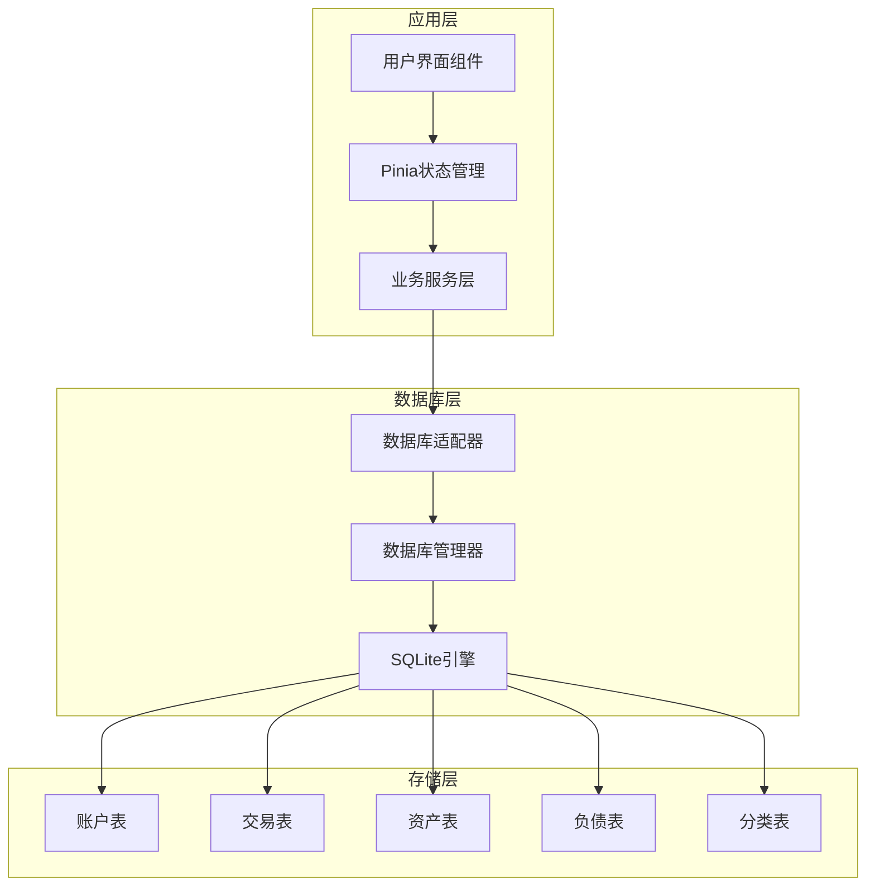
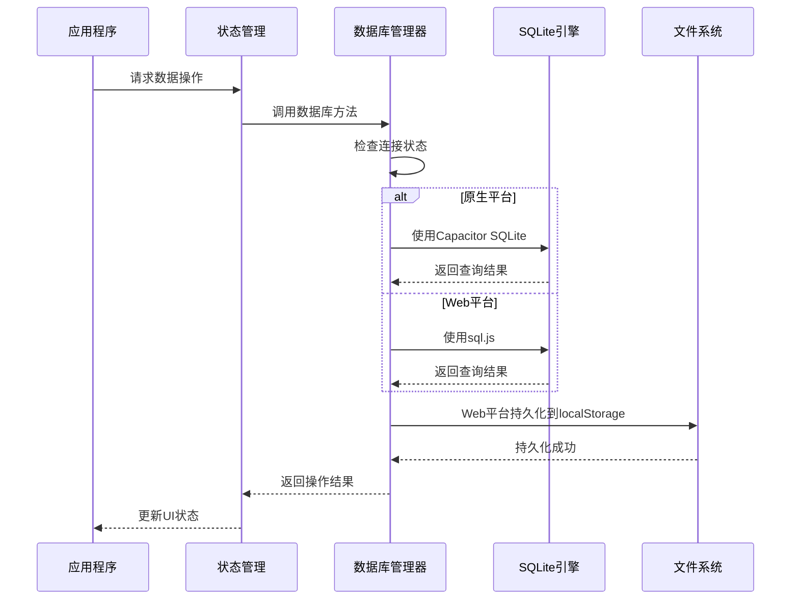
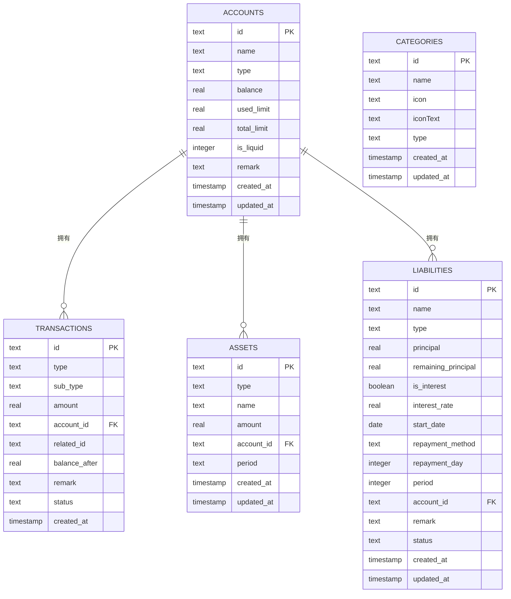
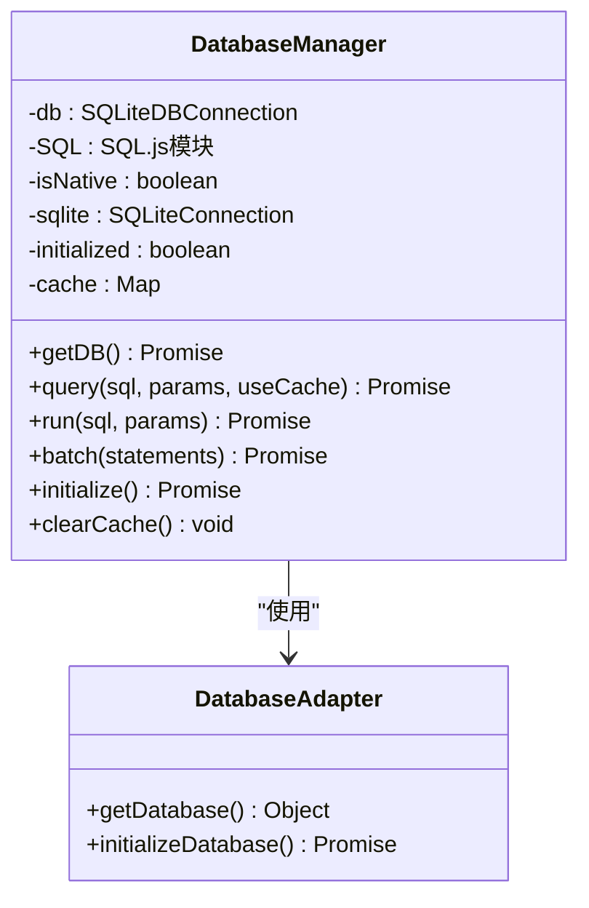
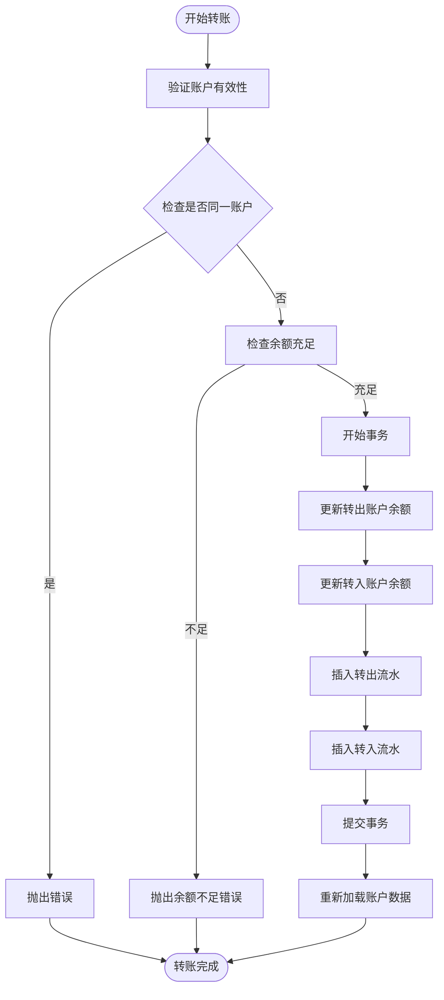
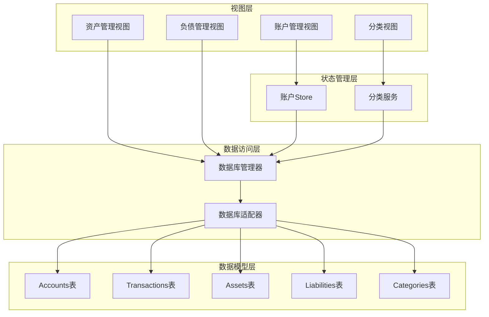
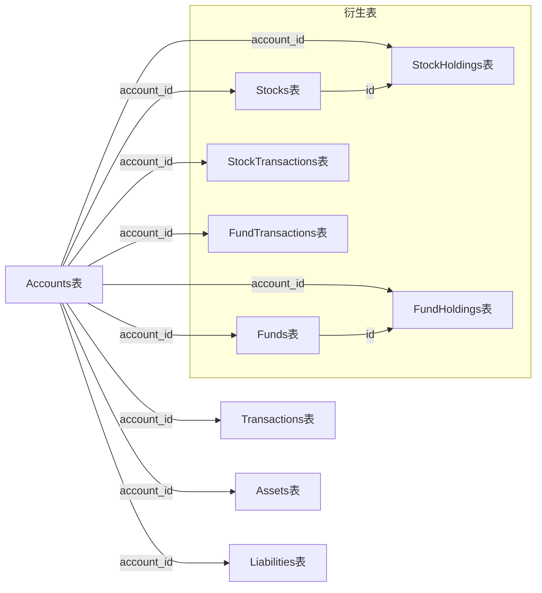

# 数据库设计

<cite>
**本文档引用的文件**
- [src/database/index.js](file://src/database/index.js)
- [src/database/adapter.js](file://src/database/adapter.js)
- [src/stores/account.ts](file://src/stores/account.ts)
- [src/data/categories.ts](file://src/data/categories.ts)
- [src/services/categoryService.ts](file://src/services/categoryService.ts)
- [src/components/mobile/account/AccountManagement.vue](file://src/components/mobile/account/AccountManagement.vue)
- [src/components/mobile/asset/AssetManagement.vue](file://src/components/mobile/asset/AssetManagement.vue)
- [src/components/mobile/liability/LiabilityManagement.vue](file://src/components/mobile/liability/LiabilityManagement.vue)
</cite>

## 目录
1. [简介](#简介)
2. [项目结构](#项目结构)
3. [核心数据模型](#核心数据模型)
4. [架构概览](#架构概览)
5. [详细组件分析](#详细组件分析)
6. [依赖关系分析](#依赖关系分析)
7. [性能考虑](#性能考虑)
8. [故障排除指南](#故障排除指南)
9. [结论](#结论)

## 简介

本文件详细描述了财务应用程序的数据库设计。该系统采用SQLite作为核心存储引擎，支持原生移动平台（Capacitor SQLite）和Web平台（sql.js），通过统一的数据库管理器提供跨平台的数据持久化能力。系统设计遵循财务应用的核心需求，包括账户管理、交易记录、资产管理、负债管理和分类体系等关键功能模块。

## 项目结构

财务应用程序采用模块化架构，数据库层位于src/database目录下，通过适配器模式实现跨平台兼容性：

**图表来源**
- [src/database/index.js:1-935](file://src/database/index.js#L1-L935)
- [src/database/adapter.js:1-34](file://src/database/adapter.js#L1-L34)

**章节来源**
- [src/database/index.js:1-935](file://src/database/index.js#L1-L935)
- [src/database/adapter.js:1-34](file://src/database/adapter.js#L1-L34)

## 核心数据模型

### 账户表 (Accounts)

账户表是财务系统的核心实体，记录所有金融账户的基本信息和余额状态。

| 字段名 | 数据类型 | 约束条件 | 描述 |
|--------|----------|----------|------|
| id | TEXT | PRIMARY KEY | 账户唯一标识符 |
| name | TEXT | NOT NULL, UNIQUE | 账户名称 |
| type | TEXT | NOT NULL | 账户类型（现金、微信、支付宝、储蓄卡、信用卡等） |
| balance | REAL | DEFAULT 0 | 当前余额 |
| used_limit | REAL | DEFAULT 0 | 已用信用额度（信用卡专用） |
| total_limit | REAL | DEFAULT 0 | 总信用额度（信用卡专用） |
| is_liquid | INTEGER | DEFAULT 1 | 是否为流动资金（1为是，0为否） |
| remark | TEXT |  | 备注信息 |
| created_at | TIMESTAMP | DEFAULT CURRENT_TIMESTAMP | 创建时间 |
| updated_at | TIMESTAMP | DEFAULT CURRENT_TIMESTAMP | 更新时间 |

### 交易表 (Transactions)

交易表记录所有资金流动的详细信息，支持多种交易类型和状态管理。

| 字段名 | 数据类型 | 约束条件 | 描述 |
|--------|----------|----------|------|
| id | TEXT | PRIMARY KEY | 交易唯一标识符 |
| type | TEXT | NOT NULL | 交易类型（收入、支出、转账等） |
| sub_type | TEXT |  | 交易子类型 |
| amount | REAL | NOT NULL | 交易金额 |
| account_id | TEXT |  | 关联账户ID（外键） |
| related_id | TEXT |  | 关联交易ID |
| balance_after | REAL | NOT NULL | 交易后的账户余额 |
| remark | TEXT |  | 备注信息 |
| status | TEXT | DEFAULT '正常' | 交易状态 |
| created_at | TIMESTAMP | DEFAULT CURRENT_TIMESTAMP | 交易时间 |
| account_id | TEXT | FOREIGN KEY(accounts.id) | 外键约束 |

### 资产表 (Assets)

资产表管理非流动性资产，如房产、车辆、收藏品等。

| 字段名 | 数据类型 | 约束条件 | 描述 |
|--------|----------|----------|------|
| id | TEXT | PRIMARY KEY | 资产唯一标识符 |
| type | TEXT | NOT NULL | 资产类型 |
| name | TEXT | NOT NULL | 资产名称 |
| amount | REAL | DEFAULT 0 | 资产价值 |
| account_id | TEXT |  | 关联账户ID |
| period | TEXT |  | 折旧周期 |
| created_at | TIMESTAMP | DEFAULT CURRENT_TIMESTAMP | 创建时间 |
| updated_at | TIMESTAMP | DEFAULT CURRENT_TIMESTAMP | 更新时间 |
| account_id | TEXT | FOREIGN KEY(accounts.id) | 外键约束 |

### 负债表 (Liabilities)

负债表记录个人或企业的各种债务和欠款。

| 字段名 | 数据类型 | 约束条件 | 描述 |
|--------|----------|----------|------|
| id | TEXT | PRIMARY KEY | 负债唯一标识符 |
| name | TEXT | NOT NULL | 负债名称 |
| type | TEXT | NOT NULL | 负债类型（房贷、车贷、信用卡等） |
| principal | REAL | NOT NULL | 本金金额 |
| remaining_principal | REAL | NOT NULL | 剩余本金 |
| is_interest | BOOLEAN | DEFAULT 1 | 是否计息 |
| interest_rate | REAL | DEFAULT 0 | 年化利率 |
| start_date | DATE | NOT NULL | 开始日期 |
| repayment_method | TEXT | NOT NULL | 还款方式（等额本息、等额本金等） |
| repayment_day | INTEGER |  | 还款日 |
| period | INTEGER |  | 还款期数 |
| account_id | TEXT |  | 关联账户ID |
| remark | TEXT |  | 备注信息 |
| status | TEXT | DEFAULT '未结清' | 负债状态 |
| created_at | TIMESTAMP | DEFAULT CURRENT_TIMESTAMP | 创建时间 |
| updated_at | TIMESTAMP | DEFAULT CURRENT_TIMESTAMP | 更新时间 |
| account_id | TEXT | FOREIGN KEY(accounts.id) | 外键约束 |

### 分类表 (Categories)

分类表管理收支分类，支持自定义分类和图标。

| 字段名 | 数据类型 | 约束条件 | 描述 |
|--------|----------|----------|------|
| id | TEXT | PRIMARY KEY | 分类唯一标识符 |
| name | TEXT | NOT NULL | 分类名称 |
| icon | TEXT |  | 图标名称 |
| iconText | TEXT |  | 图标文本 |
| type | TEXT | NOT NULL | 分类类型（收入/支出） |
| created_at | TIMESTAMP | DEFAULT CURRENT_TIMESTAMP | 创建时间 |
| updated_at | TIMESTAMP | DEFAULT CURRENT_TIMESTAMP | 更新时间 |

**章节来源**
- [src/database/index.js:437-674](file://src/database/index.js#L437-L674)

## 架构概览

系统采用分层架构设计，通过数据库管理器统一处理不同平台的SQLite实现差异：

**图表来源**
- [src/database/index.js:56-190](file://src/database/index.js#L56-L190)
- [src/database/adapter.js:14-33](file://src/database/adapter.js#L14-L33)

### 外键关系图

**图表来源**
- [src/database/index.js:437-674](file://src/database/index.js#L437-L674)

## 详细组件分析

### 数据库管理器 (DatabaseManager)

数据库管理器是整个系统的数据访问层核心，实现了以下关键功能：

#### 连接管理
- 单例模式确保全局唯一连接
- 自动检测平台类型（原生/Web）
- 支持连接池管理和并发控制

#### 查询优化
- 查询结果缓存机制
- 批量操作支持
- 参数化查询防止SQL注入

#### 平台适配
- Capacitor SQLite集成（原生平台）
- sql.js集成（Web平台）
- 统一的API接口

**图表来源**
- [src/database/index.js:21-374](file://src/database/index.js#L21-L374)
- [src/database/adapter.js:14-33](file://src/database/adapter.js#L14-L33)

**章节来源**
- [src/database/index.js:21-374](file://src/database/index.js#L21-L374)
- [src/database/adapter.js:14-33](file://src/database/adapter.js#L14-L33)

### 账户管理 (Account Management)

账户管理模块提供了完整的账户生命周期管理：

#### 核心功能
- 账户创建、读取、更新、删除
- 余额调整和内部转账
- 账户分类和状态管理

#### 业务逻辑

**图表来源**
- [src/stores/account.ts:191-270](file://src/stores/account.ts#L191-L270)

**章节来源**
- [src/stores/account.ts:1-273](file://src/stores/account.ts#L1-L273)

### 分类管理 (Category Management)

分类系统支持动态扩展和自定义：

#### 分类服务功能
- 动态分类创建和管理
- 默认分类初始化
- 分类数据合并策略

#### 数据一致性
- 原有分类优先策略
- ID去重机制
- 类型过滤功能

**章节来源**
- [src/services/categoryService.ts:1-260](file://src/services/categoryService.ts#L1-L260)
- [src/data/categories.ts:1-45](file://src/data/categories.ts#L1-L45)

## 依赖关系分析

### 组件间依赖

**图表来源**
- [src/components/mobile/account/AccountManagement.vue:158-340](file://src/components/mobile/account/AccountManagement.vue#L158-L340)
- [src/components/mobile/asset/AssetManagement.vue:75-183](file://src/components/mobile/asset/AssetManagement.vue#L75-L183)
- [src/components/mobile/liability/LiabilityManagement.vue:205-283](file://src/components/mobile/liability/LiabilityManagement.vue#L205-L283)

### 外键约束关系

系统通过外键约束确保数据完整性：

**图表来源**
- [src/database/index.js:454-601](file://src/database/index.js#L454-L601)

**章节来源**
- [src/database/index.js:454-601](file://src/database/index.js#L454-L601)

## 性能考虑

### 索引优化策略

系统为高频查询字段建立了专门的索引：

| 索引名称 | 目标表 | 字段 | 查询场景 |
|----------|--------|------|----------|
| idx_accounts_type | accounts | type | 账户类型筛选 |
| idx_accounts_is_liquid | accounts | is_liquid | 流动资金筛选 |
| idx_transactions_account_id | transactions | account_id | 账户交易历史 |
| idx_transactions_created_at | transactions | created_at | 时间范围查询 |
| idx_assets_account_id | assets | account_id | 资产归属查询 |
| idx_liabilities_account_id | liabilities | account_id | 负债归属查询 |
| idx_liabilities_status | liabilities | status | 负债状态统计 |
| idx_categories_type | categories | type | 分类类型筛选 |

### 缓存机制

- 查询结果缓存：避免重复查询相同SQL
- LRU缓存策略：自动清理不常用结果
- 缓存失效：数据变更时自动清除相关缓存

### 批处理优化

- 批量插入：减少数据库往返次数
- 事务批量：确保数据一致性
- 异步持久化：Web平台数据保存

## 故障排除指南

### 常见问题及解决方案

#### 连接问题
- **症状**：数据库连接失败
- **原因**：平台检测错误或权限问题
- **解决**：检查Capacitor配置和SQLite插件安装

#### 数据同步问题
- **症状**：Web平台数据丢失
- **原因**：localStorage存储限制
- **解决**：定期备份重要数据，检查存储空间

#### 外键约束错误
- **症状**：删除账户时报外键约束错误
- **原因**：存在关联的交易或资产记录
- **解决**：先删除关联数据，再删除主记录

**章节来源**
- [src/database/index.js:793-808](file://src/database/index.js#L793-L808)

## 结论

该财务应用程序的数据库设计充分考虑了现代财务应用的需求特点，通过合理的数据模型设计、完善的外键约束和性能优化策略，为用户提供了一个稳定可靠的财务管理平台。系统支持多平台部署，具有良好的扩展性和维护性，能够满足个人和小型团队的财务管理需求。

通过模块化的架构设计和清晰的职责分离，系统在保证功能完整性的同时，也为未来的功能扩展和技术升级奠定了坚实的基础。