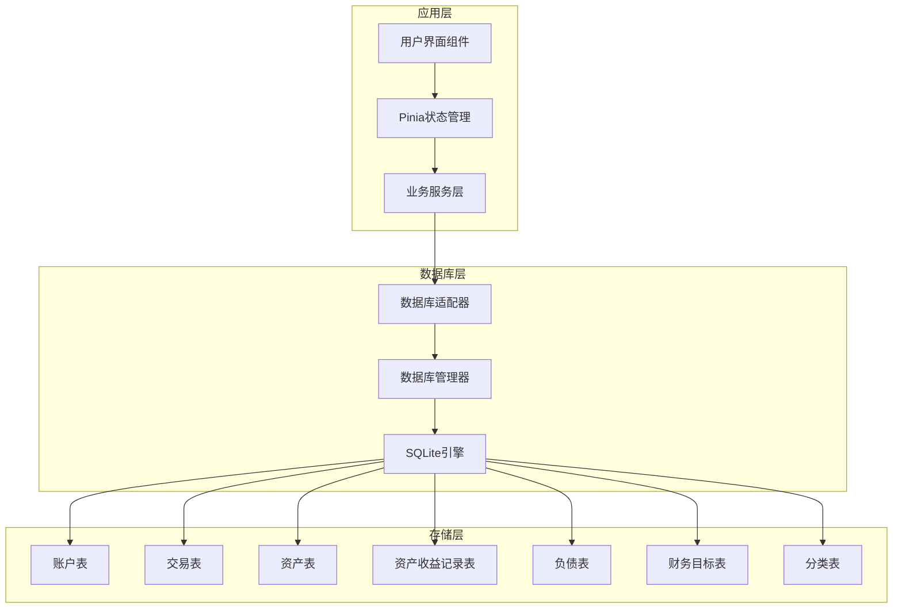
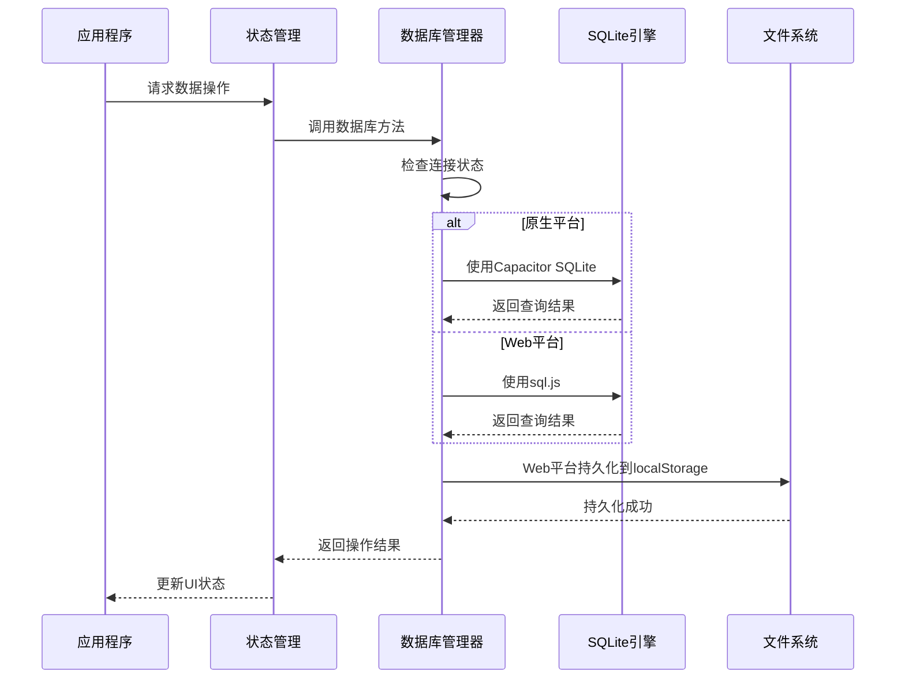
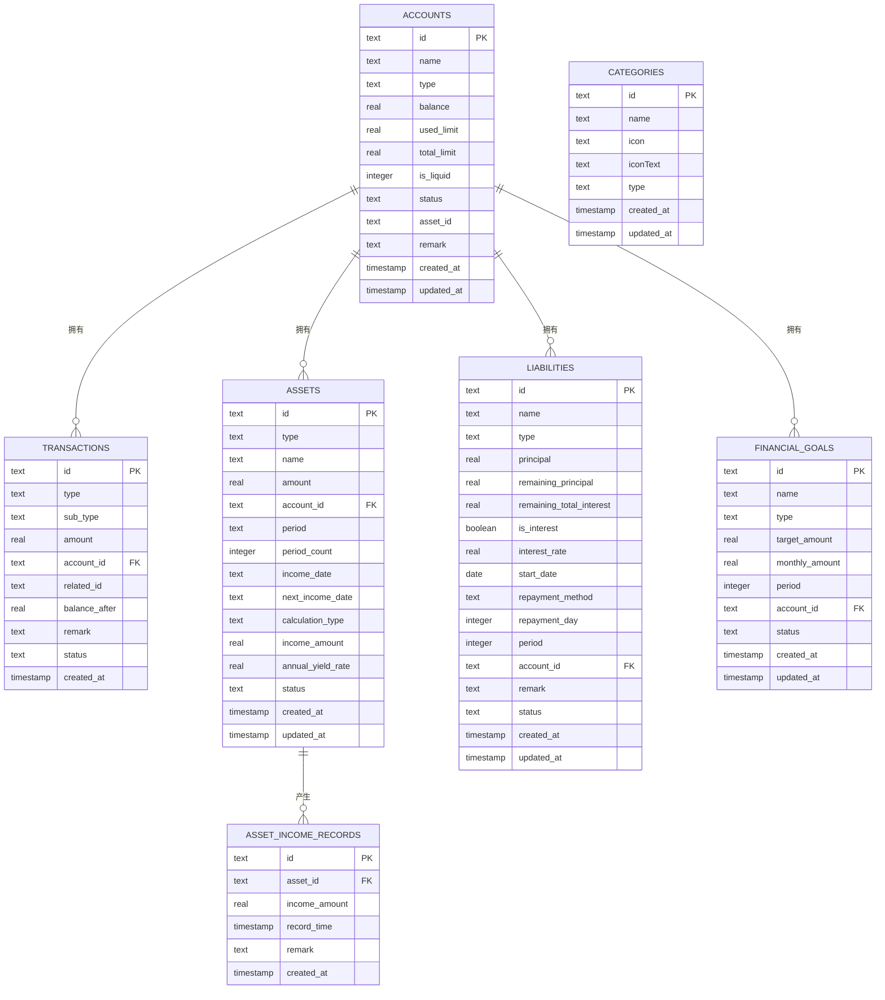
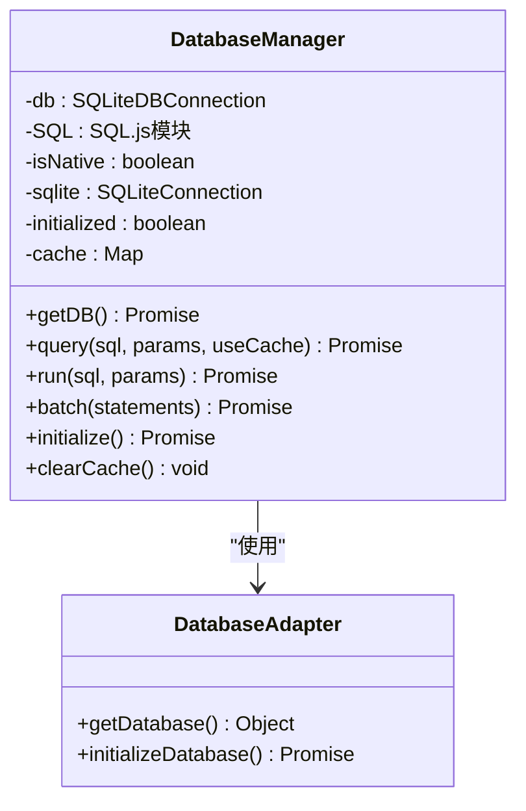
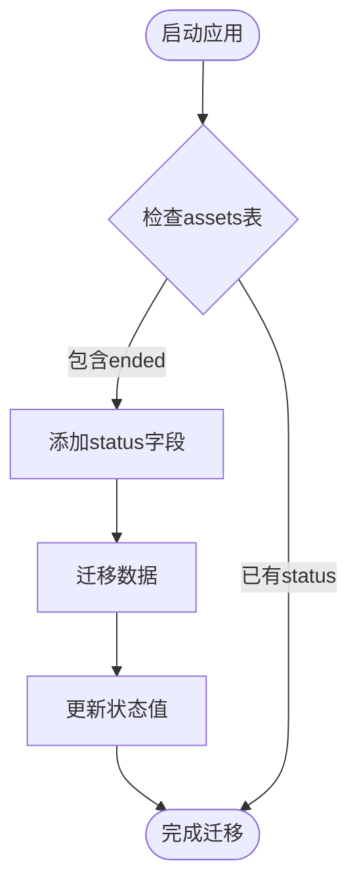
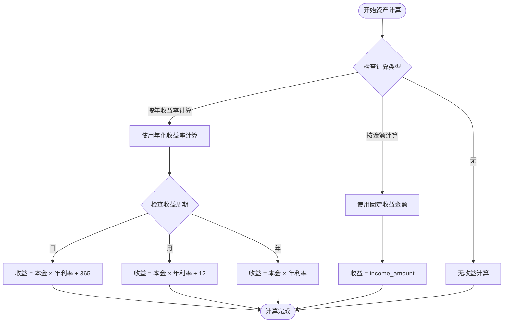
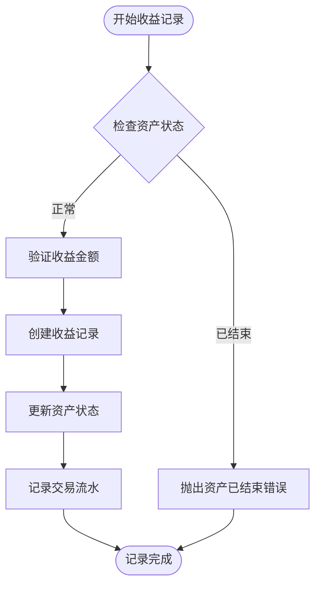
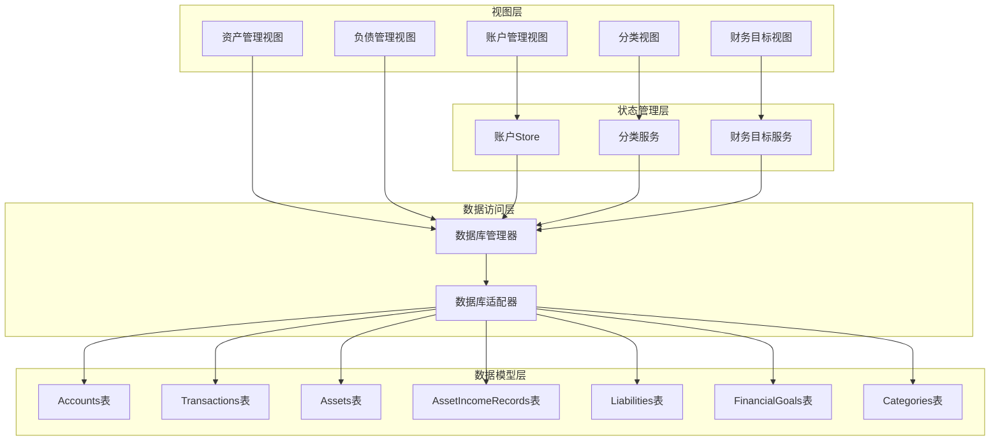
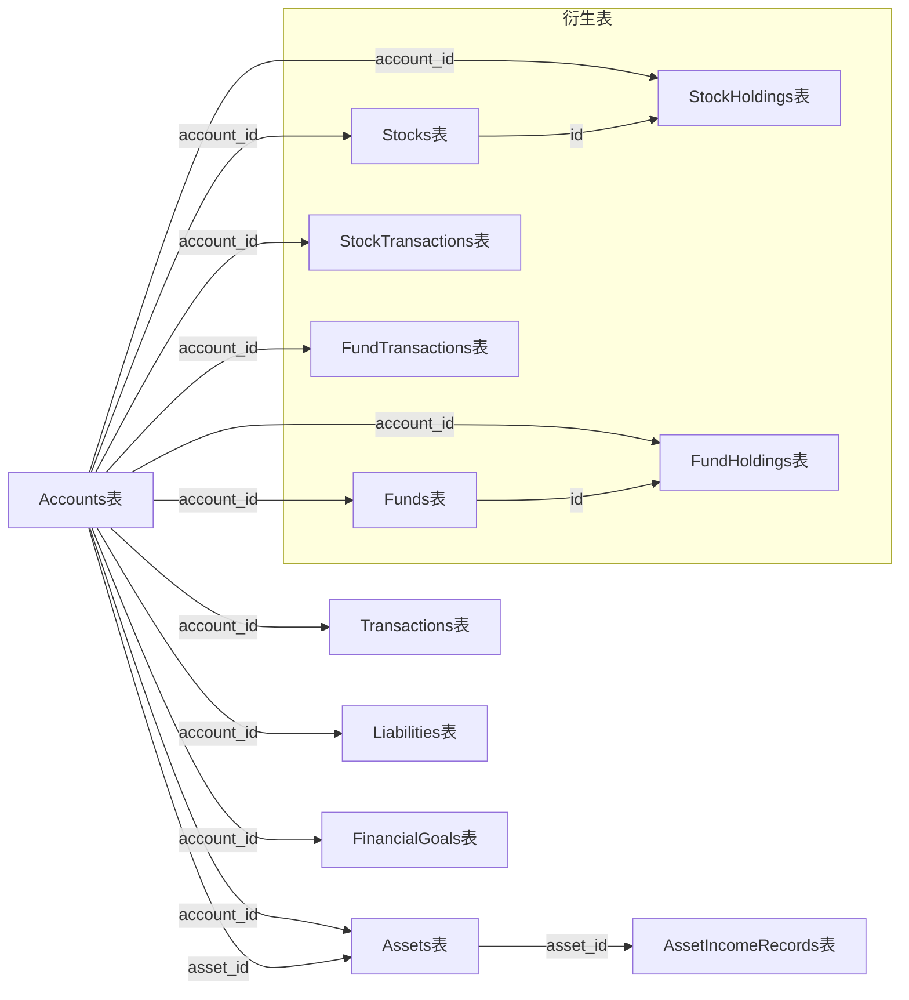

# 数据库设计

<cite>
**本文档引用的文件**
- [src/database/index.js](file://src/database/index.js)
- [src/database/adapter.js](file://src/database/adapter.js)
- [src/stores/account.ts](file://src/stores/account.ts)
- [src/data/categories.ts](file://src/data/categories.ts)
- [src/services/categoryService.ts](file://src/services/categoryService.ts)
- [src/components/mobile/account/AccountManagement.vue](file://src/components/mobile/account/AccountManagement.vue)
- [src/components/mobile/asset/AssetManagement.vue](file://src/components/mobile/asset/AssetManagement.vue)
- [src/components/mobile/asset/AddAssetPage.vue](file://src/components/mobile/asset/AddAssetPage.vue)
- [src/components/mobile/asset/AssetDetailPage.vue](file://src/components/mobile/asset/AssetDetailPage.vue)
- [src/components/mobile/liability/LiabilityManagement.vue](file://src/components/mobile/liability/LiabilityManagement.vue)
- [src/services/asset/assetService.ts](file://src/services/asset/assetService.ts)
- [src/types/asset/asset.ts](file://src/types/asset/asset.ts)
- [src/utils/dictionaries.ts](file://src/utils/dictionaries.ts)
- [update.js](file://update.js)
</cite>

## 更新摘要
**变更内容**
- 数据库架构重大升级：从简单的integer-ended标志迁移到TEXT状态字段系统
- 新增状态枚举值'开启'、'暂停'、'结束'，支持更灵活的资产状态管理
- 完整的迁移脚本以转换现有数据，确保向后兼容性
- 多个表采用统一的状态字段设计，包括账户、资产、负债、财务目标等
- 增强的数据完整性约束和状态一致性保证

## 目录
1. [简介](#简介)
2. [项目结构](#项目结构)
3. [核心数据模型](#核心数据模型)
4. [架构概览](#架构概览)
5. [详细组件分析](#详细组件分析)
6. [依赖关系分析](#依赖关系分析)
7. [性能考虑](#性能考虑)
8. [故障排除指南](#故障排除指南)
9. [结论](#结论)

## 简介

本文件详细描述了财务应用程序的数据库设计。该系统采用SQLite作为核心存储引擎，支持原生移动平台（Capacitor SQLite）和Web平台（sql.js），通过统一的数据库管理器提供跨平台的数据持久化能力。系统设计遵循财务应用的核心需求，包括账户管理、交易记录、资产管理、负债管理和分类体系等关键功能模块。

**更新** 本次更新反映了数据库架构的重大变更，从简单的integer-ended标志迁移到TEXT状态字段系统，新增了更灵活的状态管理机制，支持'开启'、'暂停'、'结束'等状态枚举值，使系统能够更好地管理复杂的财务状态变化。

## 项目结构

财务应用程序采用模块化架构，数据库层位于src/database目录下，通过适配器模式实现跨平台兼容性：

**图表来源**
- [src/database/index.js:1-1049](file://src/database/index.js#L1-L1049)
- [src/database/adapter.js:1-34](file://src/database/adapter.js#L1-L34)

**章节来源**
- [src/database/index.js:1-1049](file://src/database/index.js#L1-L1049)
- [src/database/adapter.js:1-34](file://src/database/adapter.js#L1-L34)

## 核心数据模型

### 账户表 (Accounts)

账户表是财务系统的核心实体，记录所有金融账户的基本信息和余额状态。

| 字段名 | 数据类型 | 约束条件 | 描述 |
|--------|----------|----------|------|
| id | TEXT | PRIMARY KEY | 账户唯一标识符 |
| name | TEXT | NOT NULL, UNIQUE | 账户名称 |
| type | TEXT | NOT NULL | 账户类型（现金、微信、支付宝、储蓄卡、信用卡等） |
| balance | REAL | DEFAULT 0 | 当前余额 |
| used_limit | REAL | DEFAULT 0 | 已用信用额度（信用卡专用） |
| total_limit | REAL | DEFAULT 0 | 总信用额度（信用卡专用） |
| is_liquid | INTEGER | DEFAULT 1 | 是否为流动资金（1为是，0为否） |
| status | TEXT | DEFAULT '启用' | 账户状态 |
| asset_id | TEXT |  | 关联资产ID |
| remark | TEXT |  | 备注信息 |
| created_at | TIMESTAMP | DEFAULT CURRENT_TIMESTAMP | 创建时间 |
| updated_at | TIMESTAMP | DEFAULT CURRENT_TIMESTAMP | 更新时间 |

### 交易表 (Transactions)

交易表记录所有资金流动的详细信息，支持多种交易类型和状态管理。

| 字段名 | 数据类型 | 约束条件 | 描述 |
|--------|----------|----------|------|
| id | TEXT | PRIMARY KEY | 交易唯一标识符 |
| type | TEXT | NOT NULL | 交易类型（收入、支出、转账等） |
| sub_type | TEXT |  | 交易子类型 |
| amount | REAL | NOT NULL | 交易金额 |
| account_id | TEXT |  | 关联账户ID（外键） |
| related_id | TEXT |  | 关联交易ID |
| balance_after | REAL | NOT NULL | 交易后的账户余额 |
| remark | TEXT |  | 备注信息 |
| status | TEXT | DEFAULT '正常' | 交易状态 |
| created_at | TIMESTAMP | DEFAULT CURRENT_TIMESTAMP | 交易时间 |
| account_id | TEXT | FOREIGN KEY(accounts.id) | 外键约束 |

### 资产表 (Assets)

资产表管理非流动性资产，如房产、车辆、收藏品等，现已增强计算能力支持和收益记录功能。

**更新** 资产表采用全新的TEXT状态字段系统，支持'开启'、'暂停'、'结束'三种状态，替代原有的integer-ended标志。

| 字段名 | 数据类型 | 约束条件 | 描述 |
|--------|----------|----------|------|
| id | TEXT | PRIMARY KEY | 资产唯一标识符 |
| type | TEXT | NOT NULL | 资产类型 |
| name | TEXT | NOT NULL | 资产名称 |
| amount | REAL | DEFAULT 0 | 资产价值 |
| account_id | TEXT |  | 关联账户ID |
| period | TEXT |  | 收益周期（年/月/日） |
| period_count | INTEGER | DEFAULT 0 | 周期数量 |
| income_date | TEXT |  | 收益日期（格式：MM-DD或DD） |
| next_income_date | TEXT |  | 下次收益日期 |
| calculation_type | TEXT |  | 计算类型（无/按金额计算/按年收益率计算） |
| income_amount | REAL | DEFAULT 0 | 每期收益金额 |
| annual_yield_rate | REAL | DEFAULT 0 | 年化收益率 |
| status | TEXT | DEFAULT '开启' | 资产状态（开启/暂停/结束） |
| created_at | TIMESTAMP | DEFAULT CURRENT_TIMESTAMP | 创建时间 |
| updated_at | TIMESTAMP | DEFAULT CURRENT_TIMESTAMP | 更新时间 |
| account_id | TEXT | FOREIGN KEY(accounts.id) | 外键约束 |

### 资产收益记录表 (AssetIncomeRecords)

**新增** 资产收益记录表用于追踪资产的历史收益情况。

| 字段名 | 数据类型 | 约束条件 | 描述 |
|--------|----------|----------|------|
| id | TEXT | PRIMARY KEY | 记录唯一标识符 |
| asset_id | TEXT | NOT NULL | 关联资产ID |
| income_amount | REAL | NOT NULL | 收益金额 |
| record_time | TIMESTAMP | NOT NULL | 记录时间 |
| remark | TEXT |  | 备注信息 |
| created_at | TIMESTAMP | DEFAULT CURRENT_TIMESTAMP | 创建时间 |
| asset_id | TEXT | FOREIGN KEY(assets.id) | 外键约束 |

### 负债表 (Liabilities)

负债表记录个人或企业的各种债务和欠款。

| 字段名 | 数据类型 | 约束条件 | 描述 |
|--------|----------|----------|------|
| id | TEXT | PRIMARY KEY | 负债唯一标识符 |
| name | TEXT | NOT NULL | 负债名称 |
| type | TEXT | NOT NULL | 负债类型（房贷、车贷、信用卡等） |
| principal | REAL | NOT NULL | 本金金额 |
| remaining_principal | REAL | NOT NULL | 剩余本金 |
| remaining_total_interest | REAL | DEFAULT 0 | 剩余总利息 |
| is_interest | BOOLEAN | DEFAULT 1 | 是否计息 |
| interest_rate | REAL | DEFAULT 0 | 年化利率 |
| start_date | DATE | NOT NULL | 开始日期 |
| repayment_method | TEXT | NOT NULL | 还款方式（等额本息、等额本金等） |
| repayment_day | INTEGER |  | 还款日 |
| period | INTEGER |  | 还款期数 |
| account_id | TEXT |  | 关联账户ID |
| remark | TEXT |  | 备注信息 |
| status | TEXT | DEFAULT '未结清' | 负债状态 |
| created_at | TIMESTAMP | DEFAULT CURRENT_TIMESTAMP | 创建时间 |
| updated_at | TIMESTAMP | DEFAULT CURRENT_TIMESTAMP | 更新时间 |
| account_id | TEXT | FOREIGN KEY(accounts.id) | 外键约束 |

### 财务目标表 (FinancialGoals)

财务目标表管理用户的财务目标和进度。

| 字段名 | 数据类型 | 约束条件 | 描述 |
|--------|----------|----------|------|
| id | TEXT | PRIMARY KEY | 目标唯一标识符 |
| name | TEXT | NOT NULL | 目标名称 |
| type | TEXT | NOT NULL | 目标类型（储蓄类、还款类、投资类、应急金类） |
| target_amount | REAL | NOT NULL | 目标金额 |
| monthly_amount | REAL | NOT NULL | 每月投入金额 |
| period | INTEGER | NOT NULL | 实现期限（月） |
| account_id | TEXT |  | 关联账户ID |
| status | TEXT | DEFAULT '未开始' | 目标状态 |
| created_at | TIMESTAMP | DEFAULT CURRENT_TIMESTAMP | 创建时间 |
| updated_at | TIMESTAMP | DEFAULT CURRENT_TIMESTAMP | 更新时间 |
| account_id | TEXT | FOREIGN KEY(accounts.id) | 外键约束 |

### 分类表 (Categories)

分类表管理收支分类，支持自定义分类和图标。

| 字段名 | 数据类型 | 约束条件 | 描述 |
|--------|----------|----------|------|
| id | TEXT | PRIMARY KEY | 分类唯一标识符 |
| name | TEXT | NOT NULL | 分类名称 |
| icon | TEXT |  | 图标名称 |
| iconText | TEXT |  | 图标文本 |
| type | TEXT | NOT NULL | 分类类型（收入/支出） |
| created_at | TIMESTAMP | DEFAULT CURRENT_TIMESTAMP | 创建时间 |
| updated_at | TIMESTAMP | DEFAULT CURRENT_TIMESTAMP | 更新时间 |

**章节来源**
- [src/database/index.js:446-516](file://src/database/index.js#L446-L516)
- [src/database/index.js:500-717](file://src/database/index.js#L500-L717)

## 架构概览

系统采用分层架构设计，通过数据库管理器统一处理不同平台的SQLite实现差异：

**图表来源**
- [src/database/index.js:56-190](file://src/database/index.js#L56-L190)
- [src/database/adapter.js:14-33](file://src/database/adapter.js#L14-L33)

### 外键关系图

**图表来源**
- [src/database/index.js:446-516](file://src/database/index.js#L446-L516)
- [src/database/index.js:500-717](file://src/database/index.js#L500-L717)

## 详细组件分析

### 数据库管理器 (DatabaseManager)

数据库管理器是整个系统的数据访问层核心，实现了以下关键功能：

#### 连接管理
- 单例模式确保全局唯一连接
- 自动检测平台类型（原生/Web）
- 支持连接池管理和并发控制

#### 查询优化
- 查询结果缓存机制
- 批量操作支持
- 参数化查询防止SQL注入

#### 平台适配
- Capacitor SQLite集成（原生平台）
- sql.js集成（Web平台）
- 统一的API接口

**图表来源**
- [src/database/index.js:21-374](file://src/database/index.js#L21-L374)
- [src/database/adapter.js:14-33](file://src/database/adapter.js#L14-L33)

**章节来源**
- [src/database/index.js:21-374](file://src/database/index.js#L21-L374)
- [src/database/adapter.js:14-33](file://src/database/adapter.js#L14-L33)

### 状态字段系统 (State Field System)

**更新** 系统采用全新的TEXT状态字段设计，替代原有的integer-ended标志，提供更灵活的状态管理。

#### 状态字段设计原则
- 统一的状态枚举值：'开启'、'暂停'、'结束'
- 向后兼容性：自动迁移现有数据
- 业务一致性：确保状态转换的合理性

#### 状态迁移机制

**图表来源**
- [src/database/index.js:870-879](file://src/database/index.js#L870-L879)

#### 状态枚举值定义

| 表名 | 字段 | 状态值 | 描述 |
|------|------|--------|------|
| accounts | status | '启用' | 账户正常可用 |
| transactions | status | '正常' | 交易正常进行 |
| assets | status | '开启' | 资产正常产生收益 |
| assets | status | '暂停' | 资产暂停收益计算 |
| assets | status | '结束' | 资产收益结束 |
| liabilities | status | '未结清' | 负债尚未还清 |
| financial_goals | status | '未开始' | 目标尚未开始 |
| financial_goals | status | '进行中' | 目标正在执行 |
| financial_goals | status | '已完成' | 目标已达成 |
| financial_goals | status | '已终止' | 目标已终止 |

**章节来源**
- [src/database/index.js:870-879](file://src/database/index.js#L870-L879)
- [src/utils/dictionaries.ts:86-114](file://src/utils/dictionaries.ts#L86-L114)

### 资产管理系统 (Asset Management System)

**更新** 新增了完整的资产计算能力支持和收益记录功能，包括两种计算模式和相关的业务逻辑。

#### 核心功能
- 资产创建、读取、更新、删除
- 收益计算能力（按金额计算/按年收益率计算）
- 收益周期管理
- 资产状态跟踪
- 收益记录追踪

#### 计算逻辑
系统支持三种资产收益计算模式：

1. **无计算**：不进行收益计算
2. **按金额计算**：每期固定收益金额
3. **按年收益率计算**：基于资产价值和年化收益率计算收益

**图表来源**
- [src/services/asset/assetService.ts:56-83](file://src/services/asset/assetService.ts#L56-L83)

#### 收益记录功能
**新增** 系统现在支持资产收益记录的完整生命周期管理：

**图表来源**
- [src/services/asset/assetService.ts:249-260](file://src/services/asset/assetService.ts#L249-L260)

#### 业务逻辑

**图表来源**
- [src/stores/account.ts:191-270](file://src/stores/account.ts#L191-L270)

**章节来源**
- [src/services/asset/assetService.ts:1-260](file://src/services/asset/assetService.ts#L1-L260)
- [src/types/asset/asset.ts:1-40](file://src/types/asset/asset.ts#L1-L40)
- [src/components/mobile/asset/AddAssetPage.vue:1-200](file://src/components/mobile/asset/AddAssetPage.vue#L1-L200)
- [src/components/mobile/asset/AssetDetailPage.vue:1-200](file://src/components/mobile/asset/AssetDetailPage.vue#L1-L200)

### 分类管理 (Category Management)

分类系统支持动态扩展和自定义：

#### 分类服务功能
- 动态分类创建和管理
- 默认分类初始化
- 分类数据合并策略

#### 数据一致性
- 原有分类优先策略
- ID去重机制
- 类型过滤功能

**章节来源**
- [src/services/categoryService.ts:1-260](file://src/services/categoryService.ts#L1-L260)
- [src/data/categories.ts:1-45](file://src/data/categories.ts#L1-L45)

## 依赖关系分析

### 组件间依赖

**图表来源**
- [src/components/mobile/account/AccountManagement.vue:158-340](file://src/components/mobile/account/AccountManagement.vue#L158-L340)
- [src/components/mobile/asset/AssetManagement.vue:75-183](file://src/components/mobile/asset/AssetManagement.vue#L75-L183)
- [src/components/mobile/liability/LiabilityManagement.vue:205-283](file://src/components/mobile/liability/LiabilityManagement.vue#L205-L283)

### 外键约束关系

系统通过外键约束确保数据完整性：

**图表来源**
- [src/database/index.js:454-601](file://src/database/index.js#L454-L601)
- [src/database/index.js:702-717](file://src/database/index.js#L702-L717)

**章节来源**
- [src/database/index.js:454-601](file://src/database/index.js#L454-L601)
- [src/database/index.js:702-717](file://src/database/index.js#L702-L717)

## 性能考虑

### 索引优化策略

系统为高频查询字段建立了专门的索引：

| 索引名称 | 目标表 | 字段 | 查询场景 |
|----------|--------|------|----------|
| idx_accounts_type | accounts | type | 账户类型筛选 |
| idx_accounts_is_liquid | accounts | is_liquid | 流动资金筛选 |
| idx_accounts_asset_id | accounts | asset_id | 资产关联查询 |
| idx_transactions_account_id | transactions | account_id | 账户交易历史 |
| idx_account_transactions_account_id | account_transactions | account_id | 账户交易流水 |
| idx_transactions_created_at | transactions | created_at | 时间范围查询 |
| idx_assets_account_id | assets | account_id | 资产归属查询 |
| idx_assets_calculation_type | assets | calculation_type | 资产计算类型筛选 |
| idx_assets_status | assets | status | 资产状态筛选 |
| idx_asset_income_records_asset_id | asset_income_records | asset_id | 资产收益记录查询 |
| idx_asset_income_records_record_time | asset_income_records | record_time | 收益时间排序 |
| idx_liabilities_account_id | liabilities | account_id | 负债归属查询 |
| idx_liabilities_status | liabilities | status | 负债状态统计 |
| idx_financial_goals_account_id | financial_goals | account_id | 目标归属查询 |
| idx_financial_goals_status | financial_goals | status | 目标状态统计 |
| idx_categories_type | categories | type | 分类类型筛选 |

**更新** 新增了资产状态索引，优化状态查询性能。

### 缓存机制

- 查询结果缓存：避免重复查询相同SQL
- LRU缓存策略：自动清理不常用结果
- 缓存失效：数据变更时自动清除相关缓存

### 批处理优化

- 批量插入：减少数据库往返次数
- 事务批量：确保数据一致性
- 异步持久化：Web平台数据保存

## 故障排除指南

### 常见问题及解决方案

#### 连接问题
- **症状**：数据库连接失败
- **原因**：平台检测错误或权限问题
- **解决**：检查Capacitor配置和SQLite插件安装

#### 数据同步问题
- **症状**：Web平台数据丢失
- **原因**：localStorage存储限制
- **解决**：定期备份重要数据，检查存储空间

#### 外键约束错误
- **症状**：删除账户时报外键约束错误
- **原因**：存在关联的交易或资产记录
- **解决**：先删除关联数据，再删除主记录

#### 状态字段迁移错误
- **症状**：资产状态显示异常
- **原因**：迁移过程失败或数据损坏
- **解决**：重新初始化数据库，检查迁移脚本执行

#### 资产计算错误
- **症状**：资产收益计算异常
- **原因**：计算类型或参数配置错误
- **解决**：检查calculation_type、income_amount、annual_yield_rate字段设置

#### 收益记录错误
- **症状**：资产收益记录失败
- **原因**：资产ID无效或收益金额错误
- **解决**：验证资产存在性，检查收益金额格式

**章节来源**
- [src/database/index.js:793-808](file://src/database/index.js#L793-L808)

## 结论

该财务应用程序的数据库设计充分考虑了现代财务应用的需求特点，通过合理的数据模型设计、完善的外键约束和性能优化策略，为用户提供了一个稳定可靠的财务管理平台。

**更新** 本次更新显著增强了系统的状态管理能力，通过全新的TEXT状态字段系统和完整的迁移机制，系统现在能够支持更灵活的状态管理场景。新增的'开启'、'暂停'、'结束'状态枚举值为资产状态管理提供了更精确的控制，而向后兼容的迁移脚本确保了现有数据的平滑过渡。同时，多个表采用统一的状态字段设计，提高了系统的整体一致性和可维护性。

系统支持多平台部署，具有良好的扩展性和维护性，能够满足个人和小型团队的财务管理需求。通过模块化的架构设计和清晰的职责分离，系统在保证功能完整性的同时，也为未来的功能扩展和技术升级奠定了坚实的基础。