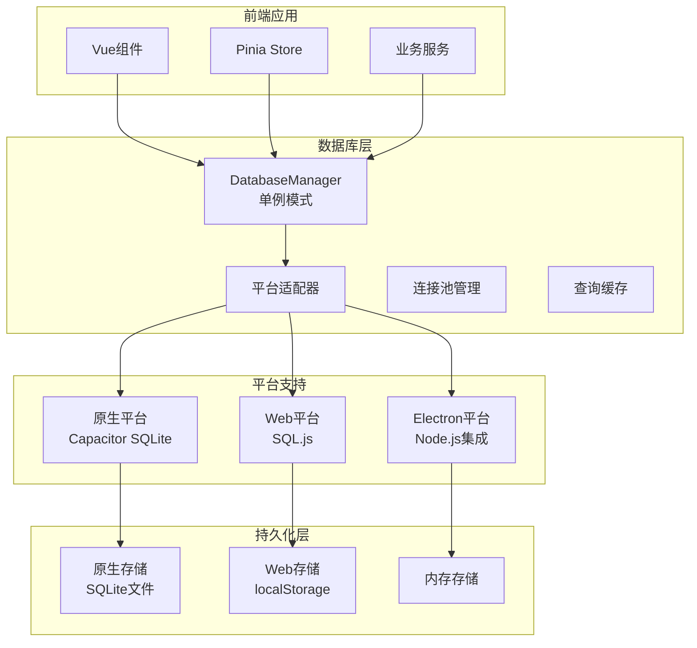
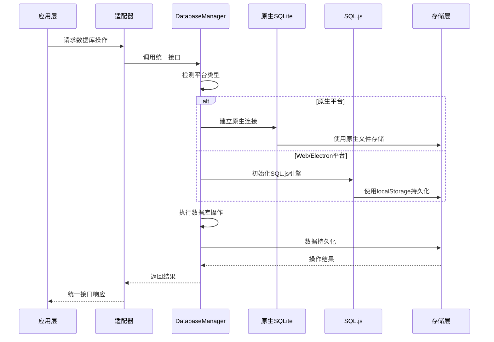
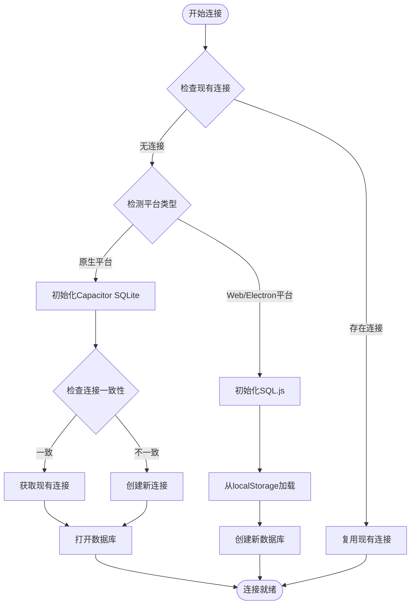
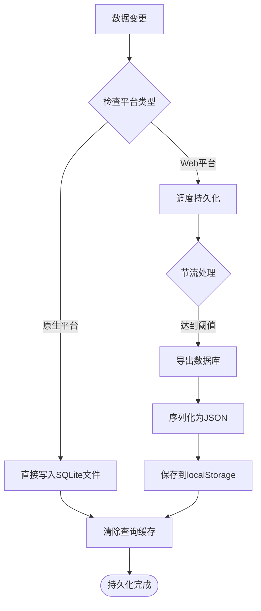

# 跨平台支持

<cite>
**本文档引用的文件**
- [src/database/index.js](file://src/database/index.js)
- [src/database/adapter.js](file://src/database/adapter.js)
- [src/components/mobile/DatabaseViewer.vue](file://src/components/mobile/DatabaseViewer.vue)
- [src/stores/account.ts](file://src/stores/account.ts)
- [src/services/categoryService.ts](file://src/services/categoryService.ts)
- [electron/main.js](file://electron/main.js)
- [electron/preload.js](file://electron/preload.js)
- [capacitor.config.json](file://capacitor.config.json)
- [package.json](file://package.json)
</cite>

## 目录
1. [简介](#简介)
2. [项目结构](#项目结构)
3. [核心组件](#核心组件)
4. [架构概览](#架构概览)
5. [详细组件分析](#详细组件分析)
6. [依赖关系分析](#依赖关系分析)
7. [性能考虑](#性能考虑)
8. [故障排除指南](#故障排除指南)
9. [结论](#结论)
10. [附录](#附录)

## 简介

本项目实现了跨平台数据库支持，通过统一的数据库抽象层同时支持原生平台（Capacitor SQLite）和Web平台（SQL.js）。该系统提供了完整的数据持久化解决方案，包括数据库连接管理、事务处理、查询缓存、性能优化等功能，确保在不同平台间的一致性和可靠性。

## 项目结构

项目采用模块化架构，数据库相关的核心文件位于 `src/database/` 目录下，配合Vue组件和Electron主进程实现完整的跨平台支持。



**图表来源**
- [src/database/index.js:21-32](file://src/database/index.js#L21-L32)
- [src/database/adapter.js:7-24](file://src/database/adapter.js#L7-L24)

**章节来源**
- [src/database/index.js:1-100](file://src/database/index.js#L1-L100)
- [src/database/adapter.js:1-34](file://src/database/adapter.js#L1-L34)

## 核心组件

### DatabaseManager 类

DatabaseManager 是整个数据库系统的中心控制器，实现了单例模式和完整的数据库生命周期管理。

**主要特性：**
- 自动平台检测和适配
- 连接池管理和并发控制
- 查询缓存机制
- 事务处理支持
- 数据持久化管理

**关键属性：**
- `db`: 当前数据库连接实例
- `SQL`: SQL.js 引擎实例
- `isNative`: 平台检测标志
- `sqlite`: Capacitor SQLite 连接管理器
- `cache`: 查询结果缓存
- `saveTimer`: Web平台持久化定时器

**章节来源**
- [src/database/index.js:21-32](file://src/database/index.js#L21-L32)
- [src/database/index.js:12-18](file://src/database/index.js#L12-L18)

### 平台适配器

平台适配器负责根据运行环境选择合适的数据库实现，支持原生平台、Web平台和Electron平台。

**平台检测机制：**
- 使用 `Capacitor.isNativePlatform()` 进行实时检测
- 动态加载相应的数据库驱动
- 统一的API接口保证平台无关性

**章节来源**
- [src/database/adapter.js:7-24](file://src/database/adapter.js#L7-L24)

## 架构概览

系统采用分层架构设计，通过统一的接口层屏蔽底层平台差异。



**图表来源**
- [src/database/index.js:56-190](file://src/database/index.js#L56-L190)
- [src/database/adapter.js:14-24](file://src/database/adapter.js#L14-L24)

## 详细组件分析

### 数据库连接管理

DatabaseManager 实现了智能的连接管理策略，确保在不同平台间的最佳性能。

#### 连接建立流程



**图表来源**
- [src/database/index.js:80-190](file://src/database/index.js#L80-L190)

#### 参数绑定和结果处理

系统实现了跨平台的参数绑定和结果处理机制，确保SQL语句在不同平台间的一致行为。

**参数绑定策略：**
- 原生平台使用位置参数绑定
- Web平台使用SQL.js的参数绑定机制
- 统一的参数验证和类型转换

**结果处理机制：**
- 自动转换查询结果为标准对象格式
- 支持复杂数据类型的序列化和反序列化
- 结果缓存优化查询性能

**章节来源**
- [src/database/index.js:214-264](file://src/database/index.js#L214-L264)
- [src/database/index.js:272-309](file://src/database/index.js#L272-L309)

### 数据持久化策略

系统实现了多层次的数据持久化策略，根据不同平台的特点采用最优的存储方案。

#### 原生平台持久化

原生平台使用SQLite文件进行数据持久化，具有以下特点：
- 高性能的文件系统存储
- 完整的ACID事务支持
- 良好的数据完整性保障
- 支持复杂的查询和索引

#### Web平台持久化

Web平台使用localStorage进行数据持久化：
- 基于浏览器的本地存储
- 支持跨会话数据保留
- 自动节流机制防止频繁写入
- JSON序列化存储二进制数据

#### 持久化流程



**图表来源**
- [src/database/index.js:379-408](file://src/database/index.js#L379-L408)

**章节来源**
- [src/database/index.js:379-408](file://src/database/index.js#L379-L408)

### 查询缓存机制

系统实现了智能的查询缓存机制，显著提升查询性能。

**缓存策略：**
- 基于SQL语句和参数的组合键
- LRU缓存淘汰算法
- 自动缓存失效机制
- 缓存命中率统计

**缓存管理：**
- 查询前检查缓存命中
- 执行后更新缓存内容
- 数据变更时清理相关缓存
- 手动缓存清空接口

**章节来源**
- [src/database/index.js:200-209](file://src/database/index.js#L200-L209)
- [src/database/index.js:413-415](file://src/database/index.js#L413-L415)

### 事务处理和并发控制

系统提供了完整的事务处理和并发控制机制，确保数据一致性和操作原子性。

**事务支持：**
- 原生平台使用Capacitor SQLite的事务
- Web平台使用SQL.js的事务支持
- 自动事务边界管理
- 嵌套事务处理

**并发控制：**
- 连接状态检查和等待机制
- 避免重复连接尝试
- 线程安全的数据库操作
- 并发查询的隔离保护

**章节来源**
- [src/database/index.js:354-374](file://src/database/index.js#L354-L374)
- [src/database/index.js:70-76](file://src/database/index.js#L70-L76)

## 依赖关系分析

系统依赖关系清晰，各模块职责明确，耦合度低。

```mermaid
graph TB
subgraph "核心依赖"
CapacitorSQLite[@capacitor-community/sqlite]
SqlJS[sql.js]
CapacitorCore[@capacitor/core]
end
subgraph "应用层依赖"
Vue[vue]
Pinia[pinia]
ElementPlus[element-plus]
end
subgraph "开发工具"
Vite[vite]
TypeScript[typescript]
Electron[electron]
end
DatabaseManager --> CapacitorSQLite
DatabaseManager --> SqlJS
DatabaseManager --> CapacitorCore
VueComponents --> DatabaseManager
Stores --> DatabaseManager
Services --> DatabaseManager
ElectronMain --> Electron
ElectronPreload --> Electron
```

**图表来源**
- [package.json:19-36](file://package.json#L19-L36)
- [src/database/index.js:8-10](file://src/database/index.js#L8-L10)

**章节来源**
- [package.json:19-36](file://package.json#L19-L36)
- [src/database/index.js:8-10](file://src/database/index.js#L8-L10)

## 性能考虑

系统在设计时充分考虑了性能优化，采用了多种策略提升整体性能。

### 性能配置

系统提供了灵活的性能配置选项：

**性能配置参数：**
- `SAVE_THROTTLE_MS`: Web平台持久化节流时间（默认1000ms）
- `DEBUG`: 详细日志开关
- 查询缓存大小限制
- 连接池大小管理

### 优化策略

**查询优化：**
- 索引自动创建和管理
- 查询结果缓存
- 批量操作支持
- 连接池复用

**存储优化：**
- Web平台数据压缩
- 增量持久化
- 内存使用监控
- 磁盘空间管理

**网络优化：**
- 本地化数据访问
- 减少跨平台调用
- 异步操作处理
- 错误重试机制

## 故障排除指南

### 常见问题和解决方案

**数据库连接问题：**
- 检查Capacitor配置和权限
- 验证SQLite插件安装
- 确认平台检测正确性
- 查看详细的错误日志

**数据持久化问题：**
- 检查localStorage可用性
- 验证数据序列化格式
- 监控存储空间使用
- 处理存储权限问题

**性能问题：**
- 分析查询缓存命中率
- 检查索引使用情况
- 监控内存使用情况
- 优化批量操作

### 调试工具

系统提供了丰富的调试工具和状态监控：

**状态检查：**
- 数据库连接状态
- 平台类型检测
- 缓存使用情况
- 存储空间监控

**调试接口：**
- `getStatus()`: 获取数据库状态
- `clearCache()`: 清空查询缓存
- `clearAllData()`: 清空所有数据
- 详细日志输出

**章节来源**
- [src/database/index.js:826-834](file://src/database/index.js#L826-L834)
- [src/database/index.js:839-890](file://src/database/index.js#L839-L890)

## 结论

本项目的跨平台数据库支持方案通过统一的抽象层成功屏蔽了原生平台和Web平台的技术差异，实现了代码的平台无关性和功能的一致性。系统的设计充分考虑了性能优化、数据持久化、事务处理等多个方面，为财务应用这类对数据完整性要求较高的场景提供了可靠的解决方案。

通过智能的平台检测、连接管理和持久化策略，系统能够在不同环境下提供最佳的用户体验。同时，完善的错误处理和调试工具为后续的维护和优化奠定了良好的基础。

## 附录

### 配置说明

**Capacitor配置：**
- 应用ID: com.finance.app
- 应用名称: 裕安
- Web目录: dist
- 插件配置: SplashScreen, Keyboard

**依赖包：**
- @capacitor-community/sqlite: 6.0.1
- sql.js: 1.10.3
- @capacitor/core: 6.1.2

### 最佳实践

**开发建议：**
- 使用统一的数据库接口进行开发
- 合理使用查询缓存机制
- 注意平台差异和限制
- 定期备份重要数据
- 监控存储空间使用情况

**性能优化：**
- 优化SQL查询语句
- 合理使用索引
- 控制批量操作规模
- 监控内存使用情况