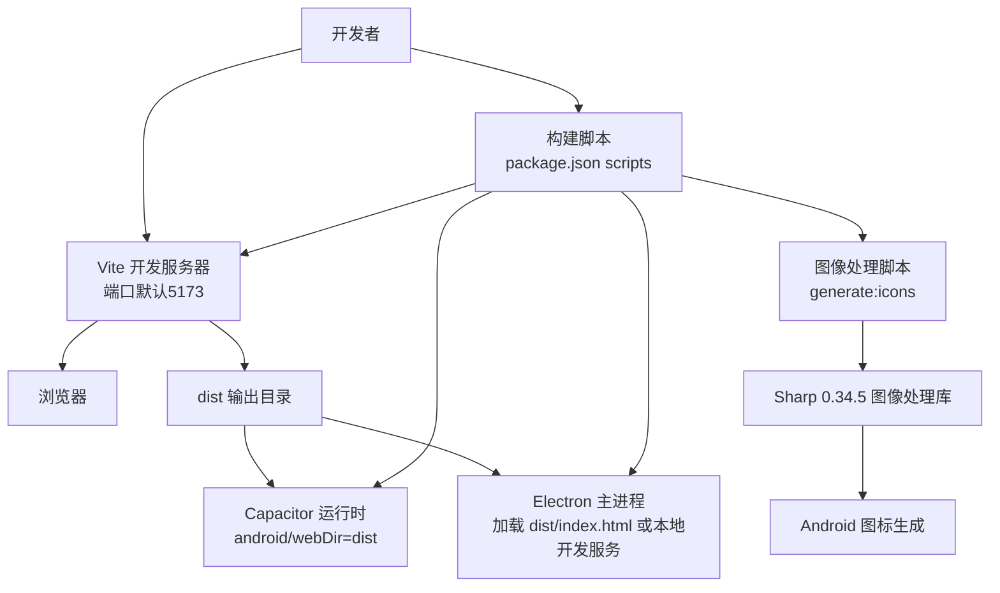
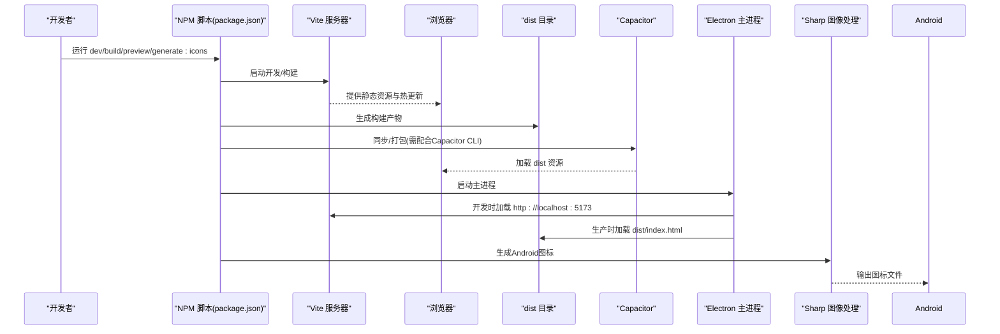
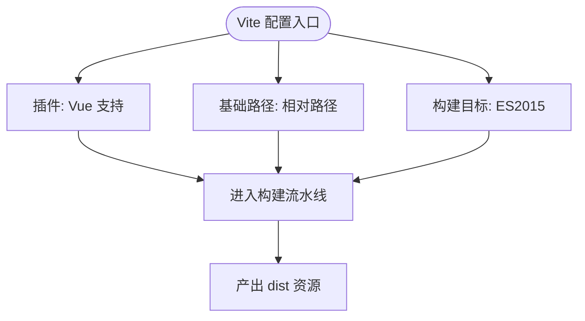
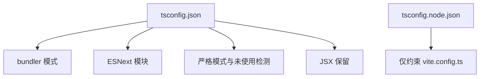
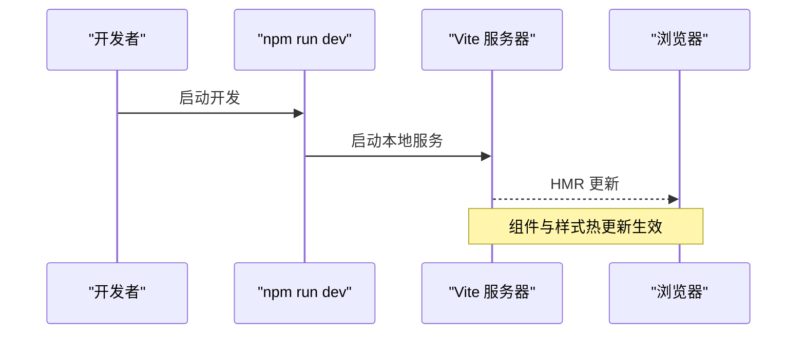
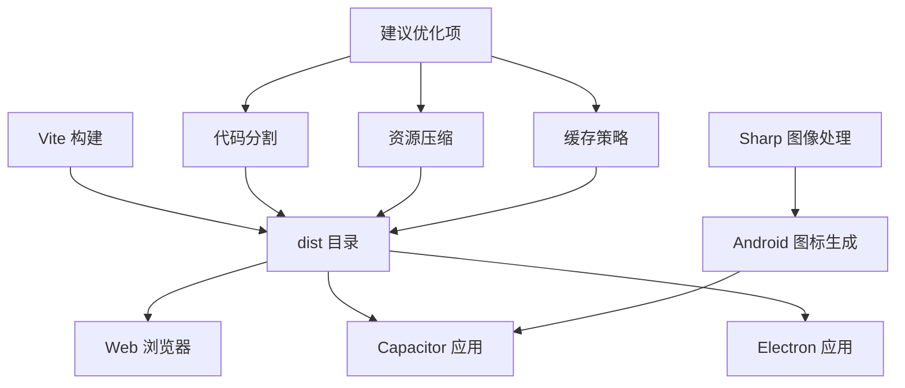
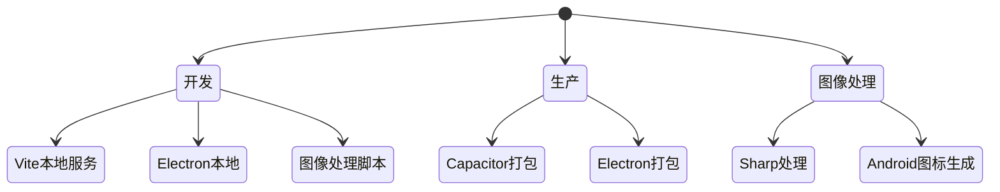
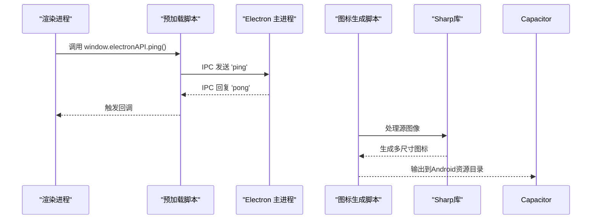
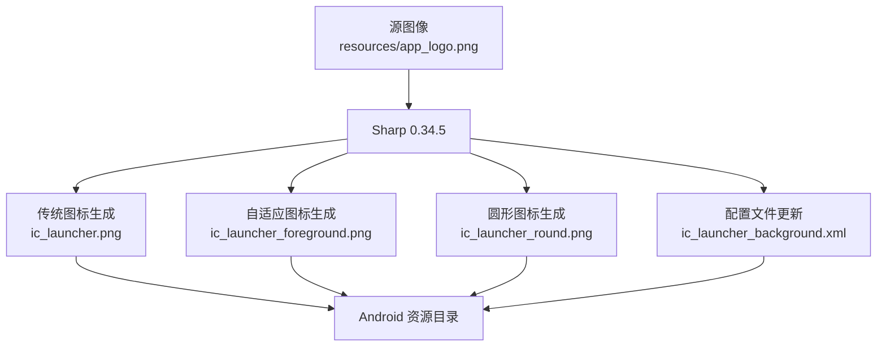
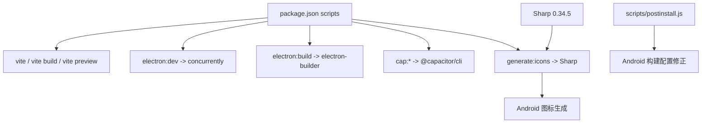

# Web构建配置

<cite>
**本文引用的文件**
- [vite.config.ts](file://vite.config.ts)
- [package.json](file://package.json)
- [tsconfig.json](file://tsconfig.json)
- [tsconfig.node.json](file://tsconfig.node.json)
- [index.html](file://index.html)
- [src/main.ts](file://src/main.ts)
- [src/App.vue](file://src/App.vue)
- [electron/main.js](file://electron/main.js)
- [electron/preload.js](file://electron/preload.js)
- [capacitor.config.json](file://capacitor.config.json)
- [scripts/postinstall.js](file://scripts/postinstall.js)
- [scripts/generate-android-icons.js](file://scripts/generate-android-icons.js)
</cite>

## 目录
1. [简介](#简介)
2. [项目结构](#项目结构)
3. [核心组件](#核心组件)
4. [架构总览](#架构总览)
5. [详细组件分析](#详细组件分析)
6. [依赖分析](#依赖分析)
7. [性能考虑](#性能考虑)
8. [故障排查指南](#故障排查指南)
9. [结论](#结论)
10. [附录](#附录)

## 简介
本文件面向财务应用程序的Web构建配置，系统化梳理Vite构建工具在本项目中的配置要点与最佳实践，覆盖插件体系、基础路径、目标浏览器兼容性、TypeScript编译配置、开发服务器参数、构建产物优化策略、多平台（Web/Electron/Capacitor）集成差异以及性能优化与调试技巧。文档以仓库现有配置为依据，避免臆测，确保可操作性与可追溯性。

**更新** 本次更新反映了项目中新增的图像处理自动化功能，包括Sharp 0.34.5库的集成和Android图标生成脚本的实现。

## 项目结构
本项目采用前端单页应用（SPA）与多平台集成的混合架构：
- Web端通过Vite进行开发与构建，产物输出至dist目录，供Capacitor与Electron使用。
- Capacitor负责将Web资源打包为原生应用（Android/iOS），并支持混合运行时。
- Electron用于桌面端运行，开发时连接Vite本地服务，生产时加载dist目录。
- 构建脚本通过package.json统一编排，涵盖Web构建、预览、Electron开发与打包、Capacitor初始化与同步等。
- **新增** 图像处理自动化：通过Sharp库实现Android应用图标的批量生成，支持传统图标和自适应图标格式。

**图表来源**
- [package.json:7-17](file://package.json#L7-L17)
- [electron/main.js:30-39](file://electron/main.js#L30-L39)
- [capacitor.config.json:4](file://capacitor.config.json#L4)
- [scripts/generate-android-icons.js:1-138](file://scripts/generate-android-icons.js#L1-L138)

**章节来源**
- [package.json:7-17](file://package.json#L7-L17)
- [index.html:1-13](file://index.html#L1-L13)
- [capacitor.config.json:1-23](file://capacitor.config.json#L1-L23)
- [electron/main.js:19-45](file://electron/main.js#L19-L45)
- [scripts/generate-android-icons.js:1-138](file://scripts/generate-android-icons.js#L1-L138)

## 核心组件
本节聚焦Web构建的关键配置与职责划分：

- Vite配置（插件、基础路径、构建目标）
  - 插件：启用Vue单文件组件支持。
  - 基础路径：相对路径，适配多部署场景（如子路径或Capacitor打包）。
  - 构建目标：ES2015，兼顾现代浏览器与打包器生态。
  
  **章节来源**
  - [vite.config.ts:5-11](file://vite.config.ts#L5-L11)

- TypeScript编译配置
  - 顶层tsconfig：Bundler模式、严格类型检查、ESNext模块、DOM库、JSX保留等。
  - node层tsconfig：限定Vite配置文件的解析方式。
  
  **章节来源**
  - [tsconfig.json:1-25](file://tsconfig.json#L1-L25)
  - [tsconfig.node.json:1-10](file://tsconfig.node.json#L1-L10)

- HTML入口与应用挂载
  - index.html：定义视口、标题、根容器与入口脚本。
  - src/main.ts：创建Vue应用、注册Pinia与Element Plus、挂载根组件。
  
  **章节来源**
  - [index.html:1-13](file://index.html#L1-L13)
  - [src/main.ts:1-16](file://src/main.ts#L1-L16)

- 多平台集成
  - Capacitor：webDir指向dist；Android构建兼容Java 17。
  - Electron：开发时加载本地Vite服务；生产时加载dist/index.html。
  - postinstall脚本：自动修正Capacitor相关Android构建配置。
  - **新增** 图像处理自动化：generate:icons脚本通过Sharp库生成Android应用图标。
  
  **章节来源**
  - [capacitor.config.json:1-23](file://capacitor.config.json#L1-L23)
  - [electron/main.js:30-39](file://electron/main.js#L30-L39)
  - [scripts/postinstall.js:1-145](file://scripts/postinstall.js#L1-L145)
  - [scripts/generate-android-icons.js:1-138](file://scripts/generate-android-icons.js#L1-L138)

## 架构总览
下图展示从开发到多平台运行的整体流程与关键节点：

**图表来源**
- [package.json:7-17](file://package.json#L7-L17)
- [electron/main.js:30-39](file://electron/main.js#L30-L39)
- [capacitor.config.json:4](file://capacitor.config.json#L4)
- [scripts/generate-android-icons.js:1-138](file://scripts/generate-android-icons.js#L1-L138)

## 详细组件分析

### Vite配置分析
- 插件体系
  - Vue插件：提供对.vue单文件组件的编译与热更新支持。
- 基础路径
  - 使用相对路径，便于在子路径部署或作为Capacitor资源包使用。
- 构建目标
  - ES2015，兼顾现代浏览器与打包器生态，有利于Tree-shaking与转译优化。
- 可扩展点
  - 当前未启用代理、自定义别名、资源优化等高级选项，建议按需补充。

**图表来源**
- [vite.config.ts:5-11](file://vite.config.ts#L5-L11)

**章节来源**
- [vite.config.ts:5-11](file://vite.config.ts#L5-L11)

### TypeScript编译配置分析
- 顶层tsconfig
  - 模块解析：bundler，适配Vite生态。
  - 模块系统：ESNext，利于Tree-shaking。
  - 严格性：开启严格模式与未使用检测，提升代码质量。
  - JSX：保留，满足Vue JSX场景。
- node层tsconfig
  - 仅约束Vite配置文件的类型检查，避免影响业务代码。
- 与Vite关系
  - Vite在开发阶段通常不执行TSC，而是使用其内置的TypeScript处理能力；生产构建可结合vue-tsc进行类型检查。

**图表来源**
- [tsconfig.json:1-25](file://tsconfig.json#L1-L25)
- [tsconfig.node.json:1-10](file://tsconfig.node.json#L1-L10)

**章节来源**
- [tsconfig.json:1-25](file://tsconfig.json#L1-L25)
- [tsconfig.node.json:1-10](file://tsconfig.node.json#L1-L10)

### 开发服务器与热重载
- 默认行为
  - 开发脚本启动Vite本地服务器，默认端口由Vite决定；Electron开发脚本同时启动Vite与Electron。
- 热重载
  - Vite提供模块热替换（HMR），适用于Vue组件与样式变更。
- 代理与端口
  - 当前未配置代理与自定义端口；如需后端联调，可在Vite中添加代理规则与端口定制。

**图表来源**
- [package.json:8](file://package.json#L8)
- [electron/main.js:31-35](file://electron/main.js#L31-L35)

**章节来源**
- [package.json:8](file://package.json#L8)
- [electron/main.js:31-35](file://electron/main.js#L31-L35)

### 构建输出与优化策略
- 产物位置
  - Vite默认输出至dist目录，Capacitor与Electron均以此为源。
- 代码分割与资源压缩
  - 当前未显式配置Rollup或Vite的优化选项；建议在生产构建中启用压缩与分包策略，以降低首屏体积。
- 缓存策略
  - 建议在服务端配置强缓存与版本化文件名，结合HTML中资源哈希实现长效缓存。
- 多平台适配
  - Capacitor：webDir指向dist；Android构建兼容Java 17。
  - Electron：生产时加载dist/index.html，确保资源路径正确。
- **新增** 图像处理优化
  - 通过Sharp库实现高效的图像处理，支持多种尺寸和格式的批量生成。

**图表来源**
- [capacitor.config.json:4](file://capacitor.config.json#L4)
- [electron/main.js:36-39](file://electron/main.js#L36-L39)
- [scripts/generate-android-icons.js:1-138](file://scripts/generate-android-icons.js#L1-L138)

**章节来源**
- [capacitor.config.json:4](file://capacitor.config.json#L4)
- [electron/main.js:36-39](file://electron/main.js#L36-L39)
- [scripts/generate-android-icons.js:1-138](file://scripts/generate-android-icons.js#L1-L138)

### 不同环境下的构建差异
- 开发环境
  - Vite本地服务，HMR即时反馈；Electron加载本地开发地址。
- 生产环境
  - Vite生成静态资源至dist；Capacitor与Electron加载dist产物。
- 平台差异
  - Capacitor Android构建兼容Java 17；postinstall脚本自动修正相关构建配置。
  - Electron主进程根据NODE_ENV切换加载源（开发服务器或dist）。
- **新增** 图像处理环境
  - generate:icons脚本在开发环境中用于生成Android图标，支持传统图标和自适应图标格式。

**图表来源**
- [electron/main.js:30-39](file://electron/main.js#L30-L39)
- [scripts/postinstall.js:55-63](file://scripts/postinstall.js#L55-L63)
- [capacitor.config.json:17-20](file://capacitor.config.json#L17-L20)
- [scripts/generate-android-icons.js:1-138](file://scripts/generate-android-icons.js#L1-L138)

**章节来源**
- [electron/main.js:30-39](file://electron/main.js#L30-L39)
- [scripts/postinstall.js:55-63](file://scripts/postinstall.js#L55-L63)
- [capacitor.config.json:17-20](file://capacitor.config.json#L17-L20)
- [scripts/generate-android-icons.js:1-138](file://scripts/generate-android-icons.js#L1-L138)

### Capacitor与Electron集成细节
- Capacitor
  - webDir指向dist；bundledWebRuntime关闭；Android构建兼容Java 17。
- Electron
  - 开发时加载本地Vite服务；生产时加载dist/index.html；禁用上下文隔离以简化Node集成。
- 预加载桥接
  - 通过preload暴露安全的IPC接口给渲染进程。
- **新增** 图像处理集成
  - generate:icons脚本与Capacitor构建流程集成，自动生成Android应用图标。

**图表来源**
- [electron/preload.js:1-7](file://electron/preload.js#L1-L7)
- [electron/main.js:67-69](file://electron/main.js#L67-L69)
- [scripts/generate-android-icons.js:1-138](file://scripts/generate-android-icons.js#L1-L138)

**章节来源**
- [capacitor.config.json:1-23](file://capacitor.config.json#L1-L23)
- [electron/main.js:19-45](file://electron/main.js#L19-L45)
- [electron/preload.js:1-7](file://electron/preload.js#L1-L7)
- [scripts/generate-android-icons.js:1-138](file://scripts/generate-android-icons.js#L1-L138)

### **新增** 图像处理自动化系统
- Sharp 0.34.5集成
  - 作为开发依赖，提供高性能的图像处理能力。
  - 支持多种图像格式转换、尺寸调整、格式优化。
- generate:icons脚本功能
  - 自动化生成Android应用图标，支持传统图标和自适应图标格式。
  - 生成多种密度的图标文件（mdpi, hdpi, xhdpi, xxhdpi, xxxhdpi）。
  - 支持圆形图标生成和背景颜色配置。
- 图标生成流程
  - 传统图标：直接按指定尺寸生成ic_launcher.png文件。
  - 自适应图标：生成前景层ic_launcher_foreground.png，支持安全区域。
  - 圆形图标：基于传统图标生成ic_launcher_round.png文件。
  - 配置更新：自动更新ic_launcher_background.xml文件。

**图表来源**
- [scripts/generate-android-icons.js:1-138](file://scripts/generate-android-icons.js#L1-L138)

**章节来源**
- [scripts/generate-android-icons.js:1-138](file://scripts/generate-android-icons.js#L1-L138)
- [package.json:51](file://package.json#L51)

## 依赖分析
- 构建与运行时
  - Vite与@vitejs/plugin-vue：开发与构建核心。
  - TypeScript与vue-tsc：类型检查与编译辅助。
  - Electron与electron-builder：桌面端打包与运行。
  - Capacitor与相关插件：移动端与混合运行时。
  - **新增** Sharp 0.34.5：高性能图像处理库。
- 脚本耦合
  - npm run dev/build/preview与Vite命令绑定。
  - npm run electron:dev同时启动Vite与Electron。
  - Capacitor相关脚本与postinstall脚本协同修正Android构建配置。
  - **新增** npm run generate:icons用于自动化图标生成。
- **新增** 图像处理依赖
  - Sharp作为开发依赖，不参与生产构建。
  - 与Capacitor构建流程解耦，独立运行。

**图表来源**
- [package.json:7-17](file://package.json#L7-L17)
- [scripts/postinstall.js:1-145](file://scripts/postinstall.js#L1-L145)
- [scripts/generate-android-icons.js:1-138](file://scripts/generate-android-icons.js#L1-L138)

**章节来源**
- [package.json:7-17](file://package.json#L7-L17)
- [scripts/postinstall.js:1-145](file://scripts/postinstall.js#L1-L145)
- [scripts/generate-android-icons.js:1-138](file://scripts/generate-android-icons.js#L1-L138)

## 性能考虑
- 代码分割与懒加载
  - 对路由级或大组件采用动态导入，减少首屏包体。
- 资源压缩与Gzip/Brotli
  - 生产构建启用压缩，服务端配置合适的MIME与传输编码。
- 缓存策略
  - 静态资源采用长缓存，HTML短缓存；文件名携带哈希以失效旧缓存。
- Tree-shaking与模块解析
  - 使用ES模块与bundler解析，确保无用代码被清理。
- 图表与UI库
  - Chart.js、ECharts、Element Plus等按需引入，避免全量依赖。
- **新增** 图像处理性能
  - Sharp库提供高性能的并行图像处理能力。
  - 支持内存优化，避免大图像处理时的内存溢出。
  - 批量处理多个尺寸的图标，提高生成效率。
- 开发体验
  - 保留HMR与Source Map，平衡构建速度与调试效率。

## 故障排查指南
- 构建失败或类型错误
  - 确认tsconfig的bundler模式与模块解析设置；必要时在CI中加入vue-tsc检查。
- 资源路径异常
  - 检查Vite基础路径是否为相对路径；Capacitor webDir与Electron dist路径是否一致。
- Electron无法加载本地服务
  - 确认开发脚本已启动且端口未被占用；检查主进程NODE_ENV分支逻辑。
- Android构建报错
  - 执行postinstall脚本后再次尝试构建；确认Java版本与compatibility设置。
- 预加载IPC不可用
  - 核对preload暴露的API名称与渲染进程调用是否一致。
- **新增** 图像处理问题
  - 确认Sharp依赖已正确安装；检查源图像文件是否存在。
  - 验证Android资源目录权限；确认生成的图标文件格式正确。
  - 检查生成的XML配置文件是否符合Android规范。

**章节来源**
- [vite.config.ts:7](file://vite.config.ts#L7)
- [capacitor.config.json:4](file://capacitor.config.json#L4)
- [electron/main.js:30-39](file://electron/main.js#L30-L39)
- [scripts/postinstall.js:55-63](file://scripts/postinstall.js#L55-L63)
- [electron/preload.js:3-6](file://electron/preload.js#L3-L6)
- [scripts/generate-android-icons.js:37-138](file://scripts/generate-android-icons.js#L37-L138)

## 结论
本项目基于Vite实现了Web端的高效开发与构建，并通过Capacitor与Electron实现跨平台分发。当前配置简洁明确，具备良好的可维护性与扩展性。**新增的图像处理自动化系统**通过Sharp 0.34.5库和generate:icons脚本，显著提升了Android应用图标的生成效率和一致性。

建议在生产构建中逐步引入代码分割、资源压缩与缓存策略，以进一步提升性能与用户体验。同时，保持对多平台构建配置的关注与自动化脚本的维护，确保持续交付质量。图像处理系统的集成为项目的自动化流程提供了重要支撑，建议在团队开发中推广使用。

## 附录
- 快速参考
  - 开发：npm run dev
  - 构建：npm run build
  - 预览：npm run preview
  - Electron开发：npm run electron:dev
  - Electron打包：npm run electron:build
  - Capacitor初始化：npm run cap:init
  - Capacitor同步：npm run cap:sync
  - Capacitor打开Android：npm run cap:open:android
  - **新增** 图标生成：npm run generate:icons
- **新增** 图像处理配置
  - 支持的图标尺寸：传统图标48x48-192x192，自适应图标108x108-432x432
  - 输出格式：PNG透明背景
  - 背景颜色：白色（#FFFFFF）
  - 生成文件：ic_launcher.png、ic_launcher_foreground.png、ic_launcher_round.png

**章节来源**
- [package.json:7-17](file://package.json#L7-L17)
- [scripts/generate-android-icons.js:16-32](file://scripts/generate-android-icons.js#L16-L32)