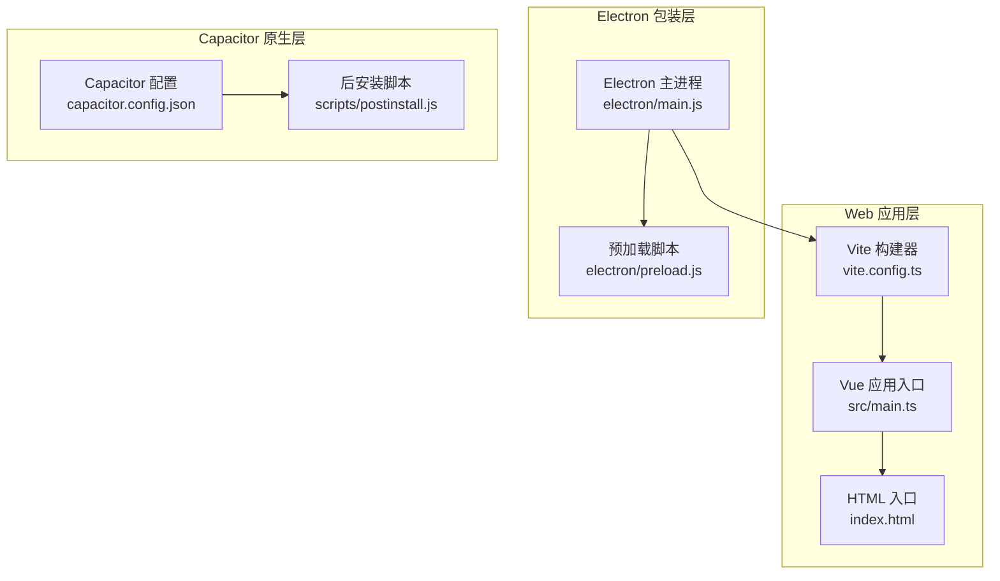
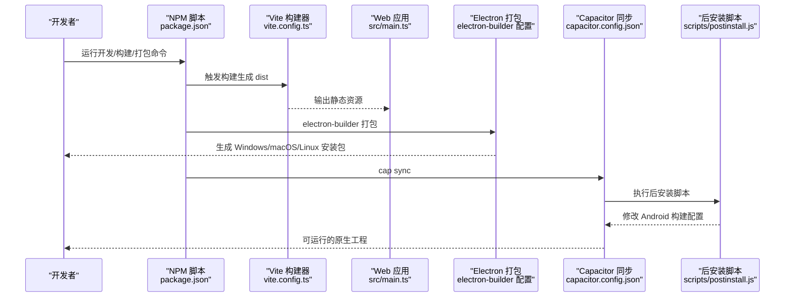
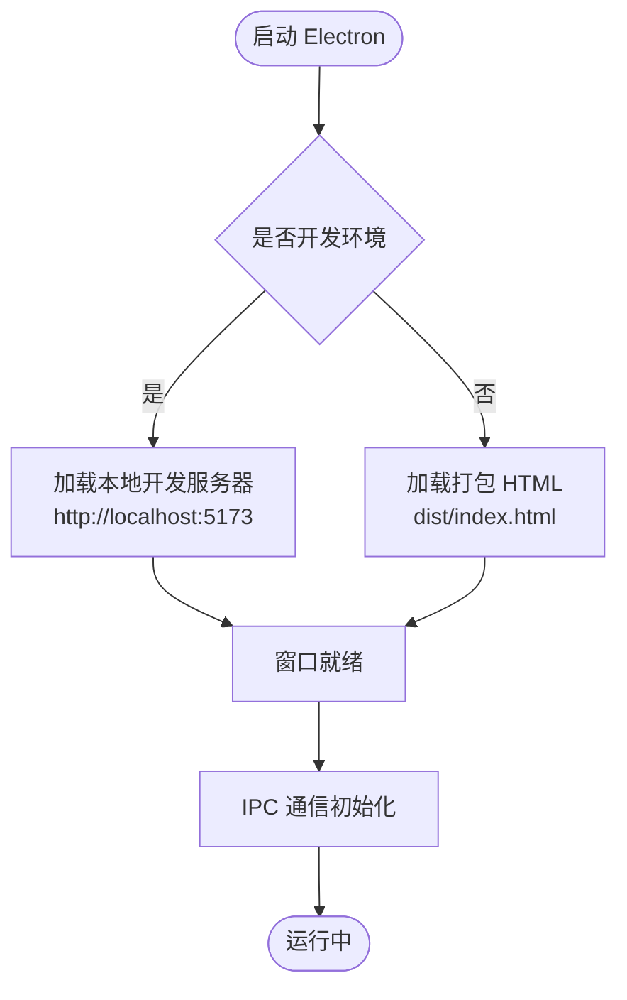
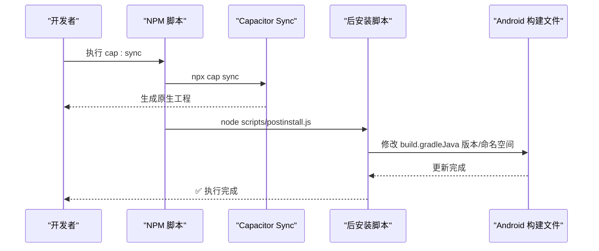
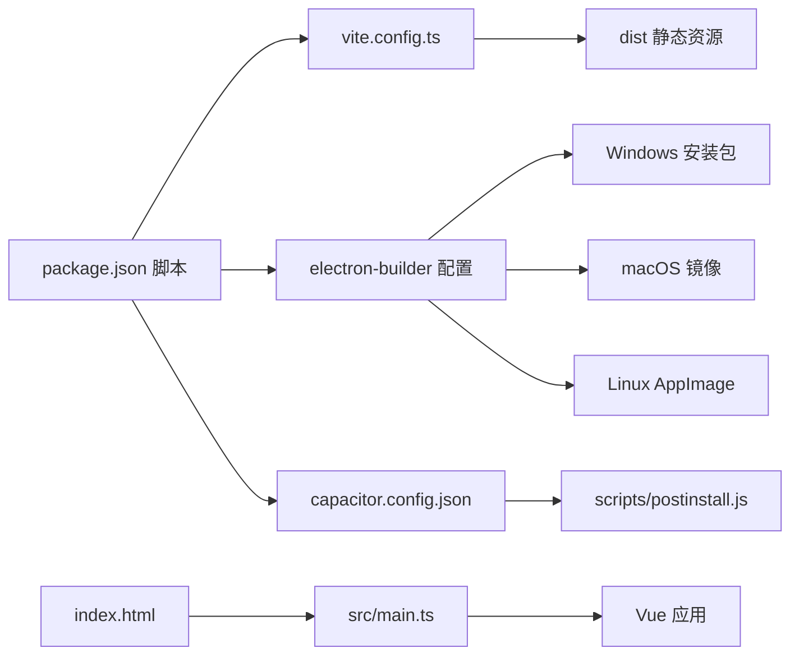

# 构建与部署

<cite>
**本文引用的文件**
- [package.json](file://package.json)
- [vite.config.ts](file://vite.config.ts)
- [capacitor.config.json](file://capacitor.config.json)
- [scripts/postinstall.js](file://scripts/postinstall.js)
- [electron/main.js](file://electron/main.js)
- [electron/preload.js](file://electron/preload.js)
- [src/main.ts](file://src/main.ts)
- [index.html](file://index.html)
- [tsconfig.json](file://tsconfig.json)
- [tsconfig.node.json](file://tsconfig.node.json)
- [version_marker.txt](file://version_marker.txt)
</cite>

## 目录
1. [简介](#简介)
2. [项目结构](#项目结构)
3. [核心组件](#核心组件)
4. [架构总览](#架构总览)
5. [详细组件分析](#详细组件分析)
6. [依赖关系分析](#依赖关系分析)
7. [性能考虑](#性能考虑)
8. [故障排查指南](#故障排查指南)
9. [结论](#结论)
10. [附录](#附录)

## 简介
本文件面向财务应用程序的构建与部署，系统性说明以下方面：
- Vite 构建工具在开发与生产环境的配置与优化要点
- Electron 应用的打包配置（多平台目标、安装包类型、签名认证建议）
- Capacitor 应用的构建流程（Web 资源打包、原生平台集成、后安装脚本）
- 构建脚本与后安装脚本的职责与执行逻辑
- 部署策略（云部署、本地部署、企业内部分发）与版本管理
- 构建优化技巧（代码分割、资源压缩、缓存策略）
- 持续集成与自动化部署的可落地配置思路
- 版本管理与发布流程最佳实践

## 项目结构
该项目采用“前端单页应用 + Electron 包装 + Capacitor 原生桥接”的混合架构：
- Web 层使用 Vue 3 + TypeScript + Vite 构建
- Electron 主进程负责窗口生命周期与 IPC，预加载脚本暴露安全 API
- Capacitor 将 Web 资源编译到 Android/iOS 原生工程，支持 SQLite 等插件
- 构建脚本通过 npm scripts 组合 Vite、Electron Builder 与 Capacitor CLI

图表来源
- [vite.config.ts:1-11](file://vite.config.ts#L1-L11)
- [src/main.ts:1-16](file://src/main.ts#L1-L16)
- [index.html:1-13](file://index.html#L1-L13)
- [electron/main.js:1-70](file://electron/main.js#L1-L70)
- [electron/preload.js:1-7](file://electron/preload.js#L1-L7)
- [capacitor.config.json:1-23](file://capacitor.config.json#L1-L23)
- [scripts/postinstall.js:1-145](file://scripts/postinstall.js#L1-L145)

章节来源
- [package.json:1-72](file://package.json#L1-L72)
- [vite.config.ts:1-11](file://vite.config.ts#L1-L11)
- [capacitor.config.json:1-23](file://capacitor.config.json#L1-L23)
- [electron/main.js:1-70](file://electron/main.js#L1-L70)
- [electron/preload.js:1-7](file://electron/preload.js#L1-L7)
- [src/main.ts:1-16](file://src/main.ts#L1-L16)
- [index.html:1-13](file://index.html#L1-L13)
- [tsconfig.json:1-25](file://tsconfig.json#L1-L25)
- [tsconfig.node.json:1-10](file://tsconfig.node.json#L1-L10)
- [version_marker.txt:1-15](file://version_marker.txt#L1-L15)

## 核心组件
- Vite 构建配置：启用 Vue 插件、相对路径基础、目标 ES2015
- Electron 主进程：根据开发/生产环境加载本地服务或打包页面；IPC 示例
- Capacitor 配置：应用标识、Web 目录、插件行为、Android 构建选项
- 后安装脚本：自动修改多个 Android 构建文件中的 Java 版本与命名空间
- 构建脚本：统一命令组合（开发、打包、Electron 打包、Capacitor 初始化与同步）

章节来源
- [vite.config.ts:1-11](file://vite.config.ts#L1-L11)
- [electron/main.js:1-70](file://electron/main.js#L1-L70)
- [capacitor.config.json:1-23](file://capacitor.config.json#L1-L23)
- [scripts/postinstall.js:1-145](file://scripts/postinstall.js#L1-L145)
- [package.json:7-17](file://package.json#L7-L17)

## 架构总览
下图展示从开发到多平台分发的关键流程与组件交互。

图表来源
- [package.json:7-17](file://package.json#L7-L17)
- [vite.config.ts:1-11](file://vite.config.ts#L1-L11)
- [src/main.ts:1-16](file://src/main.ts#L1-L16)
- [electron/main.js:1-70](file://electron/main.js#L1-L70)
- [capacitor.config.json:1-23](file://capacitor.config.json#L1-L23)
- [scripts/postinstall.js:1-145](file://scripts/postinstall.js#L1-L145)

## 详细组件分析

### Vite 构建配置与优化
- 插件与基础路径：启用 Vue 插件，设置相对路径基础，避免部署到子目录时的资源解析问题
- 目标兼容：构建目标为 ES2015，兼顾现代浏览器与 Electron 环境
- 开发与预览：开发模式启动本地服务；预览用于验证生产构建效果
- 优化建议（通用实践，非当前仓库配置）：启用代码分割、动态导入、资源压缩、长缓存策略、产物分析

章节来源
- [vite.config.ts:1-11](file://vite.config.ts#L1-L11)
- [package.json:8-12](file://package.json#L8-L12)

### Electron 应用打包配置
- 应用元数据：应用 ID、产品名称、输出目录
- 文件包含：打包时包含 Web 产物与 Electron 源码
- 多平台目标：
  - Windows：NSIS 安装包与便携版
  - macOS：DMG 镜像
  - Linux：AppImage
- 开发与生产加载逻辑：开发环境加载本地 Vite 服务，生产环境加载打包后的 HTML
- 安全与通信：预加载脚本通过 contextBridge 暴露受控 API，禁用上下文隔离与 Node 集成需谨慎评估

图表来源
- [electron/main.js:19-45](file://electron/main.js#L19-L45)
- [electron/preload.js:1-7](file://electron/preload.js#L1-L7)

章节来源
- [package.json:48-70](file://package.json#L48-L70)
- [electron/main.js:1-70](file://electron/main.js#L1-L70)
- [electron/preload.js:1-7](file://electron/preload.js#L1-L7)

### Capacitor 应用构建流程
- 配置项：应用 ID、应用名、Web 目录、是否捆绑运行时、插件行为（如键盘、启动屏）
- Android 构建选项：Java 兼容性版本、包名、允许混合内容
- 同步与后安装：cap sync 后执行 postinstall，自动修改多个 Android 构建文件中的 Java 版本与命名空间，确保与项目要求一致

图表来源
- [package.json:13-17](file://package.json#L13-L17)
- [capacitor.config.json:1-23](file://capacitor.config.json#L1-L23)
- [scripts/postinstall.js:1-145](file://scripts/postinstall.js#L1-L145)

章节来源
- [capacitor.config.json:1-23](file://capacitor.config.json#L1-L23)
- [scripts/postinstall.js:1-145](file://scripts/postinstall.js#L1-L145)
- [package.json:13-17](file://package.json#L13-L17)

### 后安装脚本执行逻辑
- 目标文件定位：@capacitor-community/sqlite、@capacitor/keyboard、app 与 cordova 插件的 build.gradle
- 修改内容：注入命名空间声明、统一 Java 版本至 17
- 安全提示：修改原生构建文件属于高风险操作，应结合 CI 环境进行严格测试与回滚策略

章节来源
- [scripts/postinstall.js:1-145](file://scripts/postinstall.js#L1-L145)

### 构建脚本与命令
- 开发：启动 Vite 本地服务，同时以 Electron 加载应用
- 构建：调用 Vite 生成生产产物
- Electron 打包：先构建 Web 资源，再使用 electron-builder 打包
- Capacitor：初始化、添加平台、同步并执行后安装脚本
- 通用：postinstall 钩子在安装后自动执行

章节来源
- [package.json:7-17](file://package.json#L7-L17)

### TypeScript 编译配置
- Web 应用：ES2020 目标、ESNext 模块、Bundler 模式、严格类型检查
- Node 工具链：仅包含 Vite 配置文件，便于类型检查

章节来源
- [tsconfig.json:1-25](file://tsconfig.json#L1-L25)
- [tsconfig.node.json:1-10](file://tsconfig.node.json#L1-L10)

## 依赖关系分析
- 构建链路：npm scripts → Vite → Electron Builder → 多平台安装包
- 原生集成：Capacitor → Android 构建文件 → 后安装脚本
- 应用入口：index.html 引入 src/main.ts，main.ts 初始化 Vue 与 Capacitor

图表来源
- [package.json:7-17](file://package.json#L7-L17)
- [vite.config.ts:1-11](file://vite.config.ts#L1-L11)
- [capacitor.config.json:1-23](file://capacitor.config.json#L1-L23)
- [scripts/postinstall.js:1-145](file://scripts/postinstall.js#L1-L145)
- [index.html:1-13](file://index.html#L1-L13)
- [src/main.ts:1-16](file://src/main.ts#L1-L16)

章节来源
- [package.json:7-17](file://package.json#L7-L17)
- [vite.config.ts:1-11](file://vite.config.ts#L1-L11)
- [capacitor.config.json:1-23](file://capacitor.config.json#L1-L23)
- [scripts/postinstall.js:1-145](file://scripts/postinstall.js#L1-L145)
- [index.html:1-13](file://index.html#L1-L13)
- [src/main.ts:1-16](file://src/main.ts#L1-L16)

## 性能考虑
- 代码分割：按路由或组件拆分，减少首屏体积
- 资源压缩：启用最小化与 Tree Shaking，合理配置外部依赖
- 缓存策略：静态资源指纹化、HTTP 缓存头、Service Worker（如需离线能力）
- 构建目标：ES2015 已覆盖主流环境，若需进一步瘦身可评估更细粒度 polyfill
- 原生集成：Capacitor 插件需注意体积与权限，按需引入

## 故障排查指南
- Electron 开发/生产加载异常
  - 确认开发环境变量与加载路径
  - 生产环境需先执行构建再运行
- Capacitor 同步失败
  - 检查 Web 目录与配置项
  - 确保已执行后安装脚本以修正构建配置
- Android 构建报错（Java 版本/命名空间）
  - 后安装脚本会自动修改，若失败请检查文件存在性与权限
- 版本与回溯
  - 使用版本标记文件快速定位项目状态

章节来源
- [electron/main.js:31-39](file://electron/main.js#L31-L39)
- [capacitor.config.json:4](file://capacitor.config.json#L4)
- [scripts/postinstall.js:41-70](file://scripts/postinstall.js#L41-L70)
- [version_marker.txt:1-15](file://version_marker.txt#L1-L15)

## 结论
本项目通过 Vite 提供高效的前端构建体验，借助 Electron 实现桌面端分发，配合 Capacitor 完成跨平台原生集成。通过 npm scripts 统一编排、electron-builder 多平台打包、Capacitor 同步与后安装脚本，形成从开发到分发的一体化流程。建议在 CI 中固化构建步骤、签名与测试，确保质量与一致性。

## 附录

### 部署策略选择
- 云部署：将 dist 静态资源托管于 CDN 或对象存储，结合反向代理与 HTTPS
- 本地部署：在内网服务器提供静态资源，结合证书与访问控制
- 企业内部分发：通过内网渠道推送安装包，结合签名校验与版本控制

### 持续集成与自动化部署
- 触发条件：分支保护、PR 合并、标签推送
- 步骤建议：安装依赖 → 类型检查 → 单测 → 构建 → 产物上传 → 打包 → 签名 → 归档
- 平台适配：Windows/macOS/Linux 分别在对应 Runner 上执行打包

### 版本管理与发布流程
- 版本标记：使用版本标记文件记录当前状态，便于回溯
- 发布节奏：固定周期发布或按功能里程碑发布
- 回滚策略：保留上一个版本产物与安装包，快速回退

章节来源
- [version_marker.txt:1-15](file://version_marker.txt#L1-L15)
- [package.json:48-70](file://package.json#L48-L70)