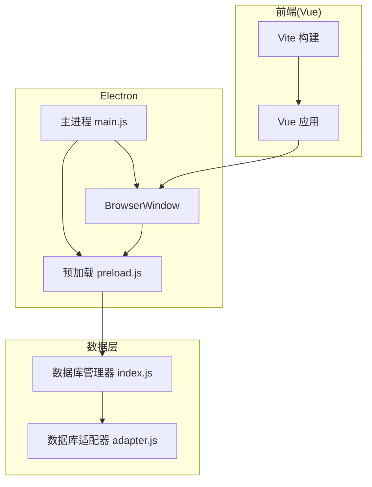
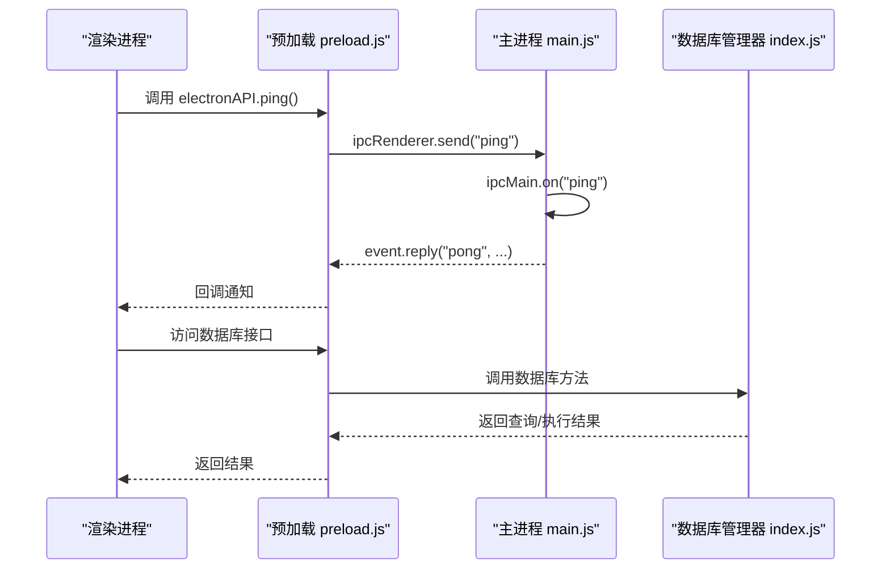
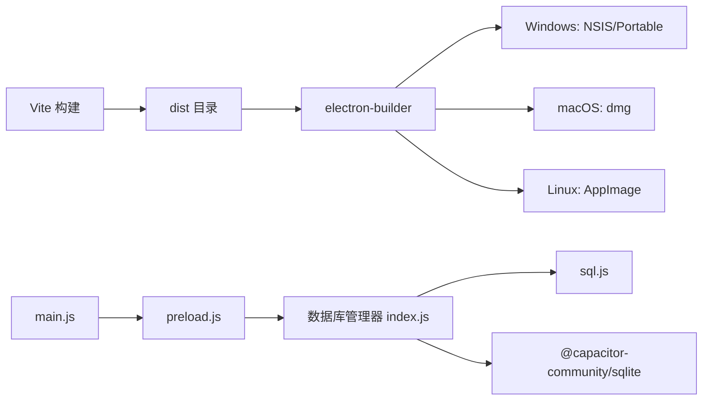

# 桌面应用打包

<cite>
**本文引用的文件**
- [package.json](file://package.json)
- [vite.config.ts](file://vite.config.ts)
- [electron/main.js](file://electron/main.js)
- [electron/preload.js](file://electron/preload.js)
- [scripts/postinstall.js](file://scripts/postinstall.js)
- [capacitor.config.json](file://capacitor.config.json)
- [src/database/adapter.js](file://src/database/adapter.js)
- [src/database/index.js](file://src/database/index.js)
</cite>

## 目录
1. [简介](#简介)
2. [项目结构](#项目结构)
3. [核心组件](#核心组件)
4. [架构总览](#架构总览)
5. [详细组件分析](#详细组件分析)
6. [依赖关系分析](#依赖关系分析)
7. [性能考虑](#性能考虑)
8. [故障排查指南](#故障排查指南)
9. [结论](#结论)
10. [附录](#附录)

## 简介
本文件面向财务应用程序的Electron桌面应用打包，系统性梳理主进程与渲染进程的配置差异、多平台打包策略（Windows、macOS、Linux）、安装包类型（可执行文件、安装程序、便携版）、应用签名与公证流程、预加载脚本与IPC通信安全配置、跨平台打包优化技巧，以及自动更新机制的配置与实现思路。文档同时结合仓库现有配置，给出可落地的发布流程指导。

## 项目结构
该项目采用“前端框架 + Electron主进程 + 预加载桥接 + 构建工具”的典型桌面应用结构：
- 前端基于Vue生态，使用Vite进行开发与构建
- Electron负责应用生命周期与窗口管理，通过预加载脚本暴露受控API给渲染进程
- 数据层支持多平台：Capacitor SQLite（原生）与 sql.js（Web），在桌面端以Web模式运行
- 打包使用electron-builder，支持多平台输出

图表来源
- [vite.config.ts:1-11](file://vite.config.ts#L1-L11)
- [electron/main.js:19-45](file://electron/main.js#L19-L45)
- [electron/preload.js:1-7](file://electron/preload.js#L1-L7)
- [src/database/index.js:21-32](file://src/database/index.js#L21-L32)
- [src/database/adapter.js:14-33](file://src/database/adapter.js#L14-L33)

章节来源
- [package.json:1-72](file://package.json#L1-L72)
- [vite.config.ts:1-11](file://vite.config.ts#L1-L11)
- [electron/main.js:1-70](file://electron/main.js#L1-L70)
- [electron/preload.js:1-7](file://electron/preload.js#L1-L7)
- [src/database/adapter.js:1-34](file://src/database/adapter.js#L1-L34)
- [src/database/index.js:1-800](file://src/database/index.js#L1-L800)

## 核心组件
- 构建与打包
  - Vite用于前端构建，输出静态资源至dist目录
  - electron-builder根据package.json中的build配置生成多平台安装包
- 主进程
  - 负责创建BrowserWindow、加载开发或生产页面、处理窗口事件、注册IPC监听
- 预加载脚本
  - 通过contextBridge向渲染进程暴露有限API，实现安全的IPC桥接
- 数据层
  - 统一的数据库管理器，支持Capacitor SQLite与sql.js，按平台选择实现

章节来源
- [package.json:48-70](file://package.json#L48-L70)
- [vite.config.ts:1-11](file://vite.config.ts#L1-L11)
- [electron/main.js:19-69](file://electron/main.js#L19-L69)
- [electron/preload.js:1-7](file://electron/preload.js#L1-L7)
- [src/database/index.js:21-32](file://src/database/index.js#L21-L32)

## 架构总览
Electron桌面应用的运行时交互如下：主进程创建窗口并加载前端页面；预加载脚本通过contextBridge暴露API；渲染进程通过IPC与主进程通信；数据访问由数据库管理器统一处理，按平台选择Capacitor SQLite或sql.js。

图表来源
- [electron/preload.js:3-6](file://electron/preload.js#L3-L6)
- [electron/main.js:67-69](file://electron/main.js#L67-L69)
- [src/database/index.js:199-264](file://src/database/index.js#L199-L264)

## 详细组件分析

### 主进程配置与窗口管理
- 窗口尺寸与偏好：定义了窗口宽高与webPreferences，启用Node集成但禁用上下文隔离
- 开发与生产加载逻辑：开发环境加载本地Vite服务，生产环境加载打包后的HTML
- 生命周期事件：应用就绪创建窗口，macOS激活时重建窗口，所有窗口关闭时退出（macOS除外）

章节来源
- [electron/main.js:19-45](file://electron/main.js#L19-L45)
- [electron/main.js:48-61](file://electron/main.js#L48-L61)

### 预加载脚本与IPC桥接
- 通过contextBridge.exposeInMainWorld暴露受限API，仅暴露必要的IPC方法
- 渲染进程通过electronAPI.ping()触发IPC，主进程响应并回传消息

章节来源
- [electron/preload.js:1-7](file://electron/preload.js#L1-L7)
- [electron/main.js:67-69](file://electron/main.js#L67-L69)

### 数据库适配与多平台支持
- 适配器根据Capacitor.isNativePlatform()选择原生或Web实现
- 数据库管理器统一处理连接、查询、执行、批处理、事务、缓存与持久化
- Web环境使用sql.js并通过localStorage节流持久化

章节来源
- [src/database/adapter.js:14-33](file://src/database/adapter.js#L14-L33)
- [src/database/index.js:21-32](file://src/database/index.js#L21-L32)
- [src/database/index.js:199-264](file://src/database/index.js#L199-L264)
- [src/database/index.js:379-408](file://src/database/index.js#L379-L408)

### 构建与打包配置
- Vite配置：基础路径为相对路径，目标ES版本为ES2015
- electron-builder配置：应用ID、产品名、输出目录、文件包含规则
- 多平台目标：
  - Windows：NSIS安装器与便携版
  - macOS：dmg镜像
  - Linux：AppImage

章节来源
- [vite.config.ts:1-11](file://vite.config.ts#L1-L11)
- [package.json:48-70](file://package.json#L48-L70)

### Capacitor Android兼容性脚本
- postinstall脚本自动修改多个Android构建配置，统一Java兼容性（17）与命名空间
- 作用于SQLite插件、键盘插件及应用构建文件

章节来源
- [scripts/postinstall.js:1-145](file://scripts/postinstall.js#L1-L145)
- [capacitor.config.json:14-21](file://capacitor.config.json#L14-L21)

## 依赖关系分析
- 主进程依赖Electron API创建窗口与处理IPC
- 预加载脚本依赖Electron的contextBridge与ipcRenderer
- 数据库管理器依赖sql.js与Capacitor SQLite，按平台动态选择
- 构建链路：Vite -> dist -> electron-builder -> 多平台安装包

图表来源
- [package.json:48-70](file://package.json#L48-L70)
- [electron/main.js:5-11](file://electron/main.js#L5-L11)
- [electron/preload.js:1](file://electron/preload.js#L1)
- [src/database/index.js:8-10](file://src/database/index.js#L8-L10)

章节来源
- [package.json:48-70](file://package.json#L48-L70)
- [electron/main.js:5-11](file://electron/main.js#L5-L11)
- [electron/preload.js:1](file://electron/preload.js#L1)
- [src/database/index.js:8-10](file://src/database/index.js#L8-L10)

## 性能考虑
- 数据层优化
  - 单例连接避免重复建立连接
  - 查询缓存减少重复查询
  - 批处理与事务提升批量写入效率
  - Web环境节流持久化，降低localStorage写入频率
- 构建优化
  - ES2015目标与相对路径基础，有利于现代浏览器与打包工具优化
- IPC设计
  - 预加载脚本暴露最小API，减少渲染进程对Node能力的直接依赖

章节来源
- [src/database/index.js:21-32](file://src/database/index.js#L21-L32)
- [src/database/index.js:199-264](file://src/database/index.js#L199-L264)
- [src/database/index.js:316-347](file://src/database/index.js#L316-L347)
- [src/database/index.js:379-408](file://src/database/index.js#L379-L408)
- [vite.config.ts:8-10](file://vite.config.ts#L8-L10)

## 故障排查指南
- 打包产物缺失
  - 确认Vite构建成功且dist目录存在
  - 检查electron-builder的files包含规则是否覆盖dist与electron目录
- Windows安装失败
  - 确认NSIS安装器与便携版目标均启用
  - 检查签名与代码公证配置（见后续章节）
- macOS DMG问题
  - 确认应用签名证书与公证流程正确
- Linux AppImage不可执行
  - 检查权限与打包命令
- 预加载API不可用
  - 确认webPreferences中preload路径正确
  - 确认contextBridge已正确暴露API
- 数据库连接异常
  - 检查平台判断逻辑与对应驱动初始化
  - Web环境确认sql.js初始化与localStorage持久化

章节来源
- [package.json:54-57](file://package.json#L54-L57)
- [electron/main.js:23-28](file://electron/main.js#L23-L28)
- [electron/preload.js:3-6](file://electron/preload.js#L3-L6)
- [src/database/index.js:37-50](file://src/database/index.js#L37-L50)

## 结论
本项目已具备完整的Electron桌面应用打包基础：前端构建、主进程窗口管理、预加载安全桥接、多平台打包目标与数据库多平台适配。建议在现有基础上补充签名与公证、自动更新机制，并持续优化数据层性能与打包体积，以满足生产级发布要求。

## 附录

### 多平台打包策略与安装包类型
- Windows
  - NSIS安装器：提供安装体验，便于注册表与快捷方式管理
  - 便携版：无需安装，适合便携存储与快速分发
- macOS
  - dmg镜像：标准分发格式，便于用户拖拽安装
- Linux
  - AppImage：自包含可执行文件，跨发行版通用

章节来源
- [package.json:58-69](file://package.json#L58-L69)

### 安装包生成与发布流程
- 本地构建
  - 先执行Vite构建，再执行electron-builder
- 发布准备
  - Windows：准备代码签名证书，启用CI/CD自动签名
  - macOS：准备开发者证书与公证，确保notarization流程
  - Linux：确认AppImage权限与签名（如需）
- 自动更新（建议实现）
  - 可基于electron-updater或electron-builder内置更新通道
  - 需要服务器端发布渠道与版本元数据

章节来源
- [package.json:12](file://package.json#L12)
- [package.json:48-70](file://package.json#L48-L70)

### 预加载脚本安全配置与IPC通信
- 安全要点
  - 禁用上下文隔离时，务必通过contextBridge暴露最小API集合
  - 预加载脚本中仅暴露必要方法，避免直接暴露Node全局
- IPC示例
  - 渲染进程通过electronAPI.ping()触发，主进程在ipcMain.on中处理并回复

章节来源
- [electron/main.js:23-28](file://electron/main.js#L23-L28)
- [electron/preload.js:3-6](file://electron/preload.js#L3-L6)
- [electron/main.js:67-69](file://electron/main.js#L67-L69)

### 应用签名与公证流程
- Windows
  - 使用代码签名证书对安装包进行签名
  - CI/CD中配置证书与密码，自动化签名
- macOS
  - 使用Apple开发者证书进行签名
  - 使用electron-notarize在Apple公证服务进行公证
  - 确保应用包含正确的Info.plist与权限声明
- Linux
  - AppImage通常不需要签名，但可按需进行哈希校验与完整性验证

章节来源
- [package.json:48-70](file://package.json#L48-L70)

### 跨平台打包优化技巧
- Windows
  - 使用NSIS增强安装体验（图标、欢迎页、卸载项）
  - 便携版可使用7z压缩减小体积
- macOS
  - 使用electron-osx-sign进行签名与flat打包
  - 优化dmg背景图与布局
- Linux
  - AppImage可配合AppImageKit优化启动速度
  - 使用desktop文件与图标保证应用商店可用性

章节来源
- [package.json:58-69](file://package.json#L58-L69)

### 自动更新机制配置与实现
- 方案选择
  - electron-updater：独立更新库，灵活可控
  - electron-builder内置更新通道：与构建流程深度集成
- 服务器端要求
  - 提供更新元数据（版本号、下载地址、校验信息）
  - 支持增量更新（如需）与全量更新
- 客户端实现要点
  - 启动时检查更新
  - 下载完成后提示重启应用
  - 错误回滚与重试机制

章节来源
- [package.json:42](file://package.json#L42)

### 开发者发布完整流程
- 开发阶段
  - 使用Vite热更新开发，Electron主进程监听开发服务器
- 构建阶段
  - 执行Vite构建，生成dist静态资源
  - 执行electron-builder，生成多平台安装包
- 测试阶段
  - 在各平台验证安装、启动、数据库功能
- 发布阶段
  - Windows：签名 + 发布
  - macOS：签名 + notarization + 发布
  - Linux：发布AppImage
- 维护阶段
  - 配置自动更新通道，收集崩溃日志与反馈

章节来源
- [package.json:11-17](file://package.json#L11-L17)
- [package.json:12](file://package.json#L12)
- [package.json:48-70](file://package.json#L48-L70)