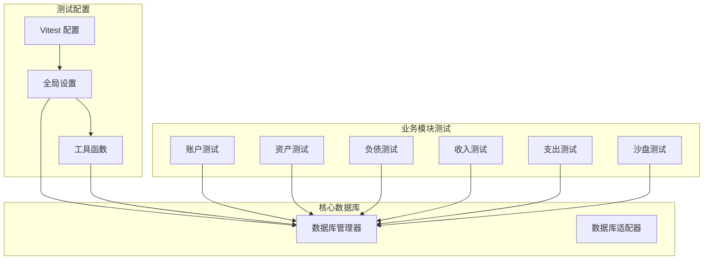
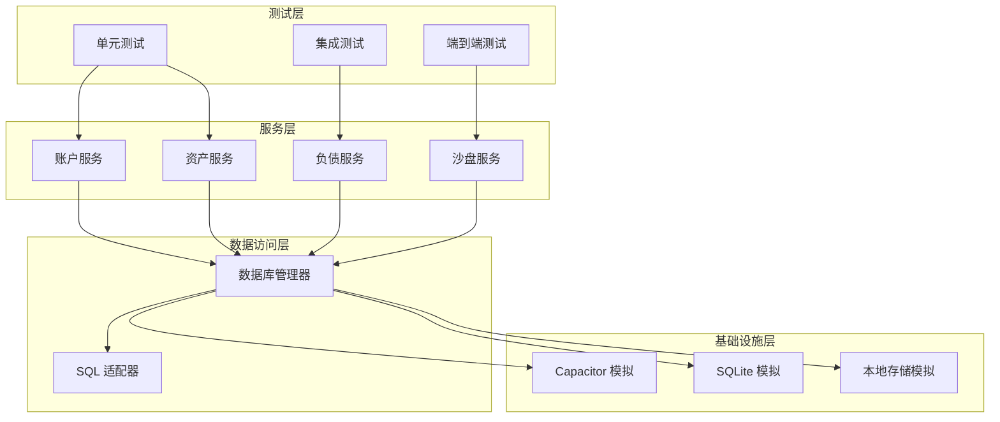
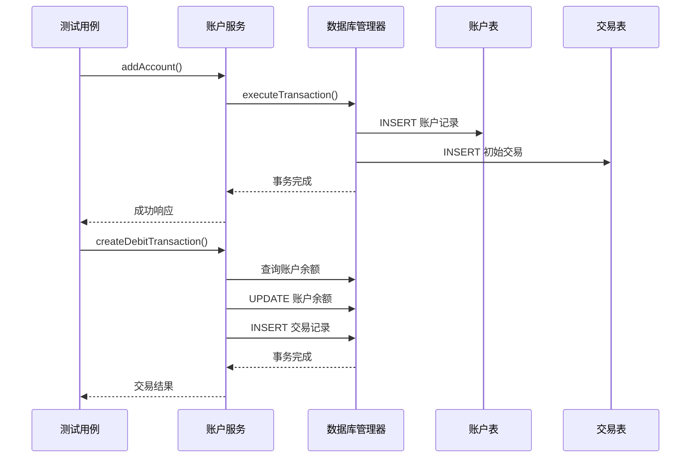
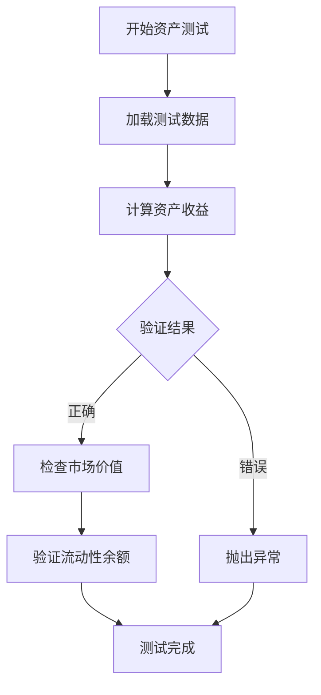
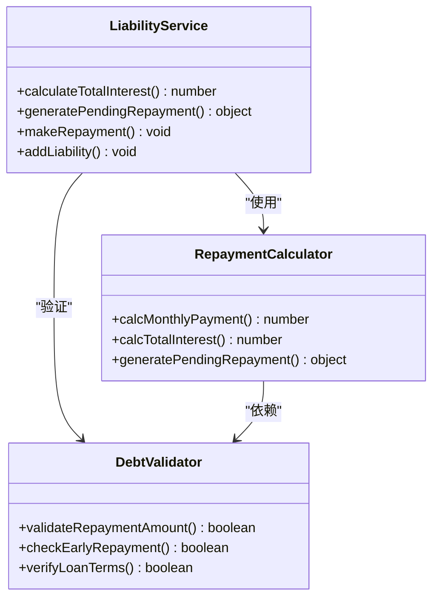
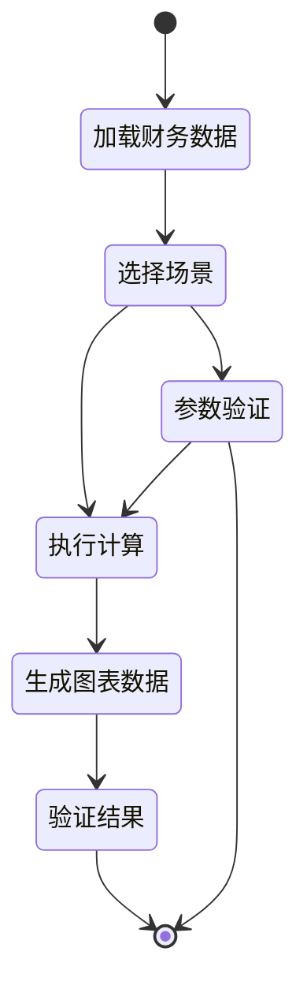

# 测试框架

<cite>
**本文档引用的文件**
- [vitest.config.ts](file://vitest.config.ts)
- [package.json](file://package.json)
- [tests/setup.ts](file://tests/setup.ts)
- [tests/utils/testDb.ts](file://tests/utils/testDb.ts)
- [tests/account.test.ts](file://tests/account.test.ts)
- [tests/asset.test.ts](file://tests/asset.test.ts)
- [tests/income.test.ts](file://tests/income.test.ts)
- [tests/expense.test.ts](file://tests/expense.test.ts)
- [tests/liability.test.ts](file://tests/liability.test.ts)
- [tests/sandbox.test.ts](file://tests/sandbox.test.ts)
- [src/database/index.js](file://src/database/index.js)
- [src/services/account/accountService.ts](file://src/services/account/accountService.ts)
- [src/services/asset/assetService.ts](file://src/services/asset/assetService.ts)
- [src/services/liability/liabilityService.ts](file://src/services/liability/liabilityService.ts)
- [src/services/sandbox/sandboxService.ts](file://src/services/sandbox/sandboxService.ts)
</cite>

## 目录
1. [简介](#简介)
2. [项目结构](#项目结构)
3. [核心组件](#核心组件)
4. [架构概览](#架构概览)
5. [详细组件分析](#详细组件分析)
6. [依赖分析](#依赖分析)
7. [性能考虑](#性能考虑)
8. [故障排除指南](#故障排除指南)
9. [结论](#结论)

## 简介

这是一个基于 Vitest 的全面测试框架，专为财务应用程序设计。该框架提供了完整的单元测试、集成测试和端到端测试能力，涵盖了账户管理、资产管理、负债管理、收支统计和沙盘推演等核心业务模块。

测试框架采用 jsdom 环境模拟浏览器行为，通过自定义数据库适配器实现测试隔离，确保每个测试用例都能在独立的数据库环境中运行，互不干扰。

## 项目结构

测试框架采用模块化组织方式，按照功能域划分测试文件：



**图表来源**
- [vitest.config.ts:1-18](file://vitest.config.ts#L1-L18)
- [tests/setup.ts:1-18](file://tests/setup.ts#L1-L18)
- [tests/utils/testDb.ts:1-89](file://tests/utils/testDb.ts#L1-L89)

**章节来源**
- [vitest.config.ts:1-18](file://vitest.config.ts#L1-L18)
- [package.json:18-18](file://package.json#L18-L18)

## 核心组件

### Vitest 配置系统

Vitest 配置系统提供了完整的测试环境设置，包括 jsdom 环境、插件集成和路径别名配置。

### 全局测试设置

全局设置负责模拟原生平台环境，包括 Capacitor 和 SQLite 组件的虚拟实现，以及本地存储的模拟。

### 数据库测试适配器

测试数据库适配器实现了完整的数据库生命周期管理，包括连接重置、状态清理和测试数据种子功能。

**章节来源**
- [tests/setup.ts:1-18](file://tests/setup.ts#L1-L18)
- [tests/utils/testDb.ts:19-44](file://tests/utils/testDb.ts#L19-L44)

## 架构概览

测试框架采用分层架构设计，确保测试的隔离性和可维护性：



**图表来源**
- [tests/setup.ts:4-17](file://tests/setup.ts#L4-L17)
- [src/database/index.js:21-32](file://src/database/index.js#L21-L32)

## 详细组件分析

### 账户模块测试

账户模块测试涵盖了完整的 CRUD 操作和交易处理逻辑：



**图表来源**
- [tests/account.test.ts:18-31](file://tests/account.test.ts#L18-L31)
- [src/services/account/accountService.ts:15-106](file://src/services/account/accountService.ts#L15-L106)

**章节来源**
- [tests/account.test.ts:17-92](file://tests/account.test.ts#L17-L92)
- [src/services/account/accountService.ts:197-291](file://src/services/account/accountService.ts#L197-L291)

### 资产模块测试

资产模块测试验证了资产收益计算和市场价值评估功能：



**图表来源**
- [tests/asset.test.ts:44-53](file://tests/asset.test.ts#L44-L53)
- [src/services/asset/assetService.ts:56-83](file://src/services/asset/assetService.ts#L56-L83)

**章节来源**
- [tests/asset.test.ts:6-88](file://tests/asset.test.ts#L6-L88)
- [src/services/asset/assetService.ts:88-125](file://src/services/asset/assetService.ts#L88-L125)

### 负债模块测试

负债模块测试专注于还款计算和利息估算：



**图表来源**
- [src/services/liability/liabilityService.ts:14-37](file://src/services/liability/liabilityService.ts#L14-L37)
- [src/services/liability/liabilityService.ts:42-94](file://src/services/liability/liabilityService.ts#L42-L94)

**章节来源**
- [tests/liability.test.ts:6-88](file://tests/liability.test.ts#L6-L88)
- [src/services/liability/liabilityService.ts:326-508](file://src/services/liability/liabilityService.ts#L326-L508)

### 沙盘推演测试

沙盘推演测试验证了复杂的财务场景模拟功能：



**图表来源**
- [src/services/sandbox/sandboxService.ts:280-304](file://src/services/sandbox/sandboxService.ts#L280-L304)
- [src/services/sandbox/sandboxService.ts:183-247](file://src/services/sandbox/sandboxService.ts#L183-L247)

**章节来源**
- [tests/sandbox.test.ts:15-166](file://tests/sandbox.test.ts#L15-L166)
- [src/services/sandbox/sandboxService.ts:280-704](file://src/services/sandbox/sandboxService.ts#L280-L704)

## 依赖分析

测试框架的依赖关系清晰明确，遵循单一职责原则：

```mermaid
graph LR
subgraph "外部依赖"
VITEST[Vitest]
JSDOM[jsdom]
DAYJS[Day.js]
SQL_JS[sql.js]
end
subgraph "内部模块"
TEST_SETUP[测试设置]
DB_ADAPTER[数据库适配器]
SERVICE_MODULES[服务模块]
end
subgraph "Capacitor 适配"
CAPACITOR_CORE[@capacitor/core]
CAPACITOR_SQLITE[@capacitor-community/sqlite]
end
VITEST --> TEST_SETUP
TEST_SETUP --> DB_ADAPTER
DB_ADAPTER --> SERVICE_MODULES
SERVICE_MODULES --> CAPACITOR_SQLITE
SERVICE_MODULES --> SQL_JS
TEST_SETUP -.-> CAPACITOR_CORE
TEST_SETUP -.-> JSDOM
SERVICE_MODULES -.-> DAYJS
```

**图表来源**
- [package.json:21-38](file://package.json#L21-L38)
- [tests/setup.ts:5-15](file://tests/setup.ts#L5-L15)

**章节来源**
- [package.json:40-53](file://package.json#L40-L53)
- [tests/setup.ts:1-18](file://tests/setup.ts#L1-L18)

## 性能考虑

测试框架在设计时充分考虑了性能优化：

### 数据库性能优化
- 使用连接池管理，避免重复建立数据库连接
- 实现查询结果缓存机制，减少重复查询
- 支持批量操作，提高数据处理效率

### 测试执行优化
- 并行测试执行，充分利用多核处理器
- 智能测试隔离，确保测试间互不干扰
- 内存管理优化，防止测试泄漏

### 缓存策略
- 查询结果缓存，减少数据库访问频率
- 本地存储持久化，支持测试间数据共享
- 定时清理机制，防止内存泄漏

## 故障排除指南

### 常见测试问题

**数据库连接问题**
- 确认测试数据库已正确初始化
- 检查连接字符串和认证信息
- 验证数据库权限设置

**测试数据污染**
- 使用测试专用数据库实例
- 确保测试结束后数据清理
- 验证事务回滚机制

**环境配置问题**
- 检查 jsdom 环境配置
- 验证 Capacitor 模拟设置
- 确认本地存储模拟状态

**章节来源**
- [tests/utils/testDb.ts:19-44](file://tests/utils/testDb.ts#L19-L44)
- [tests/setup.ts:4-17](file://tests/setup.ts#L4-L17)

## 结论

该测试框架为财务应用程序提供了全面、可靠的测试解决方案。通过模块化设计和完善的基础设施支持，确保了测试的准确性、可维护性和可扩展性。

框架的主要优势包括：
- 完整的业务模块覆盖
- 强大的数据库测试适配能力
- 灵活的配置选项
- 良好的性能表现
- 易于维护和扩展

通过持续改进和优化，该测试框架能够有效保障财务应用程序的质量和稳定性。