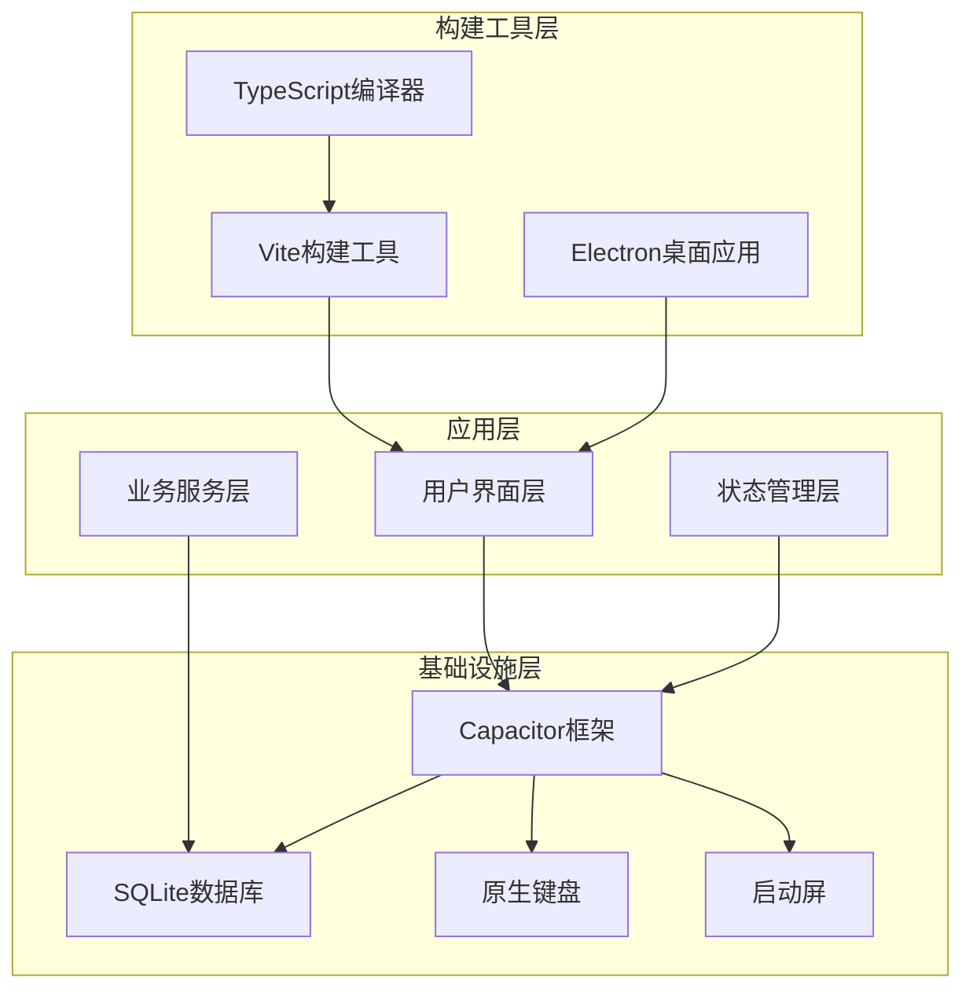
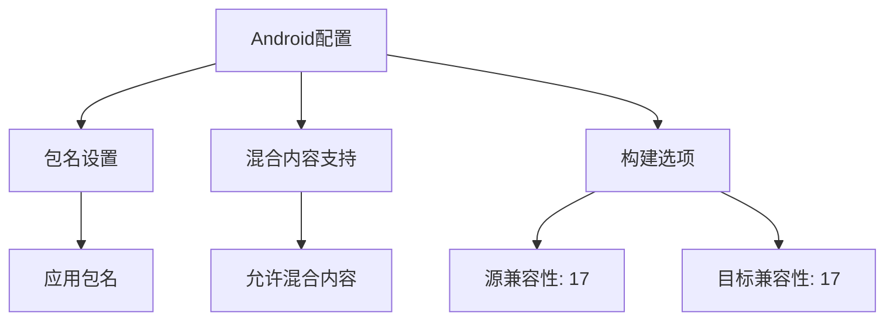
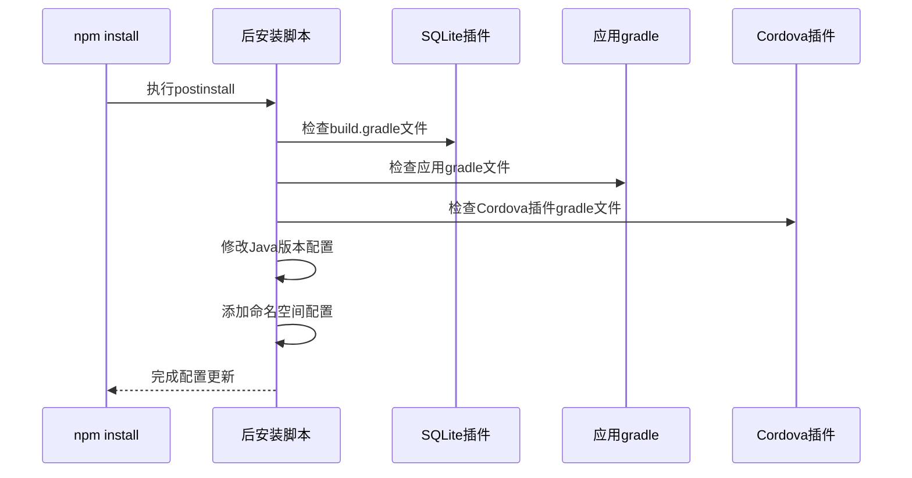
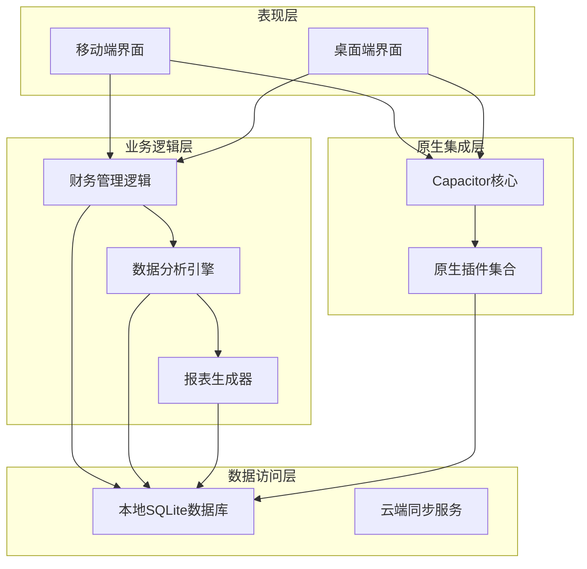
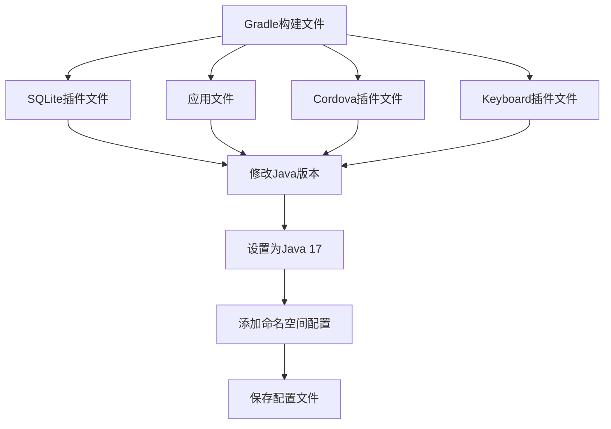
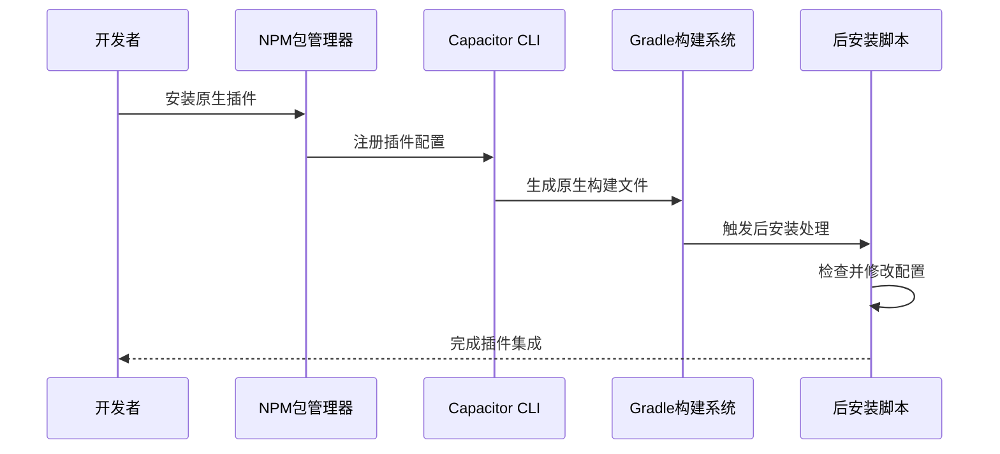
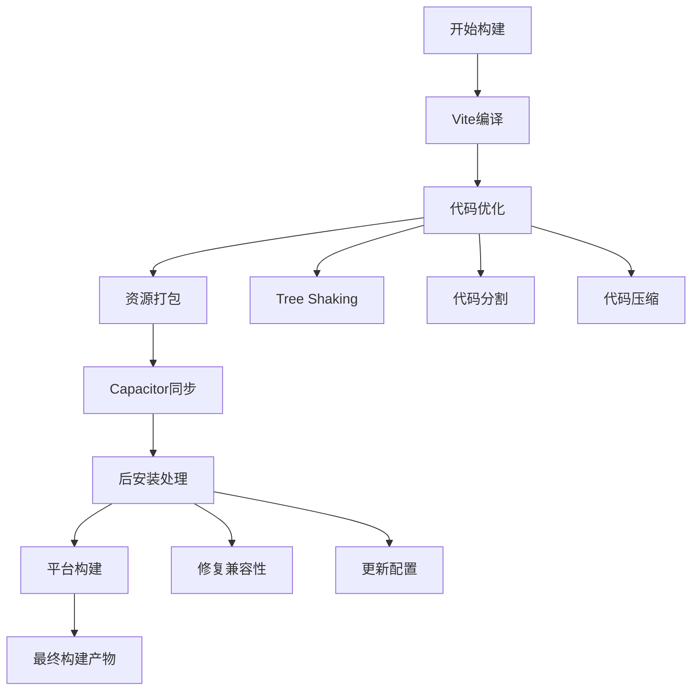
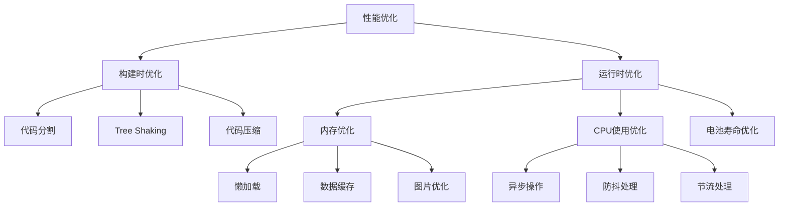

# 移动端构建配置

<cite>
**本文档引用的文件**
- [capacitor.config.json](file://capacitor.config.json)
- [package.json](file://package.json)
- [scripts/postinstall.js](file://scripts/postinstall.js)
- [vite.config.ts](file://vite.config.ts)
- [src/main.ts](file://src/main.ts)
- [android/app/build.gradle](file://android/app/build.gradle)
- [android/app/capacitor.build.gradle](file://android/app/capacitor.build.gradle)
- [android/build.gradle](file://android/build.gradle)
- [android/capacitor-cordova-android-plugins/build.gradle](file://android/capacitor-cordova-android-plugins/build.gradle)
</cite>

## 目录
1. [简介](#简介)
2. [项目结构](#项目结构)
3. [核心组件](#核心组件)
4. [架构概览](#架构概览)
5. [详细组件分析](#详细组件分析)
6. [依赖关系分析](#依赖关系分析)
7. [性能考虑](#性能考虑)
8. [故障排除指南](#故障排除指南)
9. [结论](#结论)
10. [附录](#附录)

## 简介

本文件为财务应用程序的Capacitor移动端构建提供详细的技术文档。该应用采用Vue 3 + TypeScript + Vite技术栈，通过Capacitor实现跨平台移动应用开发。文档深入解释了Capacitor配置文件的各项参数，包括应用ID、名称、版本、权限设置等，并详细说明了iOS和Android平台的特定配置和优化。

应用的核心特性包括：
- 使用Capacitor 6.x版本进行移动端构建
- 集成SQLite数据库插件用于本地数据存储
- 实现财务管理和数据分析功能
- 支持原生键盘和启动屏插件优化用户体验
- 通过自定义后安装脚本解决兼容性问题

## 项目结构

财务应用程序采用模块化架构设计，主要分为以下层次：



**图表来源**
- [src/main.ts:1-16](file://src/main.ts#L1-L16)
- [capacitor.config.json:1-23](file://capacitor.config.json#L1-L23)

**章节来源**
- [src/main.ts:1-16](file://src/main.ts#L1-L16)
- [package.json:1-72](file://package.json#L1-L72)

## 核心组件

### Capacitor配置系统

Capacitor配置文件是整个移动端构建的核心，定义了应用的基本信息和平台特定设置。

#### 应用基本信息配置

| 配置项 | 值 | 说明 |
|--------|----|------|
| appId | com.finance.app | 应用程序标识符，遵循反向域名格式 |
| appName | 裕安 | 应用显示名称，支持中文字符 |
| webDir | dist | Web资源构建输出目录 |
| bundledWebRuntime | false | 是否打包Web运行时 |

#### 插件配置系统

应用集成了两个核心插件来增强原生功能：

1. **启动屏插件 (SplashScreen)**
   - launchShowDuration: 0 (禁用启动屏显示)
   - 提供快速启动体验，避免启动延迟

2. **键盘插件 (Keyboard)**
   - resize: none (禁用键盘调整模式)
   - 防止键盘遮挡输入框，保持界面布局稳定

#### Android平台特定配置



**图表来源**
- [capacitor.config.json:14-21](file://capacitor.config.json#L14-L21)

**章节来源**
- [capacitor.config.json:1-23](file://capacitor.config.json#L1-L23)

### 构建脚本系统

项目使用npm脚本管理完整的构建流程，实现了自动化和可重复的构建过程。

#### 核心构建脚本

| 脚本命令 | 功能描述 | 执行步骤 |
|----------|----------|----------|
| dev | 开发环境启动 | 启动Vite开发服务器 |
| build | 生产构建 | 编译Vue应用到dist目录 |
| electron:dev | Electron开发模式 | 并行启动Web和Electron进程 |
| electron:build | Electron生产构建 | 构建后使用electron-builder打包 |
| cap:init | 初始化Capacitor项目 | 创建Capacitor配置文件 |
| cap:add:android | 添加Android平台 | 集成Android平台支持 |
| cap:sync | 同步Capacitor配置 | 更新原生项目并执行后安装脚本 |
| cap:open:android | 打开Android Studio | 在Android Studio中打开项目 |

**章节来源**
- [package.json:7-17](file://package.json#L7-L17)

### 后安装处理机制

项目实现了自动化的后安装脚本，用于解决第三方插件的兼容性问题。



**图表来源**
- [scripts/postinstall.js:1-145](file://scripts/postinstall.js#L1-L145)

**章节来源**
- [scripts/postinstall.js:1-145](file://scripts/postinstall.js#L1-L145)

## 架构概览

应用采用分层架构设计，确保了良好的可维护性和扩展性。



**图表来源**
- [src/main.ts:7-11](file://src/main.ts#L7-L11)
- [capacitor.config.json:6-13](file://capacitor.config.json#L6-L13)

## 详细组件分析

### Android构建配置分析

Android平台的构建配置是移动端功能实现的关键，涉及多个gradle文件的协调工作。

#### 主要构建文件

| 文件路径 | 功能描述 | 关键配置 |
|----------|----------|----------|
| android/app/build.gradle | 应用主构建文件 | 应用级配置、依赖管理 |
| android/app/capacitor.build.gradle | Capacitor专用构建文件 | 原生插件集成配置 |
| android/build.gradle | 项目级构建文件 | 全局构建设置、插件配置 |
| android/capacitor-cordova-android-plugins/build.gradle | Cordova插件构建文件 | 第三方插件兼容性配置 |

#### Java版本兼容性配置



**图表来源**
- [scripts/postinstall.js:40-70](file://scripts/postinstall.js#L40-L70)
- [scripts/postinstall.js:72-94](file://scripts/postinstall.js#L72-L94)

**章节来源**
- [scripts/postinstall.js:40-145](file://scripts/postinstall.js#L40-L145)

### 原生插件集成方案

应用集成了多个原生插件来增强移动端功能，每个插件都有其特定的配置要求。

#### 已集成插件列表

| 插件名称 | 版本 | 功能描述 | 配置要点 |
|----------|------|----------|----------|
| @capacitor-community/sqlite | ^6.0.1 | 本地数据库存储 | 需要命名空间配置 |
| @capacitor/keyboard | ^6.0.2 | 原生键盘控制 | 需要Java 17兼容性 |
| @capacitor/android | ^6.1.2 | Android平台支持 | 核心平台插件 |
| @capacitor/core | ^6.1.2 | Capacitor核心功能 | 基础框架支持 |

#### 插件配置流程



**图表来源**
- [package.json:20-35](file://package.json#L20-L35)
- [scripts/postinstall.js:1-145](file://scripts/postinstall.js#L1-L145)

**章节来源**
- [package.json:20-35](file://package.json#L20-L35)
- [scripts/postinstall.js:1-145](file://scripts/postinstall.js#L1-L145)

### 构建流程优化

项目实现了多阶段的构建优化策略，确保在不同环境下都能获得最佳的构建性能。

#### 构建优化策略



**图表来源**
- [vite.config.ts:5-11](file://vite.config.ts#L5-L11)
- [package.json:15](file://package.json#L15)

**章节来源**
- [vite.config.ts:1-11](file://vite.config.ts#L1-L11)
- [package.json:15](file://package.json#L15)

## 依赖关系分析

应用的依赖关系复杂且层次分明，涉及前端、原生和构建工具等多个层面。

```mermaid
graph TB
subgraph "前端依赖"
Vue[Vue 3.5.32]
TypeScript[TypeScript 5.2.2]
Pinia[Pinia 2.1.7]
ElementPlus[Element Plus 2.13.7]
end
subgraph "Capacitor生态"
CapacitorCore[@capacitor/core 6.1.2]
CapacitorAndroid[@capacitor/android 6.1.2]
SQLitePlugin[@capacitor-community/sqlite 6.0.1]
KeyboardPlugin[@capacitor/keyboard 6.0.2]
end
subgraph "构建工具"
Vite[Vite 5.3.1]
TSCompiler[TypeScript编译器]
Electron[Electron 29.3.1]
Builder[electron-builder 24.13.3]
end
subgraph "数据分析库"
ChartJS[Chart.js 4.5.1]
ECharts[ECharts 5.6.0]
CryptoJS[CryptoJS 4.2.0]
end
Vue --> CapacitorCore
Vue --> Pinia
Vue --> ElementPlus
CapacitorCore --> CapacitorAndroid
CapacitorCore --> SQLitePlugin
CapacitorCore --> KeyboardPlugin
Vite --> Vue
Vite --> TypeScript
Electron --> Vue
ChartJS --> Vue
ECharts --> Vue
CryptoJS --> Vue
```

**图表来源**
- [package.json:19-47](file://package.json#L19-L47)

**章节来源**
- [package.json:19-47](file://package.json#L19-L47)

### 版本兼容性矩阵

| 组件 | 当前版本 | 推荐版本 | 兼容性状态 |
|------|----------|----------|------------|
| Capacitor Core | 6.1.2 | 6.x | ✅ 完全兼容 |
| Capacitor Android | 6.1.2 | 6.x | ✅ 完全兼容 |
| Vue | 3.5.32 | 3.x | ✅ 完全兼容 |
| TypeScript | 5.2.2 | 5.x | ✅ 完全兼容 |
| Vite | 5.3.1 | 5.x | ✅ 完全兼容 |
| Electron | 29.3.1 | 29.x | ✅ 完全兼容 |

**章节来源**
- [package.json:19-47](file://package.json#L19-L47)

## 性能考虑

移动端性能优化是财务应用的关键要求，需要从多个维度进行优化。

### 构建性能优化

1. **代码分割策略**
   - 使用动态导入实现按需加载
   - 将大型图表库拆分为独立模块
   - 分离第三方库到单独的chunk

2. **资源优化**
   - 启用代码压缩和混淆
   - 图片资源的懒加载和尺寸优化
   - CSS类名的最小化处理

3. **缓存策略**
   - 利用浏览器缓存机制
   - 实现增量构建以提高开发效率
   - 原生插件的预编译优化

### 运行时性能优化



**章节来源**
- [vite.config.ts:8-10](file://vite.config.ts#L8-L10)
- [capacitor.config.json:8](file://capacitor.config.json#L8)

## 故障排除指南

### 常见构建问题及解决方案

#### Java版本兼容性问题

**问题症状**
- 构建失败，提示Java版本不兼容
- 编译错误，无法识别新语法特性

**解决方案**
1. 确保已安装Java 17或更高版本
2. 检查gradle配置中的Java版本设置
3. 运行后安装脚本自动修复配置

**章节来源**
- [scripts/postinstall.js:55-63](file://scripts/postinstall.js#L55-L63)
- [capacitor.config.json:18](file://capacitor.config.json#L18)

#### 原生插件集成问题

**问题症状**
- 应用启动时出现插件初始化错误
- 原生功能调用失败

**解决方案**
1. 清理node_modules和重新安装依赖
2. 执行cap sync重新同步配置
3. 检查插件的命名空间配置是否正确

**章节来源**
- [scripts/postinstall.js:48](file://scripts/postinstall.js#L48)
- [package.json:15](file://package.json#L15)

#### 启动屏显示问题

**问题症状**
- 应用启动时无启动屏显示
- 启动屏显示时间过长或过短

**解决方案**
1. 检查SplashScreen插件配置
2. 调整launchShowDuration参数
3. 确保启动资源文件存在

**章节来源**
- [capacitor.config.json:7](file://capacitor.config.json#L7)

### 调试方法

#### 移动端调试技巧

1. **浏览器开发者工具**
   - 使用Chrome DevTools调试WebView
   - 检查网络请求和JavaScript错误
   - 监控内存使用情况

2. **原生调试**
   - Android Studio Logcat查看日志
   - Xcode控制台调试iOS应用
   - Capacitor调试工具

3. **性能监控**
   - 使用Performance面板分析性能瓶颈
   - 监控FPS和内存泄漏
   - 分析网络请求优化空间

## 结论

本财务应用程序的Capacitor移动端构建方案提供了完整的跨平台开发解决方案。通过精心设计的配置文件、自动化构建脚本和原生插件集成，实现了高性能、可维护的移动端应用。

关键优势包括：
- **配置简洁明了**：清晰的Capacitor配置文件便于维护
- **自动化程度高**：后安装脚本自动处理兼容性问题
- **性能优化完善**：多层优化策略确保应用流畅运行
- **扩展性强**：模块化架构支持功能持续扩展

建议的后续改进方向：
1. 实施更完善的错误监控和报告机制
2. 添加更多的性能指标监控
3. 优化原生插件的按需加载策略
4. 增强应用的离线功能支持

## 附录

### 开发环境设置

#### 必需工具
- Node.js 18+
- Android Studio (Android开发)
- Xcode (iOS开发)
- Capacitor CLI

#### 初始化步骤
1. 安装项目依赖：`npm install`
2. 初始化Capacitor：`npm run cap:init`
3. 添加平台：`npm run cap:add:android`
4. 同步配置：`npm run cap:sync`

### 构建命令参考

| 命令 | 用途 | 参数说明 |
|------|------|----------|
| npm run dev | 开发模式 | 启动热重载开发服务器 |
| npm run build | 生产构建 | 生成优化后的静态资源 |
| npm run cap:sync | 同步配置 | 更新原生项目并执行后安装脚本 |
| npm run cap:open:android | 打开Android项目 | 在Android Studio中打开工程 |
| npm run electron:build | 打包桌面应用 | 使用electron-builder生成安装包 |

### 最佳实践建议

1. **版本管理**
   - 定期更新Capacitor和相关插件
   - 保持Node.js版本与官方要求一致
   - 及时修复安全漏洞

2. **代码质量**
   - 实施严格的代码审查流程
   - 添加单元测试和集成测试
   - 使用TypeScript严格模式

3. **性能监控**
   - 建立性能基准测试
   - 监控应用启动时间和内存使用
   - 定期分析用户行为数据