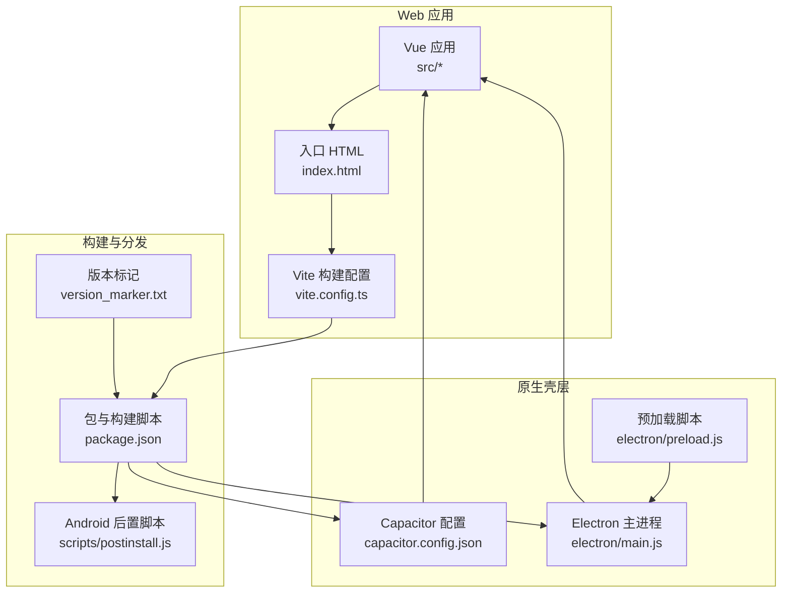
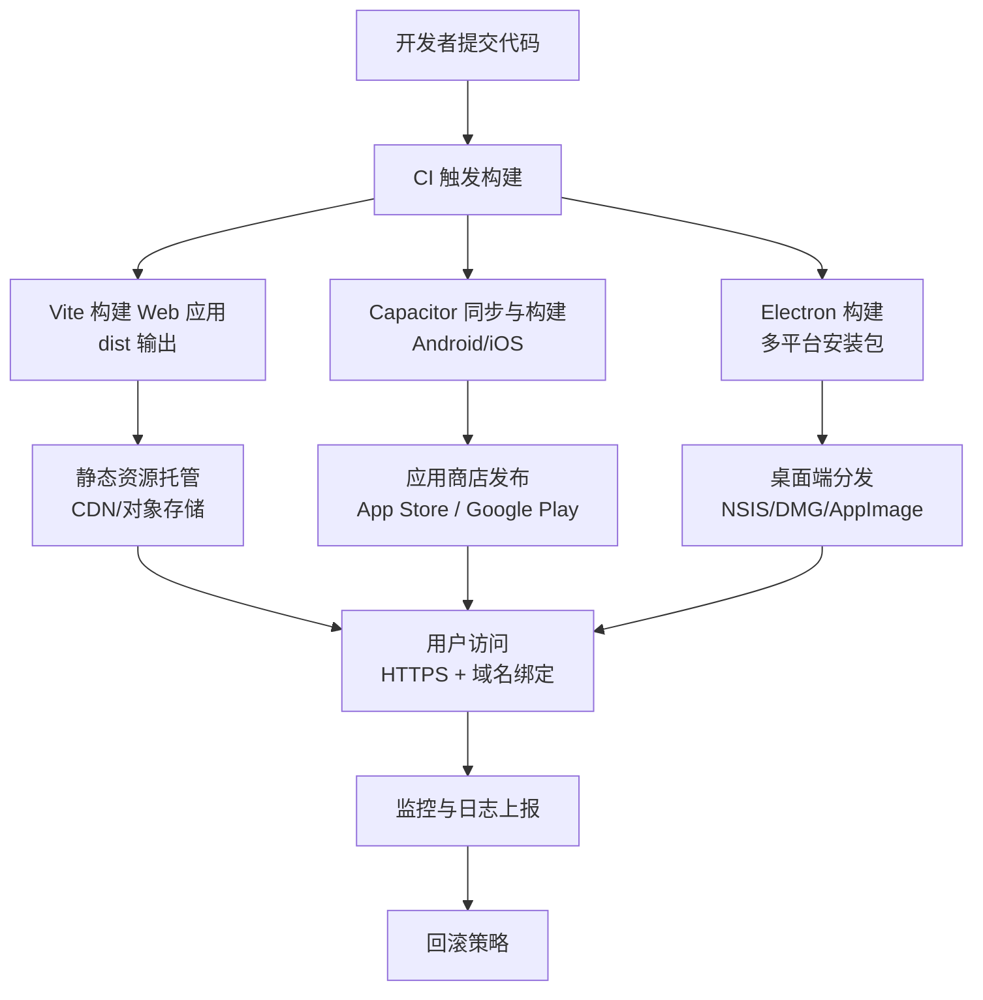
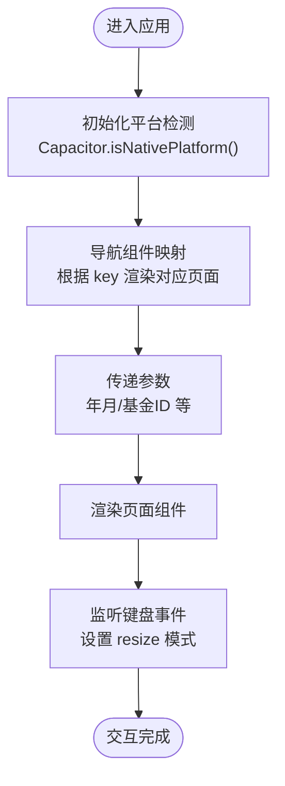
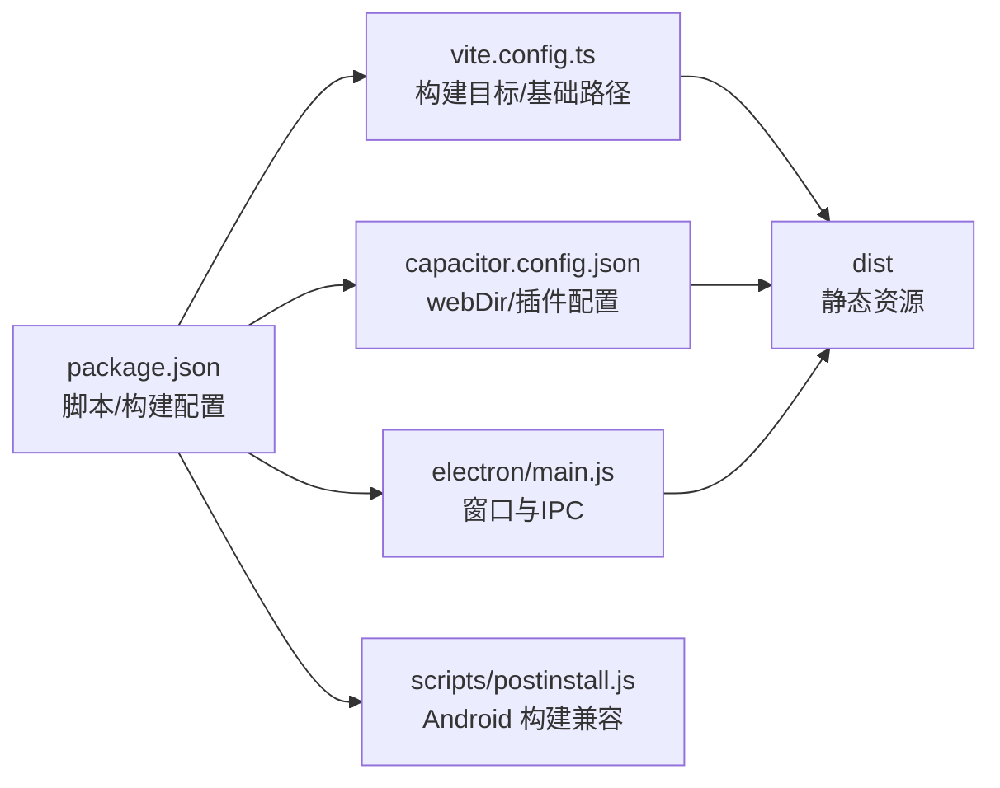

# 部署策略

<cite>
**本文引用的文件**
- [package.json](file://package.json)
- [vite.config.ts](file://vite.config.ts)
- [capacitor.config.json](file://capacitor.config.json)
- [electron/main.js](file://electron/main.js)
- [index.html](file://index.html)
- [scripts/postinstall.js](file://scripts/postinstall.js)
- [src/main.ts](file://src/main.ts)
- [src/App.vue](file://src/App.vue)
- [version_marker.txt](file://version_marker.txt)
</cite>

## 目录
1. [简介](#简介)
2. [项目结构](#项目结构)
3. [核心组件](#核心组件)
4. [架构总览](#架构总览)
5. [详细组件分析](#详细组件分析)
6. [依赖关系分析](#依赖关系分析)
7. [性能考量](#性能考量)
8. [故障排查指南](#故障排查指南)
9. [结论](#结论)
10. [附录](#附录)

## 简介
本文件面向财务应用程序的交付与运维团队，提供一套可落地的部署策略文档。内容覆盖多端部署形态（云部署、本地部署、企业内部分发）、Web静态资源托管（CDN、域名与 HTTPS）、桌面应用分发（应用商店与便携安装）、移动端发布（App Store 与 Google Play 流程要点）、自动化部署（CI/CD）与版本管理、监控与回滚策略，以及最佳实践建议。

## 项目结构
该工程采用前端单页应用（Vue 3 + Vite）与跨平台框架（Capacitor + Electron）结合的方式，形成“Web 应用 + 原生壳层”的混合架构。核心目录与职责如下：
- src：Vue 单页应用源码，包含组件、服务、状态管理与工具模块
- electron：Electron 主进程与预加载脚本，负责桌面端原生能力与窗口生命周期
- scripts：构建后置处理脚本，用于 Android 构建兼容性调整
- 根目录配置：包管理与构建脚本、Vite 配置、Capacitor 配置、入口 HTML、版本标记文件

图表来源
- [package.json:1-72](file://package.json#L1-L72)
- [vite.config.ts:1-11](file://vite.config.ts#L1-L11)
- [capacitor.config.json:1-23](file://capacitor.config.json#L1-L23)
- [electron/main.js:1-70](file://electron/main.js#L1-L70)
- [index.html:1-13](file://index.html#L1-L13)
- [scripts/postinstall.js:1-145](file://scripts/postinstall.js#L1-L145)
- [version_marker.txt:1-15](file://version_marker.txt#L1-L15)

章节来源
- [package.json:1-72](file://package.json#L1-L72)
- [vite.config.ts:1-11](file://vite.config.ts#L1-L11)
- [capacitor.config.json:1-23](file://capacitor.config.json#L1-L23)
- [electron/main.js:1-70](file://electron/main.js#L1-L70)
- [index.html:1-13](file://index.html#L1-L13)
- [scripts/postinstall.js:1-145](file://scripts/postinstall.js#L1-L145)
- [version_marker.txt:1-15](file://version_marker.txt#L1-L15)

## 核心组件
- Web 应用与构建
  - Vue 3 应用通过 Vite 构建，输出静态资源至 dist 目录；基础路径配置为相对路径，便于静态托管
  - Capacitor 将 Web 应用打包为移动端原生应用，同时 Electron 将其作为桌面端原生壳层运行
- 原生壳层
  - Electron 主进程负责创建窗口、加载开发或生产资源、处理 IPC 通信
  - 预加载脚本注入 Node 集成与上下文隔离策略，满足桌面端安全与功能需求
- 移动端与桌面端分发
  - Capacitor 提供 Android/iOS 原生桥接与构建能力
  - Electron Builder 支持 Windows、macOS、Linux 多平台安装包生成
- 版本与发布
  - 使用版本标记文件记录当前快照状态，便于回溯与一致性校验
  - 包脚本定义了开发、构建、预览与打包命令，支撑本地与 CI 环境

章节来源
- [src/main.ts:1-16](file://src/main.ts#L1-L16)
- [src/App.vue:1-195](file://src/App.vue#L1-L195)
- [electron/main.js:19-45](file://electron/main.js#L19-L45)
- [capacitor.config.json:1-23](file://capacitor.config.json#L1-L23)
- [package.json:7-17](file://package.json#L7-L17)
- [package.json:48-70](file://package.json#L48-L70)
- [version_marker.txt:1-15](file://version_marker.txt#L1-L15)

## 架构总览
下图展示从代码到多端发布的整体流程与关键节点：

图表来源
- [package.json:7-17](file://package.json#L7-L17)
- [vite.config.ts:7-10](file://vite.config.ts#L7-L10)
- [capacitor.config.json:4-5](file://capacitor.config.json#L4-L5)
- [electron/main.js:30-39](file://electron/main.js#L30-L39)

## 详细组件分析

### Web 应用与静态托管
- 构建产物与路径
  - Vite 配置使用相对基础路径，适合在子路径或 CDN 上线部署
  - 构建目标为现代浏览器标准，兼顾兼容性与性能
- 静态托管建议
  - CDN 集成：将 dist 目录上传至 CDN 或对象存储桶，开启缓存与压缩
  - 域名绑定：在 CDN/反向代理中配置自有域名与证书
  - HTTPS：启用 TLS 1.2+，强制跳转与 HSTS 策略
  - 缓存策略：静态资源设置长缓存，HTML 与动态接口短缓存或不缓存
- 安全加固
  - CSP、X-Frame-Options、X-Content-Type-Options 等头部
  - 仅允许必要的第三方资源来源，避免内联脚本与 eval

章节来源
- [vite.config.ts:7-10](file://vite.config.ts#L7-L10)
- [index.html:1-13](file://index.html#L1-L13)

### 桌面应用分发（Electron）
- 构建目标
  - Windows：NSIS 安装器与便携版
  - macOS：DMG 镜像
  - Linux：AppImage
- 分发渠道
  - 应用商店：Windows 可考虑 MS Store（需满足要求），macOS 可走 Mac App Store（需签名与公证）
  - 直接下载：官网或镜像站提供安装包与校验
  - 企业部署：通过组策略或 MDM 推送安装包与更新
- 安全与合规
  - 代码签名与公证（Windows/macOS）
  - 权限最小化与沙箱策略
  - 自动更新机制（如 Squirrel 或内置更新）

章节来源
- [package.json:48-70](file://package.json#L48-L70)
- [electron/main.js:30-39](file://electron/main.js#L30-L39)

### 移动端应用商店发布（Capacitor + Capacitor CLI）
- 发布前准备
  - Android：配置包名、签名、混淆与权限；确保 Capacitor 插件兼容（已通过后置脚本调整）
  - iOS：配置 Bundle ID、推送证书、能力与隐私清单
- App Store 与 Google Play 审核要点
  - 数据隐私与权限声明清晰
  - 隐私政策与用户协议链接有效
  - 应用描述与截图符合平台规范
  - 自动更新与后台任务合规
- 更新与回滚
  - 采用渐进式发布与灰度策略
  - 回滚至稳定版本需保留历史构建

章节来源
- [capacitor.config.json:1-23](file://capacitor.config.json#L1-L23)
- [scripts/postinstall.js:1-145](file://scripts/postinstall.js#L1-L145)

### 自动化部署（CI/CD）与版本管理
- CI/CD 流程建议
  - 触发条件：分支保护、PR 校验、标签触发
  - 步骤：安装依赖 → 单元测试/类型检查 → 构建 Web 与原生产物 → 上传制品与签名 → 发布到分发渠道
  - 制品管理：按版本号命名，保留构建日志与哈希值
- 版本管理最佳实践
  - 使用语义化版本（MAJOR.MINOR.PATCH）
  - 版本标记文件用于快照与一致性校验
  - 标签与发布说明同步更新
- 监控与回滚
  - 上线后监控关键指标（崩溃率、首屏时间、错误率）
  - 回滚策略：快速定位问题版本，回退到上一个稳定版本

章节来源
- [package.json:7-17](file://package.json#L7-L17)
- [version_marker.txt:1-15](file://version_marker.txt#L1-L15)

### 数据模型与导航（概念性说明）
以下为概念性数据流示意，帮助理解应用导航与数据传递逻辑（非特定源码映射）：

## 依赖关系分析
- 构建链路
  - package.json 定义脚本与 electron-builder 配置
  - Vite 负责 Web 应用构建，输出 dist
  - Capacitor 同步 Web 资源并生成原生工程
  - Electron 主进程在生产环境加载 dist/index.html
- 平台兼容性
  - Android 构建兼容性通过后置脚本统一 Java 版本与命名空间
  - Capacitor 配置指定 Web 目录与运行时行为

图表来源
- [package.json:7-17](file://package.json#L7-L17)
- [package.json:48-70](file://package.json#L48-L70)
- [vite.config.ts:7-10](file://vite.config.ts#L7-L10)
- [capacitor.config.json:4-5](file://capacitor.config.json#L4-L5)
- [electron/main.js:30-39](file://electron/main.js#L30-L39)
- [scripts/postinstall.js:1-145](file://scripts/postinstall.js#L1-L145)

章节来源
- [package.json:7-17](file://package.json#L7-L17)
- [package.json:48-70](file://package.json#L48-L70)
- [vite.config.ts:7-10](file://vite.config.ts#L7-L10)
- [capacitor.config.json:4-5](file://capacitor.config.json#L4-L5)
- [electron/main.js:30-39](file://electron/main.js#L30-L39)
- [scripts/postinstall.js:1-145](file://scripts/postinstall.js#L1-L145)

## 性能考量
- Web 应用
  - 代码分割与懒加载，减少首屏体积
  - 图片与静态资源压缩与按需加载
  - CDN 缓存与边缘计算优化
- 原生壳层
  - Electron 窗口与资源加载策略，避免阻塞主线程
  - Capacitor 插件按需引入，减少原生调用开销
- 构建与分发
  - 并行构建与增量构建，缩短 CI 时间
  - 制品签名与完整性校验，保障分发安全

## 故障排查指南
- 构建失败
  - 检查 Node 与 Gradle 版本是否满足后置脚本要求
  - 确认 Vite 构建基础路径与目标浏览器兼容性
- 运行异常
  - Electron 开发模式下打开调试工具，检查控制台与网络请求
  - 移动端检查 Capacitor 插件初始化与权限声明
- 分发问题
  - 校验签名与证书有效期
  - 确认应用商店审核材料与隐私政策链接有效

章节来源
- [scripts/postinstall.js:1-145](file://scripts/postinstall.js#L1-L145)
- [electron/main.js:30-39](file://electron/main.js#L30-L39)
- [capacitor.config.json:1-23](file://capacitor.config.json#L1-L23)

## 结论
本部署策略以“Web 应用 + 原生壳层”为核心，结合 CDN 静态托管、应用商店与桌面分发、CI/CD 自动化与版本管理，形成覆盖多端的一体化交付体系。建议团队在上线前完成安全与合规审查，在上线后建立监控与回滚机制，持续优化构建与分发效率。

## 附录
- 快速参考
  - Web 构建：npm run build
  - 桌面打包：npm run electron:build
  - 移动端初始化：npm run cap:init
  - 同步与构建：npm run cap:sync
  - 版本标记：version_marker.txt

章节来源
- [package.json:7-17](file://package.json#L7-L17)
- [version_marker.txt:1-15](file://version_marker.txt#L1-L15)