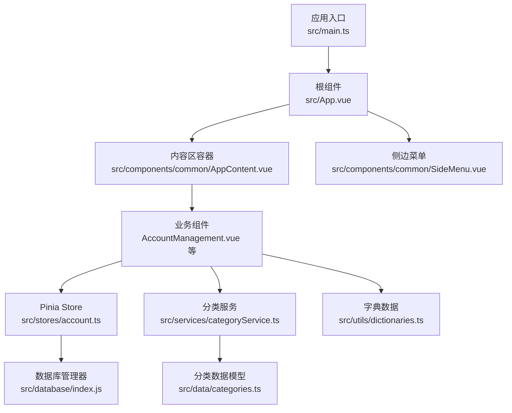
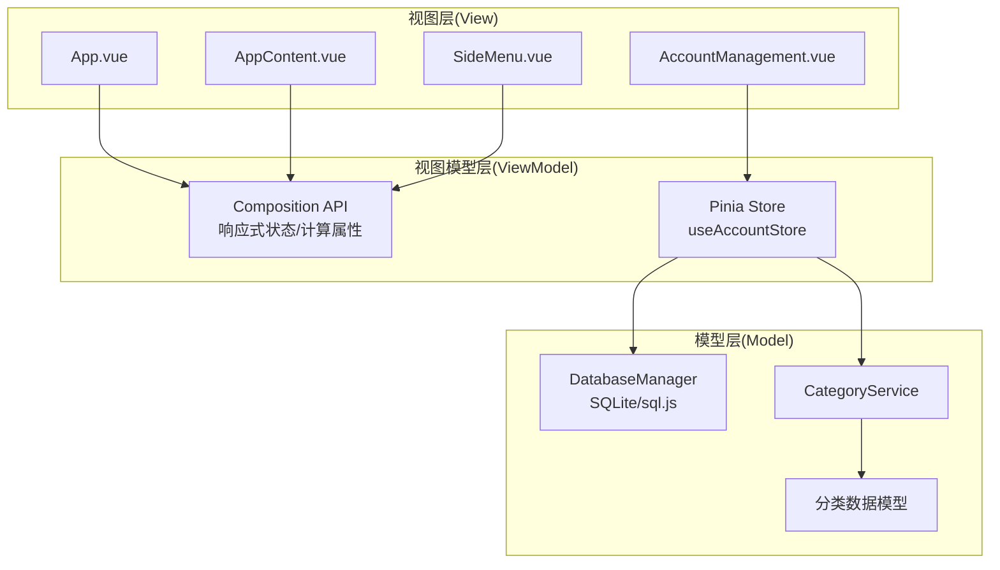
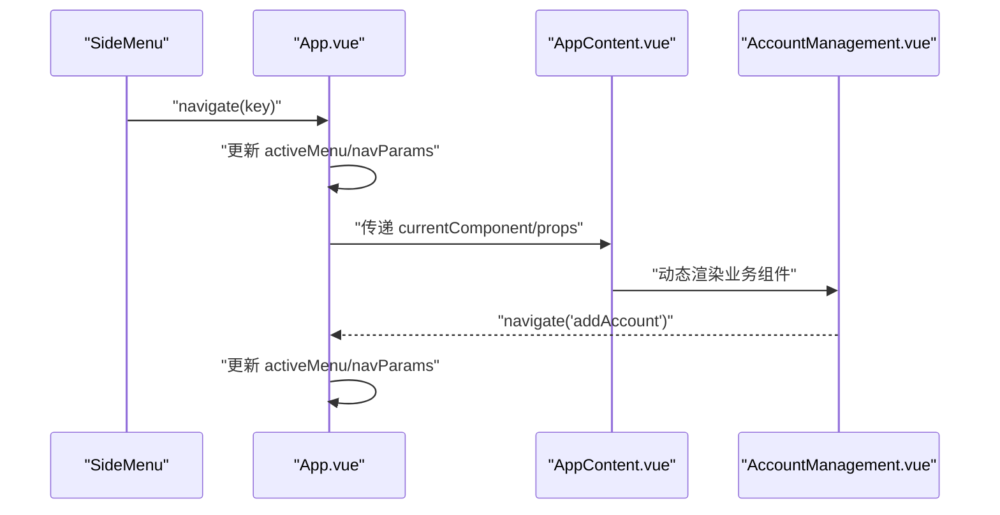
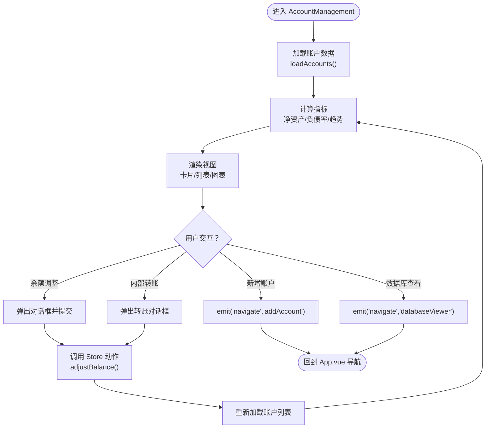
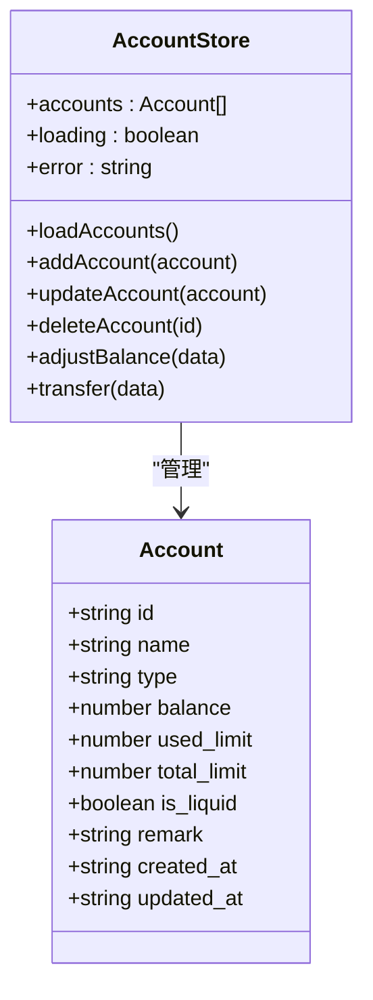
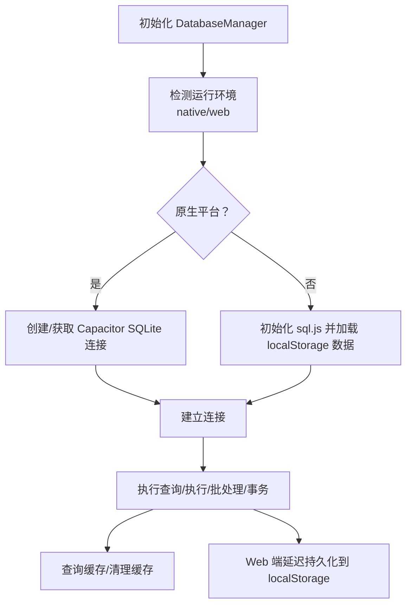
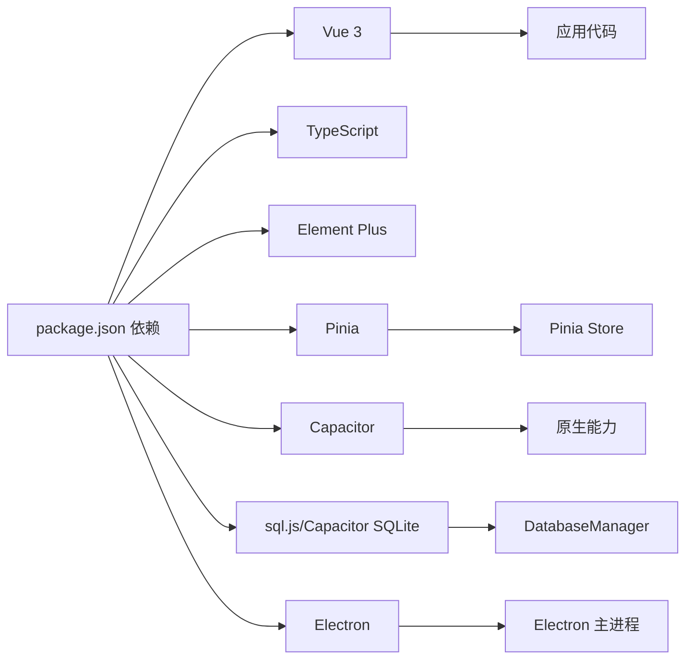

# 前端架构设计

<cite>
**本文引用的文件**
- [src/main.ts](file://src/main.ts)
- [src/App.vue](file://src/App.vue)
- [src/components/common/AppContent.vue](file://src/components/common/AppContent.vue)
- [src/components/common/SideMenu.vue](file://src/components/common/SideMenu.vue)
- [src/stores/account.ts](file://src/stores/account.ts)
- [src/components/mobile/account/AccountManagement.vue](file://src/components/mobile/account/AccountManagement.vue)
- [src/database/index.js](file://src/database/index.js)
- [src/services/categoryService.ts](file://src/services/categoryService.ts)
- [src/data/categories.ts](file://src/data/categories.ts)
- [src/utils/dictionaries.ts](file://src/utils/dictionaries.ts)
- [vite.config.ts](file://vite.config.ts)
- [tsconfig.json](file://tsconfig.json)
- [package.json](file://package.json)
- [index.html](file://index.html)
- [electron/main.js](file://electron/main.js)
</cite>

## 目录
1. [简介](#简介)
2. [项目结构](#项目结构)
3. [核心组件](#核心组件)
4. [架构总览](#架构总览)
5. [详细组件分析](#详细组件分析)
6. [依赖分析](#依赖分析)
7. [性能考虑](#性能考虑)
8. [故障排查指南](#故障排查指南)
9. [结论](#结论)
10. [附录](#附录)

## 简介
本文件面向财务应用程序的前端架构设计，围绕 Vue 3 + TypeScript 技术栈，系统性阐述 Composition API 的使用模式、MVVM 架构在前端的具体实现、组件化设计原则、路由导航体系、状态管理（Pinia）、以及数据持久化与服务层协作。文档通过多幅架构图与流程图，帮助开发者快速理解技术栈集成方式与关键交互路径。

## 项目结构
项目采用“按功能域分层 + 组件化”的组织方式：
- 应用入口与平台集成：入口文件负责初始化应用、安装插件与挂载根组件；同时支持 Capacitor 与 Electron 平台能力。
- 视图层：以 App.vue 为中心，通过动态组件与事件冒泡实现页面切换与参数传递。
- 组件层：公共组件（头部、底部、侧边菜单、内容区）与业务组件（账户、资产、负债、财务知识等）分离。
- 状态层：Pinia Store 管理账户等核心领域状态。
- 数据访问层：统一数据库管理器封装 Capacitor SQLite 与 sql.js 的差异，提供查询、执行、事务与批处理能力。
- 服务层：分类服务负责分类数据的增删改查与默认数据初始化。
- 工具与字典：集中管理枚举与字典数据，供组件与服务复用。

**图表来源**
- [src/main.ts:1-16](file://src/main.ts#L1-L16)
- [src/App.vue:1-195](file://src/App.vue#L1-L195)
- [src/components/common/AppContent.vue:1-51](file://src/components/common/AppContent.vue#L1-L51)
- [src/components/common/SideMenu.vue:1-255](file://src/components/common/SideMenu.vue#L1-L255)
- [src/stores/account.ts:1-273](file://src/stores/account.ts#L1-L273)
- [src/components/mobile/account/AccountManagement.vue:1-650](file://src/components/mobile/account/AccountManagement.vue#L1-L650)
- [src/database/index.js:1-800](file://src/database/index.js#L1-L800)
- [src/services/categoryService.ts:1-260](file://src/services/categoryService.ts#L1-L260)
- [src/data/categories.ts:1-45](file://src/data/categories.ts#L1-L45)
- [src/utils/dictionaries.ts:1-90](file://src/utils/dictionaries.ts#L1-L90)

**章节来源**
- [src/main.ts:1-16](file://src/main.ts#L1-L16)
- [src/App.vue:1-195](file://src/App.vue#L1-L195)
- [vite.config.ts:1-11](file://vite.config.ts#L1-L11)
- [tsconfig.json:1-25](file://tsconfig.json#L1-L25)
- [package.json:1-72](file://package.json#L1-L72)
- [index.html:1-13](file://index.html#L1-L13)
- [electron/main.js:1-70](file://electron/main.js#L1-L70)

## 核心组件
- 应用入口与平台集成
  - 初始化 Vue 应用、安装 Pinia 与 Element Plus 插件，挂载根组件。
  - 检测原生平台并配置 Capacitor 能力（如键盘行为）。
- 根组件与导航
  - 维护当前活动菜单与导航参数，构建组件映射表，动态渲染内容区。
  - 通过事件向上冒泡实现跨层级导航与日期参数传递。
- 动态内容区
  - 以组件占位符承载业务页面，透传属性与事件，实现解耦。
- 侧边菜单
  - 提供导航触发与遮罩层交互，关闭时派发导航事件。

**章节来源**
- [src/main.ts:1-16](file://src/main.ts#L1-L16)
- [src/App.vue:64-137](file://src/App.vue#L64-L137)
- [src/components/common/AppContent.vue:1-22](file://src/components/common/AppContent.vue#L1-L22)
- [src/components/common/SideMenu.vue:53-89](file://src/components/common/SideMenu.vue#L53-L89)

## 架构总览
本应用采用 MVVM 架构模式：
- Model：数据库管理器与服务层，负责数据持久化与业务规则。
- View：Vue 组件树，负责视图渲染与用户交互。
- ViewModel：Composition API 与 Pinia Store，负责状态管理与数据绑定。

**图表来源**
- [src/App.vue:22-172](file://src/App.vue#L22-L172)
- [src/components/common/AppContent.vue:12-21](file://src/components/common/AppContent.vue#L12-L21)
- [src/components/common/SideMenu.vue:49-89](file://src/components/common/SideMenu.vue#L49-L89)
- [src/stores/account.ts:27-273](file://src/stores/account.ts#L27-L273)
- [src/database/index.js:21-190](file://src/database/index.js#L21-L190)
- [src/services/categoryService.ts:8-260](file://src/services/categoryService.ts#L8-L260)
- [src/data/categories.ts:1-45](file://src/data/categories.ts#L1-L45)

## 详细组件分析

### 组件A：App.vue（MVVM 中的 ViewModel 与 View 的桥接）
- 职责分离
  - ViewModel：维护 activeMenu、navParams、selectedYear/month 等状态；构建 currentComponent 与 componentProps 的计算映射；处理导航与日期事件。
  - View：模板层通过动态组件渲染业务页面，接收事件并向上冒泡。
- 导航机制
  - 支持两种导航格式：字符串 key 或 { key, params } 对象；统一写入 activeMenu 与 navParams。
- 参数传递
  - 根据 activeMenu 条件注入 year/month、fundId 等参数至内容区组件。

**图表来源**
- [src/components/common/SideMenu.vue:85-89](file://src/components/common/SideMenu.vue#L85-L89)
- [src/App.vue:119-137](file://src/App.vue#L119-L137)
- [src/components/common/AppContent.vue:3-8](file://src/components/common/AppContent.vue#L3-L8)
- [src/components/mobile/account/AccountManagement.vue:297-308](file://src/components/mobile/account/AccountManagement.vue#L297-L308)

**章节来源**
- [src/App.vue:64-137](file://src/App.vue#L64-L137)
- [src/components/common/AppContent.vue:1-22](file://src/components/common/AppContent.vue#L1-L22)
- [src/components/common/SideMenu.vue:1-255](file://src/components/common/SideMenu.vue#L1-L255)

### 组件B：AccountManagement.vue（业务组件与 Pinia 集成）
- 状态绑定
  - 通过 useAccountStore 访问账户列表与状态；在 mounted/onActivated 生命周期中加载数据。
- 计算属性
  - 基于账户数据计算净资产、负债率、资产趋势等指标，驱动视图更新。
- 交互事件
  - 通过 emit('navigate', key) 触发 App.vue 的导航逻辑；对话框与表单交互调用 Store 的动作方法。

**图表来源**
- [src/components/mobile/account/AccountManagement.vue:158-340](file://src/components/mobile/account/AccountManagement.vue#L158-L340)
- [src/stores/account.ts:34-100](file://src/stores/account.ts#L34-L100)

**章节来源**
- [src/components/mobile/account/AccountManagement.vue:158-340](file://src/components/mobile/account/AccountManagement.vue#L158-L340)
- [src/stores/account.ts:27-273](file://src/stores/account.ts#L27-L273)

### 组件C：Pinia Store（账户管理）
- 类型系统
  - 使用 TypeScript 接口 Account 定义数据结构，确保类型安全。
- 状态与动作
  - state：accounts、loading、error。
  - actions：loadAccounts/addAccount/updateAccount/deleteAccount/adjustBalance/transfer。
- 数据一致性
  - 通过事务与批量执行保证多步操作的一致性；异常时设置 error 并抛出。

**图表来源**
- [src/stores/account.ts:11-32](file://src/stores/account.ts#L11-L32)
- [src/stores/account.ts:27-273](file://src/stores/account.ts#L27-L273)

**章节来源**
- [src/stores/account.ts:11-32](file://src/stores/account.ts#L11-L32)
- [src/stores/account.ts:34-273](file://src/stores/account.ts#L34-L273)

### 组件D：数据库管理器（数据持久化）
- 双环境适配
  - 移动端：Capacitor SQLite；Web 端：sql.js + localStorage 持久化。
- 连接与缓存
  - 单例连接、连接状态检测、查询缓存与批量/事务执行。
- 表结构与索引
  - 自动初始化多表结构与索引，兼容历史版本字段升级。

**图表来源**
- [src/database/index.js:21-190](file://src/database/index.js#L21-L190)
- [src/database/index.js:420-776](file://src/database/index.js#L420-L776)

**章节来源**
- [src/database/index.js:21-190](file://src/database/index.js#L21-L190)
- [src/database/index.js:420-776](file://src/database/index.js#L420-L776)

### 组件E：分类服务与字典
- 分类服务
  - 提供分类 CRUD 与默认分类初始化；合并默认分类与数据库分类，避免重复。
- 字典数据
  - 集中管理账户类型、负债类型、还款方式、目标类型等枚举，供组件与服务使用。

**章节来源**
- [src/services/categoryService.ts:8-260](file://src/services/categoryService.ts#L8-L260)
- [src/data/categories.ts:1-45](file://src/data/categories.ts#L1-L45)
- [src/utils/dictionaries.ts:1-90](file://src/utils/dictionaries.ts#L1-L90)

## 依赖分析
- 构建与运行时
  - Vite 作为构建工具；Vue 3 + TypeScript；Element Plus UI 组件库。
- 状态管理
  - Pinia 提供轻量级状态管理，与 Vue 3 响应式系统深度集成。
- 数据持久化
  - 数据库管理器抽象 Capacitor SQLite 与 sql.js 的差异，统一查询/执行接口。
- 平台集成
  - Electron 主进程负责窗口创建与 IPC；Capacitor 提供原生能力（如键盘）。

**图表来源**
- [package.json:19-36](file://package.json#L19-L36)
- [src/main.ts:1-16](file://src/main.ts#L1-L16)
- [src/database/index.js:8-10](file://src/database/index.js#L8-L10)
- [electron/main.js:5-70](file://electron/main.js#L5-L70)

**章节来源**
- [package.json:1-72](file://package.json#L1-L72)
- [vite.config.ts:1-11](file://vite.config.ts#L1-L11)
- [tsconfig.json:1-25](file://tsconfig.json#L1-L25)
- [src/main.ts:1-16](file://src/main.ts#L1-L16)

## 性能考虑
- 数据库层
  - 单例连接与连接状态检测，避免重复连接；查询缓存减少重复请求；批处理与事务提升写入效率。
- Web 环境
  - sql.js 结果延迟持久化到 localStorage，降低频繁写入成本。
- 组件层
  - 使用计算属性与条件渲染，减少不必要的重渲染；动态组件按需加载，降低初始包体。
- 构建与运行
  - Vite ES2015 目标与按需导入策略，配合 TypeScript 严格模式，提升编译与运行时性能。

[本节为通用性能建议，无需特定文件引用]

## 故障排查指南
- 数据库连接失败
  - 检查 DatabaseManager 的连接逻辑与环境判断；确认 Capacitor SQLite 或 sql.js 初始化成功。
- Pinia 动作异常
  - 关注 Store actions 的错误捕获与 error 字段设置；核对数据库执行语句与事务边界。
- 导航参数丢失
  - 确认 App.vue 的 navigateTo 方法正确解析 key/params 并更新 navParams；检查子组件是否读取 props。
- Web 端数据未持久化
  - 检查 debouncedSave 定时器与 localStorage 写入逻辑；确认未被浏览器隐私模式阻止。

**章节来源**
- [src/database/index.js:184-190](file://src/database/index.js#L184-L190)
- [src/stores/account.ts:47-52](file://src/stores/account.ts#L47-L52)
- [src/App.vue:119-137](file://src/App.vue#L119-L137)
- [src/database/index.js:379-408](file://src/database/index.js#L379-L408)

## 结论
该财务应用以 Vue 3 + TypeScript 为基础，结合 Composition API 与 Pinia 实现清晰的 MVVM 分层；通过动态组件与事件机制实现灵活的导航与参数传递；数据库层统一了移动端与 Web 端的数据持久化差异；服务层与字典数据提升了可维护性与扩展性。整体架构具备良好的模块化、可测试性与跨平台能力。

[本节为总结性内容，无需特定文件引用]

## 附录
- 构建与启动
  - 开发：Vite 启动本地服务；Electron 开发：并发启动前端与 Electron 主进程。
  - 构建：Vite 打包；Electron 构建：打包前端并集成 Electron。
- 平台能力
  - Capacitor 提供原生能力（如键盘），Electron 主进程负责窗口与 IPC。

**章节来源**
- [package.json:7-17](file://package.json#L7-L17)
- [index.html:1-13](file://index.html#L1-L13)
- [electron/main.js:19-45](file://electron/main.js#L19-L45)