# 数据层架构设计

<cite>
**本文档引用的文件**
- [src/database/index.js](file://src/database/index.js)
- [src/database/adapter.js](file://src/database/adapter.js)
- [src/stores/account.ts](file://src/stores/account.ts)
- [src/services/account/accountService.ts](file://src/services/account/accountService.ts)
- [src/services/asset/assetService.ts](file://src/services/asset/assetService.ts)
- [src/services/asset/fundService.ts](file://src/services/asset/fundService.ts)
- [src/services/asset/stockService.ts](file://src/services/asset/stockService.ts)
- [src/services/liability/liabilityService.ts](file://src/services/liability/liabilityService.ts)
- [src/services/categoryService.ts](file://src/services/categoryService.ts)
- [src/data/categories.ts](file://src/data/categories.ts)
- [src/components/mobile/DatabaseViewer.vue](file://src/components/mobile/DatabaseViewer.vue)
- [src/components/mobile/account/AccountManagement.vue](file://src/components/mobile/account/AccountManagement.vue)
- [src/components/mobile/asset/AssetManagement.vue](file://src/components/mobile/asset/AssetManagement.vue)
- [src/main.ts](file://src/main.ts)
- [package.json](file://package.json)
</cite>

## 更新摘要
**所做更改**
- 新增服务层架构设计章节，详细说明业务逻辑中间层的实现
- 更新数据访问层架构图，反映服务层的引入
- 新增服务层与数据访问层的交互模式说明
- 更新数据流图，展示服务层在整体架构中的作用
- 新增服务层API设计和事务处理机制说明

## 目录
1. [简介](#简介)
2. [项目结构](#项目结构)
3. [核心组件](#核心组件)
4. [架构概览](#架构概览)
5. [详细组件分析](#详细组件分析)
6. [服务层架构设计](#服务层架构设计)
7. [依赖关系分析](#依赖关系分析)
8. [性能考虑](#性能考虑)
9. [故障排除指南](#故障排除指南)
10. [结论](#结论)

## 简介

本财务应用程序采用现代化的三层架构设计，支持Capacitor SQLite（移动端原生）和SQL.js（Web端）两种数据库实现。该架构通过统一的DatabaseManager单例模式管理数据库连接，实现了跨平台的数据持久化解决方案。系统采用Vue 3 + Pinia的状态管理模式，结合CRUD抽象封装、事务处理和错误处理机制，构建了一个完整的财务数据管理系统。

**更新** 本次更新引入了服务层作为业务逻辑中间层，提供更好的代码组织和可维护性，实现了表现层、业务逻辑层和数据访问层的清晰分离。

## 项目结构

财务应用程序的数据层采用模块化设计，主要包含以下核心模块：

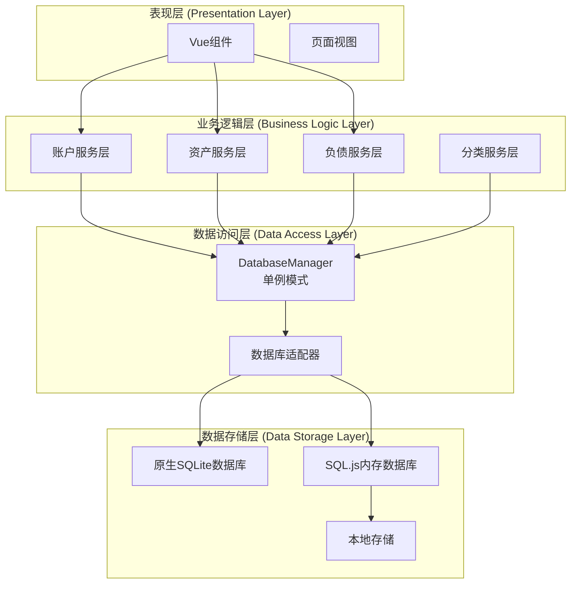

**图表来源**
- [src/database/index.js:1-884](file://src/database/index.js#L1-L884)
- [src/stores/account.ts:1-273](file://src/stores/account.ts#L1-L273)
- [src/services/account/accountService.ts:1-221](file://src/services/account/accountService.ts#L1-L221)
- [src/services/asset/assetService.ts:1-165](file://src/services/asset/assetService.ts#L1-L165)
- [src/services/liability/liabilityService.ts:1-182](file://src/services/liability/liabilityService.ts#L1-L182)
- [src/services/categoryService.ts:1-260](file://src/services/categoryService.ts#L1-L260)

**章节来源**
- [src/database/index.js:1-884](file://src/database/index.js#L1-L884)
- [src/stores/account.ts:1-273](file://src/stores/account.ts#L1-L273)
- [src/services/account/accountService.ts:1-221](file://src/services/account/accountService.ts#L1-L221)
- [src/services/asset/assetService.ts:1-165](file://src/services/asset/assetService.ts#L1-L165)
- [src/services/liability/liabilityService.ts:1-182](file://src/services/liability/liabilityService.ts#L1-L182)
- [src/services/categoryService.ts:1-260](file://src/services/categoryService.ts#L1-L260)

## 核心组件

### DatabaseManager 单例模式

DatabaseManager是整个数据层的核心，实现了统一的数据库连接管理和CRUD操作封装：

#### 主要特性：
- **双模式支持**：自动检测平台环境，选择合适的数据库实现
- **连接池管理**：确保单一数据库连接实例，避免并发问题
- **查询缓存**：内置Map缓存机制，提升查询性能
- **事务处理**：支持批量操作和原子性事务
- **错误处理**：完善的异常捕获和错误恢复机制

#### 关键方法：
- `getDB()`: 获取数据库连接实例
- `query()`: 执行查询操作
- `run()`: 执行插入、更新、删除操作
- `batch()`: 批量执行SQL语句
- `executeTransaction()`: 执行事务操作

**章节来源**
- [src/database/index.js:20-190](file://src/database/index.js#L20-L190)
- [src/database/index.js:198-374](file://src/database/index.js#L198-L374)

### 数据库适配器

Adapter模块负责处理不同平台的SQLite实现差异：

#### 平台检测：
- **原生平台**：使用Capacitor SQLite插件
- **Web平台**：使用SQL.js进行内存数据库操作
- **自动切换**：根据运行环境动态选择数据库实现

**章节来源**
- [src/database/adapter.js:1-34](file://src/database/adapter.js#L1-L34)

## 架构概览

财务应用程序采用现代化的三层架构设计，实现了清晰的职责分离：

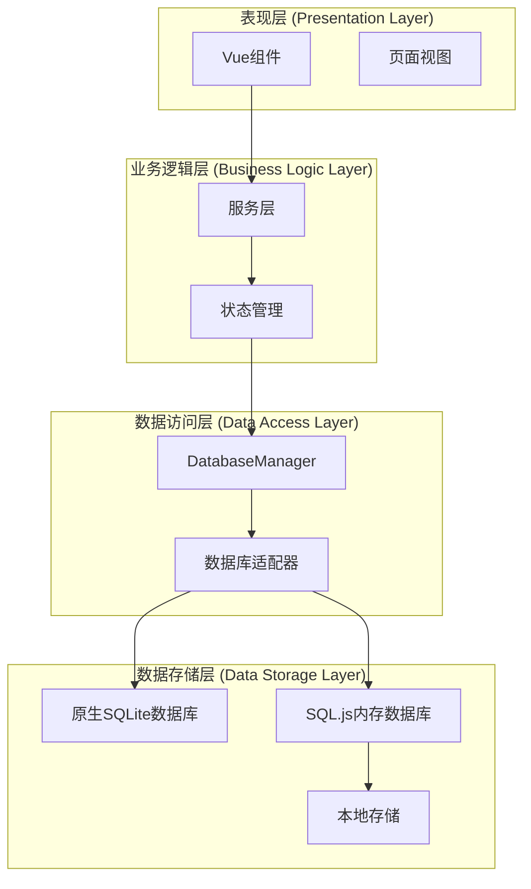

**更新** 新增服务层作为业务逻辑中间层，位于表现层和数据访问层之间，提供更好的代码组织和可维护性。

**图表来源**
- [src/database/index.js:1-884](file://src/database/index.js#L1-L884)
- [src/stores/account.ts:1-273](file://src/stores/account.ts#L1-L273)
- [src/services/account/accountService.ts:1-221](file://src/services/account/accountService.ts#L1-L221)
- [src/services/asset/assetService.ts:1-165](file://src/services/asset/assetService.ts#L1-L165)
- [src/services/liability/liabilityService.ts:1-182](file://src/services/liability/liabilityService.ts#L1-L182)
- [src/services/categoryService.ts:1-260](file://src/services/categoryService.ts#L1-L260)

## 详细组件分析

### 数据库架构设计

#### 核心实体关系映射：

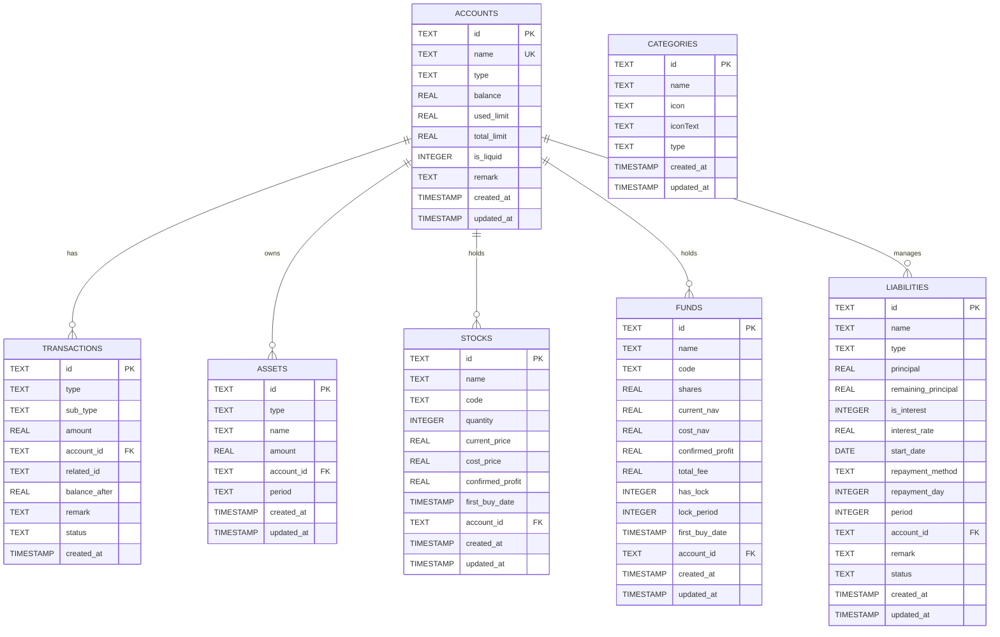

**图表来源**
- [src/database/index.js:433-689](file://src/database/index.js#L433-L689)

#### 数据库初始化流程：

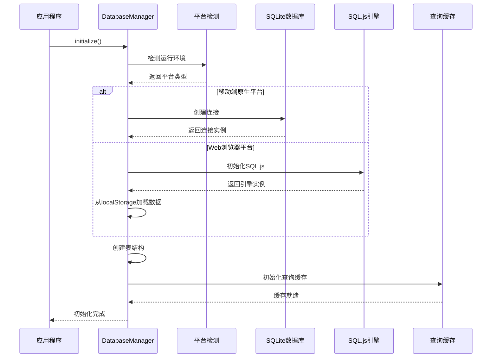

**图表来源**
- [src/database/index.js:420-776](file://src/database/index.js#L420-L776)

**章节来源**
- [src/database/index.js:433-776](file://src/database/index.js#L433-L776)

### 数据访问接口设计

#### CRUD操作抽象封装：

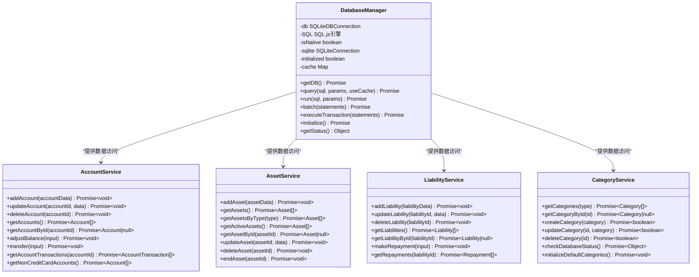

**图表来源**
- [src/database/index.js:20-884](file://src/database/index.js#L20-L884)
- [src/services/account/accountService.ts:1-221](file://src/services/account/accountService.ts#L1-L221)
- [src/services/asset/assetService.ts:1-165](file://src/services/asset/assetService.ts#L1-L165)
- [src/services/liability/liabilityService.ts:1-182](file://src/services/liability/liabilityService.ts#L1-L182)
- [src/services/categoryService.ts:1-260](file://src/services/categoryService.ts#L1-L260)

#### 事务处理机制：

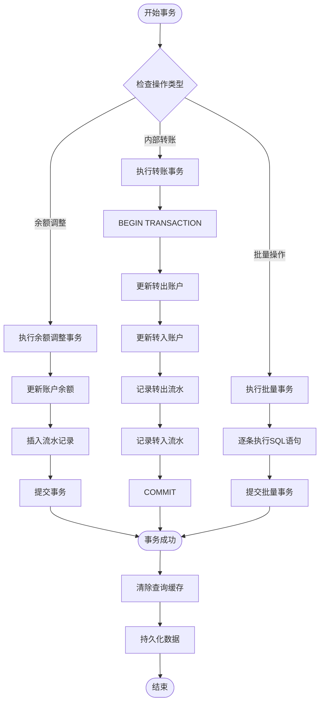

**图表来源**
- [src/stores/account.ts:145-270](file://src/stores/account.ts#L145-L270)
- [src/database/index.js:354-374](file://src/database/index.js#L354-L374)

**章节来源**
- [src/stores/account.ts:145-270](file://src/stores/account.ts#L145-L270)
- [src/database/index.js:354-374](file://src/database/index.js#L354-L374)

### 状态管理与数据层交互

#### Pinia Store与数据库的双向绑定：

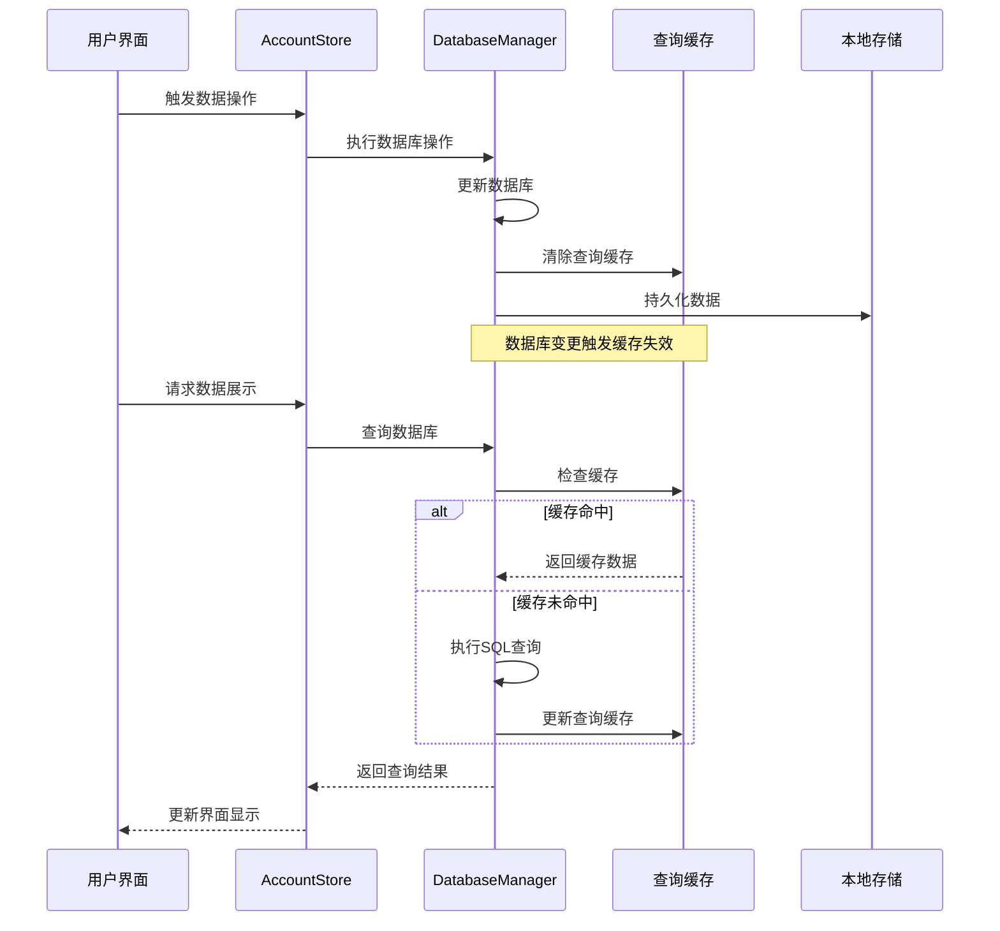

**图表来源**
- [src/stores/account.ts:38-100](file://src/stores/account.ts#L38-L100)
- [src/database/index.js:198-264](file://src/database/index.js#L198-L264)

#### 数据持久化策略：

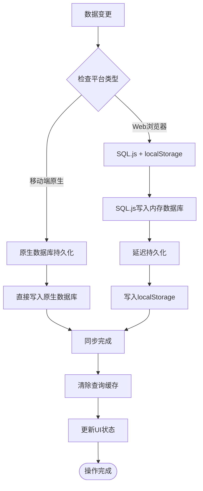

**图表来源**
- [src/database/index.js:379-408](file://src/database/index.js#L379-L408)
- [src/database/index.js:150-178](file://src/database/index.js#L150-L178)

**章节来源**
- [src/stores/account.ts:38-100](file://src/stores/account.ts#L38-L100)
- [src/database/index.js:379-408](file://src/database/index.js#L379-L408)

## 服务层架构设计

### 服务层概述

服务层作为业务逻辑中间层，位于表现层和数据访问层之间，提供更好的代码组织和可维护性。服务层封装了复杂的业务规则和数据处理逻辑，向表现层暴露简洁的API接口。

#### 核心特性：
- **业务逻辑封装**：集中处理复杂的业务规则和数据验证
- **事务管理**：协调多个数据库操作的原子性执行
- **数据转换**：在数据库实体和业务实体之间进行转换
- **错误处理**：统一处理业务异常和错误传播
- **可测试性**：提供清晰的接口，便于单元测试

### 服务层设计模式

#### 单例模式与工厂模式结合：

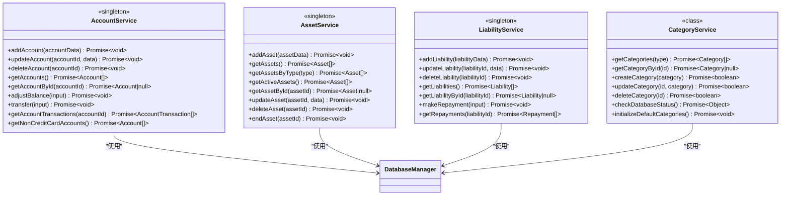

**图表来源**
- [src/services/account/accountService.ts:1-221](file://src/services/account/accountService.ts#L1-L221)
- [src/services/asset/assetService.ts:1-165](file://src/services/asset/assetService.ts#L1-L165)
- [src/services/liability/liabilityService.ts:1-182](file://src/services/liability/liabilityService.ts#L1-L182)
- [src/services/categoryService.ts:1-260](file://src/services/categoryService.ts#L1-L260)

### 服务层API设计

#### 账户服务API：

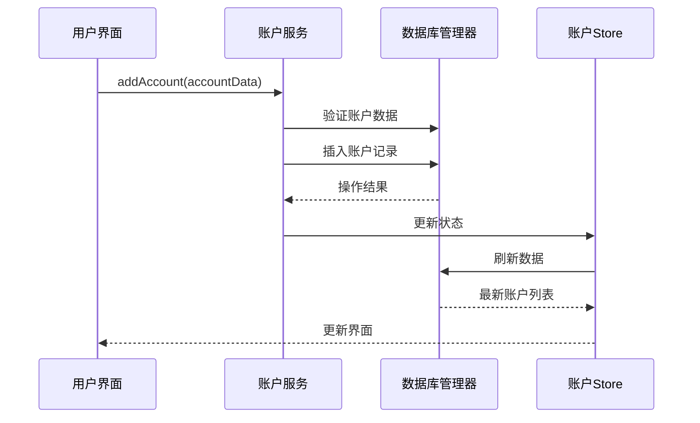

**图表来源**
- [src/services/account/accountService.ts:12-28](file://src/services/account/accountService.ts#L12-L28)
- [src/stores/account.ts:59-100](file://src/stores/account.ts#L59-L100)

#### 资产服务API：

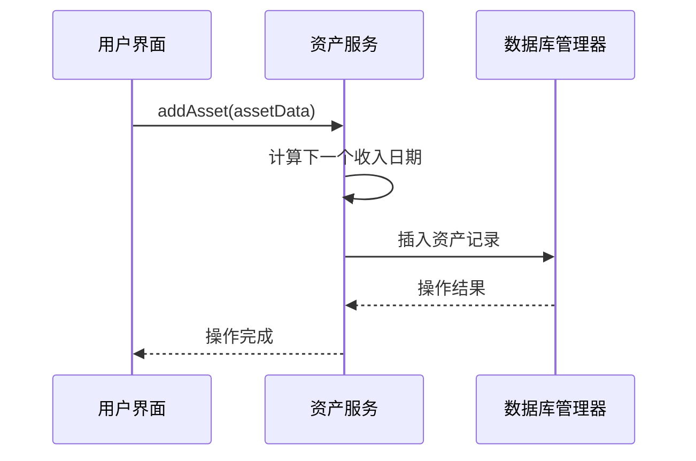

**图表来源**
- [src/services/asset/assetService.ts:48-71](file://src/services/asset/assetService.ts#L48-L71)

#### 负债服务API：

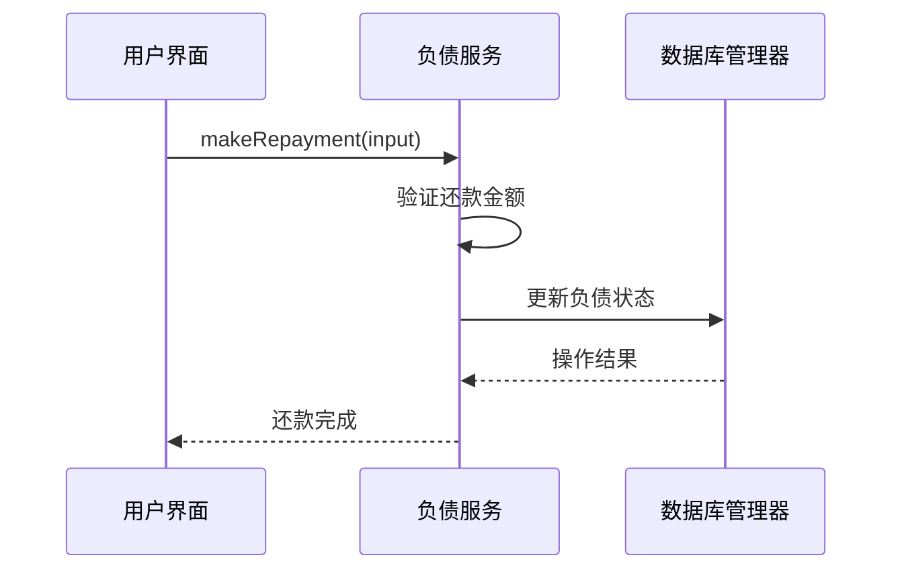

**图表来源**
- [src/services/liability/liabilityService.ts:129-171](file://src/services/liability/liabilityService.ts#L129-L171)

### 事务处理机制

#### 服务层事务管理：

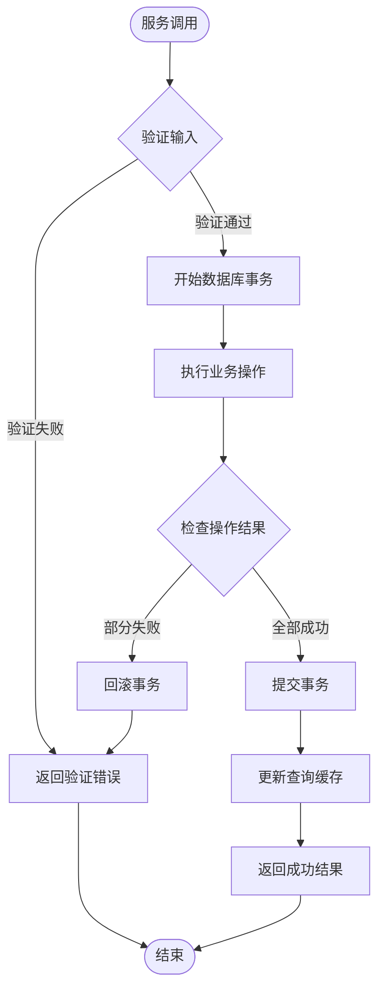

**图表来源**
- [src/services/account/accountService.ts:102-134](file://src/services/account/accountService.ts#L102-L134)
- [src/services/liability/liabilityService.ts:129-171](file://src/services/liability/liabilityService.ts#L129-L171)

**章节来源**
- [src/services/account/accountService.ts:1-221](file://src/services/account/accountService.ts#L1-L221)
- [src/services/asset/assetService.ts:1-165](file://src/services/asset/assetService.ts#L1-L165)
- [src/services/liability/liabilityService.ts:1-182](file://src/services/liability/liabilityService.ts#L1-L182)
- [src/services/categoryService.ts:1-260](file://src/services/categoryService.ts#L1-L260)

## 依赖关系分析

### 外部依赖管理

财务应用程序采用现代化的依赖管理体系：

```mermaid
graph TB
subgraph "核心依赖"
Vue[Vue 3.5.32]
Pinia[Pinia 2.1.7]
ElementPlus[Element Plus]
end
subgraph "数据库依赖"
CapacitorSQLite[@capacitor-community/sqlite 6.0.1]
SQLJS[sql.js 1.10.3]
CapacitorCore[@capacitor/core 6.1.2]
end
subgraph "工具库"
ChartJS[Chart.js 4.5.1]
ECharts[ECharts 5.6.0]
DateFns[date-fns 4.1.0]
CryptoJS[CryptoJS 4.2.0]
end
subgraph "开发工具"
Vite[Vite 5.3.1]
TypeScript[TypeScript 5.2.2]
Electron[Electron 29.3.1]
end
Vue --> Pinia
Vue --> ElementPlus
Vue --> CapacitorSQLite
Vue --> SQLJS
Vue --> ChartJS
Vue --> ECharts
```

**图表来源**
- [package.json:19-47](file://package.json#L19-L47)

### 数据流图

#### 完整数据流架构：

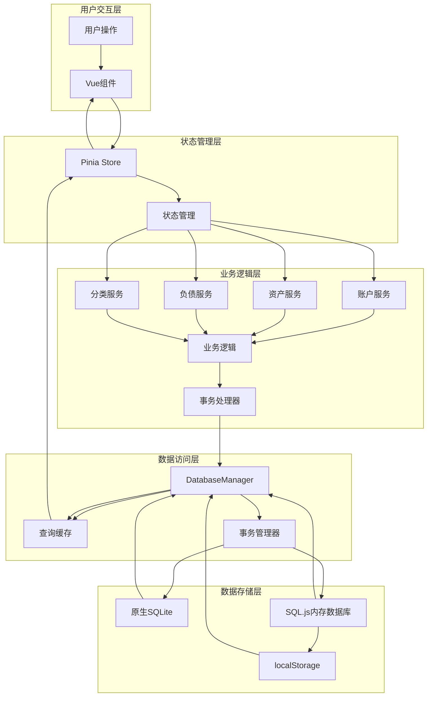

**更新** 新增服务层在整体数据流中的位置，展示其作为业务逻辑中间层的作用。

**图表来源**
- [src/database/index.js:1-884](file://src/database/index.js#L1-L884)
- [src/stores/account.ts:1-273](file://src/stores/account.ts#L1-L273)
- [src/services/account/accountService.ts:1-221](file://src/services/account/accountService.ts#L1-L221)
- [src/services/asset/assetService.ts:1-165](file://src/services/asset/assetService.ts#L1-L165)
- [src/services/liability/liabilityService.ts:1-182](file://src/services/liability/liabilityService.ts#L1-L182)
- [src/services/categoryService.ts:1-260](file://src/services/categoryService.ts#L1-L260)

**章节来源**
- [package.json:19-72](file://package.json#L19-L72)
- [src/database/index.js:1-884](file://src/database/index.js#L1-L884)

## 性能考虑

### 查询优化策略

#### 缓存机制：
- **查询结果缓存**：使用Map结构存储查询结果
- **缓存键生成**：基于SQL语句和参数组合生成唯一键
- **缓存失效**：数据变更时自动清除相关缓存

#### 索引优化：
- **账户表索引**：按类型和流动性属性建立索引
- **交易表索引**：按账户ID和创建时间建立索引
- **资产表索引**：按账户ID建立索引

#### 批处理优化：
- **批量SQL执行**：减少数据库往返次数
- **事务批处理**：确保数据一致性
- **延迟持久化**：Web环境下减少localStorage写入频率

### 内存管理

#### 数据库连接管理：
- **单例模式**：确保全局只有一个数据库连接实例
- **连接状态监控**：实时跟踪连接状态和性能指标
- **资源清理**：及时释放数据库连接和缓存资源

#### 内存数据库优化：
- **SQL.js集成**：在Web环境中提供高性能的内存数据库
- **自动持久化**：定期将内存数据持久化到localStorage
- **数据压缩**：优化数据存储格式，减少内存占用

### 服务层性能优化

#### 服务实例管理：
- **单例模式**：确保服务层实例的唯一性和共享性
- **异步处理**：使用Promise和async/await提高响应性
- **错误缓存**：避免重复的数据库查询和计算

#### 业务逻辑优化：
- **批量操作**：合并多个相关的数据库操作
- **数据预处理**：在服务层进行数据验证和格式化
- **事务边界**：合理定义事务范围，避免长时间锁定

## 故障排除指南

### 常见问题诊断

#### 数据库连接问题：
1. **连接超时**：检查网络连接和数据库服务器状态
2. **权限错误**：验证数据库访问权限和认证信息
3. **连接池耗尽**：监控连接使用情况，合理配置连接池大小

#### 数据一致性问题：
1. **事务回滚**：检查事务边界和异常处理逻辑
2. **并发冲突**：使用适当的锁机制和重试策略
3. **数据竞争**：实现乐观锁或悲观锁机制

#### 性能问题：
1. **查询缓慢**：分析SQL执行计划，添加必要的索引
2. **内存泄漏**：检查缓存清理和资源释放逻辑
3. **连接池问题**：监控连接使用情况，避免连接泄露

#### 服务层问题：
1. **服务调用失败**：检查服务层的输入验证和错误处理
2. **事务异常**：验证服务层的事务管理和回滚逻辑
3. **状态不一致**：确保服务层操作后的状态同步

### 错误处理机制

#### 异常分类：
- **连接异常**：数据库连接失败或断开
- **查询异常**：SQL语法错误或执行失败
- **事务异常**：事务执行失败或回滚
- **缓存异常**：缓存读写失败或数据不一致
- **服务层异常**：业务逻辑错误和参数验证失败

#### 错误恢复策略：
- **自动重连**：数据库连接断开时自动重连
- **降级模式**：数据库不可用时使用内存模式
- **数据校验**：定期检查数据完整性和一致性
- **服务降级**：服务层不可用时提供基本功能

**章节来源**
- [src/database/index.js:260-264](file://src/database/index.js#L260-L264)
- [src/stores/account.ts:47-99](file://src/stores/account.ts#L47-L99)

## 结论

本财务应用程序的数据层架构设计充分体现了现代Web应用的最佳实践，通过双模式数据库支持、统一的单例模式管理、完善的事务处理机制和智能的缓存策略，构建了一个高性能、高可用、跨平台的财务数据管理系统。

**更新** 本次更新引入了服务层作为业务逻辑中间层，进一步提升了代码的组织性和可维护性。服务层的引入实现了表现层、业务逻辑层和数据访问层的清晰分离，为应用程序提供了更加健壮和可扩展的架构基础。

### 主要优势：

1. **跨平台兼容性**：同时支持移动端原生和Web浏览器环境
2. **性能优化**：通过缓存、索引和批处理机制提升系统性能
3. **数据一致性**：完善的事务处理和错误恢复机制
4. **扩展性强**：模块化设计便于功能扩展和维护
5. **用户体验**：实时数据同步和响应式UI设计
6. **代码组织**：服务层提供清晰的业务逻辑封装
7. **可维护性**：分层架构便于代码维护和团队协作

### 技术亮点：

- **DatabaseManager单例模式**：确保数据库连接的安全性和一致性
- **双模式支持策略**：灵活适应不同的部署环境
- **智能缓存机制**：平衡内存使用和查询性能
- **事务处理优化**：保证数据操作的原子性和一致性
- **状态管理集成**：实现UI与数据层的无缝同步
- **服务层架构**：提供业务逻辑中间层，增强代码组织性
- **事务管理**：服务层协调多个数据库操作的原子性执行

该架构为财务应用程序提供了坚实的数据基础，能够满足复杂财务数据管理的需求，为用户提供稳定可靠的服务体验。服务层的引入进一步增强了系统的可维护性和扩展性，为未来的功能扩展奠定了良好的基础。