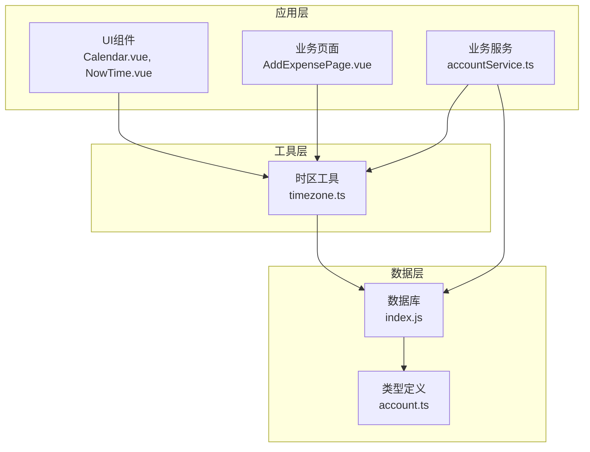
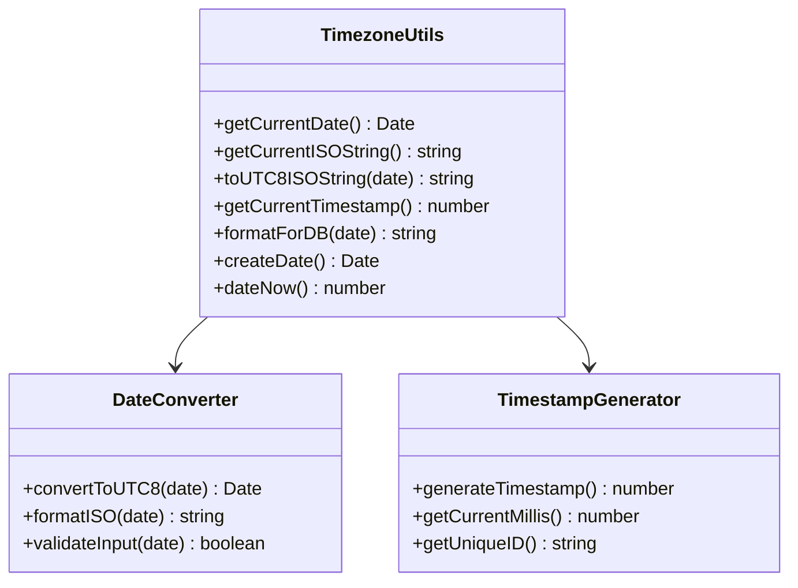
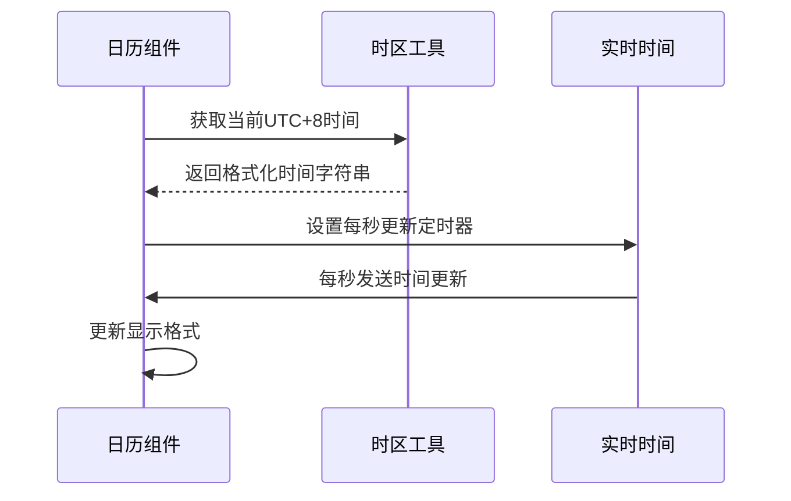
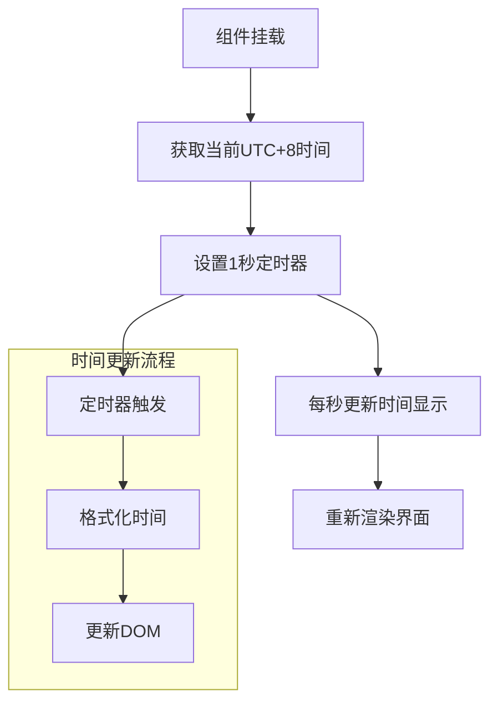
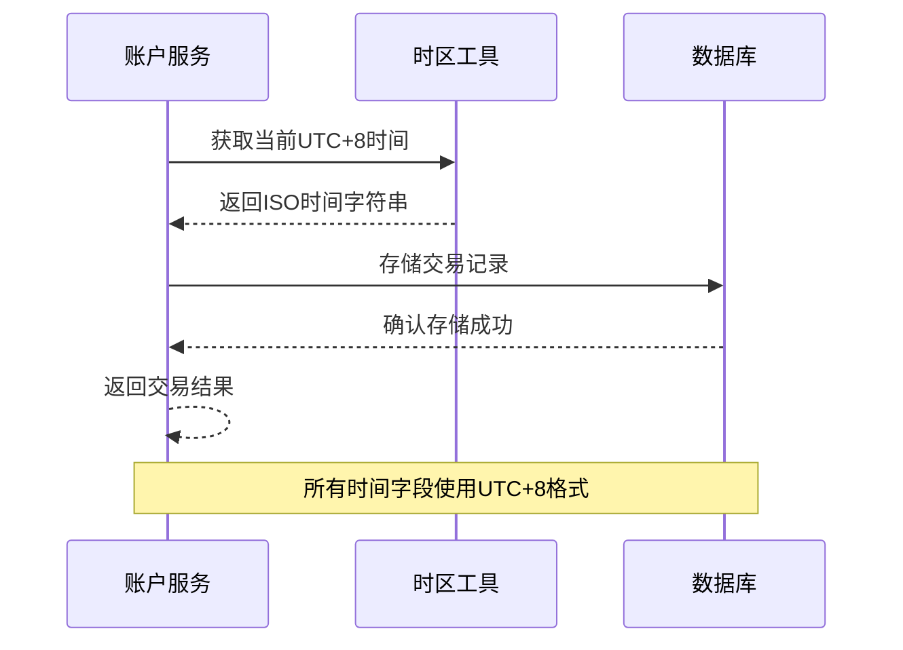
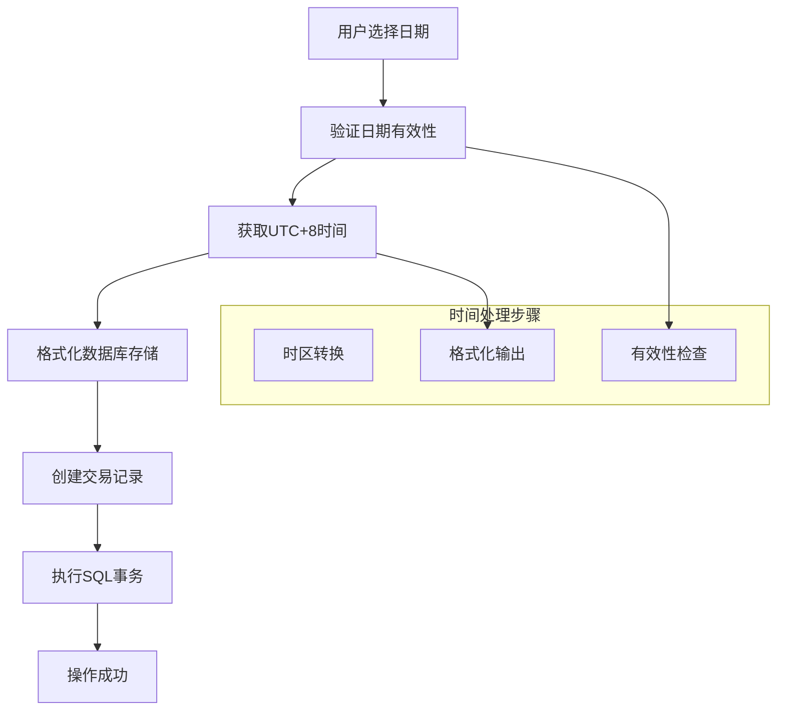
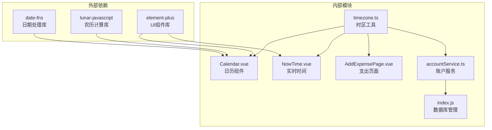
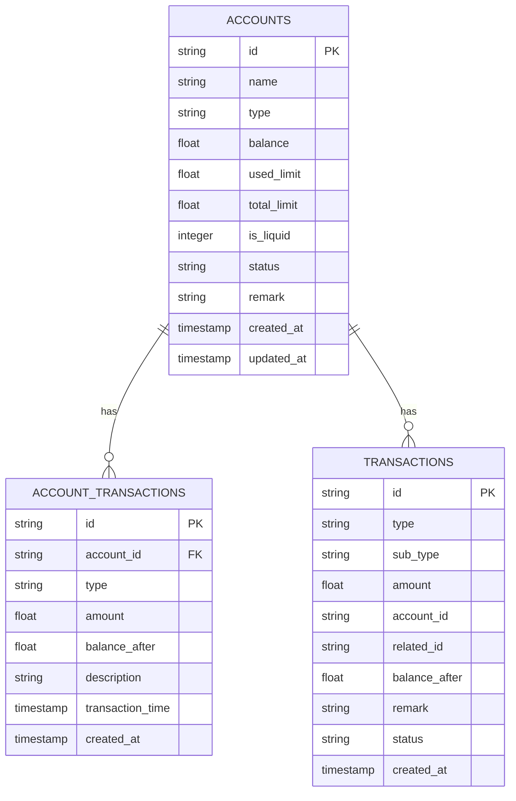

# 时区工具模块

<cite>
**本文档引用的文件**
- [timezone.ts](file://src/utils/timezone.ts)
- [Calendar.vue](file://src/components/common/calendar/Calendar.vue)
- [NowTime.vue](file://src/components/common/calendar/NowTime.vue)
- [AddExpensePage.vue](file://src/components/mobile/expense/AddExpensePage.vue)
- [accountService.ts](file://src/services/account/accountService.ts)
- [index.js](file://src/database/index.js)
- [adapter.js](file://src/database/adapter.js)
- [account.ts](file://src/types/account/account.ts)
</cite>

## 目录
1. [简介](#简介)
2. [项目结构](#项目结构)
3. [核心组件](#核心组件)
4. [架构概览](#架构概览)
5. [详细组件分析](#详细组件分析)
6. [依赖关系分析](#依赖关系分析)
7. [性能考虑](#性能考虑)
8. [故障排除指南](#故障排除指南)
9. [结论](#结论)

## 简介

时区工具模块是财务应用中的关键基础设施，负责统一处理所有时间相关的操作，确保应用在UTC+8时区（中国标准时间）中正确存储和显示时间数据。该模块提供了完整的时区转换、时间格式化和数据库存储功能，为整个应用的时间管理提供了一致性和可靠性保障。

## 项目结构

时区工具模块主要位于以下目录结构中：

```mermaid
graph TB
subgraph "时区工具模块"
TZ[timezone.ts<br/>核心时区工具函数]
end
subgraph "UI组件层"
CAL[Calendar.vue<br/>日历组件]
NOW[NowTime.vue<br/>实时时间显示]
end
subgraph "业务服务层"
EXP[AddExpensePage.vue<br/>支出记录页面]
ACC[accountService.ts<br/>账户服务]
end
subgraph "数据层"
DB[index.js<br/>数据库管理]
ADAPTER[adapter.js<br/>数据库适配器]
end
subgraph "类型定义"
TYPE[account.ts<br/>账户类型定义]
end
TZ --> CAL
TZ --> NOW
TZ --> EXP
TZ --> ACC
ACC --> DB
DB --> ADAPTER
EXP --> TYPE
```



**图表来源**
- [timezone.ts:1-61](file://src/utils/timezone.ts#L1-L61)
- [Calendar.vue:1-494](file://src/components/common/calendar/Calendar.vue#L1-L494)
- [NowTime.vue:1-48](file://src/components/common/calendar/NowTime.vue#L1-L48)
- [AddExpensePage.vue:1-858](file://src/components/mobile/expense/AddExpensePage.vue#L1-L858)
- [accountService.ts:1-564](file://src/services/account/accountService.ts#L1-L564)

**章节来源**
- [timezone.ts:1-61](file://src/utils/timezone.ts#L1-L61)
- [Calendar.vue:1-494](file://src/components/common/calendar/Calendar.vue#L1-L494)

## 核心组件

### 时区工具函数

时区工具模块提供了6个核心函数，每个函数都针对不同的使用场景：

#### 时间获取函数
- `getCurrentDate()`: 获取当前UTC+8时间的Date对象
- `getCurrentISOString()`: 获取当前UTC+8时间的ISO字符串
- `getCurrentTimestamp()`: 获取当前UTC+8时间戳（毫秒）

#### 时间转换函数
- `toUTC8ISOString(date)`: 将任意日期转换为UTC+8 ISO字符串
- `formatForDB(date)`: 格式化日期用于数据库存储

#### 替代构造函数
- `createDate()`: UTC+8版本的Date构造函数替代
- `dateNow()`: UTC+8版本的Date.now()替代

**章节来源**
- [timezone.ts:8-60](file://src/utils/timezone.ts#L8-L60)

## 架构概览

时区工具模块采用分层架构设计，确保时间处理的一致性和可维护性：



**图表来源**
- [timezone.ts:1-61](file://src/utils/timezone.ts#L1-L61)
- [accountService.ts:8-8](file://src/services/account/accountService.ts#L8-L8)

## 详细组件分析

### 时区工具函数实现

#### 时间转换算法
时区工具模块的核心是将本地时间转换为UTC+8时间。转换逻辑基于简单的数学运算：

```mermaid
flowchart TD
START[获取本地时间] --> CALC[本地时间 + 8小时偏移]
CALC --> UTC8[得到UTC+8时间]
UTC8 --> RETURN[返回转换后的时间]
subgraph "转换公式"
FORMULA[时间毫秒数 + (8 × 60 × 60 × 1000)]
end
```

**图表来源**
- [timezone.ts:9-12](file://src/utils/timezone.ts#L9-L12)

#### 函数族设计模式
模块采用了统一的命名约定和相似的实现模式：



**图表来源**
- [timezone.ts:8-60](file://src/utils/timezone.ts#L8-L60)

**章节来源**
- [timezone.ts:1-61](file://src/utils/timezone.ts#L1-L61)

### UI组件中的时区集成

#### 日历组件的时间处理
日历组件通过时区工具实现了精确的时间显示和管理：



**图表来源**
- [Calendar.vue:106-266](file://src/components/common/calendar/Calendar.vue#L106-L266)
- [timezone.ts:18-20](file://src/utils/timezone.ts#L18-L20)

#### 实时时间显示组件
NowTime组件专门负责实时时间显示，集成了时区转换功能：



**图表来源**
- [NowTime.vue:21-23](file://src/components/common/calendar/NowTime.vue#L21-L23)

**章节来源**
- [Calendar.vue:1-494](file://src/components/common/calendar/Calendar.vue#L1-L494)
- [NowTime.vue:1-48](file://src/components/common/calendar/NowTime.vue#L1-L48)

### 业务服务中的时区应用

#### 账户服务的时间管理
账户服务通过时区工具确保所有金融交易的时间准确性：



**图表来源**
- [accountService.ts:15-67](file://src/services/account/accountService.ts#L15-L67)
- [timezone.ts:18-20](file://src/utils/timezone.ts#L18-L20)

#### 支出记录的时间处理
支出记录页面通过时区工具实现精确的时间控制：



**图表来源**
- [AddExpensePage.vue:416-450](file://src/components/mobile/expense/AddExpensePage.vue#L416-L450)
- [timezone.ts:41-45](file://src/utils/timezone.ts#L41-L45)

**章节来源**
- [accountService.ts:1-564](file://src/services/account/accountService.ts#L1-L564)
- [AddExpensePage.vue:1-858](file://src/components/mobile/expense/AddExpensePage.vue#L1-L858)

## 依赖关系分析

### 模块间依赖关系



**图表来源**
- [Calendar.vue:69-72](file://src/components/common/calendar/Calendar.vue#L69-L72)
- [timezone.ts:1-61](file://src/utils/timezone.ts#L1-L61)

### 数据库集成依赖

时区工具与数据库层的集成确保了时间数据的一致性：



**图表来源**
- [index.js:434-484](file://src/database/index.js#L434-L484)

**章节来源**
- [index.js:434-484](file://src/database/index.js#L434-L484)

## 性能考虑

### 时间处理性能优化

时区工具模块在设计时充分考虑了性能因素：

1. **缓存策略**: 对于频繁使用的日期格式，可以考虑添加缓存机制
2. **批量处理**: 在大量数据处理时，避免重复的时区转换
3. **内存管理**: 及时清理定时器和事件监听器

### 数据库时间存储优化

数据库层的时间存储采用了以下优化策略：

- **索引优化**: 为时间字段建立适当的索引
- **批量插入**: 使用事务批量处理多条记录
- **数据类型选择**: 使用TIMESTAMP类型确保时间精度

## 故障排除指南

### 常见问题及解决方案

#### 时间显示异常
**问题**: 时间显示与系统时间不一致
**解决方案**: 
1. 检查浏览器时区设置
2. 验证时区工具函数的正确性
3. 确认服务器时间同步

#### 数据库时间存储错误
**问题**: 数据库中存储的时间出现偏差
**解决方案**:
1. 检查formatForDB函数的使用
2. 验证数据库连接的时区设置
3. 确认事务处理的完整性

#### 时区转换错误
**问题**: 不同组件间时间显示不一致
**解决方案**:
1. 统一使用时区工具函数
2. 避免直接使用原生Date对象
3. 在组件间传递标准化的时间格式

**章节来源**
- [timezone.ts:1-61](file://src/utils/timezone.ts#L1-L61)

## 结论

时区工具模块为财务应用提供了可靠的时间管理基础设施。通过统一的时区转换、精确的时间格式化和完善的数据库集成，该模块确保了应用在UTC+8时区环境下的准确性和一致性。

模块的主要优势包括：
- **一致性**: 统一的时间处理标准
- **可靠性**: 经过测试的时区转换算法
- **可维护性**: 清晰的代码结构和文档
- **扩展性**: 易于添加新的时间处理功能

未来可以考虑的改进方向：
- 添加更多时区的支持选项
- 实现更复杂的时间格式化功能
- 优化性能和内存使用
- 增强错误处理和日志记录