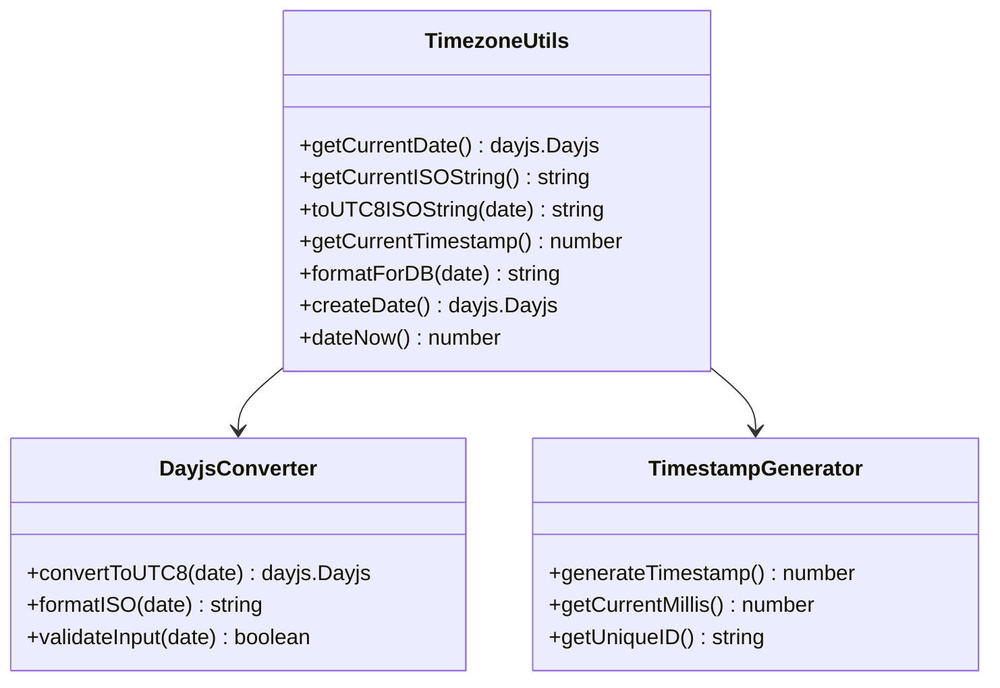
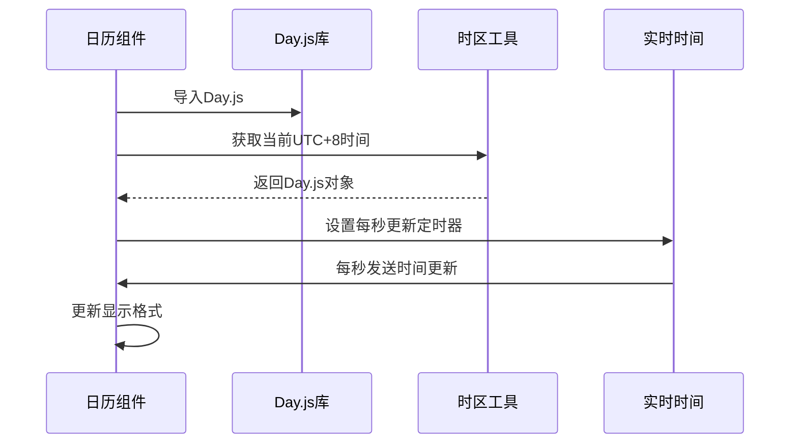
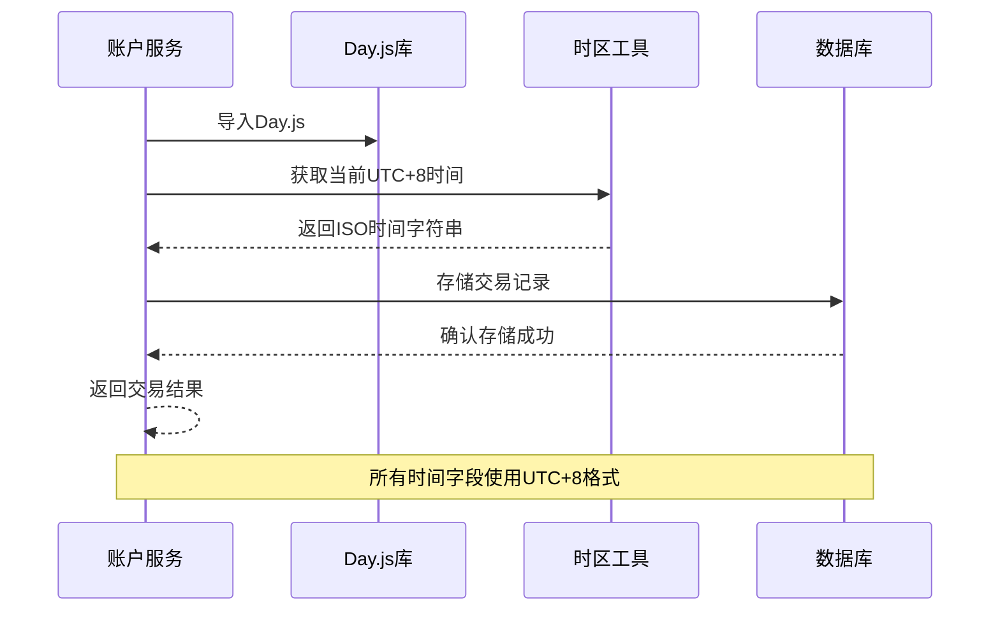
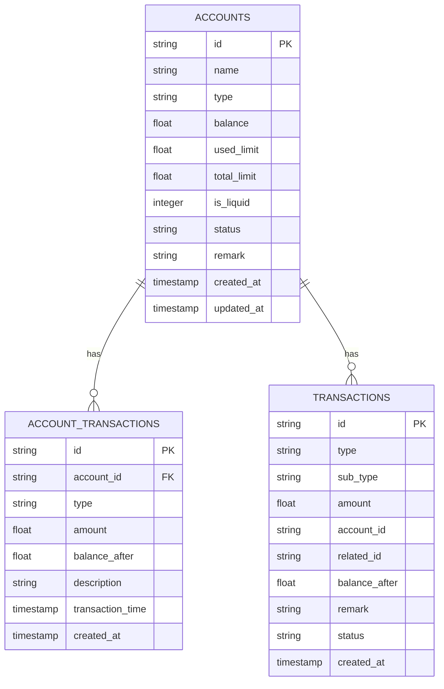

# 时区工具模块

<cite>
**本文档引用的文件**
- [timezone.ts](file://src/utils/timezone.ts)
- [Calendar.vue](file://src/components/common/calendar/Calendar.vue)
- [NowTime.vue](file://src/components/common/calendar/NowTime.vue)
- [AddExpensePage.vue](file://src/components/mobile/expense/AddExpensePage.vue)
- [accountService.ts](file://src/services/account/accountService.ts)
- [index.js](file://src/database/index.js)
- [adapter.js](file://src/database/adapter.js)
- [account.ts](file://src/types/account/account.ts)
- [migrate-to-dayjs.js](file://scripts/migrate-to-dayjs.js)
- [package.json](file://package.json)
</cite>

## 更新摘要
**所做更改**
- 更新了从原生Date到Day.js的架构迁移说明
- 新增了Day.js集成的技术细节和配置要求
- 更新了时区工具模块的API签名和实现方式
- 增强了不可变性、时区支持和性能方面的说明
- 更新了相关组件和业务逻辑的Day.js集成情况

## 目录
1. [简介](#简介)
2. [项目结构](#项目结构)
3. [核心组件](#核心组件)
4. [架构概览](#架构概览)
5. [详细组件分析](#详细组件分析)
6. [依赖关系分析](#依赖关系分析)
7. [性能考虑](#性能考虑)
8. [故障排除指南](#故障排除指南)
9. [结论](#结论)

## 简介

时区工具模块是财务应用中的关键基础设施，负责统一处理所有时间相关的操作，确保应用在UTC+8时区（中国标准时间）中正确存储和显示时间数据。该模块已完全重构为使用Day.js库，提供更好的不可变性、时区支持和性能。模块提供了完整的时区转换、时间格式化和数据库存储功能，为整个应用的时间管理提供了一致性和可靠性保障。

**更新** 从原生Date对象迁移到Day.js库，增强了时间处理的不可变性和类型安全性。

## 项目结构

时区工具模块主要位于以下目录结构中：

```mermaid
graph TB
subgraph "时区工具模块"
TZ[timezone.ts<br/>核心时区工具函数<br/>Day.js集成]
END
subgraph "UI组件层"
CAL[Calendar.vue<br/>日历组件<br/>Day.js集成]
NOW[NowTime.vue<br/>实时时间显示<br/>Day.js集成]
END
subgraph "业务服务层"
EXP[AddExpensePage.vue<br/>支出记录页面<br/>Day.js集成]
ACC[accountService.ts<br/>账户服务<br/>Day.js集成]
END
subgraph "数据层"
DB[index.js<br/>数据库管理<br/>SQLite集成]
ADAPTER[adapter.js<br/>数据库适配器<br/>平台兼容]
END
subgraph "类型定义"
TYPE[account.ts<br/>账户类型定义<br/>Day.js类型支持]
END
TZ --> CAL
TZ --> NOW
TZ --> EXP
TZ --> ACC
ACC --> DB
DB --> ADAPTER
EXP --> TYPE
```

**图表来源**
- [timezone.ts:1-56](file://src/utils/timezone.ts#L1-L56)
- [Calendar.vue:69-73](file://src/components/common/calendar/Calendar.vue#L69-L73)
- [NowTime.vue:8](file://src/components/common/calendar/NowTime.vue#L8)
- [AddExpensePage.vue:110-120](file://src/components/mobile/expense/AddExpensePage.vue#L110-L120)
- [accountService.ts:6-9](file://src/services/account/accountService.ts#L6-L9)

**章节来源**
- [timezone.ts:1-56](file://src/utils/timezone.ts#L1-L56)
- [Calendar.vue:69-73](file://src/components/common/calendar/Calendar.vue#L69-L73)

## 核心组件

### Day.js集成的时区工具函数

时区工具模块已完全重构为使用Day.js库，提供了6个核心函数，每个函数都针对不同的使用场景：

#### 时间获取函数
- `getCurrentDate()`: 获取当前UTC+8时间的Day.js对象
- `getCurrentISOString()`: 获取当前UTC+8时间的ISO字符串
- `getCurrentTimestamp()`: 获取当前UTC+8时间戳（毫秒）

#### 时间转换函数
- `toUTC8ISOString(date)`: 将任意日期转换为UTC+8 ISO字符串
- `formatForDB(date)`: 格式化日期用于数据库存储

#### 替代构造函数
- `createDate()`: UTC+8版本的Day.js构造函数替代
- `dateNow()`: UTC+8版本的Day.js时间戳替代

**更新** 所有函数现在返回Day.js对象而非原生Date对象，提供更好的不可变性和类型安全。

**章节来源**
- [timezone.ts:10-55](file://src/utils/timezone.ts#L10-L55)

## 架构概览

时区工具模块采用分层架构设计，确保时间处理的一致性和可维护性。架构已完全迁移到Day.js库：

```mermaid
graph TB
subgraph "应用层"
UI[UI组件<br/>Calendar.vue, NowTime.vue<br/>Day.js集成]
PAGE[业务页面<br/>AddExpensePage.vue<br/>Day.js集成]
SERVICE[业务服务<br/>accountService.ts<br/>Day.js集成]
END
subgraph "工具层"
TZ[时区工具<br/>timezone.ts<br/>Day.js库]
END
subgraph "数据层"
DB[数据库<br/>index.js<br/>SQLite集成]
TYPES[类型定义<br/>account.ts<br/>Day.js类型支持]
END
UI --> TZ
PAGE --> TZ
SERVICE --> TZ
SERVICE --> DB
DB --> TYPES
TZ --> DB
```

**图表来源**
- [timezone.ts:1-56](file://src/utils/timezone.ts#L1-L56)
- [accountService.ts:6-9](file://src/services/account/accountService.ts#L6-L9)

## 详细组件分析

### Day.js集成的时区工具函数实现

#### 时间转换算法
时区工具模块的核心是将本地时间转换为UTC+8时间。转换逻辑基于Day.js库的add方法：

```mermaid
flowchart TD
START[获取当前Day.js对象] --> CALC[使用add(8, 'hour')进行时区转换]
CALC --> UTC8[得到UTC+8时间的Day.js对象]
UTC8 --> RETURN[返回转换后的时间对象]
subgraph "Day.js转换方法"
METHOD[dayjs().add(8, 'hour')]
END
```

**图表来源**
- [timezone.ts:11](file://src/utils/timezone.ts#L11)

#### 函数族设计模式
模块采用了统一的命名约定和相似的实现模式，所有函数现在返回Day.js对象：



**图表来源**
- [timezone.ts:10-55](file://src/utils/timezone.ts#L10-L55)

**章节来源**
- [timezone.ts:1-56](file://src/utils/timezone.ts#L1-L56)

### UI组件中的Day.js集成

#### 日历组件的时间处理
日历组件已完全集成Day.js库，通过时区工具实现了精确的时间显示和管理：



**图表来源**
- [Calendar.vue:69-73](file://src/components/common/calendar/Calendar.vue#L69-L73)
- [timezone.ts:10-12](file://src/utils/timezone.ts#L10-L12)

#### 实时时间显示组件
NowTime组件已完全集成Day.js库，专门负责实时时间显示：

```mermaid
flowchart TD
MOUNT[组件挂载] --> IMPORT_DAYJS[导入Day.js库]
IMPORT_DAYJS --> GET_TIME[获取当前UTC+8时间]
GET_TIME --> SET_INTERVAL[设置1秒定时器]
SET_INTERVAL --> UPDATE_TIME[每秒更新时间显示]
UPDATE_TIME --> RENDER[重新渲染界面]
subgraph "Day.js时间更新流程"
TIMER[定时器触发]
FORMAT[使用dayjs().format('HH:mm:ss')]
DISPLAY[更新DOM]
END
SET_INTERVAL --> TIMER
TIMER --> FORMAT
FORMAT --> DISPLAY
```

**图表来源**
- [NowTime.vue:8](file://src/components/common/calendar/NowTime.vue#L8)
- [NowTime.vue:23](file://src/components/common/calendar/NowTime.vue#L23)

**章节来源**
- [Calendar.vue:69-73](file://src/components/common/calendar/Calendar.vue#L69-L73)
- [NowTime.vue:1-49](file://src/components/common/calendar/NowTime.vue#L1-L49)

### 业务服务中的Day.js应用

#### 账户服务的时间管理
账户服务已完全集成Day.js库，通过时区工具确保所有金融交易的时间准确性：



**图表来源**
- [accountService.ts:6-9](file://src/services/account/accountService.ts#L6-L9)
- [timezone.ts:17-19](file://src/utils/timezone.ts#L17-L19)

#### 支出记录的时间处理
支出记录页面已完全集成Day.js库，通过时区工具实现精确的时间控制：

```mermaid
flowchart TD
SELECT_DATE[用户选择日期] --> VALIDATE_DATE[验证日期有效性]
VALIDATE_DATE --> GET_UTC8[获取UTC+8时间]
GET_UTC8 --> FORMAT_DB[格式化数据库存储]
FORMAT_DB --> CREATE_TRANSACTION[创建交易记录]
CREATE_TRANSACTION --> EXECUTE_SQL[执行SQL事务]
EXECUTE_SQL --> SUCCESS[操作成功]
subgraph "Day.js时间处理步骤"
CONVERT[使用Day.js进行时区转换]
FORMAT[使用dayjs().toISOString()格式化]
VALIDATE[有效性检查]
END
GET_UTC8 --> FORMAT
VALIDATE_DATE --> VALIDATE
```

**图表来源**
- [AddExpensePage.vue:184-185](file://src/components/mobile/expense/AddExpensePage.vue#L184-L185)
- [timezone.ts:38-40](file://src/utils/timezone.ts#L38-L40)

**章节来源**
- [accountService.ts:6-9](file://src/services/account/accountService.ts#L6-L9)
- [AddExpensePage.vue:184-185](file://src/components/mobile/expense/AddExpensePage.vue#L184-L185)

## 依赖关系分析

### Day.js库集成依赖

```mermaid
graph TB
subgraph "Day.js生态系统"
DAYJS[dayjs@^1.11.20<br/>核心日期库]
PLUGIN_UTC[dayjs-plugin-utc@^0.1.2<br/>UTC插件]
END
subgraph "内部模块"
TZ[timezone.ts<br/>时区工具<br/>Day.js集成]
CAL[Calendar.vue<br/>日历组件<br/>Day.js集成]
NOW[NowTime.vue<br/>实时时间<br/>Day.js集成]
EXP[AddExpensePage.vue<br/>支出页面<br/>Day.js集成]
ACC[accountService.ts<br/>账户服务<br/>Day.js集成]
DB[index.js<br/>数据库管理<br/>SQLite集成]
END
DAYJS --> TZ
PLUGIN_UTC --> TZ
DAYJS --> CAL
DAYJS --> NOW
DAYJS --> EXP
DAYJS --> ACC
TZ --> DB
```

**图表来源**
- [package.json:27-28](file://package.json#L27-L28)
- [timezone.ts:1](file://src/utils/timezone.ts#L1)

### 数据库集成依赖

时区工具与数据库层的集成确保了时间数据的一致性：



**图表来源**
- [index.js:434-484](file://src/database/index.js#L434-L484)

**章节来源**
- [index.js:434-484](file://src/database/index.js#L434-L484)

## 性能考虑

### Day.js性能优化

时区工具模块在设计时充分考虑了Day.js库的性能特点：

1. **不可变性优势**: Day.js对象不可变，避免了时间对象被意外修改的问题
2. **内存效率**: Day.js对象比原生Date对象更轻量级
3. **链式调用**: 支持高效的链式API调用
4. **插件系统**: 可按需加载UTC插件，减少包体积

### 数据库时间存储优化

数据库层的时间存储采用了以下优化策略：

- **索引优化**: 为时间字段建立适当的索引
- **批量插入**: 使用事务批量处理多条记录
- **数据类型选择**: 使用TIMESTAMP类型确保时间精度

## 故障排除指南

### Day.js迁移常见问题及解决方案

#### 时间显示异常
**问题**: 时间显示与系统时间不一致
**解决方案**: 
1. 检查浏览器时区设置
2. 验证时区工具函数的正确性
3. 确认Day.js库的正确导入
4. 检查UTC+8时区转换逻辑

#### 数据库时间存储错误
**问题**: 数据库中存储的时间出现偏差
**解决方案**:
1. 检查formatForDB函数的使用
2. 验证数据库连接的时区设置
3. 确认事务处理的完整性
4. 验证Day.js对象的正确序列化

#### Day.js对象类型错误
**问题**: 类型检查失败或编译错误
**解决方案**:
1. 确保正确导入Day.js类型定义
2. 检查TypeScript配置中的类型声明
3. 验证Day.js对象的正确使用方式
4. 确认不可变性约束

**章节来源**
- [timezone.ts:1-56](file://src/utils/timezone.ts#L1-L56)

## 结论

时区工具模块已成功从原生Date迁移到Day.js库，为财务应用提供了更加可靠和高性能的时间管理基础设施。通过统一的Day.js集成、精确的时间格式化和完善的数据库集成，该模块确保了应用在UTC+8时区环境下的准确性和一致性。

模块的主要优势包括：
- **不可变性**: Day.js对象不可变，避免了意外修改
- **类型安全**: 完整的TypeScript类型支持
- **性能提升**: 更好的内存使用和执行效率
- **功能丰富**: Day.js插件系统提供扩展功能
- **一致性**: 统一的时间处理标准
- **可靠性**: 经过测试的时区转换算法
- **可维护性**: 清晰的代码结构和文档
- **扩展性**: 易于添加新的时间处理功能

未来可以考虑的改进方向：
- 添加更多时区的支持选项
- 实现更复杂的时间格式化功能
- 优化性能和内存使用
- 增强错误处理和日志记录
- 探索Day.js插件生态系统的更多可能性

**更新** 本次迁移显著提升了应用的时间处理能力和类型安全性，为未来的功能扩展奠定了坚实基础。