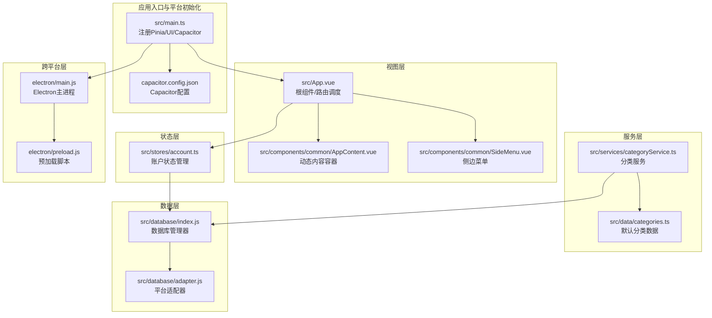
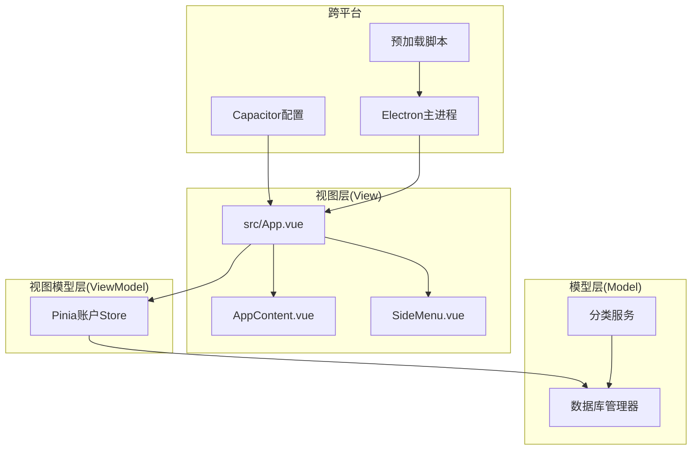
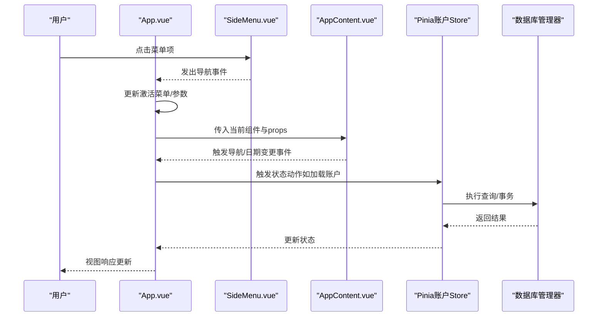
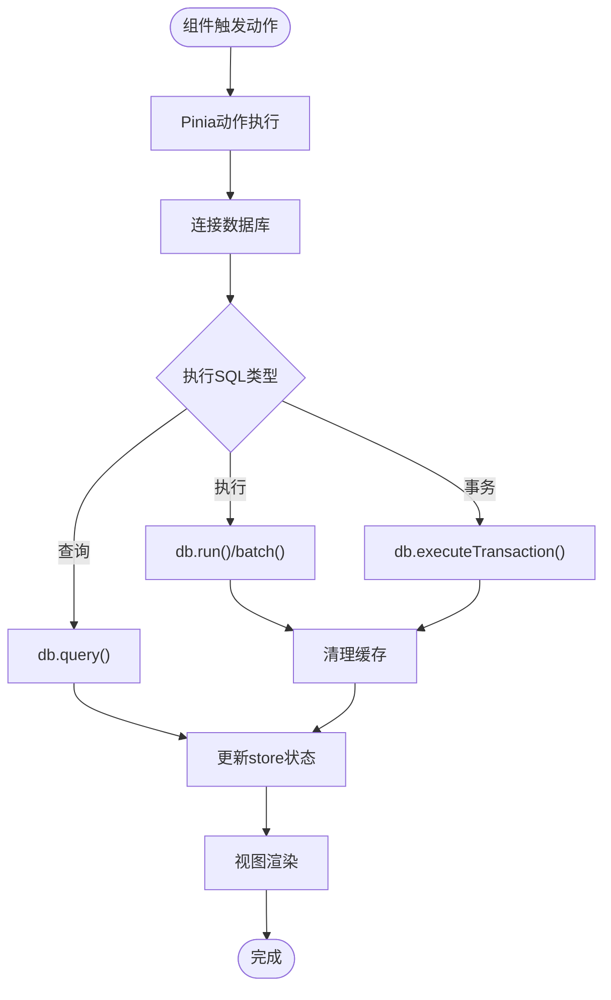
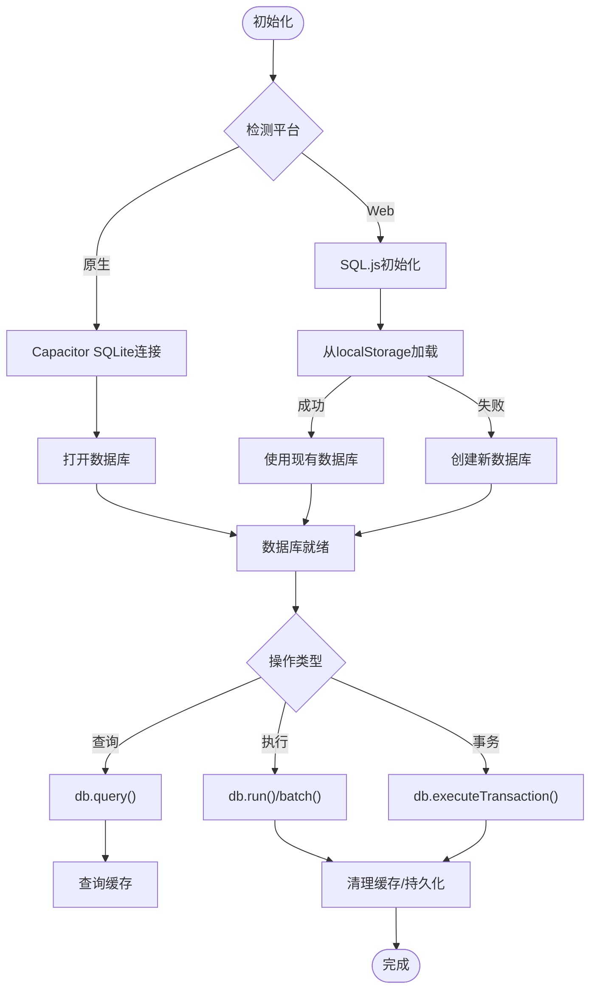
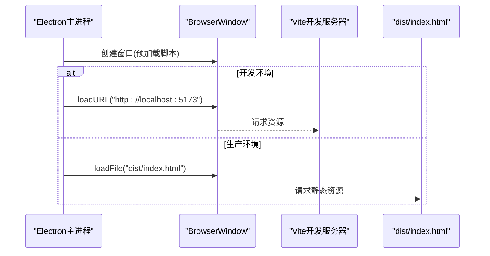
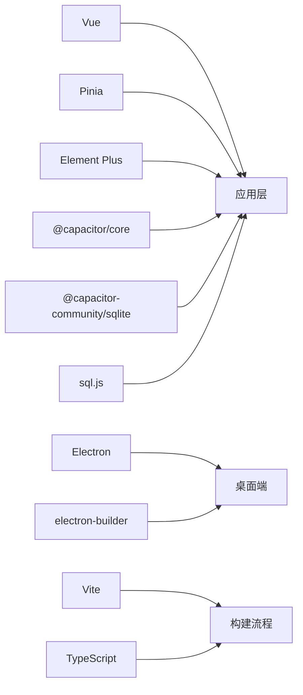

# 架构设计

<cite>
**本文引用的文件**
- [package.json](file://package.json)
- [vite.config.ts](file://vite.config.ts)
- [capacitor.config.json](file://capacitor.config.json)
- [src/main.ts](file://src/main.ts)
- [src/App.vue](file://src/App.vue)
- [src/components/common/AppContent.vue](file://src/components/common/AppContent.vue)
- [src/components/common/SideMenu.vue](file://src/components/common/SideMenu.vue)
- [src/stores/account.ts](file://src/stores/account.ts)
- [src/services/categoryService.ts](file://src/services/categoryService.ts)
- [src/data/categories.ts](file://src/data/categories.ts)
- [src/utils/dictionaries.ts](file://src/utils/dictionaries.ts)
- [src/database/index.js](file://src/database/index.js)
- [src/database/adapter.js](file://src/database/adapter.js)
- [electron/main.js](file://electron/main.js)
- [electron/preload.js](file://electron/preload.js)
</cite>

## 目录
1. [简介](#简介)
2. [项目结构](#项目结构)
3. [核心组件](#核心组件)
4. [架构总览](#架构总览)
5. [详细组件分析](#详细组件分析)
6. [依赖关系分析](#依赖关系分析)
7. [性能考量](#性能考量)
8. [故障排查指南](#故障排查指南)
9. [结论](#结论)
10. [附录](#附录)

## 简介
本文件面向财务应用程序的架构设计，系统采用前端应用层、数据层与跨平台适配层的分层设计，结合MVVM架构模式（Model-View-ViewModel），通过Vue组件化组织与Pinia状态管理实现清晰的职责分离。系统同时支持桌面端（Electron）与移动端（Capacitor）双平台部署，并通过统一的数据库抽象层实现Capacitor SQLite与SQL.js的双模式支持，满足原生平台与Web环境的数据持久化需求。

## 项目结构
项目采用基于功能域的模块化组织方式：
- 应用入口与平台初始化：在应用入口集中注册Pinia、UI框架与Capacitor运行时检测。
- 视图层：以Vue单文件组件为主，公共组件位于common目录，业务功能组件按领域划分至mobile子目录。
- 状态层：使用Pinia Store管理账户等业务状态。
- 服务层：封装分类等业务服务，负责与数据库交互。
- 数据层：统一的数据库管理器，支持原生与Web两种存储后端。
- 跨平台层：Capacitor配置与Electron主进程/预加载脚本。

**图表来源**
- [src/main.ts:1-16](file://src/main.ts#L1-L16)
- [capacitor.config.json:1-23](file://capacitor.config.json#L1-L23)
- [src/App.vue:1-195](file://src/App.vue#L1-L195)
- [src/components/common/AppContent.vue:1-51](file://src/components/common/AppContent.vue#L1-L51)
- [src/components/common/SideMenu.vue:1-255](file://src/components/common/SideMenu.vue#L1-L255)
- [src/stores/account.ts:1-273](file://src/stores/account.ts#L1-L273)
- [src/services/categoryService.ts:1-260](file://src/services/categoryService.ts#L1-L260)
- [src/data/categories.ts:1-45](file://src/data/categories.ts#L1-L45)
- [src/database/index.js:1-935](file://src/database/index.js#L1-L935)
- [src/database/adapter.js:1-34](file://src/database/adapter.js#L1-L34)
- [electron/main.js:1-70](file://electron/main.js#L1-L70)
- [electron/preload.js:1-7](file://electron/preload.js#L1-L7)

**章节来源**
- [src/main.ts:1-16](file://src/main.ts#L1-L16)
- [capacitor.config.json:1-23](file://capacitor.config.json#L1-L23)
- [vite.config.ts:1-11](file://vite.config.ts#L1-L11)

## 核心组件
- 应用入口与平台初始化：在入口处创建Vue应用，注册Pinia与UI框架，并通过Capacitor判断运行平台，便于后续跨平台逻辑分支。
- 根组件与路由调度：根组件负责头部、底部、侧边菜单与动态内容区的组合，通过组件映射与props传递实现页面级导航与参数传递。
- 动态内容容器：根据当前激活菜单动态渲染对应功能组件，实现“页面”级别的组件切换。
- 侧边菜单：提供用户信息展示与导航项，支持遮罩点击关闭与导航事件向上冒泡。
- Pinia账户状态：封装账户的增删改查、余额调整与转账等动作，统一通过数据库管理器执行SQL。
- 分类服务：提供分类的查询、创建、更新、删除与默认分类初始化能力，优先从数据库读取，兜底使用内置默认分类。
- 数据库管理器：统一抽象Capacitor SQLite与SQL.js，提供连接、查询、执行、批处理、事务、缓存与Web端持久化等能力。
- 跨平台主进程：Electron主进程负责窗口创建与开发/生产环境加载；预加载脚本暴露安全的IPC桥接。

**章节来源**
- [src/App.vue:64-117](file://src/App.vue#L64-L117)
- [src/components/common/AppContent.vue:1-22](file://src/components/common/AppContent.vue#L1-L22)
- [src/components/common/SideMenu.vue:53-90](file://src/components/common/SideMenu.vue#L53-L90)
- [src/stores/account.ts:27-100](file://src/stores/account.ts#L27-L100)
- [src/services/categoryService.ts:8-69](file://src/services/categoryService.ts#L8-L69)
- [src/database/index.js:21-190](file://src/database/index.js#L21-L190)
- [electron/main.js:19-45](file://electron/main.js#L19-L45)
- [electron/preload.js:1-7](file://electron/preload.js#L1-L7)

## 架构总览
系统采用MVVM分层与组件化设计：
- Model：数据库管理器与服务层（如分类服务）承载数据模型与业务规则。
- View：Vue组件树，负责UI呈现与用户交互。
- ViewModel：Pinia Store承担状态与行为的协调，驱动视图更新。

跨平台策略：
- Capacitor：移动端原生能力与Web混合模式，配置Web目录指向构建产物，启用必要插件。
- Electron：桌面端通过主进程创建窗口并加载开发或生产资源，预加载脚本提供受限IPC通道。

**图表来源**
- [src/App.vue:1-195](file://src/App.vue#L1-L195)
- [src/components/common/AppContent.vue:1-51](file://src/components/common/AppContent.vue#L1-L51)
- [src/components/common/SideMenu.vue:1-255](file://src/components/common/SideMenu.vue#L1-L255)
- [src/stores/account.ts:1-273](file://src/stores/account.ts#L1-L273)
- [src/services/categoryService.ts:1-260](file://src/services/categoryService.ts#L1-L260)
- [src/database/index.js:1-935](file://src/database/index.js#L1-L935)
- [capacitor.config.json:1-23](file://capacitor.config.json#L1-L23)
- [electron/main.js:1-70](file://electron/main.js#L1-L70)
- [electron/preload.js:1-7](file://electron/preload.js#L1-L7)

## 详细组件分析

### MVVM与组件化架构
- 职责分离：根组件负责布局与导航调度；动态内容容器根据状态渲染具体页面；Pinia Store集中管理账户状态；服务层封装业务逻辑；数据库管理器统一数据访问。
- 组件通信：父组件通过props向子组件传递数据与回调；子组件通过事件向上冒泡触发导航与日期变更等动作；Pinia Store在多组件间共享状态。
- 组件组织：公共组件（头部、底部、菜单、内容区）复用性强；业务组件按功能域划分，便于维护与扩展。

**图表来源**
- [src/App.vue:119-143](file://src/App.vue#L119-L143)
- [src/components/common/SideMenu.vue:85-89](file://src/components/common/SideMenu.vue#L85-L89)
- [src/components/common/AppContent.vue:18-21](file://src/components/common/AppContent.vue#L18-L21)
- [src/stores/account.ts:38-53](file://src/stores/account.ts#L38-L53)
- [src/database/index.js:211-264](file://src/database/index.js#L211-L264)

**章节来源**
- [src/App.vue:64-117](file://src/App.vue#L64-L117)
- [src/components/common/AppContent.vue:12-22](file://src/components/common/AppContent.vue#L12-L22)
- [src/components/common/SideMenu.vue:53-90](file://src/components/common/SideMenu.vue#L53-L90)
- [src/stores/account.ts:27-100](file://src/stores/account.ts#L27-L100)

### Pinia状态管理与数据流
- 状态定义：账户列表、加载状态、错误信息。
- 动作示例：加载账户、新增账户、更新账户、删除账户、余额调整、转账。
- 数据流向：组件触发动作 -> Store执行异步逻辑 -> 数据库管理器执行SQL -> 更新状态 -> 视图响应。

**图表来源**
- [src/stores/account.ts:34-272](file://src/stores/account.ts#L34-L272)
- [src/database/index.js:211-374](file://src/database/index.js#L211-L374)

**章节来源**
- [src/stores/account.ts:27-273](file://src/stores/account.ts#L27-L273)

### 数据库架构与双模式支持
- 抽象层：统一的数据库管理器，屏蔽Capacitor SQLite与SQL.js差异。
- 连接策略：原生平台使用Capacitor SQLite连接与打开；Web环境使用SQL.js并从localStorage恢复数据库。
- 查询与执行：支持位置参数绑定、对象结果集转换、缓存、批处理与事务。
- 索引与迁移：初始化时批量创建表与索引，并对既有表结构进行字段兼容性迁移。
- Web持久化：延迟节流保存到localStorage，避免频繁I/O。

**图表来源**
- [src/database/index.js:56-190](file://src/database/index.js#L56-L190)
- [src/database/index.js:211-374](file://src/database/index.js#L211-L374)
- [src/database/index.js:420-776](file://src/database/index.js#L420-L776)

**章节来源**
- [src/database/index.js:21-800](file://src/database/index.js#L21-L800)

### 跨平台架构设计
- Capacitor配置：Web目录指向构建产物，启用插件（如键盘、启动屏），Android构建选项配置。
- Electron主进程：创建窗口、加载开发/生产资源、处理窗口生命周期、示例IPC。
- 预加载脚本：通过contextBridge暴露受限IPC接口，保证安全。

**图表来源**
- [electron/main.js:19-45](file://electron/main.js#L19-L45)
- [vite.config.ts:7-11](file://vite.config.ts#L7-L11)

**章节来源**
- [capacitor.config.json:1-23](file://capacitor.config.json#L1-L23)
- [electron/main.js:1-70](file://electron/main.js#L1-L70)
- [electron/preload.js:1-7](file://electron/preload.js#L1-L7)

## 依赖关系分析
- 应用层依赖：Vue、Element Plus、Pinia、图表库等。
- 跨平台依赖：Capacitor核心与插件、Electron与electron-builder。
- 数据依赖：@capacitor-community/sqlite（原生）、sql.js（Web）。
- 构建依赖：Vite、TypeScript、Sass等。

**图表来源**
- [package.json:19-47](file://package.json#L19-L47)
- [vite.config.ts:1-11](file://vite.config.ts#L1-L11)

**章节来源**
- [package.json:1-72](file://package.json#L1-L72)

## 性能考量
- 查询缓存：数据库管理器内置Map缓存，命中则直接返回，降低重复查询成本。
- 连接复用：单例模式与连接状态标记，避免并发重复连接。
- 批处理与事务：批量执行SQL与事务封装，减少往返次数与提升一致性。
- Web持久化节流：SQL.js写入后延迟保存到localStorage，降低I/O频率。
- 索引优化：初始化阶段为高频查询字段建立索引，提升查询效率。
- 构建目标：ES2015目标与相对路径基础，兼顾兼容性与体积。

**章节来源**
- [src/database/index.js:12-18](file://src/database/index.js#L12-L18)
- [src/database/index.js:200-209](file://src/database/index.js#L200-L209)
- [src/database/index.js:379-408](file://src/database/index.js#L379-L408)
- [src/database/index.js:676-688](file://src/database/index.js#L676-L688)
- [vite.config.ts:8-11](file://vite.config.ts#L8-L11)

## 故障排查指南
- 数据库连接异常：分类服务提供数据库状态检查方法，可在异常时提示使用内存模式或定位问题。
- SQL执行错误：数据库管理器捕获异常并抛出带明确信息的错误，便于定位SQL语法或参数绑定问题。
- Web端数据丢失：SQL.js依赖localStorage持久化，若异常需检查localStorage可用性与容量限制。
- 原生平台权限：Capacitor插件需正确安装与同步，确保平台能力可用。
- Electron IPC：预加载脚本暴露受限接口，确保主进程与渲染进程通信安全与稳定。

**章节来源**
- [src/services/categoryService.ts:181-194](file://src/services/categoryService.ts#L181-L194)
- [src/database/index.js:260-264](file://src/database/index.js#L260-L264)
- [src/database/index.js:396-408](file://src/database/index.js#L396-L408)
- [electron/preload.js:1-7](file://electron/preload.js#L1-L7)

## 结论
该财务应用通过MVVM与组件化架构实现了清晰的职责分离，配合Pinia状态管理与统一数据库抽象层，有效支撑了跨平台部署与双模式数据库策略。在保证功能完整性的同时，通过缓存、批处理、事务与索引等手段提升了性能与可靠性。建议持续关注平台插件的版本演进与Electron构建配置的优化，以进一步增强跨平台体验与安全性。

## 附录
- 系统边界图：应用入口、视图层、状态层、服务层、数据层与跨平台层构成完整边界，各层之间通过明确接口交互。
- 组件交互图：根组件作为中枢，通过事件与props驱动动态内容容器与侧边菜单，Pinia Store与数据库管理器分别承担状态与数据职责。