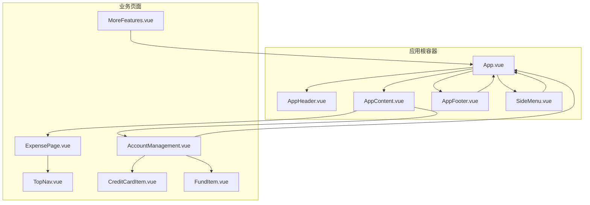
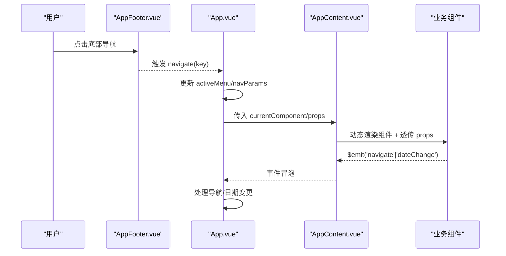
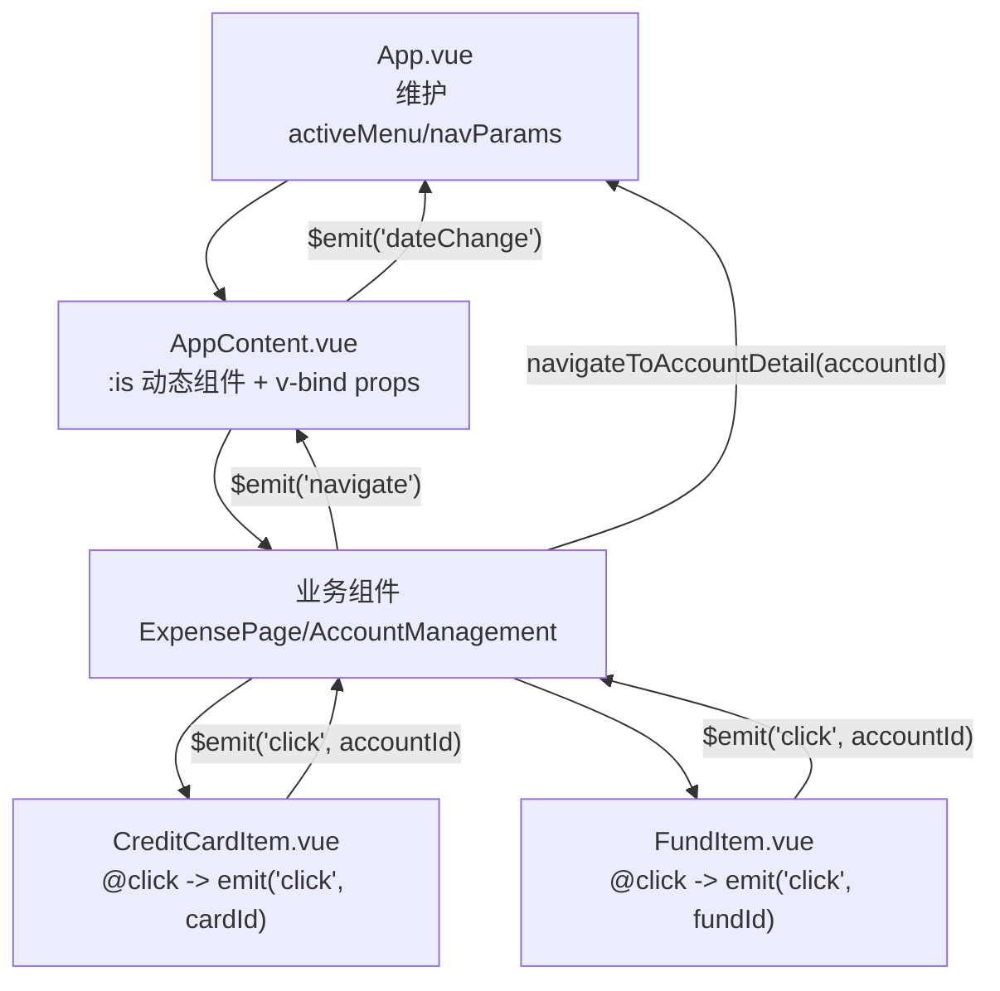
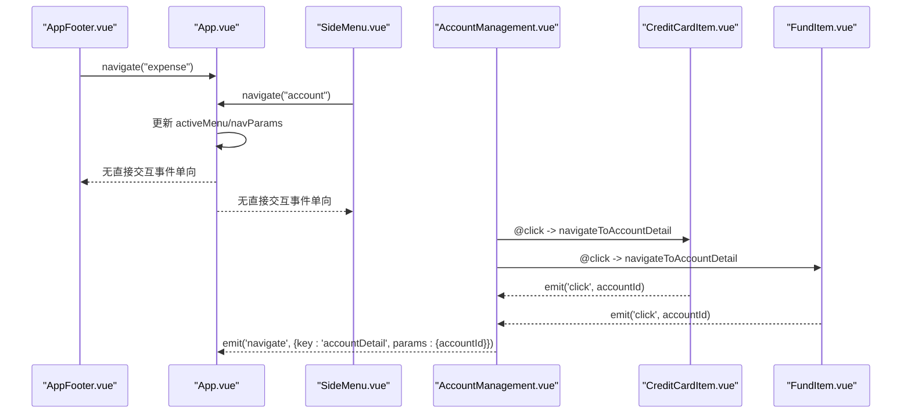
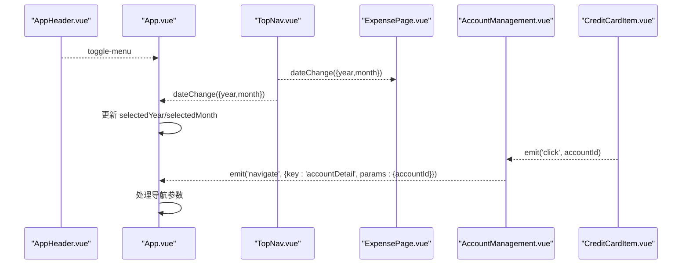
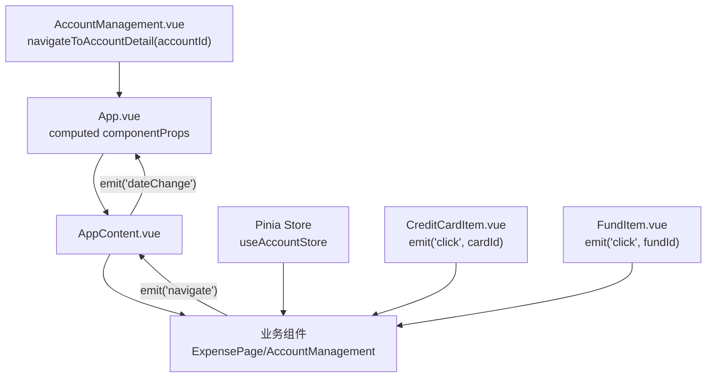
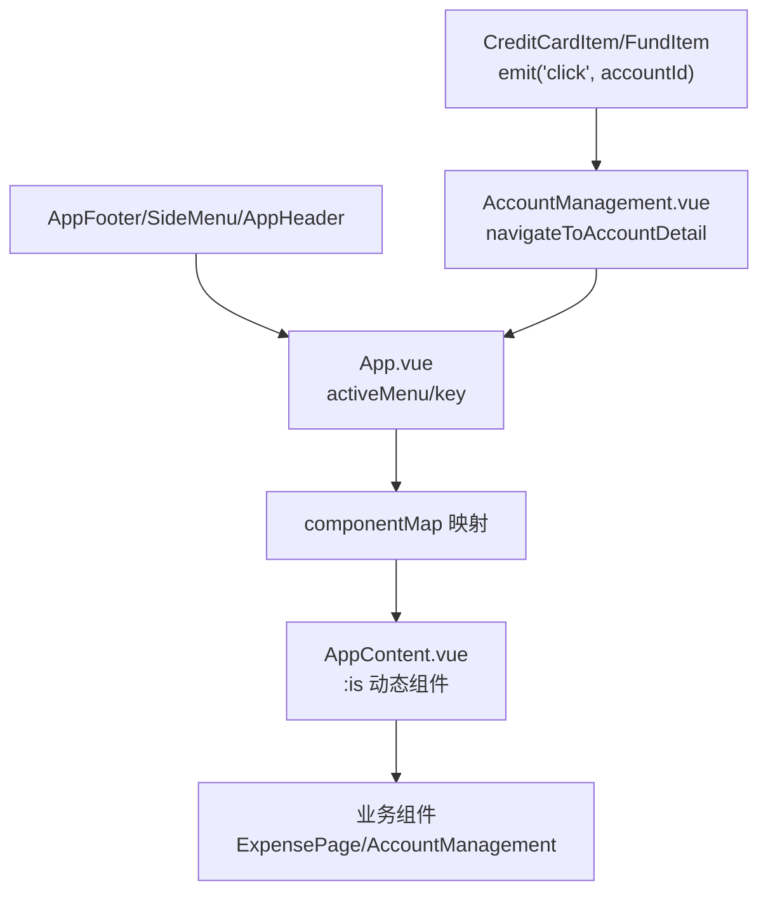
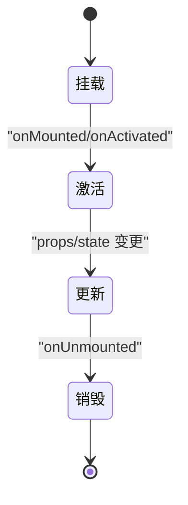
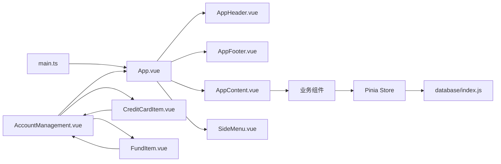

# 组件通信机制

<cite>
**本文引用的文件**
- [src\App.vue](file://src\App.vue)
- [src\components\common\AppHeader.vue](file://src\components\common\AppHeader.vue)
- [src\components\common\AppContent.vue](file://src\components\common\AppContent.vue)
- [src\components\common\AppFooter.vue](file://src\components\common\AppFooter.vue)
- [src\components\common\SideMenu.vue](file://src\components\common\SideMenu.vue)
- [src\components\common\PageTemplate.vue](file://src\components\common\PageTemplate.vue)
- [src\components\common\FloatingActionMenu.vue](file://src\components\common\FloatingActionMenu.vue)
- [src\components\mobile\expense\ExpensePage.vue](file://src\components\mobile\expense\ExpensePage.vue)
- [src\components\mobile\expense\TopNav.vue](file://src\components\mobile\expense\TopNav.vue)
- [src\components\mobile\account\AccountManagement.vue](file://src\components\mobile\account\AccountManagement.vue)
- [src\components\mobile\account\CreditCardItem.vue](file://src\components\mobile\account\CreditCardItem.vue)
- [src\components\mobile\account\FundItem.vue](file://src\components\mobile\account\FundItem.vue)
- [src\components\mobile\more\MoreFeatures.vue](file://src\components\mobile\more\MoreFeatures.vue)
- [src\stores\account.ts](file://src\stores\account.ts)
- [src\database\index.js](file://src\database\index.js)
- [src\main.ts](file://src\main.ts)
</cite>

## 更新摘要
**变更内容**
- 新增 CreditCardItem.vue 和 FundItem.vue 统一点击事件处理器，实现标准化的导航交互模式
- 更新 AccountManagement.vue 中的组件使用方式，采用统一的导航处理函数
- 改进组件间通信的一致性和可维护性

## 目录
1. [简介](#简介)
2. [项目结构](#项目结构)
3. [核心组件](#核心组件)
4. [架构总览](#架构总览)
5. [详细组件分析](#详细组件分析)
6. [依赖关系分析](#依赖关系分析)
7. [性能考量](#性能考量)
8. [故障排查指南](#故障排查指南)
9. [结论](#结论)
10. [附录](#附录)

## 简介
本文件聚焦于财务应用程序中的组件通信机制，系统性梳理 Vue 组件间的多种通信模式与应用级导航体系。重点覆盖：
- 父子组件通信：通过 props 传递与 $emit 事件回传
- 兄弟组件通信：通过共同父组件进行事件中转
- 跨层级组件通信：通过事件冒泡与事件总线思想实现
- 事件驱动机制：$emit、@事件监听、provide/inject 的使用场景
- 数据传递策略：props、事件回调、Pinia 全局状态共享
- 应用级导航系统：App.vue 作为根容器的导航控制、组件映射与动态组件加载
- 生命周期与状态同步：组件挂载、激活、更新、销毁阶段的状态处理
- 解耦设计原则：接口抽象、依赖注入、事件总线模式
- 示例与最佳实践：帮助开发者理解复杂交互模式

## 项目结构
项目采用"容器-展示"分层与"按功能域组织"的目录结构，核心导航与布局由 App.vue 控制，内容区通过动态组件加载具体业务页面。

**图表来源**
- [src\App.vue:1-195](file://src\App.vue#L1-L195)
- [src\components\common\AppHeader.vue:1-135](file://src\components\common\AppHeader.vue#L1-L135)
- [src\components\common\AppContent.vue:1-51](file://src\components\common\AppContent.vue#L1-L51)
- [src\components\common\AppFooter.vue:1-98](file://src\components\common\AppFooter.vue#L1-L98)
- [src\components\common\SideMenu.vue:1-255](file://src\components\common\SideMenu.vue#L1-L255)
- [src\components\mobile\account\AccountManagement.vue:1-689](file://src\components\mobile\account\AccountManagement.vue#L1-L689)
- [src\components\mobile\expense\ExpensePage.vue:1-88](file://src\components\mobile\expense\ExpensePage.vue#L1-L88)
- [src\components\mobile\expense\TopNav.vue:1-211](file://src\components\mobile\expense\TopNav.vue#L1-L211)
- [src\components\mobile\more\MoreFeatures.vue:1-200](file://src\components\mobile\more\MoreFeatures.vue#L1-L200)
- [src\components\mobile\account\CreditCardItem.vue:1-158](file://src\components\mobile\account\CreditCardItem.vue#L1-L158)
- [src\components\mobile\account\FundItem.vue:1-74](file://src\components\mobile\account\FundItem.vue#L1-L74)

**章节来源**
- [src\App.vue:1-195](file://src\App.vue#L1-L195)
- [src\components\common\AppContent.vue:1-51](file://src\components\common\AppContent.vue#L1-L51)

## 核心组件
- App.vue：应用根容器，负责全局导航状态、组件映射与动态组件加载；向上接收来自子组件的事件，向下派发给 AppContent 与各业务组件。
- AppHeader.vue：顶部导航，触发侧边菜单开关事件。
- AppContent.vue：动态内容区，根据当前组件键渲染对应业务组件，并透传 props 与事件。
- AppFooter.vue：底部导航，向 App.vue 发起页面切换请求。
- SideMenu.vue：侧边菜单，向 App.vue 发起页面切换与关闭事件。
- ExpensePage.vue：支出页，包含 TopNav 与浮动操作按钮，向上抛出导航与日期变更事件。
- TopNav.vue：顶部日期选择器，向上抛出日期变更与统计页导航事件。
- AccountManagement.vue：账户管理页，使用 Pinia Store 进行数据读写，向上抛出导航事件，集成 CreditCardItem 和 FundItem 组件。
- CreditCardItem.vue：信用卡卡片组件，新增统一点击事件处理器，实现导航到详细账户视图。
- FundItem.vue：基金/资金项目组件，新增统一点击事件处理器，实现导航到详细账户视图。
- MoreFeatures.vue：更多功能页，向上抛出导航事件。
- PageTemplate.vue：页面模板，定义 back/confirm 事件，供页面通用交互使用。
- FloatingActionMenu.vue：浮动操作菜单，接收按钮集合，触发动作回调。

**章节来源**
- [src\App.vue:22-173](file://src\App.vue#L22-L173)
- [src\components\common\AppHeader.vue:13-48](file://src\components\common\AppHeader.vue#L13-L48)
- [src\components\common\AppContent.vue:12-22](file://src\components\common\AppContent.vue#L12-L22)
- [src\components\common\AppFooter.vue:26-32](file://src\components\common\AppFooter.vue#L26-L32)
- [src\components\common\SideMenu.vue:49-90](file://src\components\common\SideMenu.vue#L49-L90)
- [src\components\mobile\expense\ExpensePage.vue:23-78](file://src\components\mobile\expense\ExpensePage.vue#L23-L78)
- [src\components\mobile\expense\TopNav.vue:49-89](file://src\components\mobile\expense\TopNav.vue#L49-L89)
- [src\components\mobile\account\AccountManagement.vue:158-327](file://src\components\mobile\account\AccountManagement.vue#L158-L327)
- [src\components\mobile\account\CreditCardItem.vue:22-46](file://src\components\mobile\account\CreditCardItem.vue#L22-L46)
- [src\components\mobile\account\FundItem.vue:11-28](file://src\components\mobile\account\FundItem.vue#L11-L28)
- [src\components\mobile\more\MoreFeatures.vue:54-108](file://src\components\mobile\more\MoreFeatures.vue#L54-L108)
- [src\components\common\PageTemplate.vue:24-38](file://src\components\common\PageTemplate.vue#L24-L38)
- [src\components\common\FloatingActionMenu.vue:33-59](file://src\components\common\FloatingActionMenu.vue#L33-L59)

## 架构总览
应用采用"事件驱动 + 动态组件 + 全局状态"的组合模式：
- 事件驱动：通过 $emit 与 @ 监听实现父子与跨层级通信。
- 动态组件：AppContent 通过 :is 动态渲染组件，结合 props 注入与事件透传。
- 全局状态：Pinia Store 管理账户等跨页面共享数据。
- 导航控制：App.vue 维护 activeMenu 与 navParams，统一调度页面切换与参数传递。

**图表来源**
- [src\components\common\AppFooter.vue:29-31](file://src\components\common\AppFooter.vue#L29-L31)
- [src\App.vue:119-137](file://src\App.vue#L119-L137)
- [src\components\common\AppContent.vue:18-21](file://src\components\common\AppContent.vue#L18-L21)

## 详细组件分析

### 父子组件通信（props/$emit）
- App.vue 向 AppContent 传递 currentComponent 与 componentProps，实现动态组件与参数注入。
- AppContent 将业务组件的 $emit 事件再次透传至 App.vue，形成事件冒泡链路。
- 业务组件（如 ExpensePage、AccountManagement）通过 emit 向上抛出导航与日期变更事件。
- **新增** CreditCardItem 和 FundItem 组件通过统一的点击事件处理器，向父组件传递账户 ID，实现标准化的导航交互。

**图表来源**
- [src\App.vue:64-117](file://src\App.vue#L64-L117)
- [src\components\common\AppContent.vue:3-8](file://src\components\common\AppContent.vue#L3-L8)
- [src\components\mobile\expense\ExpensePage.vue:33](file://src\components\mobile\expense\ExpensePage.vue#L33)
- [src\components\mobile\account\AccountManagement.vue:166](file://src\components\mobile\account\AccountManagement.vue#L166)
- [src\components\mobile\account\CreditCardItem.vue:37-45](file://src\components\mobile\account\CreditCardItem.vue#L37-L45)
- [src\components\mobile\account\FundItem.vue:19-27](file://src\components\mobile\account\FundItem.vue#L19-L27)

**章节来源**
- [src\App.vue:64-117](file://src\App.vue#L64-L117)
- [src\components\common\AppContent.vue:3-8](file://src\components\common\AppContent.vue#L3-L8)
- [src\components\mobile\expense\ExpensePage.vue:33](file://src\components\mobile\expense\ExpensePage.vue#L33)
- [src\components\mobile\account\AccountManagement.vue:166](file://src\components\mobile\account\AccountManagement.vue#L166)
- [src\components\mobile\account\CreditCardItem.vue:37-45](file://src\components\mobile\account\CreditCardItem.vue#L37-L45)
- [src\components\mobile\account\FundItem.vue:19-27](file://src\components\mobile\account\FundItem.vue#L19-L27)

### 兄弟组件通信（通过共同父组件）
- AppFooter 与 SideMenu 均向 App.vue 发起 navigate 事件，App.vue 作为中转站统一处理导航。
- AppContent 在渲染业务组件时，将业务组件的事件再次透传，保证事件链完整。
- **更新** AccountManagement.vue 中的 CreditCardItem 和 FundItem 组件通过统一的 navigateToAccountDetail 方法，实现一致的导航行为。

**图表来源**
- [src\components\common\AppFooter.vue:29-31](file://src\components\common\AppFooter.vue#L29-L31)
- [src\components\common\SideMenu.vue:57-60](file://src\components\common\SideMenu.vue#L57-L60)
- [src\App.vue:119-137](file://src\App.vue#L119-L137)
- [src\components\mobile\account\AccountManagement.vue:58-84](file://src\components\mobile\account\AccountManagement.vue#L58-L84)
- [src\components\mobile\account\CreditCardItem.vue:43-45](file://src\components\mobile\account\CreditCardItem.vue#L43-L45)
- [src\components\mobile\account\FundItem.vue:25-27](file://src\components\mobile\account\FundItem.vue#L25-L27)

**章节来源**
- [src\components\common\AppFooter.vue:29-31](file://src\components\common\AppFooter.vue#L29-L31)
- [src\components\common\SideMenu.vue:57-60](file://src\components\common\SideMenu.vue#L57-L60)
- [src\App.vue:119-137](file://src\App.vue#L119-L137)
- [src\components\mobile\account\AccountManagement.vue:58-84](file://src\components\mobile\account\AccountManagement.vue#L58-L84)
- [src\components\mobile\account\CreditCardItem.vue:43-45](file://src\components\mobile\account\CreditCardItem.vue#L43-L45)
- [src\components\mobile\account\FundItem.vue:25-27](file://src\components\mobile\account\FundItem.vue#L25-L27)

### 跨层级组件通信（事件冒泡与事件总线思想）
- AppHeader 通过 $emit('toggle-menu') 通知 App.vue 切换侧边菜单可见性。
- TopNav 通过 $emit('dateChange') 通知 ExpensePage 与 App.vue 更新日期范围。
- PageTemplate 通过 defineEmits 定义 back/confirm 事件，供页面模板内插槽内容使用。
- **更新** CreditCardItem 和 FundItem 组件通过 emit('click', accountId) 实现跨层级的导航事件传递。

**图表来源**
- [src\components\common\AppHeader.vue:16-18](file://src\components\common\AppHeader.vue#L16-L18)
- [src\components\mobile\expense\TopNav.vue:59](file://src\components\mobile\expense\TopNav.vue#L59)
- [src\components\mobile\expense\ExpensePage.vue:46-49](file://src\components\mobile\expense\ExpensePage.vue#L46-L49)
- [src\App.vue:140-143](file://src\App.vue#L140-L143)
- [src\components\mobile\account\CreditCardItem.vue:43-45](file://src\components\mobile\account\CreditCardItem.vue#L43-L45)
- [src\components\mobile\account\AccountManagement.vue:310-312](file://src\components\mobile\account\AccountManagement.vue#L310-L312)

**章节来源**
- [src\components\common\AppHeader.vue:16-18](file://src\components\common\AppHeader.vue#L16-L18)
- [src\components\mobile\expense\TopNav.vue:59](file://src\components\mobile\expense\TopNav.vue#L59)
- [src\components\mobile\expense\ExpensePage.vue:46-49](file://src\components\mobile\expense\ExpensePage.vue#L46-L49)
- [src\App.vue:140-143](file://src\App.vue#L140-L143)
- [src\components\mobile\account\CreditCardItem.vue:43-45](file://src\components\mobile\account\CreditCardItem.vue#L43-L45)
- [src\components\mobile\account\AccountManagement.vue:310-312](file://src\components\mobile\account\AccountManagement.vue#L310-L312)

### 事件驱动机制与 provide/inject 使用场景
- $emit 与 @ 监听：用于父子与跨层级事件传递，已在多处组件中广泛使用。
- provide/inject：当前代码未显式使用 provide/inject。可在需要深层组件共享配置或服务时引入，避免逐层 props 下传。

**章节来源**
- [src\components\common\PageTemplate.vue:34-37](file://src\components\common\PageTemplate.vue#L34-L37)
- [src\components\common\AppHeader.vue:16-18](file://src\components\common\AppHeader.vue#L16-L18)

### 数据传递策略
- props 传递：App.vue 通过 computed 计算 componentProps，向业务组件注入 year/month/fundId 等参数。
- 事件回调：业务组件通过 emit 向上抛出导航与日期变更事件，由 App.vue 统一处理。
- 全局状态共享：AccountManagement 使用 Pinia Store 管理账户数据，实现跨组件共享与持久化。
- **新增** 组件间数据传递：CreditCardItem 和 FundItem 通过 emit('click', accountId) 向父组件传递账户标识符，实现统一的数据传递模式。

**图表来源**
- [src\App.vue:92-117](file://src\App.vue#L92-L117)
- [src\components\common\AppContent.vue:18-21](file://src\components\common\AppContent.vue#L18-L21)
- [src\components\mobile\account\AccountManagement.vue:168](file://src\components\mobile\account\AccountManagement.vue#L168)
- [src\stores\account.ts:27-32](file://src\stores\account.ts#L27-L32)
- [src\components\mobile\account\CreditCardItem.vue:43-45](file://src\components\mobile\account\CreditCardItem.vue#L43-L45)
- [src\components\mobile\account\FundItem.vue:25-27](file://src\components\mobile\account\FundItem.vue#L25-L27)
- [src\components\mobile\account\AccountManagement.vue:310-312](file://src\components\mobile\account\AccountManagement.vue#L310-L312)

**章节来源**
- [src\App.vue:92-117](file://src\App.vue#L92-L117)
- [src\components\common\AppContent.vue:18-21](file://src\components\common\AppContent.vue#L18-L21)
- [src\components\mobile\account\AccountManagement.vue:168](file://src\components\mobile\account\AccountManagement.vue#L168)
- [src\stores\account.ts:27-32](file://src\stores\account.ts#L27-L32)
- [src\components\mobile\account\CreditCardItem.vue:43-45](file://src\components\mobile\account\CreditCardItem.vue#L43-L45)
- [src\components\mobile\account\FundItem.vue:25-27](file://src\components\mobile\account\FundItem.vue#L25-L27)
- [src\components\mobile\account\AccountManagement.vue:310-312](file://src\components\mobile\account\AccountManagement.vue#L310-L312)

### 应用级导航系统
- 组件映射：App.vue 维护 componentMap，将路由键映射到具体业务组件。
- 动态组件加载：AppContent 通过 :is 动态渲染组件，并透传 props。
- 导航参数：App.vue 维护 navParams，支持带参导航（如 fundId）。
- **更新** 统一导航处理：AccountManagement.vue 中的 navigateToAccountDetail 方法统一处理所有账户详情导航请求。

**图表来源**
- [src\App.vue:65-89](file://src\App.vue#L65-L89)
- [src\components\common\AppContent.vue:3-8](file://src\components\common\AppContent.vue#L3-L8)
- [src\components\common\AppFooter.vue:29-31](file://src\components\common\AppFooter.vue#L29-L31)
- [src\components\common\SideMenu.vue:86-89](file://src\components\common\SideMenu.vue#L86-L89)
- [src\components\common\AppHeader.vue:45-47](file://src\components\common\AppHeader.vue#L45-L47)
- [src\components\mobile\account\CreditCardItem.vue:43-45](file://src\components\mobile\account\CreditCardItem.vue#L43-L45)
- [src\components\mobile\account\FundItem.vue:25-27](file://src\components\mobile\account\FundItem.vue#L25-L27)
- [src\components\mobile\account\AccountManagement.vue:310-312](file://src\components\mobile\account\AccountManagement.vue#L310-L312)

**章节来源**
- [src\App.vue:65-89](file://src\App.vue#L65-L89)
- [src\components\common\AppContent.vue:3-8](file://src\components\common\AppContent.vue#L3-L8)
- [src\components\common\AppFooter.vue:29-31](file://src\components\common\AppFooter.vue#L29-L31)
- [src\components\common\SideMenu.vue:86-89](file://src\components\common\SideMenu.vue#L86-L89)
- [src\components\common\AppHeader.vue:45-47](file://src\components\common\AppHeader.vue#L45-L47)
- [src\components\mobile\account\CreditCardItem.vue:43-45](file://src\components\mobile\account\CreditCardItem.vue#L43-L45)
- [src\components\mobile\account\FundItem.vue:25-27](file://src\components\mobile\account\FundItem.vue#L25-L27)
- [src\components\mobile\account\AccountManagement.vue:310-312](file://src\components\mobile\account\AccountManagement.vue#L310-L312)

### 组件生命周期与状态同步
- App.vue：onMounted 中初始化 Capacitor 键盘插件，监听键盘事件。
- AccountManagement.vue：onMounted/onActivated 中加载账户数据，保证页面激活时数据同步。
- FloatingActionMenu.vue：通过 props.buttons 接收按钮集合，内部维护展开状态。
- TopNav.vue：在 onMounted/onUnmounted 中启动/停止轮播定时器，避免内存泄漏。
- PageTemplate.vue：通过 defineEmits 定义事件签名，确保事件契约清晰。
- **新增** CreditCardItem.vue 和 FundItem.vue：组件内部维护点击状态，提供统一的交互反馈。

**图表来源**
- [src\App.vue:155-172](file://src\App.vue#L155-L172)
- [src\components\mobile\account\AccountManagement.vue:334-340](file://src\components\mobile\account\AccountManagement.vue#L334-L340)
- [src\components\common\FloatingActionMenu.vue:44-59](file://src\components\common\FloatingActionMenu.vue#L44-L59)
- [src\components\mobile\more\MoreFeatures.vue:96-102](file://src\components\mobile\more\MoreFeatures.vue#L96-L102)
- [src\components\common\PageTemplate.vue:34-37](file://src\components\common\PageTemplate.vue#L34-L37)

**章节来源**
- [src\App.vue:155-172](file://src\App.vue#L155-L172)
- [src\components\mobile\account\AccountManagement.vue:334-340](file://src\components\mobile\account\AccountManagement.vue#L334-L340)
- [src\components\common\FloatingActionMenu.vue:44-59](file://src\components\common\FloatingActionMenu.vue#L44-L59)
- [src\components\mobile\more\MoreFeatures.vue:96-102](file://src\components\mobile\more\MoreFeatures.vue#L96-L102)
- [src\components\common\PageTemplate.vue:34-37](file://src\components\common\PageTemplate.vue#L34-L37)

### 组件解耦设计原则
- 接口抽象：通过 defineEmits/defineProps 明确事件与属性契约，降低耦合。
- 依赖注入：App.vue 作为容器，集中管理导航与状态，业务组件仅关注自身逻辑。
- 事件总线模式：通过事件冒泡与 App.vue 中央处理，避免跨层级直接依赖。
- **新增** 统一交互模式：CreditCardItem 和 FundItem 采用相同的点击事件处理模式，提高代码一致性。

**章节来源**
- [src\components\common\PageTemplate.vue:27-37](file://src\components\common\PageTemplate.vue#L27-L37)
- [src\App.vue:119-137](file://src\App.vue#L119-L137)
- [src\components\mobile\account\CreditCardItem.vue:43-45](file://src\components\mobile\account\CreditCardItem.vue#L43-L45)
- [src\components\mobile\account\FundItem.vue:25-27](file://src\components\mobile\account\FundItem.vue#L25-L27)

### 组件通信示例与最佳实践
- 示例路径
  - 顶部菜单切换侧边菜单：[src\components\common\AppHeader.vue:45-47](file://src\components\common\AppHeader.vue#L45-L47) → [src\App.vue:146-148](file://src\App.vue#L146-L148)
  - 底部导航切换页面：[src\components\common\AppFooter.vue:29-31](file://src\components\common\AppFooter.vue#L29-L31) → [src\App.vue:119-137](file://src\App.vue#L119-L137)
  - 日期选择更新：[src\components\mobile\expense\TopNav.vue:73-83](file://src\components\mobile\expense\TopNav.vue#L73-L83) → [src\components\mobile\expense\ExpensePage.vue:46-49](file://src\components\mobile\expense\ExpensePage.vue#L46-L49) → [src\App.vue:140-143](file://src\App.vue#L140-L143)
  - 页面模板事件：[src\components\common\PageTemplate.vue:34-37](file://src\components\common\PageTemplate.vue#L34-L37)
  - 浮动菜单按钮：[src\components\common\FloatingActionMenu.vue:38-59](file://src\components\common\FloatingActionMenu.vue#L38-L59)
  - **新增** 统一导航交互：[src\components\mobile\account\CreditCardItem.vue:43-45](file://src\components\mobile\account\CreditCardItem.vue#L43-L45) → [src\components\mobile\account\AccountManagement.vue:310-312](file://src\components\mobile\account\AccountManagement.vue#L310-L312) → [src\App.vue:161-179](file://src\App.vue#L161-L179)

- 最佳实践
  - 明确事件命名与参数结构，统一在 App.vue 中央处理导航与日期变更。
  - 使用 computed 与 v-bind 动态注入 props，减少重复逻辑。
  - 在业务组件中使用 Pinia 管理跨页面共享状态，避免 props 穿透。
  - 在组件卸载时清理定时器与监听器，防止内存泄漏。
  - **新增** 采用统一的事件处理模式：所有子组件使用相同的事件命名和参数结构，便于维护和扩展。

**章节来源**
- [src\components\common\AppHeader.vue:45-47](file://src\components\common\AppHeader.vue#L45-L47)
- [src\components\common\AppFooter.vue:29-31](file://src\components\common\AppFooter.vue#L29-L31)
- [src\components\mobile\expense\TopNav.vue:73-83](file://src\components\mobile\expense\TopNav.vue#L73-L83)
- [src\components\mobile\expense\ExpensePage.vue:46-49](file://src\components\mobile\expense\ExpensePage.vue#L46-L49)
- [src\App.vue:140-143](file://src\App.vue#L140-L143)
- [src\components\common\PageTemplate.vue:34-37](file://src\components\common\PageTemplate.vue#L34-L37)
- [src\components\common\FloatingActionMenu.vue:38-59](file://src\components\common\FloatingActionMenu.vue#L38-L59)
- [src\components\mobile\account\CreditCardItem.vue:43-45](file://src\components\mobile\account\CreditCardItem.vue#L43-L45)
- [src\components\mobile\account\AccountManagement.vue:310-312](file://src\components\mobile\account\AccountManagement.vue#L310-L312)
- [src\App.vue:161-179](file://src\App.vue#L161-L179)

## 依赖关系分析
- 应用入口：main.ts 创建应用并注册 Pinia、ElementPlus。
- 数据层：database/index.js 提供跨平台数据库能力，AccountManagement 通过 Pinia Store 调用数据库。
- 组件层：App.vue 作为容器，聚合 Header/Footer/Content/Menu，动态渲染业务组件。
- **更新** 组件通信层：AccountManagement.vue 作为中介组件，协调 CreditCardItem 和 FundItem 与 App.vue 的通信。

**图表来源**
- [src\main.ts:1-16](file://src\main.ts#L1-L16)
- [src\App.vue:28-31](file://src\App.vue#L28-L31)
- [src\components\common\AppContent.vue:3](file://src\components\common\AppContent.vue#L3)
- [src\stores\account.ts:5-6](file://src\stores\account.ts#L5-L6)
- [src\database\index.js:8-10](file://src\database\index.js#L8-L10)
- [src\components\mobile\account\AccountManagement.vue:153-154](file://src\components\mobile\account\AccountManagement.vue#L153-L154)
- [src\components\mobile\account\CreditCardItem.vue:153](file://src\components\mobile\account\CreditCardItem.vue#L153)
- [src\components\mobile\account\FundItem.vue:154](file://src\components\mobile\account\FundItem.vue#L154)

**章节来源**
- [src\main.ts:1-16](file://src\main.ts#L1-L16)
- [src\App.vue:28-31](file://src\App.vue#L28-L31)
- [src\components\common\AppContent.vue:3](file://src\components\common\AppContent.vue#L3)
- [src\stores\account.ts:5-6](file://src\stores\account.ts#L5-L6)
- [src\database\index.js:8-10](file://src\database\index.js#L8-L10)
- [src\components\mobile\account\AccountManagement.vue:153-154](file://src\components\mobile\account\AccountManagement.vue#L153-L154)
- [src\components\mobile\account\CreditCardItem.vue:153](file://src\components\mobile\account\CreditCardItem.vue#L153)
- [src\components\mobile\account\FundItem.vue:154](file://src\components\mobile\account\FundItem.vue#L154)

## 性能考量
- 动态组件渲染：通过 :is 动态渲染，减少不必要的静态模板。
- 事件透传：AppContent 仅做事件中转，避免重复计算。
- Pinia 状态：集中管理账户数据，减少跨组件重复请求。
- 数据库访问：DatabaseManager 单例连接、查询缓存与批处理，提升性能与稳定性。
- **新增** 统一事件处理：CreditCardItem 和 FundItem 采用统一的事件处理模式，减少重复代码和提高执行效率。

**章节来源**
- [src\components\common\AppContent.vue:3-8](file://src\components\common\AppContent.vue#L3-L8)
- [src\stores\account.ts:27-32](file://src\stores\account.ts#L27-L32)
- [src\database\index.js:20-32](file://src\database\index.js#L20-L32)
- [src\components\mobile\account\CreditCardItem.vue:43-45](file://src\components\mobile\account\CreditCardItem.vue#L43-L45)
- [src\components\mobile\account\FundItem.vue:25-27](file://src\components\mobile\account\FundItem.vue#L25-L27)

## 故障排查指南
- 键盘事件异常：检查 Capacitor 键盘插件初始化与事件监听。
  - 参考：[src\App.vue:155-172](file://src\App.vue#L155-L172)
- 导航参数丢失：确认 navigateTo 的参数传递与 navParams 存储。
  - 参考：[src\App.vue:119-137](file://src\App.vue#L119-L137)
- 日期选择无效：检查 TopNav 的 dateChange 事件与 ExpensePage 的处理。
  - 参考：[src\components\mobile\expense\TopNav.vue:73-83](file://src\components\mobile\expense\TopNav.vue#L73-L83)、[src\components\mobile\expense\ExpensePage.vue:46-49](file://src\components\mobile\expense\ExpensePage.vue#L46-L49)
- 浮动菜单不响应：检查按钮集合与点击事件绑定。
  - 参考：[src\components\common\FloatingActionMenu.vue:44-59](file://src\components\common\FloatingActionMenu.vue#L44-L59)
- 数据库连接失败：检查 Platform 类型与连接流程。
  - 参考：[src\database\index.js:56-190](file://src\database\index.js#L56-L190)
- **新增** 统一导航失效：检查 CreditCardItem 和 FundItem 的 emit 事件是否正确传递到 AccountManagement.vue，确认 navigateToAccountDetail 方法正常工作。
  - 参考：[src\components\mobile\account\CreditCardItem.vue:43-45](file://src\components\mobile\account\CreditCardItem.vue#L43-L45)、[src\components\mobile\account\AccountManagement.vue:310-312](file://src\components\mobile\account\AccountManagement.vue#L310-L312)

**章节来源**
- [src\App.vue:155-172](file://src\App.vue#L155-L172)
- [src\App.vue:119-137](file://src\App.vue#L119-L137)
- [src\components\mobile\expense\TopNav.vue:73-83](file://src\components\mobile\expense\TopNav.vue#L73-L83)
- [src\components\mobile\expense\ExpensePage.vue:46-49](file://src\components\mobile\expense\ExpensePage.vue#L46-L49)
- [src\components\common\FloatingActionMenu.vue:44-59](file://src\components\common\FloatingActionMenu.vue#L44-L59)
- [src\database\index.js:56-190](file://src\database\index.js#L56-L190)
- [src\components\mobile\account\CreditCardItem.vue:43-45](file://src\components\mobile\account\CreditCardItem.vue#L43-L45)
- [src\components\mobile\account\AccountManagement.vue:310-312](file://src\components\mobile\account\AccountManagement.vue#L310-L312)

## 结论
本项目通过"事件驱动 + 动态组件 + 全局状态"的组合，实现了清晰的组件通信与导航体系。App.vue 作为根容器承担了统一的导航与状态管理职责，业务组件专注于自身功能，配合 Pinia 与数据库层，形成了高内聚、低耦合的架构。

**更新亮点**：CreditCardItem.vue 和 FundItem.vue 新增统一的点击事件处理器，实现了标准化的导航交互模式。AccountManagement.vue 通过统一的 navigateToAccountDetail 方法，确保所有账户详情导航请求都经过一致的处理流程。这种改进提高了代码的一致性、可维护性和扩展性。

遵循本文的最佳实践与故障排查建议，可进一步提升开发效率与系统稳定性。

## 附录
- 事件总线建议：若未来出现更深层的跨组件通信需求，可在根组件引入 provide/inject 或轻量事件总线，避免 props 穿透与重复监听。
- 参数规范：导航与日期变更事件建议统一参数结构，便于调试与扩展。
- **新增** 统一交互模式：建议在所有类似的子组件中采用相同的事件处理模式，保持代码风格的一致性。
- **新增** 组件测试：建议为 CreditCardItem 和 FundItem 添加单元测试，验证点击事件的正确传递和参数处理。