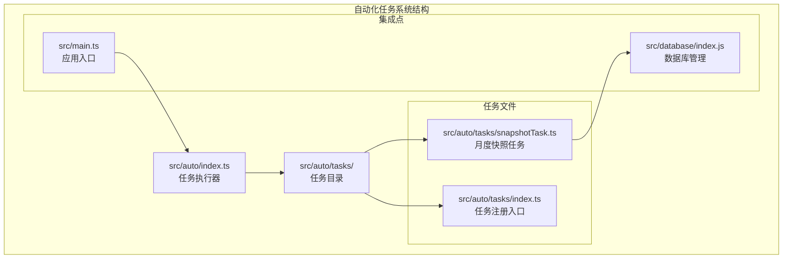
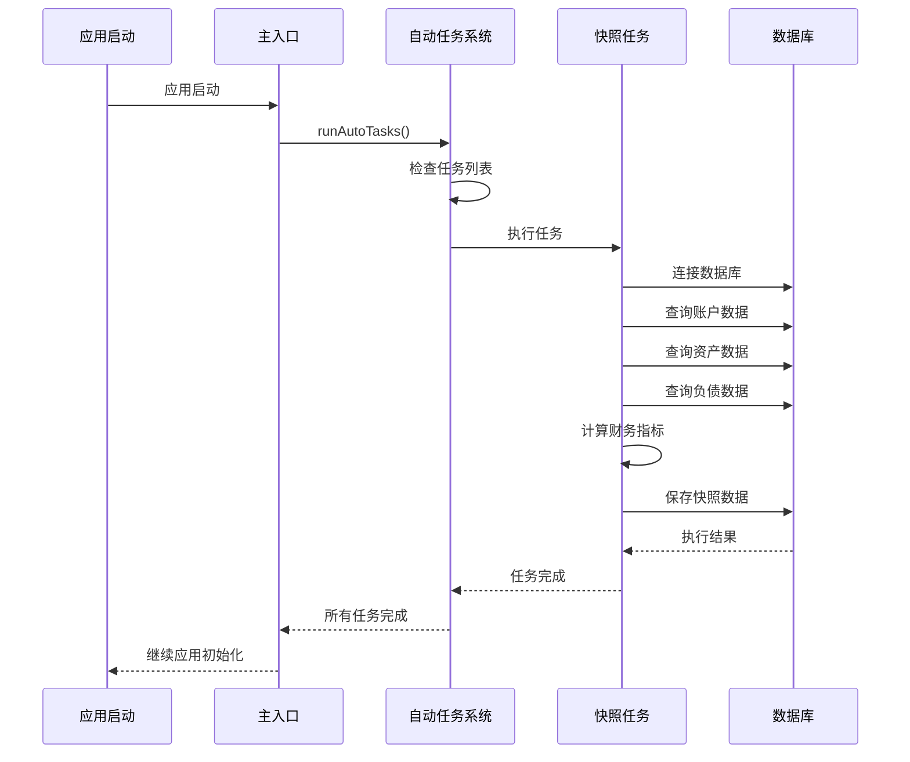
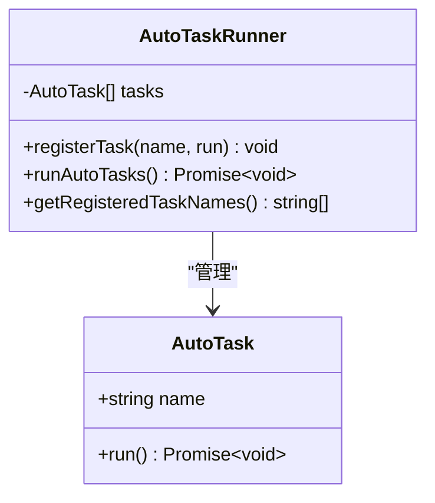
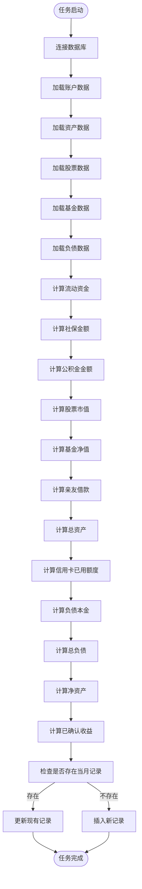
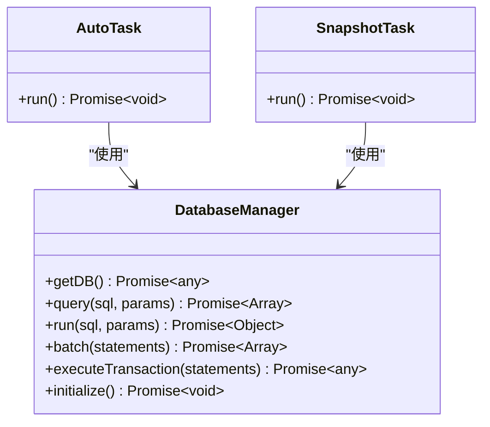
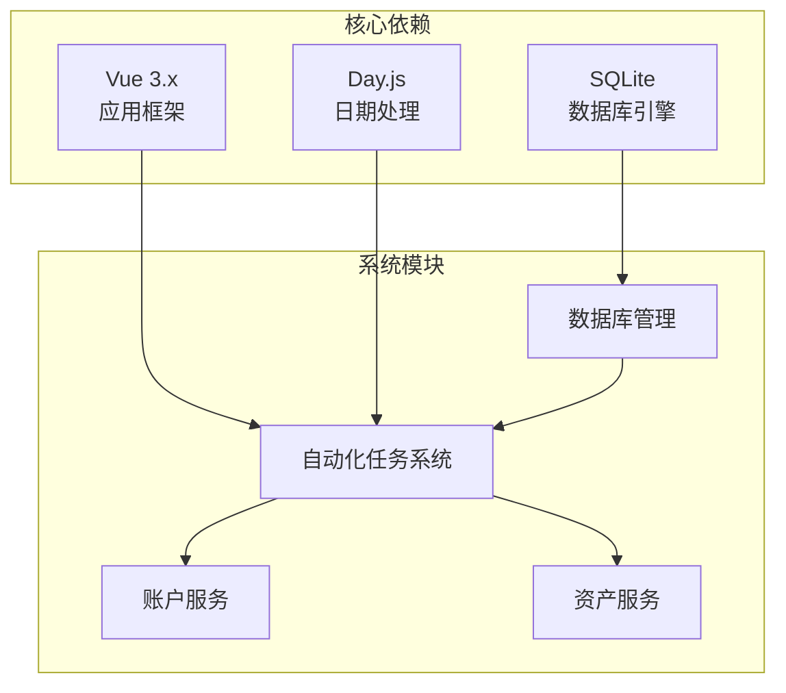

# 自动化任务系统

<cite>
**本文档引用的文件**
- [src/auto/index.ts](file://src/auto/index.ts)
- [src/auto/tasks/index.ts](file://src/auto/tasks/index.ts)
- [src/auto/tasks/snapshotTask.ts](file://src/auto/tasks/snapshotTask.ts)
- [src/main.ts](file://src/main.ts)
- [src/database/index.js](file://src/database/index.js)
- [src/services/account/accountService.ts](file://src/services/account/accountService.ts)
- [src/services/asset/assetService.ts](file://src/services/asset/assetService.ts)
- [package.json](file://package.json)
</cite>

## 目录
1. [简介](#简介)
2. [项目结构](#项目结构)
3. [核心组件](#核心组件)
4. [架构概览](#架构概览)
5. [详细组件分析](#详细组件分析)
6. [依赖关系分析](#依赖关系分析)
7. [性能考虑](#性能考虑)
8. [故障排除指南](#故障排除指南)
9. [结论](#结论)

## 简介

自动化任务系统是金融应用中的一个关键模块，负责在应用启动时自动执行各种维护和统计任务。该系统采用插件式架构设计，支持动态注册和执行不同类型的任务，目前主要实现了一个月度财务快照任务，用于自动计算和保存用户的总资产、总负债和净资产数据。

该系统基于事件驱动的设计模式，通过简单的注册机制实现了高度可扩展的任务管理能力，为未来的功能扩展提供了良好的基础。

## 项目结构

自动化任务系统位于项目的 `src/auto` 目录下，采用模块化设计，包含以下核心文件：

**图表来源**
- [src/auto/index.ts:1-52](file://src/auto/index.ts#L1-L52)
- [src/auto/tasks/index.ts:1-14](file://src/auto/tasks/index.ts#L1-L14)
- [src/auto/tasks/snapshotTask.ts:1-120](file://src/auto/tasks/snapshotTask.ts#L1-L120)

**章节来源**
- [src/auto/index.ts:1-52](file://src/auto/index.ts#L1-L52)
- [src/auto/tasks/index.ts:1-14](file://src/auto/tasks/index.ts#L1-L14)

## 核心组件

### 任务执行器 (AutoTaskRunner)

任务执行器是整个系统的核心，提供统一的任务注册和执行接口。它采用单例模式设计，确保任务管理的全局一致性。

**主要特性：**
- 任务注册机制：通过 `registerTask()` 函数注册异步任务
- 顺序执行：按注册顺序依次执行所有任务
- 错误隔离：单个任务的错误不会影响其他任务的执行
- 调试支持：提供任务名称列表查询功能

### 任务注册入口

任务注册入口文件作为所有任务的统一导入点，通过侧效应加载实现自动注册。这种设计确保了新任务的添加只需简单地在该文件中添加导入语句即可。

### 月度财务快照任务

这是系统中第一个实现的具体任务，负责在应用启动时自动计算和保存用户的财务快照数据。

**任务功能：**
- 计算总资产（流动资金、社保公积金、股票市值、基金净值、亲友借款等）
- 计算总负债（贷款本金、信用卡已用额度）
- 计算净资产（总资产 - 总负债）
- 自动保存到 `asset_monthly_snapshots` 表中
- 支持更新现有记录或插入新记录

**章节来源**
- [src/auto/index.ts:12-51](file://src/auto/index.ts#L12-L51)
- [src/auto/tasks/index.ts:1-14](file://src/auto/tasks/index.ts#L1-L14)
- [src/auto/tasks/snapshotTask.ts:12-119](file://src/auto/tasks/snapshotTask.ts#L12-L119)

## 架构概览

系统采用分层架构设计，各组件职责清晰，耦合度低：

**图表来源**
- [src/main.ts:56-57](file://src/main.ts#L56-L57)
- [src/auto/index.ts:32-44](file://src/auto/index.ts#L32-L44)
- [src/auto/tasks/snapshotTask.ts:12-119](file://src/auto/tasks/snapshotTask.ts#L12-L119)

## 详细组件分析

### 任务执行器实现

任务执行器采用简洁而高效的设计模式：

**图表来源**
- [src/auto/index.ts:12-51](file://src/auto/index.ts#L12-L51)

**实现特点：**
- 使用数组存储任务，保证执行顺序
- 异步执行，支持现代JavaScript特性
- 错误处理策略：捕获异常但不中断其他任务
- 轻量级设计，无外部依赖

### 月度财务快照任务分析

快照任务是一个完整的业务逻辑实现，展示了如何处理复杂的财务计算：

**图表来源**
- [src/auto/tasks/snapshotTask.ts:12-119](file://src/auto/tasks/snapshotTask.ts#L12-L119)

**计算逻辑说明：**
- **总资产计算**：流动资金 + 社保公积金 + 股票市值 + 基金净值 + 亲友借款
- **总负债计算**：贷款本金 + 信用卡已用额度
- **净资产计算**：总资产 - 总负债
- **已确认收益**：股票和基金的已确认利润

### 数据库集成分析

任务系统与数据库层的集成采用了统一的访问接口：

**图表来源**
- [src/database/index.js:21-971](file://src/database/index.js#L21-L971)
- [src/auto/tasks/snapshotTask.ts:8-10](file://src/auto/tasks/snapshotTask.ts#L8-L10)

**数据库特性：**
- 支持原生平台和Web平台双环境
- 单例模式确保连接复用
- 查询缓存机制提升性能
- 事务支持保证数据一致性

**章节来源**
- [src/auto/tasks/snapshotTask.ts:12-119](file://src/auto/tasks/snapshotTask.ts#L12-L119)
- [src/database/index.js:21-971](file://src/database/index.js#L21-L971)

## 依赖关系分析

系统依赖关系相对简单，主要依赖于Vue框架和Day.js日期处理库：

**图表来源**
- [package.json:19-38](file://package.json#L19-L38)
- [src/auto/index.ts:1-10](file://src/auto/index.ts#L1-L10)

**依赖特点：**
- 最小化依赖：只引入必要的第三方库
- 类型安全：使用TypeScript提供编译时类型检查
- 平台兼容：支持Web和原生平台部署

**章节来源**
- [package.json:19-38](file://package.json#L19-L38)
- [src/main.ts:1-169](file://src/main.ts#L1-L169)

## 性能考虑

### 内存管理

系统采用轻量级设计，避免不必要的内存占用：
- 任务列表使用简单数组存储
- 数据库连接采用单例模式
- 查询结果支持缓存机制

### 执行效率

- 任务按顺序执行，避免并发冲突
- 数据库操作批量处理
- 事务支持确保原子性

### 扩展性设计

系统为未来扩展预留了充足的空间：
- 插件式任务注册机制
- 统一的错误处理策略
- 模块化的架构设计

## 故障排除指南

### 常见问题及解决方案

**问题1：任务未执行**
- 检查任务文件是否正确导入到注册入口
- 验证任务注册函数调用
- 查看控制台是否有错误信息

**问题2：数据库连接失败**
- 确认数据库初始化过程
- 检查平台兼容性（原生/Web）
- 验证权限设置

**问题3：财务数据计算错误**
- 检查数据表结构完整性
- 验证数据类型转换
- 确认计算逻辑正确性

### 调试技巧

1. **启用调试模式**：在数据库管理器中设置DEBUG标志
2. **任务状态监控**：使用 `getRegisteredTaskNames()` 获取任务列表
3. **错误日志分析**：关注控制台输出的错误信息

**章节来源**
- [src/auto/index.ts:49-51](file://src/auto/index.ts#L49-L51)
- [src/database/index.js:13-18](file://src/database/index.js#L13-L18)

## 结论

自动化任务系统为金融应用提供了一个简洁而强大的基础设施，具有以下优势：

**设计优势：**
- 模块化架构，易于维护和扩展
- 插件式设计，支持动态任务注册
- 统一的错误处理机制
- 跨平台兼容性

**功能价值：**
- 自动化财务统计，减少人工干预
- 数据一致性保障，通过事务机制
- 性能优化，支持缓存和批量处理
- 调试友好，提供完整的监控能力

**扩展潜力：**
系统为未来的功能扩展奠定了良好基础，可以轻松添加新的任务类型，如：
- 定期备份任务
- 数据清理任务  
- 报表生成任务
- 预警通知任务

该系统体现了现代前端应用的最佳实践，为类似的数据管理系统提供了优秀的参考模板。