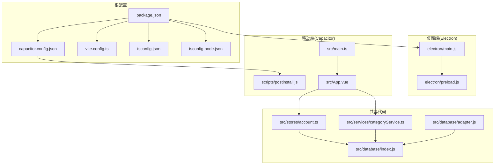
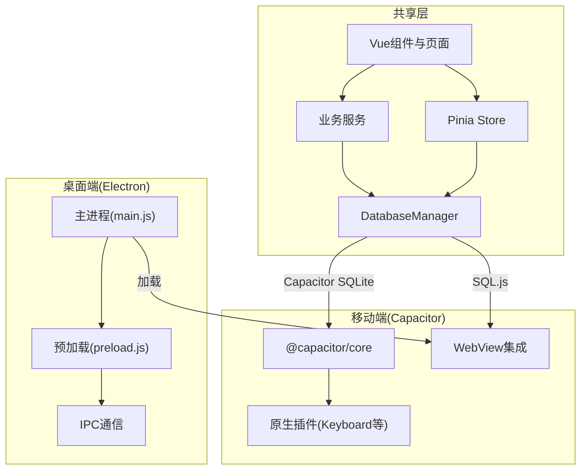
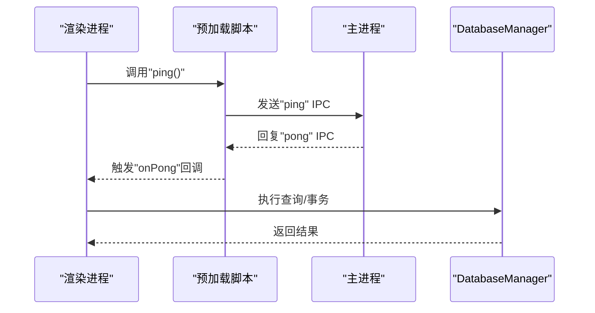
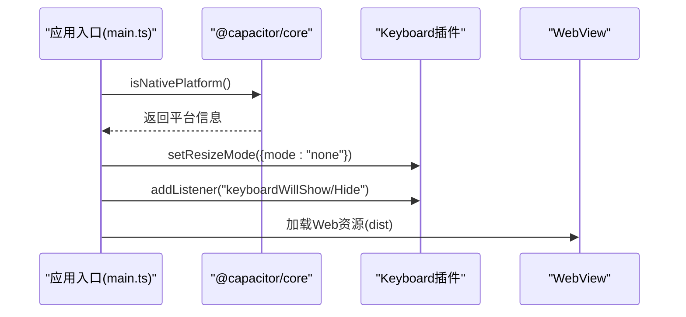
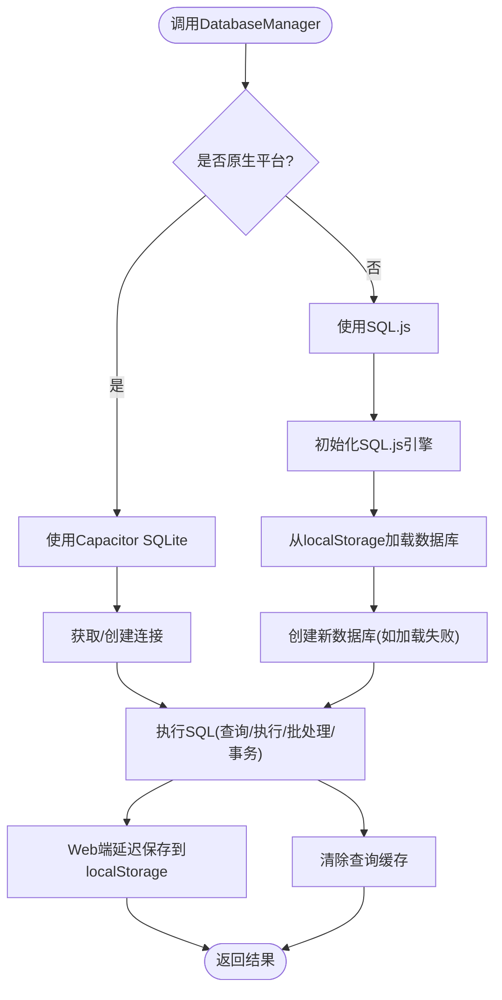
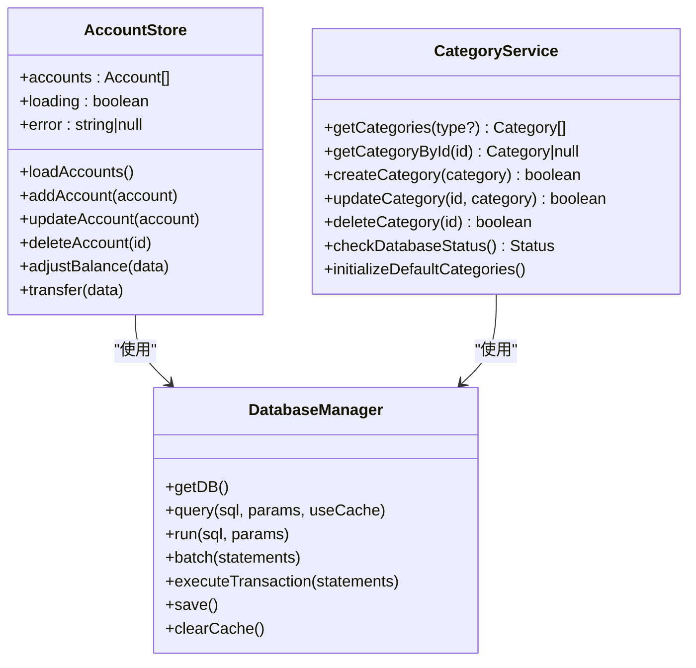
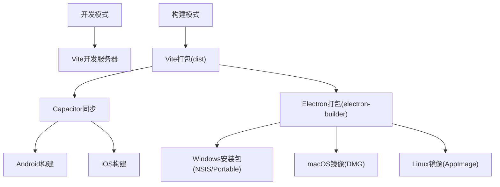
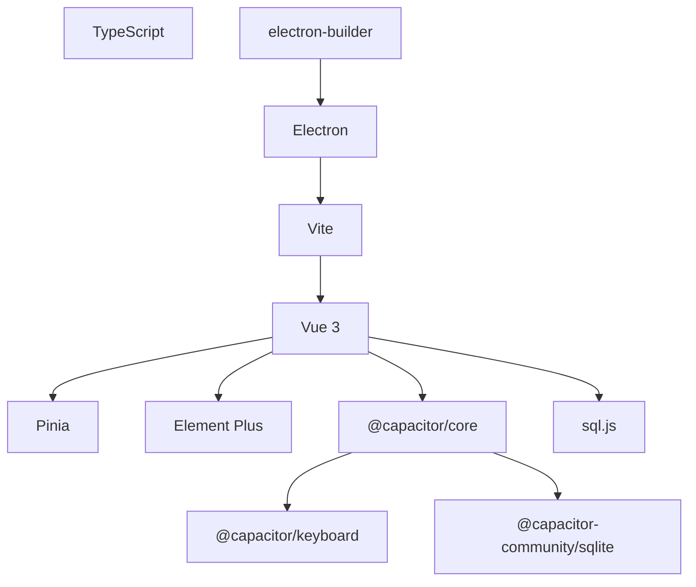

# 跨平台架构设计

<cite>
**本文档引用的文件**
- [package.json](file://package.json)
- [capacitor.config.json](file://capacitor.config.json)
- [vite.config.ts](file://vite.config.ts)
- [electron/main.js](file://electron/main.js)
- [electron/preload.js](file://electron/preload.js)
- [src/main.ts](file://src/main.ts)
- [src/App.vue](file://src/App.vue)
- [src/database/index.js](file://src/database/index.js)
- [src/database/adapter.js](file://src/database/adapter.js)
- [scripts/postinstall.js](file://scripts/postinstall.js)
- [src/stores/account.ts](file://src/stores/account.ts)
- [src/services/categoryService.ts](file://src/services/categoryService.ts)
- [tsconfig.json](file://tsconfig.json)
- [tsconfig.node.json](file://tsconfig.node.json)
</cite>

## 目录
1. [简介](#简介)
2. [项目结构](#项目结构)
3. [核心组件](#核心组件)
4. [架构总览](#架构总览)
5. [详细组件分析](#详细组件分析)
6. [依赖分析](#依赖分析)
7. [性能考虑](#性能考虑)
8. [故障排除指南](#故障排除指南)
9. [结论](#结论)
10. [附录](#附录)

## 简介
本项目是一个跨平台财务应用程序，采用统一的前端代码库，通过Electron实现桌面端运行，通过Capacitor实现移动端（iOS/Android）与Web端运行。架构以Vue 3 + TypeScript为核心，结合Pinia状态管理、Element Plus UI框架，并通过统一的数据库抽象层实现Web、移动端与桌面端的数据持久化一致性。

## 项目结构
项目采用“根目录统一配置 + 平台特定入口”的组织方式：
- 根配置：package.json、capacitor.config.json、vite.config.ts、tsconfig.json等
- 桌面端：electron目录下的主进程与预加载脚本
- 移动端：Capacitor配置与原生插件集成
- 共享代码：src目录下所有Vue组件、服务、存储、数据库与工具

**图表来源**
- [package.json:1-72](file://package.json#L1-L72)
- [capacitor.config.json:1-23](file://capacitor.config.json#L1-L23)
- [vite.config.ts:1-11](file://vite.config.ts#L1-L11)
- [electron/main.js:1-70](file://electron/main.js#L1-L70)
- [electron/preload.js:1-7](file://electron/preload.js#L1-L7)
- [scripts/postinstall.js:1-145](file://scripts/postinstall.js#L1-L145)
- [src/App.vue:1-195](file://src/App.vue#L1-L195)
- [src/main.ts:1-16](file://src/main.ts#L1-L16)
- [src/database/index.js:1-935](file://src/database/index.js#L1-L935)
- [src/database/adapter.js:1-34](file://src/database/adapter.js#L1-L34)
- [src/stores/account.ts:1-273](file://src/stores/account.ts#L1-L273)
- [src/services/categoryService.ts:1-260](file://src/services/categoryService.ts#L1-L260)

**章节来源**
- [package.json:1-72](file://package.json#L1-L72)
- [capacitor.config.json:1-23](file://capacitor.config.json#L1-L23)
- [vite.config.ts:1-11](file://vite.config.ts#L1-L11)
- [tsconfig.json:1-25](file://tsconfig.json#L1-L25)
- [tsconfig.node.json:1-10](file://tsconfig.node.json#L1-L10)

## 核心组件
- 应用入口与平台检测
  - Vue应用入口负责初始化Pinia、UI框架，并检测是否运行于原生平台。
  - 参考路径：[src/main.ts:1-16](file://src/main.ts#L1-L16)
- 应用主界面与路由
  - App.vue集中管理移动端布局、导航与组件切换，支持动态组件加载与参数传递。
  - 参考路径：[src/App.vue:1-195](file://src/App.vue#L1-L195)
- 数据库管理层
  - DatabaseManager提供统一的数据库连接、查询、执行、批处理与事务能力，支持Capacitor SQLite与Web端SQL.js双栈。
  - 参考路径：[src/database/index.js:1-935](file://src/database/index.js#L1-L935)
- 数据库适配器
  - adapter.js根据平台返回不同数据库实现，便于扩展与替换。
  - 参考路径：[src/database/adapter.js:1-34](file://src/database/adapter.js#L1-L34)
- 状态管理与业务服务
  - account.ts定义账户相关的Pinia Store，封装CRUD与业务逻辑。
  - categoryService.ts提供分类管理服务，包含默认分类初始化与数据库状态检查。
  - 参考路径：
    - [src/stores/account.ts:1-273](file://src/stores/account.ts#L1-L273)
    - [src/services/categoryService.ts:1-260](file://src/services/categoryService.ts#L1-L260)
- 桌面端主进程与IPC
  - electron/main.js负责创建BrowserWindow、加载开发/生产资源、处理窗口生命周期与IPC事件。
  - electron/preload.js通过contextBridge暴露受控API给渲染进程。
  - 参考路径：
    - [electron/main.js:1-70](file://electron/main.js#L1-L70)
    - [electron/preload.js:1-7](file://electron/preload.js#L1-L7)
- Capacitor配置与构建后处理
  - capacitor.config.json定义应用ID、名称、WebView目录与插件配置。
  - scripts/postinstall.js在安装后自动修改Android构建配置，确保Java兼容性与命名空间。
  - 参考路径：
    - [capacitor.config.json:1-23](file://capacitor.config.json#L1-L23)
    - [scripts/postinstall.js:1-145](file://scripts/postinstall.js#L1-L145)

**章节来源**
- [src/main.ts:1-16](file://src/main.ts#L1-L16)
- [src/App.vue:1-195](file://src/App.vue#L1-L195)
- [src/database/index.js:1-935](file://src/database/index.js#L1-L935)
- [src/database/adapter.js:1-34](file://src/database/adapter.js#L1-L34)
- [src/stores/account.ts:1-273](file://src/stores/account.ts#L1-L273)
- [src/services/categoryService.ts:1-260](file://src/services/categoryService.ts#L1-L260)
- [electron/main.js:1-70](file://electron/main.js#L1-L70)
- [electron/preload.js:1-7](file://electron/preload.js#L1-L7)
- [capacitor.config.json:1-23](file://capacitor.config.json#L1-L23)
- [scripts/postinstall.js:1-145](file://scripts/postinstall.js#L1-L145)

## 架构总览
该系统采用“共享前端 + 平台适配层”的分层架构：
- 共享层：Vue组件、服务、状态管理、数据库抽象
- 平台适配层：Electron主进程与预加载脚本、Capacitor插件与构建配置
- 数据层：统一的DatabaseManager，分别对接Capacitor SQLite与Web端SQL.js

**图表来源**
- [src/App.vue:1-195](file://src/App.vue#L1-L195)
- [src/stores/account.ts:1-273](file://src/stores/account.ts#L1-L273)
- [src/services/categoryService.ts:1-260](file://src/services/categoryService.ts#L1-L260)
- [src/database/index.js:1-935](file://src/database/index.js#L1-L935)
- [electron/main.js:1-70](file://electron/main.js#L1-L70)
- [electron/preload.js:1-7](file://electron/preload.js#L1-L7)
- [capacitor.config.json:1-23](file://capacitor.config.json#L1-L23)

## 详细组件分析

### 桌面端架构：主进程与预加载桥接
- 主进程职责
  - 创建BrowserWindow，设置webPreferences（启用Node集成、禁用上下文隔离），加载开发或生产资源。
  - 注册IPC事件处理示例，演示渲染进程与主进程的双向通信。
- 预加载脚本职责
  - 使用contextBridge将受限API暴露到渲染进程，避免直接暴露完整Node/Electron API。
- 安全策略
  - 当前配置启用了Node集成且禁用了上下文隔离，建议在生产环境中重新评估安全策略，优先采用最小权限暴露与严格输入校验。

**图表来源**
- [electron/main.js:67-69](file://electron/main.js#L67-L69)
- [electron/preload.js:3-6](file://electron/preload.js#L3-L6)
- [src/database/index.js:199-264](file://src/database/index.js#L199-L264)

**章节来源**
- [electron/main.js:1-70](file://electron/main.js#L1-L70)
- [electron/preload.js:1-7](file://electron/preload.js#L1-L7)

### 移动端架构：Capacitor原生插件与WebView集成
- 平台检测与插件初始化
  - 应用启动时检测原生平台，移动端启用Keyboard插件并设置键盘行为。
- WebView与Web资源
  - Capacitor配置指定webDir为dist，bundledWebRuntime为false，表示使用打包后的静态资源。
- 构建后处理
  - postinstall脚本自动修改Android构建文件，统一Java版本与命名空间，确保第三方插件兼容。

**图表来源**
- [src/main.ts:8-11](file://src/main.ts#L8-L11)
- [src/App.vue:155-172](file://src/App.vue#L155-L172)
- [capacitor.config.json:4-5](file://capacitor.config.json#L4-L5)
- [scripts/postinstall.js:40-142](file://scripts/postinstall.js#L40-L142)

**章节来源**
- [src/main.ts:1-16](file://src/main.ts#L1-L16)
- [src/App.vue:155-172](file://src/App.vue#L155-L172)
- [capacitor.config.json:1-23](file://capacitor.config.json#L1-L23)
- [scripts/postinstall.js:1-145](file://scripts/postinstall.js#L1-L145)

### 数据库抽象与跨平台数据持久化
- 统一接口
  - DatabaseManager提供query/run/batch/executeTransaction等方法，屏蔽平台差异。
- 平台适配
  - 原生平台使用Capacitor SQLite；Web端使用SQL.js并在localStorage中持久化导出的二进制数据。
- 性能与可靠性
  - 单例连接、连接状态检查、查询缓存、批处理与事务封装，提升性能与一致性。
- 结构迁移
  - 初始化时批量建表并进行结构变更兼容处理，保证现有用户数据平滑升级。

**图表来源**
- [src/database/index.js:20-190](file://src/database/index.js#L20-L190)
- [src/database/index.js:199-374](file://src/database/index.js#L199-L374)
- [src/database/index.js:396-408](file://src/database/index.js#L396-L408)

**章节来源**
- [src/database/index.js:1-935](file://src/database/index.js#L1-L935)
- [src/database/adapter.js:1-34](file://src/database/adapter.js#L1-L34)

### 状态管理与业务服务
- 账户管理Store
  - 提供账户列表加载、新增、更新、删除、余额调整与转账等动作，均通过DatabaseManager执行数据库操作。
- 分类服务
  - 提供分类CRUD、默认分类初始化、数据库状态检查等功能，确保分类数据可用性与一致性。

**图表来源**
- [src/stores/account.ts:27-273](file://src/stores/account.ts#L27-L273)
- [src/services/categoryService.ts:8-260](file://src/services/categoryService.ts#L8-L260)
- [src/database/index.js:56-374](file://src/database/index.js#L56-L374)

**章节来源**
- [src/stores/account.ts:1-273](file://src/stores/account.ts#L1-L273)
- [src/services/categoryService.ts:1-260](file://src/services/categoryService.ts#L1-L260)

### 构建配置与打包流程
- Vite配置
  - 使用Vue插件，基础路径为相对路径，目标为ES2015。
- Electron打包
  - package.json中定义build配置，包含应用ID、产品名、输出目录与多平台目标（NSIS、便携版、DMG、AppImage）。
- Capacitor同步与构建
  - 通过脚本命令添加平台、同步资源并执行postinstall脚本，自动修复第三方插件构建问题。
- TypeScript配置
  - tsconfig与tsconfig.node分别用于源码与Vite配置的类型检查。

**图表来源**
- [vite.config.ts:1-11](file://vite.config.ts#L1-L11)
- [package.json:48-70](file://package.json#L48-L70)
- [capacitor.config.json:14-21](file://capacitor.config.json#L14-L21)
- [scripts/postinstall.js:40-142](file://scripts/postinstall.js#L40-L142)

**章节来源**
- [vite.config.ts:1-11](file://vite.config.ts#L1-L11)
- [package.json:48-70](file://package.json#L48-L70)
- [capacitor.config.json:14-21](file://capacitor.config.json#L14-L21)
- [scripts/postinstall.js:1-145](file://scripts/postinstall.js#L1-L145)
- [tsconfig.json:1-25](file://tsconfig.json#L1-L25)
- [tsconfig.node.json:1-10](file://tsconfig.node.json#L1-L10)

## 依赖分析
- 外部依赖概览
  - Vue 3 + TypeScript + Pinia + Element Plus：前端框架与状态管理
  - Capacitor生态：@capacitor/core、@capacitor/keyboard、@capacitor-community/sqlite
  - 数据库：sql.js（Web）、Capacitor SQLite（原生）
  - 构建与打包：Vite、electron、electron-builder
- 依赖关系图

**图表来源**
- [package.json:19-47](file://package.json#L19-L47)

**章节来源**
- [package.json:19-47](file://package.json#L19-L47)

## 性能考虑
- 数据库性能
  - 使用单例连接与连接一致性检查，避免频繁创建连接带来的开销。
  - 查询缓存与批处理减少重复查询与I/O次数。
  - Web端通过延迟保存降低localStorage写入频率。
- 构建与运行
  - Vite按需加载与ES2015目标提升开发与运行效率。
  - Capacitor使用非捆绑Web运行时，减少额外运行时开销。
- 安全与稳定性
  - 建议在桌面端启用上下文隔离与Node集成最小化原则，避免潜在安全风险。
  - 对数据库操作增加参数校验与异常捕获，确保事务完整性。

[本节为通用指导，无需具体文件引用]

## 故障排除指南
- 数据库连接失败
  - 检查DatabaseManager初始化流程与平台判断逻辑，确认Capacitor SQLite或SQL.js初始化是否成功。
  - 参考路径：
    - [src/database/index.js:56-190](file://src/database/index.js#L56-L190)
    - [src/database/index.js:420-776](file://src/database/index.js#L420-L776)
- 分类数据异常
  - 使用CategoryService的checkDatabaseStatus与initializeDefaultCategories进行诊断与恢复。
  - 参考路径：
    - [src/services/categoryService.ts:181-194](file://src/services/categoryService.ts#L181-L194)
    - [src/services/categoryService.ts:199-260](file://src/services/categoryService.ts#L199-L260)
- Capacitor构建问题
  - 执行postinstall脚本修复第三方插件构建配置，确保Java版本与命名空间一致。
  - 参考路径：[scripts/postinstall.js:40-142](file://scripts/postinstall.js#L40-L142)
- Electron IPC异常
  - 检查预加载脚本暴露的API与主进程的IPC事件注册，确保事件名称与回调正确。
  - 参考路径：
    - [electron/preload.js:3-6](file://electron/preload.js#L3-L6)
    - [electron/main.js:67-69](file://electron/main.js#L67-L69)

**章节来源**
- [src/database/index.js:56-190](file://src/database/index.js#L56-L190)
- [src/database/index.js:420-776](file://src/database/index.js#L420-L776)
- [src/services/categoryService.ts:181-194](file://src/services/categoryService.ts#L181-L194)
- [src/services/categoryService.ts:199-260](file://src/services/categoryService.ts#L199-L260)
- [scripts/postinstall.js:40-142](file://scripts/postinstall.js#L40-L142)
- [electron/preload.js:3-6](file://electron/preload.js#L3-L6)
- [electron/main.js:67-69](file://electron/main.js#L67-L69)

## 结论
本项目通过统一的前端代码库与Capacitor/Electron双栈适配，实现了Web、移动端与桌面端的一致体验。DatabaseManager提供了跨平台数据持久化抽象，配合Pinia与业务服务，确保了数据一致性与可维护性。建议在生产环境中进一步强化桌面端安全策略与移动端构建稳定性，持续优化数据库性能与用户体验。

[本节为总结性内容，无需具体文件引用]

## 附录
- 关键配置要点
  - Capacitor：webDir指向dist，bundledWebRuntime为false，插件配置启用键盘resize控制。
  - Electron：开发模式加载本地Vite服务器，生产模式加载打包HTML；IPC示例演示主进程与渲染进程通信。
  - TypeScript：严格类型检查，模块解析采用bundler模式，确保Vite与Capacitor兼容。

**章节来源**
- [capacitor.config.json:4-13](file://capacitor.config.json#L4-L13)
- [electron/main.js:31-39](file://electron/main.js#L31-L39)
- [electron/preload.js:3-6](file://electron/preload.js#L3-L6)
- [tsconfig.json:2-22](file://tsconfig.json#L2-L22)