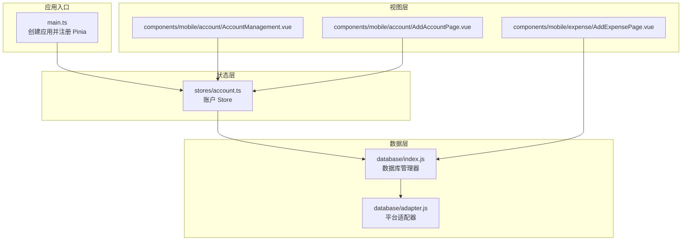
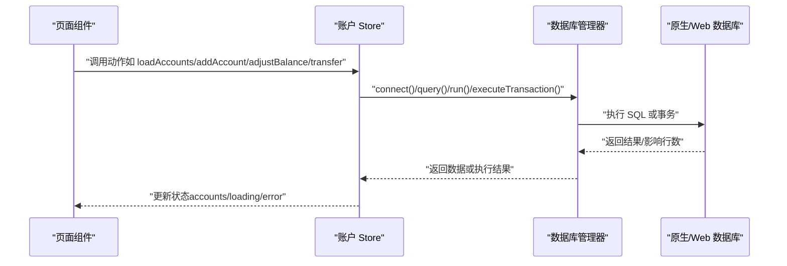
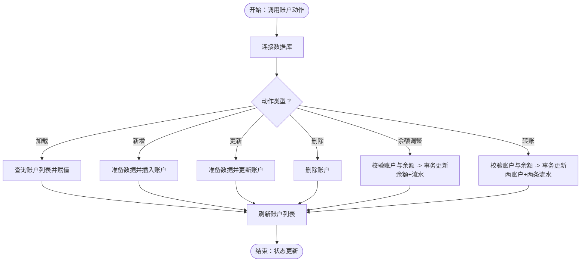
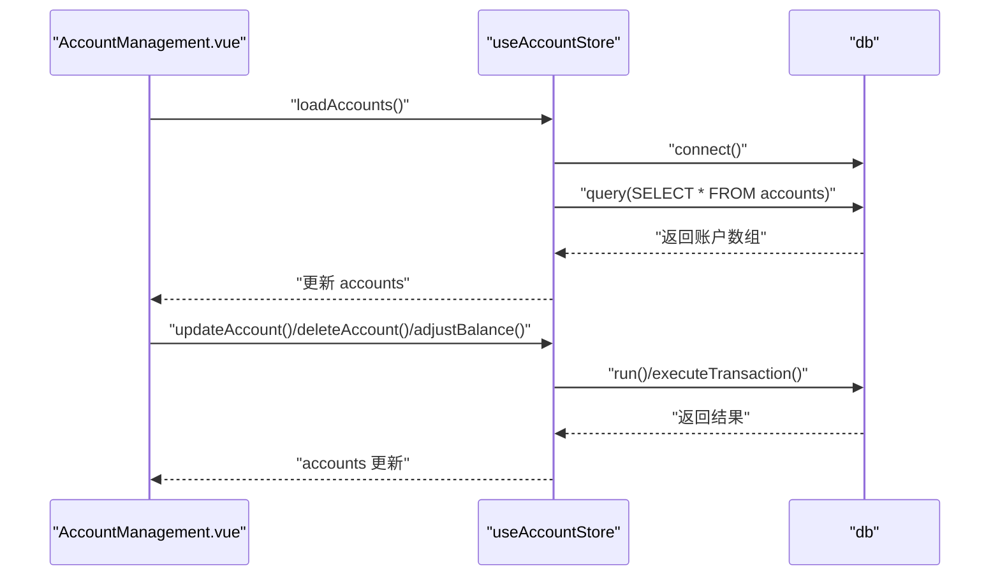
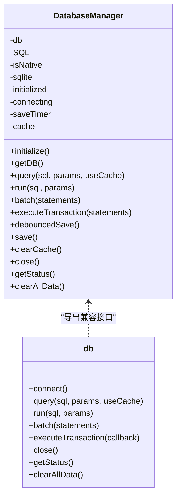
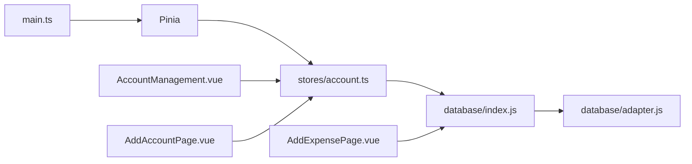

# 状态管理

<cite>
**本文引用的文件**
- [src/stores/account.ts](file://src/stores/account.ts)
- [src/main.ts](file://src/main.ts)
- [src/database/index.js](file://src/database/index.js)
- [src/database/adapter.js](file://src/database/adapter.js)
- [src/components/mobile/account/AccountManagement.vue](file://src/components/mobile/account/AccountManagement.vue)
- [src/components/mobile/account/AddAccountPage.vue](file://src/components/mobile/account/AddAccountPage.vue)
- [src/components/mobile/expense/AddExpensePage.vue](file://src/components/mobile/expense/AddExpensePage.vue)
- [package.json](file://package.json)
</cite>

## 目录
1. [简介](#简介)
2. [项目结构](#项目结构)
3. [核心组件](#核心组件)
4. [架构总览](#架构总览)
5. [详细组件分析](#详细组件分析)
6. [依赖关系分析](#依赖关系分析)
7. [性能考量](#性能考量)
8. [故障排查指南](#故障排查指南)
9. [结论](#结论)
10. [附录](#附录)

## 简介
本文件系统性梳理财务应用程序中基于 Pinia 的状态管理实现，重点覆盖账户状态管理的存储、更新与访问模式，解释状态管理的设计原则（如单一数据源、状态不可变性），以及状态与组件通信的关系。同时提供最佳实践建议、持久化策略说明、扩展与维护指导，并通过具体代码路径示例帮助开发者快速定位实现细节。

## 项目结构
本项目采用“按功能域分层”的组织方式：
- 应用入口与全局注册：在应用入口中初始化 Pinia 并挂载到根组件。
- 状态层：以 Pinia Store 为核心，集中管理账户相关的状态与动作。
- 数据层：封装数据库访问，支持原生平台（Capacitor SQLite）与 Web 平台（sql.js + localStorage）。
- 视图层：各业务页面组件通过 Store 完成数据读取与写入，实现跨组件共享。

图表来源
- [src/main.ts:1-16](file://src/main.ts#L1-L16)
- [src/stores/account.ts:1-273](file://src/stores/account.ts#L1-L273)
- [src/database/index.js:1-935](file://src/database/index.js#L1-L935)
- [src/database/adapter.js:1-34](file://src/database/adapter.js#L1-L34)
- [src/components/mobile/account/AccountManagement.vue:330-380](file://src/components/mobile/account/AccountManagement.vue#L330-L380)
- [src/components/mobile/account/AddAccountPage.vue:70-100](file://src/components/mobile/account/AddAccountPage.vue#L70-L100)
- [src/components/mobile/expense/AddExpensePage.vue:451-482](file://src/components/mobile/expense/AddExpensePage.vue#L451-L482)

章节来源
- [src/main.ts:1-16](file://src/main.ts#L1-L16)
- [package.json:19-36](file://package.json#L19-L36)

## 核心组件
- Pinia Store（账户管理）：定义账户状态、加载/增删改查、余额调整、转账等动作，统一管理账户数据与错误状态。
- 数据库管理器：封装连接、查询、执行、事务、批处理、缓存与持久化策略，屏蔽平台差异。
- 页面组件：通过 Store 读取状态并触发动作，实现跨组件共享与联动。

章节来源
- [src/stores/account.ts:27-32](file://src/stores/account.ts#L27-L32)
- [src/database/index.js:21-32](file://src/database/index.js#L21-L32)

## 架构总览
下图展示了从组件到 Store，再到数据库的完整调用链路与数据流向。

图表来源
- [src/components/mobile/account/AccountManagement.vue:334-376](file://src/components/mobile/account/AccountManagement.vue#L334-L376)
- [src/components/mobile/account/AddAccountPage.vue:75-96](file://src/components/mobile/account/AddAccountPage.vue#L75-L96)
- [src/stores/account.ts:38-270](file://src/stores/account.ts#L38-L270)
- [src/database/index.js:56-190](file://src/database/index.js#L56-L190)

## 详细组件分析

### 账户 Store（Pinia）
- 设计要点
  - 单一数据源：账户列表 accounts 作为唯一真相来源。
  - 状态不可变性：通过赋值替换数组元素，避免直接修改数组索引；actions 内部使用局部变量进行计算。
  - 异步动作：所有数据库交互均在异步 action 中完成，保证状态更新的原子性。
  - 错误处理：集中设置 error 字段，便于 UI 层统一提示。
- 关键动作
  - 加载账户：connect -> query -> 赋值 accounts。
  - 新增账户：connect -> 生成 ID -> INSERT -> loadAccounts。
  - 更新账户：connect -> UPDATE -> loadAccounts。
  - 删除账户：connect -> DELETE -> loadAccounts。
  - 余额调整：校验账户存在与余额充足 -> 事务更新账户余额 + 记录流水 -> loadAccounts。
  - 内部转账：校验账户相同、余额充足 -> 事务更新两账户余额 + 双条流水 -> loadAccounts。
- 最佳实践
  - 在动作中先校验前置条件，再进入数据库操作。
  - 使用事务保证多步写入的一致性。
  - 动作完成后统一刷新 accounts，确保 UI 与数据一致。

图表来源
- [src/stores/account.ts:38-270](file://src/stores/account.ts#L38-L270)

章节来源
- [src/stores/account.ts:27-32](file://src/stores/account.ts#L27-L32)
- [src/stores/account.ts:38-270](file://src/stores/account.ts#L38-L270)

### 页面组件与 Store 的交互
- 账户管理页
  - 生命周期钩子中触发 loadAccounts，确保进入页面即加载最新数据。
  - 通过对话框触发 updateAccount/deleteAccount/adjustBalance 等动作。
- 新增账户页
  - 表单验证后调用 addAccount，捕获异常并提示错误信息。
- 支出新增页
  - 使用 executeTransaction 执行多条 SQL，保证事务安全后刷新账户列表。

图表来源
- [src/components/mobile/account/AccountManagement.vue:334-376](file://src/components/mobile/account/AccountManagement.vue#L334-L376)
- [src/stores/account.ts:106-139](file://src/stores/account.ts#L106-L139)
- [src/stores/account.ts:145-185](file://src/stores/account.ts#L145-L185)

章节来源
- [src/components/mobile/account/AccountManagement.vue:334-376](file://src/components/mobile/account/AccountManagement.vue#L334-L376)
- [src/components/mobile/account/AddAccountPage.vue:75-96](file://src/components/mobile/account/AddAccountPage.vue#L75-L96)
- [src/components/mobile/expense/AddExpensePage.vue:451-482](file://src/components/mobile/expense/AddExpensePage.vue#L451-L482)

### 数据库管理器（平台无关）
- 单例连接：避免重复连接，减少资源消耗。
- 平台适配：原生平台使用 Capacitor SQLite，Web 平台使用 sql.js，并通过 localStorage 延迟持久化。
- 事务与批处理：提供 executeTransaction 与 batch，提升批量写入性能与一致性。
- 缓存与节流：查询结果缓存与 Web 端持久化节流，优化性能。
- 关闭与清理：提供 close 与 clearCache，确保资源释放与状态一致。

图表来源
- [src/database/index.js:21-32](file://src/database/index.js#L21-L32)
- [src/database/index.js:420-776](file://src/database/index.js#L420-L776)
- [src/database/index.js:897-935](file://src/database/index.js#L897-L935)

章节来源
- [src/database/index.js:21-32](file://src/database/index.js#L21-L32)
- [src/database/index.js:56-190](file://src/database/index.js#L56-L190)
- [src/database/index.js:354-374](file://src/database/index.js#L354-L374)
- [src/database/index.js:897-935](file://src/database/index.js#L897-L935)

## 依赖关系分析
- 应用入口依赖 Pinia：在 main.ts 中创建应用并注册 Pinia。
- Store 依赖数据库模块：通过 db 对象封装数据库操作。
- 组件依赖 Store：页面组件通过组合式 API 使用 Store。
- 数据库适配器：根据平台动态选择数据库实现。

图表来源
- [src/main.ts:13-16](file://src/main.ts#L13-L16)
- [src/stores/account.ts:5-6](file://src/stores/account.ts#L5-L6)
- [src/database/adapter.js:14-33](file://src/database/adapter.js#L14-L33)

章节来源
- [src/main.ts:13-16](file://src/main.ts#L13-L16)
- [src/stores/account.ts:5-6](file://src/stores/account.ts#L5-L6)
- [src/database/adapter.js:14-33](file://src/database/adapter.js#L14-L33)

## 性能考量
- 单例连接与缓存：数据库管理器使用单例连接与查询缓存，降低重复连接与查询开销。
- 批处理与事务：对多步写入使用 executeTransaction 或 batch，减少多次往返与提升一致性。
- Web 端持久化节流：通过延迟保存与节流时间控制，避免频繁写入 localStorage。
- 索引优化：初始化阶段创建常用索引，加速查询。
- 资源释放：关闭连接与清理缓存，防止内存泄漏。

章节来源
- [src/database/index.js:12-18](file://src/database/index.js#L12-L18)
- [src/database/index.js:354-374](file://src/database/index.js#L354-L374)
- [src/database/index.js:379-408](file://src/database/index.js#L379-L408)
- [src/database/index.js:417-416](file://src/database/index.js#L417-L416)

## 故障排查指南
- 加载失败
  - 现象：页面显示“加载账户失败”。
  - 排查：检查数据库连接与查询语句；确认 initialize 是否成功；查看错误日志。
- 新增失败
  - 现象：弹窗提示“添加账户失败”。
  - 排查：确认表单必填项；检查数据库 INSERT 语句；查看 Store 的错误信息。
- 余额调整失败
  - 现象：余额调整报错。
  - 排查：确认账户存在与余额充足；检查事务执行与回滚逻辑。
- 转账失败
  - 现象：转账报错或部分步骤未生效。
  - 排查：确认账户相同性、余额充足；检查事务提交与回滚；核对两条流水记录。

章节来源
- [src/stores/account.ts:47-49](file://src/stores/account.ts#L47-L49)
- [src/stores/account.ts:95-99](file://src/stores/account.ts#L95-L99)
- [src/stores/account.ts:181-184](file://src/stores/account.ts#L181-L184)
- [src/stores/account.ts:266-269](file://src/stores/account.ts#L266-L269)

## 结论
本项目通过 Pinia 实现了清晰的状态管理：账户状态集中在 Store 中，动作封装数据库操作并保证一致性；数据库管理器屏蔽平台差异并提供高性能特性。页面组件通过 Store 实现数据共享与联动，遵循单一数据源与状态不可变性原则。建议在后续扩展中继续强化事务边界、完善错误提示与日志追踪，并考虑引入状态快照与回放能力以增强可观测性。

## 附录

### 状态管理设计原则
- 单一数据源：账户列表 accounts 作为唯一真相来源。
- 状态不可变性：通过赋值替换数组元素，避免直接修改数组索引。
- 动作封装：所有异步数据库操作封装在 actions 中，保证状态更新原子性。
- 错误集中处理：统一设置 error 字段，便于 UI 层统一提示。

章节来源
- [src/stores/account.ts:27-32](file://src/stores/account.ts#L27-L32)
- [src/stores/account.ts:38-53](file://src/stores/account.ts#L38-L53)

### 组件间数据共享
- 通过 Pinia Store 共享状态：AccountManagement.vue 与 AddAccountPage.vue 共用 useAccountStore。
- 跨页面联动：AddExpensePage.vue 在事务中写入流水后，调用 accountStore.loadAccounts 刷新账户余额。

章节来源
- [src/components/mobile/account/AccountManagement.vue:334-376](file://src/components/mobile/account/AccountManagement.vue#L334-L376)
- [src/components/mobile/account/AddAccountPage.vue:75-96](file://src/components/mobile/account/AddAccountPage.vue#L75-L96)
- [src/components/mobile/expense/AddExpensePage.vue:451-482](file://src/components/mobile/expense/AddExpensePage.vue#L451-L482)

### 异步操作处理最佳实践
- 在动作中先校验前置条件，再进入数据库操作。
- 使用事务保证多步写入的一致性。
- 动作完成后统一刷新 accounts，确保 UI 与数据一致。
- 对于复杂写入流程，优先使用 executeTransaction 或 batch。

章节来源
- [src/stores/account.ts:106-139](file://src/stores/account.ts#L106-L139)
- [src/stores/account.ts:145-185](file://src/stores/account.ts#L145-L185)
- [src/stores/account.ts:191-270](file://src/stores/account.ts#L191-L270)

### 状态持久化策略
- 原生平台：使用 Capacitor SQLite，数据持久化在设备本地数据库。
- Web 平台：使用 sql.js，并通过 localStorage 延迟持久化，配合节流时间控制保存频率。
- 关闭时保存：在关闭数据库连接前，Web 端会将数据库导出并保存到 localStorage。

章节来源
- [src/database/index.js:81-820](file://src/database/index.js#L81-L820)
- [src/database/index.js:379-408](file://src/database/index.js#L379-L408)
- [src/database/index.js:897-935](file://src/database/index.js#L897-L935)

### 扩展与维护指导
- 新增 Store：遵循现有 Store 的命名与结构，保持 actions 的异步与事务化。
- 新增页面：通过组合式 API 获取 Store 实例，按需触发动作并监听状态变化。
- 数据库迁移：在 initialize 中增加 ALTER 语句，确保向后兼容。
- 日志与监控：在关键动作中输出日志，便于问题定位与性能分析。

章节来源
- [src/stores/account.ts:27-32](file://src/stores/account.ts#L27-L32)
- [src/database/index.js:694-776](file://src/database/index.js#L694-L776)