# 负债管理

<cite>
**本文档引用的文件**
- [liabilityService.ts](file://src/services/liability/liabilityService.ts)
- [liability.ts](file://src/types/liability/liability.ts)
- [LiabilityManagement.vue](file://src/components/mobile/liability/LiabilityManagement.vue)
- [AddLiabilityPage.vue](file://src/components/mobile/liability/AddLiabilityPage.vue)
- [LiabilityDetailPage.vue](file://src/components/mobile/liability/LiabilityDetailPage.vue)
- [LiabilityCard.vue](file://src/components/mobile/liability/LiabilityCard.vue)
- [StatOverview.vue](file://src/components/common/StatOverview.vue)
- [dictionaries.ts](file://src/utils/dictionaries.ts)
- [index.js](file://src/database/index.js)
</cite>

## 更新摘要
**所做更改**
- 新增StatOverview组件集成，提供负债统计概览功能
- 更新负债管理主界面，集成剩余待还、剩余本金和负债笔数统计
- 改进财务报告准确性，通过累加剩余本金和累计利息计算总剩余债务
- 优化负债卡片界面，移除详细的财务分解显示，只保留剩余待还金额的清晰展示
- 简化负债管理页面布局结构，提升用户体验
- **更新** 负债详情页面采用现代化的space-around布局设计，改善信息展示的视觉层次和可读性
- **新增** 负债管理界面新增搜索功能，支持按名称过滤负债，提升用户体验
- **更新** 增强还款条件验证，改进正常还款和提前还款的处理逻辑
- **更新** 优化还款金额验证，防止超过剩余本金的还款操作
- **更新** 负债详情页面标签页样式简化，采用现代化的space-around布局设计

## 目录
1. [简介](#简介)
2. [项目结构](#项目结构)
3. [核心组件](#核心组件)
4. [架构概览](#架构概览)
5. [详细组件分析](#详细组件分析)
6. [服务层实现](#服务层实现)
7. [数据库架构](#数据库架构)
8. [依赖分析](#依赖分析)
9. [性能考虑](#性能考虑)
10. [故障排除指南](#故障排除指南)
11. [结论](#结论)
12. [附录](#附录)

## 简介

负债管理模块是财务应用中的核心功能之一，负责管理用户的各类负债，包括负债的创建、分类、还款计划制定和跟踪。该模块提供了完整的负债生命周期管理，从负债创建到还款完成的全过程跟踪。

**更新** 本次更新集成了StatOverview组件，为负债管理提供了专业的财务统计概览功能。新功能通过累加剩余本金和累计利息来计算总剩余债务，为用户提供更准确的财务状况报告。同时，负债卡片界面进行了重大简化，移除了详细的财务分解显示，只保留剩余待还金额的清晰展示，优化了负债管理页面的布局结构。

**更新** 负债详情页面样式重构，采用现代化的space-around布局，显著改善了信息展示的视觉层次和可读性。新的布局设计通过合理的间距分配和视觉层次组织，使用户能够更清晰地理解负债的各项信息。

**新增** 负债管理界面新增了强大的搜索功能，用户可以通过输入负债名称快速筛选和定位特定的负债记录。搜索功能支持实时过滤，当用户在搜索框中输入关键字时，负债列表会立即更新，仅显示匹配的负债项。搜索功能采用展开式设计，在导航栏右侧提供搜索图标，点击后展开搜索输入框，支持清空操作和失焦自动收起功能。

**更新** 增强了还款条件验证机制，改进了正常还款和提前还款的处理逻辑。系统现在能够更严格地验证还款金额的有效性，防止超过剩余本金的还款操作，确保财务数据的准确性。

**更新** 优化了还款金额验证规则，防止用户输入无效的还款金额。系统现在会在还款前检查输入金额是否超过剩余本金，如果超过则拒绝该操作并给出明确的错误提示。

**更新** 负债详情页面的标签页样式得到了简化，采用了现代化的space-around布局设计。这种设计不仅提升了视觉层次，还增强了用户界面的一致性和专业感。

本模块支持多种负债类型，包括房贷、车贷、信用卡、消费贷等常见负债形式，以及灵活的还款方式设置。通过直观的用户界面，用户可以轻松管理自己的负债状况，监控负债变化，并制定合理的还款计划。

## 项目结构

负债管理模块采用Vue 3 Composition API和Element Plus组件库构建，整体项目结构清晰，模块职责明确：

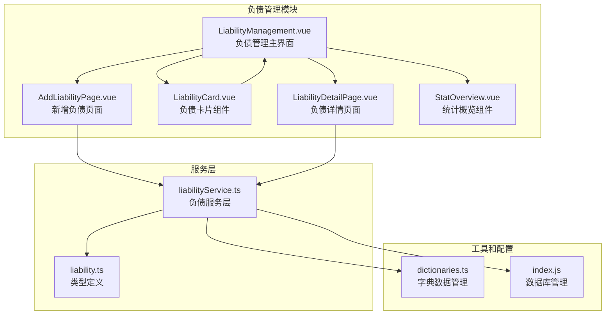

**图表来源**
- [LiabilityManagement.vue:1-318](file://src/components/mobile/liability/LiabilityManagement.vue#L1-L318)
- [AddLiabilityPage.vue:1-290](file://src/components/mobile/liability/AddLiabilityPage.vue#L1-L290)
- [LiabilityCard.vue:1-199](file://src/components/mobile/liability/LiabilityCard.vue#L1-L199)
- [LiabilityDetailPage.vue:1-607](file://src/components/mobile/liability/LiabilityDetailPage.vue#L1-L607)
- [StatOverview.vue:1-119](file://src/components/common/StatOverview.vue#L1-L119)
- [liabilityService.ts:1-519](file://src/services/liability/liabilityService.ts#L1-L519)
- [dictionaries.ts:1-115](file://src/utils/dictionaries.ts#L1-L115)
- [index.js:629-799](file://src/database/index.js#L629-L799)

**章节来源**
- [LiabilityManagement.vue:1-318](file://src/components/mobile/liability/LiabilityManagement.vue#L1-L318)
- [AddLiabilityPage.vue:1-290](file://src/components/mobile/liability/AddLiabilityPage.vue#L1-L290)
- [LiabilityCard.vue:1-199](file://src/components/mobile/liability/LiabilityCard.vue#L1-L199)
- [LiabilityDetailPage.vue:1-607](file://src/components/mobile/liability/LiabilityDetailPage.vue#L1-L607)
- [StatOverview.vue:1-119](file://src/components/common/StatOverview.vue#L1-L119)
- [liabilityService.ts:1-519](file://src/services/liability/liabilityService.ts#L1-L519)
- [dictionaries.ts:1-115](file://src/utils/dictionaries.ts#L1-L115)
- [index.js:629-799](file://src/database/index.js#L629-L799)

## 核心组件

负债管理模块的核心由以下关键组件构成：

### 主要组件职责

1. **LiabilityManagement.vue**: 负债管理主界面，提供负债的增删改查功能、统计概览和**新增**搜索功能
2. **AddLiabilityPage.vue**: 新增负债页面，支持完整的负债信息录入
3. **LiabilityCard.vue**: 负债卡片组件，用于展示负债摘要信息（**更新**：界面已简化）
4. **LiabilityDetailPage.vue**: 负债详情页面，提供详细的负债信息和还款记录
5. **StatOverview.vue**: 统计概览组件，提供财务数据的视觉化展示

### 数据模型

负债实体包含以下关键属性：
- 基本信息：名称、类型、本金、剩余本金
- 利息信息：是否计息、年化利率、剩余总利息
- 还款信息：还款方式、还款日、期数
- 状态管理：状态、备注、绑定账户
- 时间戳：创建和更新时间

**章节来源**
- [liability.ts:6-25](file://src/types/liability/liability.ts#L6-L25)
- [LiabilityManagement.vue:101-118](file://src/components/mobile/liability/LiabilityManagement.vue#L101-L118)
- [AddLiabilityPage.vue:83-95](file://src/components/mobile/liability/AddLiabilityPage.vue#L83-L95)

## 架构概览

负债管理模块采用分层架构设计，确保了良好的可维护性和扩展性：

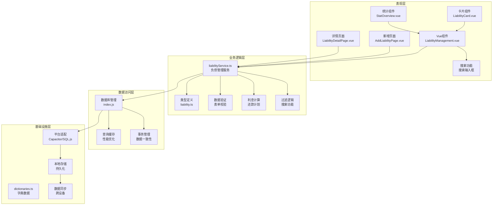

**图表来源**
- [liabilityService.ts:14-519](file://src/services/liability/liabilityService.ts#L14-L519)
- [index.js:21-190](file://src/database/index.js#L21-L190)
- [dictionaries.ts:55-90](file://src/utils/dictionaries.ts#L55-L90)

## 详细组件分析

### 负债管理主组件

LiabilityManagement.vue是整个负债管理模块的核心，提供了完整的负债管理功能：

#### 组件功能特性

1. **负债列表展示**: 使用网格布局展示所有负债信息
2. **负债创建**: 支持新增负债，包含完整的负债信息输入
3. **负债切换**: 支持当前负债和历史负债的切换查看
4. ****新增** 搜索功能**: 支持按名称搜索和过滤负债
5. **浮动操作菜单**: 提供新增负债的快捷入口
6. **统计概览**: 集成StatOverview组件，展示负债本金、剩余待还、负债笔数统计

#### 用户界面设计

组件采用卡片式布局，提供清晰的功能分区：

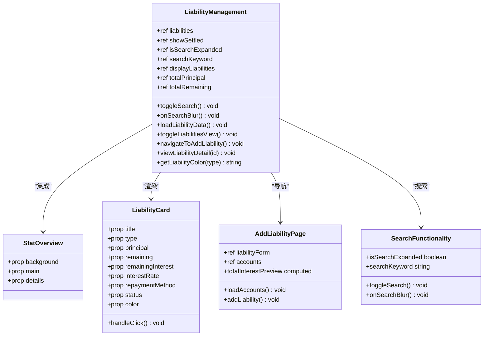

**图表来源**
- [LiabilityManagement.vue:62-178](file://src/components/mobile/liability/LiabilityManagement.vue#L62-L178)
- [StatOverview.vue:29-33](file://src/components/common/StatOverview.vue#L29-L33)
- [LiabilityCard.vue:43-84](file://src/components/mobile/liability/LiabilityCard.vue#L43-L84)
- [AddLiabilityPage.vue:71-172](file://src/components/mobile/liability/AddLiabilityPage.vue#L71-L172)

#### 搜索功能实现

**新增** 负债管理界面集成了强大的搜索功能：

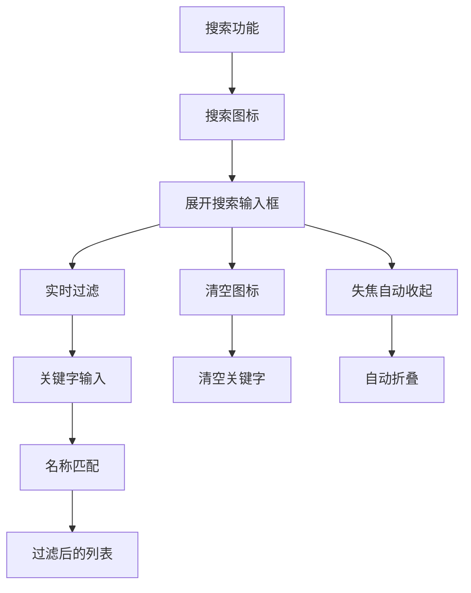

**图表来源**
- [LiabilityManagement.vue:79-102](file://src/components/mobile/liability/LiabilityManagement.vue#L79-L102)

#### 负债统计功能

**更新** 新增的StatOverview组件提供了专业的财务统计功能：

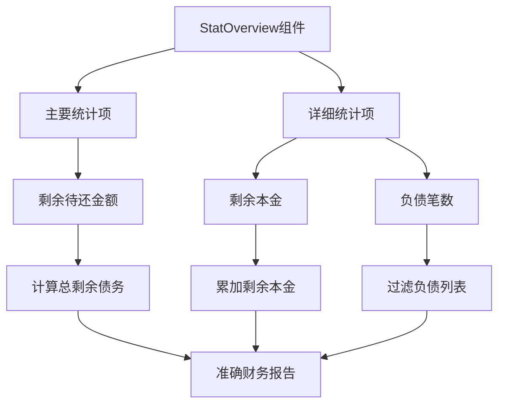

**图表来源**
- [LiabilityManagement.vue:3-8](file://src/components/mobile/liability/LiabilityManagement.vue#L3-L8)
- [LiabilityManagement.vue:70-76](file://src/components/mobile/liability/LiabilityManagement.vue#L70-L76)

#### 负债类型分类

系统支持12种主要负债类型，每种类型都有其特定的管理特点：

| 负债类型 | 特点描述 | 管理方式 |
|---------|----------|----------|
| 房贷 | 长期负债，金额较大，利率相对较低 | 等额本息/等额本金，长期规划 |
| 车贷 | 固定资产相关，期限中等 | 等额本息，按时还款 |
| 信用卡 | 循环信用，可分期还款 | 最低还款额，分期付款 |
| 消费贷 | 个人消费用途，短期负债 | 等额本息，快速还清 |
| 装修贷 | 专项用途，一次性支出 | 等额本息，按期还款 |
| 助学贷款 | 教育用途，可能有宽限期 | 宽限期后正常还款 |
| 网贷 | 线上借贷，利率较高风险 | 优先还清，控制规模 |
| 电商分期 | 购物分期，期限较短 | 按期还款，避免逾期 |
| 租金分期 | 租赁相关，定期支付 | 按月还款，稳定现金流 |
| 亲友借款 | 人际关系借贷，灵活性高 | 协商还款，建立协议 |
| 经营贷 | 商业用途，与收入相关 | 收入稳定时优先还款 |
| 其他负债 | 无法归类的特殊负债 | 根据具体情况管理 |

**章节来源**
- [dictionaries.ts:57-71](file://src/utils/dictionaries.ts#L57-L71)
- [LiabilityManagement.vue:101-118](file://src/components/mobile/liability/LiabilityManagement.vue#L101-L118)

### 负债详情页面样式重构

**更新** 负债详情页面经过现代化的space-around布局重构，显著改善了信息展示的视觉层次和可读性：

#### 现代化的space-around布局设计

LiabilityDetailPage.vue采用了全新的布局策略，通过合理的间距分配和视觉层次组织：

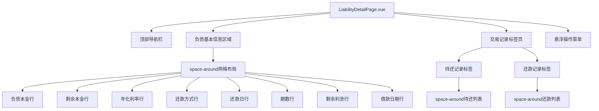

**图表来源**
- [LiabilityDetailPage.vue:452-457](file://src/components/mobile/liability/LiabilityDetailPage.vue#L452-L457)
- [LiabilityDetailPage.vue:515-523](file://src/components/mobile/liability/LiabilityDetailPage.vue#L515-L523)

#### 布局改进要点

1. **space-around网格布局**: 负债基本信息区域采用`justify-content: space-around`实现均匀分布
2. **视觉层次优化**: 通过合理的间距和字体大小突出重要信息
3. **响应式设计**: 适配不同屏幕尺寸，确保在移动设备上的最佳体验
4. **信息密度控制**: 避免信息过载，保持界面整洁
5. **交互一致性**: 统一的布局模式提升用户体验

#### 关键布局元素

- **基本信息网格**: 使用space-around布局展示负债各项信息
- **标签页设计**: 采用Element Plus的卡片式标签页
- **待还记录**: 每个待还条目使用space-between布局
- **还款记录**: 每个还款条目使用space-between布局
- **操作按钮**: 悬浮菜单提供便捷的操作入口

**更新** 负债详情页面的标签页样式得到了简化，采用了现代化的space-around布局设计：

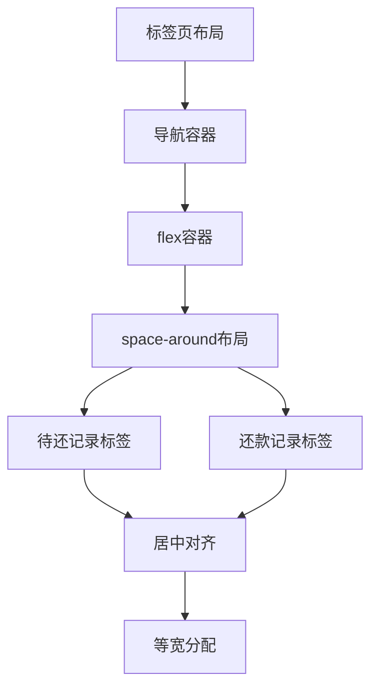

**图表来源**
- [LiabilityDetailPage.vue:508-521](file://src/components/mobile/liability/LiabilityDetailPage.vue#L508-L521)

#### 标签页样式简化实现

标签页的现代化布局通过以下CSS实现：

```css
.transaction-tabs {
  margin-bottom: 15px;
}

.transaction-tabs :deep(.el-tabs__nav) {
  width: 100%;
  display: flex;
}

.transaction-tabs :deep(.el-tabs__item) {
  flex: 1;
  text-align: center;
}
```

这种设计实现了：
1. **等宽分配**: 每个标签页占据相等的空间
2. **居中对齐**: 标签文本在容器中居中显示
3. **响应式布局**: 自适应不同屏幕尺寸
4. **简洁设计**: 移除了复杂的边框和阴影效果

**章节来源**
- [LiabilityDetailPage.vue:452-457](file://src/components/mobile/liability/LiabilityDetailPage.vue#L452-L457)
- [LiabilityDetailPage.vue:515-523](file://src/components/mobile/liability/LiabilityDetailPage.vue#L515-L523)
- [LiabilityDetailPage.vue:544-549](file://src/components/mobile/liability/LiabilityDetailPage.vue#L544-L549)
- [LiabilityDetailPage.vue:587-589](file://src/components/mobile/liability/LiabilityDetailPage.vue#L587-L589)
- [LiabilityDetailPage.vue:508-521](file://src/components/mobile/liability/LiabilityDetailPage.vue#L508-L521)

### 负债卡片界面简化

**更新** 负债卡片界面经过重大简化，移除了详细的财务分解显示，只保留剩余待还金额的清晰展示：

#### 简化后的卡片设计

LiabilityCard.vue现在采用极简设计风格：

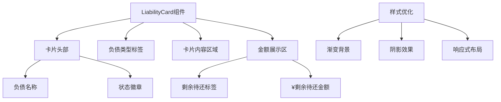

**图表来源**
- [LiabilityCard.vue:1-199](file://src/components/mobile/liability/LiabilityCard.vue#L1-L199)

#### 设计改进要点

1. **极简主义设计**: 移除了复杂的财务分解信息，只保留核心的剩余待还金额
2. **视觉层次优化**: 通过字体大小和颜色对比突出剩余待还金额
3. **状态可视化**: 使用颜色编码区分已结清和未结清状态
4. **响应式布局**: 适配不同屏幕尺寸，确保在移动设备上的最佳体验
5. **交互优化**: 保持原有的点击交互，不影响用户体验

#### 界面元素说明

- **卡片头部**: 显示负债名称和状态徽章
- **类型标签**: 清晰标识负债类型
- **金额区域**: 居中展示剩余待还金额，使用大号字体突出显示
- **状态徽章**: 绿色表示已结清，半透明背景表示未结清

**章节来源**
- [LiabilityCard.vue:1-199](file://src/components/mobile/liability/LiabilityCard.vue#L1-L199)

### 搜索功能详细分析

**新增** 负债管理界面的搜索功能实现了完整的名称过滤功能：

#### 搜索功能实现细节

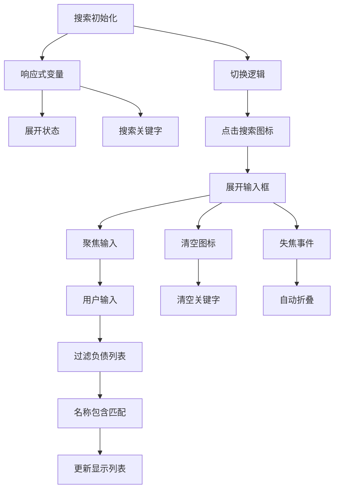

**图表来源**
- [LiabilityManagement.vue:79-102](file://src/components/mobile/liability/LiabilityManagement.vue#L79-L102)

#### 搜索功能特性

1. **展开式设计**: 搜索图标点击后展开输入框，提供更好的用户体验
2. **实时过滤**: 输入关键字时立即过滤负债列表，无需手动确认
3. **智能收起**: 失焦时自动收起搜索框，保持界面整洁
4. **清空功能**: 支持一键清空搜索关键字
5. **模糊匹配**: 使用`includes()`方法进行名称包含匹配
6. **状态保持**: 搜索状态独立于当前/历史负债视图

#### 搜索逻辑实现

搜索功能通过计算属性`displayLiabilities`实现：

```typescript
const displayLiabilities = computed(() => {
  let list = liabilities.value.filter(liability => {
    const isSettled = liability.status === '已结清';
    return showSettled.value ? isSettled : !isSettled;
  });
  if (searchKeyword.value.trim()) {
    list = list.filter(liability => liability.name.includes(searchKeyword.value.trim()));
  }
  return list;
});
```

**章节来源**
- [LiabilityManagement.vue:79-102](file://src/components/mobile/liability/LiabilityManagement.vue#L79-L102)

### 还款计划制定逻辑

系统支持三种主要的还款方式，每种方式都有不同的计算逻辑：

#### 等额本息还款

等额本息是最常见的还款方式，特点是每月还款额固定，适合大多数消费者：

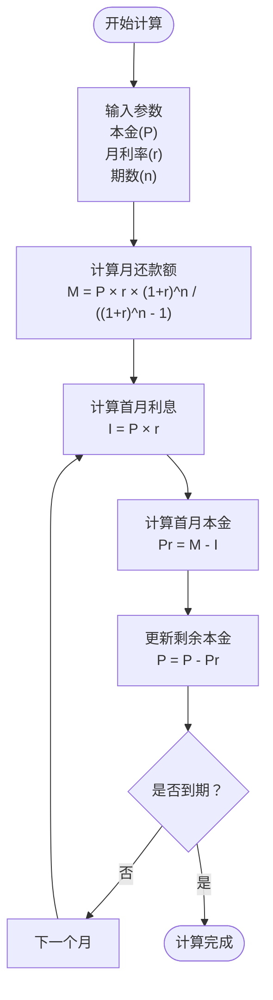

**图表来源**
- [liabilityService.ts:24-37](file://src/services/liability/liabilityService.ts#L24-L37)

#### 等额本金还款

等额本金的特点是每月本金固定，利息逐月递减：

| 月份 | 月还款额 | 本金部分 | 利息部分 | 剩余本金 |
|------|----------|----------|----------|----------|
| 1 | P/n + (P - 0)×r | P/n | P×r | P - P/n |
| 2 | P/n + (P - P/n)×r | P/n | (P - P/n)×r | P - 2P/n |
| n | P/n + (P - (n-1)P/n)×r | P/n | (P - (n-1)P/n)×r | 0 |

#### 随借随还

随借随还适用于信用卡和循环信用：

- **最低还款额**: 通常为账单金额的10%-30%
- **全额还款**: 在免息期内全额还款
- **分期付款**: 将大额消费分期，支付手续费

**章节来源**
- [dictionaries.ts:73-78](file://src/utils/dictionaries.ts#L73-L78)
- [liabilityService.ts:53-94](file://src/services/liability/liabilityService.ts#L53-L94)

### 利息计算算法

系统支持两种利息计算模式：

#### 简易计息模式
- **适用场景**: 亲友借款、小额负债
- **计算方式**: 简单利息计算，不考虑复利
- **公式**: 利息 = 本金 × 年利率 × 时间

#### 复利计息模式
- **适用场景**: 正规金融机构贷款
- **计算方式**: 按月复利计算
- **公式**: 期末本息 = 本金 × (1 + 月利率)^期数

### 增强的还款条件验证

**更新** 系统现在具备更严格的还款条件验证机制：

#### 正常还款验证

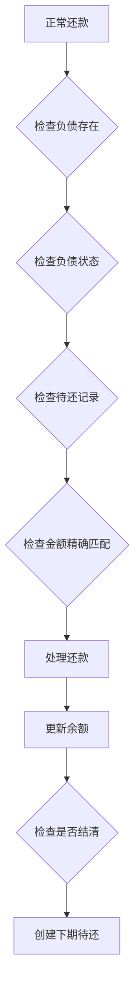

**图表来源**
- [liabilityService.ts:326-410](file://src/services/liability/liabilityService.ts#L326-L410)

#### 提前还款验证

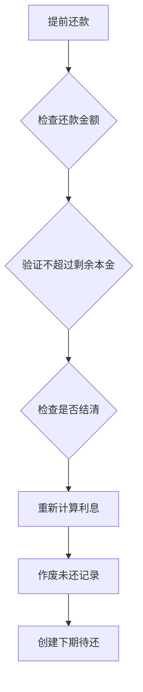

**图表来源**
- [liabilityService.ts:410-478](file://src/services/liability/liabilityService.ts#L410-L478)

#### 前端还款验证

**更新** 前端也增加了更严格的验证逻辑：

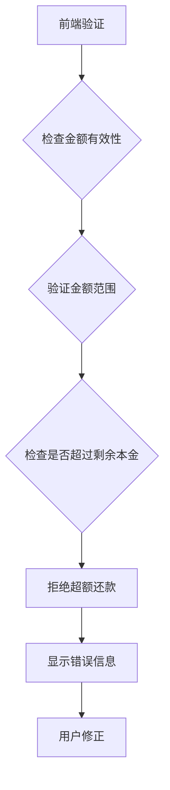

**图表来源**
- [LiabilityDetailPage.vue:261-285](file://src/components/mobile/liability/LiabilityDetailPage.vue#L261-L285)

## 服务层实现

liabilityService.ts是负债管理的核心服务层，提供了完整的负债管理功能：

### 核心功能

1. **负债计算**: 计算总利息和生成待还记录
2. **负债操作**: 新增、更新、删除负债
3. **还款处理**: 正常还款和提前还款，包含严格验证
4. **数据查询**: 获取负债列表、还款记录等

### 服务方法

#### 利息计算函数

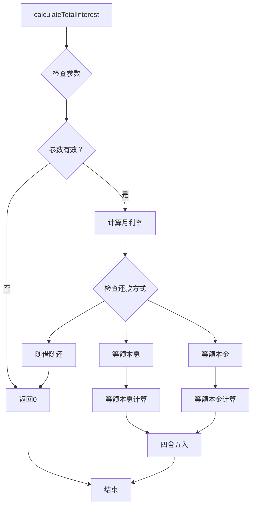

**图表来源**
- [liabilityService.ts:14-37](file://src/services/liability/liabilityService.ts#L14-L37)

#### 负债添加流程

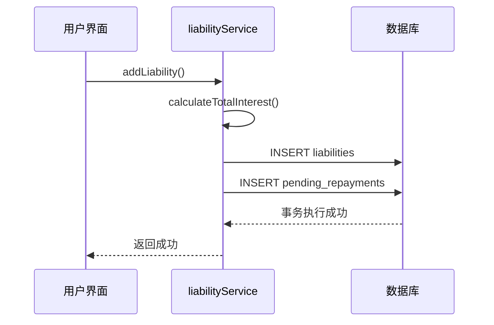

**图表来源**
- [liabilityService.ts:100-166](file://src/services/liability/liabilityService.ts#L100-L166)

#### 增强的还款处理流程

**更新** 现在包含更严格的条件验证：

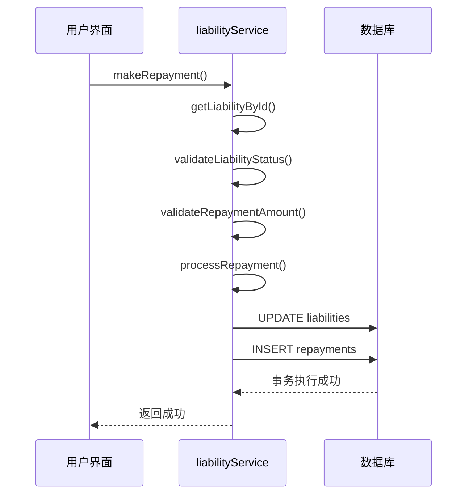

**图表来源**
- [liabilityService.ts:326-508](file://src/services/liability/liabilityService.ts#L326-L508)

**章节来源**
- [liabilityService.ts:14-519](file://src/services/liability/liabilityService.ts#L14-L519)

## 数据库架构

负债管理模块的数据库架构设计完善，支持完整的负债生命周期管理：

### 数据表结构

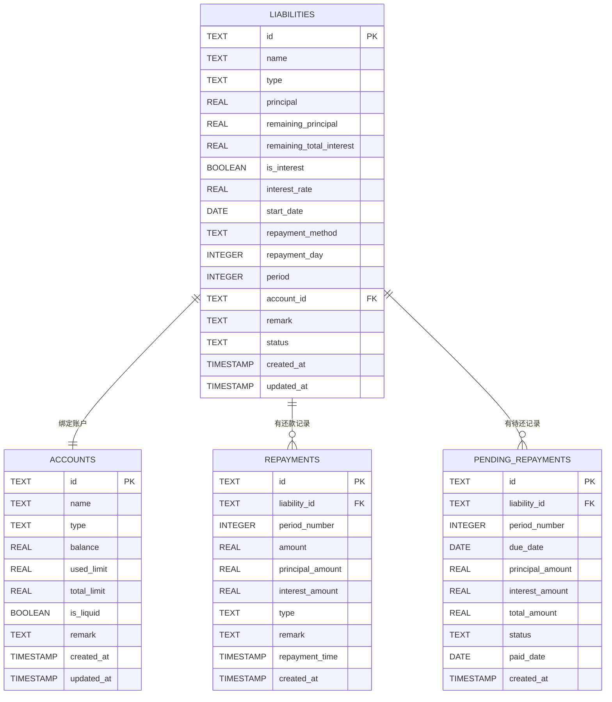

**图表来源**
- [index.js:629-687](file://src/database/index.js#L629-L687)

### 索引优化

为了提高查询性能，系统建立了多个索引：

- `idx_liabilities_account_id`: 按账户ID查询负债
- `idx_liabilities_status`: 按状态查询负债
- `idx_repayments_liability_id`: 按负债ID查询还款记录
- `idx_pending_repayments_liability_id`: 按负债ID查询待还记录
- `idx_pending_repayments_due_date`: 按到期日查询待还记录

**章节来源**
- [index.js:736-753](file://src/database/index.js#L736-L753)

## 依赖分析

负债管理模块的依赖关系清晰，各组件职责明确：

```mermaid
graph TB
subgraph "外部依赖"
VUE[Vue 3]
ELEMENT[Element Plus]
DAYJS[dayjs]
SQLJS[sql.js]
CAPACITOR[Capacitor]
END
subgraph "内部模块"
LM[LiabilityManagement.vue]
ALP[AddLiabilityPage.vue]
LCD[LiabilityCard.vue]
LDP[LiabilityDetailPage.vue]
SO[StatOverview.vue]
LService[liabilityService.ts]
LType[liability.ts]
DICT[dictionaries.ts]
DB[index.js]
end
LM --> VUE
LM --> ELEMENT
LM --> DAYJS
LM --> SO
ALP --> VUE
ALP --> ELEMENT
ALP --> DICT
LDP --> VUE
LDP --> ELEMENT
LDP --> DAYJS
LCD --> VUE
SO --> VUE
LService --> DAYJS
LService --> DB
LService --> LType
LService --> DICT
DB --> SQLJS
DB --> CAPACITOR
```

**图表来源**
- [LiabilityManagement.vue:62](file://src/components/mobile/liability/LiabilityManagement.vue#L62)
- [AddLiabilityPage.vue:71](file://src/components/mobile/liability/AddLiabilityPage.vue#L71)
- [LiabilityDetailPage.vue:178](file://src/components/mobile/liability/LiabilityDetailPage.vue#L178)
- [StatOverview.vue:27](file://src/components/common/StatOverview.vue#L27)
- [liabilityService.ts:6-9](file://src/services/liability/liabilityService.ts#L6-L9)

### 组件耦合度分析

- **低耦合**: 各组件间通过props和事件通信，减少直接依赖
- **高内聚**: 每个组件专注于单一职责，功能模块化
- **可测试性**: 组件接口清晰，便于单元测试和集成测试

**章节来源**
- [LiabilityManagement.vue:62-178](file://src/components/mobile/liability/LiabilityManagement.vue#L62-L178)
- [AddLiabilityPage.vue:71-172](file://src/components/mobile/liability/AddLiabilityPage.vue#L71-L172)
- [LiabilityDetailPage.vue:178-346](file://src/components/mobile/liability/LiabilityDetailPage.vue#L178-L346)
- [StatOverview.vue:29-33](file://src/components/common/StatOverview.vue#L29-L33)

## 性能考虑

系统在设计时充分考虑了性能优化：

### 数据库性能优化

1. **连接池管理**: 使用单例模式管理数据库连接
2. **查询缓存**: 实现Map缓存机制，减少重复查询
3. **批量操作**: 支持批量SQL执行，提高数据处理效率
4. **索引优化**: 为常用查询字段建立索引

### 前端性能优化

1. **懒加载**: 组件按需加载，减少初始包大小
2. **虚拟滚动**: 大数据量表格使用虚拟滚动技术
3. **防抖节流**: 输入框和搜索功能使用防抖优化
4. **响应式设计**: 适配不同屏幕尺寸，提升用户体验

### 移动端优化

1. **原生平台支持**: 使用Capacitor SQLite插件
2. **Web兼容性**: 支持sql.js在Web环境中运行
3. **离线支持**: 本地数据存储，支持离线使用
4. **性能监控**: 实现数据库状态监控和性能统计

### 搜索功能性能优化

**新增** 搜索功能采用了多项性能优化措施：

1. **实时过滤**: 使用Vue的响应式系统实现实时搜索
2. **字符串匹配**: 使用高效的`includes()`方法进行名称匹配
3. **计算属性缓存**: 通过计算属性缓存过滤结果
4. **展开式设计**: 减少不必要的DOM元素渲染
5. **自动收起**: 避免长时间占用界面空间

### 增强的验证性能优化

**更新** 还款验证功能也进行了性能优化：

1. **前端预验证**: 在提交前进行基本的金额范围检查
2. **后端二次验证**: 确保数据安全和一致性
3. **错误处理优化**: 提供清晰的错误信息，避免重复请求
4. **事务原子性**: 确保还款操作的完整性和一致性

### 样式布局性能优化

**更新** 负债详情页面的space-around布局设计也考虑了性能：

1. **CSS优化**: 使用高效的flexbox布局，减少重排重绘
2. **响应式媒体查询**: 优化不同屏幕尺寸下的渲染性能
3. **样式缓存**: Element Plus组件样式预编译缓存
4. **布局稳定性**: space-around布局在不同内容长度下保持稳定性能

## 故障排除指南

### 常见问题及解决方案

#### 数据库连接问题

**问题症状**: 页面加载时出现数据库连接错误
**解决步骤**:
1. 检查数据库初始化状态
2. 验证平台适配器配置
3. 确认SQLite插件安装情况
4. 查看控制台错误日志

#### 负债数据异常

**问题症状**: 负债列表显示异常或数据丢失
**解决步骤**:
1. 检查数据完整性约束
2. 验证外键关联关系
3. 确认事务执行状态
4. 查看数据迁移历史

#### 还款计算错误

**问题症状**: 还款金额计算不准确
**解决步骤**:
1. 验证输入参数格式
2. 检查利率转换计算
3. 确认还款方式匹配
4. 对比标准计算公式

#### 统计数据显示异常

**问题症状**: StatOverview组件显示的统计数据不正确
**解决步骤**:
1. 检查totalPrincipal计算逻辑
2. 验证totalRemaining累加计算
3. 确认displayLiabilities过滤条件
4. 查看组件props传递的数据

#### 负债卡片显示问题

**问题症状**: 负债卡片界面显示异常或布局错乱
**解决步骤**:
1. 检查LiabilityCard组件的CSS样式
2. 验证响应式布局断点设置
3. 确认数据绑定和计算属性
4. 查看移动端适配效果

#### 负债详情页面布局问题

**问题症状**: 负债详情页面布局异常或信息显示不正确
**解决步骤**:
1. 检查space-around布局的CSS属性
2. 验证flexbox布局的兼容性
3. 确认响应式断点设置
4. 查看不同屏幕尺寸下的显示效果

**更新** 负债详情页面样式重构相关问题及解决方案：

**问题症状**: 负债详情页面space-around布局显示异常
**解决步骤**:
1. 检查`.liability-meta`容器的`justify-content: space-around`属性
2. 验证子元素的数量和宽度，确保能均匀分布
3. 确认容器的最小宽度设置，避免内容溢出
4. 查看CSS媒体查询对不同屏幕尺寸的适配

**问题症状**: 标签页样式简化后显示不正确
**解决步骤**:
1. 检查`.transaction-tabs`的flex布局设置
2. 验证`:deep(.el-tabs__nav)`和`:deep(.el-tabs__item)`的样式
3. 确认标签页内容的居中对齐效果
4. 查看Element Plus版本兼容性问题

#### 搜索功能异常

**新增** 搜索功能常见问题及解决方案：

**问题症状**: 搜索框无法展开或搜索无效
**解决步骤**:
1. 检查isSearchExpanded状态变量
2. 验证toggleSearch方法的实现
3. 确认searchKeyword的双向绑定
4. 查看displayLiabilities计算属性的过滤逻辑

**问题症状**: 搜索结果不准确或过滤异常
**解决步骤**:
1. 检查searchKeyword的trim处理
2. 验证includes()方法的字符串匹配
3. 确认过滤条件的逻辑顺序
4. 查看搜索关键字的大小写敏感性

**问题症状**: 搜索框失焦后未自动收起
**解决步骤**:
1. 检查onSearchBlur方法的实现
2. 验证blur事件的绑定
3. 确认空关键字的处理逻辑
4. 查看CSS样式的显示控制

#### 还款验证错误

**更新** 增强的还款验证功能常见问题及解决方案：

**问题症状**: 正常还款时提示金额必须等于应还金额
**解决步骤**:
1. 检查待还记录的总金额计算
2. 验证还款金额的精确匹配
3. 确认pending_repayments表的数据完整性
4. 查看generatePendingRepayment函数的实现

**问题症状**: 提前还款时提示超过剩余本金
**解决步骤**:
1. 检查前端金额验证逻辑
2. 验证后端金额验证规则
3. 确认liability.remaining_principal的值
4. 查看makeRepayment函数的金额计算

**问题症状**: 负债已结清但仍可进行还款操作
**解决步骤**:
1. 检查liability.status的状态检查
2. 验证已结清状态的判断逻辑
3. 确认数据库中status字段的更新
4. 查看makeRepayment函数的早期退出条件

**章节来源**
- [index.js:793-821](file://src/database/index.js#L793-L821)
- [liabilityService.ts:326-508](file://src/services/liability/liabilityService.ts#L326-L508)
- [LiabilityManagement.vue:70-76](file://src/components/mobile/liability/LiabilityManagement.vue#L70-L76)
- [LiabilityCard.vue:1-199](file://src/components/mobile/liability/LiabilityCard.vue#L1-L199)
- [LiabilityDetailPage.vue:452-457](file://src/components/mobile/liability/LiabilityDetailPage.vue#L452-L457)
- [LiabilityManagement.vue:79-102](file://src/components/mobile/liability/LiabilityManagement.vue#L79-L102)
- [LiabilityDetailPage.vue:261-285](file://src/components/mobile/liability/LiabilityDetailPage.vue#L261-L285)

## 结论

负债管理模块通过精心设计的架构和完善的功能实现，为用户提供了全面的负债管理解决方案。模块具有以下优势：

1. **功能完整**: 覆盖负债管理的全生命周期
2. **界面友好**: 直观的操作界面和清晰的数据展示
3. **性能优异**: 多层次的性能优化策略
4. **扩展性强**: 模块化设计便于功能扩展
5. **可靠性高**: 完善的错误处理和数据保护机制
6. **统计专业**: 集成StatOverview组件，提供专业的财务统计功能
7. **设计简洁**: 负债卡片界面简化，用户体验更加直观
8. **布局现代化**: 负债详情页面采用space-around布局，显著改善视觉层次和可读性
9. ****新增** 搜索便捷**: 新增的搜索功能支持按名称过滤，大幅提升用户体验
10. **验证严格**: 增强的还款条件验证确保财务数据的准确性和安全性
11. **用户体验优化**: 前后端双重验证机制提升用户操作的可靠性和安全性
12. **样式统一**: 标签页样式简化，采用现代化的space-around布局设计，提升整体视觉一致性

**更新** 新增的StatOverview组件显著提升了财务报告的准确性，通过累加剩余本金和累计利息来计算总剩余债务，为用户提供了更精确的负债状况概览。同时，负债卡片界面的重大简化移除了冗余信息，只保留剩余待还金额这一核心信息，使用户能够快速获取最重要的财务数据。

**更新** 负债详情页面的样式重构采用了现代化的space-around布局，通过合理的间距分配和视觉层次组织，显著改善了信息展示的视觉层次和可读性。新的布局设计不仅提升了用户体验，还增强了界面的专业感和现代感。

**更新** 负债详情页面的标签页样式简化进一步提升了界面的简洁性和专业感。现代化的space-around布局设计使得两个标签页（待还记录和还款记录）在视觉上更加平衡和协调，用户能够更清晰地理解和使用这些功能。

**新增** 搜索功能的集成为用户提供了更加便捷的负债管理体验。通过展开式搜索框和实时过滤功能，用户可以快速定位特定的负债记录，特别是在负债数量较多的情况下，搜索功能大大提升了工作效率。

**更新** 增强的还款验证功能确保了系统的安全性和数据的准确性。通过前后端双重验证机制，系统能够有效防止各种异常的还款操作，保护用户的财务信息安全。

该模块不仅满足了当前的功能需求，还为未来的功能扩展和技术升级奠定了坚实的基础。

## 附录

### 使用示例

#### 新增负债流程

1. 点击"新增"按钮
2. 填写负债基本信息
3. 选择还款方式和参数
4. 预览预计总利息
5. 保存负债记录

#### 还款操作流程

**更新** 增强的还款验证流程：
1. 在负债详情页面点击"还款"
2. 输入还款金额和类型
3. 系统自动验证金额有效性
4. 确认还款操作
5. 查看还款记录

#### 统计概览使用

**更新** 新增的统计功能使用方法：
1. 在负债管理主界面查看StatOverview组件
2. 查看剩余待还金额、剩余本金和负债笔数
3. 通过切换当前/历史负债查看不同状态的统计
4. 利用统计数据进行财务分析和规划

#### 负债卡片简化使用

**更新** 简化后的负债卡片使用方法：
1. 在负债管理主界面查看简化版负债卡片
2. 通过卡片上的剩余待还金额快速了解负债状况
3. 点击卡片进入详细页面查看更多信息
4. 利用极简设计提升信息获取效率

#### 负债详情页面布局使用

**更新** 现代化布局的使用方法：
1. 在负债详情页面查看space-around布局
2. 通过均匀分布的信息展示快速获取关键数据
3. 利用清晰的视觉层次理解负债状态
4. 享受现代化设计带来的良好用户体验

**更新** 标签页样式简化的使用方法：
1. 在负债详情页面查看简化后的标签页
2. 两个标签页采用space-around布局，视觉上更加平衡
3. 标签文本居中对齐，提升可读性
4. 整体设计更加简洁专业

#### 搜索功能使用

**新增** 搜索功能的使用方法：
1. 在负债管理主界面点击右上角搜索图标
2. 在展开的搜索框中输入负债名称关键字
3. 实时查看过滤后的负债列表
4. 点击清空图标清除搜索关键字
5. 失焦时搜索框自动收起
6. 支持模糊匹配，包含关键字的名称都会被显示

#### 增强验证功能使用

**更新** 增强的验证功能使用方法：
1. 在还款对话框中输入还款金额
2. 系统自动验证金额是否超过剩余本金
3. 如果超过，系统会显示错误提示并阻止操作
4. 用户需要修正金额后才能继续还款
5. 正常还款时系统还会验证应还金额的精确匹配

### 最佳实践建议

1. **负债规划**: 建议优先处理高利率负债
2. **预算控制**: 将负债支出纳入月度预算
3. **定期检查**: 每月检查负债状态和还款进度
4. **风险控制**: 保持合理的负债收入比
5. **记录管理**: 保留所有负债相关凭证
6. **统计分析**: 利用StatOverview组件定期分析负债趋势
7. **界面优化**: 利用简化后的卡片设计快速识别重要财务信息
8. **布局体验**: 利用space-around布局提升信息浏览体验
9. **标签页设计**: 利用简化的标签页样式提升界面专业感
10. ****新增** 搜索优化**: 利用搜索功能快速定位负债，提高管理效率
11. ****新增** 验证意识**: 注意系统的验证提示，确保还款操作的准确性
12. **安全意识**: 利用增强的验证功能保护自己的财务安全

### 扩展开发指导

#### 新增负债类型

1. 在字典文件中添加新的负债类型
2. 更新前端表单选项
3. 添加相应的业务逻辑处理
4. 测试新类型的完整功能

#### 集成其他模块

1. **财务健康评估**: 集成负债数据到健康评估
2. **预算管理**: 将负债支出纳入预算规划
3. **投资组合**: 考虑负债对投资决策的影响
4. **税务规划**: 分析负债的税务影响

#### StatOverview组件扩展

1. **自定义统计项**: 扩展StatOverview组件支持更多统计指标
2. **图表集成**: 集成图表组件展示负债趋势
3. **导出功能**: 添加统计结果导出功能
4. **实时更新**: 实现实时统计数据刷新机制

#### 负债卡片界面优化

1. **个性化定制**: 允许用户自定义卡片显示的信息
2. **颜色主题**: 支持多色彩主题切换
3. **动画效果**: 添加卡片交互动画效果
4. **无障碍访问**: 优化屏幕阅读器支持

#### 负债详情页面布局优化

1. **响应式增强**: 优化不同屏幕尺寸下的space-around布局
2. **交互改进**: 增强用户与布局元素的交互体验
3. **性能优化**: 确保布局在低端设备上的流畅运行
4. **可访问性**: 改善屏幕阅读器对布局的理解

**更新** 负债详情页面样式重构扩展方向：

1. **布局一致性**: 确保space-around布局在整个应用中的统一使用
2. **标签页优化**: 进一步简化标签页样式，提升视觉一致性
3. **响应式改进**: 优化不同设备上的space-around布局表现
4. **性能监控**: 监控space-around布局的渲染性能
5. **兼容性测试**: 确保布局在不同浏览器和设备上的兼容性

#### 搜索功能扩展

**新增** 搜索功能的扩展方向：
1. **多字段搜索**: 支持按类型、状态等多字段过滤
2. **高级搜索**: 添加搜索条件组合和复杂查询
3. **搜索历史**: 记录用户常用的搜索关键字
4. **搜索提示**: 提供搜索建议和自动补全
5. **搜索性能**: 优化大数据量下的搜索性能
6. **搜索状态**: 添加搜索状态指示器和加载动画
7. **搜索重置**: 提供一键清空搜索结果的功能
8. **搜索分享**: 允许用户分享特定的搜索结果视图

#### 验证功能扩展

**更新** 验证功能的扩展方向：
1. **多维度验证**: 添加更多维度的还款验证规则
2. **智能提示**: 提供更智能的错误提示和修复建议
3. **验证缓存**: 缓存验证结果，提升验证性能
4. **验证日志**: 记录验证过程，便于问题排查
5. **验证配置**: 允许用户自定义验证规则
6. **验证通知**: 通过通知提醒用户重要的验证结果