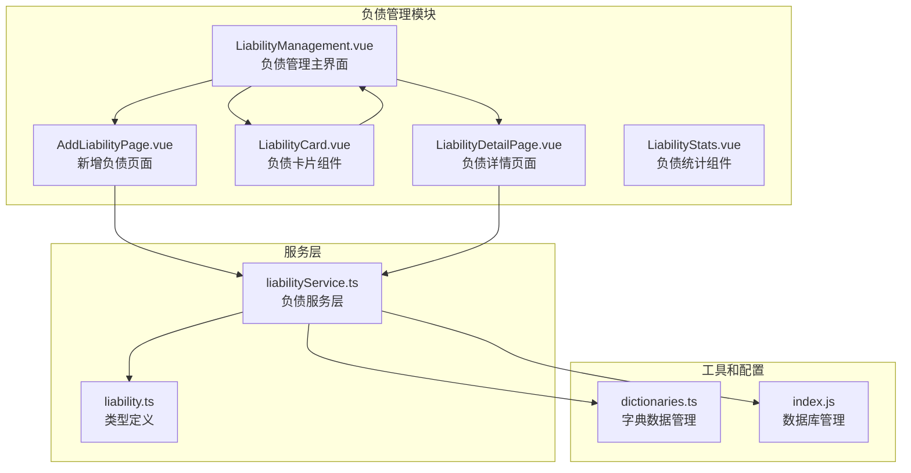
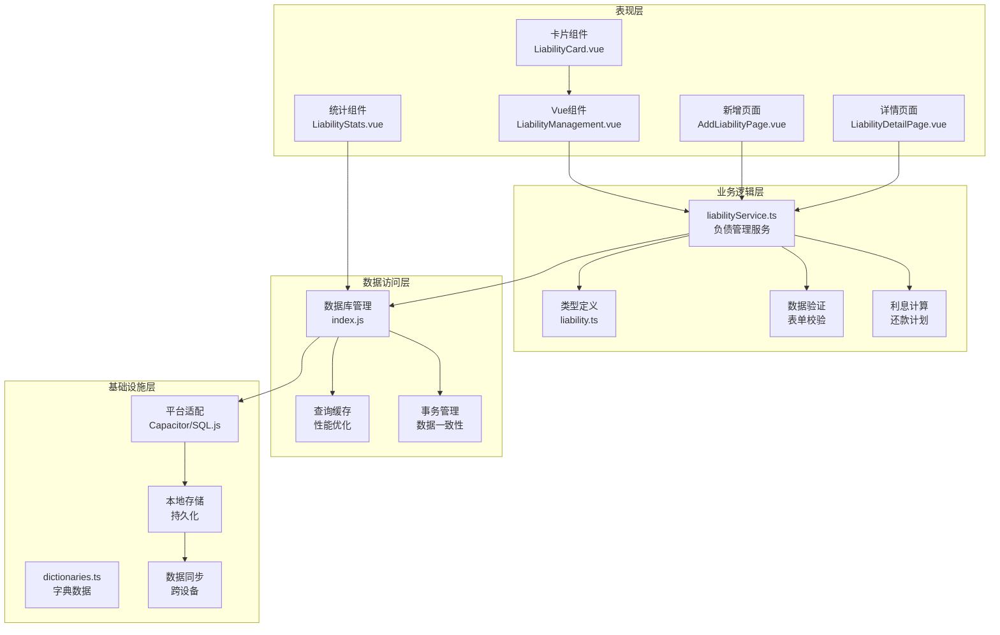
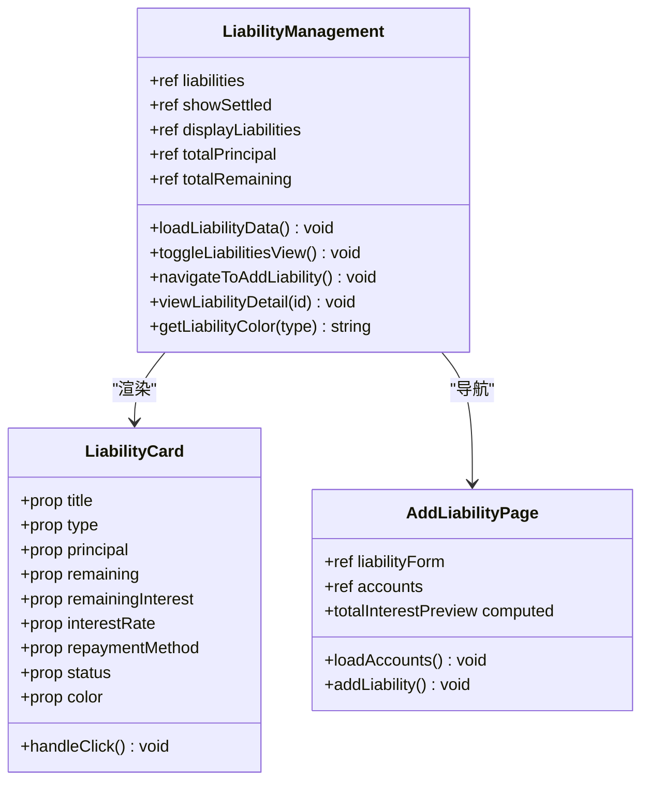
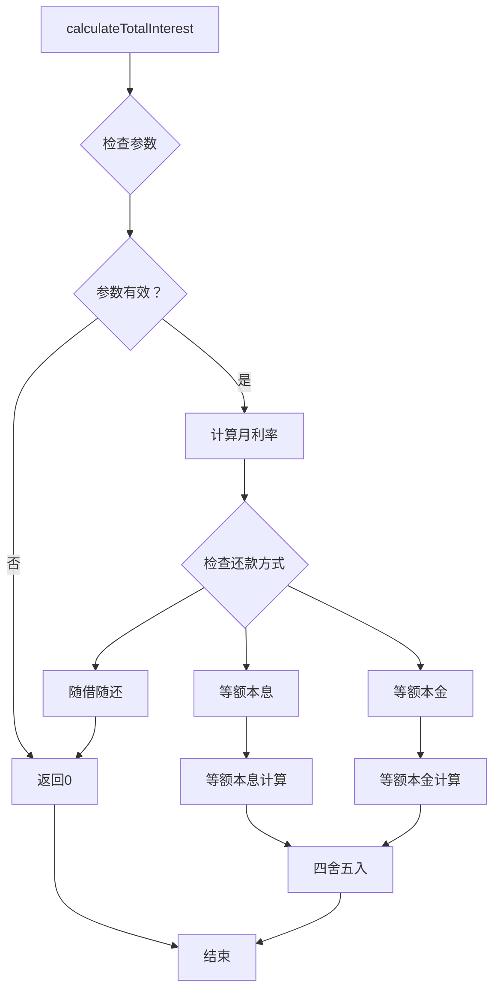
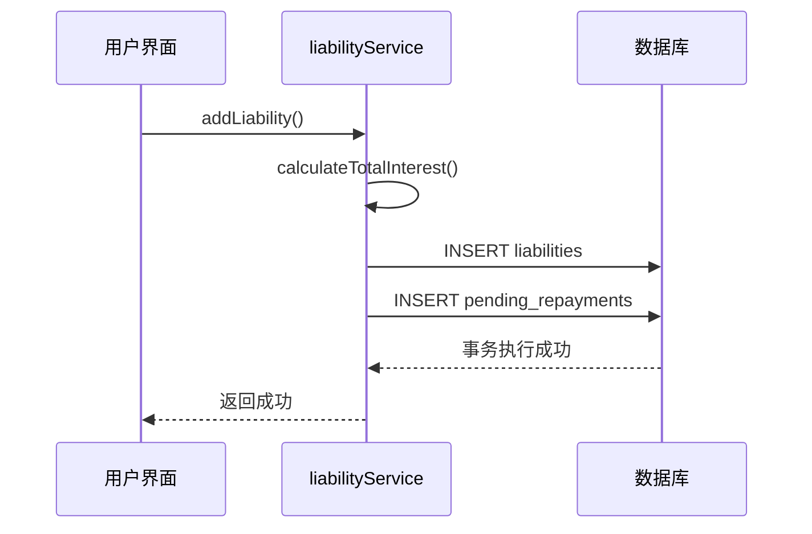
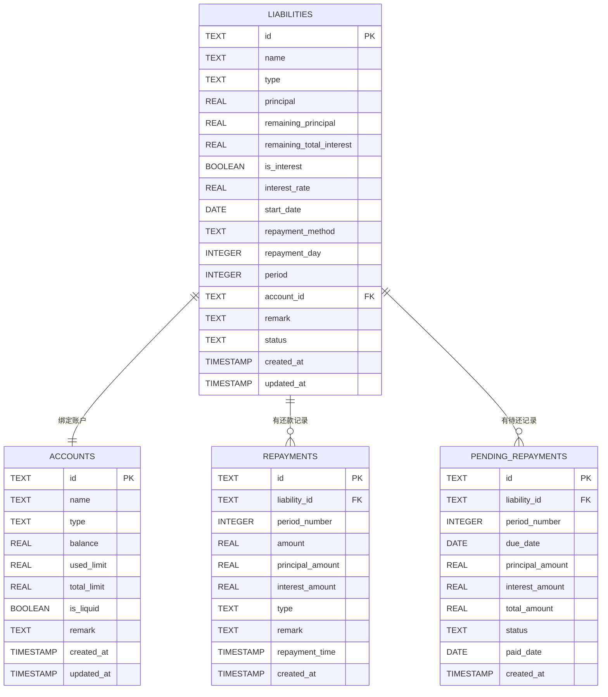

# 负债管理

<cite>
**本文档引用的文件**
- [liabilityService.ts](file://src/services/liability/liabilityService.ts)
- [liability.ts](file://src/types/liability/liability.ts)
- [LiabilityManagement.vue](file://src/components/mobile/liability/LiabilityManagement.vue)
- [AddLiabilityPage.vue](file://src/components/mobile/liability/AddLiabilityPage.vue)
- [LiabilityCard.vue](file://src/components/mobile/liability/LiabilityCard.vue)
- [LiabilityDetailPage.vue](file://src/components/mobile/liability/LiabilityDetailPage.vue)
- [LiabilityStats.vue](file://src/components/mobile/liability/LiabilityStats.vue)
- [dictionaries.ts](file://src/utils/dictionaries.ts)
- [index.js](file://src/database/index.js)
</cite>

## 更新摘要
**所做更改**
- 新增完整的负债管理模块实现，包括服务层、组件层和数据库架构
- 更新了负债生命周期管理功能，涵盖创建、还款、状态跟踪等全流程
- 新增了详细的负债类型分类和还款方式支持
- 完善了数据库表结构和索引优化
- 增强了用户界面和交互体验

## 目录
1. [简介](#简介)
2. [项目结构](#项目结构)
3. [核心组件](#核心组件)
4. [架构概览](#架构概览)
5. [详细组件分析](#详细组件分析)
6. [服务层实现](#服务层实现)
7. [数据库架构](#数据库架构)
8. [依赖分析](#依赖分析)
9. [性能考虑](#性能考虑)
10. [故障排除指南](#故障排除指南)
11. [结论](#结论)
12. [附录](#附录)

## 简介

负债管理模块是财务应用中的核心功能之一，负责管理用户的各类负债，包括负债的创建、分类、还款计划制定和跟踪。该模块提供了完整的负债生命周期管理，从负债创建到还款完成的全过程跟踪。

**更新** 本次更新实现了完整的负债管理模块，包括主界面、新增页面、详情页面、卡片组件和服务层，形成了一个功能完备的负债管理解决方案。

本模块支持多种负债类型，包括房贷、车贷、信用卡、消费贷等常见负债形式，以及灵活的还款方式设置。通过直观的用户界面，用户可以轻松管理自己的负债状况，监控负债变化，并制定合理的还款计划。

## 项目结构

负债管理模块采用Vue 3 Composition API和Element Plus组件库构建，整体项目结构清晰，模块职责明确：



**图表来源**
- [LiabilityManagement.vue:1-312](file://src/components/mobile/liability/LiabilityManagement.vue#L1-L312)
- [AddLiabilityPage.vue:1-284](file://src/components/mobile/liability/AddLiabilityPage.vue#L1-L284)
- [LiabilityCard.vue:1-226](file://src/components/mobile/liability/LiabilityCard.vue#L1-L226)
- [LiabilityDetailPage.vue:1-606](file://src/components/mobile/liability/LiabilityDetailPage.vue#L1-L606)
- [liabilityService.ts:1-519](file://src/services/liability/liabilityService.ts#L1-L519)
- [dictionaries.ts:1-109](file://src/utils/dictionaries.ts#L1-L109)
- [index.js:629-799](file://src/database/index.js#L629-L799)

**章节来源**
- [LiabilityManagement.vue:1-312](file://src/components/mobile/liability/LiabilityManagement.vue#L1-L312)
- [AddLiabilityPage.vue:1-284](file://src/components/mobile/liability/AddLiabilityPage.vue#L1-L284)
- [LiabilityCard.vue:1-226](file://src/components/mobile/liability/LiabilityCard.vue#L1-L226)
- [LiabilityDetailPage.vue:1-606](file://src/components/mobile/liability/LiabilityDetailPage.vue#L1-L606)
- [liabilityService.ts:1-519](file://src/services/liability/liabilityService.ts#L1-L519)
- [dictionaries.ts:1-109](file://src/utils/dictionaries.ts#L1-L109)
- [index.js:629-799](file://src/database/index.js#L629-L799)

## 核心组件

负债管理模块的核心由以下关键组件构成：

### 主要组件职责

1. **LiabilityManagement.vue**: 负债管理主界面，提供负债的增删改查功能
2. **AddLiabilityPage.vue**: 新增负债页面，支持完整的负债信息录入
3. **LiabilityCard.vue**: 负债卡片组件，用于展示负债摘要信息
4. **LiabilityDetailPage.vue**: 负债详情页面，提供详细的负债信息和还款记录
5. **LiabilityStats.vue**: 负债统计组件，展示财务概览信息

### 数据模型

负债实体包含以下关键属性：
- 基本信息：名称、类型、本金、剩余本金
- 利息信息：是否计息、年化利率、剩余总利息
- 还款信息：还款方式、还款日、期数
- 状态管理：状态、备注、绑定账户
- 时间戳：创建和更新时间

**章节来源**
- [liability.ts:6-25](file://src/types/liability/liability.ts#L6-L25)
- [LiabilityManagement.vue:101-118](file://src/components/mobile/liability/LiabilityManagement.vue#L101-L118)
- [AddLiabilityPage.vue:83-95](file://src/components/mobile/liability/AddLiabilityPage.vue#L83-L95)

## 架构概览

负债管理模块采用分层架构设计，确保了良好的可维护性和扩展性：



**图表来源**
- [liabilityService.ts:14-519](file://src/services/liability/liabilityService.ts#L14-L519)
- [index.js:21-190](file://src/database/index.js#L21-L190)
- [dictionaries.ts:55-90](file://src/utils/dictionaries.ts#L55-L90)

## 详细组件分析

### 负债管理主组件

LiabilityManagement.vue是整个负债管理模块的核心，提供了完整的负债管理功能：

#### 组件功能特性

1. **负债列表展示**: 使用网格布局展示所有负债信息
2. **负债创建**: 支持新增负债，包含完整的负债信息输入
3. **负债切换**: 支持当前负债和历史负债的切换查看
4. **浮动操作菜单**: 提供新增负债的快捷入口
5. **统计概览**: 展示负债本金、剩余待还、负债笔数统计

#### 用户界面设计

组件采用卡片式布局，提供清晰的功能分区：



**图表来源**
- [LiabilityManagement.vue:62-178](file://src/components/mobile/liability/LiabilityManagement.vue#L62-L178)
- [LiabilityCard.vue:43-84](file://src/components/mobile/liability/LiabilityCard.vue#L43-L84)
- [AddLiabilityPage.vue:71-172](file://src/components/mobile/liability/AddLiabilityPage.vue#L71-L172)

#### 负债类型分类

系统支持12种主要负债类型，每种类型都有其特定的管理特点：

| 负债类型 | 特点描述 | 管理方式 |
|---------|----------|----------|
| 房贷 | 长期负债，金额较大，利率相对较低 | 等额本息/等额本金，长期规划 |
| 车贷 | 固定资产相关，期限中等 | 等额本息，按时还款 |
| 信用卡 | 循环信用，可分期还款 | 最低还款额，分期付款 |
| 消费贷 | 个人消费用途，短期负债 | 等额本息，快速还清 |
| 装修贷 | 专项用途，一次性支出 | 等额本息，按期还款 |
| 助学贷款 | 教育用途，可能有宽限期 | 宽限期后正常还款 |
| 网贷 | 线上借贷，利率较高风险 | 优先还清，控制规模 |
| 电商分期 | 购物分期，期限较短 | 按期还款，避免逾期 |
| 租金分期 | 租赁相关，定期支付 | 按月还款，稳定现金流 |
| 亲友借款 | 人际关系借贷，灵活性高 | 协商还款，建立协议 |
| 经营贷 | 商业用途，与收入相关 | 收入稳定时优先还款 |
| 其他负债 | 无法归类的特殊负债 | 根据具体情况管理 |

**章节来源**
- [dictionaries.ts:57-71](file://src/utils/dictionaries.ts#L57-L71)
- [LiabilityManagement.vue:101-118](file://src/components/mobile/liability/LiabilityManagement.vue#L101-L118)

### 还款计划制定逻辑

系统支持三种主要的还款方式，每种方式都有不同的计算逻辑：

#### 等额本息还款

等额本息是最常见的还款方式，特点是每月还款额固定，适合大多数消费者：


**图表来源**
- [liabilityService.ts:24-37](file://src/services/liability/liabilityService.ts#L24-L37)

#### 等额本金还款

等额本金的特点是每月本金固定，利息逐月递减：

| 月份 | 月还款额 | 本金部分 | 利息部分 | 剩余本金 |
|------|----------|----------|----------|----------|
| 1 | P/n + (P - 0)×r | P/n | P×r | P - P/n |
| 2 | P/n + (P - P/n)×r | P/n | (P - P/n)×r | P - 2P/n |
| n | P/n + (P - (n-1)P/n)×r | P/n | (P - (n-1)P/n)×r | 0 |

#### 随借随还

随借随还适用于信用卡和循环信用：

- **最低还款额**: 通常为账单金额的10%-30%
- **全额还款**: 在免息期内全额还款
- **分期付款**: 将大额消费分期，支付手续费

**章节来源**
- [dictionaries.ts:73-78](file://src/utils/dictionaries.ts#L73-L78)
- [liabilityService.ts:53-94](file://src/services/liability/liabilityService.ts#L53-L94)

### 利息计算算法

系统支持两种利息计算模式：

#### 简易计息模式
- **适用场景**: 亲友借款、小额负债
- **计算方式**: 简单利息计算，不考虑复利
- **公式**: 利息 = 本金 × 年利率 × 时间

#### 复利计息模式
- **适用场景**: 正规金融机构贷款
- **计算方式**: 按月复利计算
- **公式**: 期末本息 = 本金 × (1 + 月利率)^期数

## 服务层实现

liabilityService.ts是负债管理的核心服务层，提供了完整的负债管理功能：

### 核心功能

1. **负债计算**: 计算总利息和生成待还记录
2. **负债操作**: 新增、更新、删除负债
3. **还款处理**: 正常还款和提前还款
4. **数据查询**: 获取负债列表、还款记录等

### 服务方法

#### 利息计算函数



**图表来源**
- [liabilityService.ts:14-37](file://src/services/liability/liabilityService.ts#L14-L37)

#### 负债添加流程



**图表来源**
- [liabilityService.ts:100-166](file://src/services/liability/liabilityService.ts#L100-L166)

**章节来源**
- [liabilityService.ts:14-519](file://src/services/liability/liabilityService.ts#L14-L519)

## 数据库架构

负债管理模块的数据库架构设计完善，支持完整的负债生命周期管理：

### 数据表结构



**图表来源**
- [index.js:629-687](file://src/database/index.js#L629-L687)

### 索引优化

为了提高查询性能，系统建立了多个索引：

- `idx_liabilities_account_id`: 按账户ID查询负债
- `idx_liabilities_status`: 按状态查询负债
- `idx_repayments_liability_id`: 按负债ID查询还款记录
- `idx_pending_repayments_liability_id`: 按负债ID查询待还记录
- `idx_pending_repayments_due_date`: 按到期日查询待还记录

**章节来源**
- [index.js:736-753](file://src/database/index.js#L736-L753)

## 依赖分析

负债管理模块的依赖关系清晰，各组件职责明确：

```mermaid
graph TB
subgraph "外部依赖"
VUE[Vue 3]
ELEMENT[Element Plus]
DAYJS[dayjs]
SQLJS[sql.js]
CAPACITOR[Capacitor]
END
subgraph "内部模块"
LM[LiabilityManagement.vue]
ALP[AddLiabilityPage.vue]
LCD[LiabilityCard.vue]
LDP[LiabilityDetailPage.vue]
LService[liabilityService.ts]
LType[liability.ts]
DICT[dictionaries.ts]
DB[index.js]
end
LM --> VUE
LM --> ELEMENT
LM --> DAYJS
ALP --> VUE
ALP --> ELEMENT
ALP --> DICT
LDP --> VUE
LDP --> ELEMENT
LDP --> DAYJS
LCD --> VUE
LService --> DAYJS
LService --> DB
LService --> LType
LService --> DICT
DB --> SQLJS
DB --> CAPACITOR
```

**图表来源**
- [LiabilityManagement.vue:62](file://src/components/mobile/liability/LiabilityManagement.vue#L62)
- [AddLiabilityPage.vue:71](file://src/components/mobile/liability/AddLiabilityPage.vue#L71)
- [LiabilityDetailPage.vue:178](file://src/components/mobile/liability/LiabilityDetailPage.vue#L178)
- [liabilityService.ts:6-9](file://src/services/liability/liabilityService.ts#L6-L9)

### 组件耦合度分析

- **低耦合**: 各组件间通过props和事件通信，减少直接依赖
- **高内聚**: 每个组件专注于单一职责，功能模块化
- **可测试性**: 组件接口清晰，便于单元测试和集成测试

**章节来源**
- [LiabilityManagement.vue:62-178](file://src/components/mobile/liability/LiabilityManagement.vue#L62-L178)
- [AddLiabilityPage.vue:71-172](file://src/components/mobile/liability/AddLiabilityPage.vue#L71-L172)
- [LiabilityDetailPage.vue:178-346](file://src/components/mobile/liability/LiabilityDetailPage.vue#L178-L346)

## 性能考虑

系统在设计时充分考虑了性能优化：

### 数据库性能优化

1. **连接池管理**: 使用单例模式管理数据库连接
2. **查询缓存**: 实现Map缓存机制，减少重复查询
3. **批量操作**: 支持批量SQL执行，提高数据处理效率
4. **索引优化**: 为常用查询字段建立索引

### 前端性能优化

1. **懒加载**: 组件按需加载，减少初始包大小
2. **虚拟滚动**: 大数据量表格使用虚拟滚动技术
3. **防抖节流**: 输入框和搜索功能使用防抖优化
4. **响应式设计**: 适配不同屏幕尺寸，提升用户体验

### 移动端优化

1. **原生平台支持**: 使用Capacitor SQLite插件
2. **Web兼容性**: 支持sql.js在Web环境中运行
3. **离线支持**: 本地数据存储，支持离线使用
4. **性能监控**: 实现数据库状态监控和性能统计

## 故障排除指南

### 常见问题及解决方案

#### 数据库连接问题

**问题症状**: 页面加载时出现数据库连接错误
**解决步骤**:
1. 检查数据库初始化状态
2. 验证平台适配器配置
3. 确认SQLite插件安装情况
4. 查看控制台错误日志

#### 负债数据异常

**问题症状**: 负债列表显示异常或数据丢失
**解决步骤**:
1. 检查数据完整性约束
2. 验证外键关联关系
3. 确认事务执行状态
4. 查看数据迁移历史

#### 还款计算错误

**问题症状**: 还款金额计算不准确
**解决步骤**:
1. 验证输入参数格式
2. 检查利率转换计算
3. 确认还款方式匹配
4. 对比标准计算公式

**章节来源**
- [index.js:793-821](file://src/database/index.js#L793-L821)
- [liabilityService.ts:326-508](file://src/services/liability/liabilityService.ts#L326-L508)

## 结论

负债管理模块通过精心设计的架构和完善的功能实现，为用户提供了全面的负债管理解决方案。模块具有以下优势：

1. **功能完整**: 覆盖负债管理的全生命周期
2. **界面友好**: 直观的操作界面和清晰的数据展示
3. **性能优异**: 多层次的性能优化策略
4. **扩展性强**: 模块化设计便于功能扩展
5. **可靠性高**: 完善的错误处理和数据保护机制

该模块不仅满足了当前的功能需求，还为未来的功能扩展和技术升级奠定了坚实的基础。

## 附录

### 使用示例

#### 新增负债流程

1. 点击"新增"按钮
2. 填写负债基本信息
3. 选择还款方式和参数
4. 预览预计总利息
5. 保存负债记录

#### 还款操作流程

1. 在负债详情页面点击"还款"
2. 输入还款金额和类型
3. 确认还款操作
4. 查看还款记录

### 最佳实践建议

1. **负债规划**: 建议优先处理高利率负债
2. **预算控制**: 将负债支出纳入月度预算
3. **定期检查**: 每月检查负债状态和还款进度
4. **风险控制**: 保持合理的负债收入比
5. **记录管理**: 保留所有负债相关凭证

### 扩展开发指导

#### 新增负债类型

1. 在字典文件中添加新的负债类型
2. 更新前端表单选项
3. 添加相应的业务逻辑处理
4. 测试新类型的完整功能

#### 集成其他模块

1. **财务健康评估**: 集成负债数据到健康评估
2. **预算管理**: 将负债支出纳入预算规划
3. **投资组合**: 考虑负债对投资决策的影响
4. **税务规划**: 分析负债的税务影响