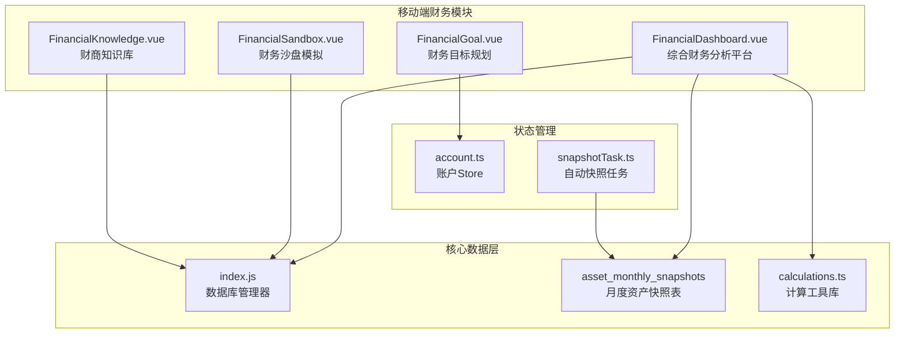
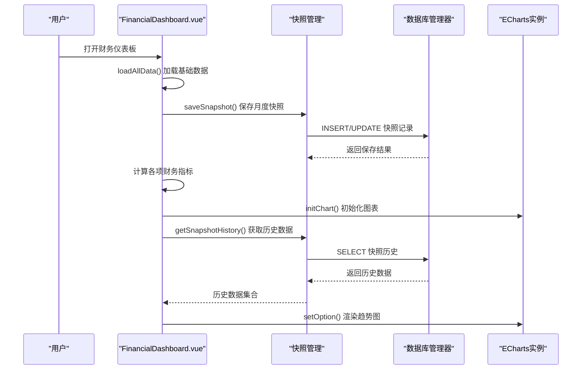
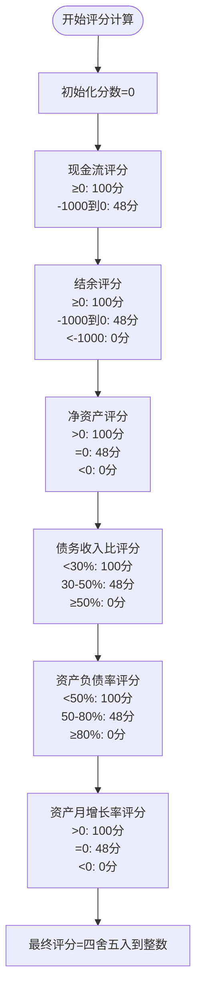
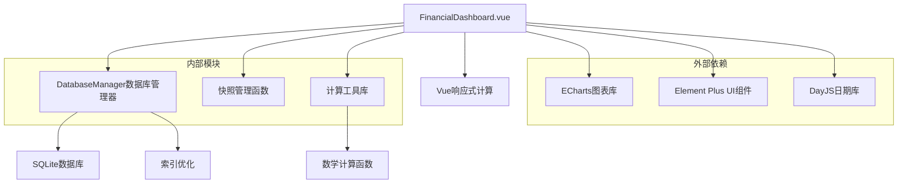

# 财务仪表板

<cite>
**本文引用的文件**
- [FinancialDashboard.vue](file://src/components/mobile/financial/FinancialDashboard.vue)
- [index.js](file://src/database/index.js)
- [account.ts](file://src/stores/account.ts)
- [FinancialSandbox.vue](file://src/components/mobile/financial/FinancialSandbox.vue)
- [FinancialGoal.vue](file://src/components/mobile/financial/FinancialGoal.vue)
- [FinancialKnowledge.vue](file://src/components/mobile/financial/FinancialKnowledge.vue)
- [adapter.js](file://src/database/adapter.js)
- [calculations.ts](file://src/utils/calculations.ts)
- [snapshotTask.ts](file://src/auto/tasks/snapshotTask.ts)
</cite>

## 更新摘要
**变更内容**
- 财务仪表板文本优化：将"资产趋势"简化为"趋势"，提升移动端显示效果
- 财务仪表板从简单健康评估升级为全面财务分析平台
- 新增综合评分系统，包含6项核心财务指标的量化评估
- 实现资产趋势可视化，支持月度快照数据存储
- 增强财务健康指标展示，提供详细的指标计算公式和状态分析
- 完善数据库架构，新增asset_monthly_snapshots快照表
- 优化UI设计，采用现代化的卡片式布局和状态分级显示

## 目录
1. [简介](#简介)
2. [项目结构](#项目结构)
3. [核心组件](#核心组件)
4. [架构总览](#架构总览)
5. [详细组件分析](#详细组件分析)
6. [数据库架构](#数据库架构)
7. [综合评分系统](#综合评分系统)
8. [财务指标体系](#财务指标体系)
9. [资产趋势可视化](#资产趋势可视化)
10. [依赖关系分析](#依赖关系分析)
11. [性能考量](#性能考量)
12. [故障排查指南](#故障排查指南)
13. [结论](#结论)
14. [附录](#附录)

## 简介
本文档详细介绍升级后的财务仪表板功能，这是一个从简单健康评估界面扩展为全面财务分析平台的综合性解决方案。新版本实现了综合评分系统、六项财务指标评估、资产趋势可视化、智能快照管理和实时状态监控等功能，为用户提供全方位的财务健康洞察和趋势分析。

## 项目结构
财务仪表板位于移动端财务模块中，采用Vue 3 Composition API和TypeScript构建，结合Element Plus组件库和ECharts图表库，实现了响应式的财务分析界面。系统通过统一的数据库管理器支持跨平台数据持久化，通过Pinia Store管理全局状态。



**图表来源**
- [FinancialDashboard.vue:1-829](file://src/components/mobile/financial/FinancialDashboard.vue#L1-L829)
- [index.js:744-757](file://src/database/index.js#L744-L757)
- [account.ts:1-274](file://src/stores/account.ts#L1-L274)
- [snapshotTask.ts:83-119](file://src/auto/tasks/snapshotTask.ts#L83-L119)

## 核心组件
- **综合评分卡片**：展示整体财务健康等级和详细评语
- **财务健康指标面板**：包含6项核心指标的实时状态和计算公式
- **资产趋势图表**：基于月度快照数据的资产变化可视化
- **智能快照系统**：自动记录和管理月度财务数据
- **响应式布局**：适配移动端和桌面端的灵活网格系统

**章节来源**
- [FinancialDashboard.vue:1-829](file://src/components/mobile/financial/FinancialDashboard.vue#L1-L829)

## 架构总览
升级后的财务仪表板采用分层架构设计，实现了数据层、业务逻辑层、表现层的清晰分离：



**图表来源**
- [FinancialDashboard.vue:141-210](file://src/components/mobile/financial/FinancialDashboard.vue#L141-L210)
- [FinancialDashboard.vue:93-138](file://src/components/mobile/financial/FinancialDashboard.vue#L93-L138)
- [FinancialDashboard.vue:542-628](file://src/components/mobile/financial/FinancialDashboard.vue#L542-L628)

## 详细组件分析

### 综合评分系统
新的综合评分系统将6项核心财务指标进行量化评估，每项指标最高100分，总分为600分。评分算法考虑了指标的健康程度和权重分配：



**图表来源**
- [FinancialDashboard.vue:329-358](file://src/components/mobile/financial/FinancialDashboard.vue#L329-L358)

**章节来源**
- [FinancialDashboard.vue:329-385](file://src/components/mobile/financial/FinancialDashboard.vue#L329-L385)

### 财务健康指标面板
新版指标面板包含6项核心财务指标，每项指标都提供详细的计算公式、状态分类和健康标准：

#### 1. 月度现金流
- **计算公式**：收入 - 日常支出
- **健康标准**：≥0 健康，<0 危险
- **状态显示**：绿色健康/红色危险

#### 2. 月度结余
- **计算公式**：收入 - 支出 - 投资亏损 - 月供
- **健康标准**：≥0 健康，-1000到0 预警，<-1000 危险
- **状态显示**：绿色健康/橙色预警/红色危险

#### 3. 净资产
- **计算公式**：资产总额 - 总负债
- **健康标准**：>0 健康，=0 预警，<0 危险
- **状态显示**：绿色健康/橙色预警/红色危险

#### 4. 债务收入比
- **计算公式**：月供 / 月收入 × 100%
- **健康标准**：<30% 轻松，30-50% 正常，≥50% 危险
- **状态显示**：绿色轻松/黄色正常/红色危险

#### 5. 资产负债率
- **计算公式**：总负债 / 资产总额 × 100%
- **健康标准**：<50% 健康，50-80% 偏高，≥80% 高风险
- **状态显示**：绿色健康/黄色偏高/红色高风险

#### 6. 资产月增长率
- **计算公式**：(本月资产 - 上月资产) / 上月资产 × 100%
- **健康标准**：>0 增长，=0 停滞，<0 缩水
- **状态显示**：绿色增长/橙色停滞/红色缩水

**章节来源**
- [FinancialDashboard.vue:392-539](file://src/components/mobile/financial/FinancialDashboard.vue#L392-L539)

### ECharts 资产趋势图表
升级后的资产趋势图表基于月度快照数据，提供直观的资产变化可视化：

- **数据源**：asset_monthly_snapshots表的月度快照数据
- **时间范围**：支持近6个月和近12个月两种视图
- **图表类型**：平滑曲线+面积填充的折线图
- **交互功能**：悬停显示具体数值，坐标轴自动单位换算
- **视觉设计**：绿色主题，渐变填充效果


**图表来源**
- [FinancialDashboard.vue:541-628](file://src/components/mobile/financial/FinancialDashboard.vue#L541-L628)

**章节来源**
- [FinancialDashboard.vue:541-628](file://src/components/mobile/financial/FinancialDashboard.vue#L541-L628)

### 快照管理系统
新增的快照管理系统实现了自动化的月度财务数据记录：

- **自动保存**：每次页面加载时自动保存当月快照
- **历史查询**：支持查询近6个月或12个月的历史数据
- **数据结构**：包含总资产、总负债、净资产、已实现盈亏等关键指标
- **索引优化**：为year和month字段建立复合索引提升查询性能

**章节来源**
- [FinancialDashboard.vue:93-138](file://src/components/mobile/financial/FinancialDashboard.vue#L93-L138)
- [index.js:744-757](file://src/database/index.js#L744-L757)

## 数据库架构
升级后的数据库架构支持完整的财务分析功能，新增了专门的快照表和索引优化：

### 快照表结构
```sql
CREATE TABLE IF NOT EXISTS asset_monthly_snapshots (
    id TEXT PRIMARY KEY,
    year INTEGER NOT NULL,
    month INTEGER NOT NULL,
    total_assets REAL DEFAULT 0,
    total_liabilities REAL DEFAULT 0,
    net_worth REAL DEFAULT 0,
    confirmed_profit_stocks REAL DEFAULT 0,
    confirmed_profit_funds REAL DEFAULT 0,
    created_at TIMESTAMP DEFAULT CURRENT_TIMESTAMP,
    UNIQUE(year, month)
);
```

### 索引优化
- `idx_asset_monthly_snapshots_year_month`: 快照查询性能优化
- 多个业务表的复合索引：提升复杂查询效率

**章节来源**
- [index.js:744-778](file://src/database/index.js#L744-L778)

## 综合评分系统详解
综合评分系统采用加权平均算法，每项指标权重相等（100分），总分为600分：

### 评分等级划分
- **优秀 (90-100分)**: 财务状况非常健康，资产持续增长，负债可控
- **良好 (70-89分)**: 财务状况稳健，现金流充足，负债压力适中
- **一般 (50-69分)**: 财务状况尚可，存在一定优化空间
- **较弱 (30-49分)**: 财务状况偏弱，现金流紧张或资产缩水
- **危险 (<30分)**: 财务状况危险，存在资不抵债或高负债压力

### 评分算法实现
```typescript
// 月度现金流评分
if (monthlyCashFlow.value >= 0) score += maxPerIndicator

// 月度结余评分  
if (monthlyBalance.value >= 0) score += maxPerIndicator
else if (monthlyBalance.value >= -1000) score += maxPerIndicator * 0.48

// 净资产评分
if (netWorth.value > 0) score += maxPerIndicator
else if (netWorth.value === 0) score += maxPerIndicator * 0.48

// 债务收入比评分
if (debtIncomeRatio.value < 30) score += maxPerIndicator
else if (debtIncomeRatio.value <= 50) score += maxPerIndicator * 0.48

// 资产负债率评分
if (assetLiabilityRatio.value < 50) score += maxPerIndicator
else if (assetLiabilityRatio.value <= 80) score += maxPerIndicator * 0.48

// 资产月增长率评分
if (assetGrowthRate.value > 0) score += maxPerIndicator
else if (assetGrowthRate.value === 0) score += maxPerIndicator * 0.48
```

**章节来源**
- [FinancialDashboard.vue:329-385](file://src/components/mobile/financial/FinancialDashboard.vue#L329-L385)

## 财务指标体系
新版财务指标体系包含6项核心指标，每项都有明确的定义、计算方法和健康标准：

### 资产负债类指标
- **资产总额**：流动资金 + 社保资产 + 公积金资产 + 股票市值 + 基金市值 + 亲友借出
- **总负债**：所有负债剩余本金 + 信用卡已用额度
- **净资产**：资产总额 - 总负债

### 收入支出类指标
- **月度现金流**：月度收入 - 月度日常支出
- **月度结余**：月度收入 - 月度支出 - 投资亏损 - 月供
- **月度投资盈亏变化**：当前已实现盈亏 - 上月已实现盈亏

### 偿债能力类指标
- **债务收入比**：月供 / 月收入 × 100%
- **资产负债率**：总负债 / 资产总额 × 100%

### 增长潜力类指标
- **资产月增长率**：(本月资产 - 上月资产) / 上月资产 × 100%

**章节来源**
- [FinancialDashboard.vue:213-327](file://src/components/mobile/financial/FinancialDashboard.vue#L213-L327)

## 资产趋势可视化
资产趋势可视化功能提供了直观的财务变化追踪：

### 数据采集机制
- **自动采集**：页面加载时自动保存当月快照
- **历史数据**：支持查询近6个月或12个月的历史记录
- **增量更新**：快照表支持UPDATE和INSERT双重操作

### 图表特性
- **时间轴**：显示月份数字标签（如"1月"、"2月"等）
- **数值轴**：自动单位换算（万元显示）
- **视觉效果**：绿色主题，半透明面积填充
- **交互功能**：悬停显示具体数值和月份

### 用户体验
- **无数据提示**：当没有历史数据时显示友好提示
- **响应式设计**：适配不同屏幕尺寸
- **实时更新**：数据变化时自动刷新图表

**更新** 财务仪表板中的"资产趋势"标题已简化为"趋势"，提升了移动端的显示效果和空间利用率

**章节来源**
- [FinancialDashboard.vue:541-628](file://src/components/mobile/financial/FinancialDashboard.vue#L541-L628)

## 依赖关系分析
升级后的财务仪表板具有清晰的依赖层次结构：



**图表来源**
- [FinancialDashboard.vue:67-71](file://src/components/mobile/financial/FinancialDashboard.vue#L67-L71)
- [index.js:1-200](file://src/database/index.js#L1-L200)

**章节来源**
- [FinancialDashboard.vue:67-71](file://src/components/mobile/financial/FinancialDashboard.vue#L67-L71)
- [index.js:1-200](file://src/database/index.js#L1-L200)

## 性能考量
升级后的财务仪表板在多个方面进行了性能优化：

### 数据库性能
- **索引优化**：为快照表建立year和month复合索引
- **查询缓存**：数据库管理器内置查询缓存机制
- **批量操作**：支持批量SQL语句执行

### 前端性能
- **懒加载**：ECharts图表按需初始化
- **响应式更新**：使用Vue计算属性避免不必要的重渲染
- **内存管理**：及时清理图表实例和事件监听器

### 移动端优化
- **轻量级图表**：简化图表配置减少内存占用
- **自适应布局**：CSS Grid自动适配不同屏幕尺寸
- **触摸优化**：图表交互针对移动端触摸优化

## 故障排查指南
针对升级后的财务仪表板可能出现的问题提供排查指导：

### 快照数据问题
- **快照不更新**：检查saveSnapshot函数调用时机和数据库连接状态
- **历史数据缺失**：验证asset_monthly_snapshots表结构和索引
- **数据重复**：确认UNIQUE约束和重复检测逻辑

### 图表渲染问题
- **图表空白**：检查chartRef元素是否存在和尺寸是否正确
- **数据不显示**：验证getSnapshotHistory查询结果和数据格式
- **样式异常**：确认CSS类名和scoped样式的正确性

### 性能问题
- **页面加载慢**：检查数据库查询是否使用索引，考虑添加LIMIT限制
- **内存泄漏**：确认图表实例在组件销毁时正确清理
- **计算性能**：优化大数组的reduce操作，考虑分批处理

**章节来源**
- [FinancialDashboard.vue:93-138](file://src/components/mobile/financial/FinancialDashboard.vue#L93-L138)
- [index.js:744-778](file://src/database/index.js#L744-L778)

## 结论
升级后的财务仪表板从单一的健康评估界面发展为全面的财务分析平台，实现了以下重要突破：

1. **智能化评分**：通过综合评分系统提供量化的财务健康评估
2. **多维度分析**：涵盖6项核心财务指标的全面分析
3. **可视化追踪**：基于月度快照的资产趋势可视化
4. **自动化管理**：智能快照系统实现数据的自动记录和管理
5. **用户体验优化**：现代化的UI设计和响应式布局

该平台为用户提供了从宏观到微观的全方位财务洞察，不仅能够实时监控财务状况，还能通过历史趋势预测未来的财务走势，是现代财务管理的理想工具。

## 附录

### 财务指标详细定义
- **月度现金流**：当月收入减去日常支出的净额
- **月度结余**：扣除所有支出、投资亏损和月供后的剩余资金
- **净资产**：总资产减去总负债的实际财富价值
- **债务收入比**：月度债务支出占月度收入的比例
- **资产负债率**：总负债占总资产的百分比
- **资产月增长率**：与上月相比的资产增长幅度

### 评分算法详细说明
- **权重分配**：每项指标权重相等，总分为600分
- **评分规则**：健康状态获得满分，预警状态获得48%分数，危险状态得0分
- **等级划分**：基于总分的五个等级区间
- **状态描述**：每个等级对应详细的财务状况描述和改善建议

### 数据库表结构
- **asset_monthly_snapshots**：存储月度财务快照数据
- **字段说明**：包含时间标识、财务指标和创建时间
- **索引优化**：year和month字段的复合索引提升查询性能
- **数据完整性**：UNIQUE约束防止重复快照

### 开发扩展建议
- **指标扩展**：可添加更多财务指标如储蓄率、流动性比率等
- **图表增强**：支持多种图表类型和自定义配置
- **数据导出**：提供财务数据的Excel或PDF导出功能
- **通知提醒**：基于指标阈值的智能提醒系统
- **多账户支持**：支持家庭或企业级多账户财务分析