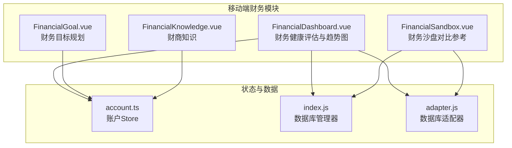
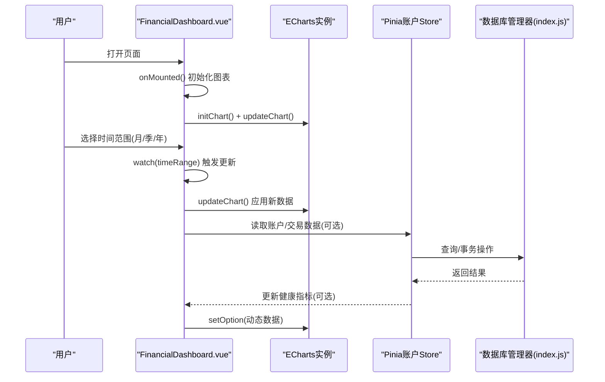
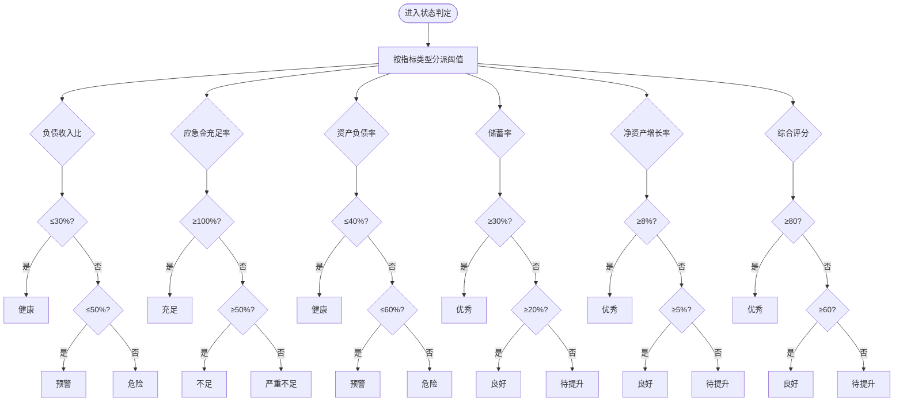
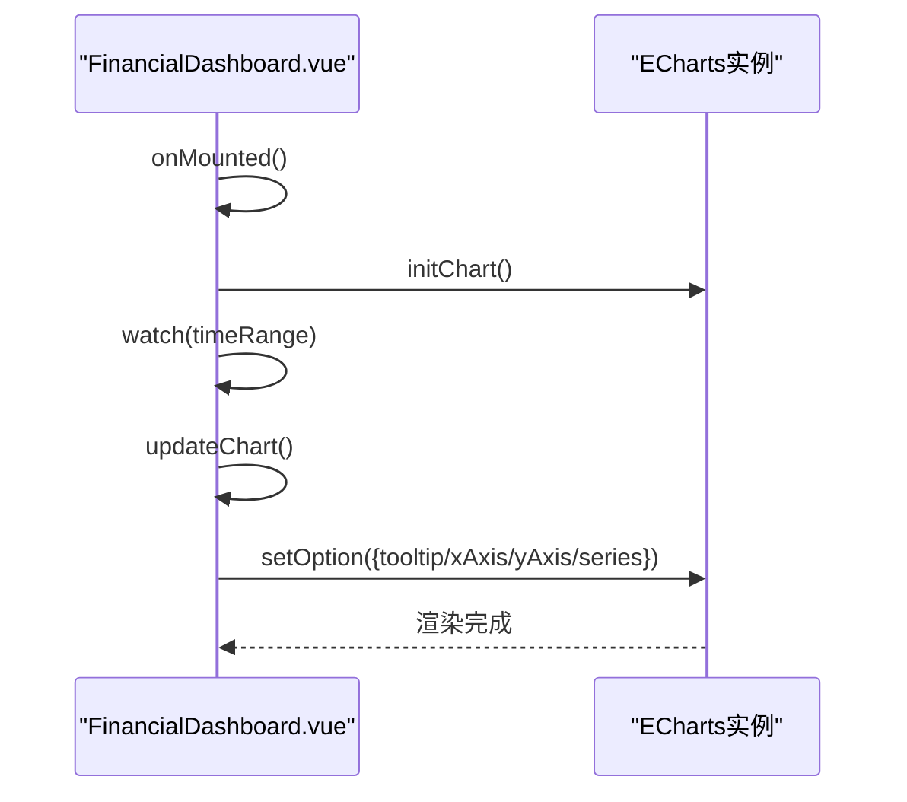
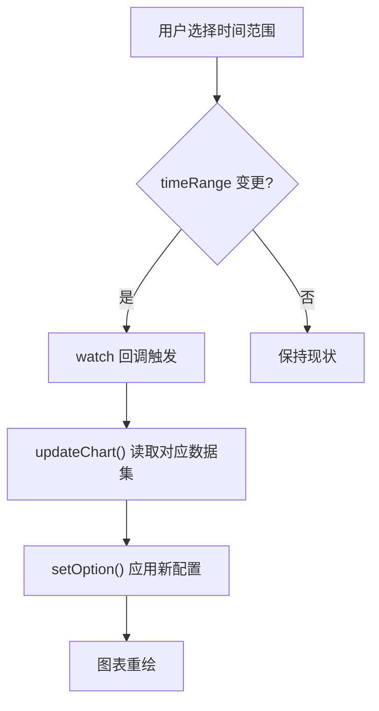
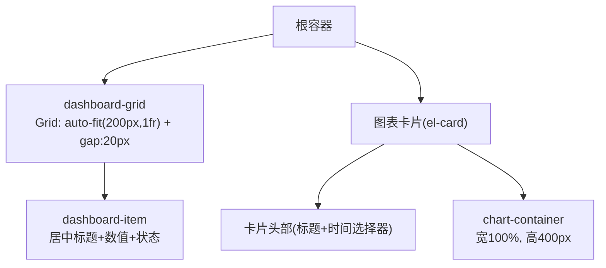
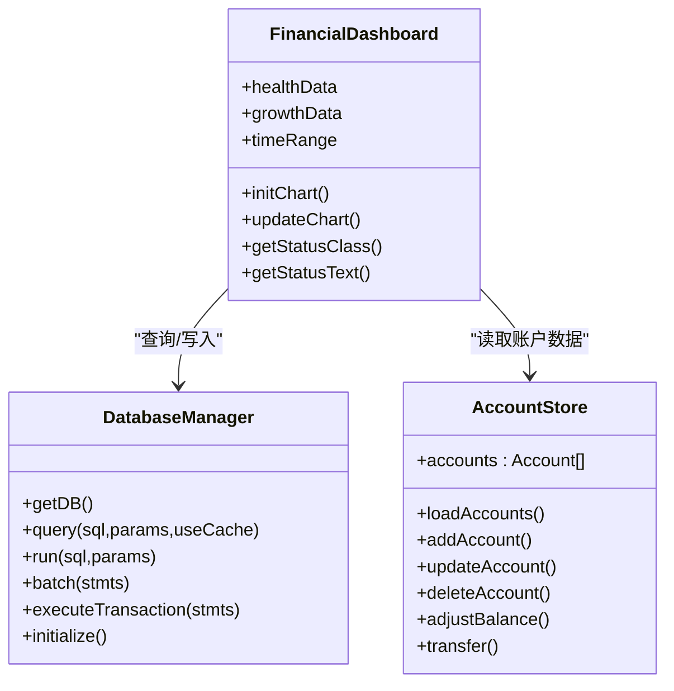
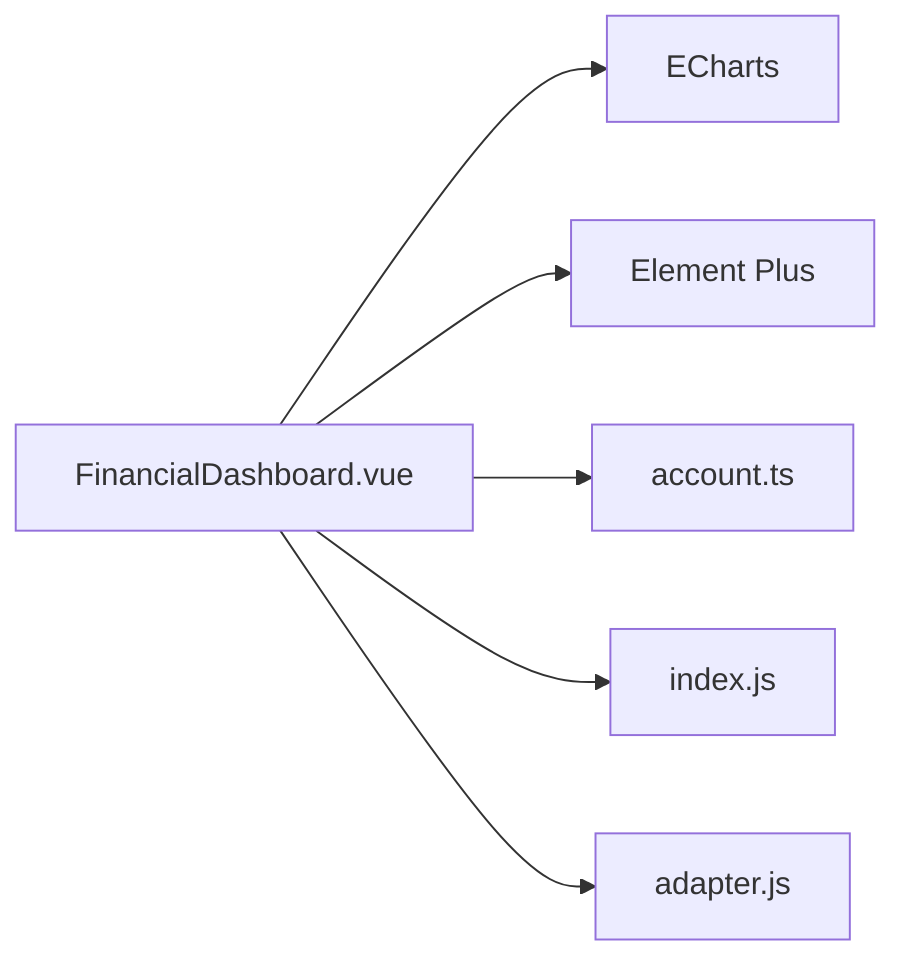

# 财务仪表板

<cite>
**本文引用的文件**
- [FinancialDashboard.vue](file://src/components/mobile/financial/FinancialDashboard.vue)
- [index.js](file://src/database/index.js)
- [account.ts](file://src/stores/account.ts)
- [FinancialSandbox.vue](file://src/components/mobile/financial/FinancialSandbox.vue)
- [FinancialGoal.vue](file://src/components/mobile/financial/FinancialGoal.vue)
- [FinancialKnowledge.vue](file://src/components/mobile/financial/FinancialKnowledge.vue)
- [adapter.js](file://src/database/adapter.js)
</cite>

## 目录
1. [简介](#简介)
2. [项目结构](#项目结构)
3. [核心组件](#核心组件)
4. [架构总览](#架构总览)
5. [详细组件分析](#详细组件分析)
6. [依赖关系分析](#依赖关系分析)
7. [性能考量](#性能考量)
8. [故障排查指南](#故障排查指南)
9. [结论](#结论)
10. [附录](#附录)

## 简介
本文件面向“财务仪表板”功能，提供从指标定义、图表实现、状态指示器、时间范围切换到布局与响应式适配的完整技术文档，并给出财务指标解读与改善建议，以及面向开发者的扩展与优化方案。当前代码库中的财务仪表板以静态示例数据展示核心指标与折线图，后续可无缝对接真实数据库与计算服务。

## 项目结构
财务仪表板位于移动端财务模块中，采用 Vue 组件化组织，结合 Element Plus 卡片布局与 ECharts 图表渲染；数据库层通过统一的 SQLite 管理器支持跨平台（原生/Web），并通过 Pinia Store 管理账户数据。

**图表来源**
- [FinancialDashboard.vue:1-279](file://src/components/mobile/financial/FinancialDashboard.vue#L1-L279)
- [account.ts:1-273](file://src/stores/account.ts#L1-L273)
- [index.js:1-935](file://src/database/index.js#L1-L935)
- [adapter.js:1-34](file://src/database/adapter.js#L1-L34)

**章节来源**
- [FinancialDashboard.vue:1-279](file://src/components/mobile/financial/FinancialDashboard.vue#L1-L279)
- [index.js:1-935](file://src/database/index.js#L1-L935)
- [account.ts:1-273](file://src/stores/account.ts#L1-L273)
- [adapter.js:1-34](file://src/database/adapter.js#L1-L34)

## 核心组件
- 财务健康评估卡片：展示负债收入比、应急金充足率、资产负债率、储蓄率、净资产增长率与综合评分。
- 净资产增长率趋势折线图：支持月度/季度/年度时间范围切换。
- 状态指示器：基于阈值的分级颜色与状态文本。
- 布局与响应式：网格布局与卡片容器，适配移动端与桌面端。

**章节来源**
- [FinancialDashboard.vue:1-279](file://src/components/mobile/financial/FinancialDashboard.vue#L1-L279)

## 架构总览
财务仪表板的数据流与控制流如下：

**图表来源**
- [FinancialDashboard.vue:77-170](file://src/components/mobile/financial/FinancialDashboard.vue#L77-L170)
- [account.ts:34-121](file://src/stores/account.ts#L34-L121)
- [index.js:199-309](file://src/database/index.js#L199-L309)

## 详细组件分析

### 财务健康评估指标与状态指示器
- 指标定义与健康标准（基于当前实现阈值）：
  - 负债收入比 ≤30% 健康；≤50% 预警；>50% 危险
  - 应急金充足率 ≥100% 充足；≥50% 不足；<50% 严重不足
  - 资产负债率 ≤40% 健康；≤60% 预警；>60% 危险
  - 储蓄率 ≥30% 优秀；≥20% 良好；<20% 待提升
  - 净资产增长率 ≥8% 优秀；≥5% 良好；<5% 待提升
  - 综合评分 ≥80 优秀；≥60 良好；<60 待提升
- 状态文本映射：根据阈值返回对应中文状态。
- 状态样式：good/warning/danger 三档，分别对应浅绿/浅黄/浅红背景与对应文字色。

**图表来源**
- [FinancialDashboard.vue:172-208](file://src/components/mobile/financial/FinancialDashboard.vue#L172-L208)

**章节来源**
- [FinancialDashboard.vue:172-208](file://src/components/mobile/financial/FinancialDashboard.vue#L172-L208)

### ECharts 折线图配置与定制
- 初始化：在挂载完成后初始化 ECharts 实例。
- 数据绑定：根据当前时间范围选择对应标签与数值数组。
- 样式设置：折线平滑、面积渐变填充、线条与点的颜色统一。
- 交互功能：提示框显示百分比格式，坐标轴标签包含单位符号。
- 时间范围切换：通过下拉选择触发 watch，动态更新图表选项。

**图表来源**
- [FinancialDashboard.vue:109-170](file://src/components/mobile/financial/FinancialDashboard.vue#L109-L170)

**章节来源**
- [FinancialDashboard.vue:117-170](file://src/components/mobile/financial/FinancialDashboard.vue#L117-L170)

### 时间范围切换与图表更新机制
- 选择器：月度/季度/年度三档。
- 数据源：按当前选择从本地静态数据集中取值。
- 更新流程：watch 监听选择器变化，调用 updateChart 重绘。

**图表来源**
- [FinancialDashboard.vue:65-72](file://src/components/mobile/financial/FinancialDashboard.vue#L65-L72)
- [FinancialDashboard.vue:113-115](file://src/components/mobile/financial/FinancialDashboard.vue#L113-L115)
- [FinancialDashboard.vue:124-170](file://src/components/mobile/financial/FinancialDashboard.vue#L124-L170)

**章节来源**
- [FinancialDashboard.vue:65-72](file://src/components/mobile/financial/FinancialDashboard.vue#L65-L72)
- [FinancialDashboard.vue:113-115](file://src/components/mobile/financial/FinancialDashboard.vue#L113-L115)
- [FinancialDashboard.vue:124-170](file://src/components/mobile/financial/FinancialDashboard.vue#L124-L170)

### 布局设计与响应式适配
- 指标卡片网格：基于 CSS Grid，最小宽度 200px，自动换行，间距 20px。
- 卡片标题区：Flex 布局，右侧放置时间选择器。
- 图表容器：占满父容器宽度，高度固定 400px。
- 状态标签：内联块元素，圆角，内置小字号文本，配合三档颜色类名。

**图表来源**
- [FinancialDashboard.vue:226-279](file://src/components/mobile/financial/FinancialDashboard.vue#L226-L279)

**章节来源**
- [FinancialDashboard.vue:211-279](file://src/components/mobile/financial/FinancialDashboard.vue#L211-L279)

### 与数据库与账户系统的集成点
- 当前仪表板使用静态示例数据，后续可接入数据库与账户 Store：
  - 通过数据库管理器查询账户、交易、资产、负债等数据。
  - 使用账户 Store 的账户列表与余额信息作为计算输入。
  - 将计算得到的健康指标持久化到 financial_health 表。

**图表来源**
- [index.js:21-374](file://src/database/index.js#L21-L374)
- [account.ts:27-273](file://src/stores/account.ts#L27-L273)
- [FinancialDashboard.vue:77-208](file://src/components/mobile/financial/FinancialDashboard.vue#L77-L208)

**章节来源**
- [index.js:418-776](file://src/database/index.js#L418-L776)
- [account.ts:34-121](file://src/stores/account.ts#L34-L121)
- [FinancialDashboard.vue:77-208](file://src/components/mobile/financial/FinancialDashboard.vue#L77-L208)

### 对比参考：财务沙盘（FinancialSandbox）
- 功能定位：情景模拟与结果可视化，展示折线与柱状组合图。
- 与仪表板差异：沙盘侧重“假设—运行—结果”流程，仪表板侧重“实时—趋势—状态”展示。
- 技术共性：均使用 ECharts，具备参数化配置与动态渲染能力。

**章节来源**
- [FinancialSandbox.vue:1-362](file://src/components/mobile/financial/FinancialSandbox.vue#L1-L362)

## 依赖关系分析
- 组件依赖：
  - FinancialDashboard 依赖 ECharts（图表）、Element Plus（卡片/选择器）、Vue 响应式系统。
  - 与数据库与账户 Store 解耦，通过接口抽象与异步调用实现。
- 数据依赖：
  - 指标计算依赖账户余额、交易流水、资产/负债数据。
  - 图表数据依赖时间范围与聚合粒度（月/季/年）。

**图表来源**
- [FinancialDashboard.vue:77-82](file://src/components/mobile/financial/FinancialDashboard.vue#L77-L82)
- [account.ts:1-273](file://src/stores/account.ts#L1-L273)
- [index.js:1-935](file://src/database/index.js#L1-L935)
- [adapter.js:1-34](file://src/database/adapter.js#L1-L34)

**章节来源**
- [FinancialDashboard.vue:77-82](file://src/components/mobile/financial/FinancialDashboard.vue#L77-L82)
- [account.ts:1-273](file://src/stores/account.ts#L1-L273)
- [index.js:1-935](file://src/database/index.js#L1-L935)
- [adapter.js:1-34](file://src/database/adapter.js#L1-L34)

## 性能考量
- 图表渲染：
  - 使用 ECharts 的 setOption 动态更新，避免重复初始化。
  - 在 watch 中仅在必要时调用 updateChart，减少重绘次数。
- 数据访问：
  - 数据库查询启用缓存键与查询缓存，避免重复查询。
  - 批处理与事务用于批量写入，降低 I/O 成本。
- 响应式与布局：
  - CSS Grid 自动换行，减少媒体查询复杂度。
  - 图表容器固定高度，避免布局抖动。

[本节为通用指导，无需具体文件引用]

## 故障排查指南
- 图表不显示或空白：
  - 检查容器 DOM 是否存在且尺寸非零。
  - 确认 initChart 在 onMounted 后执行，updateChart 在数据可用后调用。
- 时间范围切换无效：
  - 确认 v-model 绑定正确，watch 回调触发。
  - 检查静态数据集中是否存在对应键值。
- 状态颜色不生效：
  - 检查状态类名与 scoped 样式是否匹配。
- 数据库连接异常：
  - 检查 getDB 是否成功，native/Web 环境分支逻辑。
  - 关注 SQL.js 或 Capacitor SQLite 的初始化与持久化流程。

**章节来源**
- [FinancialDashboard.vue:109-170](file://src/components/mobile/financial/FinancialDashboard.vue#L109-L170)
- [index.js:56-190](file://src/database/index.js#L56-L190)

## 结论
财务仪表板以清晰的指标卡片与趋势折线图为用户提供即时的财务健康概览，结合阈值驱动的状态指示器与时间范围切换，形成完整的“观测—诊断—追踪”闭环。通过与数据库与账户 Store 的解耦集成，未来可无缝接入真实数据与计算逻辑，进一步提升实用性与可信度。

[本节为总结性内容，无需具体文件引用]

## 附录

### 财务指标定义、计算与健康标准
- 负债收入比
  - 定义：总负债年还款额 / 年收入
  - 健康标准：≤30% 健康；30%-50% 预警；>50% 危险
- 应急金充足率
  - 定义：应急金余额 / 月支出
  - 健康标准：≥100% 充足；≥50% 不足；<50% 严重不足
- 资产负债率
  - 定义：总负债 / 总资产
  - 健康标准：≤40% 健康；40%-60% 预警；>60% 危险
- 储蓄率
  - 定义：年储蓄额 / 年收入
  - 健康标准：≥30% 优秀；20%-30% 良好；<20% 待提升
- 净资产增长率
  - 定义：(期末净资产 - 期初净资产) / 期初净资产
  - 健康标准：≥8% 优秀；5%-8% 良好；<5% 待提升
- 综合评分
  - 定义：加权汇总各指标得分
  - 健康标准：≥80 优秀；60%-80 良好；<60 待提升

**章节来源**
- [FinancialDashboard.vue:172-208](file://src/components/mobile/financial/FinancialDashboard.vue#L172-L208)

### 财务指标解读与改善建议
- 负债收入比偏高：优先降低高息负债，增加收入或延长还款期。
- 应急金不足：将月支出的 3-6 倍作为目标逐步积累。
- 资产负债率过高：出售非流动性资产或增加首付款比例。
- 储蓄率偏低：记账复盘支出结构，减少非必要消费。
- 净资产增长缓慢：优化投资组合，提高资产回报率。
- 综合评分较低：制定专项改进计划，逐项达标。

[本节为通用指导，无需具体文件引用]

### 开发者扩展与优化方案
- 指标计算模块化：
  - 将各指标计算封装为独立函数，便于测试与维护。
- 数据来源多样化：
  - 支持从账户、交易、资产、负债等多表聚合计算。
- 图表增强：
  - 添加双轴、标注、缩放、导出等功能。
- 状态联动：
  - 将状态文本与颜色与侧边菜单或全局通知联动。
- 性能优化：
  - 图表懒加载、数据分页、缓存策略。
- 可靠性：
  - 异常捕获与降级显示，空数据时的占位提示。

[本节为通用指导，无需具体文件引用]