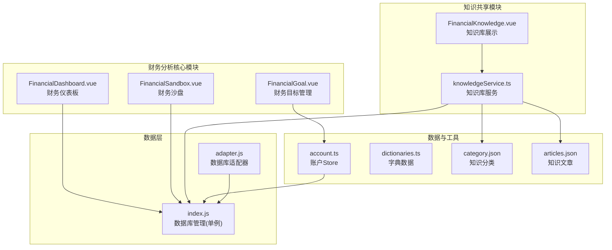
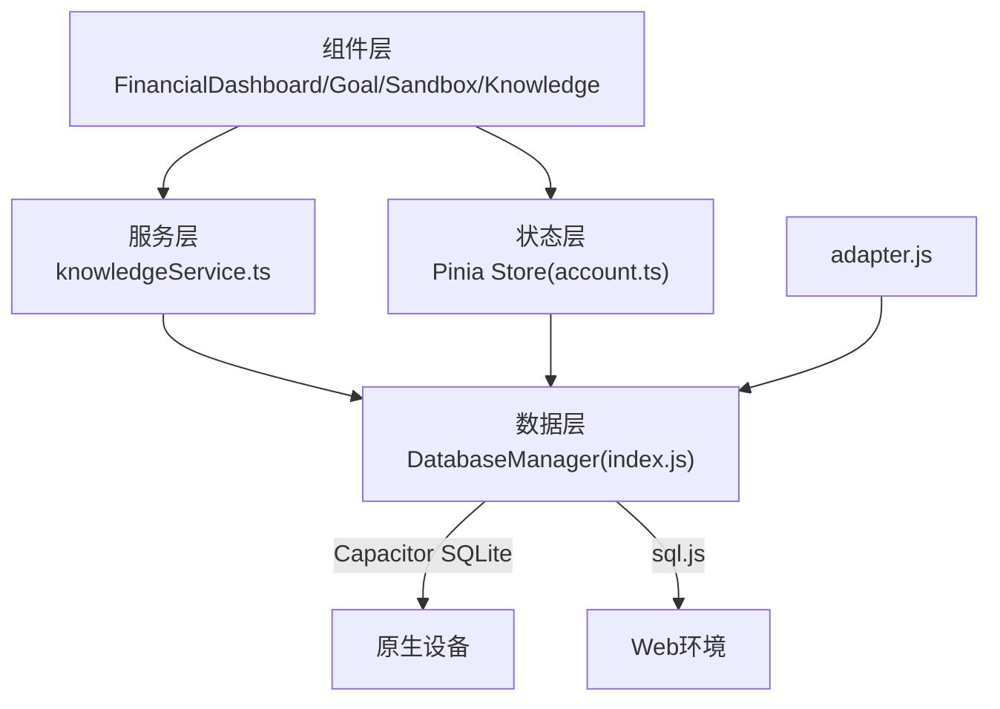
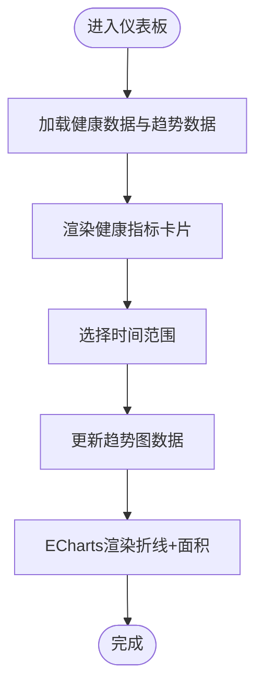
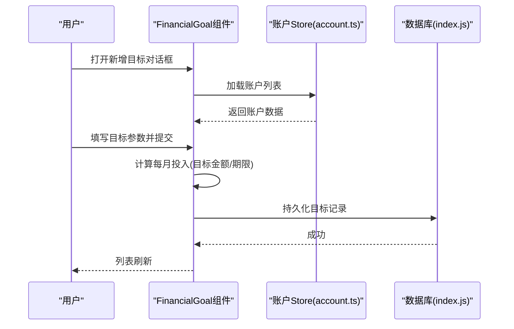
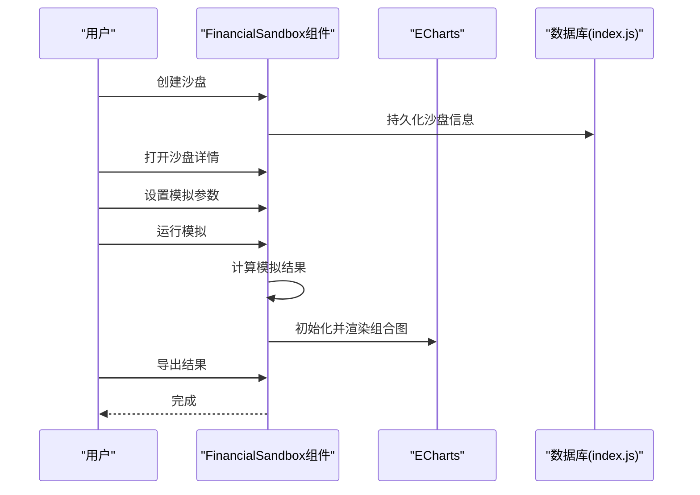
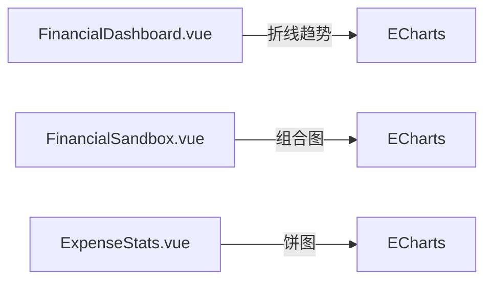
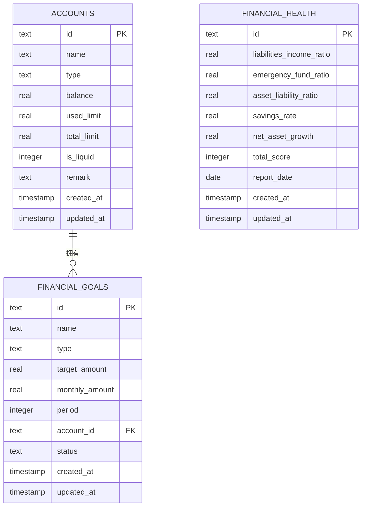
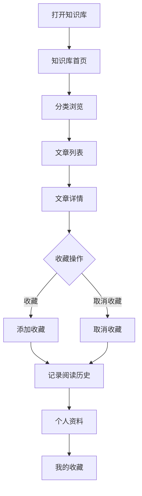
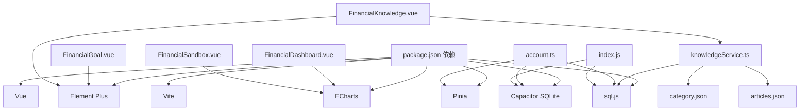

# 财务分析

<cite>
**本文引用的文件**
- [FinancialDashboard.vue](file://src/components/mobile/dashboard/FinancialDashboard.vue)
- [FinancialGoal.vue](file://src/components/mobile/goal/FinancialGoal.vue)
- [FinancialSandbox.vue](file://src/components/mobile/sandbox/FinancialSandbox.vue)
- [FinancialKnowledge.vue](file://src/components/mobile/knowledge/FinancialKnowledge.vue)
- [knowledgeService.ts](file://src/services/knowledge/knowledgeService.ts)
- [category.json](file://src/assets/knowledge/category.json)
- [articles.json](file://src/assets/knowledge/articles.json)
- [App.vue](file://src/App.vue)
- [index.js](file://src/database/index.js)
- [adapter.js](file://src/database/adapter.js)
- [account.ts](file://src/stores/account.ts)
- [dictionaries.ts](file://src/utils/dictionaries.ts)
- [package.json](file://package.json)
- [ExpenseStats.vue](file://src/components/mobile/expense/ExpenseStats.vue)
</cite>

## 更新摘要
**变更内容**
- 更新知识库模块架构，反映知识共享模块的独立化集成
- 新增知识库服务层与数据模型分析
- 更新知识库组件与服务的交互关系
- 完善知识库在财务分析生态中的定位与作用

## 目录
1. [简介](#简介)
2. [项目结构](#项目结构)
3. [核心组件](#核心组件)
4. [架构总览](#架构总览)
5. [详细组件分析](#详细组件分析)
6. [知识库模块详解](#知识库模块详解)
7. [依赖关系分析](#依赖关系分析)
8. [性能考量](#性能考量)
9. [故障排查指南](#故障排查指南)
10. [结论](#结论)
11. [附录](#附录)

## 简介
本文件面向"财务分析模块"的综合技术文档，覆盖财务仪表板、财务目标管理、财务知识库、财务沙盘、图表组件与算法、分析场景与解读建议，以及面向开发者的扩展与优化建议。文档基于仓库中的实际源码进行分析，特别反映了知识共享模块独立化集成后的新架构，帮助开发者快速理解与迭代该模块。

## 项目结构
财务分析模块位于移动端组件目录下，围绕"财务仪表板""财务目标""财务知识库""财务沙盘"四个核心页面展开，并通过数据库层与状态管理层支撑数据持久化与业务逻辑。知识库模块现已独立为完整的知识生态系统，提供完整的知识管理、收藏、阅读历史等功能。



**图表来源**
- [FinancialDashboard.vue](file://src/components/mobile/dashboard/FinancialDashboard.vue)
- [FinancialGoal.vue](file://src/components/mobile/goal/FinancialGoal.vue)
- [FinancialSandbox.vue](file://src/components/mobile/sandbox/FinancialSandbox.vue)
- [FinancialKnowledge.vue](file://src/components/mobile/knowledge/FinancialKnowledge.vue)
- [knowledgeService.ts](file://src/services/knowledge/knowledgeService.ts)
- [category.json](file://src/assets/knowledge/category.json)
- [articles.json](file://src/assets/knowledge/articles.json)
- [account.ts](file://src/stores/account.ts)
- [dictionaries.ts](file://src/utils/dictionaries.ts)
- [index.js](file://src/database/index.js)
- [adapter.js](file://src/database/adapter.js)

**章节来源**
- [FinancialDashboard.vue](file://src/components/mobile/dashboard/FinancialDashboard.vue)
- [FinancialGoal.vue](file://src/components/mobile/goal/FinancialGoal.vue)
- [FinancialSandbox.vue](file://src/components/mobile/sandbox/FinancialSandbox.vue)
- [FinancialKnowledge.vue](file://src/components/mobile/knowledge/FinancialKnowledge.vue)
- [knowledgeService.ts](file://src/services/knowledge/knowledgeService.ts)
- [category.json](file://src/assets/knowledge/category.json)
- [articles.json](file://src/assets/knowledge/articles.json)
- [index.js](file://src/database/index.js)
- [adapter.js](file://src/database/adapter.js)
- [account.ts](file://src/stores/account.ts)
- [dictionaries.ts](file://src/utils/dictionaries.ts)

## 核心组件
- **财务仪表板**：展示财务健康指标与趋势图，支持时间维度切换与状态分级。
- **财务目标管理**：目标设定、进度跟踪、投入记录与状态管理。
- **财务知识库**：独立的知识生态系统，提供分类浏览、文章阅读、收藏管理和阅读历史追踪。
- **财务沙盘**：情景模拟、参数调节、结果可视化与导出。

**章节来源**
- [FinancialDashboard.vue](file://src/components/mobile/dashboard/FinancialDashboard.vue)
- [FinancialGoal.vue](file://src/components/mobile/goal/FinancialGoal.vue)
- [FinancialKnowledge.vue](file://src/components/mobile/knowledge/FinancialKnowledge.vue)
- [FinancialSandbox.vue](file://src/components/mobile/sandbox/FinancialSandbox.vue)

## 架构总览
模块采用"组件-状态-数据层"分层设计，知识库模块现已独立为完整的知识生态系统：
- **组件层**：负责UI与交互（Element Plus + ECharts）。
- **状态层**：Pinia Store 管理账户等状态。
- **服务层**：知识库服务提供完整的知识管理API。
- **数据层**：统一数据库管理类，支持原生与Web双端；提供查询、执行、事务、批处理与缓存。



**图表来源**
- [index.js](file://src/database/index.js)
- [adapter.js](file://src/database/adapter.js)
- [account.ts](file://src/stores/account.ts)
- [knowledgeService.ts](file://src/services/knowledge/knowledgeService.ts)

**章节来源**
- [index.js](file://src/database/index.js)
- [adapter.js](file://src/database/adapter.js)
- [account.ts](file://src/stores/account.ts)
- [knowledgeService.ts](file://src/services/knowledge/knowledgeService.ts)

## 详细组件分析

### 财务仪表板（FinancialDashboard）
- **功能要点**
  - 展示六大财务健康指标：负债收入比、应急金充足率、资产负债率、储蓄率、净资产增长率、财务健康评分。
  - 指标状态分级：健康/预警/危险/优秀/良好/待提升。
  - 净资产增长率趋势图：支持月度/季度/年度切换，折线+面积填充。
- **数据与算法**
  - 指标阈值判断与状态映射在组件内实现，用于UI状态样式与文案提示。
  - 趋势图数据按时间粒度动态切换，ECharts渲染。
- **可视化**
  - 指标卡片网格布局，状态标签彩色标识。
  - 图表容器高度固定，tooltip与坐标轴格式化。



**图表来源**
- [FinancialDashboard.vue](file://src/components/mobile/dashboard/FinancialDashboard.vue)

**章节来源**
- [FinancialDashboard.vue](file://src/components/mobile/dashboard/FinancialDashboard.vue)

### 财务目标管理（FinancialGoal）
- **功能要点**
  - 目标列表：名称、类型、目标金额、每月投入、期限、状态、关联账户。
  - 操作：新增、编辑、删除、目标投入。
  - 自动计算：根据目标金额与期限自动推导每月投入。
  - 关联账户：从账户Store加载账户列表。
- **交互流程**
  - 新增/编辑对话框填写参数，提交后更新列表。
  - 投入对话框记录投入金额、日期与备注。



**图表来源**
- [FinancialGoal.vue](file://src/components/mobile/goal/FinancialGoal.vue)
- [account.ts](file://src/stores/account.ts)
- [index.js](file://src/database/index.js)

**章节来源**
- [FinancialGoal.vue](file://src/components/mobile/goal/FinancialGoal.vue)
- [account.ts](file://src/stores/account.ts)
- [dictionaries.ts](file://src/utils/dictionaries.ts)

### 财务沙盘（FinancialSandbox）
- **功能要点**
  - 沙盘列表：创建、打开、同步数据、删除。
  - 沙盘详情：设置模拟参数（周期、收入/支出/市场/利率变化）、运行模拟、导出结果。
  - 结果展示：期末净资产、净资产变化率、月均现金流、负债收入比。
  - 可视化：净资产折线与现金流柱状组合图。
- **流程**
  - 创建沙盘 -> 打开详情 -> 设置参数 -> 运行模拟 -> 图表渲染 -> 导出结果。



**图表来源**
- [FinancialSandbox.vue](file://src/components/mobile/sandbox/FinancialSandbox.vue)

**章节来源**
- [FinancialSandbox.vue](file://src/components/mobile/sandbox/FinancialSandbox.vue)

### 图表组件与可视化
- **ECharts集成**
  - 仪表板趋势图：折线+面积填充，平滑曲线。
  - 沙盘结果图：折线（净资产）+柱状（现金流）组合。
- **其他图表参考**
  - 支出分类饼图：按分类占比展示，支持百分比与金额双标签。



**图表来源**
- [FinancialDashboard.vue](file://src/components/mobile/dashboard/FinancialDashboard.vue)
- [FinancialSandbox.vue](file://src/components/mobile/sandbox/FinancialSandbox.vue)
- [ExpenseStats.vue](file://src/components/mobile/expense/ExpenseStats.vue)

**章节来源**
- [FinancialDashboard.vue](file://src/components/mobile/dashboard/FinancialDashboard.vue)
- [FinancialSandbox.vue](file://src/components/mobile/sandbox/FinancialSandbox.vue)
- [ExpenseStats.vue](file://src/components/mobile/expense/ExpenseStats.vue)

### 数据模型与算法
- **数据模型（来自数据库初始化）**
  - 账户、流水、资产、股票、基金、负债、财务目标、财务健康报告、分类等表。
  - 索引优化：按常用查询字段建立索引。
- **算法与计算**
  - 仪表板指标：阈值判断与状态映射（组件内实现）。
  - 目标自动计算：每月投入 = 目标金额 / 期限。
  - 沙盘模拟：输入参数驱动的财务结果估算（组件内模拟）。
- **数据访问**
  - 统一数据库管理类，支持查询、执行、批处理、事务、缓存与持久化。



**图表来源**
- [index.js](file://src/database/index.js)

**章节来源**
- [index.js](file://src/database/index.js)

## 知识库模块详解

### 知识库架构设计
知识库模块现已独立为完整的知识生态系统，提供以下核心功能：
- **内容组织**：按分类管理财务知识，支持书籍分享、基础管理、风险管控、投资入门等多个维度。
- **文章管理**：支持文本内容和Markdown文件两种内容格式，提供内容预览与全文阅读。
- **收藏系统**：用户可收藏感兴趣的文章，支持收藏夹管理。
- **阅读追踪**：记录阅读历史，支持最近阅读文章追踪。
- **服务层封装**：提供完整的知识库API接口，包括分类查询、文章检索、收藏管理、历史记录等。



**图表来源**
- [FinancialKnowledge.vue](file://src/components/mobile/knowledge/FinancialKnowledge.vue)
- [knowledgeService.ts](file://src/services/knowledge/knowledgeService.ts)

### 知识库服务层分析
知识库服务提供完整的知识管理API：

- **分类管理**
  - `getCategories()`: 获取所有知识分类
  - `getArticlesByCategory(categoryId)`: 根据分类获取文章列表
  - `getTopArticles()`: 获取置顶文章

- **文章管理**
  - `getArticles()`: 获取所有文章
  - `getArticleById(articleId)`: 根据ID获取文章
  - `getArticleContent(article)`: 获取文章内容（支持Markdown文件）

- **收藏管理**
  - `addFavorite(articleId)`: 添加收藏
  - `removeFavorite(articleId)`: 取消收藏
  - `isFavorite(articleId)`: 检查是否已收藏
  - `getFavorites()`: 获取所有收藏

- **阅读追踪**
  - `recordRead(articleId)`: 记录阅读历史
  - `getReadHistory()`: 获取阅读历史
  - `isRead(articleId)`: 检查是否已读
  - `clearReadHistory()`: 清空阅读历史
  - `getRecentReadArticleIds(limit)`: 获取最近阅读的文章ID列表

**章节来源**
- [knowledgeService.ts](file://src/services/knowledge/knowledgeService.ts)
- [category.json](file://src/assets/knowledge/category.json)
- [articles.json](file://src/assets/knowledge/articles.json)

### 知识库数据模型
知识库采用JSON文件作为内容存储，提供灵活的内容管理：

- **分类数据结构**
  ```json
  {
    "id": "string",
    "name": "string", 
    "icon": "string",
    "description": "string"
  }
  ```

- **文章数据结构**
  ```json
  {
    "id": "string",
    "categoryId": "string",
    "title": "string",
    "summary": "string",
    "corePoints": ["string"],
    "content": ["string"],
    "contentPath": "string",
    "contentFormat": "string",
    "targetAudience": "string",
    "relatedPage": "string",
    "readTime": "string",
    "createTime": "string",
    "isTop": boolean,
    "bookInfo": {
      "bookName": "string",
      "author": "string", 
      "coreValue": "string"
    },
    "type": "string"
  }
  ```

**章节来源**
- [category.json](file://src/assets/knowledge/category.json)
- [articles.json](file://src/assets/knowledge/articles.json)

### 知识库组件交互
知识库组件提供完整的用户交互体验：

- **分类展示**：支持多种分类标签，每个分类包含图标和描述
- **文章列表**：支持网格布局，悬停效果和收藏按钮
- **收藏管理**：实时收藏状态同步，收藏夹独立展示
- **内容展示**：支持Markdown格式渲染，提供内容预览
- **搜索过滤**：按分类和关键词过滤文章

**章节来源**
- [FinancialKnowledge.vue](file://src/components/mobile/knowledge/FinancialKnowledge.vue)

## 依赖关系分析
- **外部依赖**
  - ECharts：图表渲染。
  - Element Plus：UI组件库。
  - Pinia：状态管理。
  - sql.js 与 @capacitor-community/sqlite：跨平台数据库。
  - Vite：静态资源打包（Markdown文件预加载）。
- **内部依赖**
  - 组件依赖数据库管理类与账户Store。
  - 财务目标管理依赖字典数据（目标类型、状态等）。
  - 知识库模块依赖服务层与数据文件。



**图表来源**
- [package.json](file://package.json)
- [FinancialDashboard.vue](file://src/components/mobile/dashboard/FinancialDashboard.vue)
- [FinancialGoal.vue](file://src/components/mobile/goal/FinancialGoal.vue)
- [FinancialSandbox.vue](file://src/components/mobile/sandbox/FinancialSandbox.vue)
- [FinancialKnowledge.vue](file://src/components/mobile/knowledge/FinancialKnowledge.vue)
- [knowledgeService.ts](file://src/services/knowledge/knowledgeService.ts)
- [account.ts](file://src/stores/account.ts)
- [index.js](file://src/database/index.js)

**章节来源**
- [package.json](file://package.json)

## 性能考量
- **数据库层**
  - 单例连接、连接一致性检查、缓存机制、索引优化、批处理与事务。
  - Web端延迟持久化至localStorage，避免频繁写入。
- **组件层**
  - ECharts按需初始化与选项更新，避免重复渲染。
  - 列表与卡片采用响应式网格布局，减少重排。
- **知识库模块优化**
  - Markdown文件预加载，生产环境直接使用预加载内容。
  - 收藏状态本地缓存，减少数据库查询。
  - 文章内容懒加载，提升首屏加载速度。
- **建议**
  - 对高频查询开启缓存；对大列表启用虚拟滚动；对图表数据做采样或分页。

## 故障排查指南
- **数据库连接问题**
  - 检查数据库管理类初始化状态与连接状态；确认原生/Web路径正确。
- **查询异常**
  - 核对SQL语法与参数绑定；关注字段名与返回值映射。
- **图表不显示**
  - 确认容器尺寸与初始化时机；检查ECharts实例是否重复创建。
- **目标计算异常**
  - 校验期限大于0；确认自动计算逻辑触发。
- **知识库内容加载失败**
  - 检查Markdown文件路径是否正确；确认Vite预加载配置。
  - 验证JSON数据格式是否符合预期。
  - 确认数据库中收藏表结构是否存在。

**章节来源**
- [index.js](file://src/database/index.js)
- [FinancialDashboard.vue](file://src/components/mobile/dashboard/FinancialDashboard.vue)
- [FinancialSandbox.vue](file://src/components/mobile/sandbox/FinancialSandbox.vue)
- [FinancialGoal.vue](file://src/components/mobile/goal/FinancialGoal.vue)
- [knowledgeService.ts](file://src/services/knowledge/knowledgeService.ts)

## 结论
财务分析模块以清晰的组件边界与完善的数据库层为基础，实现了从指标展示、目标管理、知识呈现到情景模拟的完整闭环。知识库模块的独立化集成进一步丰富了财务分析生态，为用户提供完整的知识管理体系。通过ECharts与Element Plus的结合，提供了直观的可视化体验。后续可在数据模型扩展、算法优化与性能增强方面持续演进。

## 附录

### 分析场景示例与使用指导
- **仪表板**
  - 场景：月度/季度/年度趋势对比，识别净资产增长波动。
  - 指标解读：负债收入比≤30为健康；应急金充足率≥100为充足；储蓄率≥30为优秀。
- **目标管理**
  - 场景：设定3年存10万目标，系统自动计算月供2777.78元。
  - 建议：定期核对账户余额与流水，确保投入按时执行。
- **知识库**
  - 场景：学习"成本价/净值/等额本息/年化利率/净资产"等术语，收藏优质文章。
  - 建议：建立个人知识体系，定期回顾收藏内容，形成持续学习机制。
- **沙盘**
  - 场景：模拟"失业3个月/利率上涨/股市下跌/每月多存1000元/提前还清负债"等情景。
  - 建议：根据模拟结果调整预算与投资策略。

### 开发者扩展与优化方案
- **指标算法**
  - 引入可配置阈值与权重，支持个性化评分规则。
  - 增加同比/环比计算与趋势预测。
- **数据层**
  - 增加埋点与审计日志；完善事务一致性校验。
  - 对热点查询引入二级缓存与失效策略。
- **可视化**
  - 支持主题切换与图表导出PDF。
  - 增加交互式筛选器（时间、账户、类型）。
- **目标与沙盘**
  - 目标进度：引入里程碑与提醒机制。
  - 沙盘：接入真实行情数据与风险模型，提升模拟精度。
- **知识库模块**
  - 内容扩展：支持视频、音频等多媒体内容。
  - 搜索优化：引入全文搜索引擎，提升内容检索效率。
  - 社交功能：支持文章评论、点赞、分享等社交互动。
  - 个性化推荐：基于阅读历史和偏好提供内容推荐。