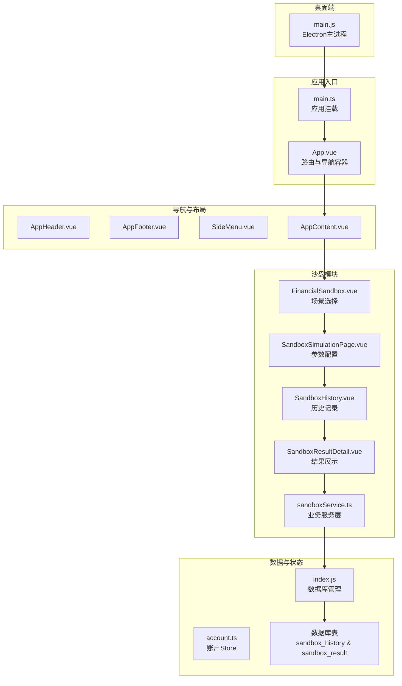
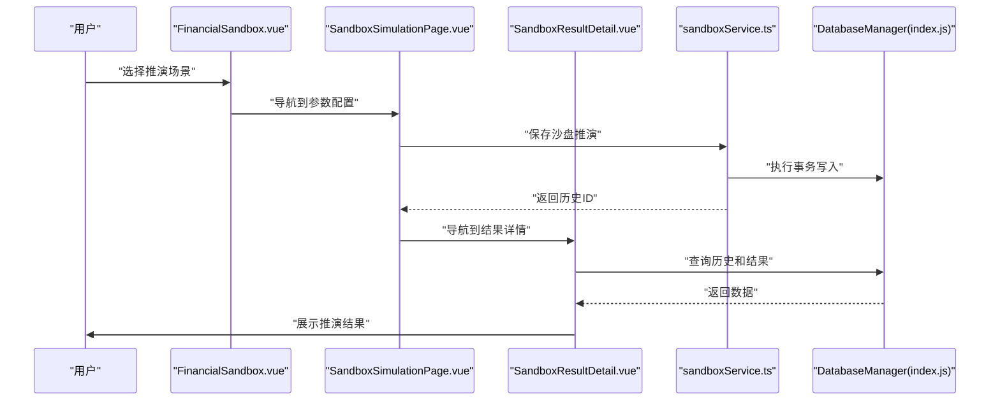
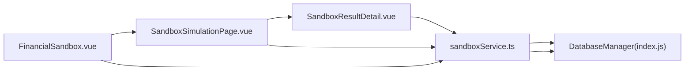

# 财务沙盘

<cite>
**本文引用的文件**
- [FinancialSandbox.vue](file://src/components/mobile/sandbox/FinancialSandbox.vue)
- [SandboxSimulationPage.vue](file://src/components/mobile/sandbox/SandboxSimulationPage.vue)
- [SandboxHistory.vue](file://src/components/mobile/sandbox/SandboxHistory.vue)
- [SandboxResultDetail.vue](file://src/components/mobile/sandbox/SandboxResultDetail.vue)
- [sandboxService.ts](file://src/services/sandbox/sandboxService.ts)
- [App.vue](file://src/App.vue)
- [main.ts](file://src/main.ts)
- [FinancialDashboard.vue](file://src/components/mobile/dashboard/FinancialDashboard.vue)
- [FinancialGoal.vue](file://src/components/mobile/goal/FinancialGoal.vue)
- [FinancialKnowledge.vue](file://src/components/mobile/knowledge/FinancialKnowledge.vue)
- [index.js](file://src/database/index.js)
- [account.ts](file://src/stores/account.ts)
- [AppHeader.vue](file://src/components/common/AppHeader.vue)
- [AppFooter.vue](file://src/components/common/AppFooter.vue)
- [SideMenu.vue](file://src/components/common/SideMenu.vue)
- [AppContent.vue](file://src/components/common/AppContent.vue)
- [main.js](file://electron/main.js)
- [package.json](file://package.json)
</cite>

## 更新摘要
**变更内容**
- 重大架构重构：从单一组件FinancialSandbox.vue重构为模块化架构
- 新增三个专门组件：SandboxSimulationPage、SandboxHistory、SandboxResultDetail
- 新增sandboxService服务层，提供完整的沙盘业务逻辑
- 新增数据库表结构：sandbox_history和sandbox_result表
- 路由系统全面升级，支持参数化导航
- 实现完整的沙盘推演计算引擎和数据持久化

## 目录
1. [简介](#简介)
2. [项目结构](#项目结构)
3. [核心组件](#核心组件)
4. [架构总览](#架构总览)
5. [详细组件分析](#详细组件分析)
6. [服务层设计](#服务层设计)
7. [数据库架构](#数据库架构)
8. [路由系统](#路由系统)
9. [依赖关系分析](#依赖关系分析)
10. [性能考量](#性能考量)
11. [故障排查指南](#故障排查指南)
12. [结论](#结论)
13. [附录](#附录)

## 简介
本文档详细介绍财务沙盘功能的重大架构重构，从单一组件模式升级为模块化架构。财务沙盘旨在提供一个安全、可交互的模拟投资与财务规划环境，现已实现完整的推演计算引擎、数据持久化和用户界面。

重构后的财务沙盘包含以下核心功能：
- **模块化架构**：拆分为沙盘场景选择、参数配置、历史记录、结果展示四个独立组件
- **完整推演引擎**：支持14种财务场景的参数化模拟推演
- **数据持久化**：完整的沙盘历史和结果数据存储
- **实时图表展示**：基于ECharts的动态趋势图表
- **安全隔离**：完全隔离真实财务数据，确保生产环境安全

## 项目结构
重构后的财务沙盘采用模块化架构，位于`src/components/mobile/sandbox/`目录下，包含四个核心组件和一个服务层：



**图示来源**
- [main.ts:1-185](file://src/main.ts#L1-L185)
- [App.vue:65-89](file://src/App.vue#L65-L89)
- [FinancialSandbox.vue:1-121](file://src/components/mobile/sandbox/FinancialSandbox.vue#L1-L121)
- [SandboxSimulationPage.vue:1-154](file://src/components/mobile/sandbox/SandboxSimulationPage.vue#L1-L154)
- [SandboxHistory.vue:1-145](file://src/components/mobile/sandbox/SandboxHistory.vue#L1-L145)
- [SandboxResultDetail.vue:1-323](file://src/components/mobile/sandbox/SandboxResultDetail.vue#L1-L323)
- [sandboxService.ts:1-722](file://src/services/sandbox/sandboxService.ts#L1-L722)

## 核心组件
重构后的财务沙盘包含四个核心组件，每个组件都有明确的职责分工：

### 场景选择组件（FinancialSandbox.vue）
- **功能**：提供14种财务推演场景的选择界面
- **特性**：网格布局、图标展示、场景描述、浮动操作按钮
- **交互**：点击场景进入参数配置页面，历史记录按钮跳转历史页面

### 参数配置组件（SandboxSimulationPage.vue）
- **功能**：根据场景类型动态生成参数配置表单
- **特性**：支持开关、数字、下拉选择、文本输入等多种参数类型
- **交互**：参数验证、默认值填充、推演计算、结果导航

### 历史记录组件（SandboxHistory.vue）
- **功能**：展示用户的沙盘推演历史记录
- **特性**：列表展示、查看详情、软删除、新建推演
- **交互**：加载历史数据、删除确认、导航到详情页

### 结果展示组件（SandboxResultDetail.vue）
- **功能**：详细展示单次推演的结果和分析
- **特性**：核心指标卡片、趋势图表、参数详情、文字分析、推演结论
- **交互**：动态图表渲染、数据格式化、颜色分级显示

**章节来源**
- [FinancialSandbox.vue:1-121](file://src/components/mobile/sandbox/FinancialSandbox.vue#L1-L121)
- [SandboxSimulationPage.vue:1-154](file://src/components/mobile/sandbox/SandboxSimulationPage.vue#L1-L154)
- [SandboxHistory.vue:1-145](file://src/components/mobile/sandbox/SandboxHistory.vue#L1-L145)
- [SandboxResultDetail.vue:1-323](file://src/components/mobile/sandbox/SandboxResultDetail.vue#L1-L323)

## 架构总览
重构后的财务沙盘采用清晰的分层架构，实现了关注点分离：



**图示来源**
- [FinancialSandbox.vue:49-51](file://src/components/mobile/sandbox/FinancialSandbox.vue#L49-L51)
- [SandboxSimulationPage.vue:100-112](file://src/components/mobile/sandbox/SandboxSimulationPage.vue#L100-L112)
- [SandboxResultDetail.vue:166-181](file://src/components/mobile/sandbox/SandboxResultDetail.vue#L166-L181)
- [sandboxService.ts:698-721](file://src/services/sandbox/sandboxService.ts#L698-L721)

## 详细组件分析

### 场景选择组件（FinancialSandbox.vue）
该组件负责提供用户友好的场景选择界面，支持14种不同的财务推演场景。

**核心功能**
- 场景网格展示：2x7网格布局，每个场景包含图标、名称和描述
- 动态图标映射：根据场景类型动态选择Element Plus图标
- 浮动操作菜单：提供历史记录入口
- 导航事件：emit导航事件到父组件

**数据结构**
- 场景定义：包含场景类型、名称、描述、图标、参数模式
- 参数模式：支持switch、number、select、text四种类型
- 默认值：每种参数都有合理的默认值

**章节来源**
- [FinancialSandbox.vue:26-51](file://src/components/mobile/sandbox/FinancialSandbox.vue#L26-L51)
- [FinancialSandbox.vue:53-59](file://src/components/mobile/sandbox/FinancialSandbox.vue#L53-L59)

### 参数配置组件（SandboxSimulationPage.vue）
该组件根据选择的场景动态生成参数配置表单，并处理推演计算。

**核心功能**
- 动态表单生成：根据场景参数模式自动生成表单控件
- 参数验证：支持最小值、最大值、步长等验证规则
- 计算执行：调用服务层进行沙盘推演计算
- 导航处理：成功后跳转到结果详情页面

**表单控件**
- 开关控件：用于布尔值参数（如保留被动收入）
- 数字输入：支持范围限制和步长设置
- 下拉选择：用于枚举值参数（如推演周期）
- 文本输入：用于自由文本参数

**章节来源**
- [SandboxSimulationPage.vue:61-94](file://src/components/mobile/sandbox/SandboxSimulationPage.vue#L61-L94)
- [SandboxSimulationPage.vue:100-112](file://src/components/mobile/sandbox/SandboxSimulationPage.vue#L100-L112)

### 历史记录组件（SandboxHistory.vue）
该组件提供沙盘推演历史的管理和查看功能。

**核心功能**
- 历史列表：展示所有推演记录，包括场景名称、时间、简要描述
- 查看详情：点击记录跳转到结果详情页面
- 删除管理：支持软删除历史记录
- 新建入口：提供快速新建推演的按钮

**数据展示**
- 记录卡片：每个历史记录显示为独立卡片
- 时间格式：标准化的时间显示格式
- 空状态：无记录时显示空状态提示

**章节来源**
- [SandboxHistory.vue:34-77](file://src/components/mobile/sandbox/SandboxHistory.vue#L34-L77)

### 结果展示组件（SandboxResultDetail.vue）
该组件负责详细展示单次沙盘推演的结果和分析。

**核心功能**
- 指标卡片：展示净资产、月现金流、可维持月数等核心指标
- 趋势图表：基于ECharts展示净资产、现金流、负债趋势
- 参数详情：显示推演时使用的具体参数
- 分析报告：提供详细的财务分析和结论建议

**图表设计**
- 多系列图表：同时展示净资产、现金流、负债三条曲线
- 动态缩放：支持数据格式化和单位转换
- 颜色编码：正负值使用不同颜色标识
- 响应式设计：适配不同屏幕尺寸

**章节来源**
- [SandboxResultDetail.vue:99-181](file://src/components/mobile/sandbox/SandboxResultDetail.vue#L99-L181)
- [SandboxResultDetail.vue:187-215](file://src/components/mobile/sandbox/SandboxResultDetail.vue#L187-L215)

## 服务层设计
新增的sandboxService.ts提供了完整的沙盘业务逻辑，包含场景定义、数据加载、计算引擎和数据持久化。

### 场景定义系统
服务层定义了14种财务推演场景，每种场景都有详细的参数模式和计算逻辑：

**场景类型**
- 失业维持时长推演：评估失业后的生存能力
- 债务利率上涨推演：分析利率上升对还款压力的影响
- 股票/基金下跌推演：评估投资组合下跌的影响
- 每月多存推演：测试定期储蓄的效果
- 提前还清负债推演：分析提前还款的收益
- 收入上涨/下降推演：评估收入变化的影响
- 大额一次性支出推演：分析大额支出的财务影响
- 投资变现推演：评估投资变现的后果
- 新增负债推演：分析新增负债的成本
- 应急金不足推演：评估应急资金缺口
- 投资亏损推演：分析投资损失的恢复
- 固定支出增加推演：评估支出增加的影响
- 被动收入增加推演：分析被动收入增长的效果

**章节来源**
- [sandboxService.ts:57-155](file://src/services/sandbox/sandboxService.ts#L57-L155)

### 计算引擎
服务层实现了完整的沙盘推演计算引擎，包含多种财务计算函数：

**核心计算函数**
- 负债压力评估：基于负债收入比评估财务压力等级
- 等额本息计算：计算房贷等额本息月供
- 总利息计算：计算贷款总利息支出
- 现金流分析：分析月度现金流变化
- 投资回报计算：评估投资收益和损失

**推演算法**
- 场景特定算法：每种场景都有专门的计算逻辑
- 时间序列分析：支持多月度的时间序列推演
- 风险评估：提供风险等级和压力分析
- 结论生成：自动生成推演结论和建议

**章节来源**
- [sandboxService.ts:248-276](file://src/services/sandbox/sandboxService.ts#L248-L276)
- [sandboxService.ts:279-696](file://src/services/sandbox/sandboxService.ts#L279-L696)

### 数据持久化
服务层提供了完整的数据持久化功能，确保推演结果的安全存储：

**事务处理**
- 历史记录存储：推演历史信息的存储
- 结果数据存储：推演结果的详细数据存储
- 事务保证：使用数据库事务确保数据一致性
- 索引优化：为查询性能优化创建索引

**数据结构**
- 历史表结构：包含场景类型、参数、时间戳等信息
- 结果表结构：包含指标数据、图表数据、分析结论等
- 外键关系：历史记录和结果数据的关联关系

**章节来源**
- [sandboxService.ts:161-180](file://src/services/sandbox/sandboxService.ts#L161-L180)
- [sandboxService.ts:698-721](file://src/services/sandbox/sandboxService.ts#L698-L721)

## 数据库架构
重构后的财务沙盘引入了两个专门的数据库表来存储沙盘推演数据。

### 表结构设计

**sandbox_history表**
| 字段名 | 类型 | 约束 | 描述 |
|--------|------|------|------|
| id | VARCHAR(64) | 主键 | 历史记录唯一标识 |
| scene_type | INTEGER | NOT NULL | 场景类型编号 |
| scene_name | VARCHAR(64) | NOT NULL | 场景名称 |
| user_title | VARCHAR(100) |  | 用户自定义标题 |
| simulate_time | VARCHAR(20) | NOT NULL | 推演时间戳 |
| params | TEXT | NOT NULL | 参数JSON字符串 |
| result_desc | VARCHAR(255) |  | 结果简要描述 |
| created_at | VARCHAR(20) | NOT NULL | 创建时间 |
| is_deleted | INTEGER | DEFAULT 0 NOT NULL | 删除标记 |
| remark | VARCHAR(255) |  | 备注信息 |

**sandbox_result表**
| 字段名 | 类型 | 约束 | 描述 |
|--------|------|------|------|
| id | INTEGER | 主键自增 | 结果记录ID |
| history_id | INTEGER | NOT NULL | 关联的历史记录ID |
| net_assets | DECIMAL(16,2) |  | 净资产最终值 |
| net_assets_change | TEXT |  | 净资产变化描述 |
| cash_flow_monthly | DECIMAL(16,2) |  | 月现金流 |
| cash_flow_change | TEXT |  | 现金流变化描述 |
| debt_pressure_level | INTEGER |  | 负债压力等级 |
| debt_pressure_desc | TEXT |  | 负债压力描述 |
| survival_months | INTEGER |  | 可维持月数 |
| interest_save | DECIMAL(16,2) |  | 节省利息 |
| monthly_payment_change | DECIMAL(16,2) |  | 月供变化 |
| total_interest_change | DECIMAL(16,2) |  | 总利息变化 |
| chart_x | TEXT | NOT NULL | X轴数据（JSON） |
| chart_net_assets | TEXT | NOT NULL | 净资产数据（JSON） |
| chart_cash_flow | TEXT | NOT NULL | 现金流数据（JSON） |
| chart_debt | TEXT | NOT NULL | 负债数据（JSON） |
| conclusion | TEXT | NOT NULL | 推演结论 |
| created_at | VARCHAR(20) | NOT NULL | 创建时间 |

**索引设计**
- sandbox_history表：scene_type、is_deleted索引
- sandbox_result表：history_id索引

**章节来源**
- [index.js:760-801](file://src/database/index.js#L760-L801)
- [index.js:822-824](file://src/database/index.js#L822-L824)

## 路由系统
重构后的财务沙盘采用了全新的参数化路由系统，支持复杂的页面导航和参数传递。

### 组件映射
App.vue中定义了完整的组件映射表：

```javascript
const componentMap: Record<string, any> = {
  // ... 其他组件映射 ...
  sandbox: FinancialSandbox,
  sandboxSimulation: SandboxSimulationPage,
  sandboxHistory: SandboxHistory,
  sandboxResultDetail: SandboxResultDetail,
  // ... 其他组件映射 ...
}
```

### 参数传递机制
路由系统支持两种导航方式：

**简单导航**
```javascript
// 直接导航到组件
emit('navigate', 'sandboxHistory')
```

**参数化导航**
```javascript
// 带参数导航
emit('navigate', { 
  key: 'sandboxSimulation', 
  params: { sceneType: 1 } 
})
```

**参数解析**
main.ts中的`appComponentProps`函数负责解析传入的参数：

```typescript
// 为沙盘推演页面传递sceneType参数
if (key === 'sandboxSimulation' && params.sceneType) {
  props.sceneType = params.sceneType;
}

// 为沙盘结果详情页面传递historyId参数
if (key === 'sandboxResultDetail' && params.historyId) {
  props.historyId = params.historyId;
}
```

**章节来源**
- [App.vue:75-192](file://src/App.vue#L75-L192)
- [main.ts:62-182](file://src/main.ts#L62-L182)

## 依赖关系分析
重构后的财务沙盘具有清晰的依赖关系，实现了良好的关注点分离。

### 前端架构依赖
- **Vue 3 + TypeScript**：提供类型安全的组件开发
- **Element Plus**：提供丰富的UI组件库
- **ECharts**：提供专业的数据可视化图表
- **Day.js**：提供轻量级日期处理库

### 服务层依赖
- **数据库抽象层**：统一的数据库访问接口
- **财务计算库**：专业的财务计算函数
- **参数验证**：表单参数的验证和处理

### 组件间依赖


**图示来源**
- [FinancialSandbox.vue:35](file://src/components/mobile/sandbox/FinancialSandbox.vue#L35)
- [SandboxSimulationPage.vue:69](file://src/components/mobile/sandbox/SandboxSimulationPage.vue#L69)
- [SandboxResultDetail.vue:103](file://src/components/mobile/sandbox/SandboxResultDetail.vue#L103)
- [sandboxService.ts:1](file://src/services/sandbox/sandboxService.ts#L1)

**章节来源**
- [package.json:19-36](file://package.json#L19-L36)

## 性能考量
重构后的财务沙盘在性能方面进行了多项优化：

### 数据库性能
- **事务优化**：使用数据库事务确保数据一致性，减少多次提交的开销
- **索引优化**：为常用查询字段创建索引，提升查询性能
- **批量操作**：支持批量SQL执行，减少数据库往返次数
- **连接池管理**：单例模式管理数据库连接，避免重复连接

### 前端性能
- **组件懒加载**：按需加载组件，减少初始包大小
- **图表优化**：ECharts图表按需初始化，避免不必要的渲染
- **数据缓存**：查询结果缓存，减少重复查询
- **虚拟滚动**：历史记录列表使用虚拟滚动，提升大数据量下的性能

### 计算性能
- **算法优化**：财务计算使用高效的数学算法
- **数据结构优化**：使用合适的数据结构存储中间结果
- **异步处理**：长时间计算使用异步处理，避免阻塞UI线程

## 故障排查指南
针对重构后的财务沙盘，提供以下故障排查指南：

### 组件导航问题
**症状**：点击场景无响应或导航错误
**排查步骤**：
1. 检查组件映射是否正确配置
2. 验证导航事件是否正确发出
3. 确认参数传递是否正确
4. 检查路由系统是否正常工作

**章节来源**
- [App.vue:194-201](file://src/App.vue#L194-L201)
- [main.ts:95-110](file://src/main.ts#L95-L110)

### 数据库连接问题
**症状**：推演结果无法保存或历史记录为空
**排查步骤**：
1. 检查数据库初始化是否成功
2. 验证表结构是否正确创建
3. 确认事务执行是否成功
4. 检查索引是否正确创建

**章节来源**
- [index.js:831-858](file://src/database/index.js#L831-L858)
- [sandboxService.ts:698-721](file://src/services/sandbox/sandboxService.ts#L698-L721)

### 图表渲染问题
**症状**：结果页面图表不显示或显示异常
**排查步骤**：
1. 检查ECharts库是否正确引入
2. 验证图表容器是否正确初始化
3. 确认数据格式是否正确
4. 检查图表配置选项

**章节来源**
- [SandboxResultDetail.vue:187-215](file://src/components/mobile/sandbox/SandboxResultDetail.vue#L187-L215)

### 计算引擎问题
**症状**：推演计算失败或结果异常
**排查步骤**：
1. 检查财务数据加载是否成功
2. 验证场景参数是否有效
3. 确认计算函数是否正确执行
4. 检查数据类型转换是否正确

**章节来源**
- [sandboxService.ts:182-246](file://src/services/sandbox/sandboxService.ts#L182-L246)
- [sandboxService.ts:279-696](file://src/services/sandbox/sandboxService.ts#L279-L696)

## 结论
财务沙盘的架构重构取得了显著成果：

### 技术成就
- **模块化架构**：实现了清晰的关注点分离，提升了代码可维护性
- **完整功能实现**：从场景选择到结果展示的完整推演流程
- **数据持久化**：建立了完整的数据存储和查询机制
- **用户体验优化**：提供了直观易用的交互界面

### 架构优势
- **可扩展性**：新增场景类型只需修改服务层定义
- **可维护性**：组件职责明确，便于单独测试和维护
- **性能优化**：数据库索引、事务处理、图表优化等多重优化
- **安全性**：完全隔离真实财务数据，确保生产环境安全

### 未来发展
建议在现有基础上继续完善：
- **多人协作**：支持团队共享推演结果
- **专家指导**：集成财务专家的分析建议
- **实盘对接**：与真实交易账户的对接能力
- **机器学习**：基于历史数据的智能推荐

## 附录

### 沙盘场景详细说明
重构后的财务沙盘支持14种财务推演场景，每种场景都有特定的适用场景和分析价值。

### 数据库迁移指南
从旧版本升级到新版本时，需要执行以下数据库迁移步骤：
1. 创建sandbox_history表
2. 创建sandbox_result表
3. 创建必要的索引
4. 验证表结构完整性

### API接口规范
服务层提供了标准的API接口，包括：
- 场景定义查询
- 推演计算执行
- 历史数据查询
- 结果数据管理

### 最佳实践建议
- **参数验证**：在客户端和服务端都要进行参数验证
- **错误处理**：提供友好的错误提示和重试机制
- **性能监控**：监控关键操作的执行时间和资源使用
- **安全审计**：记录重要的用户操作和系统事件