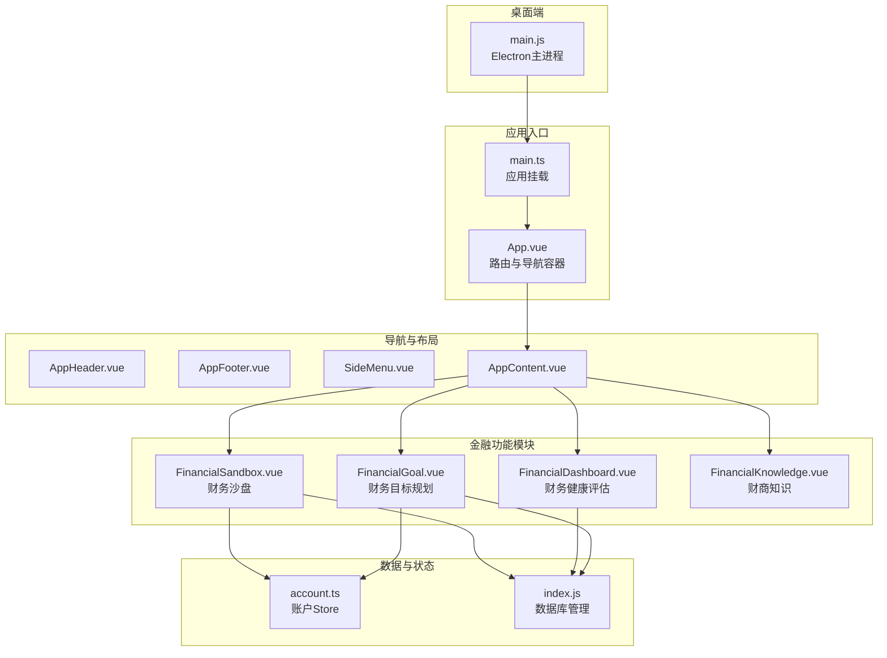
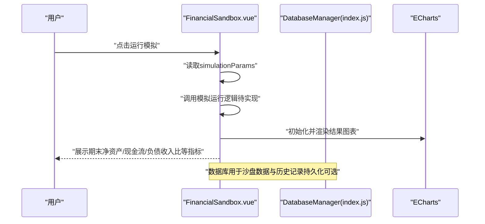
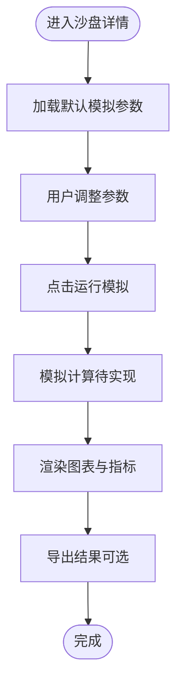
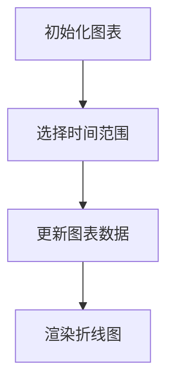
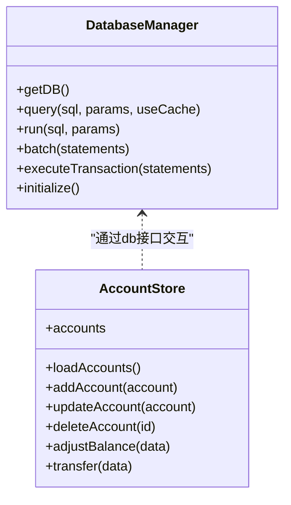
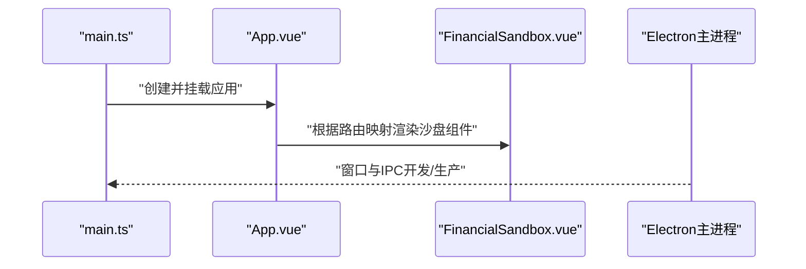
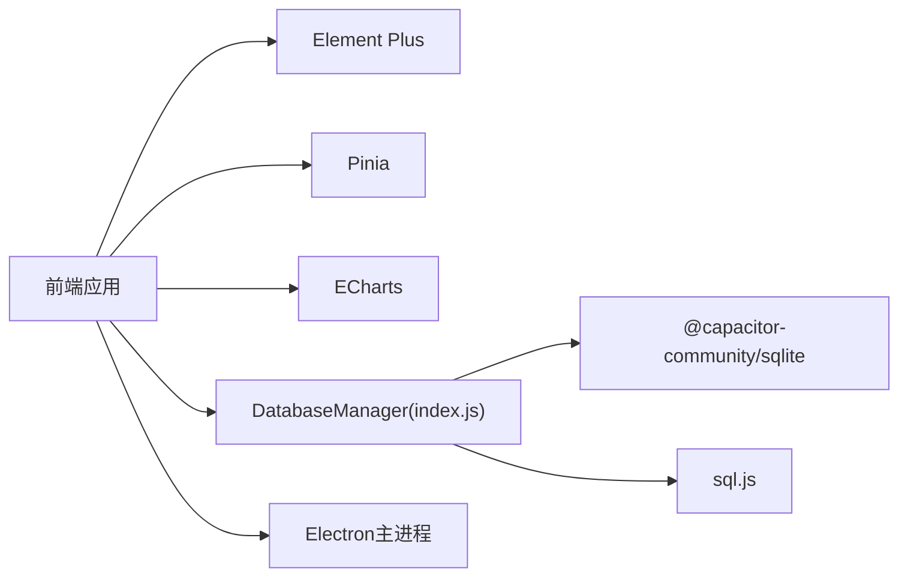

# 财务沙盘

<cite>
**本文引用的文件**
- [FinancialSandbox.vue](file://src/components/mobile/sandbox/FinancialSandbox.vue)
- [App.vue](file://src/App.vue)
- [main.ts](file://src/main.ts)
- [FinancialDashboard.vue](file://src/components/mobile/dashboard/FinancialDashboard.vue)
- [FinancialGoal.vue](file://src/components/mobile/goal/FinancialGoal.vue)
- [FinancialKnowledge.vue](file://src/components/mobile/knowledge/FinancialKnowledge.vue)
- [index.js](file://src/database/index.js)
- [account.ts](file://src/stores/account.ts)
- [AppHeader.vue](file://src/components/common/AppHeader.vue)
- [AppFooter.vue](file://src/components/common/AppFooter.vue)
- [SideMenu.vue](file://src/components/common/SideMenu.vue)
- [AppContent.vue](file://src/components/common/AppContent.vue)
- [main.js](file://electron/main.js)
- [package.json](file://package.json)
</cite>

## 更新摘要
**变更内容**
- 组件目录结构重组：从 `mobile/financial/` 重命名为 `mobile/sandbox/`
- 更新了 FinancialSandbox.vue 的 import 路径
- 更新了 App.vue 和 main.ts 中的组件导入路径
- 保持了原有功能和架构不变

## 目录
1. [简介](#简介)
2. [项目结构](#项目结构)
3. [核心组件](#核心组件)
4. [架构总览](#架构总览)
5. [详细组件分析](#详细组件分析)
6. [依赖关系分析](#依赖关系分析)
7. [性能考量](#性能考量)
8. [故障排查指南](#故障排查指南)
9. [结论](#结论)
10. [附录](#附录)

## 简介
本文件面向"财务沙盘"功能，系统化梳理其在当前代码库中的实现现状与扩展方向。财务沙盘旨在提供一个安全、可交互的模拟投资与财务规划环境，支持：
- 模拟投资环境搭建：沙盘创建、情景预设、参数化模拟、结果可视化
- 风险评估工具：基于健康指标的组合分析与趋势展示
- 收益预测功能：参数驱动的模拟运行与结果导出
- 游戏化设计：通过积分、成就、排行榜等机制提升参与度（概念性建议）
- 策略对比：多情景对比，辅助用户理解不同理财方法
- 安全机制：隔离真实财务数据，保障生产环境安全
- 开发者扩展：多人协作、专家指导、实盘对接等能力的演进路径

当前仓库中，财务沙盘以组件形式存在，具备基础的UI交互与图表展示，但核心的模拟引擎、风险评估与收益预测算法尚未实现，数据库层已具备完善的SQLite抽象与表结构。

## 项目结构
该应用采用Vue 3 + Vite + Pinia + Element Plus 的移动端前端架构，配合Capacitor与Electron用于跨平台与桌面端分发。财务沙盘位于移动端沙盘模块下，作为独立页面组件接入整体导航体系。

**图示来源**
- [main.ts:1-169](file://src/main.ts#L1-L169)
- [App.vue:65-89](file://src/App.vue#L65-L89)
- [FinancialSandbox.vue:1-363](file://src/components/mobile/sandbox/FinancialSandbox.vue#L1-L363)
- [FinancialDashboard.vue:1-813](file://src/components/mobile/dashboard/FinancialDashboard.vue#L1-L813)
- [FinancialGoal.vue:1-281](file://src/components/mobile/goal/FinancialGoal.vue#L1-L281)
- [FinancialKnowledge.vue:1-275](file://src/components/mobile/knowledge/FinancialKnowledge.vue#L1-L275)
- [account.ts:1-273](file://src/stores/account.ts#L1-L273)
- [index.js:1-935](file://src/database/index.js#L1-L935)
- [main.js:1-70](file://electron/main.js#L1-L70)

**章节来源**
- [main.ts:1-169](file://src/main.ts#L1-L169)
- [App.vue:65-89](file://src/App.vue#L65-L89)
- [package.json:1-72](file://package.json#L1-L72)

## 核心组件
- 财务沙盘（FinancialSandbox.vue）
  - 功能：沙盘列表、创建/打开/同步/删除；参数化模拟运行；结果可视化与导出
  - 当前实现：UI交互与ECharts图表展示，模拟数据与占位逻辑
- 财务健康评估（FinancialDashboard.vue）
  - 功能：健康指标展示与趋势图
  - 当前实现：静态指标与折线图
- 财务目标规划（FinancialGoal.vue）
  - 功能：目标创建、编辑、投入记录与关联账户
  - 当前实现：模拟数据与对话框交互
- 数据库与账户（index.js, account.ts）
  - 功能：统一数据库连接、建表、事务、查询与账户状态管理
  - 当前实现：完整的SQLite抽象与表结构初始化

**章节来源**
- [FinancialSandbox.vue:1-363](file://src/components/mobile/sandbox/FinancialSandbox.vue#L1-L363)
- [FinancialDashboard.vue:1-813](file://src/components/mobile/dashboard/FinancialDashboard.vue#L1-L813)
- [FinancialGoal.vue:1-281](file://src/components/mobile/goal/FinancialGoal.vue#L1-L281)
- [index.js:418-776](file://src/database/index.js#L418-L776)
- [account.ts:34-271](file://src/stores/account.ts#L34-L271)

## 架构总览
财务沙盘的运行链路由"界面交互 -> 参数收集 -> 模拟引擎（待实现） -> 结果计算 -> 图表渲染 -> 数据持久化（可选）"构成。当前实现中，模拟引擎与风险/收益算法尚未落地，数据库层已完备，可作为未来扩展的基础。

**图示来源**
- [FinancialSandbox.vue:219-270](file://src/components/mobile/sandbox/FinancialSandbox.vue#L219-L270)
- [index.js:199-309](file://src/database/index.js#L199-L309)

## 详细组件分析

### 财务沙盘组件（FinancialSandbox.vue）
- 角色定位：财务沙盘的主界面，负责沙盘生命周期管理与模拟运行
- 关键流程
  - 列表与创建：沙盘列表展示、创建对话框、预设情景选择、周期设定
  - 打开与参数：打开沙盘后加载默认参数，支持主动/被动收入、固定支出、股票市值、负债利率等参数调节
  - 运行模拟：触发模拟运行（当前为占位），生成结果并渲染图表
  - 结果展示：网格化展示关键指标，ECharts展示净资产与现金流趋势
  - 同步与删除：模拟沙盘数据同步与删除
  - 导出：模拟结果导出
- 数据与状态
  - 本地响应式状态：沙盘列表、当前沙盘、对话框可见性、模拟参数、模拟结果、图表实例
  - 图表：ECharts初始化与选项配置
- 安全与隔离
  - 当前为纯前端交互，未涉及真实账户数据；建议在模拟引擎实现时严格限定作用域，避免访问真实账户与交易接口

**图示来源**
- [FinancialSandbox.vue:195-270](file://src/components/mobile/sandbox/FinancialSandbox.vue#L195-L270)

**章节来源**
- [FinancialSandbox.vue:1-363](file://src/components/mobile/sandbox/FinancialSandbox.vue#L1-L363)

### 财务健康评估（FinancialDashboard.vue）
- 角色定位：提供财务健康指标概览与趋势分析
- 关键点
  - 指标：负债收入比、应急金充足率、资产负债率、储蓄率、净资产增长率、总评分
  - 趋势：按月/季/年切换时间范围，折线图展示净资产增长率
  - 状态：根据阈值判断健康等级（优秀/良好/待提升/预警/危险）

**图示来源**
- [FinancialDashboard.vue:514-595](file://src/components/mobile/dashboard/FinancialDashboard.vue#L514-L595)

**章节来源**
- [FinancialDashboard.vue:1-813](file://src/components/mobile/dashboard/FinancialDashboard.vue#L1-L813)

### 财务目标规划（FinancialGoal.vue）
- 角色定位：目标驱动型沙盘策略的重要前置条件
- 关键点
  - 目标类型：储蓄类、还款类、投资类、应急金类
  - 自动计算：目标金额与期限联动计算月均投入
  - 关联账户：目标与账户绑定，便于模拟时的资金约束
  - 投入记录：支持记录每次投入金额、日期与备注

**章节来源**
- [FinancialGoal.vue:1-281](file://src/components/mobile/goal/FinancialGoal.vue#L1-L281)

### 数据与状态（DatabaseManager, Account Store）
- DatabaseManager（index.js）
  - 单例连接：Capacitor SQLite（原生）与 sql.js（Web）双栈适配
  - 表结构：账户、流水、资产、股票、基金、负债、财务目标、健康报告、分类等
  - 事务与批处理：提供事务执行与批量SQL能力
  - 缓存与持久化：查询缓存、Web端延迟持久化至localStorage
- Account Store（account.ts）
  - 账户CRUD、余额调整、内部转账（含事务）
  - 与数据库交互，保证一致性

**图示来源**
- [index.js:21-374](file://src/database/index.js#L21-L374)
- [account.ts:27-271](file://src/stores/account.ts#L27-L271)

**章节来源**
- [index.js:1-935](file://src/database/index.js#L1-L935)
- [account.ts:1-273](file://src/stores/account.ts#L1-L273)

### 应用入口与导航（App.vue, main.ts, Electron）
- main.ts：创建Vue应用、注册Element Plus、Pinia，挂载根组件
- App.vue：组件映射与导航参数传递，将沙盘组件纳入路由体系
- Electron主进程：窗口创建、开发/生产环境加载、IPC示例

**图示来源**
- [main.ts:1-169](file://src/main.ts#L1-L169)
- [App.vue:65-89](file://src/App.vue#L65-L89)
- [main.js:19-55](file://electron/main.js#L19-L55)

**章节来源**
- [main.ts:1-169](file://src/main.ts#L1-L169)
- [App.vue:65-89](file://src/App.vue#L65-L89)
- [main.js:1-70](file://electron/main.js#L1-L70)

## 依赖关系分析
- 前端框架与UI
  - Vue 3、Element Plus、Vue Router（通过App.vue组件映射实现路由）、Pinia（状态管理）
- 图表与可视化
  - ECharts（沙盘结果图表）、Chart.js（已有依赖，可用于其他场景）
- 数据层
  - Capacitor SQLite（原生）、sql.js（Web）、SQL.js（Web端数据库引擎）
- 跨平台
  - Capacitor（移动端）、Electron（桌面端）

**图示来源**
- [package.json:19-36](file://package.json#L19-L36)
- [index.js:8-11](file://src/database/index.js#L8-L11)
- [main.js:5-28](file://electron/main.js#L5-L28)

**章节来源**
- [package.json:1-72](file://package.json#L1-L72)

## 性能考量
- 数据库性能
  - 连接池与单例：避免重复连接，减少资源消耗
  - 查询缓存：对热点查询启用缓存，降低重复查询成本
  - 索引优化：已建立多处索引，建议结合查询模式持续优化
  - 批处理与事务：批量写入与事务提交降低IO次数
- Web端持久化
  - 延迟保存：节流保存到localStorage，避免频繁I/O
- 前端渲染
  - 图表懒渲染：仅在需要时初始化ECharts，减少初始化开销
  - 组件拆分：将复杂图表与交互拆分为子组件，提升可维护性

## 故障排查指南
- 数据库连接问题
  - 症状：初始化失败、查询报错
  - 排查：检查平台判断（原生/Web）、连接状态、异常日志
  - 参考：数据库初始化与连接逻辑
- 查询与事务异常
  - 症状：查询无结果、事务未提交
  - 排查：确认SQL语句、参数绑定、事务边界
- 前端图表不显示
  - 症状：图表空白或不更新
  - 排查：检查容器尺寸、ECharts初始化时机、数据格式
- Electron窗口与IPC
  - 症状：开发环境无法热更新或窗口异常
  - 排查：确认主进程窗口创建与IPC监听

**章节来源**
- [index.js:56-190](file://src/database/index.js#L56-L190)
- [index.js:214-264](file://src/database/index.js#L214-L264)
- [index.js:354-374](file://src/database/index.js#L354-L374)
- [FinancialSandbox.vue:237-270](file://src/components/mobile/sandbox/FinancialSandbox.vue#L237-L270)
- [main.js:19-55](file://electron/main.js#L19-L55)

## 结论
财务沙盘在当前版本中已具备良好的前端交互与图表展示基础，数据库层亦完成了统一抽象与表结构初始化。模拟引擎、风险评估与收益预测算法尚属预留阶段，建议在后续迭代中：
- 实现模拟引擎：参数化模拟、随机扰动、多周期推进
- 集成风险评估：波动性、最大回撤、VaR等指标
- 引入收益预测：历史数据回归、趋势外推、蒙特卡洛模拟
- 游戏化设计：积分、成就、排行榜等激励机制
- 安全隔离：严格限制模拟过程对真实数据的影响
- 扩展能力：多人协作、专家指导、实盘对接

## 附录

### 财务沙盘功能扩展路线图（建议）
- 第一阶段：完善模拟引擎与指标
  - 参数化模拟、随机市场扰动、多情景对比
  - 关键指标：期末净资产、现金流、负债收入比、波动率、最大回撤
- 第二阶段：引入预测与对比
  - 历史数据驱动的趋势预测
  - 多策略对比面板
- 第三阶段：游戏化与社交
  - 积分与成就系统
  - 排行榜与分享
- 第四阶段：生态扩展
  - 多人协作沙盘
  - 专家指导与AI建议
  - 实盘对接与风控