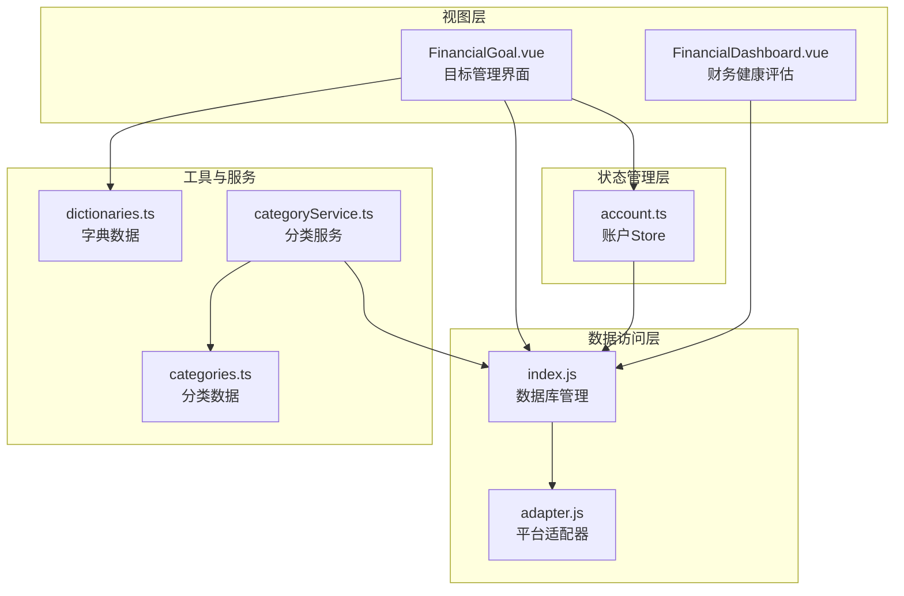
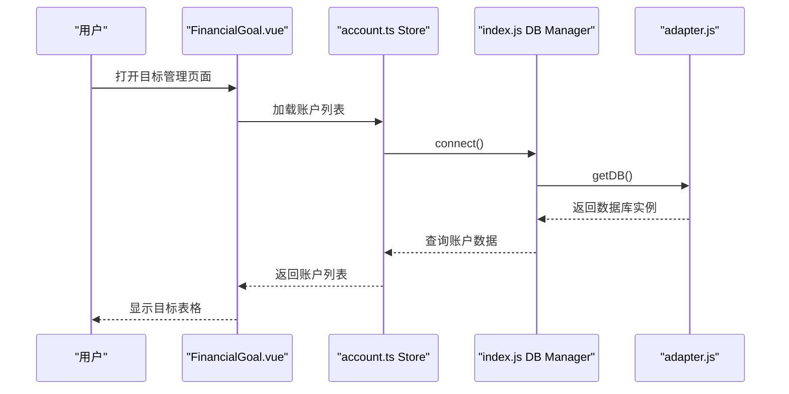
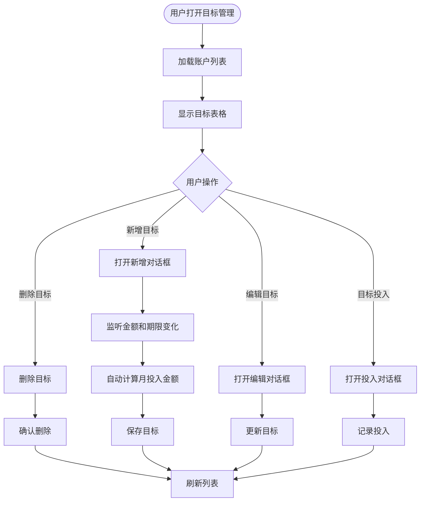
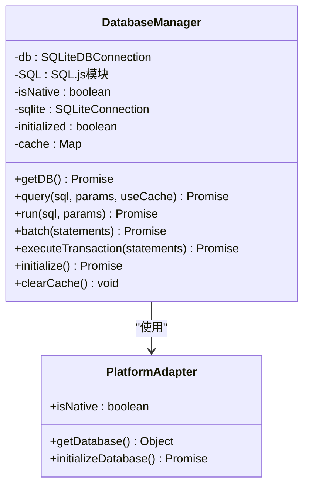
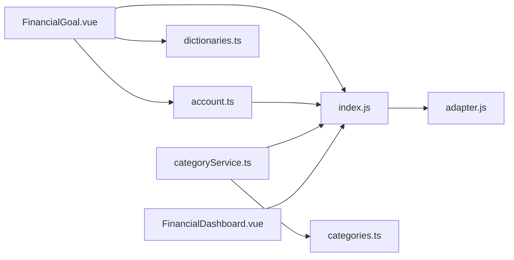

# 财务目标

<cite>
**本文引用的文件**
- [FinancialGoal.vue](file://src/components/mobile/financial/FinancialGoal.vue)
- [index.js](file://src/database/index.js)
- [adapter.js](file://src/database/adapter.js)
- [account.ts](file://src/stores/account.ts)
- [dictionaries.ts](file://src/utils/dictionaries.ts)
- [categories.ts](file://src/data/categories.ts)
- [categoryService.ts](file://src/services/categoryService.ts)
- [FinancialDashboard.vue](file://src/components/mobile/financial/FinancialDashboard.vue)
</cite>

## 目录
1. [简介](#简介)
2. [项目结构](#项目结构)
3. [核心组件](#核心组件)
4. [架构概览](#架构概览)
5. [详细组件分析](#详细组件分析)
6. [依赖关系分析](#依赖关系分析)
7. [性能考虑](#性能考虑)
8. [故障排除指南](#故障排除指南)
9. [结论](#结论)
10. [附录](#附录)

## 简介
本文件全面介绍财务目标管理功能的设计与实现。该功能允许用户设定和跟踪各类财务目标，包括目标类型（短期、中期、长期）、目标金额、完成期限等，并提供进度跟踪、提醒通知、分类管理等能力。当前实现基于Vue 3 + TypeScript + Element Plus + SQLite数据库，支持移动端和Web端部署。

## 项目结构
财务目标功能主要分布在以下模块：
- 视图层：FinancialGoal.vue（目标管理界面）
- 数据层：index.js（数据库管理）、adapter.js（平台适配）
- 状态管理：account.ts（账户Store）
- 工具与字典：dictionaries.ts（目标类型/状态字典）、categories.ts（分类数据）
- 服务层：categoryService.ts（分类服务）
- 辅助组件：FinancialDashboard.vue（财务健康评估）



**图表来源**
- [FinancialGoal.vue:1-288](file://src/components/mobile/financial/FinancialGoal.vue#L1-L288)
- [index.js:1-935](file://src/database/index.js#L1-L935)
- [adapter.js:1-34](file://src/database/adapter.js#L1-L34)
- [account.ts:1-273](file://src/stores/account.ts#L1-L273)
- [dictionaries.ts:1-90](file://src/utils/dictionaries.ts#L1-L90)
- [categories.ts:1-45](file://src/data/categories.ts#L1-L45)
- [categoryService.ts:1-260](file://src/services/categoryService.ts#L1-L260)
- [FinancialDashboard.vue:1-279](file://src/components/mobile/financial/FinancialDashboard.vue#L1-L279)

**章节来源**
- [FinancialGoal.vue:1-288](file://src/components/mobile/financial/FinancialGoal.vue#L1-L288)
- [index.js:1-935](file://src/database/index.js#L1-L935)
- [adapter.js:1-34](file://src/database/adapter.js#L1-L34)
- [account.ts:1-273](file://src/stores/account.ts#L1-L273)
- [dictionaries.ts:1-90](file://src/utils/dictionaries.ts#L1-L90)
- [categories.ts:1-45](file://src/data/categories.ts#L1-L45)
- [categoryService.ts:1-260](file://src/services/categoryService.ts#L1-L260)
- [FinancialDashboard.vue:1-279](file://src/components/mobile/financial/FinancialDashboard.vue#L1-L279)

## 核心组件
财务目标功能的核心组件包括：
- 目标管理界面：提供目标的增删改查、进度跟踪、提醒设置等交互
- 数据库管理：负责SQLite数据库的连接、初始化、CRUD操作
- 账户Store：管理账户数据，为目标关联提供基础数据
- 字典与分类：提供目标类型、状态、分类等枚举数据
- 平台适配器：统一不同平台（原生/Web）的数据库访问

**章节来源**
- [FinancialGoal.vue:142-288](file://src/components/mobile/financial/FinancialGoal.vue#L142-L288)
- [index.js:21-375](file://src/database/index.js#L21-L375)
- [account.ts:27-273](file://src/stores/account.ts#L27-L273)
- [dictionaries.ts:51-65](file://src/utils/dictionaries.ts#L51-L65)

## 架构概览
财务目标系统的整体架构采用分层设计：
- 表现层：Vue组件负责用户交互
- 业务层：Store和服务层处理业务逻辑
- 数据访问层：数据库管理器封装SQLite操作
- 平台抽象层：适配器统一不同运行环境



**图表来源**
- [FinancialGoal.vue:174-178](file://src/components/mobile/financial/FinancialGoal.vue#L174-L178)
- [account.ts:38-53](file://src/stores/account.ts#L38-L53)
- [index.js:56-190](file://src/database/index.js#L56-L190)
- [adapter.js:14-33](file://src/database/adapter.js#L14-L33)

## 详细组件分析

### 目标管理界面（FinancialGoal.vue）
该组件实现了财务目标的核心UI交互，包含以下功能：
- 目标列表展示：显示目标ID、名称、类型、金额、期限、状态等
- 目标创建：通过对话框输入目标基本信息
- 目标编辑：支持修改目标类型、金额、期限、状态等
- 目标投入：记录目标相关的资金投入
- 自动计算：根据目标金额和期限自动计算月投入金额



**图表来源**
- [FinancialGoal.vue:174-288](file://src/components/mobile/financial/FinancialGoal.vue#L174-L288)
- [FinancialGoal.vue:180-184](file://src/components/mobile/financial/FinancialGoal.vue#L180-L184)

**章节来源**
- [FinancialGoal.vue:11-35](file://src/components/mobile/financial/FinancialGoal.vue#L11-L35)
- [FinancialGoal.vue:37-138](file://src/components/mobile/financial/FinancialGoal.vue#L37-L138)
- [FinancialGoal.vue:174-288](file://src/components/mobile/financial/FinancialGoal.vue#L174-L288)

### 数据库管理（index.js）
数据库管理器提供了完整的SQLite操作能力：
- 单例模式：确保全局只有一个数据库连接
- 平台适配：支持Capacitor SQLite（原生）和SQL.js（Web）
- 性能优化：连接池管理、查询缓存、批处理、索引优化
- 安全性：事务支持、参数绑定、错误处理



**图表来源**
- [index.js:21-375](file://src/database/index.js#L21-L375)
- [adapter.js:14-33](file://src/database/adapter.js#L14-L33)

**章节来源**
- [index.js:21-375](file://src/database/index.js#L21-L375)
- [adapter.js:14-33](file://src/database/adapter.js#L14-L33)

### 账户状态管理（account.ts）
账户Store负责账户数据的CRUD操作：
- 账户列表加载：从数据库查询所有账户
- 账户增删改：提供完整的账户生命周期管理
- 余额调整：支持余额调整和流水记录
- 内部转账：支持账户间转账并保证事务一致性

**章节来源**
- [account.ts:27-273](file://src/stores/account.ts#L27-L273)

### 字典与分类系统
系统提供了完善的字典和分类管理：
- 目标类型字典：储蓄类、还款类、投资类、应急金类
- 目标状态字典：未开始、进行中、已完成、已终止
- 分类数据：预定义的收支分类，支持动态扩展
- 分类服务：提供分类的增删改查和默认分类初始化

**章节来源**
- [dictionaries.ts:51-65](file://src/utils/dictionaries.ts#L51-L65)
- [categories.ts:11-45](file://src/data/categories.ts#L11-L45)
- [categoryService.ts:14-69](file://src/services/categoryService.ts#L14-L69)

## 依赖关系分析



**图表来源**
- [FinancialGoal.vue:144](file://src/components/mobile/financial/FinancialGoal.vue#L144)
- [account.ts:6](file://src/stores/account.ts#L6)
- [index.js:8](file://src/database/index.js#L8)
- [adapter.js:5](file://src/database/adapter.js#L5)
- [categoryService.ts:1](file://src/services/categoryService.ts#L1)
- [categories.ts:2](file://src/data/categories.ts#L2)
- [FinancialDashboard.vue:79](file://src/components/mobile/financial/FinancialDashboard.vue#L79)

### 组件耦合度分析
- 视图层与状态层：通过Pinia Store解耦，降低直接依赖
- 数据访问层：统一通过数据库管理器，避免平台差异影响
- 工具层：字典和分类独立管理，便于维护和扩展

**章节来源**
- [FinancialGoal.vue:142-148](file://src/components/mobile/financial/FinancialGoal.vue#L142-L148)
- [account.ts:27-32](file://src/stores/account.ts#L27-L32)
- [index.js:420-776](file://src/database/index.js#L420-L776)

## 性能考虑
数据库管理器采用了多项性能优化策略：
- 连接池管理：单例模式确保连接复用，减少连接开销
- 查询缓存：Map缓存常用查询结果，避免重复查询
- 批处理执行：支持批量SQL语句执行，提高写入效率
- 索引优化：为目标表建立复合索引，加速查询
- Web持久化：SQL.js环境下延迟持久化到localStorage

**章节来源**
- [index.js:12-18](file://src/database/index.js#L12-L18)
- [index.js:200-209](file://src/database/index.js#L200-L209)
- [index.js:316-347](file://src/database/index.js#L316-L347)
- [index.js:686-688](file://src/database/index.js#L686-L688)

## 故障排除指南
### 数据库连接问题
- 检查数据库初始化状态：确保initialize()方法正确执行
- 验证平台适配器：确认getDatabase()返回正确的实现
- 查看连接日志：启用DEBUG模式获取详细的连接信息

### 数据同步问题
- 检查事务执行：确保涉及多表操作的场景使用executeTransaction
- 验证参数绑定：使用位置参数避免SQL注入风险
- 监控缓存清理：执行写操作后及时清除查询缓存

### 性能问题
- 监控查询缓存命中率：评估缓存效果
- 检查索引使用：确保查询条件命中适当索引
- 优化批处理：合理分批执行大量数据操作

**章节来源**
- [index.js:354-374](file://src/database/index.js#L354-L374)
- [index.js:419-419](file://src/database/index.js#L419-L419)
- [index.js:413-415](file://src/database/index.js#L413-L415)

## 结论
财务目标管理功能通过清晰的分层架构和完善的数据库设计，为用户提供了完整的财务目标设定、跟踪和管理能力。当前实现具备良好的扩展性，支持后续的功能增强，如目标模板、批量管理、提醒通知等高级特性。

## 附录

### 财务目标最佳实践
1. **SMART原则应用**
   - 具体性：明确目标金额和用途
   - 可衡量：设定具体的完成标准
   - 可达成：根据收入水平合理设定
   - 相关性：与个人财务状况相符
   - 时限性：设定合理的完成期限

2. **目标分类建议**
   - 短期目标（1年内）：应急金、旅行、购物
   - 中期目标（1-5年）：购车、装修、教育
   - 长期目标（5年以上）：购房、养老、子女教育

3. **进度跟踪要点**
   - 定期记录投入金额
   - 监控完成百分比
   - 预测完成时间
   - 评估剩余金额需求

### 开发者扩展方案
1. **目标模板功能**
   ```javascript
   // 目标模板表结构
   CREATE TABLE financial_goal_templates (
       id TEXT PRIMARY KEY,
       name TEXT NOT NULL,
       type TEXT NOT NULL,
       target_amount REAL NOT NULL,
       period INTEGER NOT NULL,
       monthly_amount REAL NOT NULL,
       category TEXT,
       created_at TIMESTAMP DEFAULT CURRENT_TIMESTAMP
   );
   ```

2. **批量管理功能**
   - 批量导入：支持Excel/CSV格式的目标数据导入
   - 批量编辑：支持同时修改多个目标的状态或属性
   - 批量删除：支持按条件筛选批量删除目标

3. **提醒通知系统**
   - 到期提醒：目标截止日期前的智能提醒
   - 进度提醒：达到里程碑时的通知
   - 超期提醒：超过计划完成时间的警告
   - 进度提醒：月度/季度进度报告

4. **成就系统设计**
   - 完成里程碑：设置不同阶段的成就徽章
   - 连续完成：连续达成目标的额外奖励
   - 类别专长：在特定目标类型上的专业成就
   - 时间管理：快速完成目标的时间成就

5. **高级分析功能**
   - 目标组合分析：多目标间的相互影响
   - 风险评估：目标实现的风险概率
   - 收益预测：目标完成后带来的财务改善
   - 个性化建议：基于历史数据的优化建议

**章节来源**
- [dictionaries.ts:51-65](file://src/utils/dictionaries.ts#L51-L65)
- [FinancialGoal.vue:180-184](file://src/components/mobile/financial/FinancialGoal.vue#L180-L184)