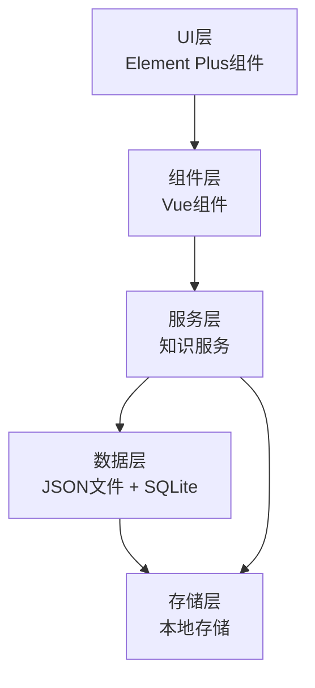
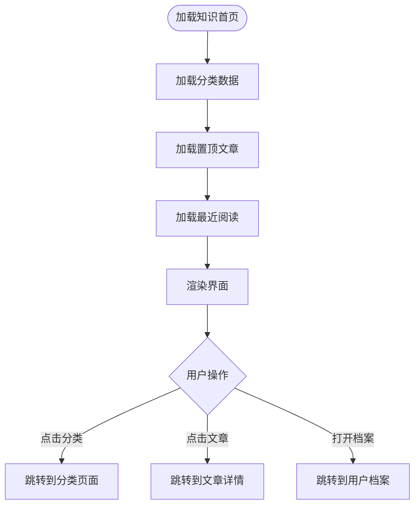
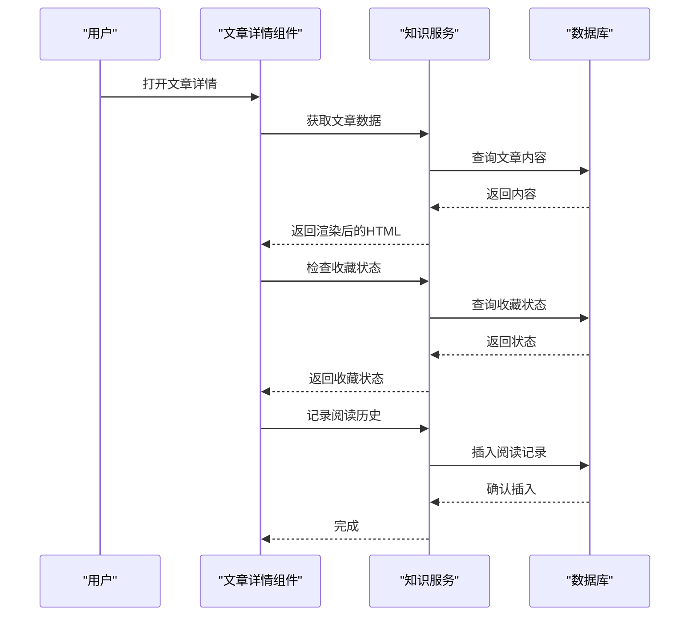
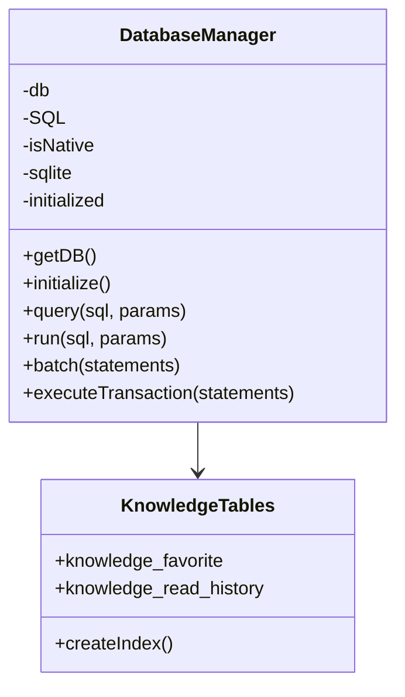
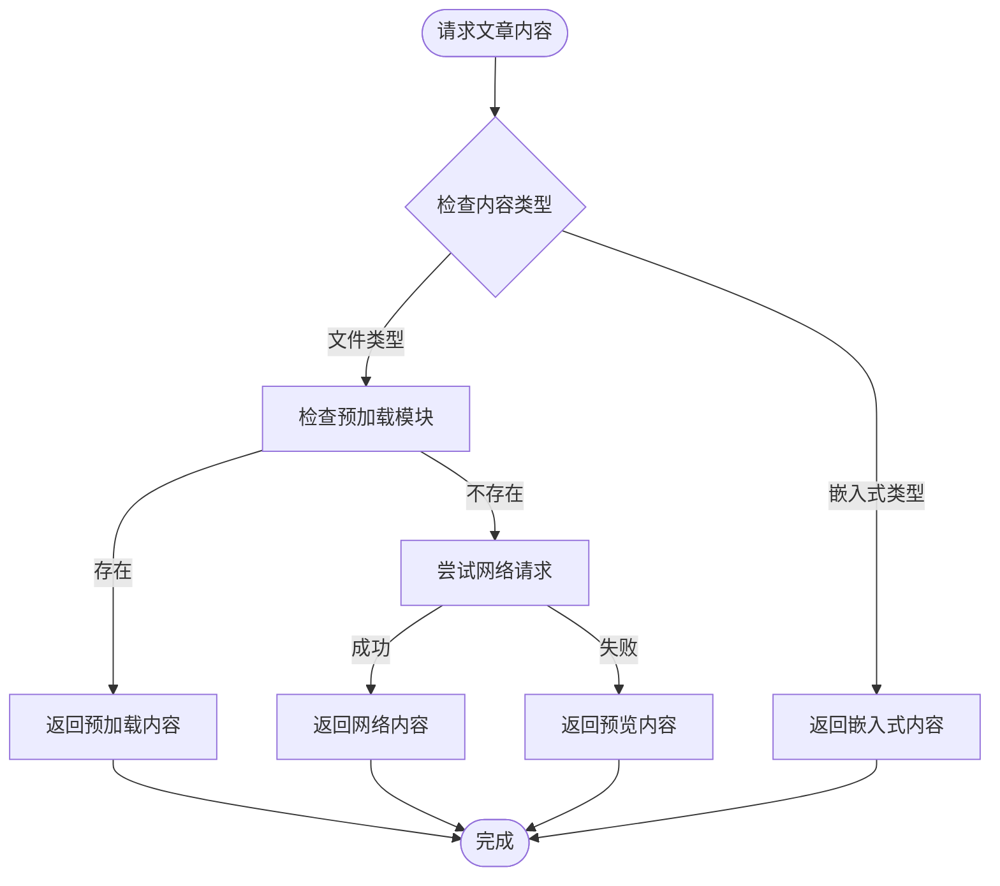

# 财务知识库

<cite>
**本文档引用的文件**
- [App.vue](file://src/App.vue)
- [KnowledgeHome.vue](file://src/components/mobile/knowledge/KnowledgeHome.vue)
- [KnowledgeCategory.vue](file://src/components/mobile/knowledge/KnowledgeCategory.vue)
- [KnowledgeArticle.vue](file://src/components/mobile/knowledge/KnowledgeArticle.vue)
- [KnowledgeProfile.vue](file://src/components/mobile/knowledge/KnowledgeProfile.vue)
- [knowledgeService.ts](file://src/services/knowledge/knowledgeService.ts)
- [articles.json](file://src/assets/knowledge/articles.json)
- [category.json](file://src/assets/knowledge/category.json)
- [index.js](file://src/database/index.js)
- [timezone.ts](file://src/utils/timezone.ts)
- [main.ts](file://src/main.ts)
- [main.js](file://electron/main.js)
- [package.json](file://package.json)
</cite>

## 更新摘要
**所做更改**
- 重构知识模块架构：从单一FinancialKnowledge组件升级为完整的知识生态系统
- 新增四个核心组件：KnowledgeHome、KnowledgeCategory、KnowledgeArticle、KnowledgeProfile
- 新增专门的知识服务层和数据库表结构
- 更新项目结构图和组件关系图
- 完善知识内容的分类体系和展示机制

## 目录
1. [简介](#简介)
2. [项目结构](#项目结构)
3. [核心组件](#核心组件)
4. [架构概览](#架构概览)
5. [详细组件分析](#详细组件分析)
6. [知识服务层](#知识服务层)
7. [数据库设计](#数据库设计)
8. [知识内容管理](#知识内容管理)
9. [用户交互设计](#用户交互设计)
10. [扩展功能规划](#扩展功能规划)
11. [性能考虑](#性能考虑)
12. [故障排除指南](#故障排除指南)
13. [结论](#结论)
14. [附录](#附录)

## 简介
本文件详细介绍重构后的财务知识库功能，这是一个完整的知识生态系统，包含四大核心组件：知识首页、分类浏览、文章详情和用户档案。系统支持Markdown内容渲染、收藏管理、阅读历史追踪、置顶推荐等功能，为用户提供完整的财务知识学习体验。

## 项目结构
重构后的财务知识库采用模块化架构，包含四个核心组件和专门的服务层：

```mermaid
graph TB
subgraph "应用层"
App["App.vue<br/>应用入口与路由分发"]
KH["KnowledgeHome.vue<br/>知识首页"]
KC["KnowledgeCategory.vue<br/>分类页面"]
KA["KnowledgeArticle.vue<br/>文章详情"]
KP["KnowledgeProfile.vue<br/>用户档案"]
end
subgraph "服务层"
KS["knowledgeService.ts<br/>知识服务层"]
end
subgraph "数据层"
ART["articles.json<br/>文章数据"]
CAT["category.json<br/>分类数据"]
DB["database/index.js<br/>数据库管理"]
TZ["timezone.ts<br/>时间工具"]
end
subgraph "运行环境"
VUE["Vue 3 + Element Plus"]
CAP["Capacitor 跨平台"]
ELEC["Electron 打包"]
END
App --> KH
App --> KC
App --> KA
App --> KP
KH --> KS
KC --> KS
KA --> KS
KP --> KS
KS --> ART
KS --> CAT
KS --> DB
KS --> TZ
```

**图表来源**
- [App.vue:111-114](file://src/App.vue#L111-L114)
- [KnowledgeHome.vue:88](file://src/components/mobile/knowledge/KnowledgeHome.vue#L88)
- [KnowledgeCategory.vue:32](file://src/components/mobile/knowledge/KnowledgeCategory.vue#L32)
- [KnowledgeArticle.vue:96](file://src/components/mobile/knowledge/KnowledgeArticle.vue#L96)
- [KnowledgeProfile.vue:78](file://src/components/mobile/knowledge/KnowledgeProfile.vue#L78)
- [knowledgeService.ts:1](file://src/services/knowledge/knowledgeService.ts#L1)

**章节来源**
- [App.vue:111-114](file://src/App.vue#L111-L114)
- [main.ts:13-16](file://src/main.ts#L13-L16)
- [main.js:19-45](file://electron/main.js#L19-L45)

## 核心组件
财务知识库包含四大核心组件，每个组件都有明确的职责分工：

- **KnowledgeHome（知识首页）**：提供知识分类入口、置顶推荐、最近阅读等功能
- **KnowledgeCategory（分类页面）**：展示特定分类下的文章列表，支持已读状态标记
- **KnowledgeArticle（文章详情）**：渲染Markdown内容，支持收藏、分享、上下篇导航
- **KnowledgeProfile（用户档案）**：管理用户收藏和阅读历史，支持清空历史功能

**章节来源**
- [KnowledgeHome.vue:14](file://src/components/mobile/knowledge/KnowledgeHome.vue#L14)
- [KnowledgeCategory.vue:1](file://src/components/mobile/knowledge/KnowledgeCategory.vue#L1)
- [KnowledgeArticle.vue:1](file://src/components/mobile/knowledge/KnowledgeArticle.vue#L1)
- [KnowledgeProfile.vue:1](file://src/components/mobile/knowledge/KnowledgeProfile.vue#L1)

## 架构概览
系统采用"组件层 + 服务层 + 数据层"的三层架构，结合Element Plus提供丰富的UI组件：



**图表来源**
- [KnowledgeHome.vue:146-325](file://src/components/mobile/knowledge/KnowledgeHome.vue#L146-L325)
- [knowledgeService.ts:36-175](file://src/services/knowledge/knowledgeService.ts#L36-L175)
- [index.js:441-866](file://src/database/index.js#L441-L866)

## 详细组件分析

### KnowledgeHome（知识首页）
知识首页作为整个知识系统的入口，提供以下核心功能：

- **六宫格分类入口**：基础管理、风险管控、投资入门、重大决策、陷阱规避、书籍分享六大分类
- **置顶推荐**：展示精选文章，支持快速访问
- **最近阅读**：基于阅读历史的个性化推荐
- **响应式设计**：支持移动端触摸交互



**图表来源**
- [KnowledgeHome.vue:135-143](file://src/components/mobile/knowledge/KnowledgeHome.vue#L135-L143)

**章节来源**
- [KnowledgeHome.vue:14](file://src/components/mobile/knowledge/KnowledgeHome.vue#L14)
- [KnowledgeHome.vue:135-143](file://src/components/mobile/knowledge/KnowledgeHome.vue#L135-L143)

### KnowledgeCategory（分类页面）
分类页面专注于文章列表展示，具有以下特点：

- **分类标题显示**：根据分类ID动态获取分类名称
- **文章列表渲染**：支持核心要点、摘要、阅读时间等信息展示
- **已读状态标记**：通过数据库查询标记已读文章
- **置顶标识**：特殊标识置顶文章

**章节来源**
- [KnowledgeCategory.vue:1](file://src/components/mobile/knowledge/KnowledgeCategory.vue#L1)
- [KnowledgeCategory.vue:59-70](file://src/components/mobile/knowledge/KnowledgeCategory.vue#L59-L70)

### KnowledgeArticle（文章详情）
文章详情页面是知识库的核心组件，提供完整的内容展示：

- **Markdown渲染**：使用marked库渲染文章内容
- **核心要点展示**：突出显示文章的核心观点
- **联动功能**：根据文章内容跳转到相关APP功能
- **上下篇导航**：支持文章间的连续阅读
- **收藏管理**：支持添加/取消收藏
- **回到顶部**：滚动到页面顶部的便捷功能



**图表来源**
- [KnowledgeArticle.vue:211-238](file://src/components/mobile/knowledge/KnowledgeArticle.vue#L211-L238)
- [knowledgeService.ts:134-141](file://src/services/knowledge/knowledgeService.ts#L134-L141)

**章节来源**
- [KnowledgeArticle.vue:1](file://src/components/mobile/knowledge/KnowledgeArticle.vue#L1)
- [KnowledgeArticle.vue:211-238](file://src/components/mobile/knowledge/KnowledgeArticle.vue#L211-L238)

### KnowledgeProfile（用户档案）
用户档案页面管理用户的个人知识数据：

- **收藏管理**：展示和管理用户收藏的文章
- **阅读历史**：查看和清空阅读历史记录
- **标签切换**：通过选项卡切换收藏和历史视图
- **空状态处理**：友好的空状态提示和引导

**章节来源**
- [KnowledgeProfile.vue:1](file://src/components/mobile/knowledge/KnowledgeProfile.vue#L1)
- [KnowledgeProfile.vue:129-146](file://src/components/mobile/knowledge/KnowledgeProfile.vue#L129-L146)

## 知识服务层
知识服务层提供统一的数据访问接口，封装了所有知识相关的业务逻辑：

### 数据模型定义
服务层定义了完整的知识数据模型：

- **KnowledgeCategory**：分类信息，包含ID、名称、图标、描述
- **KnowledgeArticle**：文章信息，包含分类ID、标题、摘要、核心要点、内容格式等

### 核心功能接口
- **分类管理**：`getCategories()`获取所有分类
- **文章管理**：`getArticles()`、`getArticlesByCategory()`、`getArticleById()`
- **内容加载**：`getArticleContent()`支持文件和内容两种加载方式
- **收藏管理**：`addFavorite()`、`removeFavorite()`、`getFavorites()`、`isFavorite()`
- **历史记录**：`recordRead()`、`getReadHistory()`、`isRead()`、`clearReadHistory()`
- **最近阅读**：`getRecentReadArticleIds()`

**章节来源**
- [knowledgeService.ts:6-34](file://src/services/knowledge/knowledgeService.ts#L6-L34)
- [knowledgeService.ts:36-175](file://src/services/knowledge/knowledgeService.ts#L36-L175)

## 数据库设计
系统使用SQLite数据库存储用户数据，包含专门的知识库表结构：

### 知识库专用表
- **knowledge_favorite**：存储用户收藏的文章ID和收藏时间
- **knowledge_read_history**：存储用户的阅读历史记录，包括文章ID、阅读时间和已读状态

### 数据库初始化
数据库管理器在应用启动时自动初始化所有表结构，包括索引优化和约束设置：



**图表来源**
- [index.js:823-841](file://src/database/index.js#L823-L841)
- [index.js:441-866](file://src/database/index.js#L441-L866)

**章节来源**
- [index.js:823-841](file://src/database/index.js#L823-L841)
- [index.js:441-866](file://src/database/index.js#L441-L866)

## 知识内容管理
系统采用JSON文件管理静态内容，支持多种内容格式：

### 内容格式支持
- **嵌入式内容**：直接在JSON中存储文章内容
- **文件内容**：通过contentPath指向外部Markdown文件
- **预览内容**：在开发环境下提供内容预览

### 内容加载机制
系统使用Vite的import.meta.glob功能预加载所有Markdown文件，确保生产环境的可用性：



**图表来源**
- [knowledgeService.ts:61-98](file://src/services/knowledge/knowledgeService.ts#L61-L98)

**章节来源**
- [articles.json:1-228](file://src/assets/knowledge/articles.json#L1-L228)
- [knowledgeService.ts:61-98](file://src/services/knowledge/knowledgeService.ts#L61-L98)

## 用户交互设计
系统提供完整的用户交互体验，包括导航、状态管理和反馈机制：

### 导航系统
- **组件间导航**：通过emit事件实现组件间的页面跳转
- **参数传递**：支持文章ID、分类ID等参数的传递
- **返回机制**：统一的返回按钮和导航处理

### 状态管理
- **收藏状态**：实时更新文章的收藏状态
- **阅读状态**：自动记录文章的阅读历史
- **已读标记**：基于数据库查询的已读状态显示

### 用户反馈
- **操作反馈**：收藏、分享等操作的即时反馈
- **空状态处理**：无内容时的友好提示
- **错误处理**：网络请求失败时的降级处理

**章节来源**
- [KnowledgeHome.vue:123-133](file://src/components/mobile/knowledge/KnowledgeHome.vue#L123-L133)
- [KnowledgeArticle.vue:185-209](file://src/components/mobile/knowledge/KnowledgeArticle.vue#L185-L209)

## 扩展功能规划
基于当前架构，可以轻松扩展以下功能：

### 搜索功能
- **全文搜索**：基于文章标题、摘要、内容的搜索
- **分类筛选**：按分类、标签、难度等级筛选
- **智能推荐**：基于用户行为的个性化推荐

### 内容管理
- **内容上传**：支持用户上传自己的财务知识内容
- **内容审核**：建立内容审核和质量评估机制
- **版本管理**：支持内容的版本控制和历史追踪

### 社区功能
- **评论系统**：用户可以对文章进行评论和讨论
- **问答功能**：专家解答用户提出的问题
- **学习小组**：用户可以组建学习小组共同学习

### 多媒体支持
- **音频播放**：支持音频内容的播放
- **视频嵌入**：支持视频内容的嵌入和播放
- **互动测试**：提供知识测试和评估功能

## 性能考虑
系统在多个层面进行了性能优化：

### 数据库优化
- **索引优化**：为常用查询字段建立索引
- **查询缓存**：缓存常用的查询结果
- **批量操作**：支持批量插入和更新操作

### 内容加载优化
- **预加载机制**：使用Vite的glob功能预加载Markdown文件
- **懒加载**：文章内容按需加载
- **缓存策略**：合理利用浏览器缓存

### UI性能
- **虚拟滚动**：大量文章列表的虚拟滚动支持
- **组件复用**：通用组件的高效复用
- **异步加载**：避免阻塞主线程的操作

**章节来源**
- [index.js:842-865](file://src/database/index.js#L842-L865)
- [knowledgeService.ts:61-73](file://src/services/knowledge/knowledgeService.ts#L61-L73)

## 故障排除指南
针对可能出现的问题提供解决方案：

### 数据加载问题
- **文章内容加载失败**：检查contentPath路径是否正确，确认文件是否存在
- **分类数据缺失**：验证category.json文件格式是否正确
- **收藏状态异常**：检查knowledge_favorite表的连接和权限

### 数据库问题
- **表结构不匹配**：运行数据库初始化脚本重新创建表结构
- **查询性能问题**：检查相关索引是否创建成功
- **数据丢失**：检查数据库连接状态和存储权限

### 用户体验问题
- **页面空白**：检查网络连接和文件加载状态
- **交互无响应**：检查JavaScript错误和组件生命周期
- **样式异常**：验证CSS类名和样式文件的正确性

**章节来源**
- [knowledgeService.ts:94-98](file://src/services/knowledge/knowledgeService.ts#L94-L98)
- [index.js:892-904](file://src/database/index.js#L892-L904)

## 结论
重构后的财务知识库形成了完整的知识生态系统，包含四大核心组件和专门的服务层。系统支持完整的知识管理功能，包括内容展示、收藏管理、阅读历史追踪等。基于模块化的设计，系统具有良好的扩展性和维护性，为未来的功能扩展奠定了坚实基础。

## 附录

### 知识分类体系
系统采用六大核心分类，每个分类都有明确的定位和内容范围：

- **基础管理**：财务入门知识，帮助用户建立正确的金钱观
- **风险管控**：家庭财务风险管理，包括社保和保险配置
- **投资入门**：投资基础知识普及，帮助新手建立正确的投资理念
- **重大决策**：人生关键财务决策指导，如购房、教育规划等
- **陷阱规避**：金融风险识别和防范，保护用户财产安全
- **书籍分享**：精选财务经典书籍的核心观点分享

**章节来源**
- [category.json:1-39](file://src/assets/knowledge/category.json#L1-L39)

### 内容质量标准
- **科学性**：内容必须基于可靠的财务理论和实践
- **实用性**：内容应具有实际应用价值，能够指导用户行动
- **时效性**：定期更新内容，确保信息的时效性
- **准确性**：数据和事实必须准确无误
- **可读性**：语言通俗易懂，适合普通用户阅读

### 用户画像与个性化
- **新手用户**：重点关注基础管理和陷阱规避内容
- **进阶用户**：关注投资入门和重大决策内容
- **专业用户**：关注书籍分享和深度分析内容
- **收藏用户**：基于收藏历史提供个性化推荐

### 技术架构演进
- **组件化**：从单一组件发展为完整的组件生态系统
- **服务化**：引入专门的服务层，提高代码复用性
- **数据化**：使用JSON文件和SQLite数据库管理内容
- **模块化**：支持功能的独立开发和部署

**章节来源**
- [App.vue:79-119](file://src/App.vue#L79-L119)
- [knowledgeService.ts:1](file://src/services/knowledge/knowledgeService.ts#L1)