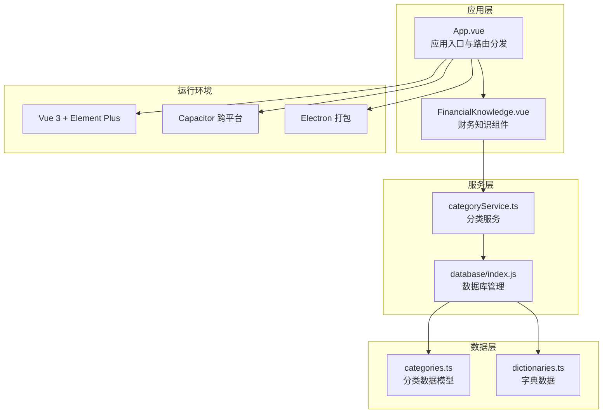
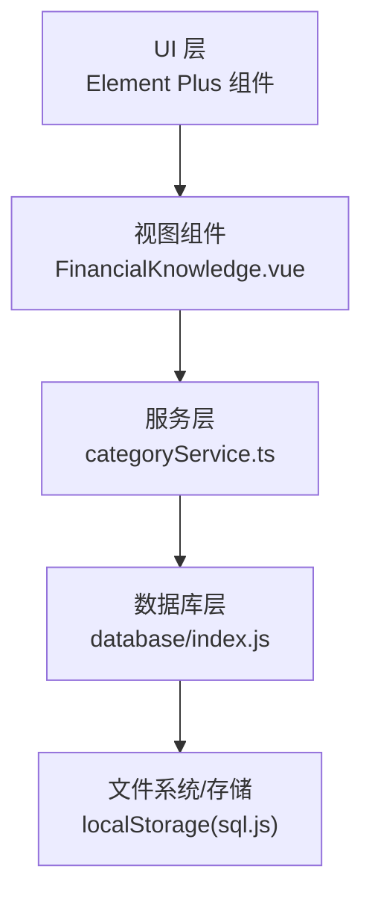
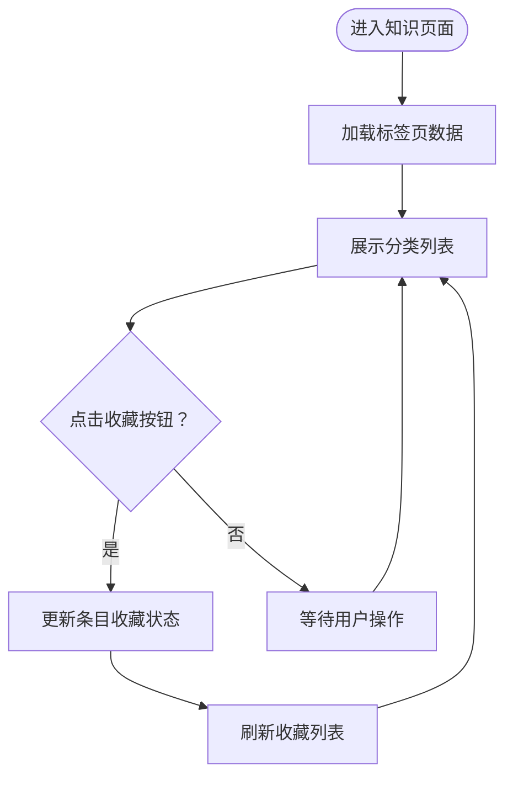
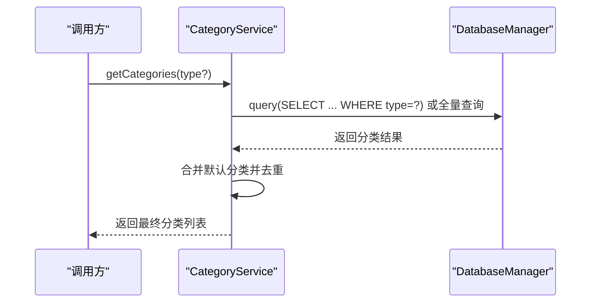
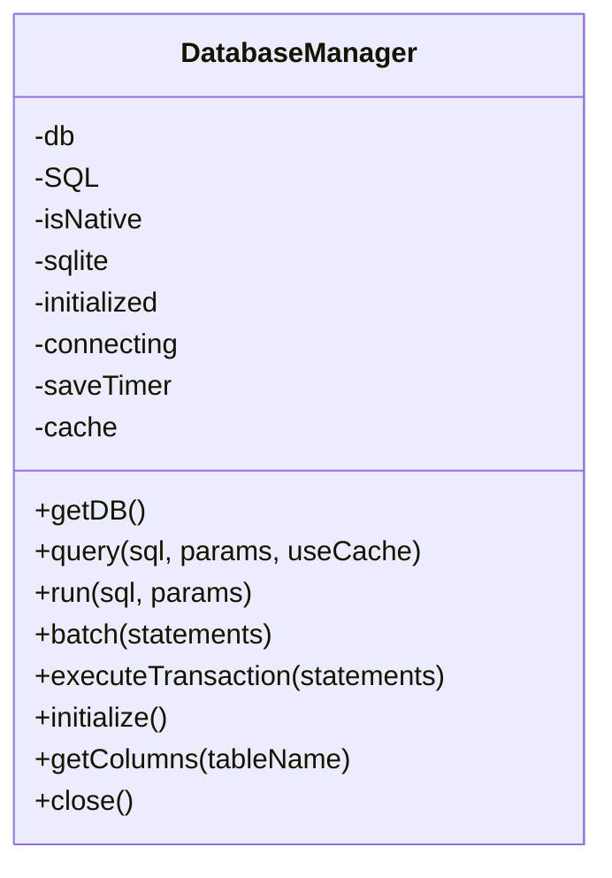
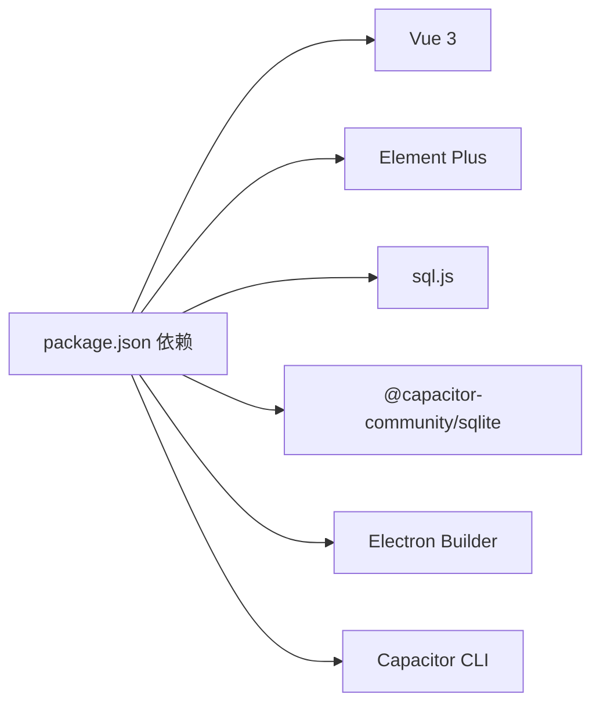

# 财务知识库

<cite>
**本文引用的文件**
- [App.vue](file://src/App.vue)
- [FinancialKnowledge.vue](file://src/components/mobile/financial/FinancialKnowledge.vue)
- [categories.ts](file://src/data/categories.ts)
- [categoryService.ts](file://src/services/categoryService.ts)
- [index.js](file://src/database/index.js)
- [adapter.js](file://src/database/adapter.js)
- [dictionaries.ts](file://src/utils/dictionaries.ts)
- [main.ts](file://src/main.ts)
- [main.js](file://electron/main.js)
- [package.json](file://package.json)
</cite>

## 目录
1. [简介](#简介)
2. [项目结构](#项目结构)
3. [核心组件](#核心组件)
4. [架构概览](#架构概览)
5. [详细组件分析](#详细组件分析)
6. [依赖分析](#依赖分析)
7. [性能考虑](#性能考虑)
8. [故障排除指南](#故障排除指南)
9. [结论](#结论)
10. [附录](#附录)

## 简介
本文件面向财务知识库功能，系统性梳理当前实现与扩展方案。当前版本已实现基础的“财商知识”模块，包含书籍精华、科普内容、观点内容、低费率教育、基础术语及收藏夹等分类；同时具备收藏功能与基础的术语词典。后续可在现有基础上扩展搜索、标签系统、质量评估与专家审核流程、个性化推荐、多媒体与互动测试、社区问答等能力。

## 项目结构
项目采用 Vue 3 + TypeScript + Pinia 的移动端应用架构，支持 Electron 打包与 Capacitor 跨平台运行。财务知识库位于移动端金融模块下，通过路由映射进入知识页面。

**图表来源**
- [App.vue:65-89](file://src/App.vue#L65-L89)
- [FinancialKnowledge.vue:107-215](file://src/components/mobile/financial/FinancialKnowledge.vue#L107-L215)
- [categoryService.ts:8-69](file://src/services/categoryService.ts#L8-L69)
- [index.js:21-190](file://src/database/index.js#L21-L190)
- [categories.ts:1-45](file://src/data/categories.ts#L1-L45)
- [dictionaries.ts:1-90](file://src/utils/dictionaries.ts#L1-L90)
- [main.ts:13-16](file://src/main.ts#L13-L16)
- [main.js:19-45](file://electron/main.js#L19-L45)

**章节来源**
- [App.vue:65-89](file://src/App.vue#L65-L89)
- [main.ts:13-16](file://src/main.ts#L13-L16)
- [main.js:19-45](file://electron/main.js#L19-L45)

## 核心组件
- 财务知识组件：提供知识分类展示、收藏切换、术语解释等基础能力。
- 分类服务：封装数据库访问与默认分类初始化逻辑。
- 数据库管理：统一管理 Capacitor SQLite 与 Web 环境下的 sql.js，支持查询、执行、批处理与事务。
- 分类数据模型：定义分类接口与默认收支分类数据。
- 字典数据：提供账户、负债、目标、资产等业务字典，支撑知识内容的分类与标注。

**章节来源**
- [FinancialKnowledge.vue:107-215](file://src/components/mobile/financial/FinancialKnowledge.vue#L107-L215)
- [categoryService.ts:8-69](file://src/services/categoryService.ts#L8-L69)
- [index.js:21-190](file://src/database/index.js#L21-L190)
- [categories.ts:1-45](file://src/data/categories.ts#L1-L45)
- [dictionaries.ts:1-90](file://src/utils/dictionaries.ts#L1-L90)

## 架构概览
财务知识库采用“视图组件 + 服务层 + 数据库层”的分层架构，结合 Element Plus 提供 UI 能力，Capacitor 与 Electron 提供跨平台运行环境。

**图表来源**
- [FinancialKnowledge.vue:107-215](file://src/components/mobile/financial/FinancialKnowledge.vue#L107-L215)
- [categoryService.ts:8-69](file://src/services/categoryService.ts#L8-L69)
- [index.js:21-190](file://src/database/index.js#L21-L190)

## 详细组件分析

### 财务知识组件（FinancialKnowledge.vue）
- 功能要点
  - 分类展示：书籍精华、科普内容、观点内容、低费率教育、基础术语、我的收藏。
  - 收藏机制：每个条目支持收藏/取消收藏，收藏状态在组件内维护。
  - 术语解释：基础术语卡片展示术语与定义。
- 数据结构
  - 使用响应式数组维护各分类数据与收藏项。
  - 收藏项通过计算属性聚合各分类中的收藏条目。
- 交互设计
  - 标签页切换分类。
  - 悬停效果与网格布局提升阅读体验。
  - 收藏按钮使用 Element Plus 图标与文案。

**图表来源**
- [FinancialKnowledge.vue:107-215](file://src/components/mobile/financial/FinancialKnowledge.vue#L107-L215)

**章节来源**
- [FinancialKnowledge.vue:107-215](file://src/components/mobile/financial/FinancialKnowledge.vue#L107-L215)

### 分类服务（categoryService.ts）
- 职责
  - 获取分类列表（支持按类型过滤）、按 ID 查询、创建、更新、删除。
  - 初始化默认分类，合并数据库与默认分类，避免重复。
  - 数据库状态检查与默认分类初始化。
- 数据一致性
  - 使用 Map 以 id 为键去重，先插入默认分类，再覆盖数据库中的同 id 分类。
- 错误处理
  - 查询异常时回退到默认分类，保证可用性。

**图表来源**
- [categoryService.ts:14-69](file://src/services/categoryService.ts#L14-L69)
- [index.js:21-190](file://src/database/index.js#L21-L190)

**章节来源**
- [categoryService.ts:8-69](file://src/services/categoryService.ts#L8-L69)

### 数据库管理（database/index.js）
- 能力
  - 单例连接管理，区分原生与 Web 环境。
  - 支持 Capacitor SQLite 与 sql.js，Web 端持久化至 localStorage。
  - 查询、执行、批处理、事务、缓存与索引优化。
- 性能特性
  - 查询缓存 Map，批量建表与索引优化，结构变更兼容处理。
- 生命周期
  - 初始化表结构、结构升级、关闭时持久化。

**图表来源**
- [index.js:21-190](file://src/database/index.js#L21-L190)

**章节来源**
- [index.js:21-190](file://src/database/index.js#L21-L190)

### 分类数据模型（categories.ts）
- 定义分类接口与默认收支分类数据，用于初始化与回退。
- 与服务层配合，确保分类数据的一致性与完整性。

**章节来源**
- [categories.ts:1-45](file://src/data/categories.ts#L1-L45)

### 字典数据（dictionaries.ts）
- 提供账户类型、负债类型、还款方式、目标类型等字典，为知识内容的标注与检索提供基础。
- 可扩展用于知识标签体系（如“投资策略”、“风险管理”、“税务规划”等）。

**章节来源**
- [dictionaries.ts:1-90](file://src/utils/dictionaries.ts#L1-L90)

## 依赖分析
- 运行时依赖
  - Vue 3、Element Plus、Pinia、Chart.js、ECharts、sql.js、@capacitor-community/sqlite 等。
- 构建与打包
  - Vite、Electron Builder、Capacitor CLI。
- 平台支持
  - Electron 主进程负责窗口与 IPC；Capacitor 提供 SQLite 插件与键盘等原生能力。

**图表来源**
- [package.json:19-47](file://package.json#L19-L47)
- [main.js:5-69](file://electron/main.js#L5-L69)

**章节来源**
- [package.json:19-47](file://package.json#L19-L47)
- [main.js:5-69](file://electron/main.js#L5-L69)

## 性能考虑
- 数据库层
  - 单例连接、查询缓存、索引优化、批处理与事务，降低 I/O 开销。
  - Web 端延迟持久化，避免频繁写入。
- 视图层
  - 网格布局与悬停阴影提升交互体验，避免复杂动画影响性能。
- 跨平台
  - 原生平台使用 Capacitor SQLite，Web 平台使用 sql.js，兼顾性能与可用性。

**章节来源**
- [index.js:21-190](file://src/database/index.js#L21-L190)
- [FinancialKnowledge.vue:228-275](file://src/components/mobile/financial/FinancialKnowledge.vue#L228-L275)

## 故障排除指南
- 数据库连接失败
  - 服务层提供数据库状态检查与回退逻辑，确保默认分类可用。
  - 建议在应用启动时调用状态检查并提示用户。
- Web 端数据丢失
  - Web 端依赖 localStorage 持久化，若读取失败会重新创建数据库。
  - 建议定期备份或迁移至原生平台。
- 收藏状态异常
  - 当前收藏状态在组件内维护，建议扩展为持久化收藏表，避免页面刷新丢失。

**章节来源**
- [categoryService.ts:181-194](file://src/services/categoryService.ts#L181-L194)
- [index.js:156-178](file://src/database/index.js#L156-L178)
- [FinancialKnowledge.vue:203-214](file://src/components/mobile/financial/FinancialKnowledge.vue#L203-L214)

## 结论
当前财务知识库实现了基础的知识分类展示与收藏功能，具备良好的扩展空间。建议下一步完善标签系统、搜索、质量评估与专家审核流程、个性化推荐、多媒体与互动测试、社区问答等能力，以构建更完整的知识生态。

## 附录

### 知识分类与标签系统（扩展建议）
- 分类维度
  - 基础理财概念、投资策略、风险管理、税务规划、退休规划、保险配置、债务管理、现金流管理等。
- 标签体系
  - 基于字典数据扩展“知识标签”，如“入门级”“进阶”“专家解读”“案例分析”等。
  - 支持多标签组合筛选与排序。

**章节来源**
- [dictionaries.ts:1-90](file://src/utils/dictionaries.ts#L1-L90)

### 知识内容展示与交互（扩展建议）
- 文章列表
  - 支持分页、排序（时间/热度/评分）、筛选（分类/标签/难度）。
- 详情页面
  - 支持目录导航、相关推荐、评论区、收藏/分享/打印。
- 搜索功能
  - 支持关键词、分类、标签、作者等多维搜索。
- 收藏功能
  - 持久化收藏，支持离线查看与同步。

**章节来源**
- [FinancialKnowledge.vue:107-215](file://src/components/mobile/financial/FinancialKnowledge.vue#L107-L215)

### 知识更新与维护机制（扩展建议）
- 内容审核
  - 建立“草稿-审核-发布”流程，专家评审后方可上线。
- 版本管理
  - 记录每次修改的作者、时间、摘要，支持回滚与对比。
- 用户反馈
  - 提供“错误报告”“改进建议”入口，收集问题与评分。

**章节来源**
- [categoryService.ts:199-260](file://src/services/categoryService.ts#L199-L260)

### 推荐算法（扩展建议）
- 基于行为的协同过滤
  - 根据用户浏览历史、收藏、停留时长等特征，计算相似用户与物品。
- 内容基础的标签匹配
  - 将知识内容与标签向量化，计算余弦相似度。
- 混合策略
  - 结合热门度、时效性、用户偏好权重，动态调整推荐结果。

**章节来源**
- [dictionaries.ts:1-90](file://src/utils/dictionaries.ts#L1-L90)

### 质量评估与专家审核（扩展建议）
- 评估标准
  - 科学性、准确性、实用性、可读性、时效性、合规性。
- 专家审核流程
  - 多级审核（编辑初审、专家复审、终审），记录审核意见与结果。

**章节来源**
- [categoryService.ts:181-194](file://src/services/categoryService.ts#L181-L194)

### 开发者扩展方案
- 多媒体内容
  - 支持音频、视频、图表，增强学习体验。
- 互动测试
  - 嵌入小测验、答题卡、错题本，巩固知识点。
- 社区问答
  - 引入提问、回答、点赞、专家解答、积分体系。

**章节来源**
- [package.json:19-47](file://package.json#L19-L47)