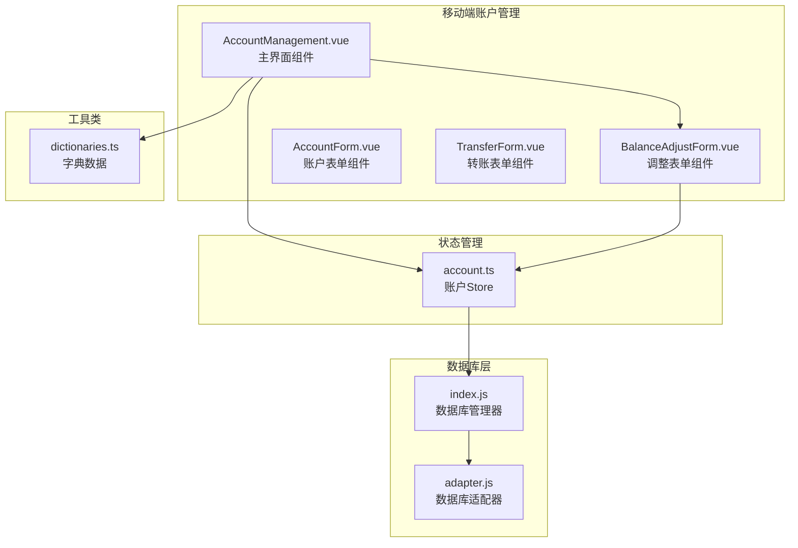
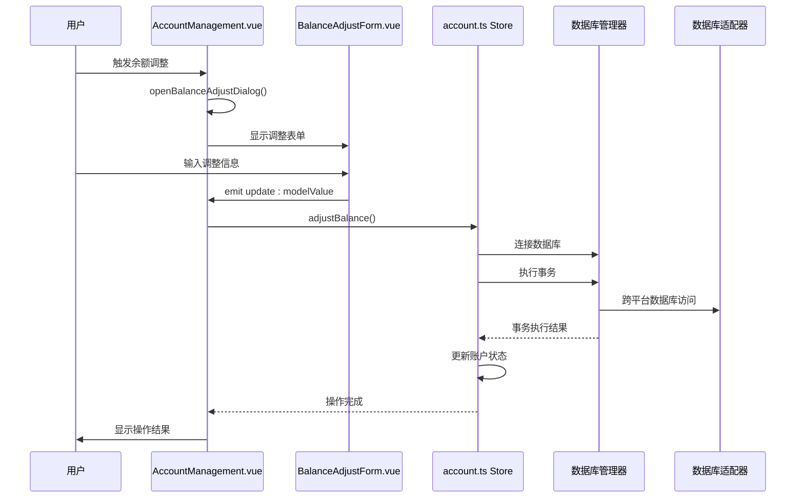
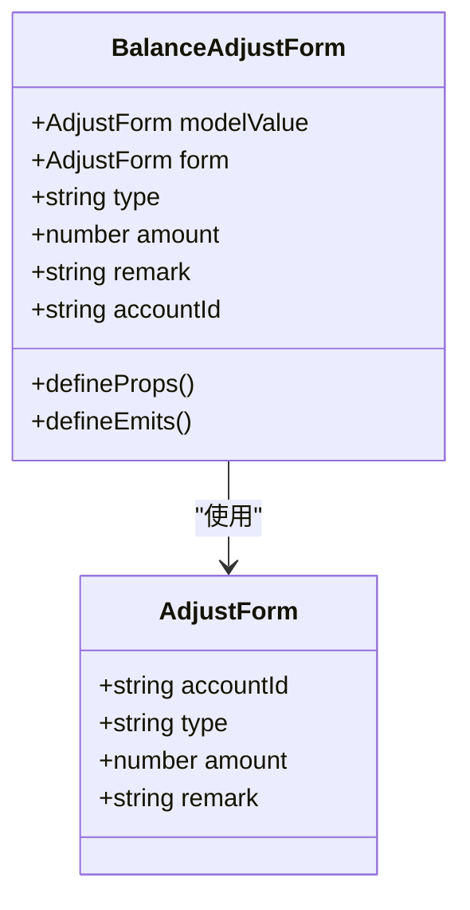
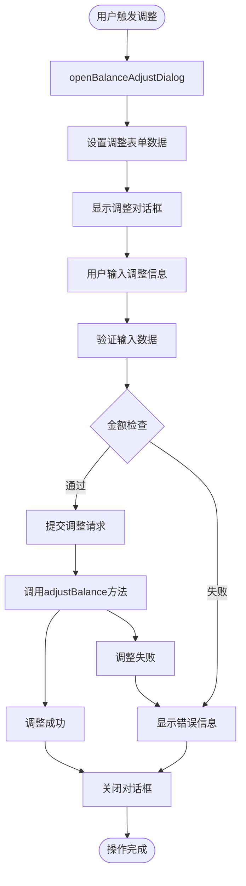
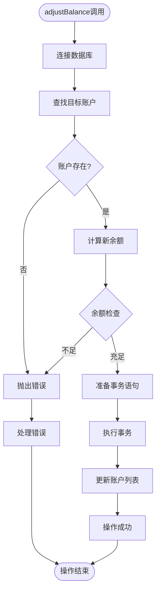
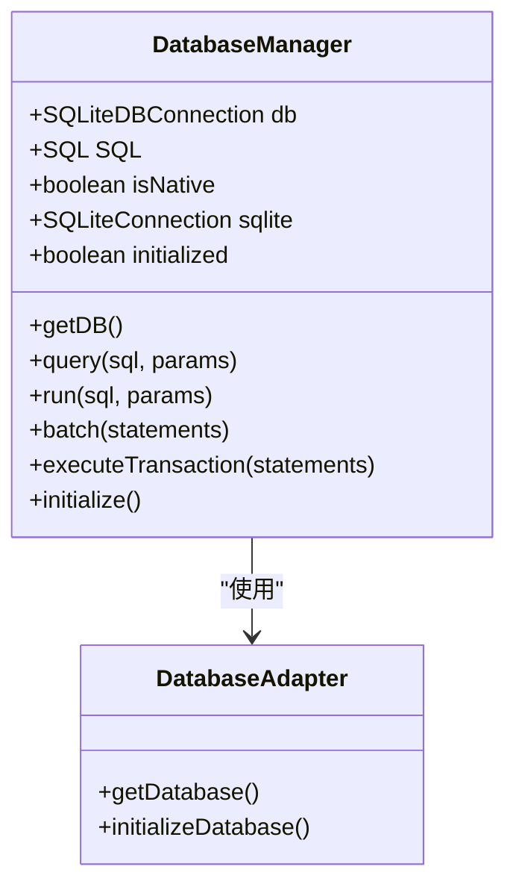
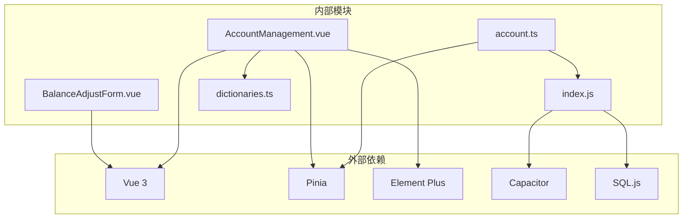

# 余额调整功能

<cite>
**本文档引用的文件**
- [BalanceAdjustForm.vue](file://src/components/mobile/account/BalanceAdjustForm.vue)
- [AccountManagement.vue](file://src/components/mobile/account/AccountManagement.vue)
- [account.ts](file://src/stores/account.ts)
- [index.js](file://src/database/index.js)
- [adapter.js](file://src/database/adapter.js)
- [dictionaries.ts](file://src/utils/dictionaries.ts)
- [AccountForm.vue](file://src/components/mobile/account/AccountForm.vue)
- [TransferForm.vue](file://src/components/mobile/account/TransferForm.vue)
</cite>

## 目录
1. [简介](#简介)
2. [项目结构](#项目结构)
3. [核心组件](#核心组件)
4. [架构概览](#架构概览)
5. [详细组件分析](#详细组件分析)
6. [依赖关系分析](#依赖关系分析)
7. [性能考量](#性能考量)
8. [故障排除指南](#故障排除指南)
9. [结论](#结论)
10. [附录](#附录)

## 简介

余额调整功能是财务管理应用中的关键业务模块，用于处理账户余额的各种调整需求。该功能支持三种主要调整类型：
- **修正错误**：纠正系统记录与实际余额的差异
- **现金赠与**：处理现金的增加或减少
- **资产盘盈**：处理资产盘点时发现的盈余或短缺

该功能通过事务性操作确保数据一致性和完整性，同时提供完整的审计跟踪。

## 项目结构

余额调整功能涉及以下核心文件和组件：

**图表来源**
- [AccountManagement.vue:1-650](file://src/components/mobile/account/AccountManagement.vue#L1-L650)
- [BalanceAdjustForm.vue:1-41](file://src/components/mobile/account/BalanceAdjustForm.vue#L1-L41)
- [account.ts:1-273](file://src/stores/account.ts#L1-L273)

**章节来源**
- [AccountManagement.vue:1-650](file://src/components/mobile/account/AccountManagement.vue#L1-L650)
- [BalanceAdjustForm.vue:1-41](file://src/components/mobile/account/BalanceAdjustForm.vue#L1-L41)
- [account.ts:1-273](file://src/stores/account.ts#L1-L273)

## 核心组件

余额调整功能由以下核心组件构成：

### BalanceAdjustForm.vue
独立的调整表单组件，提供标准化的调整输入界面。

### AccountManagement.vue  
主界面组件，包含完整的账户管理和余额调整功能。

### account.ts Store
状态管理核心，负责数据持久化和业务逻辑处理。

### 数据库层
提供跨平台的数据库访问能力，支持原生和Web环境。

**章节来源**
- [BalanceAdjustForm.vue:19-38](file://src/components/mobile/account/BalanceAdjustForm.vue#L19-L38)
- [AccountManagement.vue:158-377](file://src/components/mobile/account/AccountManagement.vue#L158-L377)
- [account.ts:27-273](file://src/stores/account.ts#L27-L273)

## 架构概览

余额调整功能采用分层架构设计，确保职责分离和可维护性：

**图表来源**
- [AccountManagement.vue:352-376](file://src/components/mobile/account/AccountManagement.vue#L352-L376)
- [account.ts:145-185](file://src/stores/account.ts#L145-L185)

## 详细组件分析

### BalanceAdjustForm.vue 组件分析

BalanceAdjustForm.vue 是一个轻量级的表单组件，专门用于余额调整操作：

**图表来源**
- [BalanceAdjustForm.vue:22-37](file://src/components/mobile/account/BalanceAdjustForm.vue#L22-L37)

#### 组件特性
- **响应式数据绑定**：使用 Vue 3 Composition API
- **类型安全**：完整的 TypeScript 类型定义
- **双向数据绑定**：通过 v-model 实现数据同步
- **标准化接口**：遵循 Vue 组件开发规范

**章节来源**
- [BalanceAdjustForm.vue:1-41](file://src/components/mobile/account/BalanceAdjustForm.vue#L1-L41)

### AccountManagement.vue 主界面分析

AccountManagement.vue 提供了完整的余额调整功能集成：

**图表来源**
- [AccountManagement.vue:352-376](file://src/components/mobile/account/AccountManagement.vue#L352-L376)

#### 关键功能实现
- **对话框管理**：通过 dialogVisible 控制对话框状态
- **数据绑定**：adjustForm 对象管理调整表单数据
- **事件处理**：adjustBalance 方法处理调整逻辑
- **状态管理**：集成 Pinia 状态管理

**章节来源**
- [AccountManagement.vue:131-154](file://src/components/mobile/account/AccountManagement.vue#L131-L154)
- [AccountManagement.vue:352-376](file://src/components/mobile/account/AccountManagement.vue#L352-L376)

### account.ts Store 业务逻辑

account.ts Store 实现了余额调整的核心业务逻辑：

**图表来源**
- [account.ts:145-185](file://src/stores/account.ts#L145-L185)

#### 业务逻辑特点
- **事务保证**：使用数据库事务确保操作原子性
- **数据验证**：防止负余额产生
- **审计跟踪**：自动记录调整流水
- **错误处理**：完善的异常捕获和处理机制

**章节来源**
- [account.ts:145-185](file://src/stores/account.ts#L145-L185)

### 数据库层设计

数据库层提供了跨平台的数据库访问能力：

**图表来源**
- [index.js:21-374](file://src/database/index.js#L21-L374)
- [adapter.js:14-33](file://src/database/adapter.js#L14-L33)

#### 数据库特性
- **跨平台支持**：支持 Capacitor SQLite 和 SQL.js
- **性能优化**：连接池管理、查询缓存、批量处理
- **事务支持**：完整的 ACID 事务保证
- **数据持久化**：Web环境下的本地存储

**章节来源**
- [index.js:21-935](file://src/database/index.js#L21-L935)
- [adapter.js:1-34](file://src/database/adapter.js#L1-L34)

## 依赖关系分析

余额调整功能的依赖关系如下：

**图表来源**
- [BalanceAdjustForm.vue:20](file://src/components/mobile/account/BalanceAdjustForm.vue#L20)
- [AccountManagement.vue:160](file://src/components/mobile/account/AccountManagement.vue#L160)
- [account.ts:6](file://src/stores/account.ts#L6)
- [index.js:8-10](file://src/database/index.js#L8-L10)

### 组件耦合度分析
- **低耦合高内聚**：各组件职责明确，相互依赖最小
- **接口清晰**：通过 props 和 emits 进行通信
- **状态集中**：使用 Pinia 进行全局状态管理

**章节来源**
- [BalanceAdjustForm.vue:29-37](file://src/components/mobile/account/BalanceAdjustForm.vue#L29-L37)
- [AccountManagement.vue:160-168](file://src/components/mobile/account/AccountManagement.vue#L160-L168)
- [account.ts:27-32](file://src/stores/account.ts#L27-L32)

## 性能考量

余额调整功能在性能方面采用了多项优化措施：

### 数据库性能优化
- **连接池管理**：避免频繁创建数据库连接
- **查询缓存**：缓存常用查询结果
- **批量操作**：支持批量SQL执行
- **索引优化**：为常用查询字段建立索引

### 前端性能优化
- **懒加载**：按需加载组件和数据
- **虚拟滚动**：大量数据时使用虚拟滚动
- **防抖处理**：输入验证使用防抖技术
- **内存管理**：及时清理事件监听器和定时器

### 移动端优化
- **原生数据库**：使用 Capacitor SQLite 提升性能
- **离线支持**：支持离线操作和数据同步
- **电池优化**：减少后台操作对电池的影响

## 故障排除指南

### 常见问题及解决方案

#### 1. 余额不足错误
**问题描述**：尝试调整导致账户余额变为负数
**解决方法**：
- 检查账户当前余额
- 确认调整金额不超过可用余额
- 对于信用卡账户，检查可用额度

#### 2. 账户不存在错误
**问题描述**：指定的账户ID不存在
**解决方法**：
- 验证账户ID的有效性
- 检查账户列表是否已加载
- 确认账户状态正常

#### 3. 数据库连接失败
**问题描述**：无法连接到数据库
**解决方法**：
- 检查网络连接状态
- 验证数据库初始化过程
- 查看控制台错误日志

#### 4. 事务执行失败
**问题描述**：调整操作部分成功部分失败
**解决方法**：
- 检查事务日志
- 验证数据库权限
- 确认磁盘空间充足

**章节来源**
- [account.ts:151-159](file://src/stores/account.ts#L151-L159)
- [index.js:848-890](file://src/database/index.js#L848-L890)

### 调试技巧
- **启用调试模式**：在数据库管理器中设置 DEBUG 为 true
- **查看事务日志**：监控数据库事务执行情况
- **检查状态变化**：使用浏览器开发者工具监控状态变化
- **验证数据一致性**：定期检查数据库完整性

## 结论

余额调整功能通过精心设计的架构实现了以下目标：

### 技术优势
- **可靠性**：使用数据库事务确保数据一致性
- **可扩展性**：模块化设计支持功能扩展
- **跨平台**：统一的API支持多平台部署
- **安全性**：完善的错误处理和数据验证

### 业务价值
- **准确性**：精确的余额管理和调整记录
- **透明度**：完整的审计跟踪和历史记录
- **效率性**：简化的操作流程和快速响应
- **合规性**：满足财务审计和监管要求

该功能为财务管理应用提供了坚实的余额调整基础，支持各种复杂的财务场景和业务需求。

## 附录

### 使用示例

#### 基本调整流程
1. 在 AccountManagement.vue 中点击"余额调整"
2. 选择调整类型（修正错误/现金赠与/资产盘盈）
3. 输入调整金额（支持小数点后两位）
4. 添加备注信息
5. 点击"确定"执行调整

#### 高级用法
- **批量调整**：通过编程方式调用 adjustBalance 方法
- **条件验证**：在提交前进行自定义验证
- **错误处理**：捕获和处理各种异常情况

### 最佳实践
- **数据验证**：始终验证输入数据的有效性
- **错误处理**：提供友好的错误提示和恢复机制
- **性能优化**：合理使用缓存和批量操作
- **安全考虑**：实施适当的权限控制和审计日志

### 安全考虑
- **数据加密**：敏感财务数据的加密存储
- **访问控制**：基于角色的权限管理
- **审计日志**：完整的操作记录和追踪
- **备份策略**：定期的数据备份和恢复测试