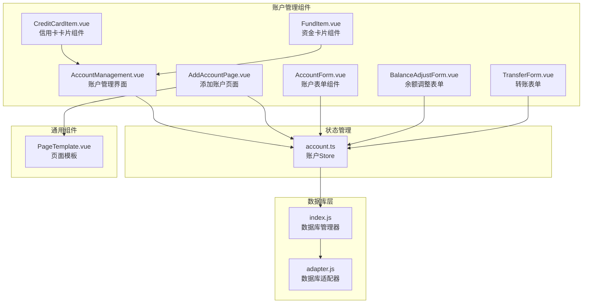
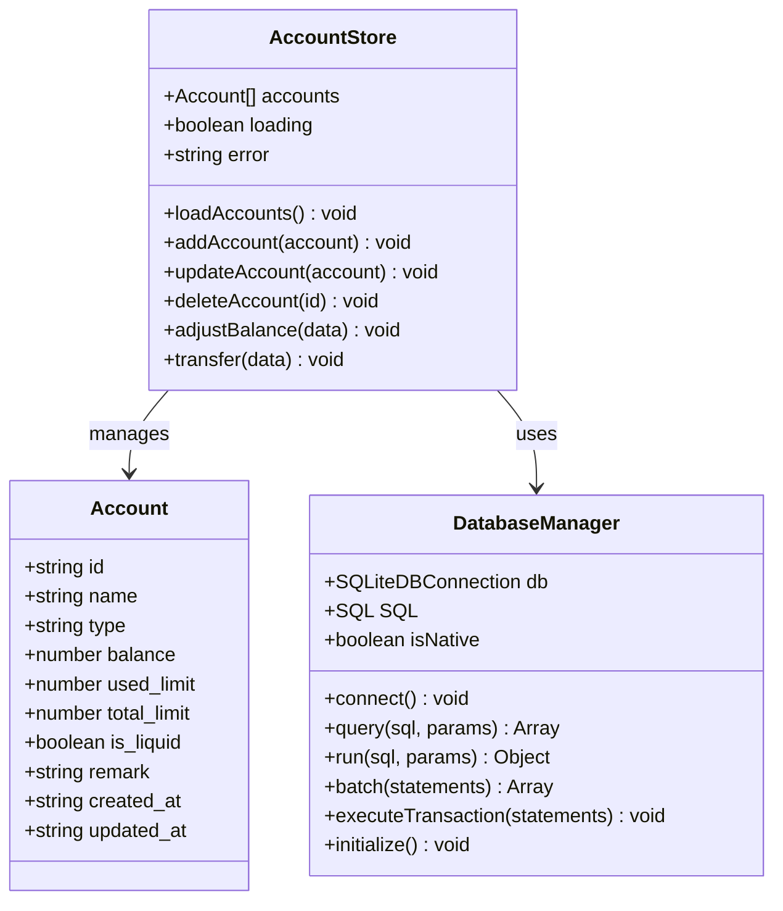
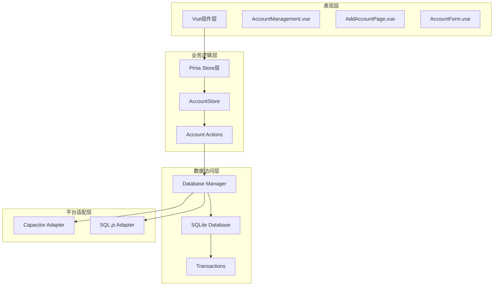
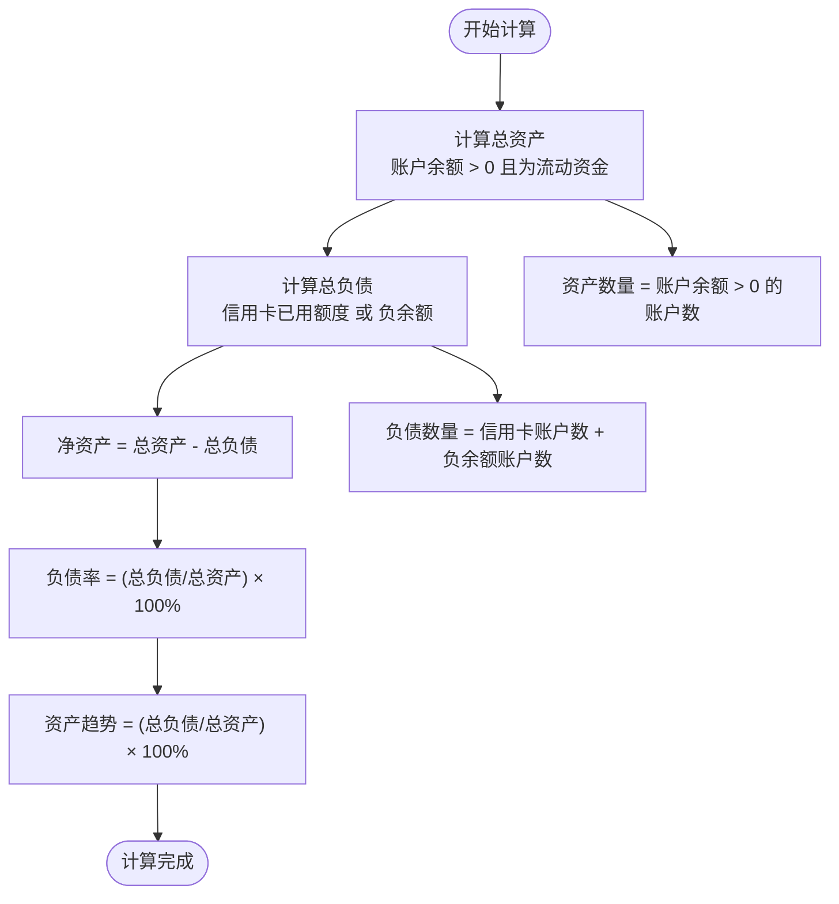
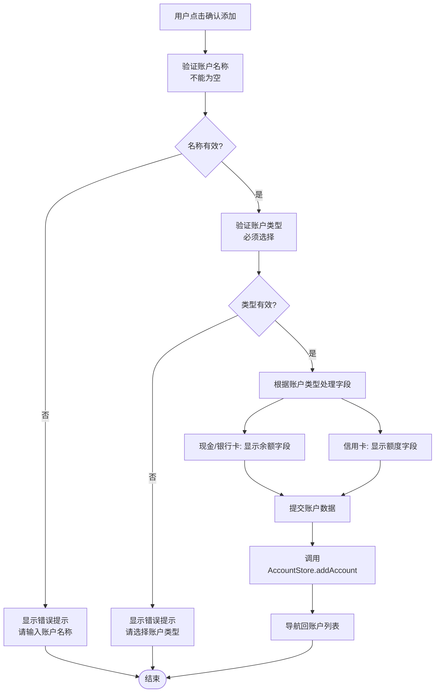
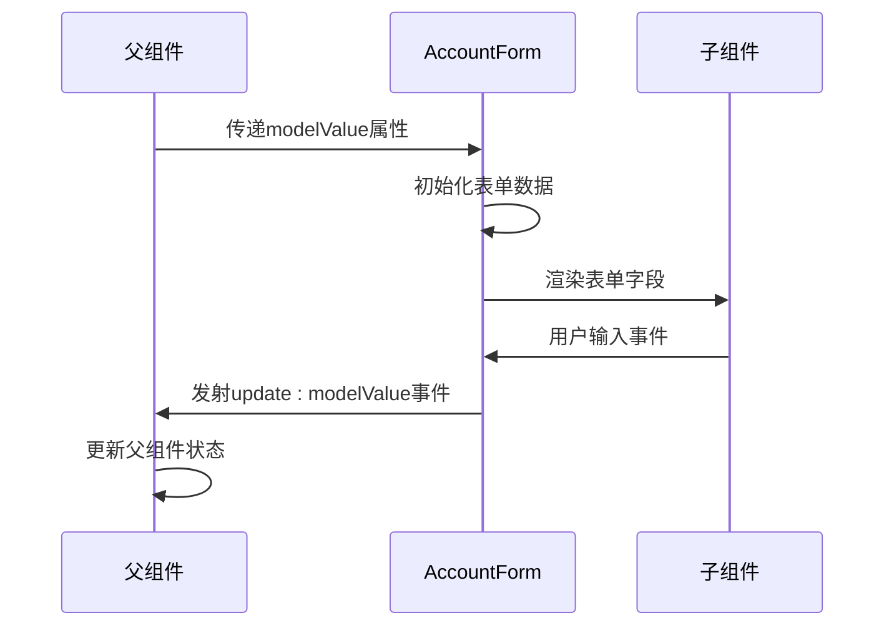
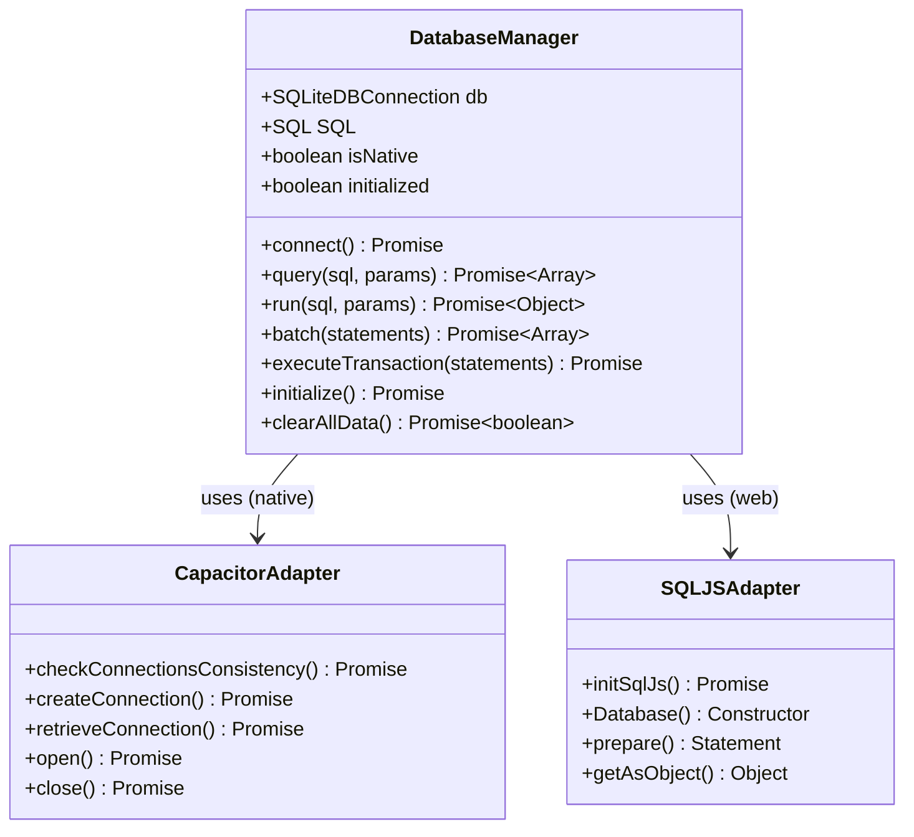
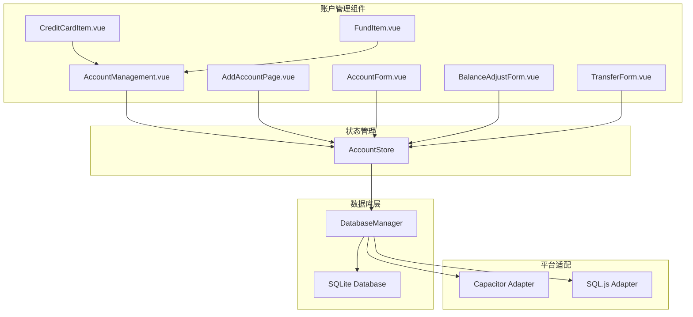
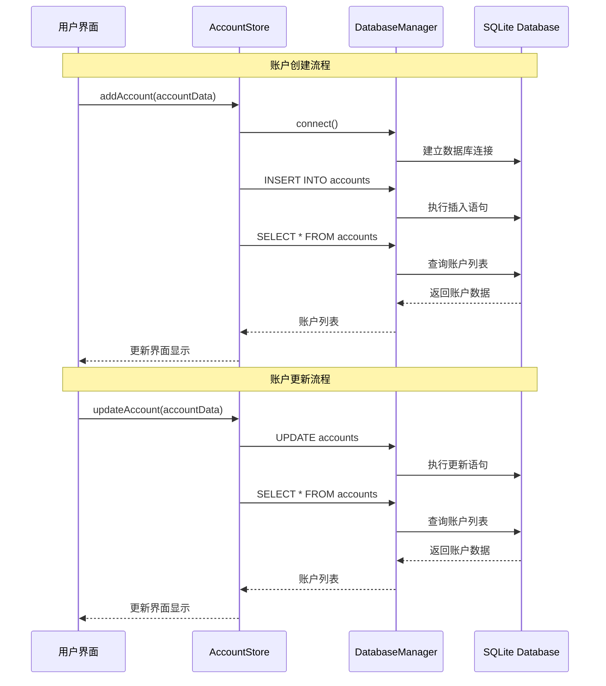

# 账户CRUD操作

<cite>
**本文档引用的文件**
- [AccountManagement.vue](file://src/components/mobile/account/AccountManagement.vue)
- [AddAccountPage.vue](file://src/components/mobile/account/AddAccountPage.vue)
- [AccountForm.vue](file://src/components/mobile/account/AccountForm.vue)
- [account.ts](file://src/stores/account.ts)
- [index.js](file://src/database/index.js)
- [adapter.js](file://src/database/adapter.js)
- [CreditCardItem.vue](file://src/components/mobile/account/CreditCardItem.vue)
- [FundItem.vue](file://src/components/mobile/account/FundItem.vue)
- [PageTemplate.vue](file://src/components/common/PageTemplate.vue)
- [BalanceAdjustForm.vue](file://src/components/mobile/account/BalanceAdjustForm.vue)
- [TransferForm.vue](file://src/components/mobile/account/TransferForm.vue)
</cite>

## 目录
1. [简介](#简介)
2. [项目结构](#项目结构)
3. [核心组件](#核心组件)
4. [架构概览](#架构概览)
5. [详细组件分析](#详细组件分析)
6. [依赖关系分析](#依赖关系分析)
7. [性能考虑](#性能考虑)
8. [故障排除指南](#故障排除指南)
9. [结论](#结论)

## 简介

本文件详细说明了财务应用程序中的账户CRUD操作实现，包括账户的创建、读取、更新和删除功能。文档涵盖了AccountManagement.vue组件中的账户展示逻辑，包括净资产计算、资产负债统计、账户分类显示等功能。同时详细解释了AddAccountPage.vue中的账户添加流程，包括表单验证、字段处理、数据提交等。还阐述了AccountForm.vue中的表单组件设计，包括账户类型选择、余额输入、流动资金标记等字段的处理逻辑。

## 项目结构

该财务应用程序采用Vue 3 + TypeScript + Pinia的状态管理模式，结合SQLite数据库进行数据持久化。账户管理功能主要分布在以下目录结构中：

**图表来源**
- [AccountManagement.vue:1-650](file://src/components/mobile/account/AccountManagement.vue#L1-L650)
- [AddAccountPage.vue:1-188](file://src/components/mobile/account/AddAccountPage.vue#L1-L188)
- [account.ts:1-273](file://src/stores/account.ts#L1-L273)
- [index.js:1-935](file://src/database/index.js#L1-L935)

**章节来源**
- [AccountManagement.vue:1-650](file://src/components/mobile/account/AccountManagement.vue#L1-L650)
- [AddAccountPage.vue:1-188](file://src/components/mobile/account/AddAccountPage.vue#L1-L188)
- [account.ts:1-273](file://src/stores/account.ts#L1-L273)

## 核心组件

### 账户数据模型

应用程序定义了完整的账户数据结构，支持多种账户类型和金融属性：

**图表来源**
- [account.ts:11-22](file://src/stores/account.ts#L11-L22)
- [account.ts:27-32](file://src/stores/account.ts#L27-L32)
- [index.js:21-32](file://src/database/index.js#L21-L32)

### 账户类型支持

系统支持以下账户类型：
- **现金**: 现金账户
- **微信**: 微信支付账户
- **支付宝**: 支付宝账户
- **储蓄卡**: 银行储蓄卡
- **社保卡**: 社会保险卡
- **信用卡**: 信用卡账户

每种账户类型具有不同的属性和行为特征，特别是在余额管理和流动资金标记方面。

**章节来源**
- [AccountManagement.vue:97-105](file://src/components/mobile/account/AccountManagement.vue#L97-L105)
- [AddAccountPage.vue:14-22](file://src/components/mobile/account/AddAccountPage.vue#L14-L22)
- [account.ts:11-22](file://src/stores/account.ts#L11-L22)

## 架构概览

应用程序采用分层架构设计，确保数据访问、业务逻辑和用户界面的有效分离：

**图表来源**
- [account.ts:27-273](file://src/stores/account.ts#L27-L273)
- [index.js:8-32](file://src/database/index.js#L8-L32)
- [adapter.js:5-24](file://src/database/adapter.js#L5-L24)

## 详细组件分析

### AccountManagement.vue - 账户管理界面

AccountManagement.vue是账户管理的核心界面组件，提供了完整的账户展示和管理功能：

#### 净资产计算逻辑

组件实现了复杂的财务指标计算，包括总资产、总负债、净资产和负债率：

**图表来源**
- [AccountManagement.vue:194-233](file://src/components/mobile/account/AccountManagement.vue#L194-L233)

#### 账户分类展示

组件实现了三种主要的账户分类展示：

1. **信用卡分类**：专门处理信用卡账户，显示已用额度和总额度
2. **流动资金**：显示日常使用的资金账户
3. **其他资金**：显示非流动性的资金账户

每个分类都支持展开/收起功能，提供良好的用户体验。

#### 对话框功能

组件包含两个重要的对话框：

1. **编辑账户对话框**：支持账户信息的修改，包括余额、额度、流动资金标记等
2. **余额调整对话框**：支持账户余额的调整操作，包括修正错误、现金赠与、资产盘盈等类型

**章节来源**
- [AccountManagement.vue:1-650](file://src/components/mobile/account/AccountManagement.vue#L1-L650)

### AddAccountPage.vue - 账户添加页面

AddAccountPage.vue负责处理新账户的创建流程，提供了完整的表单验证和数据提交功能：

#### 表单验证机制

表单实现了多层次的验证逻辑：

**图表来源**
- [AddAccountPage.vue:75-96](file://src/components/mobile/account/AddAccountPage.vue#L75-L96)

#### 动态字段处理

组件实现了智能的字段显示逻辑，根据账户类型动态显示相应的输入字段：

- **非信用卡账户**：显示余额输入框和流动资金开关
- **信用卡账户**：显示已用额度和总额度输入框
- **社保卡账户**：不显示流动资金选项

**章节来源**
- [AddAccountPage.vue:1-188](file://src/components/mobile/account/AddAccountPage.vue#L1-L188)

### AccountForm.vue - 账户表单组件

AccountForm.vue是一个可复用的表单组件，提供了基础的账户信息输入功能：

#### 组件设计模式

该组件采用了Vue 3的组合式API设计，支持双向数据绑定和事件发射：

**图表来源**
- [AccountForm.vue:32-38](file://src/components/mobile/account/AccountForm.vue#L32-L38)

**章节来源**
- [AccountForm.vue:1-44](file://src/components/mobile/account/AccountForm.vue#L1-L44)

### 数据库集成

#### 数据库管理器

数据库管理器实现了跨平台的数据持久化功能，支持原生平台和Web平台：

**图表来源**
- [index.js:21-32](file://src/database/index.js#L21-L32)
- [index.js:81-189](file://src/database/index.js#L81-L189)

#### 账户表结构

数据库使用标准化的账户表结构，支持完整的财务数据存储：

| 字段名 | 类型 | 约束 | 描述 |
|--------|------|------|------|
| id | TEXT | PRIMARY KEY | 账户唯一标识符 |
| name | TEXT | NOT NULL, UNIQUE | 账户名称 |
| type | TEXT | NOT NULL | 账户类型 |
| balance | REAL | DEFAULT 0 | 账户余额 |
| used_limit | REAL | DEFAULT 0 | 信用卡已用额度 |
| total_limit | REAL | DEFAULT 0 | 信用卡总额度 |
| is_liquid | INTEGER | DEFAULT 1 | 是否为流动资金 |
| remark | TEXT |  | 备注信息 |
| created_at | TIMESTAMP | DEFAULT CURRENT_TIMESTAMP | 创建时间 |
| updated_at | TIMESTAMP | DEFAULT CURRENT_TIMESTAMP | 更新时间 |

**章节来源**
- [index.js:434-449](file://src/database/index.js#L434-L449)

## 依赖关系分析

### 组件依赖图

**图表来源**
- [AccountManagement.vue:158-168](file://src/components/mobile/account/AccountManagement.vue#L158-L168)
- [AddAccountPage.vue:47-50](file://src/components/mobile/account/AddAccountPage.vue#L47-L50)
- [account.ts:5-6](file://src/stores/account.ts#L5-L6)

### 数据流分析

账户CRUD操作的数据流遵循统一的模式：

**图表来源**
- [account.ts:59-100](file://src/stores/account.ts#L59-L100)
- [account.ts:106-121](file://src/stores/account.ts#L106-L121)

**章节来源**
- [account.ts:1-273](file://src/stores/account.ts#L1-L273)

## 性能考虑

### 数据库性能优化

应用程序实现了多项数据库性能优化策略：

1. **连接池管理**：使用单例模式确保数据库连接的复用
2. **查询缓存**：实现查询结果缓存机制，减少重复查询
3. **批量操作**：支持批量SQL语句执行，提高事务处理效率
4. **索引优化**：为常用查询字段建立索引，提升查询性能

### 内存管理

- **垃圾回收**：及时清理不再使用的数据库连接和查询结果
- **缓存控制**：实现缓存大小限制和自动清理机制
- **异步处理**：使用Promise和async/await避免阻塞主线程

### 移动端优化

- **原生平台支持**：通过Capacitor SQLite插件提供原生性能
- **Web兼容性**：使用SQL.js库确保Web环境的兼容性
- **平台检测**：自动检测运行环境并选择最优的数据库实现

## 故障排除指南

### 常见问题及解决方案

#### 数据库连接问题

**问题症状**：账户数据无法加载或保存
**可能原因**：
- 数据库连接失败
- 权限不足
- 数据库文件损坏

**解决步骤**：
1. 检查数据库连接状态
2. 重新初始化数据库
3. 清理数据库缓存
4. 重启应用程序

#### 账户操作异常

**问题症状**：添加或更新账户时出现错误
**可能原因**：
- 表单验证失败
- 数据库约束冲突
- 事务执行失败

**解决步骤**：
1. 检查表单数据格式
2. 验证数据库约束条件
3. 查看错误日志
4. 重试操作

#### 性能问题

**问题症状**：界面响应缓慢或数据加载超时
**可能原因**：
- 数据库查询过于复杂
- 缓存未正确配置
- 内存泄漏

**解决步骤**：
1. 分析查询性能
2. 调整缓存策略
3. 检查内存使用情况
4. 优化数据库索引

**章节来源**
- [index.js:418-776](file://src/database/index.js#L418-L776)
- [account.ts:47-52](file://src/stores/account.ts#L47-L52)

## 结论

本财务应用程序的账户CRUD操作实现了完整的财务管理功能，具有以下特点：

1. **完整的功能覆盖**：支持账户的创建、读取、更新、删除和余额调整等所有基本操作
2. **优秀的用户体验**：提供直观的界面设计和流畅的操作体验
3. **强大的数据管理**：采用SQLite数据库确保数据的安全性和持久性
4. **跨平台兼容**：支持原生移动应用和Web浏览器环境
5. **高性能设计**：通过多种优化策略确保系统的高效运行

该实现为财务应用程序提供了坚实的基础，开发者可以根据具体需求进一步扩展功能，如添加转账功能、预算管理、报表生成等高级特性。