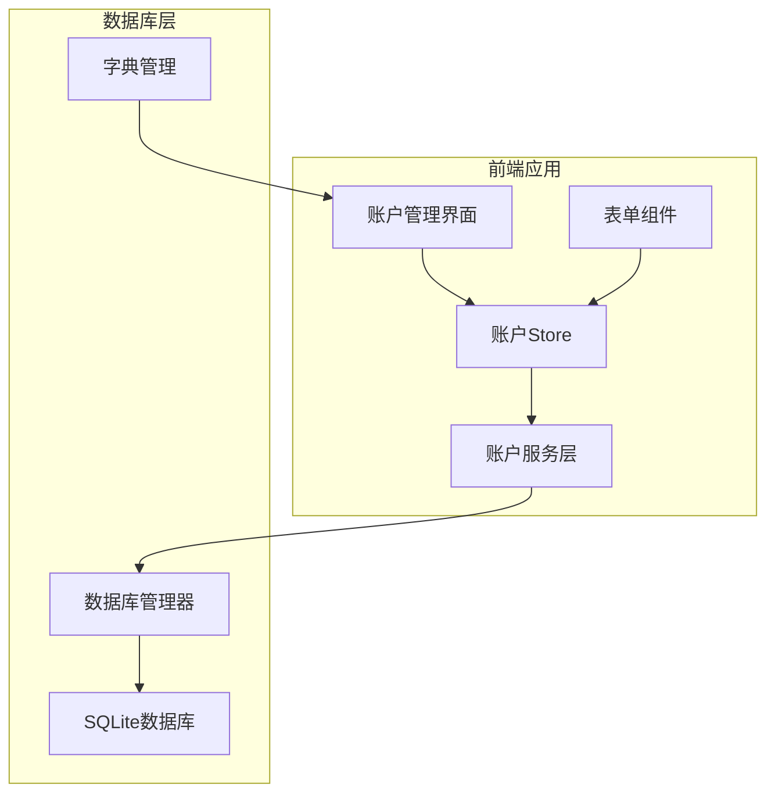
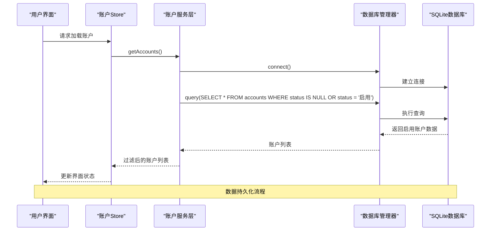
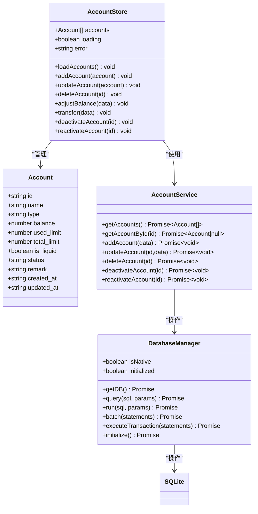
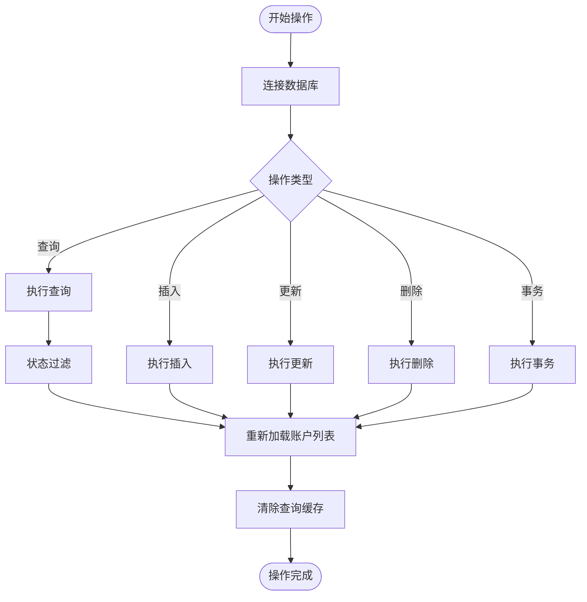
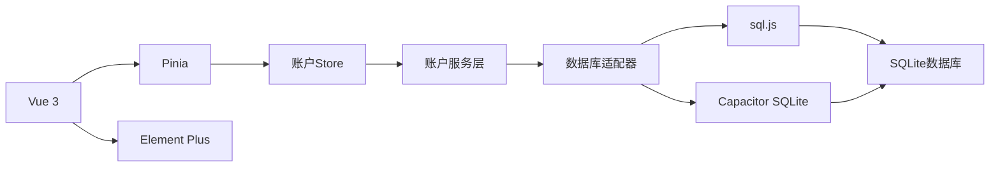

# 账户数据模型

<cite>
**本文档引用的文件**
- [src/stores/account.ts](file://src/stores/account.ts)
- [src/database/index.js](file://src/database/index.js)
- [src/database/adapter.js](file://src/database/adapter.js)
- [src/components/mobile/account/AccountManagement.vue](file://src/components/mobile/account/AccountManagement.vue)
- [src/components/mobile/account/AddAccountPage.vue](file://src/components/mobile/account/AddAccountPage.vue)
- [src/components/mobile/account/AccountForm.vue](file://src/components/mobile/account/AccountForm.vue)
- [src/components/mobile/account/BalanceAdjustForm.vue](file://src/components/mobile/account/BalanceAdjustForm.vue)
- [src/components/mobile/account/TransferForm.vue](file://src/components/mobile/account/TransferForm.vue)
- [src/services/account/accountService.ts](file://src/services/account/accountService.ts)
- [src/types/account/account.ts](file://src/types/account/account.ts)
- [src/utils/dictionaries.ts](file://src/utils/dictionaries.ts)
- [src/main.ts](file://src/main.ts)
- [package.json](file://package.json)
</cite>

## 更新摘要
**变更内容**
- 新增账户状态跟踪字段(status)，支持启用/停用状态管理
- 账户类型扩展支持公积金类型，完善社会保障体系支持
- 数据模型得到完善，增强账户生命周期管理能力
- 更新数据库架构以支持状态字段和公积金类型

## 目录
1. [简介](#简介)
2. [项目结构](#项目结构)
3. [核心组件](#核心组件)
4. [架构概览](#架构概览)
5. [详细组件分析](#详细组件分析)
6. [依赖关系分析](#依赖关系分析)
7. [性能考量](#性能考量)
8. [故障排除指南](#故障排除指南)
9. [结论](#结论)
10. [附录](#附录)

## 简介
本文件详细介绍财务应用中的账户数据模型，涵盖账户实体定义、Pinia store状态管理、数据库表结构、业务规则以及使用示例。该系统支持多平台部署（Web和原生），采用SQLite作为持久化存储，并通过事务保证数据一致性。最新版本增强了账户状态跟踪能力和公积金类型支持，为用户提供更完善的账户管理体验。

## 项目结构
账户相关的核心文件分布如下：
- 状态管理：src/stores/account.ts
- 数据库层：src/database/index.js, src/database/adapter.js
- 服务层：src/services/account/accountService.ts
- 类型定义：src/types/account/account.ts
- 用户界面：src/components/mobile/account/*.vue
- 字典管理：src/utils/dictionaries.ts
- 应用入口：src/main.ts
- 依赖配置：package.json



**图表来源**
- [src/stores/account.ts:1-273](file://src/stores/account.ts#L1-L273)
- [src/database/index.js:1-935](file://src/database/index.js#L1-L935)
- [src/services/account/accountService.ts:1-563](file://src/services/account/accountService.ts#L1-L563)

**章节来源**
- [src/stores/account.ts:1-273](file://src/stores/account.ts#L1-L273)
- [src/database/index.js:1-935](file://src/database/index.js#L1-L935)
- [src/services/account/accountService.ts:1-563](file://src/services/account/accountService.ts#L1-L563)

## 核心组件
账户数据模型由四个层次构成：数据模型定义、状态管理、服务层和数据库持久化。

### 数据模型定义
账户接口包含以下字段：
- id: string - 账户唯一标识符
- name: string - 账户名称
- type: string - 账户类型（现金、微信、支付宝、储蓄卡、社保卡、公积金、信用卡）
- balance: number - 账户余额
- used_limit?: number - 已用额度（仅信用卡）
- total_limit?: number - 总额度（仅信用卡）
- is_liquid?: boolean | number - 是否为流动资金
- status?: string - 账户状态（启用/停用）
- remark: string - 备注信息
- created_at?: string | Date - 创建时间
- updated_at?: string | Date - 更新时间

**更新** 新增status字段用于账户状态跟踪，支持启用和停用两种状态

### Pinia Store状态管理
账户Store提供以下功能：
- 账户列表管理：加载、添加、更新、删除
- 余额调整：支持多种调整类型
- 内部转账：跨账户资金转移
- 错误处理：统一的错误状态管理
- 状态管理：支持账户启用/停用操作

**章节来源**
- [src/stores/account.ts:11-22](file://src/stores/account.ts#L11-L22)
- [src/stores/account.ts:27-32](file://src/stores/account.ts#L27-L32)

## 架构概览
系统采用分层架构，确保关注点分离和可维护性。



**图表来源**
- [src/stores/account.ts:38-53](file://src/stores/account.ts#L38-L53)
- [src/services/account/accountService.ts:129-133](file://src/services/account/accountService.ts#L129-L133)
- [src/database/index.js:56-190](file://src/database/index.js#L56-L190)

## 详细组件分析

### 账户实体类图


**图表来源**
- [src/types/account/account.ts:6-18](file://src/types/account/account.ts#L6-L18)
- [src/stores/account.ts:11-273](file://src/stores/account.ts#L11-L273)
- [src/services/account/accountService.ts:1-563](file://src/services/account/accountService.ts#L1-L563)
- [src/database/index.js:21-374](file://src/database/index.js#L21-L374)

### 数据库表结构设计
账户表(accounts)采用以下字段定义：
- id: TEXT PRIMARY KEY - 主键，使用时间戳生成
- name: TEXT NOT NULL UNIQUE - 账户名称，唯一约束
- type: TEXT NOT NULL - 账户类型
- balance: REAL DEFAULT 0 - 余额，默认0
- used_limit: REAL DEFAULT 0 - 已用额度，默认0
- total_limit: REAL DEFAULT 0 - 总额度，默认0
- is_liquid: INTEGER DEFAULT 1 - 流动资金标识，默认1
- status: TEXT DEFAULT '启用' - 账户状态，默认启用
- remark: TEXT - 备注
- created_at: TIMESTAMP DEFAULT CURRENT_TIMESTAMP - 创建时间
- updated_at: TIMESTAMP DEFAULT CURRENT_TIMESTAMP - 更新时间

**更新** 新增status字段，默认值为'启用'，支持账户状态跟踪

**章节来源**
- [src/database/index.js:434-449](file://src/database/index.js#L434-L449)

### 业务规则详解

#### 账户类型分类
系统支持以下账户类型：
- 现金：物理现金账户
- 微信：微信支付账户
- 支付宝：支付宝账户
- 储蓄卡：银行储蓄卡
- 社保卡：社会保障卡
- **公积金**：住房公积金账户（新增）
- 信用卡：银行信用卡

**更新** 新增公积金类型，完善社会保障体系支持

#### 账户状态管理
系统支持账户状态跟踪：
- 启用状态：默认状态，正常使用的账户
- 停用状态：账户被禁用，不可进行任何操作
- 状态过滤：查询时默认只返回启用状态的账户

#### 余额计算规则
- 流动资金账户：balance > 0 且 is_liquid = true
- 信用卡：used_limit 字段表示欠款
- 负债账户：balance < 0 的负余额账户
- **状态影响**：停用账户不参与任何计算和操作

#### 流动资金标识
- is_liquid 字段控制账户是否参与流动资金计算
- 社保卡、公积金和信用卡默认非流动资金
- 新增账户时根据类型自动设置默认值

**更新** 公积金账户默认非流动资金，与社保卡保持一致

**章节来源**
- [src/components/mobile/account/AddAccountPage.vue:58-64](file://src/components/mobile/account/AddAccountPage.vue#L58-L64)
- [src/components/mobile/account/AccountManagement.vue:111](file://src/components/mobile/account/AccountManagement.vue#L111)
- [src/utils/dictionaries.ts:8-17](file://src/utils/dictionaries.ts#L8-L17)

### 数据同步机制
账户数据采用双向同步策略：



**图表来源**
- [src/stores/account.ts:38-53](file://src/stores/account.ts#L38-L53)
- [src/services/account/accountService.ts:129-133](file://src/services/account/accountService.ts#L129-L133)
- [src/database/index.js:316-347](file://src/database/index.js#L316-L347)

**章节来源**
- [src/stores/account.ts:90-94](file://src/stores/account.ts#L90-L94)
- [src/services/account/accountService.ts:181](file://src/services/account/accountService.ts#L181)
- [src/database/index.js:410-415](file://src/database/index.js#L410-L415)

### API接口说明

#### 账户管理接口
- GET /api/accounts - 获取所有账户（默认只返回启用状态）
  - 响应：Account[] 数组
  - 状态码：200 成功，500 错误

- POST /api/accounts - 创建新账户
  - 请求体：Account（不含id）
  - 响应：Account 对象
  - 状态码：201 成功，400 参数错误，500 数据库错误

- PUT /api/accounts/:id - 更新账户
  - 路径参数：id - 账户ID
  - 请求体：部分Account对象
  - 响应：Account 对象
  - 状态码：200 成功，404 未找到，500 错误

- DELETE /api/accounts/:id - 删除账户
  - 路径参数：id - 账户ID
  - 响应：成功消息
  - 状态码：200 成功，404 未找到，500 错误

#### 账户状态管理接口
- PUT /api/accounts/:id/deactivate - 停用账户
  - 路径参数：id - 账户ID
  - 请求体：{ reason: string } - 停用原因
  - 响应：成功消息
  - 状态码：200 成功，400 参数错误，500 错误

- PUT /api/accounts/:id/reactivate - 重新启用账户
  - 路径参数：id - 账户ID
  - 响应：成功消息
  - 状态码：200 成功，404 未找到，500 错误

#### 余额调整接口
- POST /api/accounts/:id/balance-adjust - 调整账户余额
  - 路径参数：id - 账户ID
  - 请求体：{ type: string, amount: number, remark: string }
  - 响应：Account 对象
  - 状态码：200 成功，400 参数错误，500 错误

#### 内部转账接口
- POST /api/accounts/transfer - 账户间转账
  - 请求体：{ fromAccountId: string, toAccountId: string, amount: number, remark: string }
  - 响应：转账结果
  - 状态码：200 成功，400 参数错误，500 错误

**更新** 新增账户状态管理接口，支持停用和重新启用操作

**章节来源**
- [src/stores/account.ts:38-270](file://src/stores/account.ts#L38-L270)
- [src/services/account/accountService.ts:440-478](file://src/services/account/accountService.ts#L440-L478)

## 依赖关系分析

### 技术栈依赖
系统采用以下关键技术栈：
- Vue 3 + TypeScript - 前端框架
- Pinia - 状态管理
- Element Plus - UI组件库
- sql.js + Capacitor SQLite - 数据库抽象层
- Vite - 构建工具



**图表来源**
- [package.json:19-36](file://package.json#L19-L36)
- [src/database/adapter.js:14-33](file://src/database/adapter.js#L14-L33)

**章节来源**
- [package.json:19-36](file://package.json#L19-L36)
- [src/database/adapter.js:14-33](file://src/database/adapter.js#L14-L33)

### 数据库索引设计
为提升查询性能，系统建立以下索引：
- idx_accounts_type: 账户类型查询优化
- idx_accounts_status: 账户状态筛选优化
- idx_accounts_is_liquid: 流动资金筛选优化
- idx_transactions_account_id: 交易关联查询优化
- idx_transactions_created_at: 时间范围查询优化
- 其他相关表的复合索引

**更新** 新增idx_accounts_status索引，优化状态查询性能

**章节来源**
- [src/database/index.js:676-688](file://src/database/index.js#L676-L688)

## 性能考量
系统在多个层面进行性能优化：

### 缓存策略
- 查询结果缓存：避免重复查询相同SQL
- 连接复用：单例模式确保数据库连接复用
- 批处理执行：批量操作减少数据库往返

### 异步处理
- Promise链式调用：避免阻塞主线程
- 事务处理：保证数据一致性
- 错误恢复：自动重试和降级策略

### 平台适配
- 原生平台：使用Capacitor SQLite高性能实现
- Web平台：使用sql.js内存数据库，支持持久化到localStorage

### 状态查询优化
- 默认状态过滤：查询时自动过滤停用账户
- 索引优化：为status字段建立专用索引
- 缓存策略：状态相关的查询结果进行缓存

## 故障排除指南

### 常见问题及解决方案
1. **数据库连接失败**
   - 检查数据库初始化状态
   - 验证平台适配器配置
   - 查看网络权限设置

2. **账户数据不同步**
   - 确认事务提交状态
   - 检查缓存清理时机
   - 验证错误处理逻辑

3. **账户状态异常**
   - 检查status字段默认值
   - 验证状态转换逻辑
   - 确认查询过滤条件

4. **公积金账户问题**
   - 确认公积金类型正确识别
   - 验证公积金账户的特殊属性
   - 检查相关业务逻辑

**章节来源**
- [src/stores/account.ts:47-49](file://src/stores/account.ts#L47-L49)
- [src/services/account/accountService.ts:181](file://src/services/account/accountService.ts#L181)
- [src/database/index.js:260-263](file://src/database/index.js#L260-L263)

## 结论
该账户数据模型设计合理，具备良好的扩展性和维护性。通过清晰的分层架构、完善的事务处理、性能优化策略和最新的状态跟踪功能，系统能够稳定支持多平台部署。新增的公积金类型支持和账户状态管理能力，进一步完善了系统的金融数据管理能力。建议在未来版本中进一步增强数据校验、审计日志和监控告警功能。

## 附录

### 使用示例

#### 在组件中访问账户数据
```typescript
// 在Vue组件中使用
const accountStore = useAccountStore()
const accounts = computed(() => accountStore.accounts)

// 加载账户数据
onMounted(() => {
  accountStore.loadAccounts()
})

// 停用账户
const deactivateAccount = async (accountId: string) => {
  try {
    await accountStore.deactivateAccount(accountId)
    // 刷新账户列表
    await accountStore.loadAccounts()
  } catch (error) {
    console.error('停用账户失败:', error)
  }
}
```

#### 操作账户数据
```typescript
// 添加新账户（包含公积金类型）
const newAccount = {
  name: '公积金账户',
  type: '公积金',
  balance: 0,
  isLiquid: false,
  remark: '住房公积金账户'
}
await accountStore.addAccount(newAccount)

// 调整余额
await accountStore.adjustBalance({
  accountId: 'account-id',
  type: '修正错误',
  amount: 100,
  remark: '测试调整'
})

// 账户间转账
await accountStore.transfer({
  fromAccountId: 'from-id',
  toAccountId: 'to-id',
  amount: 500,
  remark: '转账备注'
})

// 停用账户
await accountStore.deactivateAccount('account-id')

// 重新启用账户
await accountStore.reactivateAccount('account-id')
```

#### 状态管理示例
```typescript
// 获取启用状态的账户
const enabledAccounts = await accountService.getAccounts()

// 获取特定状态的账户
const disabledAccounts = await accountService.getDisabledAccounts()

// 检查账户状态
const account = await accountService.getAccountById('account-id')
if (account.status === '停用') {
  console.log('账户已被停用')
}
```

### 数据迁移策略
系统支持渐进式数据迁移：
- 自动检测现有表结构
- 条件性添加缺失字段（如status字段）
- 保持向后兼容性
- 提供数据完整性检查
- 支持状态字段的默认值设置

**更新** 新增对status字段的迁移支持，确保现有账户的默认状态为'启用'

**章节来源**
- [src/components/mobile/account/AccountManagement.vue:334-340](file://src/components/mobile/account/AccountManagement.vue#L334-L340)
- [src/services/account/accountService.ts:440-478](file://src/services/account/accountService.ts#L440-L478)
- [src/database/index.js:694-766](file://src/database/index.js#L694-L766)