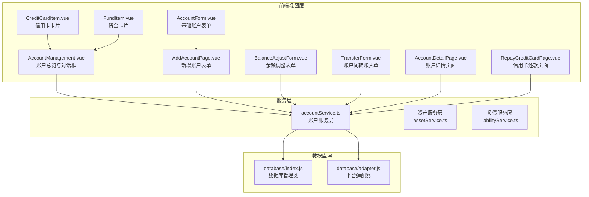
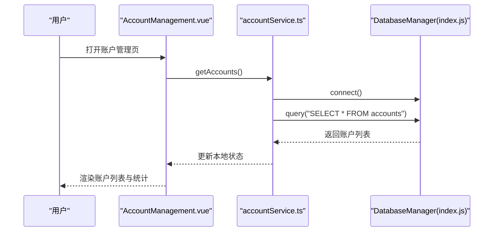
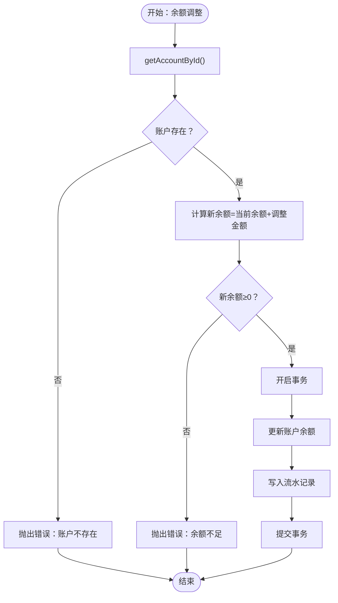
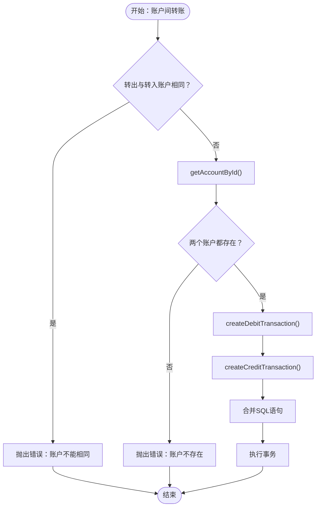
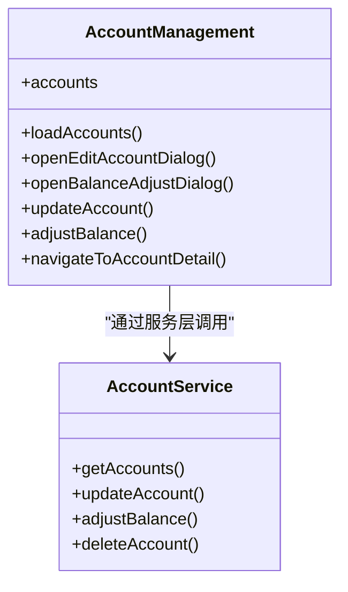
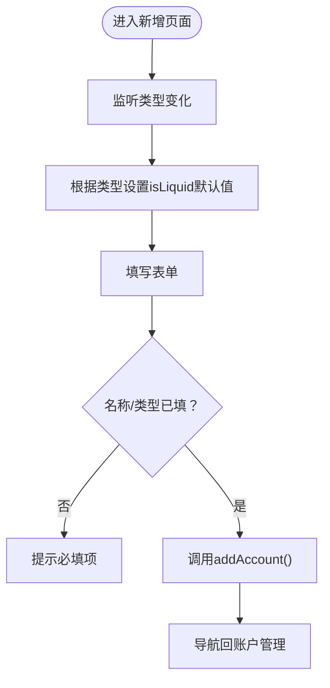
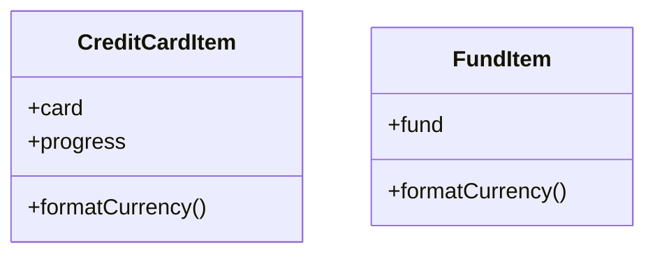
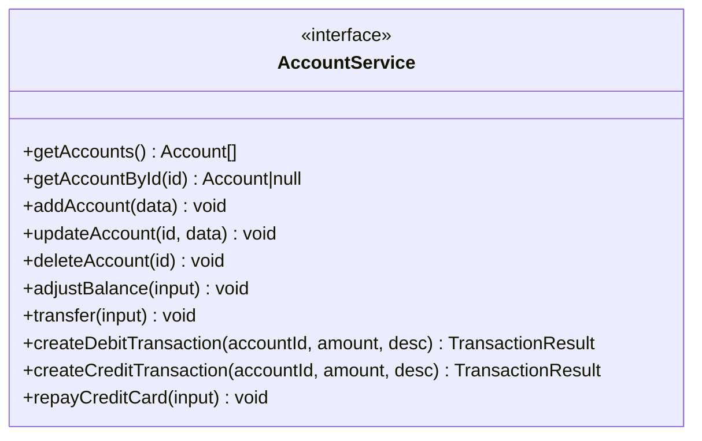
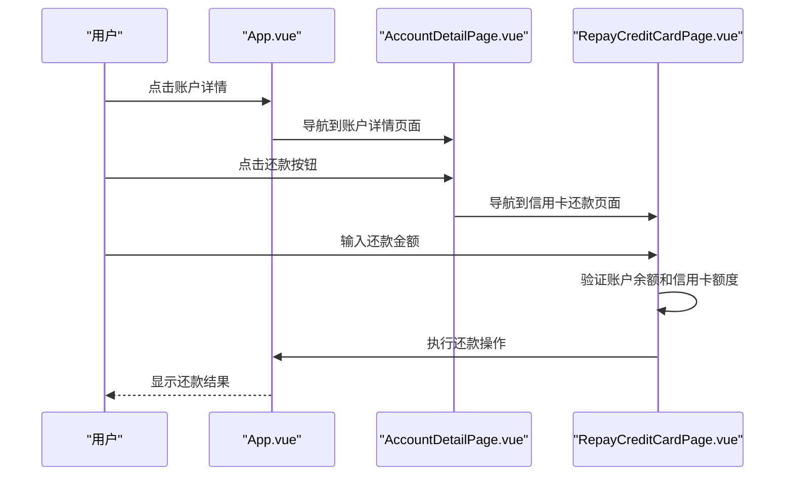

# 账户管理

<cite>
**本文引用的文件**
- [src/services/account/accountService.ts](file://src/services/account/accountService.ts)
- [src/components/mobile/account/AccountManagement.vue](file://src/components/mobile/account/AccountManagement.vue)
- [src/components/mobile/account/AddAccountPage.vue](file://src/components/mobile/account/AddAccountPage.vue)
- [src/components/mobile/account/AccountForm.vue](file://src/components/mobile/account/AccountForm.vue)
- [src/components/mobile/account/BalanceAdjustForm.vue](file://src/components/mobile/account/BalanceAdjustForm.vue)
- [src/components/mobile/account/TransferForm.vue](file://src/components/mobile/account/TransferForm.vue)
- [src/components/mobile/account/CreditCardItem.vue](file://src/components/mobile/account/CreditCardItem.vue)
- [src/components/mobile/account/FundItem.vue](file://src/components/mobile/account/FundItem.vue)
- [src/components/mobile/account/AccountDetailPage.vue](file://src/components/mobile/account/AccountDetailPage.vue)
- [src/components/mobile/account/RepayCreditCardPage.vue](file://src/components/mobile/account/RepayCreditCardPage.vue)
- [src/database/index.js](file://src/database/index.js)
- [src/database/adapter.js](file://src/database/adapter.js)
- [src/main.ts](file://src/main.ts)
- [src/App.vue](file://src/App.vue)
- [package.json](file://package.json)
</cite>

## 更新摘要
**所做更改**
- 更新了服务层架构现代化：AccountManagement.vue已从直接使用store改为通过accountService.ts调用
- 新增了账户详情页面和信用卡还款页面的文档说明
- 更新了组件交互模式和路由配置的说明
- 完善了服务层接口的详细说明和业务逻辑分析

## 目录
1. [简介](#简介)
2. [项目结构](#项目结构)
3. [核心组件](#核心组件)
4. [架构总览](#架构总览)
5. [详细组件分析](#详细组件分析)
6. [服务层架构现代化](#服务层架构现代化)
7. [新增功能模块](#新增功能模块)
8. [依赖分析](#依赖分析)
9. [性能考虑](#性能考虑)
10. [故障排查指南](#故障排查指南)
11. [结论](#结论)
12. [附录](#附录)

## 简介
本文件面向开发者与产品使用者，系统性梳理"账户管理"模块的功能与实现，覆盖账户的创建、编辑、删除、查询，余额调整（手动修正与自动计算）、账户间转账等核心能力；同时给出表单设计与验证逻辑、与数据库层的交互、与收支记录/资产购买等模块的集成关系，以及扩展与定制建议。

**更新** 本版本重点反映了服务层架构现代化升级，AccountManagement.vue已从直接使用store改为通过accountService.ts调用，新增了账户详情页面和信用卡还款页面，组件交互模式得到显著改善。

## 项目结构
账户管理模块由前端视图层、服务层、数据库适配层组成，采用服务层架构替代传统store直接调用，Vue组件负责表单与展示，服务层提供统一的业务逻辑封装，数据库层通过Capacitor SQLite/sql.js在移动端与Web端统一提供持久化能力。

**图表来源**
- [src/components/mobile/account/AccountManagement.vue:151-159](file://src/components/mobile/account/AccountManagement.vue#L151-L159)
- [src/services/account/accountService.ts:1-563](file://src/services/account/accountService.ts#L1-L563)
- [src/components/mobile/account/AccountDetailPage.vue:1-200](file://src/components/mobile/account/AccountDetailPage.vue#L1-L200)
- [src/components/mobile/account/RepayCreditCardPage.vue:1-200](file://src/components/mobile/account/RepayCreditCardPage.vue#L1-L200)

**章节来源**
- [src/App.vue:34-45](file://src/App.vue#L34-L45)
- [src/App.vue:71-101](file://src/App.vue#L71-L101)

## 核心组件
- **账户服务层（accountService.ts）**：封装账户的增删改查、余额调整、转账、出账入账等业务逻辑，负责与数据库层交互并提供统一的服务接口。
- **账户管理页面**：聚合展示净资产、资产/负债统计、信用卡与资金分组，并提供编辑、余额调整等弹窗，现通过服务层调用实现。
- **新增账户页面**：表单校验与提交，联动流动资金开关。
- **余额调整表单**：支持多种调整类型与备注。
- **转账表单**：选择转出/转入账户与金额，触发转账流程。
- **账户详情页面**：展示账户详细信息和交易记录。
- **信用卡还款页面**：专门处理信用卡还款业务。
- **数据库管理**：统一提供连接、查询、执行、事务、批处理等能力，兼容移动端与Web端。

**章节来源**
- [src/services/account/accountService.ts:13-71](file://src/services/account/accountService.ts#L13-L71)
- [src/components/mobile/account/AccountManagement.vue:339-345](file://src/components/mobile/account/AccountManagement.vue#L339-L345)
- [src/components/mobile/account/AccountDetailPage.vue:1-200](file://src/components/mobile/account/AccountDetailPage.vue#L1-L200)
- [src/components/mobile/account/RepayCreditCardPage.vue:1-200](file://src/components/mobile/account/RepayCreditCardPage.vue#L1-L200)

## 架构总览
账户管理遵循"视图-服务-数据"的分层架构：
- **视图层**：Vue组件负责表单渲染与交互。
- **服务层**：accountService.ts封装账户相关的所有业务逻辑，提供统一的API接口。
- **数据访问层**：数据库管理类封装连接、SQL执行、事务与平台适配。

**图表来源**
- [src/components/mobile/account/AccountManagement.vue:339-345](file://src/components/mobile/account/AccountManagement.vue#L339-L345)
- [src/services/account/accountService.ts:131-133](file://src/services/account/accountService.ts#L131-L133)

## 详细组件分析

### 账户服务层（业务逻辑封装）
- **数据模型**：账户接口包含标识、名称、类型、余额、信用卡额度、是否流动资金、备注及时间戳。
- **核心服务方法**：
  - `addAccount()`：新增账户并生成相应的入账/出账记录。
  - `updateAccount()`：按ID更新账户字段。
  - `deleteAccount()`：按ID删除账户。
  - `getAccounts()`：获取所有启用状态的账户列表。
  - `getAccountById()`：按ID获取单个账户信息。
  - `adjustBalance()`：执行余额调整并写入流水。
  - `transfer()`：执行账户间转账并写入两条流水。
  - `createDebitTransaction()`：处理出账业务，支持储蓄账户和信用卡。
  - `createCreditTransaction()`：处理入账业务，支持储蓄账户和信用卡还款。
  - `repayCreditCard()`：专门处理信用卡还款业务。

**图表来源**
- [src/services/account/accountService.ts:331-363](file://src/services/account/accountService.ts#L331-L363)

**图表来源**
- [src/services/account/accountService.ts:368-409](file://src/services/account/accountService.ts#L368-L409)

**章节来源**
- [src/services/account/accountService.ts:13-563](file://src/services/account/accountService.ts#L13-L563)

### 账户管理页面（现代化服务层调用）
- **服务层集成**：AccountManagement.vue现在通过`accountService.ts`提供的API进行数据操作，而非直接使用store。
- **交互改进**：组件间的通信更加清晰，通过emit事件处理导航和数据传递。
- **功能保持**：展示净资产、总资产、总负债、负债率、资产趋势进度条等，分组显示信用卡、流动资金、其他资金，支持展开/收起。
- **服务调用**：使用`getAccounts()`、`updateAccount()`、`adjustBalance()`等服务方法。

**图表来源**
- [src/components/mobile/account/AccountManagement.vue:151-159](file://src/components/mobile/account/AccountManagement.vue#L151-L159)
- [src/services/account/accountService.ts:131-133](file://src/services/account/accountService.ts#L131-L133)

**章节来源**
- [src/components/mobile/account/AccountManagement.vue:339-415](file://src/components/mobile/account/AccountManagement.vue#L339-L415)

### 新增账户页面（表单与验证）
- **表单项**：账户名称、账户类型、余额（非信用卡）、流动资金（非信用卡且非社保卡时可用）、信用卡的已用/总额度、备注。
- **表单联动**：当类型为信用卡或社保卡时，自动禁用流动资金开关。
- **校验规则**：名称与类型必填；提交前进行提示；调用服务层新增账户并导航回账户管理页。

**图表来源**
- [src/components/mobile/account/AddAccountPage.vue:62-69](file://src/components/mobile/account/AddAccountPage.vue#L62-L69)
- [src/components/mobile/account/AddAccountPage.vue:75-96](file://src/components/mobile/account/AddAccountPage.vue#L75-L96)

**章节来源**
- [src/components/mobile/account/AddAccountPage.vue:1-188](file://src/components/mobile/account/AddAccountPage.vue#L1-L188)

### 余额调整表单与转账表单
- **余额调整表单**：选择调整类型（如修正错误、现金赠与、资产盘盈）、输入金额与备注，提交后调用服务层的余额调整动作。
- **转账表单**：选择转出/转入账户、输入金额与备注，提交后调用服务层的转账动作。

**图表来源**
- [src/components/mobile/account/AccountManagement.vue:365-415](file://src/components/mobile/account/AccountManagement.vue#L365-L415)
- [src/services/account/accountService.ts:331-363](file://src/services/account/accountService.ts#L331-L363)

**章节来源**
- [src/components/mobile/account/BalanceAdjustForm.vue:1-41](file://src/components/mobile/account/BalanceAdjustForm.vue#L1-L41)
- [src/components/mobile/account/TransferForm.vue:1-57](file://src/components/mobile/account/TransferForm.vue#L1-L57)

### 信用卡与资金卡片组件
- **信用卡卡片**：展示名称、已用额度、总额度、额度进度条与可用额度；根据名称设置图标与颜色。
- **资金卡片**：展示名称与余额，统一货币格式化。

**图表来源**
- [src/components/mobile/account/CreditCardItem.vue:1-200](file://src/components/mobile/account/CreditCardItem.vue#L1-L200)
- [src/components/mobile/account/FundItem.vue:1-91](file://src/components/mobile/account/FundItem.vue#L1-L91)

**章节来源**
- [src/components/mobile/account/CreditCardItem.vue:1-200](file://src/components/mobile/account/CreditCardItem.vue#L1-L200)
- [src/components/mobile/account/FundItem.vue:1-91](file://src/components/mobile/account/FundItem.vue#L1-L91)

## 服务层架构现代化

### 服务层设计优势
- **单一职责**：accountService.ts集中处理所有账户相关的业务逻辑，避免了store与UI的耦合。
- **可测试性**：服务层提供了清晰的接口，便于单元测试和集成测试。
- **可维护性**：业务逻辑集中在服务层，便于修改和扩展。
- **复用性**：服务层方法可以在多个组件中复用，减少代码重复。

### 服务层接口详解
- **账户管理接口**：`getAccounts()`, `getAccountById()`, `updateAccount()`, `deleteAccount()`
- **余额操作接口**：`adjustBalance()`, `transfer()`
- **交易接口**：`createDebitTransaction()`, `createCreditTransaction()`
- **特殊业务接口**：`repayCreditCard()`, `deactivateAccount()`, `deactivateCreditCard()`

**图表来源**
- [src/services/account/accountService.ts:131-141](file://src/services/account/accountService.ts#L131-L141)
- [src/services/account/accountService.ts:331-409](file://src/services/account/accountService.ts#L331-L409)

**章节来源**
- [src/services/account/accountService.ts:1-563](file://src/services/account/accountService.ts#L1-L563)

## 新增功能模块

### 账户详情页面
- **功能概述**：展示单个账户的详细信息，包括基本信息、交易历史、余额变化等。
- **路由集成**：通过App.vue的路由映射，支持`accountDetail`路由参数传递。
- **数据展示**：显示账户类型、余额、额度、备注等完整信息。
- **交互设计**：支持查看详情、编辑账户、进行余额调整等操作。

### 信用卡还款页面
- **专用功能**：专门处理信用卡还款业务，提供直观的还款界面。
- **业务逻辑**：集成`repayCreditCard()`服务方法，处理还款金额验证、账户余额检查等。
- **用户友好**：提供清晰的还款说明、可用余额显示、还款历史记录等功能。

**图表来源**
- [src/App.vue:75-76](file://src/App.vue#L75-L76)
- [src/App.vue:149-156](file://src/App.vue#L149-L156)

**章节来源**
- [src/components/mobile/account/AccountDetailPage.vue:1-200](file://src/components/mobile/account/AccountDetailPage.vue#L1-L200)
- [src/components/mobile/account/RepayCreditCardPage.vue:1-200](file://src/components/mobile/account/RepayCreditCardPage.vue#L1-L200)
- [src/App.vue:75-76](file://src/App.vue#L75-L76)
- [src/App.vue:149-156](file://src/App.vue#L149-L156)

## 依赖分析
- **前端框架与状态**：Vue 3、Element Plus、Pinia。
- **移动端数据库**：Capacitor SQLite 与 sql.js 双栈支持。
- **项目脚本与构建**：Vite、Electron（桌面端）、Capacitor（移动端）。
- **服务层架构**：新增服务层依赖，提供统一的业务逻辑封装。

**图表来源**
- [package.json:19-36](file://package.json#L19-L36)
- [src/main.ts:1-16](file://src/main.ts#L1-L16)
- [src/services/account/accountService.ts:6](file://src/services/account/accountService.ts#L6)

**章节来源**
- [package.json:1-72](file://package.json#L1-L72)
- [src/main.ts:1-16](file://src/main.ts#L1-L16)

## 性能考虑
- **连接复用与并发控制**：数据库管理类实现单例连接与连接中状态避免重复连接。
- **查询缓存**：支持按 SQL 与参数生成缓存键，减少重复查询。
- **批处理与事务**：余额调整与转账使用事务保证原子性，批处理提升批量写入效率。
- **Web 端持久化节流**：定期保存数据库快照至 localStorage，降低频繁写入成本。
- **服务层缓存**：服务层可以实现业务逻辑缓存，减少重复计算。
- **异步操作优化**：服务层方法采用异步处理，避免阻塞UI线程。

**章节来源**
- [src/database/index.js:21-32](file://src/database/index.js#L21-L32)
- [src/database/index.js:199-264](file://src/database/index.js#L199-L264)
- [src/database/index.js:316-347](file://src/database/index.js#L316-L347)
- [src/database/index.js:354-374](file://src/database/index.js#L354-L374)
- [src/database/index.js:418-776](file://src/database/index.js#L418-L776)

## 故障排查指南
- **常见错误与定位**
  - "账户不存在"：余额调整/转账前会校验账户存在性，检查账户ID与列表数据。
  - "余额不足"：转账时检查转出账户余额；调整时检查新余额不得小于0。
  - "转出账户和转入账户不能相同"：转账时禁止自转。
  - "信用卡可用额度不足"：信用卡出账时检查可用额度。
  - "账户已停用"：检查账户状态，确保账户处于启用状态。
  - 服务层调用失败：检查网络连接和数据库连接状态。
- **日志与调试**
  - 服务层方法中对关键步骤打印日志，便于定位问题。
  - 数据库管理类提供调试开关与详细日志输出。
  - Vue组件中通过console.log输出服务层调用结果。
- **建议排查步骤**
  - 确认服务层方法调用成功，检查返回值。
  - 检查表单输入是否满足必填与类型要求。
  - 查看控制台错误与服务层异常信息。
  - 验证数据库表结构与索引是否存在。
  - 检查路由参数传递是否正确。

**章节来源**
- [src/services/account/accountService.ts:172-179](file://src/services/account/accountService.ts#L172-L179)
- [src/services/account/accountService.ts:387-393](file://src/services/account/accountService.ts#L387-L393)
- [src/services/account/accountService.ts:494-501](file://src/services/account/accountService.ts#L494-L501)
- [src/database/index.js:37-50](file://src/database/index.js#L37-L50)

## 结论
账户管理模块经过服务层架构现代化升级，实现了更加清晰的分层设计和更好的可维护性。通过accountService.ts统一提供业务逻辑封装，组件间的交互更加规范，新增的账户详情页面和信用卡还款页面进一步完善了用户体验。服务层架构不仅提升了代码质量，还为后续的功能扩展和业务发展奠定了坚实基础。

## 附录

### API 与数据模型说明（基于服务层架构）
- **账户接口（Account）**
  - 字段：id、name、type、balance、used_limit、total_limit、is_liquid、remark、status、created_at、updated_at
  - 说明：余额与额度为数值型；is_liquid用于区分流动资金；新增status字段控制账户启用状态。
- **服务层方法**
  - `getAccounts()`: 获取所有启用状态的账户列表。
  - `getAccountById(id)`: 按ID获取单个账户信息。
  - `addAccount(account)`: 新增账户并生成相应交易记录。
  - `updateAccount(id, data)`: 按id更新账户字段。
  - `deleteAccount(id)`: 按id删除账户。
  - `adjustBalance(input)`: 执行余额调整并写入流水。
  - `transfer(input)`: 执行转账并写入两条流水。
  - `repayCreditCard(input)`: 处理信用卡还款业务。
- **数据库表**
  - accounts：账户主表，包含余额、额度、流动资金标记、状态等。
  - account_transactions：账户交易流水表，记录类型、金额、账户关联、余额后值与备注等。

**章节来源**
- [src/services/account/accountService.ts:11-141](file://src/services/account/accountService.ts#L11-L141)
- [src/services/account/accountService.ts:131-133](file://src/services/account/accountService.ts#L131-L133)
- [src/services/account/accountService.ts:331-409](file://src/services/account/accountService.ts#L331-L409)
- [src/database/index.js:434-448](file://src/database/index.js#L434-L448)
- [src/database/index.js:452-466](file://src/database/index.js#L452-L466)

### 使用示例与最佳实践
- **新增账户**
  - 步骤：打开新增页面 → 填写表单 → 自动联动流动资金 → 调用addAccount() → 导航回账户管理 → 列表刷新。
  - 注意：信用卡/社保卡类型下流动资金不可用。
- **余额调整**
  - 步骤：打开调整对话框 → 选择类型/输入金额/备注 → 调用adjustBalance() → 事务写入 → 列表刷新。
  - 注意：调整后余额不得为负。
- **账户间转账**
  - 步骤：选择转出/转入账户 → 输入金额 → 调用transfer() → 事务更新两账户余额并写入两条流水 → 列表刷新。
  - 注意：账户必须不同，且转出账户余额充足。
- **信用卡还款**
  - 步骤：选择信用卡 → 选择还款来源账户 → 输入还款金额 → 调用repayCreditCard() → 事务更新两账户余额 → 列表刷新。
  - 注意：还款金额不能超过信用卡已用额度，且来源账户余额充足。
- **与收支记录/资产购买的集成**
  - 收支记录：通过account_transactions表关联账户，实现收支与账户余额联动。
  - 资产购买：资产表assets与账户表accounts通过外键关联，便于统计与报表。

**章节来源**
- [src/components/mobile/account/AddAccountPage.vue:62-96](file://src/components/mobile/account/AddAccountPage.vue#L62-L96)
- [src/components/mobile/account/AccountManagement.vue:365-415](file://src/components/mobile/account/AccountManagement.vue#L365-L415)
- [src/services/account/accountService.ts:331-409](file://src/services/account/accountService.ts#L331-L409)
- [src/database/index.js:452-466](file://src/database/index.js#L452-L466)
- [src/database/index.js:469-482](file://src/database/index.js#L469-L482)

### 扩展与定制建议
- **服务层扩展**：在accountService.ts中增加新业务方法，保持现有接口不变。
- **账户类型扩展**：在表单与服务层中增加新类型，数据库层同步新增字段或通过扩展字段存储。
- **额度与利息**：为信用卡类型增加利息计算与还款计划，结合负债模块联动。
- **流水细化**：在account_transactions表中引入子类型、状态、关联ID等，增强收支追踪。
- **权限与审计**：为账户操作增加操作人、时间戳与审计日志字段。
- **性能优化**：对高频查询建立复合索引，启用更细粒度的缓存策略。
- **错误处理**：完善服务层的错误处理机制，提供更友好的用户反馈。
- **国际化支持**：为服务层方法添加多语言支持，提升国际化能力。