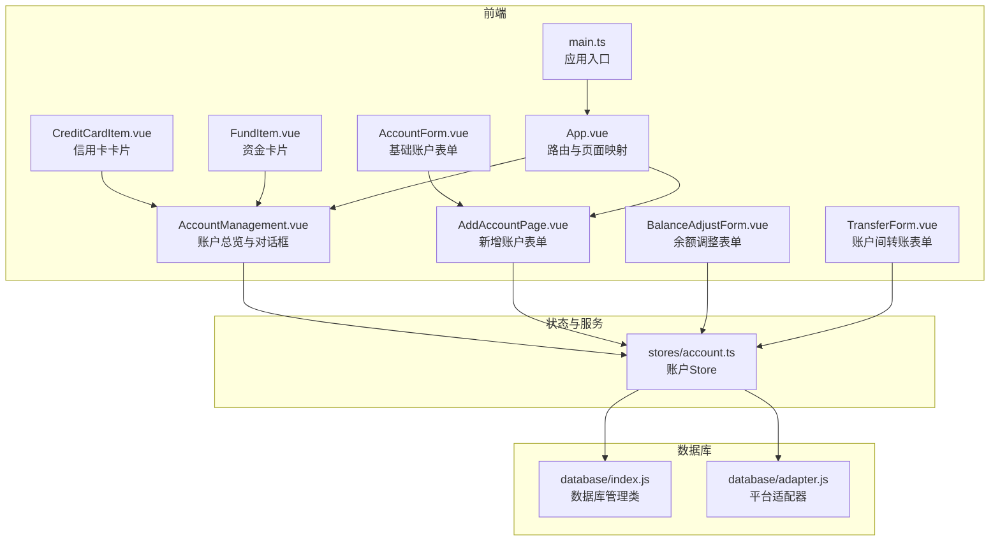
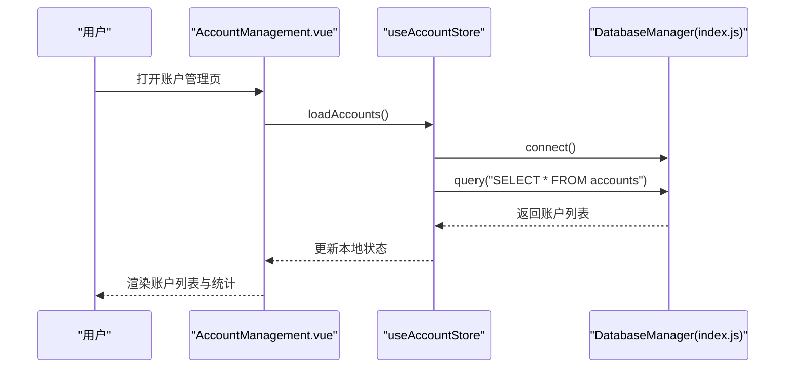
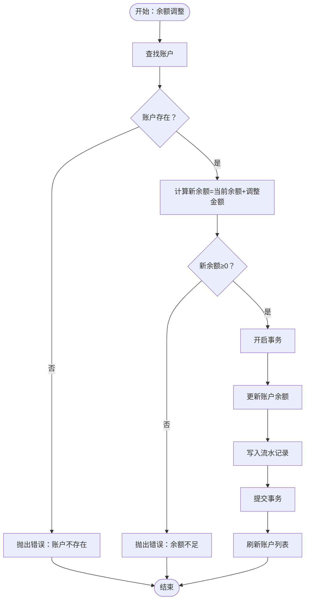
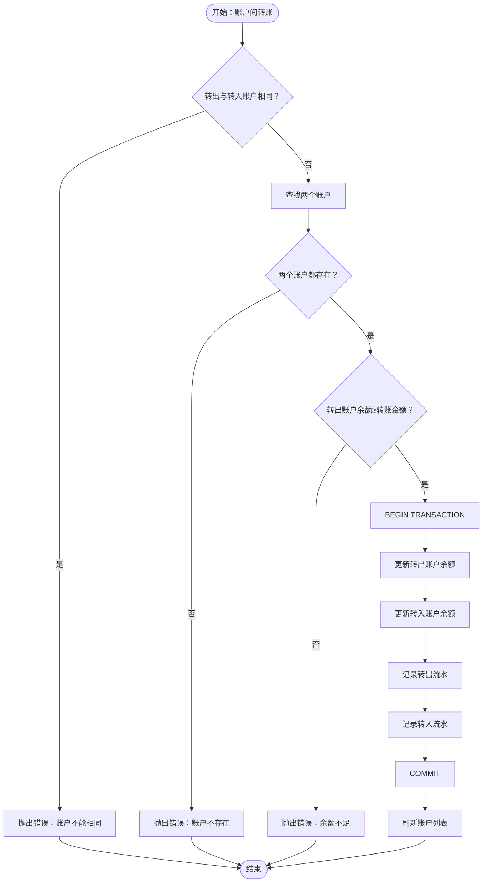
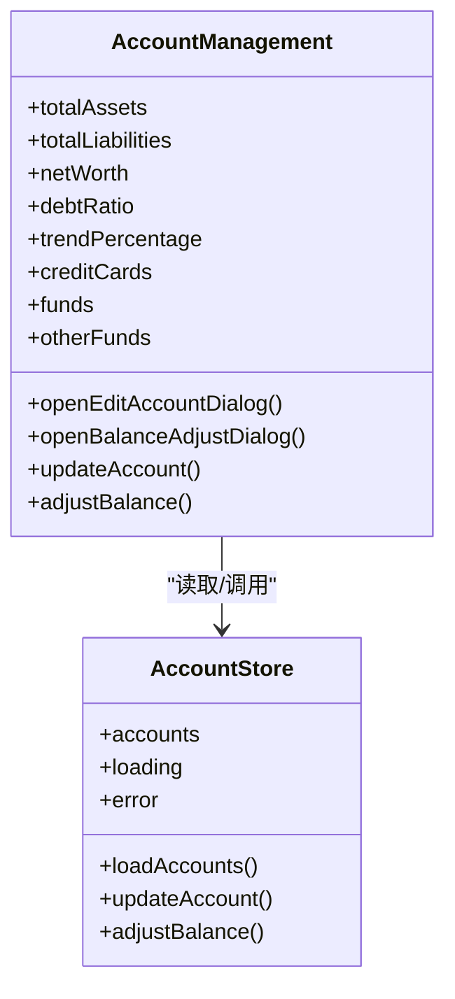
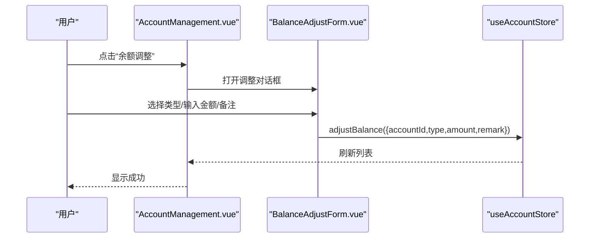
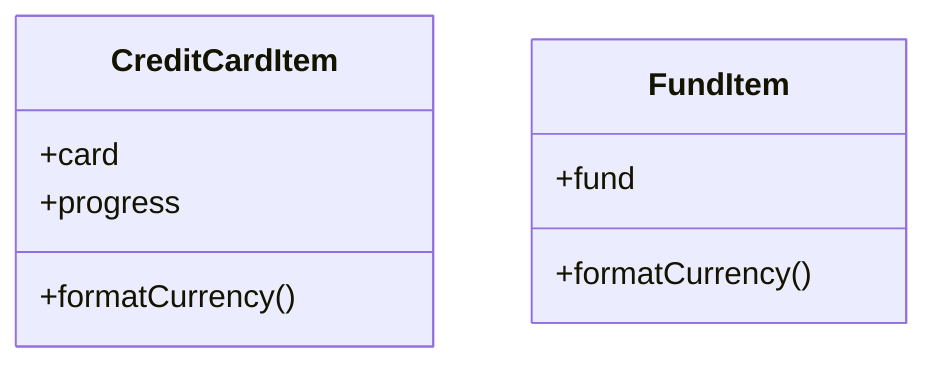
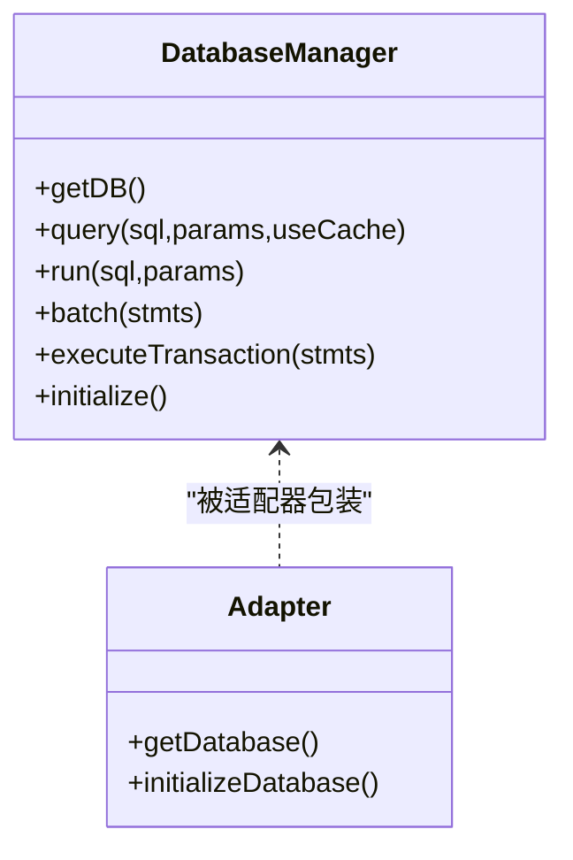
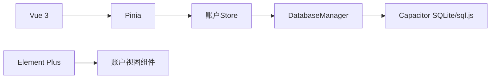

# 账户管理

<cite>
**本文引用的文件**
- [src/stores/account.ts](file://src/stores/account.ts)
- [src/components/mobile/account/AccountManagement.vue](file://src/components/mobile/account/AccountManagement.vue)
- [src/components/mobile/account/AddAccountPage.vue](file://src/components/mobile/account/AddAccountPage.vue)
- [src/components/mobile/account/AccountForm.vue](file://src/components/mobile/account/AccountForm.vue)
- [src/components/mobile/account/BalanceAdjustForm.vue](file://src/components/mobile/account/BalanceAdjustForm.vue)
- [src/components/mobile/account/TransferForm.vue](file://src/components/mobile/account/TransferForm.vue)
- [src/components/mobile/account/CreditCardItem.vue](file://src/components/mobile/account/CreditCardItem.vue)
- [src/components/mobile/account/FundItem.vue](file://src/components/mobile/account/FundItem.vue)
- [src/database/index.js](file://src/database/index.js)
- [src/database/adapter.js](file://src/database/adapter.js)
- [src/main.ts](file://src/main.ts)
- [src/App.vue](file://src/App.vue)
- [package.json](file://package.json)
</cite>

## 目录
1. [简介](#简介)
2. [项目结构](#项目结构)
3. [核心组件](#核心组件)
4. [架构总览](#架构总览)
5. [详细组件分析](#详细组件分析)
6. [依赖分析](#依赖分析)
7. [性能考虑](#性能考虑)
8. [故障排查指南](#故障排查指南)
9. [结论](#结论)
10. [附录](#附录)

## 简介
本文件面向开发者与产品使用者，系统性梳理“账户管理”模块的功能与实现，覆盖账户的创建、编辑、删除、查询，余额调整（手动修正与自动计算）、账户间转账等核心能力；同时给出表单设计与验证逻辑、与数据库层的交互、与收支记录/资产购买等模块的集成关系，以及扩展与定制建议。

## 项目结构
账户管理模块由前端状态与视图层、数据库适配层组成，采用 Pinia Store 管理账户状态，Vue 组件负责表单与展示，数据库层通过 Capacitor SQLite/sql.js 在移动端与 Web 端统一提供持久化能力。

**图表来源**
- [src/components/mobile/account/AccountManagement.vue:1-650](file://src/components/mobile/account/AccountManagement.vue#L1-L650)
- [src/components/mobile/account/AddAccountPage.vue:1-188](file://src/components/mobile/account/AddAccountPage.vue#L1-L188)
- [src/components/mobile/account/AccountForm.vue:1-44](file://src/components/mobile/account/AccountForm.vue#L1-L44)
- [src/components/mobile/account/BalanceAdjustForm.vue:1-41](file://src/components/mobile/account/BalanceAdjustForm.vue#L1-L41)
- [src/components/mobile/account/TransferForm.vue:1-57](file://src/components/mobile/account/TransferForm.vue#L1-L57)
- [src/components/mobile/account/CreditCardItem.vue:1-200](file://src/components/mobile/account/CreditCardItem.vue#L1-L200)
- [src/components/mobile/account/FundItem.vue:1-91](file://src/components/mobile/account/FundItem.vue#L1-L91)
- [src/stores/account.ts:1-273](file://src/stores/account.ts#L1-L273)
- [src/database/index.js:1-935](file://src/database/index.js#L1-L935)
- [src/database/adapter.js:1-34](file://src/database/adapter.js#L1-L34)
- [src/main.ts:1-16](file://src/main.ts#L1-L16)
- [src/App.vue:33-87](file://src/App.vue#L33-L87)

**章节来源**
- [src/main.ts:1-16](file://src/main.ts#L1-L16)
- [src/App.vue:33-87](file://src/App.vue#L33-L87)

## 核心组件
- 账户Store（Pinia）：封装账户的增删改查、余额调整、转账等动作，负责与数据库层交互并维护本地状态。
- 账户管理页面：聚合展示净资产、资产/负债统计、信用卡与资金分组，并提供编辑、余额调整等弹窗。
- 新增账户页面：表单校验与提交，联动流动资金开关。
- 余额调整表单：支持多种调整类型与备注。
- 转账表单：选择转出/转入账户与金额，触发转账流程。
- 数据库管理：统一提供连接、查询、执行、事务、批处理等能力，兼容移动端与Web端。

**章节来源**
- [src/stores/account.ts:1-273](file://src/stores/account.ts#L1-L273)
- [src/components/mobile/account/AccountManagement.vue:1-650](file://src/components/mobile/account/AccountManagement.vue#L1-L650)
- [src/components/mobile/account/AddAccountPage.vue:1-188](file://src/components/mobile/account/AddAccountPage.vue#L1-L188)
- [src/components/mobile/account/BalanceAdjustForm.vue:1-41](file://src/components/mobile/account/BalanceAdjustForm.vue#L1-L41)
- [src/components/mobile/account/TransferForm.vue:1-57](file://src/components/mobile/account/TransferForm.vue#L1-L57)
- [src/database/index.js:1-935](file://src/database/index.js#L1-L935)

## 架构总览
账户管理遵循“视图-状态-数据”的分层：
- 视图层：Vue 组件负责表单渲染与交互。
- 状态层：Pinia Store 维护账户列表、加载与错误状态。
- 数据访问层：数据库管理类封装连接、SQL 执行、事务与平台适配。

**图表来源**
- [src/components/mobile/account/AccountManagement.vue:334-340](file://src/components/mobile/account/AccountManagement.vue#L334-L340)
- [src/stores/account.ts:38-53](file://src/stores/account.ts#L38-L53)
- [src/database/index.js:56-190](file://src/database/index.js#L56-L190)

## 详细组件分析

### 账户Store（账户生命周期与业务逻辑）
- 数据模型：账户接口包含标识、名称、类型、余额、信用卡额度、是否流动资金、备注及时间戳。
- 核心动作：
  - 加载账户：连接数据库，查询 accounts 表，更新本地状态。
  - 新增账户：生成唯一ID，准备数据，插入记录，刷新列表。
  - 更新账户：按ID更新字段，刷新列表。
  - 删除账户：按ID删除，刷新列表。
  - 余额调整：校验账户存在与余额非负，使用事务更新余额并写入流水。
  - 账户间转账：校验账户不同、余额充足，开启事务，分别更新两账户余额并写两条流水，异常时回滚。

**图表来源**
- [src/stores/account.ts:145-185](file://src/stores/account.ts#L145-L185)

**图表来源**
- [src/stores/account.ts:191-270](file://src/stores/account.ts#L191-L270)

**章节来源**
- [src/stores/account.ts:11-273](file://src/stores/account.ts#L11-L273)

### 账户管理页面（视图与统计）
- 展示净资产、总资产、总负债、负债率、资产趋势进度条等。
- 分组显示信用卡、流动资金、其他资金，支持展开/收起。
- 提供编辑对话框（名称、类型、余额/额度、流动资金、备注）与余额调整对话框（类型、金额、备注）。
- 与Store交互：打开对话框、提交更新、执行余额调整。

**图表来源**
- [src/components/mobile/account/AccountManagement.vue:1-650](file://src/components/mobile/account/AccountManagement.vue#L1-L650)
- [src/stores/account.ts:27-32](file://src/stores/account.ts#L27-L32)

**章节来源**
- [src/components/mobile/account/AccountManagement.vue:1-650](file://src/components/mobile/account/AccountManagement.vue#L1-L650)

### 新增账户页面（表单与验证）
- 表单项：账户名称、账户类型、余额（非信用卡）、流动资金（非信用卡且非社保卡时可用）、信用卡的已用/总额度、备注。
- 表单联动：当类型为信用卡或社保卡时，自动禁用流动资金开关。
- 校验规则：名称与类型必填；提交前进行提示；调用Store新增账户并导航回账户管理页。

**图表来源**
- [src/components/mobile/account/AddAccountPage.vue:62-69](file://src/components/mobile/account/AddAccountPage.vue#L62-L69)
- [src/components/mobile/account/AddAccountPage.vue:75-96](file://src/components/mobile/account/AddAccountPage.vue#L75-L96)

**章节来源**
- [src/components/mobile/account/AddAccountPage.vue:1-188](file://src/components/mobile/account/AddAccountPage.vue#L1-L188)

### 余额调整表单与转账表单
- 余额调整表单：选择调整类型（如修正错误、现金赠与、资产盘盈）、输入金额与备注，提交后调用Store的余额调整动作。
- 转账表单：选择转出/转入账户、输入金额与备注，提交后调用Store的转账动作。

**图表来源**
- [src/components/mobile/account/AccountManagement.vue:352-376](file://src/components/mobile/account/AccountManagement.vue#L352-L376)
- [src/components/mobile/account/BalanceAdjustForm.vue:1-41](file://src/components/mobile/account/BalanceAdjustForm.vue#L1-L41)
- [src/stores/account.ts:145-185](file://src/stores/account.ts#L145-L185)

**章节来源**
- [src/components/mobile/account/BalanceAdjustForm.vue:1-41](file://src/components/mobile/account/BalanceAdjustForm.vue#L1-L41)
- [src/components/mobile/account/TransferForm.vue:1-57](file://src/components/mobile/account/TransferForm.vue#L1-L57)

### 信用卡与资金卡片组件
- 信用卡卡片：展示名称、已用额度、总额度、额度进度条与可用额度；根据名称设置图标与颜色。
- 资金卡片：展示名称与余额，统一货币格式化。

**图表来源**
- [src/components/mobile/account/CreditCardItem.vue:1-200](file://src/components/mobile/account/CreditCardItem.vue#L1-L200)
- [src/components/mobile/account/FundItem.vue:1-91](file://src/components/mobile/account/FundItem.vue#L1-L91)

**章节来源**
- [src/components/mobile/account/CreditCardItem.vue:1-200](file://src/components/mobile/account/CreditCardItem.vue#L1-L200)
- [src/components/mobile/account/FundItem.vue:1-91](file://src/components/mobile/account/FundItem.vue#L1-L91)

### 数据库层（统一适配与事务）
- 数据库管理类：单例连接、平台检测（原生/Web）、SQL.js 初始化、查询/执行/批处理/事务封装、缓存与持久化策略。
- 适配器：根据平台返回对应数据库实现，保证上层一致调用。
- 账户Store通过数据库管理类执行 SQL 与事务，确保数据一致性。

**图表来源**
- [src/database/index.js:21-374](file://src/database/index.js#L21-L374)
- [src/database/adapter.js:1-34](file://src/database/adapter.js#L1-L34)

**章节来源**
- [src/database/index.js:1-935](file://src/database/index.js#L1-L935)
- [src/database/adapter.js:1-34](file://src/database/adapter.js#L1-L34)

## 依赖分析
- 前端框架与状态：Vue 3、Element Plus、Pinia。
- 移动端数据库：Capacitor SQLite 与 sql.js 双栈支持。
- 项目脚本与构建：Vite、Electron（桌面端）、Capacitor（移动端）。

**图表来源**
- [package.json:19-36](file://package.json#L19-L36)
- [src/main.ts:1-16](file://src/main.ts#L1-L16)
- [src/stores/account.ts:5-6](file://src/stores/account.ts#L5-L6)
- [src/database/index.js:8-10](file://src/database/index.js#L8-L10)

**章节来源**
- [package.json:1-72](file://package.json#L1-L72)
- [src/main.ts:1-16](file://src/main.ts#L1-L16)

## 性能考虑
- 连接复用与并发控制：数据库管理类实现单例连接与连接中状态避免重复连接。
- 查询缓存：支持按 SQL 与参数生成缓存键，减少重复查询。
- 批处理与事务：余额调整与转账使用事务保证原子性，批处理提升批量写入效率。
- Web 端持久化节流：定期保存数据库快照至 localStorage，降低频繁写入成本。
- 索引优化：对常用查询字段建立索引，加速查询。

**章节来源**
- [src/database/index.js:21-32](file://src/database/index.js#L21-L32)
- [src/database/index.js:199-264](file://src/database/index.js#L199-L264)
- [src/database/index.js:316-347](file://src/database/index.js#L316-L347)
- [src/database/index.js:354-374](file://src/database/index.js#L354-L374)
- [src/database/index.js:418-776](file://src/database/index.js#L418-L776)

## 故障排查指南
- 常见错误与定位
  - “账户不存在”：余额调整/转账前会校验账户存在性，检查账户ID与列表数据。
  - “余额不足”：转账时检查转出账户余额；调整时检查新余额不得小于0。
  - “转出账户和转入账户不能相同”：转账时禁止自转。
  - 数据库连接失败：确认平台适配器与数据库初始化流程，检查 Capacitor SQLite/sql.js 初始化日志。
- 日志与调试
  - Store 中对关键步骤打印日志，便于定位问题。
  - 数据库管理类提供调试开关与详细日志输出。
- 建议排查步骤
  - 确认账户Store已加载最新数据。
  - 检查表单输入是否满足必填与类型要求。
  - 查看控制台错误与数据库层异常信息。
  - 验证数据库表结构与索引是否存在。

**章节来源**
- [src/stores/account.ts:150-159](file://src/stores/account.ts#L150-L159)
- [src/stores/account.ts:196-211](file://src/stores/account.ts#L196-L211)
- [src/database/index.js:37-50](file://src/database/index.js#L37-L50)
- [src/database/index.js:214-264](file://src/database/index.js#L214-L264)

## 结论
账户管理模块以清晰的分层设计实现了账户全生命周期管理与核心业务逻辑（余额调整、转账），配合统一的数据库层适配，兼顾移动端与Web端的一致体验。通过表单联动与校验、事务与缓存优化，保障了数据一致性与性能。后续可在账户类型扩展、额度与利息计算、与收支/资产模块的深度联动等方面持续演进。

## 附录

### API 与数据模型说明（基于源码行为）
- 账户接口（Account）
  - 字段：id、name、type、balance、used_limit、total_limit、is_liquid、remark、created_at、updated_at
  - 说明：余额与额度为数值型；is_liquid 用于区分流动资金；信用卡类型包含额度字段。
- Store 动作
  - loadAccounts(): 无参数，返回账户列表。
  - addAccount(account): account 包含 name、type、balance、used_limit、total_limit、is_liquid、remark。
  - updateAccount(account): 按 id 更新字段。
  - deleteAccount(id): 按 id 删除。
  - adjustBalance({accountId, type, amount, remark}): 执行余额调整并写入流水。
  - transfer({fromAccountId, toAccountId, amount, remark}): 执行转账并写入两条流水。
- 数据库表
  - accounts：账户主表，包含余额、额度、流动资金标记等。
  - transactions：流水表，记录类型、金额、账户关联、余额后值与备注等。

**章节来源**
- [src/stores/account.ts:11-22](file://src/stores/account.ts#L11-L22)
- [src/stores/account.ts:38-139](file://src/stores/account.ts#L38-L139)
- [src/stores/account.ts:145-270](file://src/stores/account.ts#L145-L270)
- [src/database/index.js:434-448](file://src/database/index.js#L434-L448)
- [src/database/index.js:452-466](file://src/database/index.js#L452-L466)

### 使用示例与最佳实践
- 新增账户
  - 步骤：打开新增页面 → 填写表单 → 自动联动流动资金 → 提交 → 导航回账户管理 → 列表刷新。
  - 注意：信用卡/社保卡类型下流动资金不可用。
- 余额调整
  - 步骤：打开调整对话框 → 选择类型/输入金额/备注 → 提交 → 事务写入 → 列表刷新。
  - 注意：调整后余额不得为负。
- 账户间转账
  - 步骤：选择转出/转入账户 → 输入金额 → 提交 → 事务更新两账户余额并写入两条流水 → 列表刷新。
  - 注意：账户必须不同，且转出账户余额充足。
- 与收支记录/资产购买的集成
  - 收支记录：可通过流水表 transactions 关联账户，实现收支与账户余额联动。
  - 资产购买：资产表 assets 与账户表 accounts 通过外键关联，便于统计与报表。

**章节来源**
- [src/components/mobile/account/AddAccountPage.vue:62-96](file://src/components/mobile/account/AddAccountPage.vue#L62-L96)
- [src/components/mobile/account/AccountManagement.vue:352-376](file://src/components/mobile/account/AccountManagement.vue#L352-L376)
- [src/stores/account.ts:145-270](file://src/stores/account.ts#L145-L270)
- [src/database/index.js:452-466](file://src/database/index.js#L452-L466)
- [src/database/index.js:469-482](file://src/database/index.js#L469-L482)

### 扩展与定制建议
- 账户类型扩展：在表单与Store中增加新类型，数据库层同步新增字段或通过扩展字段存储。
- 额度与利息：为信用卡类型增加利息计算与还款计划，结合负债模块联动。
- 流水细化：在 transactions 表中引入子类型、状态、关联ID等，增强收支追踪。
- 权限与审计：为账户操作增加操作人、时间戳与审计日志字段。
- 性能优化：对高频查询建立复合索引，启用更细粒度的缓存策略。

[本节为通用建议，无需具体文件引用]