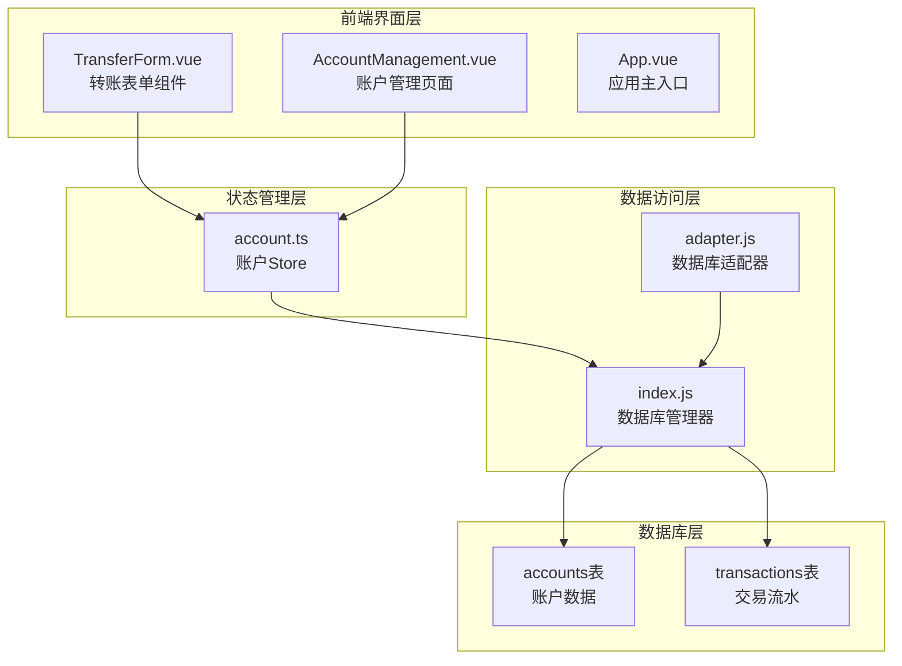
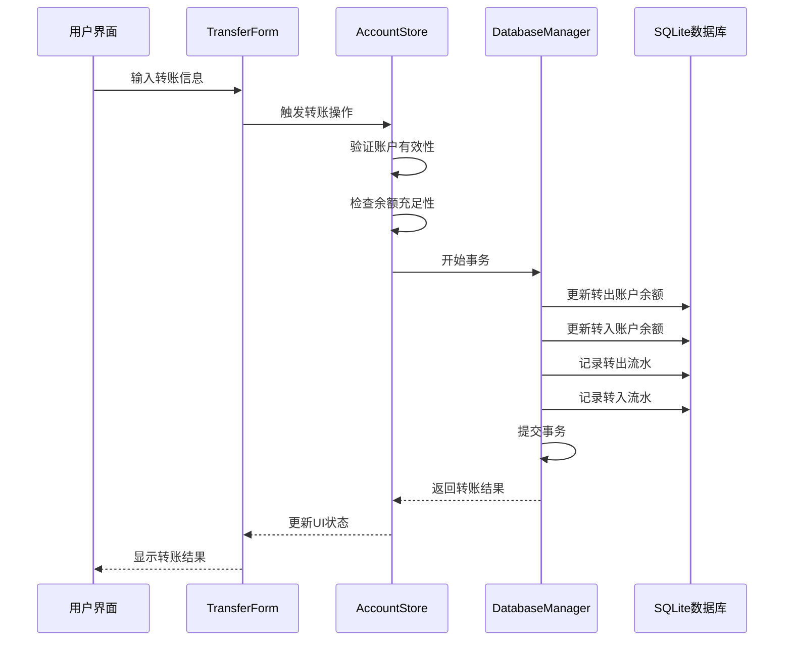
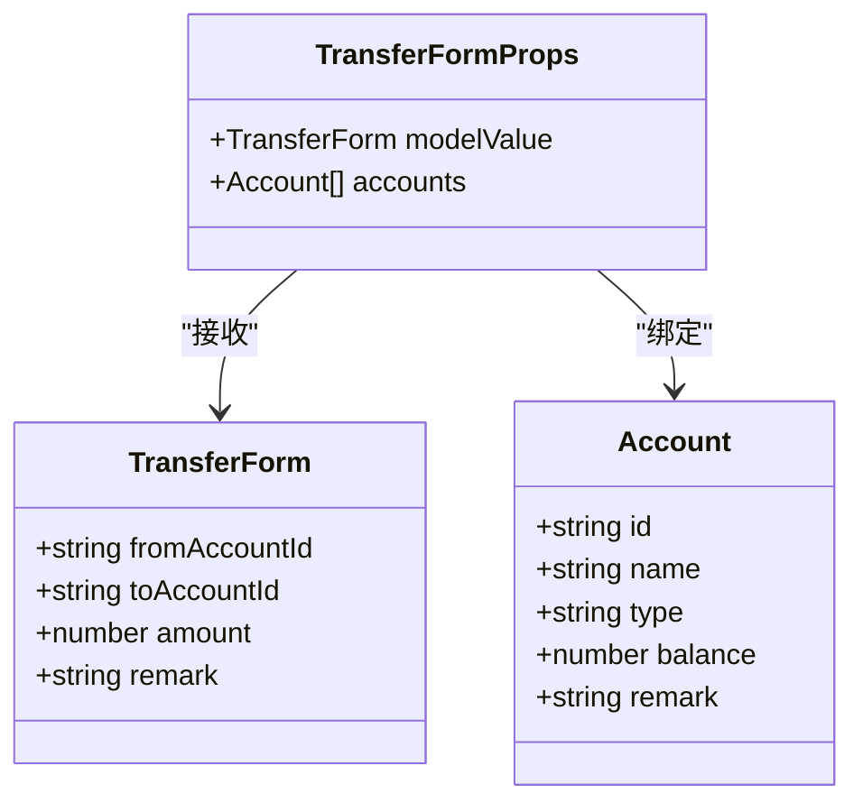
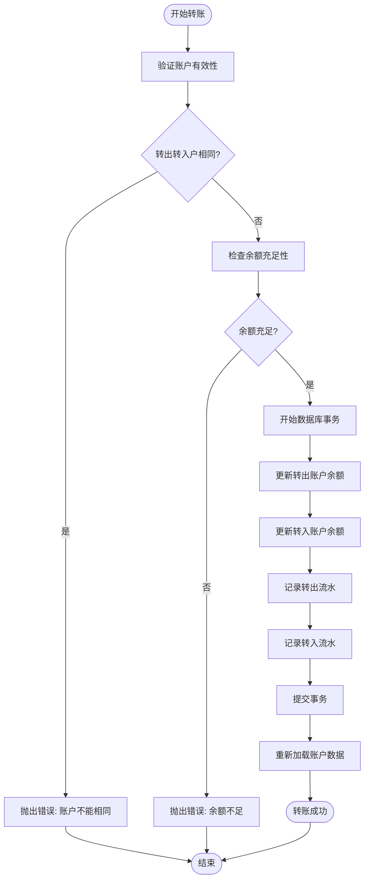
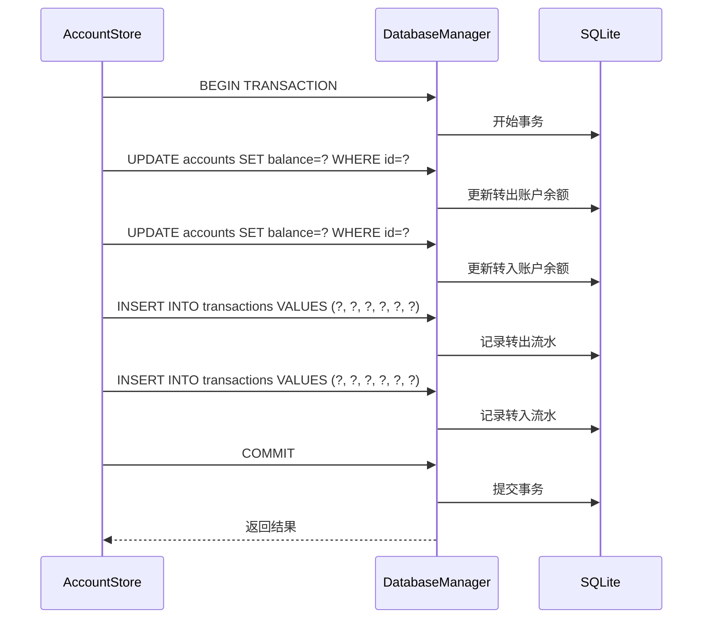
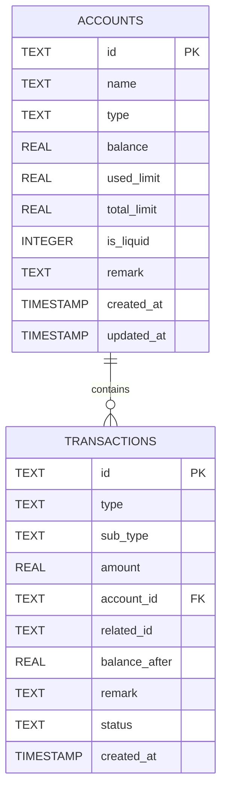
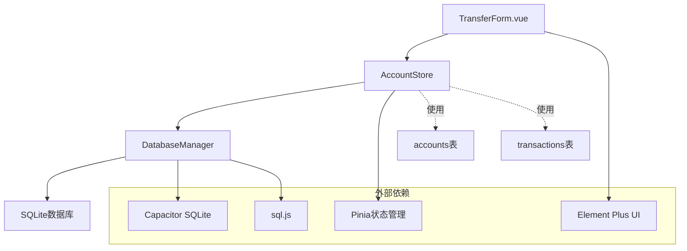

# 账户转账功能

<cite>
**本文档引用的文件**
- [TransferForm.vue](file://src/components/mobile/account/TransferForm.vue)
- [account.ts](file://src/stores/account.ts)
- [index.js](file://src/database/index.js)
- [adapter.js](file://src/database/adapter.js)
- [AccountManagement.vue](file://src/components/mobile/account/AccountManagement.vue)
- [App.vue](file://src/App.vue)
</cite>

## 目录
1. [简介](#简介)
2. [项目结构](#项目结构)
3. [核心组件](#核心组件)
4. [架构概览](#架构概览)
5. [详细组件分析](#详细组件分析)
6. [依赖关系分析](#依赖关系分析)
7. [性能考虑](#性能考虑)
8. [故障排除指南](#故障排除指南)
9. [结论](#结论)
10. [附录](#附录)

## 简介

本文件详细说明了财务应用中的账户转账功能。该功能允许用户在系统内的不同账户之间进行资金转移，包含完整的前端界面、数据验证、数据库操作和事务处理机制。转账功能采用Vue 3 Composition API构建，使用Pinia状态管理，通过SQLite数据库实现数据持久化，并具备跨平台支持能力。

## 项目结构

财务应用采用模块化架构，转账功能主要涉及以下关键文件：

**图表来源**
- [TransferForm.vue:1-57](file://src/components/mobile/account/TransferForm.vue#L1-L57)
- [account.ts:27-273](file://src/stores/account.ts#L27-L273)
- [index.js:21-935](file://src/database/index.js#L21-L935)

**章节来源**
- [TransferForm.vue:1-57](file://src/components/mobile/account/TransferForm.vue#L1-L57)
- [account.ts:27-273](file://src/stores/account.ts#L27-L273)
- [index.js:431-467](file://src/database/index.js#L431-L467)

## 核心组件

转账功能由三个核心组件协同工作：

### TransferForm.vue - 转账表单组件
负责用户界面交互，提供转出账户选择、转入账户选择、转账金额输入和备注功能。

### account.ts - 账户Store
管理账户数据状态，提供转账操作的核心逻辑，包括数据验证和事务处理。

### 数据库管理器 - index.js
提供统一的数据库访问接口，支持原生平台和Web平台的不同实现。

**章节来源**
- [TransferForm.vue:25-57](file://src/components/mobile/account/TransferForm.vue#L25-L57)
- [account.ts:27-273](file://src/stores/account.ts#L27-L273)
- [index.js:21-935](file://src/database/index.js#L21-L935)

## 架构概览

转账功能采用分层架构设计，确保职责分离和代码可维护性：

**图表来源**
- [TransferForm.vue:19-21](file://src/components/mobile/account/TransferForm.vue#L19-L21)
- [account.ts:191-270](file://src/stores/account.ts#L191-L270)
- [index.js:354-374](file://src/database/index.js#L354-L374)

## 详细组件分析

### TransferForm.vue 组件分析

TransferForm.vue是一个基于Element Plus的响应式表单组件，提供直观的转账操作界面。

#### 组件结构
- **转出账户选择**：使用下拉选择框，动态绑定可用账户列表
- **转入账户选择**：独立的下拉选择框，与转出账户互不影响
- **转账金额输入**：数字输入框，支持小数点后两位精度
- **备注字段**：文本输入框，用于记录转账说明

#### 数据绑定机制
组件采用Vue 3的Composition API，通过`defineProps`和`defineEmits`定义接口：

**图表来源**
- [TransferForm.vue:28-46](file://src/components/mobile/account/TransferForm.vue#L28-L46)

#### 表单验证逻辑
组件通过Element Plus的内置验证机制实现基础验证：
- 账户选择必填验证
- 金额输入范围验证（≥0）
- 步长控制（0.01）

**章节来源**
- [TransferForm.vue:1-57](file://src/components/mobile/account/TransferForm.vue#L1-L57)

### 账户Store - 转账核心逻辑

AccountStore是转账功能的核心，实现了完整的业务逻辑和数据验证。

#### 转账操作流程
转账操作通过`transfer`方法实现，包含以下关键步骤：

**图表来源**
- [account.ts:191-270](file://src/stores/account.ts#L191-L270)

#### 数据验证规则
转账功能实施多层次的数据验证：

1. **账户有效性检查**
   - 验证转出账户和转入账户是否存在
   - 确保两个账户不是同一个账户

2. **余额充足性验证**
   - 比较账户余额与转账金额
   - 确保转出账户余额大于等于转账金额

3. **金额格式验证**
   - 支持小数点后两位精度
   - 确保金额为正数

**章节来源**
- [account.ts:191-211](file://src/stores/account.ts#L191-L211)

### 数据库事务处理

转账操作采用数据库事务确保数据一致性，使用原生SQLite的事务特性：

#### 事务执行策略

**图表来源**
- [account.ts:217-246](file://src/stores/account.ts#L217-L246)
- [index.js:354-374](file://src/database/index.js#L354-L374)

#### 事务回滚机制
系统实现完善的错误处理和事务回滚：
- 捕获任何阶段的异常
- 自动执行事务回滚
- 清理事务状态
- 提供详细的错误信息

**章节来源**
- [account.ts:256-265](file://src/stores/account.ts#L256-L265)

### 数据库架构设计

系统使用SQLite作为数据存储，支持原生平台和Web平台：

#### 数据表结构

**图表来源**
- [index.js:437-466](file://src/database/index.js#L437-L466)

#### 跨平台支持
数据库适配器提供统一接口，支持不同平台：
- **原生平台**：使用Capacitor SQLite插件
- **Web平台**：使用sql.js库
- **数据持久化**：Web平台支持localStorage持久化

**章节来源**
- [adapter.js:14-34](file://src/database/adapter.js#L14-L34)
- [index.js:81-178](file://src/database/index.js#L81-L178)

## 依赖关系分析

转账功能的依赖关系清晰明确，遵循单一职责原则：

**图表来源**
- [TransferForm.vue:26](file://src/components/mobile/account/TransferForm.vue#L26)
- [account.ts:5](file://src/stores/account.ts#L5)
- [index.js:8-10](file://src/database/index.js#L8-L10)

**章节来源**
- [account.ts:5-6](file://src/stores/account.ts#L5-L6)
- [index.js:8-10](file://src/database/index.js#L8-L10)

## 性能考虑

系统在设计时充分考虑了性能优化：

### 数据库性能优化
- **连接池管理**：单例模式确保数据库连接复用
- **查询缓存**：实现查询结果缓存机制
- **批量操作**：支持批量SQL执行
- **索引优化**：为常用查询字段建立索引

### 前端性能优化
- **响应式更新**：使用Vue 3 Composition API
- **懒加载**：按需加载组件和数据
- **虚拟滚动**：大列表数据的高效渲染

### 跨平台性能
- **原生性能**：原生平台使用SQLite插件获得最佳性能
- **Web兼容**：Web平台使用sql.js确保功能完整性
- **内存管理**：合理管理内存使用，避免泄漏

## 故障排除指南

### 常见问题及解决方案

#### 转账失败问题
**问题现象**：转账操作提示失败但无具体错误信息
**可能原因**：
- 账户余额不足
- 转出账户和转入账户相同
- 数据库连接异常

**解决步骤**：
1. 检查账户余额是否充足
2. 确认选择不同的转出和转入账户
3. 重新启动应用重置数据库连接

#### 数据不一致问题
**问题现象**：转账后余额显示异常
**可能原因**：
- 事务执行过程中断
- 数据库写入失败

**解决步骤**：
1. 检查数据库日志
2. 手动验证账户余额
3. 如发现问题，联系技术支持

#### 跨平台兼容性问题
**问题现象**：在某些设备上无法正常使用
**可能原因**：
- SQLite插件未正确安装
- Web平台sql.js初始化失败

**解决步骤**：
1. 确认平台检测逻辑
2. 检查网络连接（Web平台）
3. 重新安装应用

**章节来源**
- [account.ts:266-269](file://src/stores/account.ts#L266-L269)
- [index.js:44-48](file://src/database/index.js#L44-L48)

## 结论

账户转账功能通过精心设计的架构实现了高可靠性、高性能的资金转移服务。系统采用分层架构，确保了代码的可维护性和扩展性。数据库事务处理机制保证了数据的一致性和完整性。跨平台支持使得应用能够在多种环境下稳定运行。

功能特点总结：
- **安全性**：多层数据验证和事务处理
- **可靠性**：完善的错误处理和回滚机制
- **性能**：优化的数据库操作和缓存策略
- **可扩展性**：模块化设计便于功能扩展

## 附录

### 使用指南

#### 转账操作流程
1. 打开账户管理页面
2. 点击"内部转账"按钮
3. 在转账表单中选择转出账户
4. 选择转入账户
5. 输入转账金额
6. 添加备注信息
7. 点击"执行转账"按钮

#### 注意事项
- 确保转出账户余额充足
- 避免在同一账户间转账
- 转账金额必须为正数
- 建议添加转账备注便于追踪

#### 最佳实践
- 定期备份数据库
- 监控转账日志
- 及时处理异常情况
- 保持应用版本更新