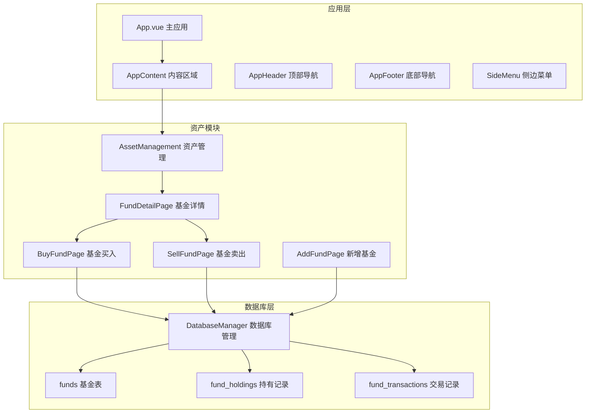
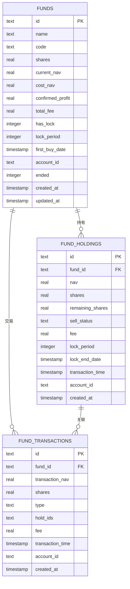
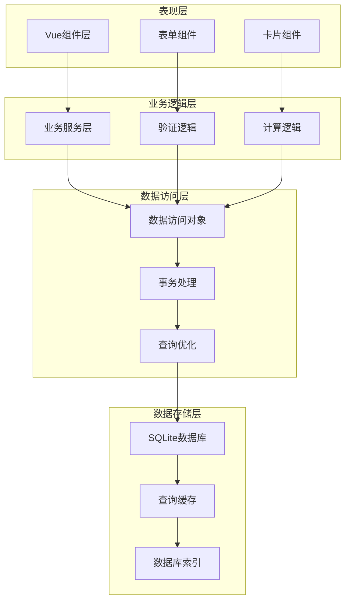
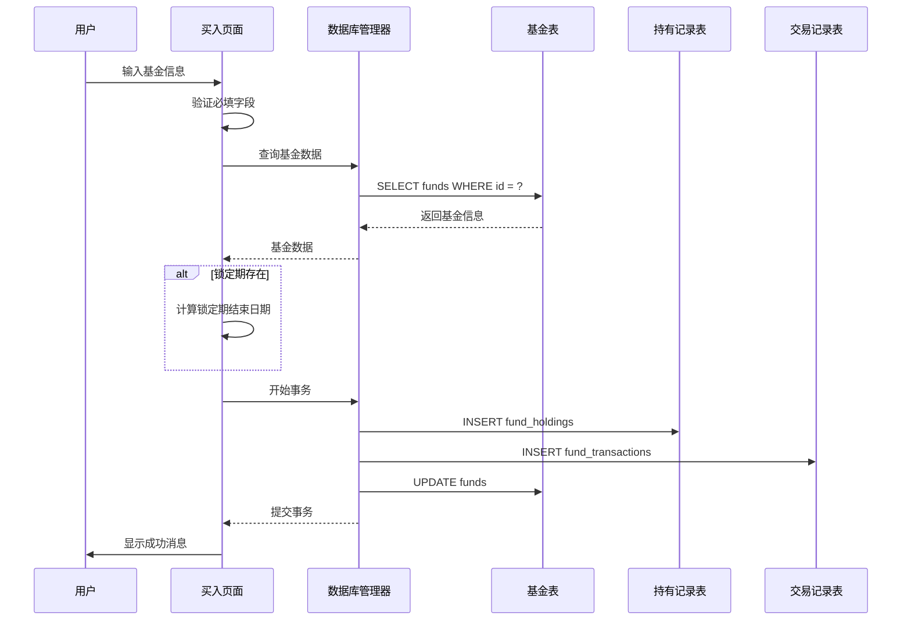
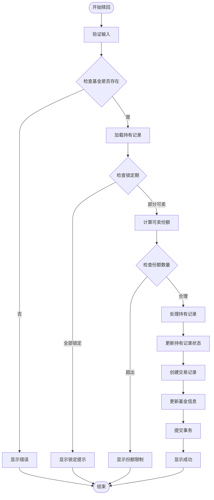
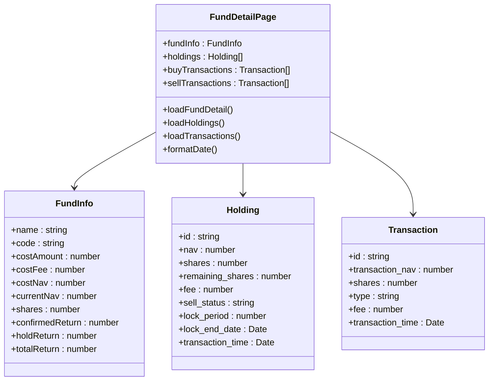
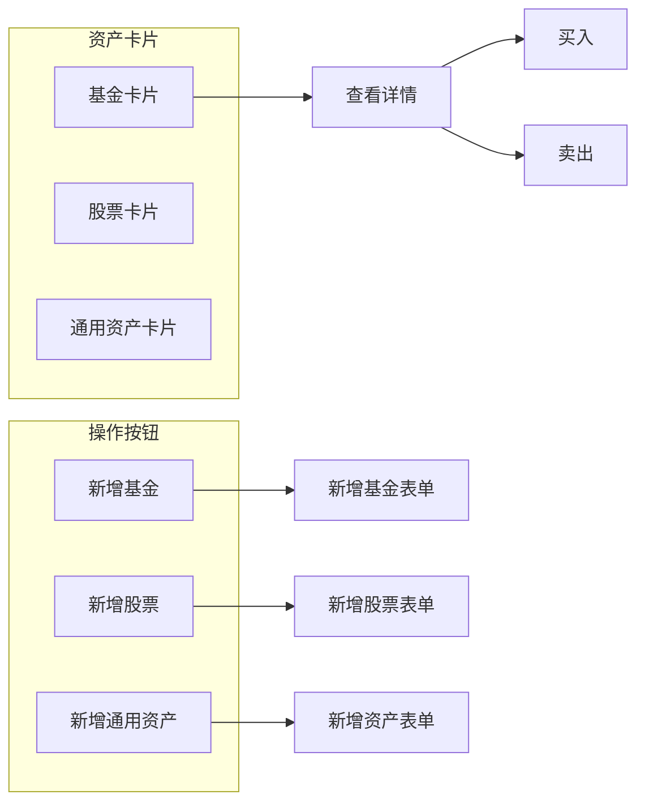
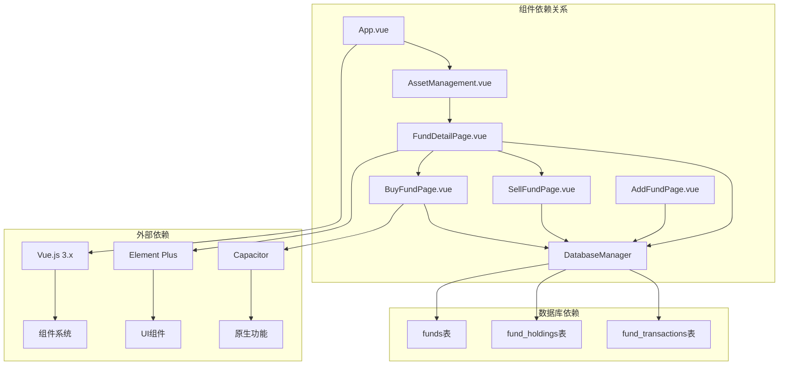

# 基金管理

<cite>
**本文档引用的文件**
- [BuyFundPage.vue](file://src/components/mobile/asset/BuyFundPage.vue)
- [SellFundPage.vue](file://src/components/mobile/asset/SellFundPage.vue)
- [FundDetailPage.vue](file://src/components/mobile/asset/FundDetailPage.vue)
- [AddFundPage.vue](file://src/components/mobile/asset/AddFundPage.vue)
- [AssetManagement.vue](file://src/components/mobile/asset/AssetManagement.vue)
- [FundItem.vue](file://src/components/mobile/account/FundItem.vue)
- [index.js](file://src/database/index.js)
- [App.vue](file://src/App.vue)
</cite>

## 更新摘要
**变更内容**
- 新增完整的基金卖出功能实现
- 优化基金买入流程使用原子事务处理
- 增强基金详情页面集成卖出功能
- 改进锁定期管理和智能份额分配算法
- 增强数据一致性保证和错误处理机制

## 目录
1. [简介](#简介)
2. [项目结构](#项目结构)
3. [核心组件](#核心组件)
4. [架构概览](#架构概览)
5. [详细组件分析](#详细组件分析)
6. [依赖关系分析](#依赖关系分析)
7. [性能考虑](#性能考虑)
8. [故障排除指南](#故障排除指南)
9. [结论](#结论)
10. [附录](#附录)

## 简介

本项目是一个基于Vue.js和Electron的跨平台金融资产管理应用，专注于提供完整的基金交易和管理功能。系统采用SQLite数据库进行本地数据持久化，支持移动端和桌面端部署。本文档详细介绍了基金管理功能，包括基金购买、赎回、详情展示、价值计算、费用结构、分类风险展示以及数据同步机制。

**更新** 新增完整的基金卖出功能，优化交易流程的一致性和可靠性。

## 项目结构

项目采用模块化的Vue.js单页应用程序架构，主要分为以下几个核心模块：

**图表来源**
- [App.vue:65-89](file://src/App.vue#L65-L89)
- [AssetManagement.vue:141-183](file://src/components/mobile/asset/AssetManagement.vue#L141-L183)
- [index.js:420-776](file://src/database/index.js#L420-L776)

**章节来源**
- [App.vue:65-89](file://src/App.vue#L65-L89)
- [AssetManagement.vue:141-183](file://src/components/mobile/asset/AssetManagement.vue#L141-L183)

## 核心组件

### 数据库管理系统

系统采用统一的数据库管理类，支持Capacitor SQLite（移动端）和sql.js（Web端）两种后端：

- **连接管理**：自动检测平台类型，建立相应的数据库连接
- **事务处理**：提供executeTransaction方法支持多语句原子操作
- **缓存机制**：内置查询结果缓存，提高性能
- **迁移兼容**：自动处理数据库结构变更和字段升级

**更新** 新增executeTransaction方法，支持原子事务处理，确保数据一致性。

### 基金表结构设计

系统使用三个核心表来管理基金数据：

**图表来源**
- [index.js:542-602](file://src/database/index.js#L542-L602)

**章节来源**
- [index.js:420-776](file://src/database/index.js#L420-L776)

## 架构概览

系统采用分层架构设计，确保各层职责清晰分离：

**图表来源**
- [index.js:199-374](file://src/database/index.js#L199-L374)
- [BuyFundPage.vue:105-177](file://src/components/mobile/asset/BuyFundPage.vue#L105-L177)

## 详细组件分析

### 基金买入流程

基金买入功能实现了完整的交易流程，包括数据验证、份额计算和事务处理：

**图表来源**
- [BuyFundPage.vue:105-177](file://src/components/mobile/asset/BuyFundPage.vue#L105-L177)
- [index.js:354-374](file://src/database/index.js#L354-L374)

#### 核心计算逻辑

买入操作涉及复杂的份额和净值计算：

1. **总成本计算**：`total_cost = (当前份额 × 当前成本净值) + (买入份额 × 买入净值)`
2. **新份额计算**：`new_shares = 当前份额 + 买入份额`
3. **新成本净值**：`new_cost_nav = total_cost / new_shares`
4. **锁定期处理**：根据has_lock和lock_period字段计算锁定期结束日期

**更新** 优化了事务处理机制，使用executeTransaction确保所有数据库操作的原子性。

**章节来源**
- [BuyFundPage.vue:142-145](file://src/components/mobile/asset/BuyFundPage.vue#L142-L145)

### 基金赎回流程

**新增** 基金赎回功能实现了智能的份额分配和锁定期管理：

**图表来源**
- [SellFundPage.vue:104-211](file://src/components/mobile/asset/SellFundPage.vue#L104-L211)

#### 智能份额分配算法

系统采用先进先出(FIFO)原则处理多笔持有记录：

1. **查询可卖记录**：`SELECT * FROM fund_holdings WHERE fund_id = ? AND sell_status != '已卖出' AND lock_end_date <= ? ORDER BY transaction_time ASC`
2. **计算总可用份额**：对所有可卖记录的remaining_shares求和
3. **分配卖出份额**：按时间顺序依次从最早记录扣除份额
4. **更新状态**：根据剩余份额决定sell_status为"未卖出"、"部分卖出"或"已卖出"

**更新** 新增完整的卖出功能，支持智能份额分配和锁定期管理。

**章节来源**
- [SellFundPage.vue:137-185](file://src/components/mobile/asset/SellFundPage.vue#L137-L185)

### 基金详情展示

基金详情页面提供了全面的投资组合视图：

**图表来源**
- [FundDetailPage.vue:236-413](file://src/components/mobile/asset/FundDetailPage.vue#L236-L413)

#### 价值计算和收益统计

系统提供多层次的价值计算：

1. **持有成本**：`costAmount = shares × cost_nav`
2. **持有收益**：`holdReturn = (current_nav - cost_nav) × shares`
3. **确认收益**：`confirmed_profit`（仅在卖出时计算）
4. **总收益**：`totalReturn = holdReturn + confirmedReturn`

**更新** 增强了卖出功能的集成，支持完整的交易记录展示。

**章节来源**
- [FundDetailPage.vue:280-318](file://src/components/mobile/asset/FundDetailPage.vue#L280-L318)

### 资产管理界面

资产管理页面提供了基金资产的概览和快速导航：

**图表来源**
- [AssetManagement.vue:35-46](file://src/components/mobile/asset/AssetManagement.vue#L35-L46)
- [AssetManagement.vue:206-227](file://src/components/mobile/asset/AssetManagement.vue#L206-L227)

**章节来源**
- [AssetManagement.vue:145-183](file://src/components/mobile/asset/AssetManagement.vue#L145-L183)

## 依赖关系分析

系统采用松耦合的设计模式，各组件间通过明确定义的接口交互：

**图表来源**
- [App.vue:34-52](file://src/App.vue#L34-L52)
- [index.js:8-10](file://src/database/index.js#L8-L10)

**章节来源**
- [App.vue:34-52](file://src/App.vue#L34-L52)
- [index.js:8-10](file://src/database/index.js#L8-L10)

## 性能考虑

### 数据库性能优化

系统实施了多项性能优化策略：

1. **连接池管理**：单例模式确保数据库连接复用
2. **查询缓存**：Map缓存常用查询结果，减少数据库访问
3. **批量操作**：支持批量SQL执行和事务处理
4. **索引优化**：为高频查询字段建立索引
5. **延迟持久化**：Web环境下延迟数据库持久化

**更新** 新增executeTransaction方法，提供原子事务处理能力，确保操作的完整性和一致性。

### 内存管理

- **响应式数据**：使用Vue 3的ref和reactive确保高效的数据绑定
- **组件卸载**：及时清理事件监听器和定时器
- **虚拟滚动**：大量数据时使用虚拟滚动优化渲染性能

### 网络和同步

- **离线优先**：所有数据操作都在本地完成
- **数据一致性**：通过事务保证操作的原子性和一致性
- **冲突解决**：多设备场景下的数据冲突检测和解决

## 故障排除指南

### 常见问题诊断

#### 数据库连接问题

**症状**：应用启动时数据库连接失败
**解决方案**：
1. 检查数据库初始化是否完成
2. 验证平台检测逻辑（移动端vs Web端）
3. 查看具体的错误信息和堆栈跟踪

#### 交易失败

**症状**：买入或卖出操作失败
**排查步骤**：
1. 检查网络连接状态
2. 验证输入数据的有效性
3. 查看事务执行日志
4. 确认数据库权限设置

**更新** 新增事务处理错误排查，检查executeTransaction方法的异常处理。

#### 数据同步问题

**症状**：不同设备间数据不一致
**解决方法**：
1. 检查设备时间同步
2. 验证数据库版本兼容性
3. 执行数据完整性检查

**章节来源**
- [index.js:260-263](file://src/database/index.js#L260-L263)
- [BuyFundPage.vue:173-176](file://src/components/mobile/asset/BuyFundPage.vue#L173-L176)

## 结论

本基金管理系统提供了完整的基金交易和管理功能，具有以下特点：

1. **功能完整性**：覆盖了基金购买、赎回、详情展示、价值计算等核心功能
2. **数据一致性**：通过事务处理确保数据的准确性和一致性
3. **用户体验**：直观的界面设计和流畅的操作体验
4. **技术先进性**：采用现代前端技术和最佳实践
5. **可扩展性**：模块化设计便于功能扩展和维护

**更新** 新增的卖出功能进一步完善了交易生态，优化的事务处理机制提升了系统的可靠性和数据安全性。

系统在性能、安全性和用户体验方面都达到了较高标准，为用户提供了一个可靠的基金投资管理工具。

## 附录

### 数据模型定义

系统使用标准化的关系型数据模型，确保数据的完整性和一致性：

- **主键约束**：所有表都有明确的主键定义
- **外键关系**：正确建立了表间的引用关系
- **索引优化**：为查询频繁的字段建立了索引
- **数据类型**：使用合适的数据类型确保数据精度

**更新** 新增ended字段用于标识基金状态，支持基金生命周期管理。

### 安全考虑

- **数据加密**：敏感数据采用适当的加密措施
- **访问控制**：严格的权限管理和数据隔离
- **审计日志**：完整的操作记录和审计追踪
- **输入验证**：多重验证确保数据质量

### 维护和升级

- **向后兼容**：数据库结构变更时保持向后兼容
- **版本管理**：清晰的版本控制和升级路径
- **备份策略**：自动化的数据备份和恢复机制
- **监控告警**：实时监控系统状态和性能指标

**更新** 新增事务处理的安全机制，确保所有数据库操作的原子性和一致性。