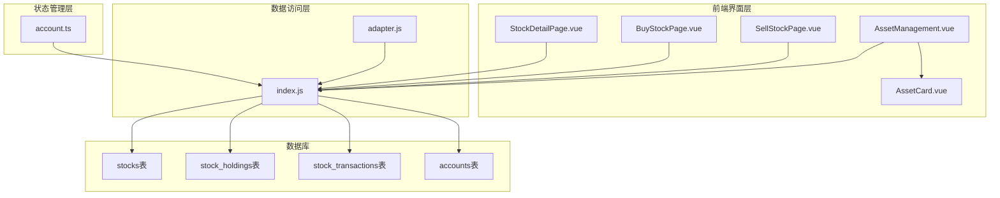
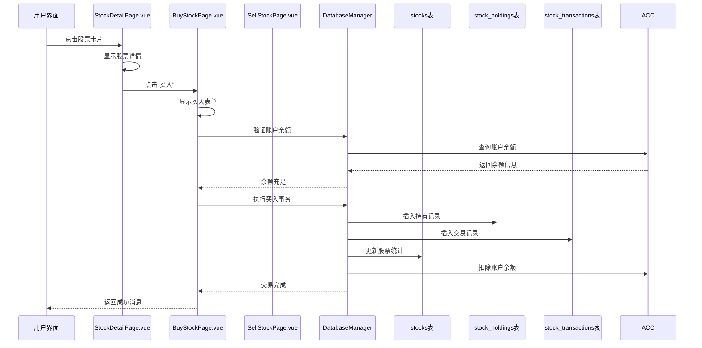
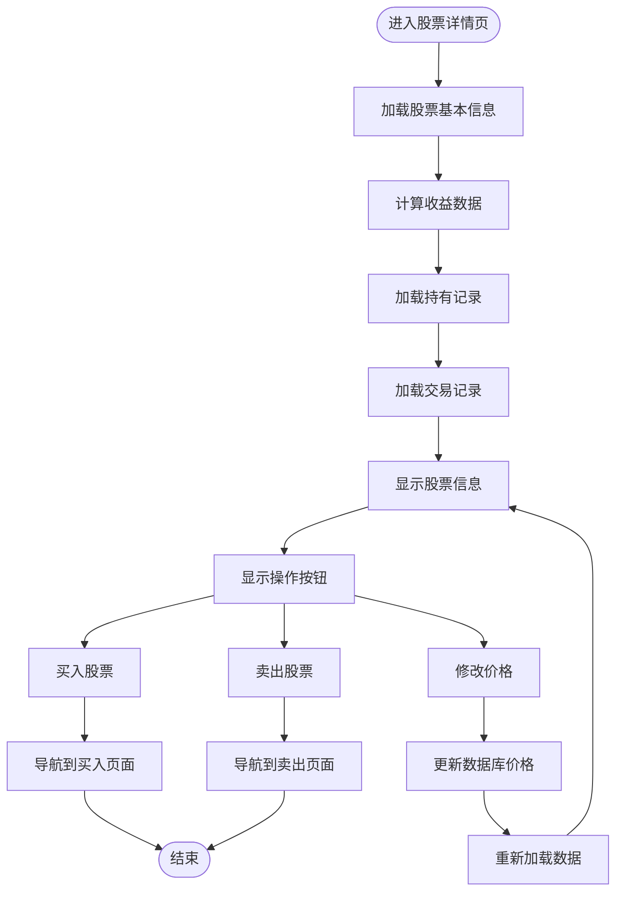
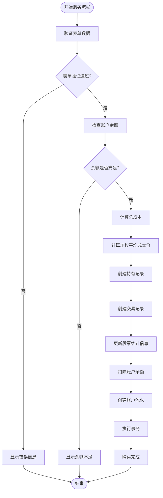
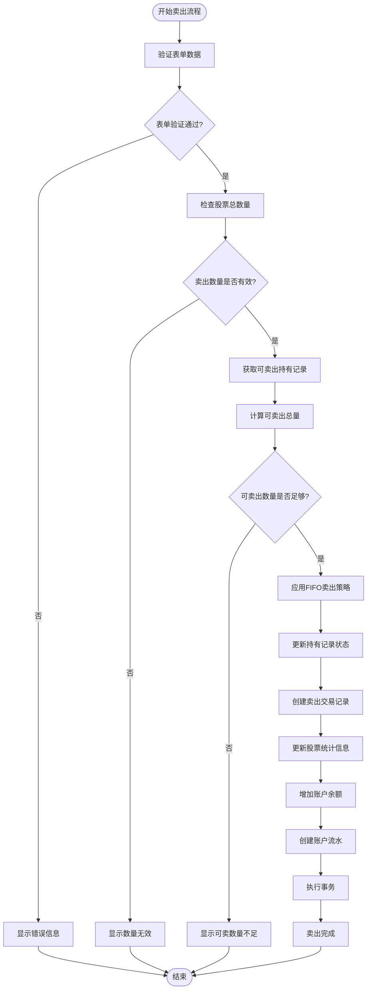
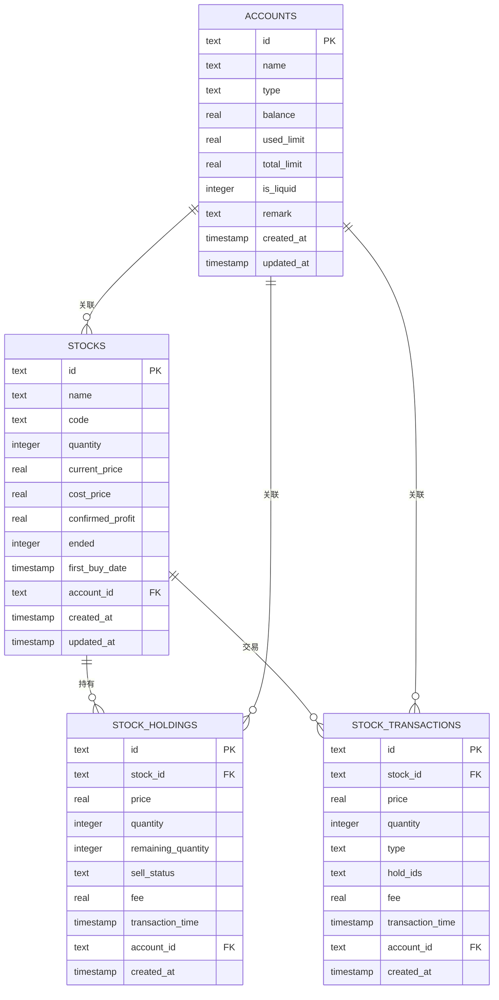
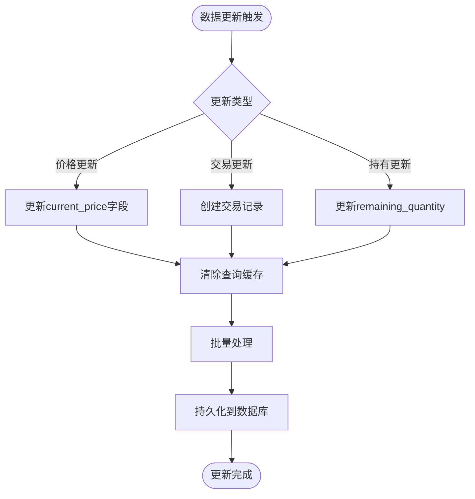
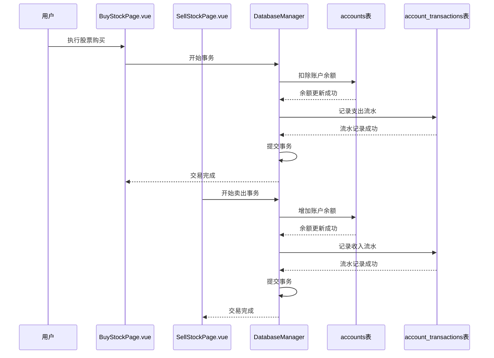
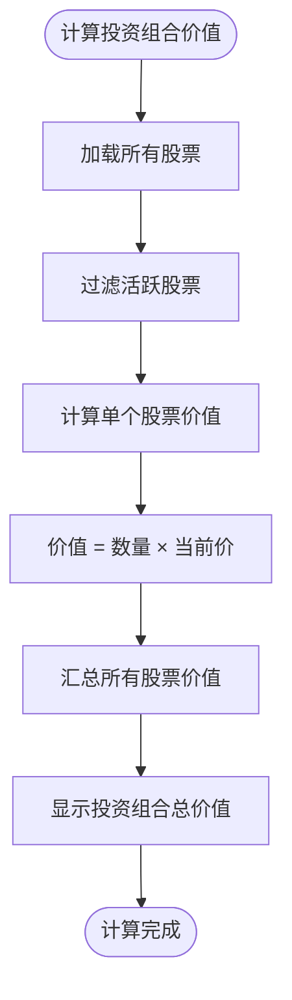

# 股票管理

<cite>
**本文档引用的文件**
- [StockDetailPage.vue](file://src/components/mobile/asset/StockDetailPage.vue)
- [BuyStockPage.vue](file://src/components/mobile/asset/BuyStockPage.vue)
- [SellStockPage.vue](file://src/components/mobile/asset/SellStockPage.vue)
- [AddStockPage.vue](file://src/components/mobile/asset/AddStockPage.vue)
- [AssetManagement.vue](file://src/components/mobile/asset/AssetManagement.vue)
- [AssetCard.vue](file://src/components/mobile/asset/AssetCard.vue)
- [account.ts](file://src/stores/account.ts)
- [index.js](file://src/database/index.js)
- [adapter.js](file://src/database/adapter.js)
- [main.ts](file://src/main.ts)
</cite>

## 更新摘要
**变更内容**
- 新增完整的股票交易功能模块，包括股票详情页面、买入页面、卖出页面
- 完善资产管理页面的股票集成，支持股票资产的查看和管理
- 增强股票交易的业务逻辑，包括成本价计算、FIFO卖出策略
- 优化数据库结构，支持股票交易的完整生命周期管理

## 目录
1. [简介](#简介)
2. [项目结构](#项目结构)
3. [核心组件](#核心组件)
4. [架构概览](#架构概览)
5. [详细组件分析](#详细组件分析)
6. [依赖关系分析](#依赖关系分析)
7. [性能考虑](#性能考虑)
8. [故障排除指南](#故障排除指南)
9. [结论](#结论)

## 简介
本文件详细介绍金融应用中的股票管理功能，涵盖股票购买流程、交易记录数据结构、持仓跟踪机制、实时更新策略、账户余额影响以及投资组合价值计算方法。文档基于实际代码实现进行分析，并提供可视化图表帮助理解系统架构和数据流。

**更新** 新增完整的股票交易功能，包括股票详情页面、买入页面、卖出页面，以及相应的路由配置和资产管理页面集成。

## 项目结构
该项目采用Vue 3 + Pinia + Element Plus的移动端金融应用架构，股票管理功能主要分布在以下模块：
- 股票详情页面：展示股票详细信息、持有记录和交易历史
- 股票买入页面：处理股票购买操作，包括价格、数量、手续费设置
- 股票卖出页面：处理股票卖出操作，支持FIFO卖出策略
- 资产管理页面：展示各类资产卡片，包括股票、基金等
- 数据库层：统一的SQLite数据库管理，支持原生和Web环境
- 账户管理Store：提供账户余额调整和转账功能



**图表来源**
- [StockDetailPage.vue:1-633](file://src/components/mobile/asset/StockDetailPage.vue#L1-L633)
- [BuyStockPage.vue:1-287](file://src/components/mobile/asset/BuyStockPage.vue#L1-L287)
- [SellStockPage.vue:1-325](file://src/components/mobile/asset/SellStockPage.vue#L1-L325)
- [AssetManagement.vue:1-471](file://src/components/mobile/asset/AssetManagement.vue#L1-L471)

**章节来源**
- [main.ts:1-16](file://src/main.ts#L1-L16)
- [index.js:1-881](file://src/database/index.js#L1-L881)

## 核心组件
股票管理功能由多个核心组件协同工作，形成完整的股票交易生命周期管理。

### 股票详情页面
提供股票的完整信息展示，包括基本信息、收益计算、持有记录和交易历史。

### 股票买入页面
处理股票购买的完整流程，包括表单验证、账户余额检查、成本价计算和多表一致性维护。

### 股票卖出页面
处理股票卖出操作，支持FIFO（先进先出）卖出策略，自动计算确认收益。

### 资产管理页面
提供股票资产的概览展示，支持浮动操作菜单快速导航到新增页面。

### 数据库管理
统一的SQLite数据库访问层，支持原生平台(Capacitor SQLite)和Web平台(sql.js)，提供查询、执行、批处理和事务支持。

**章节来源**
- [StockDetailPage.vue:1-633](file://src/components/mobile/asset/StockDetailPage.vue#L1-L633)
- [BuyStockPage.vue:1-287](file://src/components/mobile/asset/BuyStockPage.vue#L1-L287)
- [SellStockPage.vue:1-325](file://src/components/mobile/asset/SellStockPage.vue#L1-L325)
- [AssetManagement.vue:1-471](file://src/components/mobile/asset/AssetManagement.vue#L1-L471)
- [index.js:1-881](file://src/database/index.js#L1-L881)

## 架构概览
股票管理系统采用分层架构设计，确保数据一致性、性能优化和跨平台兼容性。



**图表来源**
- [StockDetailPage.vue:186-194](file://src/components/mobile/asset/StockDetailPage.vue#L186-L194)
- [BuyStockPage.vue:100-194](file://src/components/mobile/asset/BuyStockPage.vue#L100-L194)
- [index.js:199-309](file://src/database/index.js#L199-L309)

## 详细组件分析

### 股票详情页面实现
股票详情页面提供完整的股票信息展示和交互功能。



**图表来源**
- [StockDetailPage.vue:259-428](file://src/components/mobile/asset/StockDetailPage.vue#L259-L428)

#### 关键业务逻辑
1. **收益计算**：实时计算持有成本、当前价格、确认收益、持有收益和总收益
2. **数据分组**：将交易记录按类型分为持有记录、买入记录和卖出记录
3. **操作集成**：提供买入、卖出、修改价格等操作入口
4. **状态管理**：支持股票的结束状态管理和历史记录查看

#### 数据结构设计
- **股票基本信息**：名称、代码、数量、当前价、成本价、确认收益
- **收益计算字段**：持有成本金额、持有收益、总收益
- **交易记录分类**：按买入、卖出、持有状态进行数据分组

**章节来源**
- [StockDetailPage.vue:259-428](file://src/components/mobile/asset/StockDetailPage.vue#L259-L428)

### 股票购买流程实现
股票购买流程严格按照预设的业务规则执行，确保数据一致性和用户体验。



**图表来源**
- [BuyStockPage.vue:100-194](file://src/components/mobile/asset/BuyStockPage.vue#L100-L194)

#### 关键业务逻辑
1. **表单验证**：确保价格、数量、时间、账户等必填字段有效
2. **余额检查**：防止账户余额不足导致的交易失败
3. **成本价计算**：使用加权平均法计算新的成本价
4. **多表一致性**：购买时同时维护股票表、持有记录表和交易记录表
5. **事务保证**：使用数据库事务确保操作的原子性

#### 数据结构设计
- **股票表(stocks)**：存储股票基本信息、持仓数量、成本价、当前价等
- **持有记录表(stock_holdings)**：追踪每次买入的详细信息
- **交易记录表(stock_transactions)**：记录所有买卖交易的历史

**章节来源**
- [BuyStockPage.vue:100-194](file://src/components/mobile/asset/BuyStockPage.vue#L100-L194)

### 股票卖出流程实现
股票卖出流程采用FIFO（先进先出）策略，确保卖出顺序的准确性。



**图表来源**
- [SellStockPage.vue:101-232](file://src/components/mobile/asset/SellStockPage.vue#L101-L232)

#### 关键业务逻辑
1. **FIFO策略**：按时间顺序优先卖出最早买入的持有记录
2. **状态跟踪**：支持"未卖出"、"部分卖出"、"已卖出"三种状态
3. **收益计算**：确认收益 = (卖出价格 - 成本价) × 卖出数量 - 手续费
4. **结束判断**：当剩余数量为0时标记股票为已结束状态
5. **事务保证**：使用数据库事务确保卖出操作的完整性

#### 数据结构设计
- **持有记录状态**：通过sell_status字段跟踪每笔持有的卖出状态
- **交易记录关联**：通过hold_ids字段关联多个持有记录
- **确认收益累计**：通过confirmed_profit字段累计已实现收益

**章节来源**
- [SellStockPage.vue:101-232](file://src/components/mobile/asset/SellStockPage.vue#L101-L232)

### 股票交易记录数据结构
系统采用标准化的数据结构来记录股票交易的各个环节。



**图表来源**
- [index.js:503-559](file://src/database/index.js#L503-L559)

#### 字段详细说明
- **买入/卖出类型**：通过type字段区分'买入'或'卖出'
- **成交价格**：记录实际成交的单价
- **交易时间**：精确到秒的时间戳
- **手续费**：交易产生的各项费用
- **持有状态**：跟踪每笔持有的卖出状态
- **结束状态**：通过ended字段标识股票是否已结束

**章节来源**
- [index.js:503-559](file://src/database/index.js#L503-L559)

### 股票持有情况跟踪机制
系统通过多表关联实现完整的持仓跟踪，确保每个交易环节都有据可查。


**图表来源**
- [StockDetailPage.vue:364-424](file://src/components/mobile/asset/StockDetailPage.vue#L364-L424)
- [index.js:503-559](file://src/database/index.js#L503-L559)

#### 跟踪机制特点
1. **多表同步**：持有记录和交易记录相互关联，确保数据一致性
2. **状态管理**：通过sell_status字段跟踪每笔持有的卖出状态
3. **历史追溯**：完整的交易记录便于审计和报表生成
4. **结束状态**：通过ended字段管理股票的生命周期

**章节来源**
- [StockDetailPage.vue:364-424](file://src/components/mobile/asset/StockDetailPage.vue#L364-L424)

### 股票数据实时更新策略
系统采用混合策略处理股票数据更新，平衡实时性和性能需求。



**图表来源**
- [index.js:199-309](file://src/database/index.js#L199-L309)

#### 更新策略特性
1. **查询缓存**：使用Map缓存常用查询结果，减少数据库访问
2. **批量处理**：支持批处理执行多个SQL语句，提高性能
3. **事务保证**：关键操作使用事务确保数据一致性
4. **延迟持久化**：Web环境下延迟保存到localStorage

**章节来源**
- [index.js:12-18](file://src/database/index.js#L12-L18)
- [index.js:199-309](file://src/database/index.js#L199-L309)

### 股票交易对账户余额的影响
股票交易与账户管理紧密集成，确保资金流转的准确记录。



**图表来源**
- [BuyStockPage.vue:174-184](file://src/components/mobile/asset/BuyStockPage.vue#L174-L184)
- [SellStockPage.vue:211-222](file://src/components/mobile/asset/SellStockPage.vue#L211-L222)
- [index.js:503-559](file://src/database/index.js#L503-L559)

#### 资金流转机制
1. **账户关联**：每笔股票交易都关联到具体账户
2. **余额计算**：买入时扣减相应金额，卖出时增加相应金额
3. **流水记录**：完整的交易流水便于审计和报表
4. **类型区分**：通过支出和收入类型区分资金流向

**章节来源**
- [BuyStockPage.vue:174-184](file://src/components/mobile/asset/BuyStockPage.vue#L174-L184)
- [SellStockPage.vue:211-222](file://src/components/mobile/asset/SellStockPage.vue#L211-L222)

### 股票投资组合价值计算
系统支持基于当前市场价格的投资组合价值计算。



**图表来源**
- [AssetManagement.vue:125-145](file://src/components/mobile/asset/AssetManagement.vue#L125-L145)

#### 计算方法
1. **实时价格**：使用stocks表中的current_price字段
2. **持有数量**：使用stocks表中的quantity字段
3. **价值计算**：单个股票价值 = 数量 × 当前价
4. **组合汇总**：所有股票价值相加得到总资产
5. **状态过滤**：支持当前资产和历史资产的切换显示

**章节来源**
- [AssetManagement.vue:125-145](file://src/components/mobile/asset/AssetManagement.vue#L125-L145)

## 依赖关系分析

```mermaid
graph TB
subgraph "外部依赖"
CAP[Capacitor]
SQLJS[sql.js]
PINIA[Pinia]
ELEMENT[Element Plus]
END
subgraph "内部模块"
MAIN[main.ts]
DBM[index.js]
AD[adapter.js]
SDP[StockDetailPage.vue]
BSP[BuyStockPage.vue]
SSP[SellStockPage.vue]
ASP[AssetManagement.vue]
AS[account.ts]
end
MAIN --> PINIA
MAIN --> ELEMENT
MAIN --> DBM
DBM --> CAP
DBM --> SQLJS
SDP --> DBM
BSP --> DBM
SSP --> DBM
ASP --> DBM
AS --> DBM
AD --> DBM
```

**图表来源**
- [main.ts:1-16](file://src/main.ts#L1-16)
- [index.js:8-10](file://src/database/index.js#L8-L10)
- [adapter.js:1-34](file://src/database/adapter.js#L1-L34)

### 组件耦合分析
- **低耦合设计**：各组件职责明确，通过数据库层解耦
- **数据驱动**：UI组件完全依赖数据库查询结果
- **状态集中**：账户管理通过Pinia Store集中管理
- **路由集成**：通过emit事件实现组件间导航

**章节来源**
- [main.ts:1-16](file://src/main.ts#L1-16)
- [index.js:1-881](file://src/database/index.js#L1-L881)

## 性能考虑
系统在设计时充分考虑了性能优化，特别是在数据库访问和数据同步方面。

### 数据库性能优化
1. **连接池管理**：单例模式确保数据库连接复用
2. **查询缓存**：Map缓存常用查询结果，减少数据库压力
3. **索引优化**：为常用查询字段建立索引
4. **批量处理**：支持批处理执行多个SQL语句

### 移动端适配
1. **原生平台支持**：使用Capacitor SQLite提供更好的性能
2. **Web环境降级**：使用sql.js作为Web环境的替代方案
3. **延迟持久化**：Web环境下延迟保存到localStorage

**章节来源**
- [index.js:12-18](file://src/database/index.js#L12-L18)
- [index.js:418-776](file://src/database/index.js#L418-L776)

## 故障排除指南

### 常见问题及解决方案

#### 股票代码重复添加
**问题描述**：尝试添加已存在的股票代码
**解决方法**：系统会在添加前检查股票代码唯一性，如发现重复会提示用户

#### 余额不足
**问题描述**：账户余额不足以完成购买
**解决方法**：在购买前会检查账户余额，不足时阻止交易并提示用户

#### 卖出数量超出限制
**问题描述**：卖出数量超过可卖出的总数量
**解决方法**：系统会计算可卖出的总数量，超过时阻止交易并提示用户

#### 数据库连接失败
**问题描述**：无法连接到SQLite数据库
**解决方法**：检查数据库初始化过程，确保表结构正确创建

#### 事务执行失败
**问题描述**：多表操作中的某个步骤失败
**解决方法**：系统使用事务保证原子性，失败时自动回滚

**章节来源**
- [AddStockPage.vue:112-126](file://src/components/mobile/asset/AddStockPage.vue#L112-L126)
- [BuyStockPage.vue:139-142](file://src/components/mobile/asset/BuyStockPage.vue#L139-L142)
- [SellStockPage.vue:147-150](file://src/components/mobile/asset/SellStockPage.vue#L147-L150)

## 结论
本股票管理功能实现了完整的股票交易生命周期管理，包括购买、持有、交易记录和价值计算。系统采用分层架构设计，确保了数据一致性、性能优化和跨平台兼容性。通过标准化的数据结构和严格的业务逻辑，为用户提供可靠的股票投资管理体验。

**更新** 新增的股票交易功能模块提供了完整的股票管理能力，包括详细的股票信息展示、便捷的买入卖出操作、智能的成本价计算和FIFO卖出策略。这些功能的集成大大提升了系统的实用性和用户体验。

主要优势：
1. **数据完整性**：多表关联确保交易数据的完整性和可追溯性
2. **性能优化**：查询缓存、批量处理和索引优化提升响应速度
3. **用户体验**：直观的界面设计和完善的错误处理
4. **扩展性**：模块化设计便于功能扩展和维护
5. **业务完整性**：完整的买入卖出流程支持复杂的交易场景

建议的改进方向：
1. **实时价格获取**：集成第三方API获取实时股价
2. **风险提示**：增加投资风险评估和提醒功能
3. **报表分析**：提供更详细的交易和收益分析报表
4. **通知机制**：添加交易完成和价格异动的通知功能
5. **多账户支持**：支持同一股票在多个账户间的转移操作