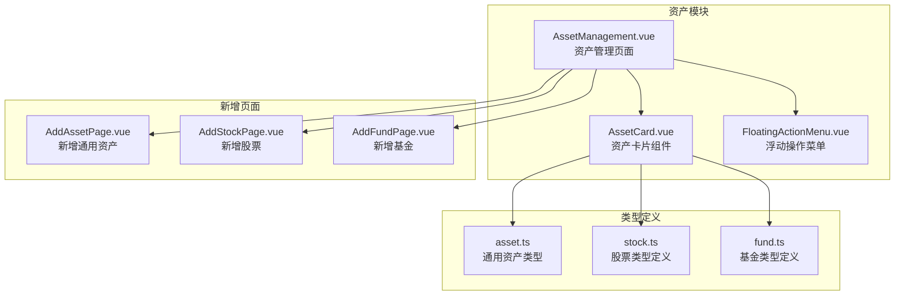
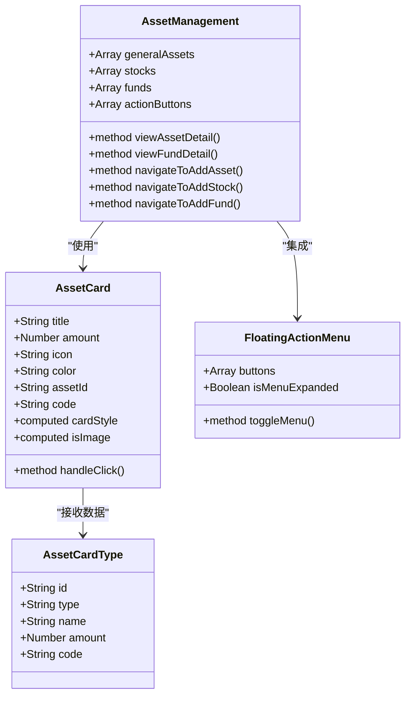
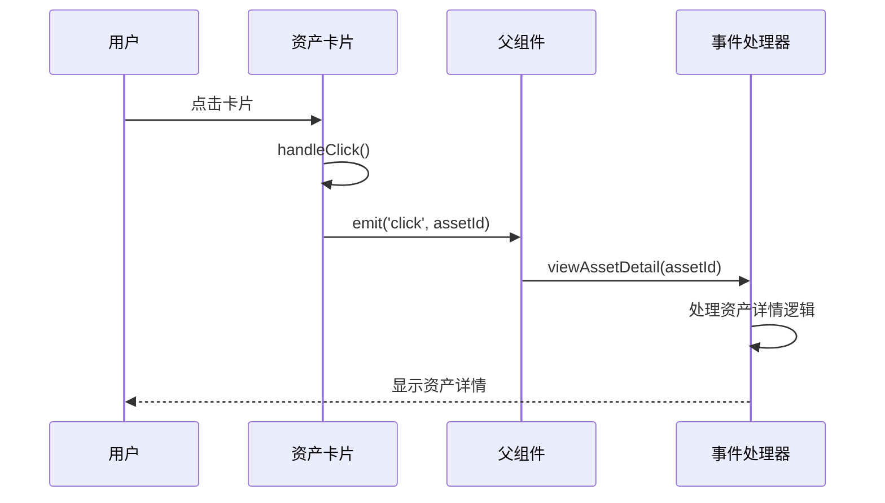
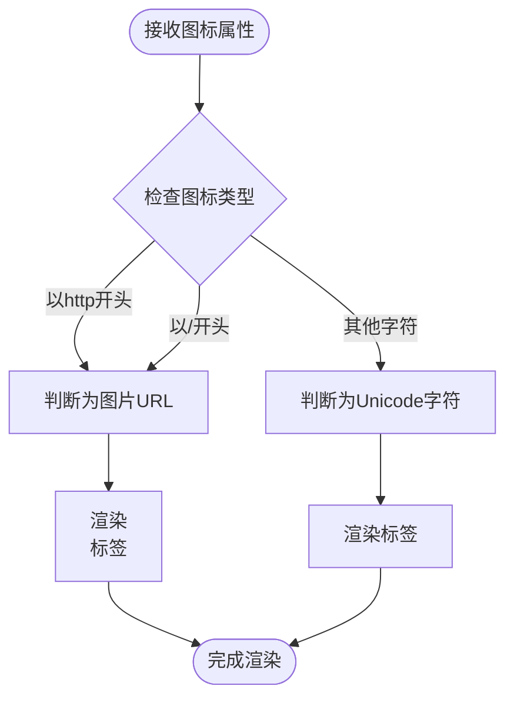
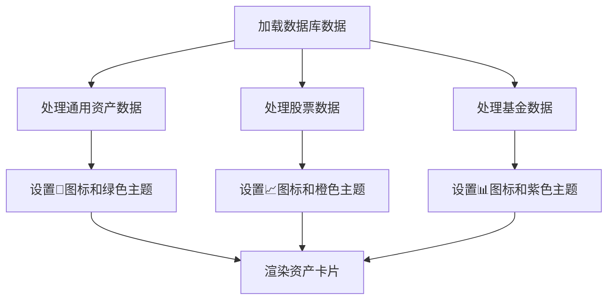
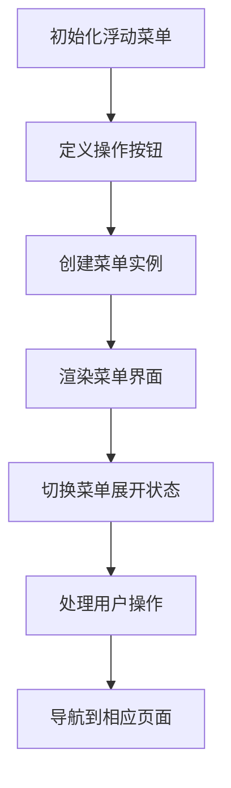
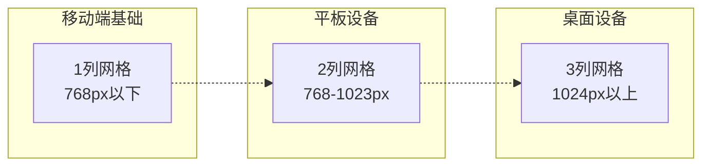
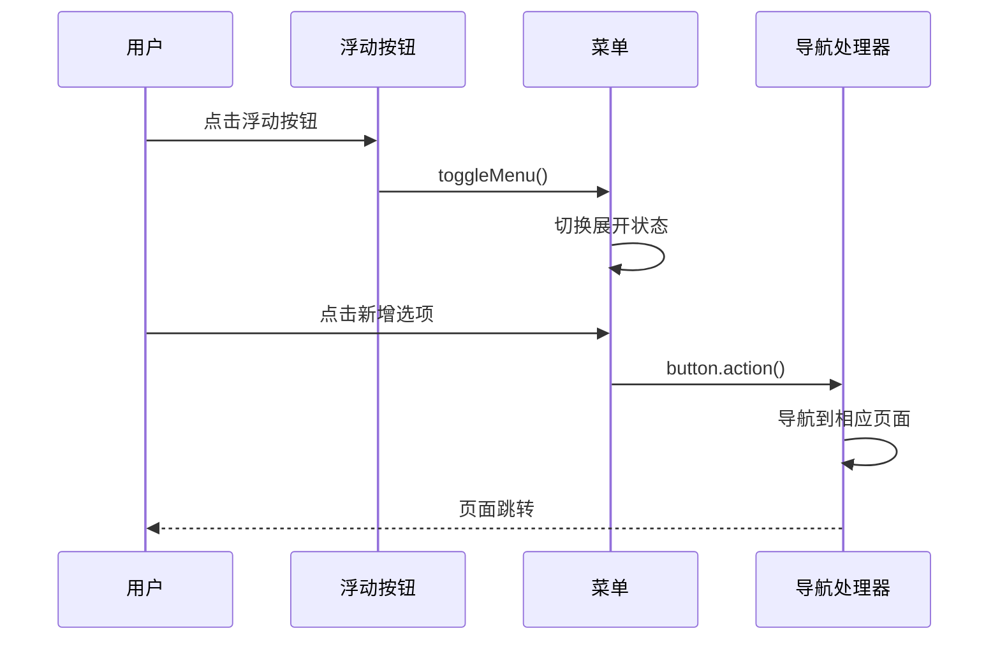
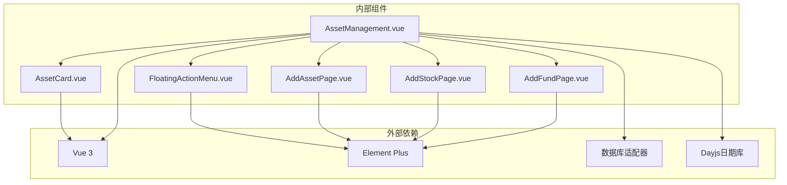
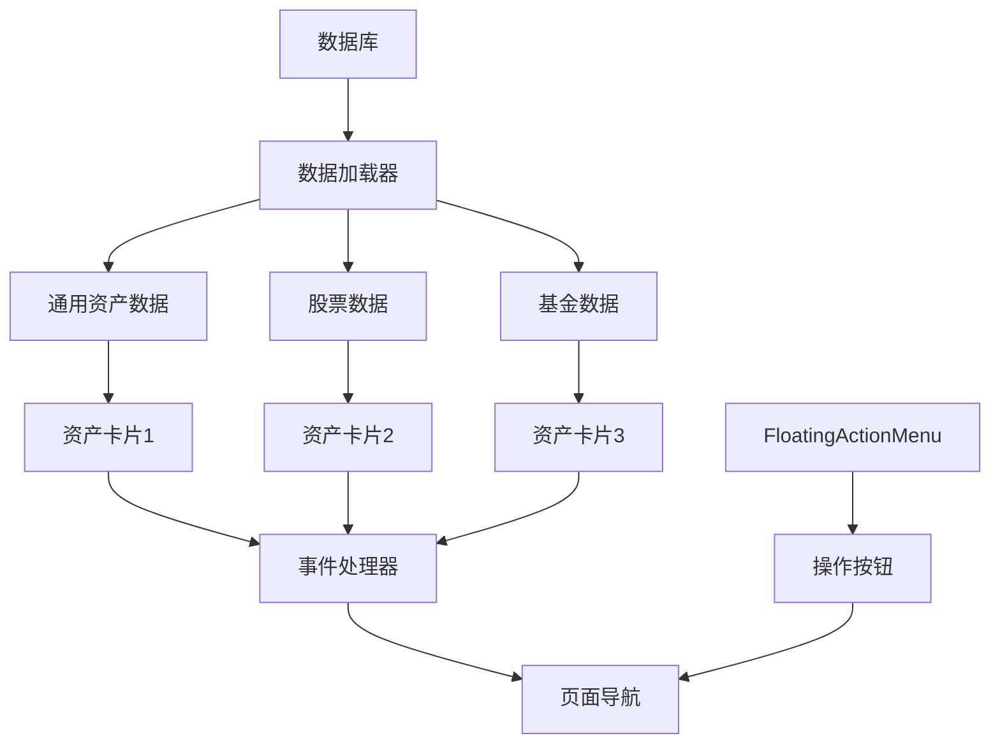

# 资产卡片组件

<cite>
**本文档引用的文件**
- [AssetCard.vue](file://src/components/mobile/asset/AssetCard.vue)
- [AssetManagement.vue](file://src/components/mobile/asset/AssetManagement.vue)
- [FloatingActionMenu.vue](file://src/components/common/FloatingActionMenu.vue)
- [AddAssetPage.vue](file://src/components/mobile/asset/AddAssetPage.vue)
- [AddStockPage.vue](file://src/components/mobile/asset/AddStockPage.vue)
- [AddFundPage.vue](file://src/components/mobile/asset/AddFundPage.vue)
- [asset.ts](file://src/types/asset/asset.ts)
- [stock.ts](file://src/types/asset/stock.ts)
- [fund.ts](file://src/types/asset/fund.ts)
</cite>

## 更新摘要
**变更内容**
- 新增code字段显示资产类型代码，增强资产识别能力
- 优化金额显示格式，采用固定两位小数的标准化展示
- 简化布局结构，移除secondaryAmount属性，提升信息层次
- 采用新的FloatingActionMenu组件，提供更优雅的浮动操作体验
- 改进图标处理机制，支持更灵活的图标渲染

## 目录
1. [简介](#简介)
2. [项目结构](#项目结构)
3. [核心组件](#核心组件)
4. [架构概览](#架构概览)
5. [详细组件分析](#详细组件分析)
6. [依赖关系分析](#依赖关系分析)
7. [性能考虑](#性能考虑)
8. [故障排除指南](#故障排除指南)
9. [结论](#结论)
10. [附录](#附录)

## 简介

资产卡片组件是金融应用中用于展示各类资产信息的核心UI组件。该组件采用现代化的设计理念，结合渐变背景、阴影效果和响应式布局，为用户提供直观的资产概览体验。组件支持多种资产类型，包括通用资产、股票和基金，并提供了丰富的自定义选项和交互功能。

**更新** 新版本引入了资产类型代码显示、优化的金额格式化和全新的FloatingActionMenu组件，显著提升了用户体验和信息传达效率。

## 项目结构

资产卡片组件位于移动端资产模块中，与相关的资产管理页面和新的浮动菜单系统形成完整的功能体系：



**图表来源**
- [AssetManagement.vue:1-67](file://src/components/mobile/asset/AssetManagement.vue#L1-L67)
- [AssetCard.vue:1-158](file://src/components/mobile/asset/AssetCard.vue#L1-L158)
- [FloatingActionMenu.vue:1-151](file://src/components/common/FloatingActionMenu.vue#L1-L151)

**章节来源**
- [AssetManagement.vue:1-413](file://src/components/mobile/asset/AssetManagement.vue#L1-L413)
- [AssetCard.vue:1-158](file://src/components/mobile/asset/AssetCard.vue#L1-L158)

## 核心组件

### 资产卡片组件设计规范

资产卡片组件采用了统一的设计语言，确保在不同资产类型间保持一致的用户体验：

#### 视觉设计规范

| 设计元素 | 规范值 | 描述 |
|---------|--------|------|
| **卡片尺寸** | 100px高度 × 自适应宽度 | 固定高度确保视觉一致性 |
| **圆角半径** | 16px | 现代化圆润边角设计 |
| **内边距** | 15px | 提供充足的内部空间 |
| **阴影效果** | 0 4px 12px rgba(24, 144, 255, 0.3) | 悬浮感的投影效果 |
| **渐变背景** | 135°线性渐变 | 从主色调到透明的柔和过渡 |

#### 文字排版规范

| 元素 | 字体大小 | 字体权重 | 透明度 |
|------|----------|----------|--------|
| **标题** | 15px | 600 | 1.0 |
| **资产代码** | 12px | 正常 | 0.85 |
| **主要金额** | 22px | 粗体 | 1.0 |
| **金额标签** | 12px | 正常 | 0.85 |

#### 交互设计规范

| 交互状态 | 触发方式 | 效果 |
|----------|----------|------|
| **点击反馈** | 点击卡片 | 发射点击事件 |
| **按下效果** | 鼠标按下 | 卡片缩放0.98倍 |
| **图标交互** | 图标点击 | 独立的点击事件 |

**章节来源**
- [AssetCard.vue:68-158](file://src/components/mobile/asset/AssetCard.vue#L68-L158)

## 架构概览

资产卡片组件采用Vue 3 Composition API设计，实现了高度的模块化和可复用性：



**图表来源**
- [AssetCard.vue:20-65](file://src/components/mobile/asset/AssetCard.vue#L20-L65)
- [AssetManagement.vue:69-329](file://src/components/mobile/asset/AssetManagement.vue#L69-L329)
- [FloatingActionMenu.vue:33-59](file://src/components/common/FloatingActionMenu.vue#L33-L59)

## 详细组件分析

### 资产卡片组件详解

#### 属性接口定义

资产卡片组件提供了完整的属性接口，支持灵活的配置和定制：

| 属性名 | 类型 | 默认值 | 必需 | 描述 |
|--------|------|--------|------|------|
| **title** | String | '默认样式' | 否 | 卡片显示的标题文本 |
| **amount** | Number | 0 | 否 | 主要显示的金额数值 |
| **icon** | String | '💳' | 否 | 显示的图标内容（支持Unicode或图片URL） |
| **color** | String | '#1890ff' | 否 | 卡片主题颜色 |
| **assetId** | String | '' | 否 | 资产唯一标识符 |
| **code** | String | '' | 否 | 资产类型代码或标识符 |

#### 数据流处理



**图表来源**
- [AssetCard.vue:62-64](file://src/components/mobile/asset/AssetCard.vue#L62-L64)
- [AssetManagement.vue:297-310](file://src/components/mobile/asset/AssetManagement.vue#L297-L310)

#### 图标处理机制

组件支持两种图标类型，自动识别并渲染：



**图表来源**
- [AssetCard.vue:58-60](file://src/components/mobile/asset/AssetCard.vue#L58-L60)

**章节来源**
- [AssetCard.vue:23-48](file://src/components/mobile/asset/AssetCard.vue#L23-L48)
- [AssetCard.vue:58-64](file://src/components/mobile/asset/AssetCard.vue#L58-L64)

### 资产管理页面集成

#### 不同资产类型的样式差异

资产管理页面根据资产类型设置了不同的视觉主题：

| 资产类型 | 图标 | 主题色 | 用途 |
|----------|------|--------|------|
| **通用资产** | 💼 | #52c41a | 各类固定资产 |
| **股票** | 📈 | #faad14 | 股票投资 |
| **基金** | 📊 | #722ed1 | 基金投资 |

#### 数据处理流程



**图表来源**
- [AssetManagement.vue:219-237](file://src/components/mobile/asset/AssetManagement.vue#L219-L237)

#### 新的FloatingActionMenu集成

资产管理页面集成了全新的FloatingActionMenu组件，提供更优雅的浮动操作体验：



**图表来源**
- [AssetManagement.vue:148-167](file://src/components/mobile/asset/AssetManagement.vue#L148-L167)
- [FloatingActionMenu.vue:12-29](file://src/components/common/FloatingActionMenu.vue#L12-L29)

**章节来源**
- [AssetManagement.vue:145-183](file://src/components/mobile/asset/AssetManagement.vue#L145-L183)

### 响应式适配设计

组件实现了多层次的响应式布局，确保在不同设备上都有良好的显示效果：



**图表来源**
- [AssetManagement.vue:402-412](file://src/components/mobile/asset/AssetManagement.vue#L402-L412)

#### 响应式断点配置

| 断点 | 网格列数 | 最小宽度 | 适用设备 |
|------|----------|----------|----------|
| **Mobile** | 1列 | 0px | 手机 |
| **Tablet** | 2列 | 768px | 平板 |
| **Desktop** | 3列 | 1024px | 桌面 |

**章节来源**
- [AssetManagement.vue:402-412](file://src/components/mobile/asset/AssetManagement.vue#L402-L412)

### 交互行为分析

#### 动画效果实现

资产卡片组件包含了丰富的动画效果，提升了用户体验：

| 动画类型 | 触发条件 | 持续时间 | 缓动函数 |
|----------|----------|----------|----------|
| **渐变背景** | 组件挂载 | 0.3秒 | ease-in-out |
| **悬浮效果** | 鼠标悬停 | 0.3秒 | ease |
| **点击反馈** | 鼠标按下 | 0.2秒 | ease |
| **浮动菜单** | 菜单展开 | 0.3秒 | ease |

#### 事件处理机制



**图表来源**
- [FloatingActionMenu.vue:56-58](file://src/components/common/FloatingActionMenu.vue#L56-L58)
- [AssetManagement.vue:313-328](file://src/components/mobile/asset/AssetManagement.vue#L313-L328)

**章节来源**
- [AssetManagement.vue:50-70](file://src/components/mobile/asset/AssetManagement.vue#L50-L70)

## 依赖关系分析

### 组件间依赖关系



**图表来源**
- [AssetManagement.vue:75-80](file://src/components/mobile/asset/AssetManagement.vue#L75-L80)

### 数据依赖分析

组件的数据流呈现单向数据绑定的特点，确保了数据的一致性和可预测性：



**图表来源**
- [AssetManagement.vue:208-246](file://src/components/mobile/asset/AssetManagement.vue#L208-L246)

**章节来源**
- [AssetManagement.vue:75-329](file://src/components/mobile/asset/AssetManagement.vue#L75-L329)

## 性能考虑

### 渲染优化策略

1. **虚拟DOM优化**: 使用Vue 3的Composition API，减少不必要的重新渲染
2. **计算属性缓存**: 通过computed属性缓存图标类型判断结果
3. **事件委托**: 将点击事件委托给父组件处理，减少事件监听器数量
4. **懒加载优化**: FloatingActionMenu组件按需渲染，提升首屏性能

### 内存管理

- **响应式数据**: 使用ref和reactive管理组件状态
- **生命周期**: 在onMounted钩子中进行数据加载，避免阻塞渲染
- **资源清理**: 组件卸载时自动清理事件监听器
- **菜单状态管理**: FloatingActionMenu使用局部状态，避免全局污染

## 故障排除指南

### 常见问题及解决方案

#### 图标显示问题

**问题**: 图标无法正确显示
**原因**: 图标URL格式不正确或网络连接问题
**解决方案**: 
- 确保图片URL以http或/开头
- 检查网络连接状态
- 提供备用的Unicode图标

#### 金额格式化异常

**问题**: 金额显示格式不正确
**原因**: 数值精度问题或格式化逻辑错误
**解决方案**:
- 确保amount属性为Number类型
- 检查toFixed(2)方法调用
- 验证数据源中的数值格式

#### FloatingActionMenu显示问题

**问题**: 浮动菜单无法正常展开
**原因**: 按钮配置错误或事件绑定问题
**解决方案**:
- 检查buttons数组配置
- 确认action函数正确绑定
- 验证菜单状态切换逻辑

#### 响应式布局失效

**问题**: 移动端布局异常
**原因**: CSS媒体查询未生效
**解决方案**:
- 检查媒体查询断点设置
- 确认CSS优先级正确
- 验证视口设置

**章节来源**
- [AssetCard.vue:58-60](file://src/components/mobile/asset/AssetCard.vue#L58-L60)
- [FloatingActionMenu.vue:12-29](file://src/components/common/FloatingActionMenu.vue#L12-L29)
- [AssetManagement.vue:402-412](file://src/components/mobile/asset/AssetManagement.vue#L402-L412)

## 结论

资产卡片组件是一个设计精良、功能完善的UI组件，经过本次重构后具有以下显著特点：

1. **设计理念先进**: 采用渐变背景、阴影效果和圆角设计，符合现代UI设计趋势
2. **功能丰富完整**: 支持多种资产类型，提供完整的交互体验
3. **响应式适配**: 实现了多层次的响应式布局，适配各种设备
4. **可扩展性强**: 通过props接口和事件系统，便于功能扩展和定制
5. **性能优化**: 采用Vue 3的最佳实践，确保良好的性能表现
6. **用户体验提升**: 新的FloatingActionMenu组件提供更优雅的操作体验
7. **信息传达优化**: 资产类型代码显示增强了信息的可识别性

该组件为金融应用提供了可靠的资产展示基础，能够满足不同业务场景的需求，并且通过持续的优化和改进，为用户提供了更加优质的使用体验。

## 附录

### 使用示例

#### 基础使用

```vue
<template>
  <AssetCard 
    :title="资产名称"
    :amount="资产金额"
    :icon="资产图标"
    :color="主题颜色"
    :assetId="资产ID"
    :code="资产代码"
    @click="handleClick"
  />
</template>
```

#### 高级定制

```vue
<template>
  <AssetCard 
    :title="自定义标题"
    :amount="自定义金额"
    :icon="图片URL或Unicode字符"
    :color="自定义颜色"
    :code="资产类型代码"
    @click="自定义处理函数"
  />
</template>
```

### 最佳实践

1. **颜色搭配**: 使用品牌色彩或行业标准色彩
2. **图标选择**: 选择清晰易懂的图标，避免歧义
3. **数据格式**: 确保金额数据的精度和格式正确
4. **性能优化**: 合理使用计算属性，避免重复计算
5. **可访问性**: 确保足够的对比度和适当的尺寸
6. **用户体验**: 利用FloatingActionMenu提供直观的操作入口
7. **信息层级**: 通过资产代码增强信息的可识别性